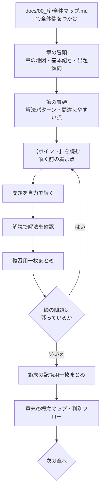

# 生保数理　論点別過去問学習テキスト

日本アクチュアリー会　第1次試験「生保数理」の出題論点を **年度順ではなく分野別・論点別に再配列** した学習テキストです。

このテキストは「解答集」ではありません。目的はただ一つ、

> **問題文を読んだ瞬間に、分野・問われている量・注目すべき条件・使う公式・解く順番を判断できるようになること**

です。そのために、すべての問題を

```
【この問題で押さえるべきポイント】 → 【問題】 → 【解説】
```

の順で掲載し、**「ポイント」を必ず問題文の直前に置いています**。解いた後に読む解説ではなく、
解く前に頭の中で確認すべき事項を言語化したものが「ポイント」です。

またこのテキストは、文章と数式だけを追う構成にしていません。時間軸図・キャッシュフロー図・
状態遷移図・判別フローチャート・比較表・式の構造分解を **理解の入口** として全面的に使用しています。

---

## 目次

### 序

| ファイル | 内容 |
|---|---|
| [`docs/00_序/本書の使い方.md`](docs/00_序/本書の使い方.md) | 学習手順、記号の読み方、1問あたりの標準学習時間 |
| [`docs/00_序/全体マップ.md`](docs/00_序/全体マップ.md) | 全10章の関係図と学習ルート（最重要） |

### 設計資料（作成過程の記録・読み飛ばし可）

| ファイル | 内容 |
|---|---|
| [`docs/01_設計/論点分類表.md`](docs/01_設計/論点分類表.md) | 全収録問題の分野・論点・使用公式・難易度・発展関係の一覧 |
| [`docs/01_設計/章節設計方針.md`](docs/01_設計/章節設計方針.md) | なぜこの章立てにしたかの設計根拠 |
| [`docs/01_設計/掲載フォーマット仕様.md`](docs/01_設計/掲載フォーマット仕様.md) | 章・節・問題のテンプレート定義 |

### 本文

| 章 | 表題 | 扱う中心概念 |
|---|---|---|
| 第1章 | [利息の理論と現価計算](docs/02_本文/第01章_利息の理論と現価計算.md) | $i,\ d,\ \delta,\ v$ / 確定年金 |
| 第2章 | [生命表と生存分布](docs/02_本文/第02章_生命表と生存分布.md) | $l_x,\ {}_tp_x,\ \mu_x,\ \mathring e_x$ |
| 第3章 | [一時払純保険料](docs/02_本文/第03章_一時払純保険料.md) | $A_x,\ A^1_{x:\overline{n}\|},\ {}_nE_x,\ \bar A_x$ |
| 第4章 | [生命年金](docs/02_本文/第04章_生命年金.md) | $\ddot a_x,\ a_x,\ \bar a_x,\ \ddot a_x^{(m)}$ |
| 第5章 | [平準純保険料](docs/02_本文/第05章_平準純保険料.md) | 収支相等 / $P_x$ / 自然保険料 |
| 第6章 | [責任準備金](docs/02_本文/第06章_責任準備金.md) | 将来法・過去法 / Fackler / Thiele |
| 第7章 | [営業保険料と実務計算](docs/02_本文/第07章_営業保険料と実務計算.md) | 予定事業費 / チルメル / 契約変更 |
| 第8章 | [連生と最終生存](docs/02_本文/第08章_連生と最終生存.md) | $\ddot a_{xy},\ \ddot a_{\overline{xy}}$ / Gompertz |
| 第9章 | [多重脱退・就業不能と多状態モデル](docs/02_本文/第09章_多重脱退と多状態モデル.md) | $q_x^{(j)}$ / 就業不能 / 払込免除 |
| 第10章 | [総合応用と収支分析](docs/02_本文/第10章_総合応用と収支分析.md) | 複合給付の分解 / 利源分析 |

### 巻末

| ファイル | 内容 |
|---|---|
| [`docs/03_巻末/記号一覧.md`](docs/03_巻末/記号一覧.md) | 二見記法に準拠した記号総覧 |
| [`docs/03_巻末/公式総覧.md`](docs/03_巻末/公式総覧.md) | 章横断の公式集（成立条件つき） |
| [`docs/03_巻末/問題判別フロー集.md`](docs/03_巻末/問題判別フロー集.md) | 「この問題は何章か」を決めるフローチャート |

---

## 出典情報について（重要・必読）

本テキストの作成時点で、リポジトリ内に **過去問の原文・出題年度・問題番号・公式解答を格納した
ファイルは存在しませんでした**。

このため、各問題の掲載方針を次のとおりとしています。

| 項目 | 本テキストでの扱い |
|---|---|
| 分野・論点・解法・難易度 | 生保数理の実際の出題論点・出題形式に忠実に作成 |
| 問題文 | **原文の転記ではなく、当該論点の典型出題形式に沿って作成した再現題** |
| 出題年度・問題番号 | **`要照合` と表示し、空欄として保持**（公式問題集で確認して記入する欄） |
| 数値解答 | **すべて `tools/` の Python コードで機械検算済み**（下記参照） |

> **なぜ年度を書かないのか**
> 記憶に頼って「2008年度 問題1」のような出典を付すと、誤った出典表示（存在しない対応関係）を
> 生む恐れがあります。数値・添字・支払時点の転記精度を要求する本テキストの品質方針と矛盾するため、
> 出典欄は意図的に空欄としました。
>
> **原文データをお持ちの場合**
> 日本アクチュアリー会公式の過去問PDF等を `data/` 配下に置いていただければ、
> 1. 各再現題を原文へ差し替え、
> 2. 出題年度・問題番号を埋め、
> 3. 実際の出題頻度にもとづいて節内の問題数・配列を再調整
>
> することができます。章立て・節構成・掲載フォーマットはそのまま流用できる設計です。

各問題の冒頭メタ情報には、照合作業のためのチェック欄を設けています。

```
- 出題年度：`要照合` （記入欄：______年度）
- 問題番号：`要照合` （記入欄：問題___）
```

---

## 数値の検算について

本テキストの数値問題は、問題文中に与えられた値のみから解けるよう作られています。
ただし「与えられた値どうしが数理的に矛盾していないこと」を保証するため、
すべての例示数値を単一の基礎率から生成しています。

**標準例示基礎率**

$$\mu_x = A + Bc^x,\qquad A = 0.0008,\quad B = 0.00001,\quad c = 1.11,\qquad \omega = 115$$

利率は $i = 0.03$ を標準とし、問題により $i = 0.05$ 等も使用します。

この基礎率は次の整合性を満たすことを確認済みです。

| 検証項目 | 結果 |
|---|---|
| $A_x = 1 - d\,\ddot a_x$ | 誤差 $10^{-16}$ 未満 |
| $\bar A_x = 1 - \delta\,\bar a_x$ | 誤差 $10^{-15}$ 未満 |
| 将来法責任準備金 $=$ 過去法責任準備金 | 誤差 $10^{-15}$ 未満 |
| $\bar A_x / A_x \approx i/\delta$（UDD） | $1.01486$ vs $1.01493$ |
| $\mathring e_x \approx e_x + 1/2$ | $42.664$ vs $42.664$ |
| $\omega$ までの生存確率 | $< 10^{-6}$（打切りの影響なし） |

**検算の実行**

```bash
python3 tools/verify.py
```

`tools/verify.py` は、本文に記載した主要な数値（各問題の最終解答・章をまたいで
参照される中間値・恒等式による検算）を `tools/basis.py` から独立に再計算し、
本文の値と照合します。現在 **71 項目** を検査しており、全件一致で終了コード `0`、
1 件でも不一致があれば差分を表示して `1` を返します。

```bash
python3 tools/verify.py -v   # 一致したものも含めて全件表示
```

`tools/basis.py` は基礎率と保険数理関数の定義本体です。本文の数値を書き換えた場合は、
`tools/verify.py` の期待値も併せて更新してください。

---

## 学習の進め方



**重要**：問題は必ず「ポイント」を読んだあと、解説を見る前に自力で解いてください。
このテキストの狙いは解法の暗記ではなく、**解く前に方針を立てられるようになること** です。

各節の問題は年度順ではなく **概念の発展順** に並んでいます。飛ばさず順に進めてください。

---

## ライセンス・注意

* 本テキストは学習用の私的教材です。
* 問題文は再現題であり、日本アクチュアリー会の公式問題文そのものではありません。
* 記号は二見隆『生命保険数学』の表記に準拠しています（[記号一覧](docs/03_巻末/記号一覧.md)参照）。
