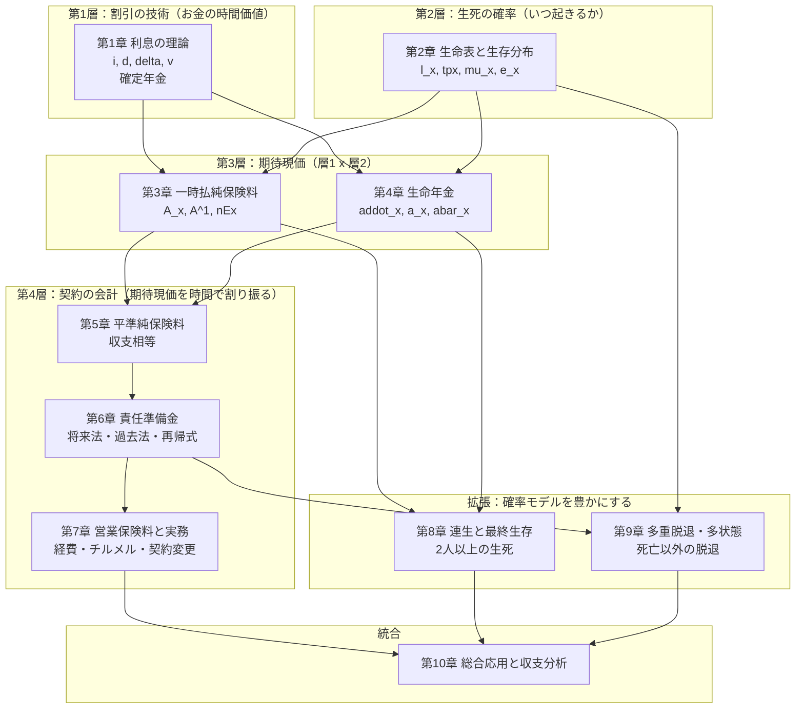
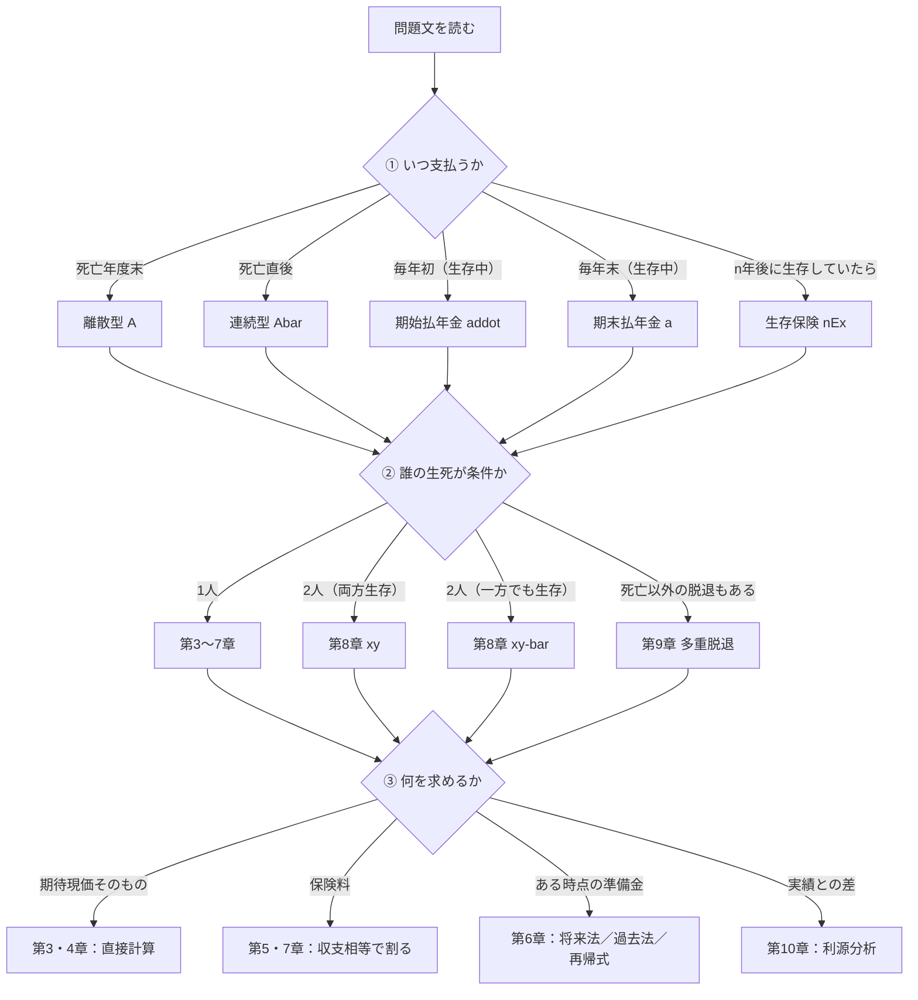

# 全体マップ — 生保数理はどういう構造の分野か

**最初にこのページを読んでください。** 生保数理は公式の数が多く見えますが、
実際には **4つの層が順に積み上がっているだけ** です。この構造を先に頭に入れると、
以降の章がすべて「どの層の話か」で整理できます。

---

## 1. 生保数理の4層構造



この図が示すこと。

* **第1章と第2章は道具**であり、それ自体が目的ではありません。ただし**ここが弱いと第3章以降が全部崩れます**。
* **第3章・第4章が本体**です。「期待現価 ＝ 給付額 × 発生確率 × 現価率 の総和」という**唯一の原理**を、
  給付の形を変えながら繰り返し適用しているだけです。
* **第5章〜第7章は、第3・4章で計算した期待現価を時間軸上に配分する話**です。
  新しい確率の話は出てきません。出てくるのは「いつ・いくら」の割り振り方だけです。
* **第8章・第9章は、第2章の確率モデルを拡張して第3〜6章をやり直す話**です。
  だから第8・9章の公式は第3〜6章と**形がそっくり**です。$x$ が $xy$ に、$q_x$ が $q^{(j)}_x$ に
  置き換わっただけのものが大半です。

---

## 2. 全分野を貫く唯一の原理

生保数理の計算問題は、ほぼすべてこの1行に還元されます。

```text
                期待現価  =  Σ ( 給付額 × その時点で給付が発生する確率 × その時点までの現価率 )
                             |      |                    |                        |
                             |      |                    |                        └─ 第1章（v^t, e^{-delta t}）
                             |      |                    └─ 第2章（tpx, t|qx, mu_x）
                             |      └─ 問題文が与える（1, S, 逓増, 逓減...）
                             └─ 給付発生時点ごとに分解する（これが解法の第一歩）
```

したがって、**どんな問題でも最初にやることは同じ**です。

1. 給付（および保険料）が **いつ** 発生するかを列挙する
2. 各時点で発生する **確率** を書く
3. 各時点までの **現価率** を掛ける
4. 足す（または積分する）
5. 保険数理記号に **まとめる**

この5手順を、本テキストでは全章で共通の STEP として使います。

---

## 3. 「解く前の判断」を支える3つの問い

問題文を読んだ瞬間に、次の3つを決めます。この3つが決まれば公式は自動的に決まります。



**この図が本テキストの背骨です。** 各章の冒頭で、この図の該当部分を拡大して再掲します。

---

## 4. 混同しやすいペアの早見表

生保数理で失点する原因は、公式を知らないことより **似た概念の取り違え** です。
学習を始める前に、この表の「識別語」の列だけ眺めておいてください。

| 混同ペア | 問題文中の識別語 | 記号の違い | 決定的な違い |
|---|---|---|---|
| 期始払 / 期末払 | 「毎年初」／「毎年末」「年度末」 | $\ddot a$ / $a$ | $\ddot a_x = 1 + a_x$（1回分の差） |
| 死亡年度末払 / 死亡直後払 | 「死亡年度末」／「死亡直後」「死亡と同時」 | $A$ / $\bar A$ | UDD なら $\bar A = \frac{i}{\delta}A$ |
| 定期保険 / 生存保険 | 「$n$ 年以内に死亡」／「$n$ 年後に生存」 | $A^1_{x:\overline{n}\vert}$ / ${}_nE_x$ | 上付き $1$ の位置 |
| 養老保険 / 定期保険 | 「満期保険金あり」／「満期金なし」 | $A_{x:\overline{n}\vert}$ / $A^1_{x:\overline{n}\vert}$ | ${}_nE_x$ の有無 |
| 終身払 / 短期払 | 「一生涯払う」／「$h$ 年間払う」 | $P_x$ / ${}_hP_x$ | 分母が $\ddot a_x$ か $\ddot a_{x:\overline{h}\vert}$ |
| 将来法 / 過去法 | — | どちらも ${}_tV$ | 一致する（値は同じ・計算経路が違う） |
| 純保険料式 / チルメル式 | 「純保険料式」／「チルメル」 | ${}_tV$ / ${}_tV^{Z}$ | $\alpha$ の償却の有無 |
| 同時生存 / 最終生存 | 「2人とも生存している間」／「いずれか生存している間」 | $\ddot a_{xy}$ / $\ddot a_{\overline{xy}}$ | 和は $\ddot a_x + \ddot a_y$ |
| 多重脱退率 / 絶対脱退率 | 「この表における」／「他の原因がないとしたときの」 | $q^{(j)}_x$ / $q'^{(j)}_x$ | 前者 $<$ 後者 |
| 離散 / 連続 | 「年度末」／「直後」「連続的に」 | 上線の有無 | 和 か 積分 か |

---

## 5. 学習ルート

### 標準ルート（初学者・全体を初めて通す場合）

第1章 → 第2章 → 第3章 → 第4章 → 第5章 → 第6章 → 第7章 → 第8章 → 第9章 → 第10章

**第1章と第2章を飛ばさないこと。** 第6章以降で行き詰まる人の大半は、
$d$ と $i$ の区別、${}_{t\vert}q_x$ の意味、$v^{t}$ と $v^{t+1}$ の使い分けが曖昧なままです。

### 短縮ルート（一度学習済みで、直前に論点を確認する場合）

各章冒頭の「章の地図」と各節末の「記憶用の一枚まとめ」だけを通読 →
★★★ の問題のみ解く → 詰まった節に戻る

### 弱点別ルート

| 症状 | 進む場所 |
|---|---|
| 記号の意味が思い出せない | [記号一覧](../03_巻末/記号一覧.md) → 第3章第1節 |
| どの公式を使うか判断できない | [問題判別フロー集](../03_巻末/問題判別フロー集.md) → 各章冒頭の「サイン」 |
| 責任準備金でいつも符号を間違える | 第6章第1節 → 第6章第2節 |
| 連生の記号が区別できない | 第8章第1節・第2節（包除原理だけ理解すれば足りる） |
| 記述式の答案が書けない | 各問題の「試験答案としての書き方」だけを通読 |

---

## 6. 章ごとの学習量の目安

| 章 | 問題数 | 標準学習時間 | 優先度 |
|---|---|---|---|
| 第1章 利息の理論 | 5 | 3 時間 | 高（土台） |
| 第2章 生命表 | 6 | 4 時間 | 高（土台） |
| 第3章 一時払純保険料 | 6 | 5 時間 | **最高** |
| 第4章 生命年金 | 5 | 4 時間 | **最高** |
| 第5章 平準純保険料 | 4 | 3 時間 | 高 |
| 第6章 責任準備金 | 6 | 6 時間 | **最高** |
| 第7章 営業保険料と実務 | 5 | 4 時間 | 中 |
| 第8章 連生と最終生存 | 5 | 4 時間 | 中 |
| 第9章 多重脱退・多状態 | 5 | 5 時間 | 中 |
| 第10章 総合応用 | 3 | 3 時間 | 中 |
| 合計 | **50** | **41 時間** | |

第3・4・6章が配点上も学習効率上も中心です。時間が限られる場合はここに厚く配分してください。
