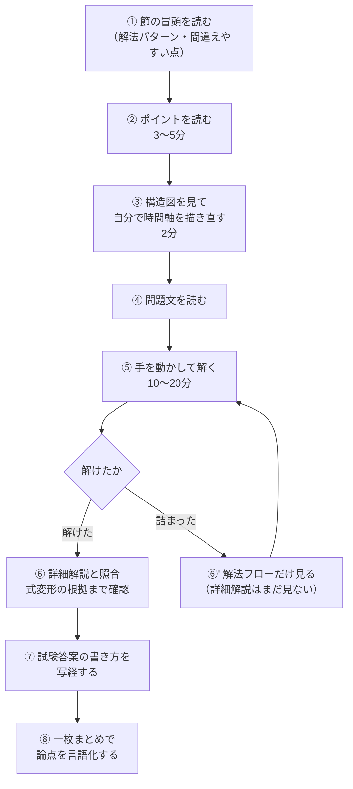
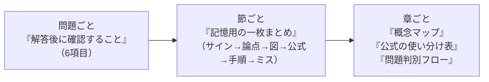

# 本書の使い方

---

## 1. このテキストが解決しようとしている問題

過去問集を年度順に解いていくと、次の状態に陥りがちです。

```text
解答を読む  →  「なるほど分かった」  →  次の問題へ  →  試験本番で手が止まる
                                                        ↑
                                         「解答を理解する力」は付いたが
                                         「解答を思いつく力」が付いていない
```

原因は、**解答を読む前に自分で方針を立てる工程が抜けている**ことです。
解答を読んで理解できるのは当然で、それは試験で必要な能力とは別物です。

そこで本書は、すべての問題を次の順で配置しました。

```text
【この問題で押さえるべきポイント】  ← 解く前に読む。方針を立てる材料だけを与える（答えは書かない）
            ↓
【問題】                          ← 自力で解く
            ↓
【解説】                          ← 自分の方針と照合する
```

「ポイント」は **答えの要約ではありません。** 問題文を読んだ受験者が、
解き始める前に頭の中で確認すべき事項を言語化したものです。
ここに答えを書いてしまうと本書の目的が失われるため、
**ポイントには最終的な数値・結論を一切書いていません。**

---

## 2. 1問あたりの標準的な進め方



**⑤で詰まったら、すぐ詳細解説を見ないこと。** まず「解法フロー」（STEP の見出しだけ）を見て、
再度自力で進めてください。この一手間が解法選択力に直結します。

**⑦の写経は省略しないでください。** 生保数理の記述式は、正しい答えに到達しても
論理の飛躍があると減点されます。「試験答案としての書き方」は、
学習用の補足を削り、**答案に残すべき式と説明だけ**を示した部分です。

---

## 3. 各要素の役割

| 要素 | 読むタイミング | 役割 |
|---|---|---|
| 章の冒頭 | 章の学習開始時 | 分野全体の地図。ここで「何と何がつながるか」を把握 |
| 節の冒頭 | 節の学習開始時 | 個別論点の解法パターン。**再利用できる手順**を提示 |
| メタ情報表 | 問題ごと | 難易度と位置づけ。飛ばすかどうかの判断に使う |
| **ポイント** | **問題文の前** | **解く前の着眼点。本書の中心** |
| 構造図 | 問題文の前後 | 問題を数理モデルに変換する足がかり |
| 問題文 | — | 再現題（[出典の注意](../../README.md#出典情報について重要必読)参照） |
| 数理モデル変換表 | 問題文の直後 | 日本語 → 保険数理記号 の翻訳訓練 |
| 解法フロー | 詰まったとき | STEP の見出しのみ。ヒントとして使う |
| 詳細解説 | 解いた後 | 途中式を省略しない展開 |
| 答え | — | 丸め方・単位まで含む |
| 試験答案 | 解いた後 | 写経して答案の型を身につける |
| 一枚まとめ | 解いた直後と復習時 | 6項目の固定フォーマット |
| 節末の一枚まとめ | 節の終了時・復習時 | 節全体を1枚で想起する |
| 章末の概念マップ | 章の終了時・復習時 | 公式の使い分け表と判別フロー |

---

## 4. 図の読み方

### 時間軸図

全章で記号を統一しています。**矢印の向きは常に「保険会社の収支」基準**です。

```text
時点       0        1        2        3       ...       n
           |--------|--------|--------|-------...-------|
保険料 P   ^P       ^P       ^P                              ← ^ ＝ 会社への収入
死亡給付            vS       vS       vS      ...      vS    ← v ＝ 会社からの支出
満期給付                                              vS
評価時点   *                                                 ← * ＝ 評価時点
生存条件   [------------- 生存している限り -------------]      ← [ ] ＝ 条件の継続区間
```

| 記号 | 意味 |
|---|---|
| `^` | 保険会社への**収入**（保険料） |
| `v` | 保険会社からの**支出**（給付） |
| `*` | **評価時点**（現価・責任準備金の基準時点） |
| `[ ]` | 条件が有効な**区間** |
| `#` | **死亡・脱退**の発生時点 |
| `//` | 期間の**省略** |

図の直下には必ず「この図がどの数式に対応するか」を書いています。
**図だけで判断せず、対応する数式まで確認してください。**

### 数式の構造分解

長い式は、項ごとにラベルを付けて意味を対応させています。

```text
収支相等：   P * addot_{x:h}      =      A^1_{x:n}    +    nEx
             |     |                     |                |
             |     |                     |                └─ 生存給付（満期保険金）
             |     |                     └─ 死亡給付
             |     └─ 払込時点 × 生存確率 × 現価率
             └─ 未知数（求める保険料）
```

### 式変形の表示

矢印の横に「何をしたか」を書いています。**この矢印のラベルだけを追えば解法が再現できます。**

```text
元の式
  ↓ 給付を発生年度ごとに分解
和の形
  ↓ 各年度の据置死亡確率 t|qx を代入
確率表示
  ↓ 保険数理記号へまとめる
最終式
```

---

## 5. 記号について

記号は二見隆『生命保険数学』に準拠しています。
**迷ったら必ず [記号一覧](../03_巻末/記号一覧.md) に戻ってください。**

特に次の4点は、位置で意味が変わるため注意が必要です。

| 見る場所 | 区別されるもの | 例 |
|---|---|---|
| 上線 $\bar{\ }$ | 連続型 か 離散型 か | $\bar A_x$ / $A_x$ |
| 2点 $\ddot{\ }$ | 期始払 か 期末払 か | $\ddot a_x$ / $a_x$ |
| 上付き $1$ の位置 | 死亡給付 か 生存給付 か | $A^1_{x:\overline{n}\vert}$ / $A_{x:\overline{n}\vert}^{\ \ 1}$ |
| 上付き $(m)$ | 年1回 か 年 $m$ 回 か | $\ddot a_x$ / $\ddot a^{(m)}_x$ |

問題文が別の記号を使っている場合は、**原文どおり掲載** したうえで直後に対応表を置いています。
原文の記号を自分の記法に翻訳する作業自体が試験対策になるため、統一していません。

---

## 6. 数値の扱い

* 数値解答は原則 **小数第4位まで**、保険料・責任準備金は **保険金額1に対する値** で示します。
* 保険金額が $S$ の場合は $S$ 倍すればよいことを毎回明示しています。
* 丸めは **最終結果でのみ** 行い、途中計算では丸めません（途中で丸めると再現しない旨を注記）。
* 本文の数値解答はすべて `tools/verify.py` で機械検算しています。

```bash
python3 tools/verify.py    # 全数値解答の再計算と照合
```

---

## 7. 復習の設計

本書には3層の復習装置を組み込んでいます。**復習時は本文を読み返さず、この3つだけを見てください。**



| 復習のタイミング | 見るもの | 所要時間 |
|---|---|---|
| 解いた直後 | 問題ごとの一枚まとめ | 2 分 |
| 節を終えた日 | 節末の一枚まとめ | 5 分 |
| 1週間後 | 節末の一枚まとめ ＋ ★★★ の問題を解き直す | 20 分／節 |
| 章を終えた時 | 章末の概念マップ・判別フロー | 15 分 |
| 直前期 | 全章の章末ページのみ通読 | 3 時間 |

---

## 8. 問題IDの規則

```text
Q3-2-1
 │ │ │
 │ │ └─ 節内の何問目か（節内の配列順＝概念の発展順。年度順ではない）
 │ └─── 節番号
 └───── 章番号
```

問題間の参照はすべてこのIDで行います。
`発展元` は先に理解しておくべき問題、`後続` はその考え方を使う後の問題です。

全問題の一覧・分野・使用公式・発展関係は [論点分類表](../01_設計/論点分類表.md) にまとめてあります。

---

## 9. 注意：問題文の出典について

本テキストの問題文は **再現題** であり、日本アクチュアリー会の公式問題文そのものではありません。
出題年度・問題番号の欄は `要照合` として空欄にしています。
理由と、原文データをお持ちの場合の差し替え方法は [README の出典情報](../../README.md) を参照してください。

**論点・解法・難易度・出題形式は実際の出題に忠実です。** 学習効果は損なわれませんが、
「この論点は○○年度に出た」という年度単位の情報が必要な場合は、
公式問題集と併用してください。
