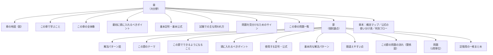

# 掲載フォーマット仕様

章・節・問題の3階層それぞれについて、記載すべき要素を定義します。
本文はこの仕様に従って作成されており、全章で構成が統一されています。

---

## 1. 全体の階層



---

## 2. 問題1問の掲載順（固定）

**この順序は全問題で例外なく守ります。** 特に「ポイント」は必ず問題文の**前**に置きます。

```
### 問題 QX-Y-Z　〈内容を表す短いタイトル〉

  ┌ メタ情報表（出典・分野・難易度・位置づけ・関連問題）
  │
  ├─ ■ この問題で押さえるべきポイント
  │   ├ ① 何を問う問題か
  │   ├ ② 問題文から読み取るべき条件
  │   ├ ③ 最初に注目する場所
  │   ├ ④ 呼び出すべき知識（＋なぜ使うか）
  │   ├ ⑤ 解法の骨格
  │   ├ ⑥ 間違えやすい点
  │   └ ⑦ この問題を一言で捉えると
  │
  ├─ ■ 問題の構造図        ← 図（時間軸／状態遷移／比較表／分岐図）
  │
  ├─ ■ 問題              ← 問題文
  │
  ├─ ■ 問題文を数理モデルへ変換  ← 表
  │
  ├─ ■ 解法フロー          ← STEP の一覧図
  │
  ├─ ■ 詳細解説            ← STEP 1, 2, 3, … 形式
  │   ├ STEP n の目的（一文）
  │   └ 途中式を省略しない展開
  │
  ├─ ■ 答え
  │
  ├─ ■ 試験答案としての書き方   ← 補足を削った簡潔版
  │
  └─ ■ 解答後に確認すること     ← 復習用一枚まとめ
```

### メタ情報表のフォーマット

| 項目 | 記載内容 |
|---|---|
| 出題年度 | `要照合`（記入欄：______年度） |
| 問題番号 | `要照合`（記入欄：問題___） |
| 分野・論点 | 大分野 ／ 小分野 |
| 難易度 | ★ ／ ★★ ／ ★★★ |
| この節での位置づけ | 5段階のどこか＋前問との関係を一文で |
| 関連する問題 | 発展元 → 本問 → 後続 |

### 「解答後に確認すること」の6項目（固定）

1. この問題で最も重要なポイント
2. 最初に気づくべきだった条件
3. 他の問題にも使える考え方
4. 類似問題との違い
5. 条件が変わった場合に変化する部分
6. 復習時に最低限思い出すべき内容

---

## 3. ビジュアルの使用ルール

### 3.1 図の選択基準

| 問題の性質 | 使用する図 |
|---|---|
| 時点が重要 | 時間軸 |
| 給付が複数ある | キャッシュフロー図 |
| 状態が複数ある | 状態遷移図（Mermaid） |
| 概念の使い分けが重要 | 比較表 |
| 解法選択が難しい | 判断フローチャート（Mermaid） |
| 数式が複雑 | 式の構造分解図 |
| 類題との関係が重要 | 問題系統図（Mermaid） |

装飾目的の図は作りません。すべての図は上記いずれかの目的をもちます。

### 3.2 時間軸図の記法（全章統一）

```text
時点       0        1        2        3       ...       n
           |--------|--------|--------|-------...-------|
保険料 P   ^P       ^P       ^P                              ← 上向き矢印 ^ ＝ 保険会社への収入
死亡給付            vS       vS       vS      ...      vS    ← 下向き矢印 v ＝ 保険会社からの支出
満期給付                                              vS
評価時点   *                                                 ← * ＝ 責任準備金の評価時点
生存条件   [------- 生存している限り -------]                  ← [ ] ＝ 条件の継続区間
```

**記号の意味（全章で固定）**

| 記号 | 意味 |
|---|---|
| `^` | 保険会社への **収入**（保険料） |
| `v` | 保険会社からの **支出**（給付） |
| `*` | **評価時点**（責任準備金・現価の基準時点） |
| `[ ]` | 条件が有効な **区間** |
| `#` | **死亡・脱退** の発生時点 |
| `|` | 年度の **境界** |
| `//` | 期間の **省略** |

矢印の向きは常に「会社の収支」基準です。被保険者側から見た向きに変えることはしません。

### 3.3 色の用途（固定）

Markdown 本文では色を使わず、**ラベルと記号で区別** します（白黒印刷対応）。
図に色を付けられる形式に変換する場合は、次の対応を守ってください。

| 用途 | 色 | 併用するラベル・記号 |
|---|---|---|
| 保険料 | 青系 | `^P` |
| 給付 | 赤系 | `vS` |
| 生存条件 | 緑系 | `[生存]` |
| 死亡・脱退条件 | 橙系 | `#` |
| 評価時点 | 紫系 | `*` |
| 注意点・典型的ミス | 黄系 | `⚠` |

**色だけに意味を持たせません。** 上表のとおり必ずラベル・記号を併記します。

### 3.4 数式の構造分解の記法

```text
収支相等：   P * addot_{x:h}      =      A_{x:n}
             |     |                     |
             |     |                     └─ 給付の期待現価
             |     └─ 払込時点 × 生存確率 × 現価率
             └─ 未知数（求める保険料）
```

長い数式は、項ごとにラベルを付けて「どの項が保険料／死亡給付／生存給付／割引／確率か」を対応させます。

### 3.5 式変形の表示

途中式を縦に並べるだけにせず、**変化した箇所を矢印の横に書きます**。

```text
元の式
  ↓ 給付を発生年度ごとに分解
和の形
  ↓ 各年度の死亡確率 _t|q_x を代入
確率表示
  ↓ 保険数理記号へまとめる
最終式
```

### 3.6 Mermaid 使用上の注意

* ノードラベルは必ず `["..."]` の形で引用符に入れる（括弧・記号による構文エラー回避）
* ラベル内では LaTeX を使わず、`addot_x` `A_x` のようなプレーン表記を使う
* 1つの図のノードは概ね 10 個以内に抑える
* 図の直後に、必ず「何を示した図か」を1〜2文で説明する

---

## 4. 表記方針（§10 の実装）

| 方針 | 具体的な運用 |
|---|---|
| 記号は二見隆『生命保険数学』に準拠 | [`記号一覧`](../03_巻末/記号一覧.md) を唯一の基準とする |
| 数式は LaTeX | 行内 `$...$`、独立行 `$$...$$` |
| 原文の記号を尊重 | 問題文で別記号なら原文どおり書き、直後に二見記法との対応表を置く |
| 数式の直後に日本語説明 | 独立行の数式には原則1文の意味説明を付す |
| 離散型と連続型を区別 | 連続型は必ず上線（$\bar A_x,\ \bar a_x$）を付す |
| 期始払と期末払を区別 | 期始払は必ず2点（$\ddot a$）、期末払は無印（$a$） |
| 生存給付と死亡給付を区別 | 死亡給付は $A^1$、生存給付は ${}_nE_x$ または $A^{\ \ 1}$ |
| 給付時点と評価時点を区別 | 時間軸図で `v`（給付）と `*`（評価）を別記号にする |
| 独自の用語を作らない | 教科書用語のみ使用。説明の便宜上の呼び名には「本書では〜と呼ぶ」と明記 |
| 説明を省略しない | 「明らか」「容易に分かる」を使わず、必ず理由を書く |

---

## 5. 品質確認チェックリスト（§11 の実装）

各問題の作成時に次を確認します。

| # | 確認項目 | 確認方法 |
|---|---|---|
| 1 | 問題と解答が対応しているか | 問題文の「求めるもの」と答えの量が一致するか目視 |
| 2 | 数値・添字に誤りがないか | 添字の年齢・期間を時間軸図と突き合わせ |
| 3 | 使用した公式の条件を満たしているか | UDD・独立性・利率一定などの前提を明記したか |
| 4 | 支払時点にずれがないか | 期始／期末、死亡年度末／死亡直後を時間軸図で確認 |
| 5 | 生存・死亡確率の期間にずれがないか | ${}_tp_x$ の $t$ と現価率の指数を対応表で確認 |
| 6 | 現価係数の指数にずれがないか | 死亡年度末払は $v^{t+1}$、生存は $v^t$ |
| 7 | 収支相等が正しく設定されているか | 左辺＝保険料現価、右辺＝給付現価、評価時点が同一か |
| 8 | 責任準備金の評価時点が正しいか | $t$ 年度末（保険料払込直前／直後）を明記 |
| 9 | 最終的な数値解答が妥当か | `tools/verify.py` で独立に再計算 |
| 10 | 独自の説明・用語に誤りがないか | 教科書の定義と突き合わせ |

**9 の運用**：本文に載せた数値解答はすべて `tools/verify.py` に登録し、
`tools/basis.py` の関数で独立に計算した値と照合しています。
本文の値と計算値が一致しない場合、テストが失敗します。
