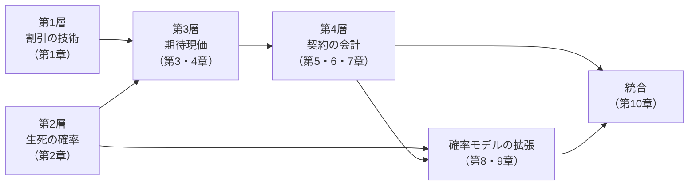
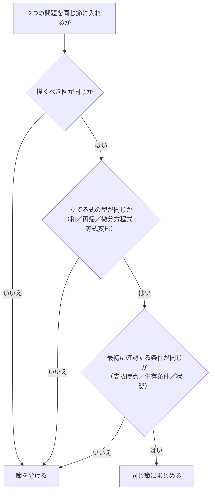

# 章節設計方針 — なぜこの章立てにしたか

既存の教材の見出し構造や掲載順を踏襲せず、本テキストの目的
（**解く前に方針を立てられるようになること**）に最も適した構成を新規に設計しました。
その設計判断の根拠を記録します。

---

## 1. 設計の出発点：何を基準に章を切るか

章立てには少なくとも4つの選び方があります。それぞれの得失を検討しました。

| 案 | 切り方 | 利点 | 欠点 | 採否 |
|---|---|---|---|---|
| A | 年度順 | 出典が明確 | 論点が散らばり、体系が見えない | 却下（本テキストの目的に反する） |
| B | 商品別（終身・定期・養老・年金…） | 実務のイメージに近い | 同じ計算を商品ごとに繰り返す。責任準備金がどの商品にも属して重複 | 却下 |
| C | 数学的操作別（和・積分・微分方程式…） | 解法が統一される | 「終身保険はどこ？」が分からず引きにくい | 却下 |
| D | **概念の依存関係順（積み上げ順）** | 前章が後章の前提になり、飛ばせない構造を作れる | 章の粒度設計が難しい | **採用** |

**採用理由**：本テキストの目的は「解く前の判断」を育てることです。
判断には「この問題はどの層の話か」の見極めが必要で、それには
**概念の依存関係が章の順序として体に入っていること** が最も効きます。

案 D を採ったことで、次の性質が得られました。

* 第 $k$ 章を解くのに必要な知識は、すべて第 $k-1$ 章までに登場している
* したがって「詰まったら前の章に戻る」という復習経路が一意に決まる
* 各章の冒頭で「前章の何をどう使うか」を必ず書ける

---

## 2. 4層構造への分解

依存関係を整理すると、生保数理は次の4層に分かれます。



この4層を章に割り当てた結果が全10章です。

| 層 | 章 | この層の「新しさ」 |
|---|---|---|
| 1 | 第1章 | 時間による価値の変換だけ。確率は出てこない |
| 2 | 第2章 | 確率だけ。お金は出てこない |
| 3 | 第3・4章 | 層1 × 層2。**ここが本体** |
| 4 | 第5・6・7章 | 新しい確率は出てこない。層3の結果を時間軸に配分する |
| 拡張 | 第8・9章 | 層2を拡張して層3・4をやり直す |
| 統合 | 第10章 | 全層の複合 |

**重要な設計判断**：第5〜7章に「新しい確率概念は登場しない」ことを明示的に設計に組み込みました。
受験者はしばしば責任準備金を「新しい難しい概念」と受け取りますが、実際には
第3・4章で計算した期待現価を引き算しているだけです。この見立てを章冒頭で毎回強調します。

---

## 3. 第3章と第4章を分けた理由

保険（$A$）と年金（$\ddot a$）は $A_x=1-d\ddot a_x$ で直結しており、1章にまとめる案もありました。
分けた理由は次の3点です。

1. **描く図が違う**。保険は「1回だけ発生する給付」＝時間軸上の1点、
   年金は「生存中ずっと発生する給付」＝時間軸上の点列。図が違えば節を分ける、という本テキストの基準に従いました。
2. **確率が違う**。保険は死亡確率 ${}_{t\vert}q_x$、年金は生存確率 ${}_tp_x$ を使います。
   これは初学者の最大の混同源であり、**分けて反復してから関係式でつなぐ**方が定着します。
3. **順序に意味がある**。保険を先に置くと、年金を「保険から導ける量」として扱えます
   （Q4-1-2 が Q3-1-2 の後続になる）。逆順にすると、この依存が逆流します。

そのうえで、両章をつなぐ問題（Q3-1-2 → Q4-1-2）を配置し、
「別物ではなく同じものの言い換え」であることを必ず経験させる設計にしています。

---

## 4. 第6章を4節に分けた理由

責任準備金は本テキストで最も節数が多い章（4節）です。細分化を避ける原則に反しますが、
**計算の道具立てが節ごとに完全に違う**ため分割しました。

| 節 | 使う道具 | 立てる式 |
|---|---|---|
| 6-1 将来法・過去法 | 期待現価の引き算 | 代数式 |
| 6-2 再帰式 | 1年間の収支の等式 | **漸化式** |
| 6-3 Thiele | 微小時間の収支の等式 | **微分方程式** |
| 6-4 年度中・分割払 | 補間 | 近似式 |

漸化式と微分方程式は、代数式とは思考の型がまったく違います。
同じ節に入れると「どちらで解くべきか」の判断訓練ができないため、分けました。
そのうえで章末に **「将来法か再帰式か Thiele か」の判別フローチャート** を置いています。

---

## 5. 第8章・第9章を後ろに置いた理由

連生・多重脱退は、公式の見た目こそ複雑ですが **論理的には第2章の確率モデルの差し替え** に過ぎません。

```text
第2章：状態が2つ（生存・死亡）      →  第3〜7章
   ↓ 状態を増やす
第8章：状態が4つ（両生存・x のみ・y のみ・両死亡）
第9章：状態が3つ以上（健常・就業不能・死亡・脱退…）
```

そのため、第3〜7章を先に完成させてから拡張する順にしました。
この配置により、第8・9章の各節の冒頭で

> 「第 $k$ 章の $\bigcirc\bigcirc$ で $x$ を $xy$ に置き換えるだけです。異なるのは $\triangle\triangle$ の1点です」

という形で説明でき、**暗記すべき新公式の数を最小化**できます。
実際、第8章第2節は包除原理1つで大半の公式が導けることを示す構成にしています。

---

## 6. 節を細かく分けすぎないための基準

§3 で述べた「解法の骨格が同じなら同じ節」を、次の3条件の一致で運用しました。



### 適用例

| 判断 | 対象 | 理由 |
|---|---|---|
| **まとめた** | 終身・定期・養老・生存保険（→ 第3章第1節） | 図・式の型・確認条件がすべて同じ。給付の有無だけが違う |
| **まとめた** | 期始払・期末払・有期・連続年金（→ 第4章第1節） | 支払時点の列がずれるだけで、和の型は同一 |
| **まとめた** | 最終生存・条件付年金（→ 第8章第2節） | どちらも包除原理で単生命に還元する |
| **分けた** | 逓増・逓減保険（→ 第3章第3節） | 給付額が時点の関数になり、和の分解という別技術を要する |
| **分けた** | Fackler の再帰式（→ 第6章第2節） | 式の型が漸化式で、6-1 の代数式と別 |
| **分けた** | Thiele（→ 第6章第3節） | 式の型が微分方程式 |

結果として **10章29節** ではなく **10章25節**、平均2問／節に収まりました。

---

## 7. 節内の問題配列（5段階）

各節では、問題を年度順ではなく次の段階順に並べます。

| 段階 | 内容 | 節内の役割 |
|---|---|---|
| ① | 定義・基本公式を直接使う | 記号の意味を確定させる |
| ② | 基本公式を変形して使う | 公式が「導けるもの」だと理解させる |
| ③ | 複数の公式・論点を組み合わせる | 論点の接続を経験させる |
| ④ | 問題文の読み替えが必要 | 日本語 → 数理モデルの変換を訓練する |
| ⑤ | 計算量・論理構造が複雑な応用 | 記述式に耐える持久力をつける |

**すべての節に5段階が揃うわけではありません。** 論点の性質上①が存在しない節
（例：第9章第3節 多状態モデルは最初から③以上）もあります。
その場合も段階の順序は保持し、欠けている段階は飛ばします。
各問題のメタ情報に段階の値を明記しているため、配列意図が追えます。

**同じ構造の問題は隣接させ、難易度順に並べます。**
各問題が前の問題から何を発展させたものかが分かるよう、メタ情報の
「この節での位置づけ」に **前問との差分を一文で** 書いています。

例（第8章第2節）：

```text
Q8-2-1（★）  最終生存者年金 ＝ 包除原理の初出
    ↓ 同じ包除原理を、条件付（片方の死亡後のみ支払）へ適用する
Q8-2-2（★★★）条件付年金 ＝ 支払条件が「x の死亡後かつ y の生存中」に複雑化
```

---

## 8. 章冒頭・節冒頭に置く要素の設計根拠

| 要素 | なぜ必要か |
|---|---|
| 章の地図（図） | 「今どこを学んでいるか」を失うと、公式が孤立した暗記対象になる |
| この章で学ぶこと | 分野全体の中での位置を与える |
| この章の全体像 | 論点間の関係。ここが図の本体 |
| 最初に頭に入れるべきポイント | 公式一覧ではなく「何を表す概念か・いつ使うか・何とつながるか」 |
| 基本記号・基本公式 | 成立条件と間違えやすい点を必ず併記（条件を書かない公式表は害になる） |
| 試験での主な問われ方 | 出題形式を先に知ると、読むときの焦点が定まる |
| **問題を見分けるためのサイン** | **本テキストの中核**。問題文のどの語で章を判定するか |
| この章の問題一覧 | 各問題の役割を一言で示し、飛ばす判断を可能にする |

節冒頭は章の説明を繰り返さず、**その節固有の解法パターンと典型的誤り**に絞ります。
特に「基本的な解法パターン」は、節内の全問題で再利用できる手順として書きます
（問題ごとに違う手順を書くと、再利用可能な型になりません）。

---

## 9. ビジュアルを中心に据えた設計

本テキストの学習者はビジュアルシンカー寄りであるため、
図を「解説の補助」ではなく **理解の入口かつ知識の整理手段** として扱います。

具体的な設計ルール：

1. **図を先に、数式を後に。** 各問題は「構造図 → 問題文 → 変換表 → 解法フロー → 数式」の順。
2. **装飾目的の図を作らない。** すべての図は §3.1 の7目的のいずれかに対応させる。
3. **図の記法を全章で統一する。** 時間軸の記号（`^` `v` `*` `[ ]` `#`）は全章共通。
4. **図の直後に必ず説明文を置く。** 図だけで結論が誤解されないようにする。
5. **色に意味を持たせない。** Markdown では記号とラベルで区別し、白黒印刷でも読める。
6. **図と数式の記号を一致させる。** 図に `addot_x` と書いたら本文も $\ddot a_x$。

詳細は [掲載フォーマット仕様](掲載フォーマット仕様.md) §3 を参照してください。

---

## 10. この設計の限界（正直な記録）

| 限界 | 影響 | 緩和策 |
|---|---|---|
| 出題年度・問題番号が空欄 | 年度単位の傾向分析ができない | 照合欄を設け、原文入手後に埋められる構造にした |
| 問題数が50問（全出題数より少ない） | 出題頻度の重みが反映しきれない | 各論点の**典型形**を必ず1問は収録し、抜けをなくした |
| 論点をまたぐ問題の配置が主観的 | 探すとき迷う可能性 | 分類表 §5 に相互参照表を置いた |
| 実際の出題頻度に基づく問題数配分ができない | 章ごとの問題数が均等寄り | 全体マップ §6 に優先度を明示し、学習配分で補った |
