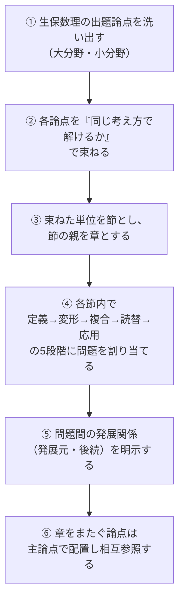

# 論点分類表（全収録問題の設計台帳）

本テキストの章立て・節構成・問題配列は、この分類表にもとづいて決定しています。
本文を読むだけなら不要ですが、**「なぜこの問題がこの位置にあるのか」** を確認したいとき、
あるいは原文データを入手して問題を差し替えるときに参照してください。

---

## 1. 分類の作業手順

機械的に章へ割り振らず、次の順で作業しました。

### 節を束ねる基準

章・節を細かく分けすぎないため、**「解法の骨格が同じなら同じ節」** を基準にしました。
具体的には、次の3つがすべて一致するものを1つの節にまとめています。

1. 描くべき図が同じ（時間軸／状態遷移図／比較表）
2. 立てる式の形が同じ（期待現価の直接計算／再帰式／微分方程式／等式変形）
3. 最初に確認する条件が同じ（支払時点／生存条件／状態）

たとえば「終身保険」「定期保険」「養老保険」「生存保険」は保険の種類としては別ですが、
**いずれも「給付発生時点 × 発生確率 × 現価率の総和」で解ける** ため同一節（第3章第1節）に
まとめています。一方「逓増保険」は給付額が時点の関数になり、和の分解という別の技術を要するため
節を分けています（第3章第3節）。

---

## 2. 難易度の定義

| 表示 | 意味 | 目安 |
|---|---|---|
| ★ | 定義・基本公式を直接使う | 小問（穴埋め）で確実に取るべき |
| ★★ | 基本公式を変形する／2つの論点を組み合わせる | 小問後半・記述式の前半 |
| ★★★ | 複数論点の複合、読み替え、導出・証明、計算量が多い | 記述式の本体 |

---

## 3. 章の設計と大分野の対応

| 章 | 大分野 | 中心となる数学的操作 | 描く図 |
|---|---|---|---|
| 1 | 利息の理論 | 現価率の掛け算と等比級数の和 | 時間軸・キャッシュフロー |
| 2 | 生命表・生存分布 | 生存関数の微分／積分、確率の分解 | 生存曲線・年齢軸 |
| 3 | 一時払純保険料 | 期待値（給付 × 確率 × 現価） | 時間軸＋死亡・生存条件 |
| 4 | 生命年金 | 生存を条件とする和・積分 | 時間軸（支払点列） |
| 5 | 平準純保険料 | 収支相等の等式を未知数で解く | 収支の天秤図 |
| 6 | 責任準備金 | 将来／過去の差、再帰式、微分方程式 | 時間軸＋評価時点 |
| 7 | 営業保険料・実務 | 経費の組み込み、契約変更の等価式 | 保険料の構造分解図 |
| 8 | 連生・最終生存 | 状態の積・和（包除原理） | 2人の生存状態図 |
| 9 | 多重脱退・多状態 | 状態遷移確率、競合リスク | 状態遷移図 |
| 10 | 総合応用・収支分析 | 給付の分解と再構成、差異の要因分解 | 分解ツリー・要因図 |

---

## 4. 収録問題一覧（全50問）

**凡例**
`発展元` … その問題を解く前に理解しておくべき問題
`後続` … その問題の考え方を使う後の問題
`5段階` … 節内配列の段階（1=定義直接／2=公式変形／3=複合／4=読替／5=応用）

### 第1章　利息の理論と現価計算（5問）

| ID | 表題 | 小分野 | 主要公式 | 難 | 5段階 | 発展元 | 後続 |
|---|---|---|---|---|---|---|---|
| Q1-1-1 | 利率・割引率・利力の相互変換 | 利率の換算 | $v=(1+i)^{-1},\ d=iv,\ \delta=\ln(1+i)$ | ★ | 1 | — | Q1-1-2, Q3-1-2 |
| Q1-1-2 | 利力が時間の関数である場合の現価 | 変動利力 | $v(t)=\exp\!\left(-\int_0^t\delta_s ds\right)$ | ★★ | 2 | Q1-1-1 | Q6-3-1 |
| Q1-2-1 | 確定年金の現価と終価の使い分け | 確定年金 | $\ddot a_n=\frac{1-v^n}{d},\ s_n=\frac{(1+i)^n-1}{i}$ | ★ | 1 | Q1-1-1 | Q1-2-2, Q4-1-1 |
| Q1-2-2 | 逓増確定年金 $(I\ddot a)_n$ の導出 | 変動年金 | $(I\ddot a)_n=\frac{\ddot a_n-nv^n}{d}$ | ★★ | 3 | Q1-2-1 | Q3-3-1 |
| Q1-3-1 | 期間により利率が変わる年金 | 利率変動 | 期間分割＋現価率の連鎖 | ★★ | 4 | Q1-2-1 | Q10-2-1 |

### 第2章　生命表と生存分布（6問）

| ID | 表題 | 小分野 | 主要公式 | 難 | 5段階 | 発展元 | 後続 |
|---|---|---|---|---|---|---|---|
| Q2-1-1 | 生命表の基本量の関係 | 生存数・死亡数 | ${}_tp_x=\frac{l_{x+t}}{l_x},\ d_x=l_x-l_{x+1}$ | ★ | 1 | — | Q2-1-2 |
| Q2-1-2 | 据置死亡確率の分解 | 据置死亡確率 | ${}_{t\mid}q_x={}_tp_x\,q_{x+t}$ | ★★ | 2 | Q2-1-1 | Q3-1-1 |
| Q2-2-1 | 死力から生存関数を復元する | 死力 | $\mu_x=-\frac{d}{dx}\ln l_x,\ {}_tp_x=e^{-\int_0^t\mu_{x+s}ds}$ | ★★ | 2 | Q2-1-1 | Q2-2-2, Q6-3-1 |
| Q2-2-2 | Gompertz・Makeham 法則の性質 | 死亡法則 | $\mu_x=A+Bc^x$ | ★★★ | 3 | Q2-2-1 | Q8-3-1 |
| Q2-3-1 | 平均余命の再帰式と $e_x,\ \mathring e_x$ の関係 | 平均余命 | $e_x=p_x(1+e_{x+1}),\ \mathring e_x\approx e_x+\tfrac12$ | ★★ | 3 | Q2-2-1 | Q2-3-2 |
| Q2-3-2 | 端数期間の3つの仮定の比較 | UDD・一定死力・Balducci | ${}_sq_x=s\,q_x$ 等 | ★★★ | 4 | Q2-3-1 | Q3-2-1, Q4-3-1 |

### 第3章　一時払純保険料（6問）

| ID | 表題 | 小分野 | 主要公式 | 難 | 5段階 | 発展元 | 後続 |
|---|---|---|---|---|---|---|---|
| Q3-1-1 | 4種類の保険の期待現価を分解する | 基本形 | $A_{x:\overline{n}\mid}=A^1_{x:\overline{n}\mid}+{}_nE_x$ | ★ | 1 | Q2-1-2 | Q3-1-2, Q5-1-1 |
| Q3-1-2 | $A_x=1-d\ddot a_x$ の導出と応用 | 保険と年金の関係 | $A_x=1-d\,\ddot a_x$ | ★★ | 2 | Q3-1-1, Q1-1-1 | Q4-1-2, Q6-1-3 |
| Q3-2-1 | 連続型と離散型の関係（UDD） | 離散↔連続 | $\bar A_x\approx\frac{i}{\delta}A_x$ | ★★ | 3 | Q2-3-2, Q3-1-1 | Q3-2-2, Q6-3-1 |
| Q3-2-2 | 現価確率変数の分散 | 分散 | $\operatorname{Var}(Z)={}^2\!A_x-(A_x)^2$ | ★★★ | 5 | Q3-2-1 | Q4-1-2 |
| Q3-3-1 | 逓増終身保険 $(IA)_x$ | 変動給付 | $(IA)_x=\sum_{t\ge0}(t+1)v^{t+1}{}_{t\mid}q_x$ | ★★ | 3 | Q1-2-2, Q3-1-1 | Q3-3-2, Q10-1-1 |
| Q3-3-2 | 逓減定期保険と読み替え | 変動給付 | $(DA)^1_{x:\overline{n}\mid}=n A^1_{x:\overline{n}\mid}-(IA)^1_{x:\overline{n}\mid}$ | ★★ | 4 | Q3-3-1 | Q10-1-1 |

### 第4章　生命年金（5問）

| ID | 表題 | 小分野 | 主要公式 | 難 | 5段階 | 発展元 | 後続 |
|---|---|---|---|---|---|---|---|
| Q4-1-1 | 期始払・期末払・有期年金の関係 | 基本形 | $\ddot a_x=1+a_x,\ \ddot a_{x:\overline{n}\mid}=a_{x:\overline{n}\mid}+1-{}_nE_x$ | ★ | 1 | Q1-2-1 | Q4-1-2 |
| Q4-1-2 | 年金と保険の相互変換 | 保険との関係 | $\ddot a_x=\frac{1-A_x}{d},\ \bar a_x=\frac{1-\bar A_x}{\delta}$ | ★★ | 2 | Q3-1-2, Q4-1-1 | Q5-1-1, Q6-1-3 |
| Q4-2-1 | 据置年金と生存保険への分解 | 据置年金 | ${}_{m\mid}\ddot a_x={}_mE_x\,\ddot a_{x+m}$ | ★★ | 3 | Q4-1-1 | Q4-2-2, Q5-1-2 |
| Q4-2-2 | 保証期間付終身年金 | 保証期間 | $\ddot a_n+{}_{n\mid}\ddot a_x$ | ★★★ | 4 | Q4-2-1, Q1-2-1 | Q10-1-1 |
| Q4-3-1 | 年 $m$ 回払年金の近似 | 分割払年金 | $\ddot a^{(m)}_x\approx\ddot a_x-\frac{m-1}{2m}$ | ★★ | 3 | Q2-3-2, Q4-1-1 | — |

### 第5章　平準純保険料（4問）

| ID | 表題 | 小分野 | 主要公式 | 難 | 5段階 | 発展元 | 後続 |
|---|---|---|---|---|---|---|---|
| Q5-1-1 | 養老保険の年払純保険料 | 収支相等 | $P_{x:\overline{n}\mid}=\frac{A_{x:\overline{n}\mid}}{\ddot a_{x:\overline{n}\mid}}$ | ★ | 1 | Q3-1-1, Q4-1-2 | Q5-1-2, Q6-1-1 |
| Q5-1-2 | 短期払込・据置給付の収支相等 | 払込期間の変更 | ${}_hP=\frac{\text{給付現価}}{\ddot a_{x:\overline{h}\mid}}$ | ★★ | 3 | Q5-1-1, Q4-2-1 | Q6-1-1, Q7-3-1 |
| Q5-2-1 | 自然保険料と平準保険料の比較 | 自然保険料 | $P^{\text{nat}}_{x+t}=v\,q_{x+t}$ | ★★ | 3 | Q5-1-1 | Q5-2-2, Q6-2-2 |
| Q5-2-2 | 危険保険料と貯蓄保険料への分解 | 保険料の分解 | $P=P^{\text{risk}}+P^{\text{sav}}$ | ★★ | 4 | Q5-2-1, Q6-2-1 | Q6-2-2, Q10-2-1 |

### 第6章　責任準備金（6問）

| ID | 表題 | 小分野 | 主要公式 | 難 | 5段階 | 発展元 | 後続 |
|---|---|---|---|---|---|---|---|
| Q6-1-1 | 将来法による責任準備金 | 将来法 | ${}_tV=A_{x+t:\overline{n-t}\mid}-P\,\ddot a_{x+t:\overline{n-t}\mid}$ | ★ | 1 | Q5-1-1 | Q6-1-2, Q6-2-1 |
| Q6-1-2 | 将来法と過去法の一致 | 過去法 | ${}_tV=\frac{P\,\ddot a_{x:\overline{t}\mid}-A^1_{x:\overline{t}\mid}}{{}_tE_x}$ | ★★★ | 3 | Q6-1-1 | Q7-2-1 |
| Q6-1-3 | 責任準備金の各種表現 | 保険料差式・払済式 | ${}_tV=\left(P_{x+t}-P_x\right)\ddot a_{x+t}$ 等 | ★★ | 2 | Q6-1-1, Q3-1-2 | Q7-3-1 |
| Q6-2-1 | Fackler の再帰式 | 再帰式 | $({}_tV+P)(1+i)=q_{x+t}S+p_{x+t}\,{}_{t+1}V$ | ★★ | 3 | Q6-1-1 | Q6-2-2, Q10-2-2 |
| Q6-2-2 | 危険保険金額と保険料の分解 | 危険保険金額 | $({}_tV+P)(1+i)={}_{t+1}V+q_{x+t}(S-{}_{t+1}V)$ | ★★ | 4 | Q6-2-1, Q5-2-2 | Q10-2-1 |
| Q6-3-1 | Thiele の微分方程式 | 連続型責任準備金 | $\frac{d}{dt}{}_t\bar V=\delta\,{}_t\bar V+\bar P-(S-{}_t\bar V)\mu_{x+t}$ | ★★★ | 5 | Q6-2-1, Q2-2-1, Q1-1-2 | Q9-3-1 |

### 第7章　営業保険料と実務計算（5問）

| ID | 表題 | 小分野 | 主要公式 | 難 | 5段階 | 発展元 | 後続 |
|---|---|---|---|---|---|---|---|
| Q7-1-1 | 予定事業費と営業保険料 | 営業保険料 | $P'\ddot a_{x:\overline{h}\mid}=A+\alpha+\beta\ddot a+\gamma\ddot a$ | ★★ | 1 | Q5-1-1 | Q7-2-1 |
| Q7-2-1 | チルメル式責任準備金 | チルメル | ${}_tV^{Z}={}_tV-\alpha^{Z}\frac{\ddot a_{x+t:\overline{h-t}\mid}}{\ddot a_{x:\overline{h}\mid}}$ | ★★ | 3 | Q7-1-1, Q6-1-2 | Q7-2-2 |
| Q7-2-2 | 解約返戻金と解約控除 | 解約返戻金 | $W={}_tV^{Z}-(\text{解約控除})$ | ★★ | 4 | Q7-2-1 | Q7-3-1 |
| Q7-3-1 | 払済保険への変更 | 契約変更 | ${}_tV=S'\,A_{x+t:\overline{n-t}\mid}$ | ★★ | 3 | Q6-1-1, Q7-2-2 | Q7-3-2 |
| Q7-3-2 | 延長定期保険への変更 | 契約変更 | ${}_tV=A^1_{x+t:\overline{s}\mid}$ を $s$ について解く | ★★★ | 5 | Q7-3-1 | Q10-1-1 |

### 第8章　連生と最終生存（5問）

| ID | 表題 | 小分野 | 主要公式 | 難 | 5段階 | 発展元 | 後続 |
|---|---|---|---|---|---|---|---|
| Q8-1-1 | 同時生存年金と第一死亡保険 | 同時生存 | ${}_tp_{xy}={}_tp_x{}_tp_y,\ A_{xy}=1-d\ddot a_{xy}$ | ★★ | 1 | Q3-1-2, Q4-1-1 | Q8-1-2, Q8-2-1 |
| Q8-1-2 | 連生養老保険の保険料 | 連生保険料 | $P_{xy}=\frac{A_{xy:\overline{n}\mid}}{\ddot a_{xy:\overline{n}\mid}}$ | ★★ | 2 | Q8-1-1, Q5-1-1 | Q8-2-2 |
| Q8-2-1 | 最終生存者年金（包除原理） | 最終生存 | $\ddot a_{\overline{xy}}=\ddot a_x+\ddot a_y-\ddot a_{xy}$ | ★ | 1 | Q8-1-1 | Q8-2-2 |
| Q8-2-2 | 条件付年金（遺族年金） | 条件付 | $\ddot a_{x\mid y}=\ddot a_y-\ddot a_{xy}$ | ★★★ | 4 | Q8-2-1, Q8-1-2 | Q10-1-1 |
| Q8-3-1 | Gompertz 法則と等価単一年齢 | 死亡法則と連生 | $c^{w}=c^{x}+c^{y}$ | ★★★ | 5 | Q2-2-2, Q8-1-1 | — |

### 第9章　多重脱退・就業不能と多状態モデル（5問）

| ID | 表題 | 小分野 | 主要公式 | 難 | 5段階 | 発展元 | 後続 |
|---|---|---|---|---|---|---|---|
| Q9-1-1 | 多重脱退表の構成 | 多重脱退 | $q^{(\tau)}_x=\sum_j q^{(j)}_x$ | ★★ | 1 | Q2-1-1 | Q9-1-2 |
| Q9-1-2 | 絶対脱退率と多重脱退率の変換 | 競合リスク | $q^{(1)}_x=q'^{(1)}_x\left(1-\tfrac12 q'^{(2)}_x\right)$ | ★★★ | 3 | Q9-1-1, Q2-3-2 | Q9-2-1 |
| Q9-2-1 | 就業不能給付の期待現価 | 就業不能 | 状態別現価の積和 | ★★★ | 3 | Q9-1-1 | Q9-2-2 |
| Q9-2-2 | 保険料払込免除特約 | 払込免除 | 免除後の保険料現価を給付として扱う | ★★★ | 4 | Q9-2-1, Q5-1-1 | Q10-1-1 |
| Q9-3-1 | 多状態モデルの遷移確率と責任準備金 | Markov モデル | Kolmogorov 前進方程式・Thiele 型 | ★★★ | 5 | Q9-2-1, Q6-3-1 | — |

### 第10章　総合応用と収支分析（3問）

| ID | 表題 | 小分野 | 主要公式 | 難 | 5段階 | 発展元 | 後続 |
|---|---|---|---|---|---|---|---|
| Q10-1-1 | 複合給付保険の分解と保険料 | 給付の分解 | 給付ごとの期待現価の和 | ★★★ | 3 | Q3-3-2, Q4-2-2, Q9-2-2 | Q10-2-1 |
| Q10-2-1 | 利源分析（利差・死差・費差） | 利源分析 | 差益 $=$ 予定 $-$ 実際 の要因分解 | ★★★ | 4 | Q6-2-2, Q7-1-1 | Q10-2-2 |
| Q10-2-2 | 一年間の収支と責任準備金の変動 | 収支分析 | 再帰式の実績版との差 | ★★★ | 5 | Q10-2-1, Q6-2-1 | — |

---

## 5. 章をまたぐ論点の扱い

一つの問題が複数分野にまたがる場合、**主要な論点を基準に配置** し、関連章から参照できるようにしています。

| 問題 | 主論点（配置章） | 従論点（参照される章） | 相互参照の方法 |
|---|---|---|---|
| Q1-1-2 変動利力 | 第1章 利息 | 第6章 Thiele | Q6-3-1 の「呼び出すべき知識」で参照 |
| Q1-2-2 逓増確定年金 | 第1章 利息 | 第3章 逓増保険 / 第4章 逓増年金 | Q3-3-1 の発展元として明記 |
| Q2-3-2 端数期間の仮定 | 第2章 生命表 | 第3章 連続型 / 第4章 分割払 | Q3-2-1・Q4-3-1 の発展元として明記 |
| Q3-1-2 $A_x=1-d\ddot a_x$ | 第3章 保険 | 第4章 年金 / 第6章 責任準備金 | Q4-1-2・Q6-1-3 の発展元として明記 |
| Q5-2-2 危険保険料 | 第5章 保険料 | 第6章 再帰式 / 第10章 利源分析 | Q6-2-2・Q10-2-1 の発展元として明記 |
| Q6-3-1 Thiele | 第6章 責任準備金 | 第9章 多状態モデル | Q9-3-1 の発展元として明記 |
| Q9-2-2 払込免除 | 第9章 多状態 | 第5章 保険料 / 第10章 応用 | Q10-1-1 の発展元として明記 |

---

## 6. 重複・類題の扱い方針

同じ論点の問題が複数ある場合、原則としてすべて収録し、**違いを明示** します。
本テキストでは次の6種類の「違い」でラベル付けしています。

| ラベル | 意味 | 該当例 |
|---|---|---|
| 条件設定の違い | 年齢・期間・利率などの前提が異なる | Q6-1-1 と Q6-1-2 |
| 求める量の違い | 同じ設定で異なる量を問う | Q5-1-1（保険料）と Q6-1-1（責準） |
| 記号表現の違い | 同じ量を別の記号で表す | Q6-1-3（3通りの責準表現） |
| 計算方法の違い | 同じ答えを別経路で出す | Q6-1-1（将来法）と Q6-1-2（過去法） |
| 読み取り方の違い | 問題文の表現が変わる | Q3-3-1（逓増）と Q3-3-2（逓減） |
| 基本／応用の違い | 同構造で難易度が異なる | Q8-2-1（★）と Q8-2-2（★★★） |

完全に同一構造の問題を主問題／類題として扱う場合は、類題側に
**「主問題との対応表」と「省略した理由」** を必ず記載します。

---

## 7. 節内配列の5段階（§3 の実装）

各節では、問題を次の段階順に配列しています。年度順ではありません。

節内に5段階すべてが揃わない節もあります（論点の性質上、①が存在しない節など）。
その場合も **段階の順序は保持** し、欠けている段階は飛ばします。
各問題のメタ情報に `5段階` の値を記載しているため、配列意図が追えます。
