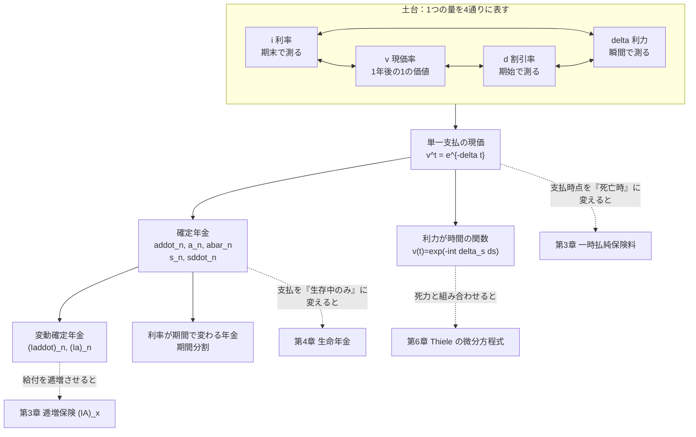
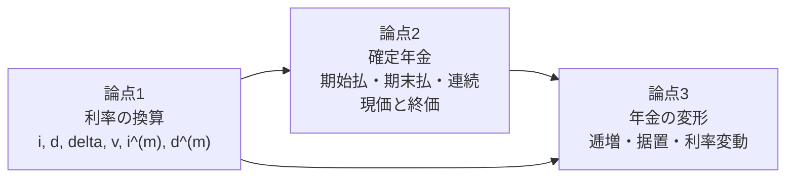
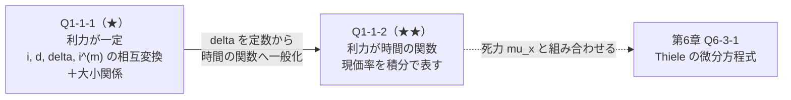
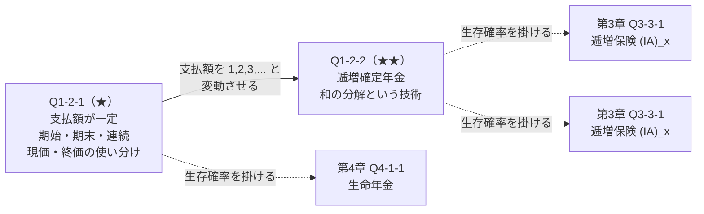
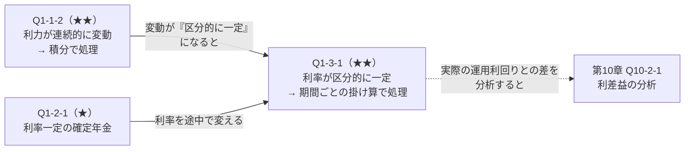
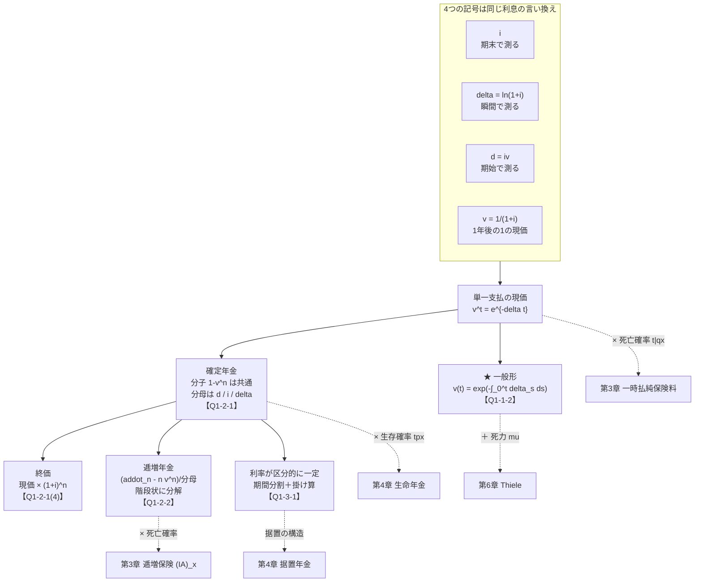
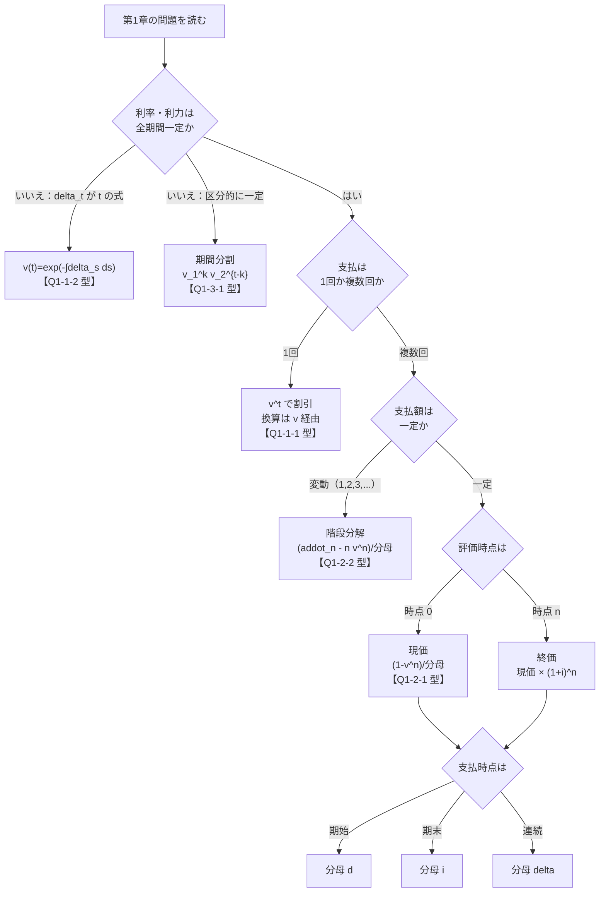

# 第1章　利息の理論と現価計算

> [← 全体マップ](../00_序/全体マップ.md) ｜ **第1章** ｜ [第2章 生命表と生存分布 →](第02章_生命表と生存分布.md)

---

## 章の地図



**この図の読み方**：左上の4つ（$i,d,\delta,v$）は **同じ利息を測る場所を変えただけの4通りの表現** です。
ここから「単一支払の現価」が出て、それを並べると確定年金になります。
点線の矢印は後の章への接続で、**第1章の道具に確率を掛けると第3・4章になる** ことを示しています。

---

## この章で学ぶこと

第1章は、生保数理の **第1層＝「お金の時間価値を変換する技術」** を扱います。
ここには確率が一切登場しません。扱うのは「確実に起きる支払」だけです。

なぜ確率のない章を最初に置くのか。生保数理の期待現価は例外なく

$$\text{期待現価}=\sum(\text{給付額})\times(\text{発生確率})\times(\text{現価率})$$

の形をしています。このうち **現価率の部分だけを切り出して完全に習得する** のが第1章です。
第2章で確率の部分を切り出し、第3章で両者を掛け合わせます。

この章が曖昧なまま先へ進むと、第6章の責任準備金で必ず行き詰まります。
最も多い失点原因は、**$i$ と $d$ の混同**、および **$v^t$ と $v^{t+1}$ の取り違え** です。
どちらもこの章の内容です。

---

## この章の全体像

### 論点同士の関係



3つの論点は完全に一方向の依存関係にあります。論点1を飛ばして論点2はできません。

### 学習順序

```text
① i と v の関係を確定させる           …… ここが全ての起点
        ↓
② d を「期始で測った利息」として理解する  …… d = iv の意味を掴む
        ↓
③ delta を「瞬間の利率」として理解する    …… v^t = e^{-delta t} を使えるようにする
        ↓
④ 単一支払の現価を時間軸上に置く
        ↓
⑤ 支払を並べて年金にする（現価／終価）
        ↓
⑥ 支払額や利率を変動させる（応用）
```

---

## 最初に頭に入れるべきポイント

公式一覧の前に、**4つの記号がそれぞれ何を表す量なのか** を確定させます。
ここを言葉で説明できないまま公式を覚えると、必ず取り違えます。

### $i$、$d$、$\delta$、$v$ は「同じ利息を測る場所」が違うだけ

1年間で $1 \to 1+i$ に増える運用を考えます。この1年間の「利息」は $i$ ですが、
**どの時点で、いくらに対して測るか** で数値が変わります。

```text
時点        0                              1
            |------------------------------|
元本        1                            1+i
            ^                              ^
            |                              |
      期始の額 1                     期末の額 1+i
      に対して測る                   に対して測る

  d = 利息 i を「期末の額 1+i」に対する割合で測ったもの   → d = i/(1+i) = iv
  i = 利息 i を「期始の額 1」に対する割合で測ったもの      → i
  delta = 各瞬間の増加率（連続的に測ったもの）             → delta = ln(1+i)
  v = 期末の 1 が期始でいくらか                            → v = 1/(1+i)
```

| 記号 | 測る場所 | 言葉で言うと | 使う場面 |
|---|---|---|---|
| $i$ | 期末に、期始の額に対して | 「1年後にいくら増えるか」 | 終価計算、期末払年金 |
| $d$ | 期始に、期末の額に対して | 「1年後の1を今もらうといくら引かれるか」 | **期始払年金、$A_x=1-d\ddot a_x$** |
| $\delta$ | 各瞬間に | 「今この瞬間の増え方」 | 連続型、微分方程式 |
| $v$ | — | 「1年後の1の現在価値」 | すべての現価計算 |

**他の概念とのつながり**

* $d$ が現れる場所は、必ず **期始払（前払）** が絡んでいます。
  $\ddot a_{\overline{n}\vert}=\dfrac{1-v^n}{d}$ の分母が $d$ なのは、支払が期始にあるからです。
  第3章の $A_x = 1-d\,\ddot a_x$ で $d$ が出るのも、$\ddot a_x$ が期始払だからです。
* $\delta$ が現れる場所は、必ず **連続型** です。
  $\bar A_x = 1-\delta\,\bar a_x$、Thiele の微分方程式（第6章）はすべて $\delta$ を使います。
* $i$ と $d$ と $\delta$ の **大小関係 $d<\delta<i$** は、検算に使えます。
  計算結果でこの順序が崩れたら、どこかで間違えています。

### 現価率は「掛け算で連鎖する」

$t$ 年後の1の現価が $v^t$ になるのは、1年分の割引 $v$ を $t$ 回繰り返すからです。
利力が時間の関数 $\delta_s$ の場合も同じ考え方で、掛け算が積分に変わるだけです。

$$v(t)=\exp\!\left(-\int_0^t \delta_s\,ds\right)$$

$t$ 年後の1の現価。$\delta_s$ が定数 $\delta$ なら $\exp(-\delta t)=v^t$ に戻ります。

**この「掛け算で連鎖する」性質が、利率が期間で変わる問題（Q1-3-1）の解法の根拠です。**
期間を区切って、それぞれの現価率を掛け合わせればよい、ということです。

---

## 基本記号・基本公式

### 利率の換算

| 公式 | 記号の意味 | 式が表す内容 | 使用場面 | 成立条件 | 間違えやすい点 |
|---|---|---|---|---|---|
| $v=\dfrac{1}{1+i}$ | $v$：現価率 | 1年後の1の現在価値 | すべての現価計算 | なし（定義） | — |
| $d=1-v=iv=\dfrac{i}{1+i}$ | $d$：割引率 | 期始で測った1年分の利息 | 期始払年金、$A=1-d\ddot a$ | なし（定義） | **$d\ne i$**。$d<i$ |
| $\delta=\ln(1+i)$ | $\delta$：利力 | 瞬間的な増加率 | 連続型、微分方程式 | 利力一定 | $\delta\ne i$。$\delta$ は $d$ と $i$ の**間** |
| $v^t=e^{-\delta t}$ | — | $t$ 年後の1の現価 | すべて | 利力一定 | $t$ が非整数でも成立 |
| $\left(1+\dfrac{i^{(m)}}{m}\right)^{m}=1+i$ | $i^{(m)}$：名目利率 | 年 $m$ 回複利の名目年利率 | 分割払 | なし（定義） | $i^{(m)}\ne i/m$。$i^{(m)}$ は**年率** |
| $\left(1-\dfrac{d^{(m)}}{m}\right)^{m}=v$ | $d^{(m)}$：名目割引率 | 年 $m$ 回の名目割引率 | 分割払・期始 | なし（定義） | 符号が $i^{(m)}$ と逆（$-$） |
| $v(t)=\exp\!\left(-\displaystyle\int_0^t\delta_s ds\right)$ | $\delta_s$：時点 $s$ の利力 | 利力が変動する場合の現価 | 変動利力 | なし（一般形） | 積分の上端は**評価したい時点** |

**大小関係（検算に必須）**

$$d < d^{(2)} < d^{(3)} < \cdots < \delta < \cdots < i^{(3)} < i^{(2)} < i$$

$\delta$ が $d$ 系列と $i$ 系列の境目です。$m\to\infty$ でどちらの系列も $\delta$ に収束します。

### 確定年金

| 記号 | 支払時点 | 公式 | 成立条件 | 間違えやすい点 |
|---|---|---|---|---|
| $\ddot a_{\overline{n}\vert}$ | $0,1,\dots,n-1$ | $\dfrac{1-v^n}{d}$ | 利率一定 | 分母は $d$（$i$ ではない） |
| $a_{\overline{n}\vert}$ | $1,2,\dots,n$ | $\dfrac{1-v^n}{i}$ | 利率一定 | 分母は $i$ |
| $\bar a_{\overline{n}\vert}$ | $[0,n]$ 連続 | $\dfrac{1-v^n}{\delta}$ | 利力一定 | 分母は $\delta$ |
| $\ddot s_{\overline{n}\vert}$ | 同上、評価時点 $n$ | $\dfrac{(1+i)^n-1}{d}$ | 利率一定 | 評価時点が $n$ |
| $s_{\overline{n}\vert}$ | 同上、評価時点 $n$ | $\dfrac{(1+i)^n-1}{i}$ | 利率一定 | 評価時点が $n$ |
| $(I\ddot a)_{\overline{n}\vert}$ | 時点 $t$ に $t+1$ | $\dfrac{\ddot a_{\overline{n}\vert}-nv^n}{d}$ | 利率一定 | 分子の $\ddot a$（$a$ でない） |
| $(Ia)_{\overline{n}\vert}$ | 時点 $t$ に $t$ | $\dfrac{\ddot a_{\overline{n}\vert}-nv^n}{i}$ | 利率一定 | 分子は $\ddot a$、分母は $i$ |

**分母の見分け方（暗記不要）**

```text
分母は「支払の測り方」で決まる：

  期始払（前払）  →  d      ←  期始で測る割引率
  期末払（後払）  →  i      ←  期末で測る利率
  連続払          →  delta  ←  瞬間で測る利力
```

**関係式**

$$\ddot a_{\overline{n}\vert}=(1+i)\,a_{\overline{n}\vert},\qquad
\ddot a_{\overline{n}\vert}=a_{\overline{n-1}\vert}+1,\qquad
s_{\overline{n}\vert}=(1+i)^n a_{\overline{n}\vert}$$

左：期始払は期末払を1年分繰り上げたもの。中央：期始払 $n$ 回＝時点0の1＋期末払 $n-1$ 回。
右：終価は現価を $n$ 年運用したもの。

---

## 試験での主な問われ方

第1章の内容は、**単独で1問になることは比較的少なく、他の論点の前半部として現れる** のが特徴です。

| 出題形態 | 典型的な問われ方 | 対応する問題 |
|---|---|---|
| 小問（穴埋め） | $i$ が与えられて $d,\delta,i^{(m)}$ を求める／逆向き | Q1-1-1 |
| 小問（穴埋め） | 確定年金の現価・終価の数値計算 | Q1-2-1 |
| 小問 | 利力が時間の関数のときの現価 | Q1-1-2 |
| 記述式の前半 | 逓増年金の公式を導出させ、後半で逓増保険につなげる | Q1-2-2 → Q3-3-1 |
| 記述式の中間処理 | 「最初の $k$ 年は利率 $i_1$、以後 $i_2$」という前提での現価計算 | Q1-3-1 |
| 記述式の一部 | 大小関係 $d<\delta<i$ の証明 | Q1-1-1(3) |

**重要**：第5章以降の保険料・責任準備金の問題では、この章の内容が
「当然できるもの」として前提にされます。$d$ と $i$ の取り違えは、
問題の後半すべてを誤らせるため、**配点上の実質的な重みは見た目より大きい** です。

---

## 問題を見分けるためのサイン

問題文に次の表現があれば、第1章の論点が関わっています。

| 問題文中の表現 | 判断すること |
|---|---|
| 「利力」「force of interest」「$\delta$」 | 連続型。$v^t=e^{-\delta t}$ を使う |
| 「利力が $\delta_t=\cdots$ で与えられる」 | **変動利力**。$\exp(-\int_0^t\delta_s ds)$ を使う（Q1-1-2） |
| 「年 $m$ 回複利」「名目年利率」 | $i^{(m)}$。$i^{(m)}\ne i$、$i^{(m)}\ne i/m$ |
| 「毎年初に」「期始払」「前払」 | $\ddot a$。分母は $d$ |
| 「毎年末に」「期末払」「後払」 | $a$。分母は $i$ |
| 「連続的に」「連続払」 | $\bar a$。分母は $\delta$ |
| 「$n$ 年後の元利合計」「積立額」 | **終価**。評価時点が $n$（$s$ または $\ddot s$） |
| 「1年目は1、2年目は2、…」 | **逓増**。$(I\ddot a)$ または $(Ia)$（Q1-2-2） |
| 「最初の $k$ 年間は利率 $i_1$、その後は $i_2$」 | **期間分割**。現価率を掛け合わせる（Q1-3-1） |
| 「割引率」「$d$」 | $d=iv$。$i$ と混同しない |

**⚠ 特に注意すべき語**

* 「**割引率**」は $d$ です。日常語の「割引」から $i$ を連想しないこと。
* 「**据置**」は支払開始の遅れ。$v^m$ を掛けます（第4章で本格化）。
* 「**期始**」「**期首**」はどちらも同じ意味（時点 $t$）で、$\ddot a$ を使います。

---

## この章の問題一覧

| ID | 表題 | 難 | 段階 | この問題の役割 |
|---|---|---|---|---|
| **第1節　利率・割引率・利力** | | | | |
| Q1-1-1 | 利率・割引率・利力の相互変換 | ★ | ① | 4記号の定義を確定させ、大小関係を検算道具として身につける |
| Q1-1-2 | 利力が時間の関数である場合の現価 | ★★ | ② | 現価率を「積分の指数」として一般化する。第6章 Thiele の下地 |
| **第2節　確定年金の現価と終価** | | | | |
| Q1-2-1 | 確定年金の現価と終価の使い分け | ★ | ① | 期始／期末／連続、現価／終価を **評価時点** で整理する |
| Q1-2-2 | 逓増確定年金 $(I\ddot a)_{\overline{n}\vert}$ の導出 | ★★ | ③ | 「和の分解」という技術を習得。第3章の逓増保険に直結 |
| **第3節　利率が変動する場合** | | | | |
| Q1-3-1 | 期間により利率が変わる年金 | ★★ | ④ | 問題文の読み替え。現価率の連鎖という原理に戻って解く |

---
---

# 第1節　利率・割引率・利力

## この節のテーマ

**同じ利息を、$i$（期末で測る）、$d$（期始で測る）、$\delta$（瞬間で測る）、$v$（現価）の
4通りに言い換える技術**、および利力が時間の関数である場合への一般化を扱います。

## この節でできるようになること

* $i,d,\delta,v,i^{(m)},d^{(m)}$ のうち1つが与えられたら、残りすべてを求められる
* $d<\delta<i$ を使って計算結果の妥当性を検算できる
* 利力が $\delta_t$（時間の関数）で与えられたとき、任意の時点の現価・終価を求められる
* 変動利力のもとでの「等価な一定利率」を求められる

## 頭に入れるべきポイント

### すべての換算は $v$ を経由する

換算公式を6個覚える必要はありません。**いったん $v$ に直す** と決めれば、経路は1つです。

```text
                    i  ──┐
                         │
                 i^(m)  ──┤
                         ├──→  v  ──┬──→  d = 1 - v
                 delta  ──┤          │
                         │          ├──→  delta = -ln v
                 d^(m)  ──┘          │
                                     └──→  i = 1/v - 1
```

| 与えられた量 | $v$ への変換 |
|---|---|
| $i$ | $v=\dfrac{1}{1+i}$ |
| $d$ | $v=1-d$ |
| $\delta$ | $v=e^{-\delta}$ |
| $i^{(m)}$ | $v=\left(1+\dfrac{i^{(m)}}{m}\right)^{-m}$ |
| $d^{(m)}$ | $v=\left(1-\dfrac{d^{(m)}}{m}\right)^{m}$ |

**$i^{(m)}$ と $d^{(m)}$ で符号が逆になる理由**：$i^{(m)}$ は各 $1/m$ 期間の **末** に利息を付ける
（$1$ から出発して増やす→ $1+$）、$d^{(m)}$ は各 $1/m$ 期間の **始** に割引く
（$1$ から出発して減らす→ $1-$）ためです。符号は暗記ではなく、方向で決まります。

### 変動利力は「掛け算が積分になる」だけ

利力一定なら、1年分の割引 $e^{-\delta}$ を $t$ 回掛けて $e^{-\delta t}$ です。
利力が変動するなら、微小区間 $ds$ の割引 $e^{-\delta_s ds}$ を掛け合わせるので、
指数の中が和（＝積分）になります。

$$v(t)=\prod e^{-\delta_s\,ds}=\exp\!\left(-\int_0^t\delta_s\,ds\right)$$

**新しい概念ではなく、$v^t=e^{-\delta t}$ の $\delta t$ が $\int_0^t\delta_s ds$ に置き換わっただけ** です。

## 使用する記号・公式

| 記号 | 意味 | 定義 |
|---|---|---|
| $i$ | 年利率 | — |
| $v$ | 現価率 | $v=(1+i)^{-1}$ |
| $d$ | 割引率 | $d=1-v=iv$ |
| $\delta$ | 利力（一定） | $\delta=\ln(1+i)$ |
| $\delta_t$ | 利力（時点 $t$） | — |
| $i^{(m)}$ | 名目利率 | $\left(1+\frac{i^{(m)}}{m}\right)^m=1+i$ |
| $d^{(m)}$ | 名目割引率 | $\left(1-\frac{d^{(m)}}{m}\right)^m=v$ |
| $v(t)$ | 時点 $t$ の現価率（変動利力） | $\exp\left(-\int_0^t\delta_s ds\right)$ |
| $a(t)$ | 時点 $t$ の終価率 | $\exp\left(\int_0^t\delta_s ds\right)=1/v(t)$ |

## 基本的な解法パターン

この節の問題は、すべて次の手順で解けます。

```text
① 与えられた量が「i 系」「d 系」「delta 系」「名目」のどれか判定する
        ↓
② v に変換する                     ← ここが必ず経由点
        ↓
③ 求めたい量を v から表す
        ↓
④ 利力が時間の関数なら、
   delta を int_0^t delta_s ds に置き換える
        ↓
⑤ 大小関係 d < delta < i で検算する
```

**⑤を必ず実行してください。** 換算の計算ミスはこの検算でほぼ捕まります。

## 間違えやすい点

| 誤り | 内容 | 防ぎ方 |
|---|---|---|
| $d$ と $i$ の混同 | 年金の分母に $i$ を使ってしまう | 「期始払なら $d$」と支払時点から決める |
| $i^{(m)}=i/m$ と誤解 | $i^{(m)}$ は**年率**であり、1回分は $i^{(m)}/m$ | 「名目**年**利率」の語を確認 |
| $d^{(m)}$ の符号 | $\left(1+\frac{d^{(m)}}{m}\right)^m$ としてしまう | 割引なので $1-$。方向で判断 |
| $\delta$ と $i$ の混同 | 連続型で $i$ を使う | 上線があれば $\delta$ |
| 積分区間の誤り | $\int_0^t$ でなく $\int_t^{t+1}$ 等にする | 「時点0から評価時点まで」と確認 |
| 変動利力で $v^t$ を使う | $\delta_t$ が変動なのに $e^{-\delta t}$ とする | 「$\delta_t=\cdots$」の形を見たら必ず積分 |
| 等価利率の指数 | $(1+i)^{n}=e^{\int_0^{n}\delta_s ds}$ の両辺 $n$ 乗根を忘れる | 「1年あたり」に直す操作を明示 |

## この節の問題の流れ



Q1-1-1 で「利力一定」の世界を固め、Q1-1-2 でそれを「利力が時間の関数」へ一般化します。
この一般化の型（定数 → 時間の関数、掛け算 → 積分）は、第2章の死力でも、
第6章の Thiele でも同じ形で再登場します。**この節は型の初出です。**

---
---

## 問題 Q1-1-1　利率・割引率・利力の相互変換

| 項目 | 内容 |
|---|---|
| 出題年度 | `要照合`（記入欄：______年度） |
| 問題番号 | `要照合`（記入欄：問題___） |
| 分野・論点 | 利息の理論 ／ 利率の換算 |
| 難易度 | ★ |
| この節での位置づけ | 段階①（定義を直接使う）。本節・本章の全問題の前提となる最初の問題 |
| 関連する問題 | 発展元：— ／ 本問 ／ 後続：Q1-1-2（利力を時間の関数へ）、Q1-2-1（年金の分母）、Q3-1-2（$A_x=1-d\ddot a_x$ の $d$） |

### ■ この問題で押さえるべきポイント

#### ① 何を問う問題か

**1つの利率表現から、他のすべての表現（$v,d,\delta,i^{(m)}$）を計算させる問題**、
および **$d<\delta<i$ という大小関係を説明させる問題** です。
計算そのものは易しく、問われているのは **定義を正確に覚えているか** だけです。

#### ② 問題文から読み取るべき条件

| 条件 | 解法への影響 |
|---|---|
| 「$i=0.04$」（実質年利率が与えられる） | 出発点が $i$ 系。$v=1/(1+i)$ で $v$ に降りる |
| 「$\delta=0.04$」（利力が与えられる） | 出発点が $\delta$ 系。$1+i=e^{\delta}$ で $i$ に上がる |
| 「年12回」 | $m=12$。$i^{(12)}$ は**年率**であり、1か月分は $i^{(12)}/12$ |
| 「名目年利率」 | $i^{(m)}$ のこと。$i$ そのものではない |

**(1) と (2) で与えられる数値が同じ 0.04 でも、意味が違う**ことに注意します。
(1) は $i=0.04$、(2) は $\delta=0.04$ であり、両者は別の世界です。
（実際、(1) では $\delta=0.0392$、(2) では $i=0.0408$ となります。）

#### ③ 最初に注目する場所

**与えられた量が $i$ 系（期末で測る）か $d$ 系（期始で測る）か $\delta$ 系（瞬間）か** を判定する。
これで換算の方向が決まります。次に **「名目」の語があるか** を見ます。あれば $m$ を確認します。

#### ④ 呼び出すべき知識

| 知識 | なぜこの問題で使うか |
|---|---|
| $v=\dfrac{1}{1+i}$ | すべての換算の経由点。$v$ を求めれば残りは機械的 |
| $d=1-v=iv$ | (1) で $d$ を問われている。$1-v$ の方が計算が速い |
| $\delta=\ln(1+i)$、$1+i=e^{\delta}$ | (1) では順方向、(2) では逆方向に使う |
| $\left(1+\frac{i^{(m)}}{m}\right)^m=1+i$ | (2) で $i^{(12)}$ を問われている。左辺を $e^{\delta}$ と等置する |
| $e^{u}=1+u+\frac{u^2}{2}+\cdots$ | (3) の大小関係を **式で** 示すのに使う |

#### ⑤ 解法の骨格

```text
1. 与えられた量を v（または 1+i）に直す
2. v から d = 1 - v を出す
3. v から delta = -ln v を出す
4. 名目利率は「1/m 期間あたりの利率 × m」として作る
5. 大小関係は e^u の級数展開で示す
```

#### ⑥ 間違えやすい点

* $d = i$ としてしまう（$d=0.0385$、$i=0.04$ で別物）
* $i^{(12)} = 0.04/12$ としてしまう（$i^{(12)}$ は年率。1か月分は $i^{(12)}/12$）
* (2) で $\delta=0.04$ を $i=0.04$ と読み違える
* $\delta$ の位置を「$i$ より大きい」と誤る（正しくは $d<\delta<i$）
* 大小関係を数値例だけで示して終わる（証明を求められたら式で示す）

#### ⑦ この問題を一言で捉えると

> **「同じ利息を、期始・期末・瞬間のどこで測るか」を数値に翻訳する問題。**

### ■ 問題の構造図

```text
測る場所と大小関係：

  期始で測る            瞬間で測る              期末で測る
      d        <    d^(12) < ... < delta < ... < i^(12)   <    i
      |                        |                              |
      |                        |                              |
   d = iv                delta = ln(1+i)                     i
   （小さい）            （ちょうど中間）                （大きい）

  なぜ d < i か：
      時点 0                          時点 1
        |------------------------------|
        1                            1+i
        ^                              ^
        利息 i を「1」で割る = i        利息 i を「1+i」で割る = d
                                        分母が大きい → 値が小さい → d < i
```

**この図が示すこと**：$d<\delta<i$ は暗記事項ではなく、
**同じ利息 $i$ を割る分母が大きいほど値が小さくなる**という当たり前の帰結です。
$\delta$ は「連続的に測る」ため、期始と期末の中間になります。

### ■ 問題

**次の各問に答えよ。**

**(1)** 年利率 $i=0.04$ のとき、現価率 $v$、割引率 $d$、利力 $\delta$ を求めよ
（小数第7位まで）。

**(2)** 利力 $\delta=0.04$（一定）のとき、年利率 $i$ および年12回複利の名目年利率 $i^{(12)}$
を求めよ（小数第7位まで）。

**(3)** 一般に $i>0$ のとき、$d<\delta<i$ が成り立つことを示せ。

> 本問は再現題です。原文の出題年度・問題番号は未照合です。

### ■ 問題文を数理モデルへ変換

| 確認項目 | 問題文から読み取れる内容 | 数理的な表現 |
|---|---|---|
| (1) 与えられる量 | 年利率 $i=0.04$ | $i=0.04$（期末で測った利率） |
| (1) 求める量①  | 現価率 | $v=(1+i)^{-1}$ |
| (1) 求める量② | 割引率 | $d=1-v$ |
| (1) 求める量③ | 利力 | $\delta=\ln(1+i)$ |
| (2) 与えられる量 | 利力 $\delta=0.04$、**一定** | $v^t=e^{-0.04t}$ |
| (2) 求める量① | 年利率 | $i=e^{\delta}-1$ |
| (2) 求める量② | 年12回複利の**名目年**利率 | $i^{(12)}=12\left(e^{\delta/12}-1\right)$ |
| (3) 求める内容 | 不等式の証明 | $e^u$ の級数展開または凸性 |

### ■ 解法フロー

```text
STEP 1　(1) i を v に変換する
STEP 2　(1) v から d と delta を出す
STEP 3　(2) delta を 1+i に変換する
STEP 4　(2) 1/12 年あたりの利率を出し、12 倍して名目年利率にする
STEP 5　(3) 不等式を e^u の級数展開で示す
STEP 6　大小関係で全体を検算する
```

### ■ 詳細解説

#### STEP 1　(1) $i$ を $v$ に変換する

*目的：換算の経由点である現価率 $v$ を求める。*

現価率の定義は「1年後の1の現在価値」です。

$$v=\frac{1}{1+i}=\frac{1}{1.04}=0.9615385$$

$1$ 年後に受け取る $1$ は、いま $0.9615385$ の価値をもつ、という意味です。

#### STEP 2　(1) $v$ から $d$ と $\delta$ を出す

*目的：残りの2量を $v$ から機械的に求める。*

**割引率 $d$**：定義は $d=1-v$ です。

$$d=1-v=1-0.9615385=0.0384615$$

これは「1年後の $1$ を今受け取ると、$0.0384615$ だけ差し引かれる」という意味です。
$d=iv$ でも同じ値になることを確認します。

$$iv=0.04\times0.9615385=0.0384615\quad\checkmark$$

$d=iv$ の意味は「利息 $i$ を1年分割り引いた額」、すなわち **利息を期始で測った値** です。

**利力 $\delta$**：定義は $\delta=\ln(1+i)$ です。

$$\delta=\ln(1.04)=0.0392207$$

$e^{\delta}=1+i$ すなわち「利力 $\delta$ で1年間連続的に運用すると $1+i$ 倍になる」という意味です。

#### STEP 3　(2) $\delta$ を $1+i$ に変換する

*目的：出発点が $\delta$ になったので、逆向きに $i$ を求める。*

$\delta=\ln(1+i)$ の両辺を指数に乗せます。

$$1+i=e^{\delta}=e^{0.04}=1.0408108$$

$$\therefore\quad i=0.0408108$$

**(1) との対比**：(1) では $i=0.04$ から $\delta=0.0392207$ が出ました。
(2) では $\delta=0.04$ から $i=0.0408108$ が出ます。
どちらも $\delta<i$ を満たしており、$0.04$ という同じ数値でも
**どちらの記号に与えられたかで世界が変わる** ことが確認できます。

#### STEP 4　(2) 名目年利率 $i^{(12)}$ を求める

*目的：「年 $m$ 回複利の名目年利率」の定義に忠実に計算する。*

$i^{(12)}$ の定義は次式です。

$$\left(1+\frac{i^{(12)}}{12}\right)^{12}=1+i$$

```text
式の構造：

    ( 1 + i^(12)/12 )^12   =   1 + i
        |     |       |          |
        |     |       |          └─ 1年間の総増加
        |     |       └─ 12 回複利する
        |     └─ ★ 1 か月分の利率（年率を 12 で割ったもの）
        └─ 1 か月の元利合計倍率
```

左辺の $\dfrac{i^{(12)}}{12}$ が **1か月分の利率** です。$i^{(12)}$ 自体は年率であり、
**これを $12$ で割って初めて1期間分になります**。ここが最も間違えやすい箇所です。

$1+i=e^{0.04}$ を代入して、$1$か月分の利率を求めます。

$$1+\frac{i^{(12)}}{12}=\left(e^{0.04}\right)^{1/12}=e^{0.04/12}=e^{0.0033333}=1.0033389$$

$$\frac{i^{(12)}}{12}=0.0033389$$

これを $12$ 倍して年率に戻します。

$$i^{(12)}=12\times0.0033389=0.0400667$$

**検算**：$\delta=0.04 < i^{(12)}=0.0400667 < i=0.0408108$。
大小関係 $\delta<i^{(12)}<i$ を満たしています。

#### STEP 5　(3) $d<\delta<i$ を示す

*目的：数値例ではなく、任意の $i>0$ に対して成り立つことを式で示す。*

$\delta=\ln(1+i)$ と置き、$i$ および $d$ を $\delta$ で表します。

$$i=e^{\delta}-1,\qquad d=1-v=1-e^{-\delta}$$

**$\delta<i$ の証明**：$e^{\delta}$ を級数展開します。

$$i=e^{\delta}-1=\delta+\frac{\delta^{2}}{2!}+\frac{\delta^{3}}{3!}+\cdots$$

$\delta>0$（$i>0$ より $\ln(1+i)>0$）なので、第2項以降はすべて正です。したがって

$$i>\delta$$

**$d<\delta$ の証明**：同様に $e^{-\delta}$ を展開します。

$$d=1-e^{-\delta}=1-\left(1-\delta+\frac{\delta^{2}}{2!}-\frac{\delta^{3}}{3!}+\cdots\right)
=\delta-\frac{\delta^{2}}{2!}+\frac{\delta^{3}}{3!}-\cdots$$

ここで $\delta-\dfrac{\delta^2}{2!}+\dfrac{\delta^3}{3!}-\cdots$ を $\delta$ と比べます。
残りの部分を2項ずつ組にすると

$$-\frac{\delta^{2}}{2!}+\frac{\delta^{3}}{3!}=-\frac{\delta^{2}}{2}\left(1-\frac{\delta}{3}\right),\qquad
-\frac{\delta^{4}}{4!}+\frac{\delta^{5}}{5!}=-\frac{\delta^{4}}{24}\left(1-\frac{\delta}{5}\right),\ \dots$$

となり、$0<\delta<1$ の範囲では各組が負です。したがって

$$d<\delta$$

**より簡潔な別証**：$d=1-e^{-\delta}$ とし、$e^{-\delta}>1-\delta$（$\delta\ne0$ で厳密な不等号。
$e^{u}>1+u$ の $u=-\delta$ の場合）を用いると

$$d=1-e^{-\delta}<1-(1-\delta)=\delta$$

同じく $e^{\delta}>1+\delta$ より

$$i=e^{\delta}-1>\delta$$

**この別証の根拠**：$e^{u}>1+u$（$u\ne0$）は、$e^u$ が凸関数であり
$1+u$ が $u=0$ における接線であることから従います。生保数理では
$e^u\ge 1+u$ を使う場面が多いので、この形で覚えておくと有利です。

以上より、$i>0$ のとき

$$d<\delta<i$$

#### STEP 6　全体の検算

*目的：大小関係で数値の妥当性を確認する。*

| 問 | 値 | 大小関係の確認 |
|---|---|---|
| (1) | $d=0.0384615$、$\delta=0.0392207$、$i=0.04$ | $0.0384615<0.0392207<0.04$ ✓ |
| (2) | $\delta=0.04$、$i^{(12)}=0.0400667$、$i=0.0408108$ | $0.04<0.0400667<0.0408108$ ✓ |

### ■ 答え

**(1)** $\ v=0.9615385$、$\ d=0.0384615$、$\ \delta=0.0392207$

**(2)** $\ i=0.0408108$、$\ i^{(12)}=0.0400667$

**(3)** $\ e^{u}>1+u\ (u\ne0)$ より $i=e^{\delta}-1>\delta$ かつ $d=1-e^{-\delta}<\delta$。
よって $d<\delta<i$。

> **丸めについて**：小数第7位まで求めよという指示に従いました。
> 試験では指定桁数を必ず確認してください。指定がない場合、
> 利率系の量は小数第5〜7位、年金現価は小数第4〜6位が慣例です。

### ■ 試験答案としての書き方

> **(1)**
> $v=\dfrac{1}{1+i}=\dfrac{1}{1.04}=0.9615385$
> $d=1-v=0.0384615$
> $\delta=\ln(1+i)=\ln 1.04=0.0392207$
>
> **(2)**
> $1+i=e^{\delta}=e^{0.04}=1.0408108$ より $i=0.0408108$
> $\left(1+\dfrac{i^{(12)}}{12}\right)^{12}=1+i=e^{0.04}$ より
> $1+\dfrac{i^{(12)}}{12}=e^{0.04/12}=1.0033389$
> $\therefore i^{(12)}=12\times0.0033389=0.0400667$
>
> **(3)**
> $\delta=\ln(1+i)>0$ とおくと $i=e^{\delta}-1$、$d=1-e^{-\delta}$。
> $u\ne0$ のとき $e^{u}>1+u$（$e^u$ の凸性と $u=0$ での接線）であるから
> $i=e^{\delta}-1>(1+\delta)-1=\delta$
> $d=1-e^{-\delta}<1-(1-\delta)=\delta$
> よって $d<\delta<i$。 □

### ■ 解答後に確認すること

| 項目 | 内容 |
|---|---|
| **最も重要なポイント** | $i,d,\delta,v$ は同じ利息を **測る場所を変えただけ**。換算は必ず $v$ を経由する |
| **最初に気づくべきだった条件** | (1) と (2) はどちらも数値 $0.04$ だが、$i$ に与えられているか $\delta$ に与えられているかが違う。ここを読み違えると全問誤答 |
| **他の問題にも使える考え方** | ① 「名目○○率」は必ず**年率**であり、$m$ で割って1期間分にする。② $e^u>1+u$ は生保数理の不等式証明の常用道具（第2章の死力の不等式でも使う） |
| **類似問題との違い** | Q1-1-2 は利力が**時間の関数**になる。本問は利力**一定**。$\delta t$ か $\int_0^t\delta_s ds$ かが分岐点 |
| **条件が変わった場合** | $d^{(m)}$ を問われたら $\left(1-\frac{d^{(m)}}{m}\right)^m=v$。符号が $i^{(m)}$ と逆になる（割引だから減る方向） |
| **復習時に思い出すこと** | $d=iv$、$\delta=\ln(1+i)$、$d<\delta<i$。この3つだけ。他はここから導ける |

---
---

## 問題 Q1-1-2　利力が時間の関数である場合の現価

| 項目 | 内容 |
|---|---|
| 出題年度 | `要照合`（記入欄：______年度） |
| 問題番号 | `要照合`（記入欄：問題___） |
| 分野・論点 | 利息の理論 ／ 変動利力 |
| 難易度 | ★★ |
| この節での位置づけ | 段階②（基本公式を変形して使う）。Q1-1-1 の「利力一定」を「利力が時間の関数」へ一般化した問題 |
| 関連する問題 | 発展元：Q1-1-1 ／ 本問 ／ 後続：Q6-3-1（Thiele の微分方程式）、Q1-3-1（利率が区分的に変わる場合） |

### ■ この問題で押さえるべきポイント

#### ① 何を問う問題か

**利力が時点 $t$ の関数 $\delta_t$ で与えられたとき、現価・終価・年金現価を求めさせる問題** です。
さらに「同じ結果を与える一定利率（等価利率）」を問うことで、
$v^t=e^{-\delta t}$ という公式が **利力一定という条件付きでしか使えない** ことを確認させます。

#### ② 問題文から読み取るべき条件

| 条件 | 解法への影響 |
|---|---|
| 「$\delta_t=0.04+0.001t$」（$t$ の式） | **利力が一定でない**。$v^t=e^{-\delta t}$ は**使えない**。積分が必須 |
| 「10年後に支払われる1」 | 単一支払。$v(10)=\exp(-\int_0^{10}\delta_s ds)$ |
| 「時点0に投資した1の10年後の元利合計」 | 終価。$1/v(10)=\exp(+\int_0^{10}\delta_s ds)$ |
| 「連続的に年額1」 | 連続年金。$\int_0^{10}v(t)\,dt$。$t$ が積分変数と支払時点の両方 |
| 「同じ現価を与える一定の年利率」 | $(1+i)^{-10}=v(10)$ を $i$ について解く |

#### ③ 最初に注目する場所

**$\delta$ に添字 $t$ が付いているか、そして右辺が $t$ の式かどうか。**
$\delta_t = 0.04+0.001t$ のように $t$ を含んでいたら、その瞬間に
「$v^t$ は使えない、積分だ」と判断します。逆に $\delta_t=0.04$（定数）なら
Q1-1-1 の世界に戻ります。この1点の見極めがこの問題の本質です。

#### ④ 呼び出すべき知識

| 知識 | なぜこの問題で使うか |
|---|---|
| $v(t)=\exp\left(-\int_0^t\delta_s ds\right)$ | 変動利力の現価率の定義。本問の全設問がこれに帰着する |
| $\displaystyle\int_0^t (a+bs)\,ds=at+\frac{b}{2}t^2$ | $\delta_s$ が1次式なので、積分結果は2次式になる |
| $a(t)=1/v(t)=\exp\left(+\int_0^t\delta_s ds\right)$ | 終価は現価の逆数。指数の符号だけが違う |
| 連続年金の定義 $\displaystyle\int_0^n v(t)\,dt$ | 「連続的に年額1」の現価。$v(t)$ が指数の2次式になるため初等関数で表せず、数値積分が必要 |
| $(1+i)^{n}=\exp\left(\int_0^n\delta_s ds\right)$ | 等価利率の定義。両辺の $n$ 乗根を取る操作を忘れない |

#### ⑤ 解法の骨格

```text
1. まず int_0^t delta_s ds を t の式として一般形で計算する  ← ここを先にやると全設問が楽になる
2. その式に t = 10 を代入して v(10) を得る
3. 終価は指数の符号を + にするだけ
4. 連続年金は v(t) を 0 から 10 まで積分する
5. 等価利率は (1+i)^10 = 1/v(10) を i について解く
```

**手順1を最初にやることが決定的に重要です。** 設問ごとに積分し直すのは非効率で、
計算ミスの原因になります。

#### ⑥ 間違えやすい点

* $\delta_t$ が $t$ の関数なのに $v^{10}=e^{-\delta\cdot10}$ としてしまう
  （もし $\delta=0.04$ で計算すると $e^{-0.4}=0.6703$ となり、正解 $0.6376$ と食い違う）
* $\int_0^{10}(0.04+0.001s)ds$ で $0.001s$ の積分を $0.001\times10=0.01$ としてしまう
  （正しくは $\dfrac{0.001}{2}\times10^2=0.05$）
* 終価で指数の符号を間違える
* 等価利率を求めるとき、$\int_0^{10}\delta_s ds=0.45$ をそのまま $i=0.45$ や $\delta=0.045$ と混同する
* 連続年金を $\bar a_{\overline{10}\vert}=\dfrac{1-v(10)}{\delta}$ で計算してしまう
  （この公式は **利力一定のときのみ** 成立）

#### ⑦ この問題を一言で捉えると

> **「$v^t=e^{-\delta t}$ の $\delta t$ を $\int_0^t\delta_s\,ds$ に置き換えるだけ」を、
> 実際に計算させて確認する問題。**

### ■ 問題の構造図

```text
利力が一定の場合と変動する場合の対応：

  利力一定 delta                      利力変動 delta_t
  ──────────────────────            ──────────────────────
  1年分の割引  e^{-delta}             微小区間の割引  e^{-delta_s ds}
        ↓ t 回掛ける                        ↓ 掛け合わせる（= 指数を足す）
  v^t = e^{-delta t}                  v(t) = exp( - int_0^t delta_s ds )
        ↑                                    ↑
        └────── delta_s = delta（定数）なら一致 ──────┘


本問の時間軸：

時点        0        2        4        6        8       10
            |--------|--------|--------|--------|--------|
利力      0.040    0.042    0.044    0.046    0.048   0.050    ← delta_t = 0.04+0.001t（増加）
                                                                  時間とともに割引が強くなる
(1) 単一支払                                            v1      ← 10年後の 1
    評価時点  *

(2) 終価      ^1                                        →       ← 時点 0 の 1 の 10 年後の価値
                                                        *  評価時点

(3) 連続年金  [============ 年額 1 を連続的に ==========]
    評価時点  *
```

**この図が示すこと**：利力が時間とともに増える（$0.040\to0.050$）ので、
遠い将来の支払はより強く割り引かれます。したがって
$v(10)$ は「利力を平均 $0.045$ で一定とみなした場合」と同じ値になります
（$\int_0^{10}\delta_s ds=0.45=0.045\times10$）。
**1次式の利力なら、期間平均の利力で置き換えられる** という構造がここに現れています。

### ■ 問題

利力が

$$\delta_t=0.04+0.001t\qquad(t\ge0)$$

で与えられているとする（$t$ は時点0からの経過年数）。次の各問に答えよ。

**(1)** 時点10に支払われる1の、時点0における現価を求めよ（小数第7位まで）。

**(2)** 時点0に投資した1の、時点10における元利合計を求めよ（小数第7位まで）。

**(3)** 時点0から時点10までの10年間、連続的に年額1が支払われる年金の、
時点0における現価を求めよ（小数第4位まで）。

**(4)** (1) と同じ現価を与える一定の年利率 $i$ を求めよ（小数第7位まで）。

> 本問は再現題です。原文の出題年度・問題番号は未照合です。

### ■ 問題文を数理モデルへ変換

| 確認項目 | 問題文から読み取れる内容 | 数理的な表現 |
|---|---|---|
| 利力 | $\delta_t=0.04+0.001t$（$t$ の1次式） | **利力一定でない**。$v(t)=\exp\left(-\int_0^t\delta_s ds\right)$ |
| (1) 支払 | 時点10に1回だけ、1 | $v(10)$ |
| (1) 評価時点 | 時点0 | 積分区間 $[0,10]$ |
| (2) 支払 | 時点0に1を投資 | 終価 $a(10)=1/v(10)$ |
| (2) 評価時点 | 時点10 | 指数の符号が $+$ |
| (3) 支払 | 「連続的に年額1」を10年間 | $\displaystyle\int_0^{10}v(t)\,dt$ |
| (3) 注意 | — | $\bar a_{\overline{10}\vert}=\frac{1-v^{10}}{\delta}$ は**使えない**（利力一定でない） |
| (4) 求める量 | (1) と同じ現価を与える一定年利率 | $(1+i)^{-10}=v(10)$ |

### ■ 解法フロー

```text
STEP 1　int_0^t delta_s ds を t の一般式として求める     ← 全設問の共通部品
STEP 2　(1) t = 10 を代入して現価 v(10) を得る
STEP 3　(2) 指数の符号を + にして終価を得る
STEP 4　(3) v(t) を 0 から 10 まで積分する（数値積分）
STEP 5　(4) (1+i)^{-10} = v(10) を i について解く
STEP 6　利力の平均という見方で全体を検算する
```

### ■ 詳細解説

#### STEP 1　$\int_0^t\delta_s\,ds$ を一般式で求める

*目的：全設問で使う共通部品を、最初に $t$ の式として作っておく。*

$\delta_s=0.04+0.001s$ を $0$ から $t$ まで積分します。

$$\int_0^t\delta_s\,ds=\int_0^t(0.04+0.001s)\,ds
=\Big[\,0.04s+0.001\cdot\frac{s^{2}}{2}\,\Big]_0^t
=0.04t+0.0005t^{2}$$

**この式の意味**：時点0から $t$ までに累積された利力（＝連続複利の総量）です。
$\delta_s$ が1次式なので、累積は2次式になります。

これを使うと、現価率と終価率は次のように書けます。

$$v(t)=\exp\!\left(-0.04t-0.0005t^{2}\right),\qquad
a(t)=\frac{1}{v(t)}=\exp\!\left(0.04t+0.0005t^{2}\right)$$

```text
式の構造：

    v(t) = exp( -( 0.04 t  +  0.0005 t^2 ) )
                    |            |
                    |            └─ delta_t の増加分（0.001t）の累積
                    └─ delta_t の定数部分（0.04）の累積

  delta_t が定数 0.04 だけなら v(t)=e^{-0.04t}。
  0.0005t^2 の項が「利力が年々増える」効果を表す。
```

#### STEP 2　(1) 時点10の1の現価

*目的：STEP 1 の一般式に $t=10$ を代入する。*

$$\int_0^{10}\delta_s\,ds=0.04\times10+0.0005\times10^{2}=0.4+0.05=0.45$$

$$v(10)=e^{-0.45}=0.6376282$$

**「10年後の1は、いま $0.6376282$ の価値をもつ」** という意味です。

**⚠ 誤答との比較**：もし $\delta$ を $0.04$ で一定と誤解すると
$e^{-0.4}=0.6703200$ となり、正解より約 $0.033$ 大きくなります。
利力が年々増えているのだから現価はより小さくなるはずで、
**「$0.6703$ より小さい値になるはず」という見当** を先に付けておくと誤りに気づけます。

#### STEP 3　(2) 時点0の1の時点10における元利合計

*目的：終価は現価の逆数であることを使う。*

$$a(10)=\exp\!\left(\int_0^{10}\delta_s\,ds\right)=e^{0.45}=1.5683122$$

**現価との関係の確認**：$v(10)\times a(10)=0.6376282\times1.5683122=1.0000000$。
「10年後の1の現価」と「今の1の10年後の価値」は互いに逆数です。

#### STEP 4　(3) 連続年金の現価

*目的：各時点の支払を現価に直して積分する。*

時点 $t$（$0\le t\le10$）における「年額1の連続支払」の微小部分は $1\cdot dt$ であり、
その現価は $v(t)\,dt$ です。これを積分します。

$$\bar a=\int_0^{10}v(t)\,dt=\int_0^{10}\exp\!\left(-0.04t-0.0005t^{2}\right)dt$$

```text
式の構造：

    int_0^10   exp( -0.04t - 0.0005 t^2 )   dt
      |                 |                    |
      |                 |                    └─ 時点 t における支払額（年額 1 × dt）
      |                 └─ 時点 t までの現価率 v(t)
      └─ 支払期間 [0, 10]
```

**⚠ ここで公式 $\bar a_{\overline{n}\vert}=\dfrac{1-v^{n}}{\delta}$ を使ってはいけません。**
この公式は $v(t)=e^{-\delta t}$、すなわち **利力一定** を前提に導かれています。
本問では被積分関数の指数が $t$ の2次式なので、この公式の前提が崩れています。

被積分関数の指数が2次式であるため、この積分は初等関数では表せません
（誤差関数を用いれば閉形式になります）。試験では次のいずれかで処理します。

**方法A：数値積分（Simpson 法）**

区間 $[0,10]$ を偶数個に分割します。刻み $h=1$（$m=10$ 区間）で計算すると、

| $t$ | $0.04t+0.0005t^2$ | $v(t)=e^{-(\cdot)}$ | Simpson 係数 |
|---|---|---|---|
| 0 | 0.00000 | 1.0000000 | 1 |
| 1 | 0.04050 | 0.9603092 | 4 |
| 2 | 0.08200 | 0.9212722 | 2 |
| 3 | 0.12450 | 0.8829383 | 4 |
| 4 | 0.16800 | 0.8453538 | 2 |
| 5 | 0.21250 | 0.8085603 | 4 |
| 6 | 0.25800 | 0.7725952 | 2 |
| 7 | 0.30450 | 0.7374920 | 4 |
| 8 | 0.35200 | 0.7032801 | 2 |
| 9 | 0.40050 | 0.6699850 | 4 |
| 10 | 0.45000 | 0.6376282 | 1 |

$$\bar a\approx\frac{h}{3}\Big[f_0+4(f_1+f_3+f_5+f_7+f_9)+2(f_2+f_4+f_6+f_8)+f_{10}\Big]$$

奇数番目の和は $f_1+f_3+f_5+f_7+f_9=4.0592847$、
偶数番目（両端を除く）の和は $f_2+f_4+f_6+f_8=3.2425011$ です。

$$=\frac{1}{3}\Big[1.0000000+4\times4.0592847+2\times3.2425011+0.6376282\Big]$$

$$=\frac{1}{3}\Big[1.0000000+16.2371388+6.4850022+0.6376282\Big]=\frac{24.3597692}{3}=8.1199231$$

刻みを $h=0.5$ に細かくすると $8.1199233$、$h=0.01$ では $8.1199234$ となり、
**刻み $h=1$ の Simpson 法でも小数第6位まで正しい値** が得られています。
被積分関数が滑らかで単調なため、Simpson 法の収束が非常に速い例です。

**方法B：一定利力での近似（検算用）**

累積利力の平均は $0.45/10=0.045$ です。利力 $0.045$ 一定と近似すると

$$\bar a\approx\frac{1-e^{-0.45}}{0.045}=\frac{1-0.6376282}{0.045}=\frac{0.3623718}{0.045}=8.0527$$

真の値 $8.1199$ に対して約 $0.8\%$ の差です。
**近似が過小になる理由**：一定利力 $0.045$ とすると、前半（真の利力は $0.045$ 未満）で
割引を強くしすぎるため、現価が小さく出ます。この方向の見当が付けられれば十分です。

答えは方法Aによる $\bar a=8.1199$ とします。

#### STEP 5　(4) 等価な一定年利率

*目的：「同じ現価を与える一定利率」の定義式を立てて解く。*

一定年利率 $i$ のもとでの10年後の1の現価は $(1+i)^{-10}$ です。
これが (1) の $v(10)$ に等しいとおきます。

$$(1+i)^{-10}=v(10)=e^{-0.45}$$

両辺の逆数を取ります。

$$(1+i)^{10}=e^{0.45}$$

両辺の $10$ 乗根を取ります（**この操作を忘れるのが典型的な誤り**）。

$$1+i=e^{0.45/10}=e^{0.045}=1.0460279$$

$$\therefore\quad i=0.0460279$$

**この結果の意味**：$0.045$ は累積利力 $0.45$ を年数 $10$ で割った **平均利力** です。
つまり「等価な一定利力」は $\bar\delta=0.045$ であり、
それを年利率に換算すると $i=e^{0.045}-1=0.0460279$ になります。

```text
変換の連鎖：

  累積利力 0.45  ──÷10──→  平均利力 0.045  ──e^δ-1──→  等価年利率 0.0460279
     |                          |                            |
     |                          |                            └─ 求める答え
     |                          └─ delta_t の [0,10] 上の平均
     └─ int_0^10 delta_s ds
```

**検算**：$\delta=0.045<i=0.0460279$。Q1-1-1 で確認した $\delta<i$ を満たしています。

#### STEP 6　全体の検算

*目的：利力の平均という見方で数値の整合性を確認する。*

| 設問 | 答え | 検算の観点 | 結果 |
|---|---|---|---|
| (1) | $0.6376282$ | $\delta=0.04$ 一定なら $0.6703$。利力が増えるので、これより小さい | ✓ |
| (2) | $1.5683122$ | (1) との積が1になるか：$0.6376282\times1.5683122=1.0000000$ | ✓ |
| (3) | $8.1199$ | 期間10年、利力約0.045なら $\bar a_{\overline{10}\vert}\approx8.05$。同程度 | ✓ |
| (4) | $0.0460279$ | 平均利力 $0.045$ に対し $\delta<i$ | ✓ |

### ■ 答え

**(1)** $v(10)=e^{-0.45}=0.6376282$

**(2)** $a(10)=e^{0.45}=1.5683122$

**(3)** $\bar a=\displaystyle\int_0^{10}e^{-0.04t-0.0005t^{2}}dt=8.1199$

**(4)** $i=e^{0.045}-1=0.0460279$

> **丸めについて**：(3) は数値積分の精度に依存します。Simpson 法では
> 刻み $h=1$ で $8.1199231$、$h=0.5$ で $8.1199233$ が得られ、
> 小数第4位までは一致します。試験では
> **どの数値積分法を使い、刻みをいくつにしたかを必ず明記** してください。
> 明記があれば、多少の誤差は許容されます。

### ■ 試験答案としての書き方

> $\displaystyle\int_0^{t}\delta_s\,ds=\int_0^{t}(0.04+0.001s)\,ds=0.04t+0.0005t^{2}$
> よって $v(t)=\exp\left(-0.04t-0.0005t^{2}\right)$
>
> **(1)** $\displaystyle\int_0^{10}\delta_s ds=0.4+0.05=0.45$ より
> $v(10)=e^{-0.45}=0.6376282$
>
> **(2)** $a(10)=\dfrac{1}{v(10)}=e^{0.45}=1.5683122$
>
> **(3)** 求める現価は
> $\displaystyle\bar a=\int_0^{10}v(t)\,dt=\int_0^{10}e^{-0.04t-0.0005t^{2}}dt$
> （利力が一定でないため $\frac{1-v^{10}}{\delta}$ は使えない。）
> Simpson 法（刻み $h=1$）により
> $\bar a\approx\dfrac{1}{3}\left[f_0+4(f_1+f_3+f_5+f_7+f_9)+2(f_2+f_4+f_6+f_8)+f_{10}\right]=8.1199$
> （$h=0.5$ でも $8.1199$ となり、小数第4位まで安定。）
> $\therefore \bar a=8.1199$
>
> **(4)** $(1+i)^{-10}=e^{-0.45}$ より $(1+i)^{10}=e^{0.45}$
> $1+i=e^{0.045}=1.0460279$
> $\therefore i=0.0460279$

### ■ 解答後に確認すること

| 項目 | 内容 |
|---|---|
| **最も重要なポイント** | $v^t=e^{-\delta t}$ は**利力一定のときだけ**の式。一般形は $v(t)=\exp\left(-\int_0^t\delta_s ds\right)$。**指数の中身が積分になるだけ** |
| **最初に気づくべきだった条件** | $\delta_t=0.04+0.001t$ の右辺に $t$ があること。この1点で「積分が必要」が確定する |
| **他の問題にも使える考え方** | ① 累積量（$\int_0^t$）を先に $t$ の一般式で作ると、全設問が代入だけで済む。② 「等価な一定○○」を問われたら、累積量を期間で割って平均を作る |
| **類似問題との違** | Q1-1-1 は利力**一定**（積分不要）。Q1-3-1 は利力が**区分的に一定**（積分ではなく期間ごとの掛け算）。3問で「一定／区分的一定／連続変動」を網羅している |
| **条件が変わった場合** | ① $\delta_t$ が2次式なら累積は3次式。② 評価時点が $0$ でなく $s$ なら積分区間が $[s,t]$ になり、$v(s,t)=\exp\left(-\int_s^t\delta_u du\right)$。③ $\delta_t$ が減少関数なら現価は $e^{-\delta_0 t}$ より**大きく**なる |
| **復習時に思い出すこと** | $v(t)=\exp\left(-\int_0^t\delta_s ds\right)$ の1本だけ。$\delta_s$ が定数なら $v^t$ に戻る |

**この問題が後の章でどう使われるか**：第6章 Q6-3-1（Thiele の微分方程式）では、
利力 $\delta$ と死力 $\mu_{x+t}$ の両方を扱います。そのとき
「$\exp\left(-\int(\delta+\mu)\right)$」という形が現れますが、
**その $\delta$ 側の処理は本問とまったく同じ** です。
本問の型（定数 → 時間の関数、掛け算 → 積分の指数）は、
第2章の死力（$\ _tp_x=\exp\left(-\int_0^t\mu_{x+s}ds\right)$）でも再登場します。

---

## 第1節　記憶用の一枚まとめ

```text
┌──────────────────────────────────────────────────────────────────────┐
│  第1節　利率・割引率・利力                                            │
└──────────────────────────────────────────────────────────────────────┘

【問題文のサイン】
   「利力」「delta」        → 連続型の世界
   「delta_t = ...（t の式）」→ ★ 積分が必要（v^t は使えない）
   「名目年利率」「年 m 回」 → i^(m)。年率なので m で割る
   「割引率」               → d（i ではない）
        ↓
【判断する論点】
   利力は一定か？
     ├─ 一定      → v^t = e^{-delta t}          （Q1-1-1）
     ├─ 区分的一定 → 期間ごとの現価率を掛け合わせる（Q1-3-1）
     └─ 連続変動   → v(t) = exp(-int_0^t delta_s ds)（Q1-1-2）
        ↓
【描くべき図】
   時点   0                                    t
          |------------------------------------|
   利力  delta_0 -------------------------→ delta_t     ← 増加なら現価はより小
   現価   *                                    v1
        ↓
【使用する公式】
   v = 1/(1+i)          ← 換算はすべて v を経由
   d = 1 - v = i v      ← 期始で測る
   delta = ln(1+i)      ← 瞬間で測る
   ( 1 + i^(m)/m )^m = 1+i      ( 1 - d^(m)/m )^m = v
   v(t) = exp( - int_0^t delta_s ds )
        ↓
【解答の基本手順】
   ① 与えられた量を判定（i 系 / d 系 / delta 系 / 名目）
   ② v に変換する
   ③ 求める量を v から表す
   ④ 変動利力なら delta*t を int_0^t delta_s ds に置換
   ⑤ d < delta < i で検算
        ↓
【典型的なミス】
   ⚠ d を i と混同する                    → 「期始払なら d」と支払時点から決める
   ⚠ i^(m) = i/m と誤る                   → i^(m) は年率。1期間分は i^(m)/m
   ⚠ d^(m) の符号を + にする               → 割引だから 1 - d^(m)/m
   ⚠ delta_t が t の式なのに v^t を使う    → 右辺に t があるか必ず確認
   ⚠ 等価利率で 10 乗根を取り忘れる        → (1+i)^n = e^{∫} の n 乗根
   ⚠ 変動利力で abar = (1-v^n)/delta を使う → この公式は利力一定が前提

【1行で】
   i, d, delta, v は同じ利息を測る場所の違い。換算は v 経由。
   利力が時間の関数なら、指数の中が積分になるだけ。
```

---
---

# 第2節　確定年金の現価と終価

## この節のテーマ

**支払が複数回並ぶときの現価・終価** を扱います。生死の条件は付きません（確定年金）。
第4章の生命年金は、この節の各支払に生存確率 ${}_tp_x$ を掛けたものです。

## この節でできるようになること

* 期始払・期末払・連続払の年金現価を、支払時点から判断して正しい公式で計算できる
* 現価と終価を、**評価時点** の違いとして統一的に扱える
* 支払額が $1,2,3,\dots$ と増える年金（逓増年金）の現価を導出できる
* 年金の公式を「等比級数の和」から自力で復元できる

## 頭に入れるべきポイント

### 年金現価は「等比級数の和」でしかない

$\ddot a_{\overline{n}\vert}$ の公式を暗記する必要はありません。定義から2行で出ます。

$$\ddot a_{\overline{n}\vert}=\sum_{t=0}^{n-1}v^{t}
=\frac{1-v^{n}}{1-v}=\frac{1-v^{n}}{d}$$

初項 $1$、公比 $v$、項数 $n$ の等比級数の和です。**分母の $1-v$ が $d$ の定義そのもの**
なので、$d$ が現れます。これが「期始払の分母は $d$」の理由です。

同様に期末払は

$$a_{\overline{n}\vert}=\sum_{t=1}^{n}v^{t}=v\cdot\frac{1-v^{n}}{1-v}=\frac{v(1-v^{n})}{d}
=\frac{1-v^{n}}{d/v}=\frac{1-v^{n}}{i}$$

最後の等号で $d/v=i$（$d=iv$ より）を使いました。**分母が $i$ になる理由がここにあります。**

```text
分母の正体：

  期始払  Σ_{t=0}^{n-1} v^t  →  分母 1-v = d
  期末払  Σ_{t=1}^{n}   v^t  →  分母 (1-v)/v = d/v = i
  連続払  ∫_0^n v^t dt      →  分母 -ln v = delta

  ★ 分母は「支払を測る場所」で決まる。暗記ではなく導出で確認できる。
```

### 現価と終価は「評価時点」の違いだけ

$$s_{\overline{n}\vert}=(1+i)^{n}\,a_{\overline{n}\vert}$$

まったく同じ支払の列を、時点0で評価すれば現価 $a$、時点 $n$ で評価すれば終価 $s$ です。
**新しい概念ではありません。**

```text
時点        0        1        2       ...       n
            |--------|--------|-------...-------|
支払                 ^1       ^1      ...      ^1     ← 期末払 n 回

評価時点    *                                          → a_n（現価）
評価時点                                        *      → s_n（終価）

            └───────── (1+i)^n 倍 ─────────────┘
```

「積立額」「元利合計」「$n$ 年後の金額」という語を見たら終価です。

## 使用する記号・公式

| 記号 | 支払時点 | 評価時点 | 公式 |
|---|---|---|---|
| $\ddot a_{\overline{n}\vert}$ | $0,1,\dots,n-1$ | $0$ | $\dfrac{1-v^n}{d}$ |
| $a_{\overline{n}\vert}$ | $1,2,\dots,n$ | $0$ | $\dfrac{1-v^n}{i}$ |
| $\bar a_{\overline{n}\vert}$ | $[0,n]$ 連続 | $0$ | $\dfrac{1-v^n}{\delta}$ |
| $\ddot s_{\overline{n}\vert}$ | $0,1,\dots,n-1$ | $n$ | $\dfrac{(1+i)^n-1}{d}$ |
| $s_{\overline{n}\vert}$ | $1,2,\dots,n$ | $n$ | $\dfrac{(1+i)^n-1}{i}$ |
| $(I\ddot a)_{\overline{n}\vert}$ | 時点 $t$ に $t+1$ | $0$ | $\dfrac{\ddot a_{\overline{n}\vert}-nv^n}{d}$ |
| $(Ia)_{\overline{n}\vert}$ | 時点 $t$ に $t$ | $0$ | $\dfrac{\ddot a_{\overline{n}\vert}-nv^n}{i}$ |

**関係式**

$$\ddot a_{\overline{n}\vert}=(1+i)a_{\overline{n}\vert},\quad
\ddot a_{\overline{n}\vert}=a_{\overline{n-1}\vert}+1,\quad
s_{\overline{n}\vert}=(1+i)^na_{\overline{n}\vert},\quad
\ddot s_{\overline{n}\vert}=(1+i)^n\ddot a_{\overline{n}\vert}$$

## 基本的な解法パターン

```text
① 支払時点をすべて時間軸上に書き出す      ← 図を描く。ここを飛ばさない
        ↓
② 期始払 / 期末払 / 連続払 を判定する      → 分母が d / i / delta に決まる
        ↓
③ 評価時点を確認する                       → 現価（時点0）か終価（時点n）か
        ↓
④ 支払額が一定か変動かを確認する           → 変動なら和の分解が必要
        ↓
⑤ 該当する公式に代入する
        ↓
⑥ 「支払回数 × 1回の額」より小さいこと、
   期始払 > 期末払 であることを検算する
```

**⑥の検算を必ず実行してください。** $\ddot a_{\overline{n}\vert}<n$（割引されるから）と
$\ddot a_{\overline{n}\vert}>a_{\overline{n}\vert}$（期始払の方が早くもらえるから）は
どちらも当たり前の性質で、計算ミスの多くを捕まえます。

## 間違えやすい点

| 誤り | 内容 | 防ぎ方 |
|---|---|---|
| 分母の取り違え | 期始払で $i$、期末払で $d$ を使う | 支払時点を図に描いてから公式を選ぶ |
| 項数の誤り | 期始払 $n$ 回の最終支払時点を $n$ とする（正しくは $n-1$） | 時間軸に支払を書き出す |
| $\ddot a$ と $a$ の1回分の差 | $\ddot a_{\overline{n}\vert}=a_{\overline{n}\vert}+1$ としてしまう | 正しくは $a_{\overline{n-1}\vert}+1$、または $(1+i)a_{\overline{n}\vert}$ |
| 現価と終価の混同 | 「積立額」を現価で答える | 「$n$ 年後の」の語で評価時点を確認 |
| 逓増年金の分子 | $(I\ddot a)$ の分子に $a_{\overline{n}\vert}$ を使う | 分子は $\ddot a_{\overline{n}\vert}$（期始・期末とも） |
| 逓増年金の $nv^n$ | $nv^{n}$ を $nv^{n-1}$ とする | 導出で確認する（Q1-2-2 参照） |

## この節の問題の流れ



Q1-2-1 で「支払額一定」を固め、Q1-2-2 で「支払額が変動」へ進みます。
Q1-2-2 で学ぶ **和の分解** は、第3章の逓増保険で同じ形で使う中心技術です。

---
---

## 問題 Q1-2-1　確定年金の現価と終価の使い分け

| 項目 | 内容 |
|---|---|
| 出題年度 | `要照合`（記入欄：______年度） |
| 問題番号 | `要照合`（記入欄：問題___） |
| 分野・論点 | 利息の理論 ／ 確定年金 |
| 難易度 | ★ |
| この節での位置づけ | 段階①（基本公式を直接使う）。本節の基準となる問題 |
| 関連する問題 | 発展元：Q1-1-1（$d$ と $i$ の区別） ／ 本問 ／ 後続：Q1-2-2（支払額を変動させる）、Q1-3-1（利率を変動させる）、Q4-1-1（生存条件を付ける） |

### ■ この問題で押さえるべきポイント

#### ① 何を問う問題か

**同一の期間・利率に対して、期始払／期末払／連続払の現価と終価をすべて計算させ、
それらの間の関係式を確認させる問題** です。
問われているのは計算力ではなく、**支払時点と評価時点を正しく識別できるか** です。

#### ② 問題文から読み取るべき条件

| 条件 | 解法への影響 |
|---|---|
| 「$i=0.05$」 | $v=1/1.05$、$d=0.05/1.05$、$\delta=\ln1.05$ を先に計算しておく |
| 「10年間」 | $n=10$。$v^{10}$ を1回計算すれば全設問で使える |
| 「毎年初に1」 | **期始払** $\ddot a$。支払時点は $0,1,\dots,9$（**$10$ ではない**） |
| 「毎年末に1」 | **期末払** $a$。支払時点は $1,2,\dots,10$ |
| 「連続的に年額1」 | **連続払** $\bar a$。分母は $\delta$ |
| 「10年後の元利合計」 | **終価**。評価時点が $t=10$ |
| 「現価」 | 評価時点が $t=0$ |

#### ③ 最初に注目する場所

**「毎年初」「毎年末」「連続的に」という支払時点の記述**、
そして **「現価」「元利合計」「$n$ 年後の」という評価時点の記述**。
この2つが決まれば公式は一意に決まります。数値は後回しで構いません。

#### ④ 呼び出すべき知識

| 知識 | なぜこの問題で使うか |
|---|---|
| $\ddot a_{\overline{n}\vert}=\dfrac{1-v^n}{d}$ | 期始払の現価。分母 $d$ は $\sum_{t=0}^{n-1}v^t$ の等比級数の分母 $1-v$ |
| $a_{\overline{n}\vert}=\dfrac{1-v^n}{i}$ | 期末払の現価。分母 $i$ は $d/v$ から出る |
| $\bar a_{\overline{n}\vert}=\dfrac{1-v^n}{\delta}$ | 連続払の現価。$\int_0^n v^t dt=\left[\frac{v^t}{\ln v}\right]_0^n$ から |
| $s_{\overline{n}\vert}=(1+i)^n a_{\overline{n}\vert}$ | 終価は現価を $n$ 年運用したもの。**別に覚える必要はない** |
| $\ddot a_{\overline{n}\vert}=(1+i)a_{\overline{n}\vert}$ | 検算用。期始払は期末払を1年繰り上げたもの |
| $d<\delta<i$ | 分母の大小から $\ddot a>\bar a>a$ が従う。**検算に必須** |

#### ⑤ 解法の骨格

```text
1. v, d, delta, v^n を最初にまとめて計算する    ← 部品を先に作る
2. 分子 1 - v^n を1回だけ計算する               ← 3つの現価で共通
3. 分母を d / i / delta と変えるだけで3つの現価が出る
4. 終価は現価に (1+i)^n を掛ける
5. addot > abar > a の順序を検算する
```

**手順2〜3が本問の要点です。** 3つの年金現価は **分子が完全に共通** で、
分母だけが違います。この構造を掴めば、3つを別々に計算する必要はありません。

#### ⑥ 間違えやすい点

* 期始払10回の最終支払時点を $t=10$ とする（正しくは $t=9$）
* 期始払の分母に $i$、期末払の分母に $d$ を使う
* $\ddot a_{\overline{10}\vert}=a_{\overline{10}\vert}+1$ とする（正しくは $a_{\overline{9}\vert}+1$）
* 終価を求めるのに $(1+i)^{n}$ ではなく $(1+i)^{n-1}$ を掛ける
* $\bar a$ の分母を $i$ にする

#### ⑦ この問題を一言で捉えると

> **「分子 $1-v^n$ は共通、分母だけが $d$／$i$／$\delta$ に変わる」ことを、
> 支払時点と評価時点から判断する問題。**

### ■ 問題の構造図

```text
支払時点と評価時点の対応（n = 10）：

時点     0    1    2    3    4    5    6    7    8    9   10
         |----|----|----|----|----|----|----|----|----|----|

(1) 期始払 addot_10（10 回）
支払    ^1   ^1   ^1   ^1   ^1   ^1   ^1   ^1   ^1   ^1        ← 最終は t=9（★ t=10 ではない）
評価     *                                                      → 現価

(2) 期末払 a_10（10 回）
支払         ^1   ^1   ^1   ^1   ^1   ^1   ^1   ^1   ^1   ^1   ← 最終は t=10
評価     *                                                      → 現価

(3) 連続払 abar_10
支払     [==========================================]           ← 年額 1 を連続的に
評価     *                                                      → 現価

(4) 期末払の終価 s_10
支払         ^1   ^1   ^1   ^1   ^1   ^1   ^1   ^1   ^1   ^1
評価                                                     *      → 終価（評価時点 t=10）

         └────────── 同じ支払列を別の時点で評価 ──────────┘
                        a_10 × (1+i)^10 = s_10
```

**この図が示すこと**：(1) と (2) は **支払時点が1年ずれているだけ**、
(2) と (4) は **評価時点が違うだけで支払列は同一** です。
4つの量を別々に暗記するのではなく、この2つの「ずれ」で整理します。

### ■ 問題

年利率 $i=0.05$、期間10年とする。次の各問に答えよ（現価・終価は小数第6位まで）。

**(1)** 毎年初に1を10回支払う年金の現価 $\ddot a_{\overline{10}\vert}$ を求めよ。

**(2)** 毎年末に1を10回支払う年金の現価 $a_{\overline{10}\vert}$ を求めよ。

**(3)** 10年間連続的に年額1が支払われる年金の現価 $\bar a_{\overline{10}\vert}$ を求めよ。

**(4)** 毎年末に1を10回積み立てたときの、10年後の元利合計 $s_{\overline{10}\vert}$ を求めよ。

**(5)** (1) と (2) の間に成り立つ関係式を2通り示し、数値で確認せよ。

> 本問は再現題です。原文の出題年度・問題番号は未照合です。

### ■ 問題文を数理モデルへ変換

| 確認項目 | 問題文から読み取れる内容 | 数理的な表現 |
|---|---|---|
| 利率 | $i=0.05$、一定 | $v=1/1.05$、$d=0.05/1.05$、$\delta=\ln1.05$ |
| 期間 | 10年 | $n=10$ |
| (1) 支払時点 | 「毎年初」10回 | $t=0,1,\dots,9$ → $\ddot a_{\overline{10}\vert}$ |
| (2) 支払時点 | 「毎年末」10回 | $t=1,2,\dots,10$ → $a_{\overline{10}\vert}$ |
| (3) 支払時点 | 「連続的に年額1」 | $t\in[0,10]$ → $\bar a_{\overline{10}\vert}$ |
| (4) 支払時点・評価時点 | 「毎年末」積立、「10年後の」元利合計 | 支払 $t=1,\dots,10$、評価 $t=10$ → $s_{\overline{10}\vert}$ |
| (5) 求める内容 | 関係式 | $\ddot a=(1+i)a$ および $\ddot a=a_{\overline{n-1}\vert}+1$ |

### ■ 解法フロー

```text
STEP 1　部品（v, d, delta, v^10, 1-v^10）をまとめて計算する
STEP 2　(1)(2)(3) を「共通分子 ÷ 各分母」で一気に求める
STEP 3　(4) 終価を現価から求める
STEP 4　(5) 2つの関係式を導き、数値で確認する
STEP 5　大小関係で全体を検算する
```

### ■ 詳細解説

#### STEP 1　部品をまとめて計算する

*目的：以降の全設問で使う共通の値を先に用意する。*

$$v=\frac{1}{1.05}=0.9523810,\qquad d=\frac{i}{1+i}=\frac{0.05}{1.05}=0.0476190,\qquad
\delta=\ln1.05=0.0487902$$

$$v^{10}=\left(\frac{1}{1.05}\right)^{10}=\frac{1}{1.05^{10}}=\frac{1}{1.6288946}=0.6139133$$

$$1-v^{10}=1-0.6139133=0.3860867$$

**$1-v^{10}$ が3つの年金現価すべての分子** です。ここを1回計算しておくのが要点です。

#### STEP 2　(1)(2)(3) を共通分子から求める

*目的：分母だけを変えて3つの現価を得る。*

3つの年金は、支払時点が違うだけで **同じ分子 $1-v^{10}$** をもちます。

```text
共通の構造：

              1 - v^10                 0.3860867
   年金現価 = ──────────  =  ───────────────────────
                分母                   d / i / delta
                 |
                 └─ 期始払 → d = 0.0476190
                    期末払 → i = 0.05
                    連続払 → delta = 0.0487902
```

**(1) 期始払**：支払時点 $t=0,1,\dots,9$。定義は $\displaystyle\sum_{t=0}^{9}v^{t}$ で、
初項1・公比 $v$・項数10の等比級数です。

$$\ddot a_{\overline{10}\vert}=\frac{1-v^{10}}{1-v}=\frac{1-v^{10}}{d}
=\frac{0.3860867}{0.0476190}=8.107822$$

**(2) 期末払**：支払時点 $t=1,\dots,10$。定義は $\displaystyle\sum_{t=1}^{10}v^{t}$ です。

$$a_{\overline{10}\vert}=\frac{1-v^{10}}{i}=\frac{0.3860867}{0.05}=7.721735$$

**(3) 連続払**：定義は $\displaystyle\int_0^{10}v^{t}\,dt$ です。導出を確認します。

$$\int_0^{10}v^{t}dt=\int_0^{10}e^{-\delta t}dt
=\left[\frac{e^{-\delta t}}{-\delta}\right]_0^{10}=\frac{1-e^{-10\delta}}{\delta}=\frac{1-v^{10}}{\delta}$$

$$\bar a_{\overline{10}\vert}=\frac{0.3860867}{0.0487902}=7.913209$$

**3つの大小関係の確認**：分母が $d<\delta<i$ なので、現価は逆順になります。

$$\ddot a_{\overline{10}\vert}=8.107822\ >\ \bar a_{\overline{10}\vert}=7.913209\ >\ a_{\overline{10}\vert}=7.721735$$

**この順序の意味**：早くもらえる年金の方が現価が大きい。
期始払（各年の最初）＞ 連続払（年間に分散）＞ 期末払（各年の最後）。
**当たり前の性質であり、これが $d<\delta<i$ の実質的な意味です。**

#### STEP 3　(4) 終価を求める

*目的：終価を「現価を運用したもの」として求める。*

支払列は (2) と同一で、評価時点だけが $t=10$ に移ります。

$$s_{\overline{10}\vert}=(1+i)^{10}\,a_{\overline{10}\vert}=1.6288946\times7.721735=12.577893$$

**定義から直接求める場合**：

$$s_{\overline{10}\vert}=\sum_{t=1}^{10}(1+i)^{10-t}=\frac{(1+i)^{10}-1}{i}
=\frac{1.6288946-1}{0.05}=\frac{0.6288946}{0.05}=12.577893\quad\checkmark$$

$(1+i)^{10-t}$ の指数の意味：時点 $t$ の支払を時点10まで $10-t$ 年間運用する、ということです。
$t=10$ の支払は運用期間ゼロで $(1+i)^0=1$ です。

**検算**：$s_{\overline{10}\vert}=12.577893>10$（10回の支払に利息が付くから）。✓

#### STEP 4　(5) 2つの関係式

*目的：期始払と期末払の関係を2通りの見方で表す。*

**関係式1：$\ddot a_{\overline{n}\vert}=(1+i)\,a_{\overline{n}\vert}$**

期始払の支払列は、期末払の支払列を **すべて1年繰り上げた** ものです。
1年繰り上げると価値は $(1+i)$ 倍になります。

```text
期末払   :        ^1   ^1   ^1  ...  ^1        （t = 1, 2, ..., 10）
                  ↓ 全体を 1 年繰り上げる（価値は (1+i) 倍）
期始払   :   ^1   ^1   ^1  ...  ^1             （t = 0, 1, ..., 9）
```

$$\ddot a_{\overline{10}\vert}=1.05\times7.721735=8.107822\quad\checkmark$$

**関係式2：$\ddot a_{\overline{n}\vert}=a_{\overline{n-1}\vert}+1$**

期始払 $n$ 回の支払時点 $\{0,1,\dots,n-1\}$ を、$t=0$ とそれ以外に分けます。
$t=0$ の支払は割引されないので現価 $1$、$\{1,\dots,n-1\}$ の部分は
期末払 $n-1$ 回、すなわち $a_{\overline{n-1}\vert}$ です。

```text
期始払 10 回 :   ^1   ^1   ^1   ...   ^1
                  |    └────────┬────────┘
                  |             └─ t = 1..9 の 9 回 = a_9
                  └─ t = 0 の 1 回 = 1（割引なし）
```

$$a_{\overline{9}\vert}=\frac{1-v^{9}}{i}$$

$$v^{9}=\frac{1}{1.05^{9}}=\frac{1}{1.5513282}=0.6446089$$

$$a_{\overline{9}\vert}=\frac{1-0.6446089}{0.05}=\frac{0.3553911}{0.05}=7.107822$$

$$\ddot a_{\overline{10}\vert}=a_{\overline{9}\vert}+1=7.107822+1=8.107822\quad\checkmark$$

**⚠ よくある誤り**：$\ddot a_{\overline{10}\vert}=a_{\overline{10}\vert}+1$ とすると
$7.721735+1=8.721735$ となり、正解 $8.107822$ と合いません。
$t=0$ に1回足すなら、期末払側の回数を1回減らさなければ支払回数が11回になってしまいます。

#### STEP 5　全体の検算

| 量 | 値 | 検算 | 結果 |
|---|---|---|---|
| $\ddot a_{\overline{10}\vert}$ | $8.107822$ | $<10$（割引されるから） | ✓ |
| $a_{\overline{10}\vert}$ | $7.721735$ | $<\ddot a_{\overline{10}\vert}$（後払だから） | ✓ |
| $\bar a_{\overline{10}\vert}$ | $7.913209$ | $a<\bar a<\ddot a$（分母 $d<\delta<i$ より） | ✓ |
| $s_{\overline{10}\vert}$ | $12.577893$ | $>10$（利息が付くから） | ✓ |
| $s/a$ | $12.577893/7.721735=1.628895$ | $=(1.05)^{10}$ | ✓ |

### ■ 答え

| 設問 | 量 | 値 |
|---|---|---|
| (1) | $\ddot a_{\overline{10}\vert}$ | $8.107822$ |
| (2) | $a_{\overline{10}\vert}$ | $7.721735$ |
| (3) | $\bar a_{\overline{10}\vert}$ | $7.913209$ |
| (4) | $s_{\overline{10}\vert}$ | $12.577893$ |

**(5)** $\ddot a_{\overline{10}\vert}=(1+i)\,a_{\overline{10}\vert}=1.05\times7.721735=8.107822$、
$\ \ddot a_{\overline{10}\vert}=a_{\overline{9}\vert}+1=7.107822+1=8.107822$

> **丸めについて**：年金現価は小数第6位まで示しました。
> 途中の $v^{10}=0.6139133$ 等を小数第4位で丸めると最終値の第4位が動きます。
> **途中計算では丸めず、最終結果でのみ丸めてください。**

### ■ 試験答案としての書き方

> $v=\dfrac{1}{1.05}=0.9523810$、$\ d=\dfrac{0.05}{1.05}=0.0476190$、
> $\ \delta=\ln1.05=0.0487902$、$\ v^{10}=0.6139133$、$\ 1-v^{10}=0.3860867$
>
> **(1)** $\ddot a_{\overline{10}\vert}=\dfrac{1-v^{10}}{d}=\dfrac{0.3860867}{0.0476190}=8.107822$
>
> **(2)** $a_{\overline{10}\vert}=\dfrac{1-v^{10}}{i}=\dfrac{0.3860867}{0.05}=7.721735$
>
> **(3)** $\bar a_{\overline{10}\vert}=\dfrac{1-v^{10}}{\delta}=\dfrac{0.3860867}{0.0487902}=7.913209$
>
> **(4)** $s_{\overline{10}\vert}=\dfrac{(1.05)^{10}-1}{0.05}=\dfrac{0.6288946}{0.05}=12.577893$
>
> **(5)** 期始払は期末払を1年繰り上げたものだから
> $\ddot a_{\overline{10}\vert}=(1+i)a_{\overline{10}\vert}=1.05\times7.721735=8.107822$
> また期始払 $\{0,1,\dots,9\}$ を $t=0$ と $\{1,\dots,9\}$ に分けると
> $\ddot a_{\overline{10}\vert}=1+a_{\overline{9}\vert}=1+7.107822=8.107822$
> いずれも (1) の値と一致する。

### ■ 解答後に確認すること

| 項目 | 内容 |
|---|---|
| **最も重要なポイント** | 3つの年金現価は **分子 $1-v^n$ が共通**、分母が $d$／$i$／$\delta$ と変わるだけ。分母は「支払を測る場所」で決まる |
| **最初に気づくべきだった条件** | 「毎年初」（$t=0,\dots,n-1$）と「毎年末」（$t=1,\dots,n$）の支払時点の違い。期始払の最終支払は $t=n-1$ |
| **他の問題にも使える考え方** | ① 部品（$v,d,\delta,v^n$）を先にまとめて計算する。② 終価は現価に $(1+i)^n$ を掛けるだけで、別公式として覚える必要がない。③ 大小関係で検算する |
| **類似問題との違い** | Q1-2-2 は支払額が $1,2,3,\dots$ と**変動**する（和の分解が必要）。Q1-3-1 は**利率**が変動する（期間分割が必要）。本問は両方とも一定 |
| **条件が変わった場合** | ① 据置 $m$ 年なら $v^m$ を掛ける。② 永久年金なら $n\to\infty$ で $v^n\to0$ となり $\ddot a_\infty=1/d$、$a_\infty=1/i$。③ 年 $m$ 回払なら分母が $d^{(m)}$、$i^{(m)}$ |
| **復習時に思い出すこと** | $\dfrac{1-v^n}{\text{分母}}$ の形と、分母が $d$／$i$／$\delta$ に対応すること。終価は $(1+i)^n$ 倍 |

**この問題が後の章でどう使われるか**：第4章の生命年金は、本問の各支払に
生存確率 ${}_tp_x$ を掛けたものです。

$$\ddot a_{\overline{n}\vert}=\sum_{t=0}^{n-1}v^{t}\quad\longrightarrow\quad
\ddot a_{x:\overline{n}\vert}=\sum_{t=0}^{n-1}v^{t}\,{}_tp_x$$

したがって「期始払なら支払時点は $t=0,\dots,n-1$」という本問の判断は、
第4章でもそのまま使います。**生命年金で支払時点を間違える人は、確定年金でも間違えています。**

---
---

## 問題 Q1-2-2　逓増確定年金 $(I\ddot a)_{\overline{n}\vert}$ の導出

| 項目 | 内容 |
|---|---|
| 出題年度 | `要照合`（記入欄：______年度） |
| 問題番号 | `要照合`（記入欄：問題___） |
| 分野・論点 | 利息の理論 ／ 変動確定年金 |
| 難易度 | ★★ |
| この節での位置づけ | 段階③（複数の公式・論点を組み合わせる）。Q1-2-1 の「支払額一定」を「支払額が逓増」へ発展させた問題 |
| 関連する問題 | 発展元：Q1-2-1 ／ 本問 ／ 後続：Q3-3-1（逓増保険 $(IA)_x$）、Q3-3-2（逓減定期保険）、第4章の逓増生命年金 |

### ■ この問題で押さえるべきポイント

#### ① 何を問う問題か

**支払額が $1,2,3,\dots,n$ と1ずつ増える年金の現価公式を導出させ、数値計算させる問題** です。
本質は公式の暗記ではなく、**「$\sum(t+1)v^{t}$ という和をどう処理するか」という技術** です。
この技術は第3章の逓増保険 $(IA)_x$ でそのまま使います。

#### ② 問題文から読み取るべき条件

| 条件 | 解法への影響 |
|---|---|
| 「1年目は1、2年目は2、…、$n$年目は $n$」 | 支払額が $t$ の1次関数。$\sum(t+1)v^t$ の形になる |
| 「毎年初に」 | 期始払。$t=0$ に $1$、$t=1$ に $2$、…、$t=n-1$ に $n$ |
| 「毎年末に」なら | $t=1$ に $1$、$t=2$ に $2$、…、$t=n$ に $n$ → $(Ia)$ |
| 「$n=10$、$i=0.05$」 | Q1-2-1 の部品がそのまま使える |
| 「導出せよ」 | 公式を書くだけでは不可。**導出過程が答案の本体** |

**⚠ 支払額と支払時点の対応に注意**：期始払で「1年目に1」なら、
その支払は **時点 $t=0$** に行われます。したがって $t=0$ に $1$、$t=1$ に $2$、…となり、
時点 $t$ の支払額は $t+1$ です。$t$ ではありません。

#### ③ 最初に注目する場所

**「支払額が時点とともにどう変わるか」を、時点 $t$ の式として書けるか。**
$(I\ddot a)$ なら時点 $t$ の支払額は $t+1$、$(Ia)$ なら時点 $t$ の支払額は $t$ です。
ここを取り違えると、答えが $v$ 倍だけずれます。

#### ④ 呼び出すべき知識

| 知識 | なぜこの問題で使うか |
|---|---|
| $\ddot a_{\overline{n}\vert}=\dfrac{1-v^n}{d}$ | 導出の最後に現れる。結果を保険数理記号でまとめるため |
| 等比級数の和 $\displaystyle\sum_{t=0}^{n-1}v^{t}=\frac{1-v^{n}}{1-v}$ | 分解した各項がこの形になる |
| **和の入れ替え（分解の技術）** | $t+1$ 回分の支払を「1 が $n$ 回、追加の1 が $n-1$ 回、…」と**階段状に分解**する |
| 微分による方法 $\displaystyle\sum tv^{t}=v\frac{d}{dv}\sum v^{t}$ | 別解。計算は速いが、答案では分解法の方が説明しやすい |

#### ⑤ 解法の骨格

```text
1. 支払額を時点 t の式で書く（(Iaddot) なら t+1）
2. 定義どおり Σ_{t=0}^{n-1} (t+1) v^t と書く
3. ★ 階段状に分解する
   「時点 0..n-1 に 1 ずつ」＋「時点 1..n-1 に 1 ずつ」＋ ... ＋「時点 n-1 に 1」
4. 各段が addot（据置付き）になるので、等比級数の和で処理する
5. 全体をまとめて (addot_n - n v^n)/d の形にする
6. 数値を代入し、定義の直接計算で検算する
```

#### ⑥ 間違えやすい点

* 時点 $t$ の支払額を $t$ とする（期始払なら $t+1$）
* 分解の段数を間違える（$n$ 段になる）
* 最終形の分子を $a_{\overline{n}\vert}-nv^n$ とする（正しくは $\ddot a_{\overline{n}\vert}-nv^n$）
* $nv^{n}$ を $nv^{n-1}$ や $(n+1)v^n$ とする
* $(I\ddot a)$ と $(Ia)$ の関係を $(I\ddot a)=(Ia)+1$ とする（正しくは $(I\ddot a)=(1+i)(Ia)$）

#### ⑦ この問題を一言で捉えると

> **「支払額 $1,2,3,\dots$ を、$1$ の年金の重ね合わせに分解する」問題。
> 逓増は新概念ではなく、一定額年金の足し算である。**

### ■ 問題の構造図

```text
逓増年金を「一定額年金の重ね合わせ」に分解する（n = 5 の場合）：

時点        0    1    2    3    4
            |----|----|----|----|
支払額      1    2    3    4    5      ← (Iaddot)_5 の支払

これを横に切り分ける：

第1段    ^1   ^1   ^1   ^1   ^1     ← 時点 0..4 に 1 ずつ  = addot_5
第2段         ^1   ^1   ^1   ^1     ← 時点 1..4 に 1 ずつ  = v * addot_4
第3段              ^1   ^1   ^1     ← 時点 2..4 に 1 ずつ  = v^2 * addot_3
第4段                   ^1   ^1     ← 時点 3..4 に 1 ずつ  = v^3 * addot_2
第5段                        ^1     ← 時点 4   に 1       = v^4 * addot_1
         ───────────────────────
合計      1    2    3    4    5     ← 元の支払と一致 ✓

  ★ この「階段状の分解」が本問の中心技術。
    第3章の逓増保険 (IA)_x でもまったく同じ分解を使う。
```

**この図が示すこと**：$(I\ddot a)_{\overline{n}\vert}$ は
$\displaystyle\sum_{k=0}^{n-1}v^{k}\ddot a_{\overline{n-k}\vert}$ と書けます。
「逓増」は独立した新概念ではなく、**一定額年金を据置きながら重ねたもの** です。

### ■ 問題

年利率 $i$、期間 $n$ 年とする。毎年初に、第1年目には1、第2年目には2、…、
第 $n$ 年目には $n$ を支払う年金を考える（支払時点は $0,1,\dots,n-1$）。
この年金の時点0における現価を $(I\ddot a)_{\overline{n}\vert}$ と書く。

**(1)** $(I\ddot a)_{\overline{n}\vert}$ を定義に従って和の形で表せ。

**(2)** $(I\ddot a)_{\overline{n}\vert}=\dfrac{\ddot a_{\overline{n}\vert}-n v^{n}}{d}$
が成り立つことを示せ。

**(3)** $i=0.05$、$n=10$ のとき、$(I\ddot a)_{\overline{10}\vert}$ の値を求めよ（小数第6位まで）。

**(4)** 毎年**末**に第 $t$ 年目に $t$ を支払う年金の現価を $(Ia)_{\overline{n}\vert}$ とするとき、
$(I\ddot a)_{\overline{n}\vert}$ との関係式を示し、$i=0.05$、$n=10$ での値を求めよ。

> 本問は再現題です。原文の出題年度・問題番号は未照合です。

### ■ 問題文を数理モデルへ変換

| 確認項目 | 問題文から読み取れる内容 | 数理的な表現 |
|---|---|---|
| 支払時点 | 「毎年初」、$0,1,\dots,n-1$ | 期始払。分母は $d$ 系 |
| 支払額 | 第 $t+1$ 年目に $t+1$（時点 $t$ に $t+1$） | 時点 $t$ の支払額 $=t+1$ |
| 求める量(1) | 定義の和 | $\displaystyle\sum_{t=0}^{n-1}(t+1)v^{t}$ |
| 求める量(2) | 閉じた式 | $\dfrac{\ddot a_{\overline{n}\vert}-nv^{n}}{d}$ |
| 求める量(3) | 数値 | $i=0.05$、$n=10$ を代入 |
| (4) 支払時点 | 「毎年末」、$1,\dots,n$ | 時点 $t$ の支払額 $=t$ → $(Ia)_{\overline{n}\vert}$ |
| (4) 関係 | 期始払と期末払 | 1年繰り上げ → $(1+i)$ 倍 |

### ■ 解法フロー

```text
STEP 1　(1) 定義どおり和の形に書く
STEP 2　(2) 支払を階段状に分解する（図の実装）
STEP 3　(2) 各段を等比級数で処理し、まとめる
STEP 4　(2) 別解（微分による方法）を確認する
STEP 5　(3) 数値を代入し、定義の直接計算で検算する
STEP 6　(4) 期始払と期末払の関係を導き、数値を求める
```

### ■ 詳細解説

#### STEP 1　(1) 定義どおり和の形に書く

*目的：支払額と支払時点の対応を式に固定する。*

時点 $t$（$t=0,1,\dots,n-1$）に支払われる額は $t+1$ です
（時点0に第1年目の1、時点1に第2年目の2、…）。
時点 $t$ の支払の現価は $(t+1)v^{t}$ なので、

$$(I\ddot a)_{\overline{n}\vert}=\sum_{t=0}^{n-1}(t+1)\,v^{t}
=1+2v+3v^{2}+\cdots+nv^{n-1}$$

```text
式の構造：

   Σ_{t=0}^{n-1}  ( t+1 )  ·  v^t
        |            |          |
        |            |          └─ 時点 t までの現価率
        |            └─ ★ 時点 t の支払額（t ではなく t+1）
        └─ 期始払なので t = 0 から n-1 まで
```

**最終項の確認**：$t=n-1$ のとき支払額 $n$、現価率 $v^{n-1}$。
すなわち最終項は $nv^{n-1}$ です。$nv^{n}$ ではありません（ここは後で使います）。

#### STEP 2　(2) 支払を階段状に分解する

*目的：$(t+1)$ という変動額を、一定額の年金の重ね合わせに直す。*

支払額 $1,2,3,\dots,n$ を、下から横に切り分けます。

```text
時点        0    1    2   ...  n-1
支払額      1    2    3   ...   n

第 1 段：時点 0 から n-1 まで 1 ずつ  →  addot_n
第 2 段：時点 1 から n-1 まで 1 ずつ  →  v · addot_{n-1}
第 3 段：時点 2 から n-1 まで 1 ずつ  →  v^2 · addot_{n-2}
   ...
第 k 段：時点 k-1 から n-1 まで 1 ずつ →  v^{k-1} · addot_{n-k+1}
   ...
第 n 段：時点 n-1 に 1               →  v^{n-1} · addot_1
```

**この分解が正しい理由**：時点 $t$ を通る段は、第1段から第 $t+1$ 段までの $t+1$ 個です。
したがって時点 $t$ の支払額の合計は $t+1$ となり、元の年金と一致します。

式にすると、

$$(I\ddot a)_{\overline{n}\vert}=\sum_{k=1}^{n}v^{k-1}\,\ddot a_{\overline{n-k+1}\vert}
=\sum_{j=0}^{n-1}v^{j}\,\ddot a_{\overline{n-j}\vert}$$

（$j=k-1$ と置き換えました。）

#### STEP 3　(2) 各段を等比級数で処理してまとめる

*目的：$\ddot a$ を $\frac{1-v^{n-j}}{d}$ に開いて和を計算する。*

$\ddot a_{\overline{n-j}\vert}=\dfrac{1-v^{n-j}}{d}$ を代入します。

$$(I\ddot a)_{\overline{n}\vert}=\sum_{j=0}^{n-1}v^{j}\cdot\frac{1-v^{n-j}}{d}
=\frac{1}{d}\sum_{j=0}^{n-1}\left(v^{j}-v^{j}\cdot v^{n-j}\right)
=\frac{1}{d}\sum_{j=0}^{n-1}\left(v^{j}-v^{n}\right)$$

**ここが導出の山場です。** $v^{j}\cdot v^{n-j}=v^{n}$ となり、
**$j$ に依存しない定数になる** ことが決定的です。

$$=\frac{1}{d}\left(\sum_{j=0}^{n-1}v^{j}-\sum_{j=0}^{n-1}v^{n}\right)
=\frac{1}{d}\left(\ddot a_{\overline{n}\vert}-n\,v^{n}\right)$$

第1の和は $\ddot a_{\overline{n}\vert}$ の定義そのもの、
第2の和は定数 $v^{n}$ を $n$ 個足したものです。よって

$$\boxed{(I\ddot a)_{\overline{n}\vert}=\frac{\ddot a_{\overline{n}\vert}-n\,v^{n}}{d}}$$

```text
式変形の流れ：

  Σ_{t=0}^{n-1} (t+1) v^t
    ↓ 支払を階段状に分解（一定額年金の重ね合わせ）
  Σ_{j=0}^{n-1} v^j · addot_{n-j}
    ↓ addot_{n-j} = (1 - v^{n-j})/d を代入
  (1/d) Σ_{j=0}^{n-1} ( v^j - v^j · v^{n-j} )
    ↓ ★ v^j · v^{n-j} = v^n（j に依存しない定数になる）
  (1/d) ( Σ v^j - n v^n )
    ↓ Σ_{j=0}^{n-1} v^j = addot_n
  ( addot_n - n v^n ) / d
```

**公式の意味**：分子の $\ddot a_{\overline{n}\vert}$ は「毎年1ずつ $n$ 年」の現価、
$nv^{n}$ は「時点 $n$ に $n$ をまとめて払う」現価です。
その差を $d$ で割ると逓増年金になります。

#### STEP 4　(2) 別解：微分による方法

*目的：計算の速い別経路を確認する（検算にも使える）。*

求める和 $\displaystyle\sum_{t=0}^{n-1}(t+1)v^{t}$ は、
**$v^{t+1}$ を $v$ で微分すると $(t+1)v^{t}$ になる** ことを使って作れます。
すなわち、$\displaystyle\sum_{t=0}^{n}v^{t}$ を $v$ で微分すればよい。

$$\frac{d}{dv}\left(\sum_{t=0}^{n}v^{t}\right)
=\sum_{t=1}^{n}t\,v^{t-1}
\ \overset{s=t-1}{=}\ \sum_{s=0}^{n-1}(s+1)v^{s}
=(I\ddot a)_{\overline{n}\vert}$$

（$t=0$ の項は定数 $1$ なので微分して消え、和は $t=1$ から始まります。
次に $s=t-1$ と置換すると、求める形に一致します。）
一方、同じ和の閉じた形 $\displaystyle\sum_{t=0}^{n}v^{t}=\frac{1-v^{n+1}}{1-v}$ を微分します。

$$\frac{d}{dv}\left(\frac{1-v^{n+1}}{1-v}\right)
=\frac{-(n+1)v^{n}(1-v)+(1-v^{n+1})}{(1-v)^{2}}$$

$1-v=d$ を使い、分子を整理します。

$$=\frac{1-v^{n+1}-(n+1)v^{n}d}{d^{2}}
=\frac{1-v^{n+1}-(n+1)v^{n}+(n+1)v^{n+1}}{d^{2}}
=\frac{1-(n+1)v^{n}+n\,v^{n+1}}{d^{2}}$$

一方、示すべき式は

$$\frac{\ddot a_{\overline{n}\vert}-nv^{n}}{d}=\frac{1}{d}\left(\frac{1-v^{n}}{d}-nv^{n}\right)
=\frac{1-v^{n}-n v^{n}d}{d^{2}}=\frac{1-v^{n}-nv^{n}(1-v)}{d^{2}}
=\frac{1-(n+1)v^{n}+n\,v^{n+1}}{d^{2}}$$

両者は一致します。よって微分法でも同じ結果が得られました。

**どちらを答案に書くか**：**階段分解の方を推奨します。**
微分法は計算が短いものの、「なぜ微分してよいか」の説明が必要で、
$n$ か $n+1$ かの添字管理が煩雑です。階段分解は図で説明でき、
第3章の逓増保険にそのまま転用できます。

#### STEP 5　(3) 数値計算と検算

*目的：公式に代入し、定義の直接計算で検算する。*

Q1-2-1 の部品を再利用します。$i=0.05$、$n=10$ で

$$v^{10}=0.6139133,\qquad d=0.0476190,\qquad \ddot a_{\overline{10}\vert}=8.107822$$

公式に代入します。

$$(I\ddot a)_{\overline{10}\vert}=\frac{\ddot a_{\overline{10}\vert}-10\,v^{10}}{d}
=\frac{8.107822-10\times0.6139133}{0.0476190}
=\frac{8.107822-6.139133}{0.0476190}=\frac{1.968689}{0.0476190}=41.342472$$

**検算（定義の直接計算）**：$\displaystyle\sum_{t=0}^{9}(t+1)v^{t}$ を計算します。

| $t$ | 支払額 $t+1$ | $v^{t}$ | $(t+1)v^{t}$ |
|---|---|---|---|
| 0 | 1 | 1.0000000 | 1.0000000 |
| 1 | 2 | 0.9523810 | 1.9047619 |
| 2 | 3 | 0.9070295 | 2.7210884 |
| 3 | 4 | 0.8638376 | 3.4553504 |
| 4 | 5 | 0.8227025 | 4.1135124 |
| 5 | 6 | 0.7835262 | 4.7011570 |
| 6 | 7 | 0.7462154 | 5.2235078 |
| 7 | 8 | 0.7106813 | 5.6854506 |
| 8 | 9 | 0.6768394 | 6.0915543 |
| 9 | 10 | 0.6446089 | 6.4460892 |
| | | **合計** | **41.342472** |

公式による値 $41.342472$ と一致します。✓

**妥当性の確認**：総支払額は $1+2+\cdots+10=55$ です。
割引されるので現価は $55$ より小さく、また
$1\times$（総支払55の平均時点あたり）程度になるはずです。
$41.34/55=0.752$ で、これは $v^{t}$ の $t\approx5.9$ に相当します。
支払が後ろに偏る（額が増える）ので加重平均時点が期間中央 $4.5$ より
後ろになるのは妥当です。✓

#### STEP 6　(4) 期末払との関係

*目的：$(Ia)$ と $(I\ddot a)$ の関係を、支払時点のずれから導く。*

$(Ia)_{\overline{n}\vert}$ は、時点 $t=1,\dots,n$ に額 $t$ を支払う年金です。

```text
時点        0    1    2    3   ...   n
            |----|----|----|---...---|
(Iaddot)    1    2    3    4   ...          ← 時点 t に t+1（t = 0..n-1）
(Ia)             1    2    3   ...   n      ← 時点 t に t  （t = 1..n）

  ★ 支払額の列（1,2,...,n）は同じ。支払時点が 1 年ずれているだけ。
```

$(I\ddot a)$ の支払列を1年後ろにずらすと $(Ia)$ になります。
1年後ろにずらすと価値は $v$ 倍になるので、

$$(Ia)_{\overline{n}\vert}=v\,(I\ddot a)_{\overline{n}\vert}
\qquad\Longleftrightarrow\qquad
(I\ddot a)_{\overline{n}\vert}=(1+i)\,(Ia)_{\overline{n}\vert}$$

したがって

$$(Ia)_{\overline{n}\vert}=v\cdot\frac{\ddot a_{\overline{n}\vert}-nv^{n}}{d}
=\frac{\ddot a_{\overline{n}\vert}-nv^{n}}{d/v}=\frac{\ddot a_{\overline{n}\vert}-nv^{n}}{i}$$

最後の等号で $d/v=i$ を使いました（Q1-1-1 の $d=iv$）。

**⚠ 注意**：分子は $(I\ddot a)$ と同じ $\ddot a_{\overline{n}\vert}-nv^{n}$ です。
$(Ia)$ だから分子も $a_{\overline{n}\vert}$ に変わる、というわけではありません。
**分母だけが $d\to i$ に変わります。**

数値計算：

$$(Ia)_{\overline{10}\vert}=\frac{8.107822-6.139133}{0.05}=\frac{1.968689}{0.05}=39.373783$$

**検算**：$(1+i)(Ia)=1.05\times39.373783=41.342472=(I\ddot a)$ ✓
また定義の直接計算 $\displaystyle\sum_{t=1}^{10}t\,v^{t}=39.373783$ とも一致します。✓

### ■ 答え

**(1)** $\displaystyle(I\ddot a)_{\overline{n}\vert}=\sum_{t=0}^{n-1}(t+1)v^{t}=1+2v+3v^{2}+\cdots+nv^{n-1}$

**(2)** 支払を階段状に分解して
$\displaystyle(I\ddot a)_{\overline{n}\vert}=\sum_{j=0}^{n-1}v^{j}\ddot a_{\overline{n-j}\vert}
=\frac{1}{d}\sum_{j=0}^{n-1}(v^{j}-v^{n})=\frac{\ddot a_{\overline{n}\vert}-nv^{n}}{d}$

**(3)** $(I\ddot a)_{\overline{10}\vert}=\dfrac{8.107822-6.139133}{0.0476190}=41.342472$

**(4)** $(I\ddot a)_{\overline{n}\vert}=(1+i)(Ia)_{\overline{n}\vert}$、
すなわち $(Ia)_{\overline{n}\vert}=\dfrac{\ddot a_{\overline{n}\vert}-nv^{n}}{i}$。
数値は $(Ia)_{\overline{10}\vert}=39.373783$

> **丸めについて**：小数第6位まで示しました。
> $v^{10}$ を小数第4位（$0.6139$）で丸めると $(I\ddot a)$ の第4位が動きます。
> 逓増年金は $v^n$ に $n$ が掛かるため、**丸め誤差が $n$ 倍に拡大** します。
> 途中で丸めないことが特に重要な問題です。

### ■ 試験答案としての書き方

> **(1)** 時点 $t$（$t=0,\dots,n-1$）の支払額は $t+1$ であるから
> $\displaystyle(I\ddot a)_{\overline{n}\vert}=\sum_{t=0}^{n-1}(t+1)v^{t}$
>
> **(2)** 支払額 $1,2,\dots,n$ を、時点 $j$ から時点 $n-1$ まで1ずつ支払う年金
> （$j=0,1,\dots,n-1$）の重ね合わせとみなすと、時点 $t$ を通る年金は $t+1$ 個であるから
> $\displaystyle(I\ddot a)_{\overline{n}\vert}=\sum_{j=0}^{n-1}v^{j}\,\ddot a_{\overline{n-j}\vert}$
> $\ddot a_{\overline{n-j}\vert}=\dfrac{1-v^{n-j}}{d}$ を代入すると
> $\displaystyle(I\ddot a)_{\overline{n}\vert}=\frac{1}{d}\sum_{j=0}^{n-1}\left(v^{j}-v^{n}\right)
> =\frac{1}{d}\left(\ddot a_{\overline{n}\vert}-n v^{n}\right)$
> $\therefore (I\ddot a)_{\overline{n}\vert}=\dfrac{\ddot a_{\overline{n}\vert}-nv^{n}}{d}$ □
>
> **(3)** $i=0.05$、$n=10$ のとき $v^{10}=0.6139133$、$d=0.0476190$、
> $\ddot a_{\overline{10}\vert}=\dfrac{1-0.6139133}{0.0476190}=8.107822$
> $(I\ddot a)_{\overline{10}\vert}=\dfrac{8.107822-10\times0.6139133}{0.0476190}
> =\dfrac{1.968689}{0.0476190}=41.342472$
>
> **(4)** $(Ia)$ は $(I\ddot a)$ の支払を1年後ろにずらしたものだから
> $(Ia)_{\overline{n}\vert}=v\,(I\ddot a)_{\overline{n}\vert}$、すなわち
> $(I\ddot a)_{\overline{n}\vert}=(1+i)(Ia)_{\overline{n}\vert}$。
> $d/v=i$ より $(Ia)_{\overline{n}\vert}=\dfrac{\ddot a_{\overline{n}\vert}-nv^{n}}{i}
> =\dfrac{1.968689}{0.05}=39.373783$

### ■ 解答後に確認すること

| 項目 | 内容 |
|---|---|
| **最も重要なポイント** | **階段状の分解**（変動額の年金 → 一定額年金の重ね合わせ）。この技術が本問の中心で、逓増保険 $(IA)_x$ でもまったく同じ形で使う |
| **最初に気づくべきだった条件** | 期始払なので時点 $t$ の支払額は $t+1$（$t$ ではない）。ここを間違えると答えが $v$ 倍ずれる |
| **他の問題にも使える考え方** | ① 変動する量は「一定の量の重ね合わせ」に分解する。② 分解後に $v^{j}\cdot v^{n-j}=v^{n}$ のように **$j$ に依存しない項が出る** のが分解成功の合図。③ 期始払↔期末払は $(1+i)$ 倍 |
| **類似問題との違い** | Q1-2-1 は支払額一定（分解不要）。Q3-3-1 は本問に生存確率を掛けたもの（$(IA)_x$）。Q3-3-2 は逓**減**で、$(DA)=nA^1-(IA)$ と表す（本問の結果を引き算に使う） |
| **条件が変わった場合** | ① 逓減なら $n$ 一定の年金から逓増を引く。② 支払額が $1,3,5,\dots$（公差2）なら $2(I\ddot a)-\ddot a$。③ 幾何級数的増加（$1,(1+k),(1+k)^2,\dots$）なら $v$ を $v(1+k)$ に置き換えた等比級数になり、分解は不要 |
| **復習時に思い出すこと** | $\dfrac{\ddot a_{\overline{n}\vert}-nv^{n}}{\text{分母}}$。分子は期始払・期末払とも共通で $\ddot a$。分母だけ $d$／$i$ |

**この問題が後の章でどう使われるか**：第3章 Q3-3-1 の逓増終身保険は

$$(IA)_x=\sum_{t=0}^{\infty}(t+1)v^{t+1}\,{}_{t\vert}q_x$$

であり、本問の $(t+1)v^{t}$ に「死亡確率 ${}_{t\vert}q_x$」を掛け、
現価率の指数を $t+1$（死亡年度末払）にしただけです。
**分解の技術は完全に同じで、$\ddot a$ が $A$ に、$v^n$ が ${}_nE_x$ に対応します。**

---

## 第2節　記憶用の一枚まとめ

```text
┌──────────────────────────────────────────────────────────────────────┐
│  第2節　確定年金の現価と終価                                          │
└──────────────────────────────────────────────────────────────────────┘

【問題文のサイン】
   「毎年初に」「期始払」「前払」      → addot（分母 d）、支払は t = 0..n-1
   「毎年末に」「期末払」「後払」      → a    （分母 i）、支払は t = 1..n
   「連続的に年額」                   → abar （分母 delta）
   「n 年後の元利合計」「積立額」      → 終価（評価時点 t = n）
   「1年目は1、2年目は2、…」          → 逓増（(Iaddot) または (Ia)）
        ↓
【判断する論点】
   支払時点はどこか
   ├─ 期始 → 分母 d
   ├─ 期末 → 分母 i
   └─ 連続 → 分母 delta
   評価時点はどこか
   ├─ 時点 0 → 現価 a / addot / abar
   └─ 時点 n → 終価 s / sddot        （現価 × (1+i)^n）
   支払額は一定か
   ├─ 一定 → (1 - v^n)/分母
   └─ 逓増 → (addot_n - n v^n)/分母   ← 分子は期始・期末とも addot
        ↓
【描くべき図】
   時点   0    1    2   ...   n-1   n
          |----|----|---...---|----|
   期始   ^1   ^1   ^1  ...   ^1          ← 最終は t = n-1
   期末        ^1   ^1  ...   ^1   ^1     ← 最終は t = n
   評価   *（現価）                  *（終価）
        ↓
【使用する公式】
   addot_n = (1-v^n)/d      a_n = (1-v^n)/i      abar_n = (1-v^n)/delta
   s_n = (1+i)^n a_n        sddot_n = (1+i)^n addot_n
   (Iaddot)_n = (addot_n - n v^n)/d       (Ia)_n = (addot_n - n v^n)/i
   addot_n = (1+i) a_n = a_{n-1} + 1
        ↓
【解答の基本手順】
   ① 支払時点を時間軸に書き出す
   ② 期始 / 期末 / 連続 を判定 → 分母が決まる
   ③ 評価時点を確認 → 現価 or 終価
   ④ 支払額が一定 or 変動 を確認
   ⑤ 公式に代入（部品 v, d, delta, v^n を先に計算）
   ⑥ addot > abar > a、addot_n < n、s_n > n で検算
        ↓
【典型的なミス】
   ⚠ 期始払 n 回の最終支払を t = n とする        → 正しくは t = n-1
   ⚠ addot_n = a_n + 1 とする                    → 正しくは a_{n-1} + 1
   ⚠ 分母の d と i を入れ替える                  → 支払時点から決める
   ⚠ (Ia) の分子を a_n にする                    → 分子は addot_n（共通）
   ⚠ 逓増で時点 t の支払額を t とする（期始払）  → t+1
   ⚠ 途中で丸める                                → 逓増は誤差が n 倍に拡大

【1行で】
   分子 (1 - v^n) は共通、分母が d / i / delta。終価は現価の (1+i)^n 倍。
   逓増は「一定額年金の階段状の重ね合わせ」。
```

---
---

# 第3節　利率が変動する場合

## この節のテーマ

**保険期間の途中で利率が変わる場合の現価計算** を扱います。
新しい公式は登場しません。「現価率は掛け算で連鎖する」という第1節の原理に戻って、
**期間を区切って処理する** だけです。

## この節でできるようになること

* 「最初の $k$ 年は $i_1$、その後は $i_2$」という前提の年金現価を求められる
* 期間分割の際に、割引の起点をずらす操作を正確に行える
* 変動利率のもとで「等価な一定利率」を求められる
* 単一の年金公式が使えない状況を見分けられる

## 頭に入れるべきポイント

### 「公式が使えない」と気づくことが第一歩

$\ddot a_{\overline{n}\vert}=\dfrac{1-v^{n}}{d}$ は **利率が全期間一定** という条件で導かれています。
利率が途中で変わるなら、この公式は使えません。

```text
公式が成立する条件の確認：

   addot_n = (1-v^n)/d
     ↑
     この導出は Σ v^t が等比級数（公比が一定）であることを使っている
     ↓
   利率が変わると公比が変わる → 等比級数でなくなる → 公式は使えない
     ↓
   ★ 定義（Σ 各支払の現価）に戻る
```

**この節の問題の解法は、常に「定義に戻る」です。** 新しい公式を探さないでください。

### 現価率は「期間ごとに掛け合わせる」

時点 $t$（$t>k$）の1の現価は、次のように2段階で割り引きます。

```text
時点        0                    k                    t
            |--------------------|--------------------|
利率              i_1                    i_2

時点 t の 1 を時点 k まで割り引く：  × v_2^{t-k}      （利率 i_2 で t-k 年分）
時点 k の額を時点 0 まで割り引く：   × v_1^{k}        （利率 i_1 で k 年分）
                                    ─────────────
時点 t の 1 の時点 0 における現価 =  v_1^{k} · v_2^{t-k}
```

**指数の合計が $t$ になること**（$k+(t-k)=t$）を必ず確認してください。
ここがずれるのが最大の誤り源です。

### 期間分割は「後半を据置年金として扱う」

年金全体を、利率が変わる時点 $k$ で2つに分けます。

$$\underbrace{\text{時点 }0\sim k-1\text{ の支払}}_{\text{利率 }i_1\text{ のみ}}
\ +\ \underbrace{\text{時点 }k\sim n-1\text{ の支払}}_{\text{利率 }i_2\text{ で評価し、}v_1^{k}\text{ で時点0へ}}$$

後半部分は「時点 $k$ を起点とする年金」なので、まず利率 $i_2$ で時点 $k$ における現価を求め、
それを $v_1^{k}$ で時点0へ割り引きます。**据置年金と同じ構造** です。

## 使用する記号・公式

本節では、利率が2段階の場合に次の記号を使います（**本書で説明の便宜上導入する記法**であり、
教科書の標準記号ではありません。答案では毎回定義を明記してください）。

| 記号 | 意味 |
|---|---|
| $i_1,\ v_1=\dfrac{1}{1+i_1},\ d_1=\dfrac{i_1}{1+i_1}$ | 前半期間（$0\le t<k$）の利率とその派生量 |
| $i_2,\ v_2=\dfrac{1}{1+i_2},\ d_2=\dfrac{i_2}{1+i_2}$ | 後半期間（$t\ge k$）の利率とその派生量 |
| $\ddot a_{\overline{n}\vert}^{\,i}$ | 利率 $i$ で計算した期始払 $n$ 年確定年金現価 |

**基本式**

$$\text{時点 }t\text{ の1の現価}=
\begin{cases}
v_1^{\,t} & (0\le t\le k)\\[4pt]
v_1^{\,k}\,v_2^{\,t-k} & (t>k)
\end{cases}$$

$$\text{期始払 }n\text{ 年年金の現価}=\ddot a_{\overline{k}\vert}^{\,i_1}
+v_1^{\,k}\cdot\ddot a_{\overline{n-k}\vert}^{\,i_2}$$

前半は利率 $i_1$ の年金、後半は利率 $i_2$ の年金を $v_1^{k}$ で割り引いたもの。

## 基本的な解法パターン

```text
① 利率が変わる時点 k を特定する
        ↓
② 時間軸を描き、k の前後で利率を書き分ける
        ↓
③ 支払を「k より前」「k 以降」に分ける
        ↓
④ 前半：利率 i_1 の年金公式をそのまま使う
        ↓
⑤ 後半：まず時点 k における現価を利率 i_2 で求める
        ↓
⑥ 後半を v_1^k で時点 0 へ割り引く
        ↓
⑦ 足す
        ↓
⑧ 検算：全期間 i_1 の場合と全期間 i_2 の場合の値の「間」にあるか
```

**⑧の検算が有効です。** 求めた値は、必ず
「全期間 $i_1$ で計算した値」と「全期間 $i_2$ で計算した値」の間に入ります
（利率が高いほど現価は小さい）。

## 間違えやすい点

| 誤り | 内容 | 防ぎ方 |
|---|---|---|
| 指数の合計がずれる | $v_1^{k}v_2^{t-k}$ を $v_1^{k}v_2^{t}$ とする | 指数の和が $t$ になるか毎回確認 |
| 分割点の支払の帰属 | 時点 $k$ の支払を前半に入れる／両方に入れる | 期始払なら前半は $t=0,\dots,k-1$、後半は $t=k,\dots,n-1$ |
| 後半の割引を $v_2^{k}$ とする | 時点 $k$ までの割引は利率 $i_1$ の世界 | 「時点 $k$ 以前は $i_1$」を図で確認 |
| 平均利率で計算する | $(i_1+i_2)/2$ で全期間計算する | 現価は利率の非線形関数。平均では一致しない |
| 全期間一定の公式を使う | $\dfrac{1-v^{n}}{d}$ を適用する | 公式の成立条件を確認する習慣 |

## この節の問題の流れ



この節の問題は、Q1-1-2（連続変動）と Q1-2-1（利率一定）の **合流点** です。
「変動」の扱い方が、連続なら積分、区分的一定なら掛け算になる、という対応を確認します。

---
---

## 問題 Q1-3-1　期間により利率が変わる年金

| 項目 | 内容 |
|---|---|
| 出題年度 | `要照合`（記入欄：______年度） |
| 問題番号 | `要照合`（記入欄：問題___） |
| 分野・論点 | 利息の理論 ／ 利率の期間変動 |
| 難易度 | ★★ |
| この節での位置づけ | 段階④（問題文の読み替えが必要）。既知の公式が使えないことを見抜き、定義に戻る問題 |
| 関連する問題 | 発展元：Q1-2-1（利率一定の年金）、Q1-1-2（変動の扱い） ／ 本問 ／ 後続：Q4-2-1（据置年金）、Q10-2-1（利差益） |

### ■ この問題で押さえるべきポイント

#### ① 何を問う問題か

**保険期間の途中で予定利率が変わる場合の年金現価を求めさせる問題** です。
新しい公式は不要で、問われているのは
**「既知の公式が使えないことに気づき、定義に戻れるか」** という判断力です。

#### ② 問題文から読み取るべき条件

| 条件 | 解法への影響 |
|---|---|
| 「最初の5年間は年利率6%」 | $i_1=0.06$、期間 $0\le t<5$ |
| 「その後の5年間は年利率4%」 | $i_2=0.04$、期間 $5\le t<10$ |
| 「毎年初に1を10回」 | 期始払。支払時点 $t=0,1,\dots,9$ |
| 「時点0における現価」 | 評価時点 $t=0$ |
| 分割点 $t=5$ | 期始払なので、**時点5の支払は後半に属する** |

**分割点の帰属が最重要**です。期始払で支払時点が $0,\dots,9$、
利率が変わるのが「最初の5年間の後」なら、
前半は $t=0,1,2,3,4$（5回）、後半は $t=5,6,7,8,9$（5回）です。

#### ③ 最初に注目する場所

**「最初の○年間は…、その後は…」という期間の区切り。**
この表現を見た瞬間に「$\dfrac{1-v^{n}}{d}$ は使えない」と判断します。
次に **分割点の支払がどちら側に属するか** を時間軸図で確定させます。

#### ④ 呼び出すべき知識

| 知識 | なぜこの問題で使うか |
|---|---|
| **現価率は掛け算で連鎖する** | 本問の原理。時点 $t>5$ の割引は $v_1^{5}v_2^{t-5}$ |
| $\ddot a_{\overline{n}\vert}=\dfrac{1-v^{n}}{d}$ | 前半・後半それぞれの **内部** では利率一定なので使える |
| 据置年金の構造 $v^{m}\times$（年金） | 後半を「時点5起点の年金を5年据置いたもの」と見る |
| 現価は利率の減少関数 | 検算に使う（$i_1,i_2$ 両方の全期間値の間に入る） |

#### ⑤ 解法の骨格

```text
1. 時間軸に支払と利率の切替点を描く
2. 支払を「t = 0..4」「t = 5..9」に分ける
3. 前半：利率 6% の期始払 5 年年金 addot_5^{6%}
4. 後半：まず時点 5 での現価を利率 4% で求める → addot_5^{4%}
5. 後半を v_1^5（= 1.06^{-5}）で時点 0 へ割り引く
6. 足す
7. 全期間 6% の値と全期間 4% の値の間にあるか検算する
```

#### ⑥ 間違えやすい点

* 分割点 $t=5$ の支払を前半に入れて、前半6回・後半4回にする
* 後半の割引に $v_2^{5}=1.04^{-5}$ を使う（時点5までの割引は6%の世界）
* $v_1^{5}v_2^{t-5}$ の指数を $v_1^{5}v_2^{t}$ とする（指数の和が $t$ にならない）
* 平均利率 $5\%$ で全期間計算する（現価は利率の非線形関数なので一致しない）
* 前半を $\ddot a_{\overline{5}\vert}$ ではなく $\ddot a_{\overline{6}\vert}$ とする

#### ⑦ この問題を一言で捉えると

> **「公式が使えないと気づき、定義（＝各支払の現価の和）に戻る」問題。
> 後半は据置年金として扱う。**

### ■ 問題の構造図

```text
時間軸と利率の切替：

時点        0    1    2    3    4    5    6    7    8    9   10
            |----|----|----|----|----|----|----|----|----|----|
利率        [======== i_1 = 6% ======][======== i_2 = 4% ======]
支払        ^1   ^1   ^1   ^1   ^1   ^1   ^1   ^1   ^1   ^1
            └───── 前半 5 回 ─────┘└───── 後半 5 回 ─────┘
評価        *
             （時点 0 で評価）

割引の連鎖（時点 7 の支払を例に）：

  時点 7 の 1
      ↓ 利率 4% で 2 年分割り引く（7 - 5 = 2）
  時点 5 における価値 = v_2^2
      ↓ 利率 6% で 5 年分割り引く
  時点 0 における価値 = v_1^5 · v_2^2

  ★ 指数の和 5 + 2 = 7 = 支払時点。必ず確認する。


解法の構造：

  現価  =   addot_5^{6%}      +      v_1^5  ×  addot_5^{4%}
             |                        |            |
             |                        |            └─ 時点 5 を起点とする
             |                        |               5 回の期始払年金（4%）
             |                        └─ 時点 5 から時点 0 への割引（6%）
             └─ 時点 0..4 の 5 回（6%）
```

**この図が示すこと**：後半部分は **「時点5に始まる年金」を5年据置いたもの** です。
据置年金の構造（第4章 Q4-2-1 で本格的に扱う）が、
利率変動という別の文脈で先に現れています。

### ■ 問題

ある年金は、時点 $0,1,2,\dots,9$ の各時点に1を支払う（毎年初払、計10回）。
予定利率は、最初の5年間（時点0から時点5まで）は年6%、
その後の5年間（時点5から時点10まで）は年4%とする。

**(1)** 時点7に支払われる1の、時点0における現価を求めよ（小数第7位まで）。

**(2)** この年金の時点0における現価を求めよ（小数第6位まで）。

**(3)** 全期間の利率が6%であった場合、および全期間4%であった場合の現価をそれぞれ求め、
(2) の答えがその間にあることを確認せよ。

**(4)** この年金と同じ現価を与える一定の年利率 $i$ を求めよ（小数第5位まで）。

> 本問は再現題です。原文の出題年度・問題番号は未照合です。

### ■ 問題文を数理モデルへ変換

| 確認項目 | 問題文から読み取れる内容 | 数理的な表現 |
|---|---|---|
| 支払時点 | 「時点 $0,1,\dots,9$ に1」 | 期始払10回、$t=0,\dots,9$ |
| 前半の利率 | 「最初の5年間は6%」 | $i_1=0.06$、$v_1=1/1.06$、適用区間 $[0,5]$ |
| 後半の利率 | 「その後の5年間は4%」 | $i_2=0.04$、$v_2=1/1.04$、適用区間 $[5,10]$ |
| 前半の支払 | 時点 $0,1,2,3,4$ | 5回。利率 $i_1$ のみで割引 |
| 後半の支払 | 時点 $5,6,7,8,9$ | 5回。$v_1^{5}v_2^{t-5}$ で割引 |
| 評価時点 | 「時点0における」 | $t=0$ |
| (4) 求める量 | 等価な一定年利率 | $\ddot a_{\overline{10}\vert}^{\,i}=$（(2) の値）を $i$ について解く |

### ■ 解法フロー

```text
STEP 1　部品（v_1, d_1, v_2, d_2 とその累乗）を計算する
STEP 2　(1) 時点 7 の支払の現価を、割引の連鎖で求める
STEP 3　(2) 支払を前半・後半に分け、それぞれの現価を求めて足す
STEP 4　(2) 定義の直接計算で検算する
STEP 5　(3) 全期間 6% と全期間 4% の値を求め、大小を確認する
STEP 6　(4) 等価一定利率を数値的に求める
```

### ■ 詳細解説

#### STEP 1　部品を計算する

*目的：以降で繰り返し使う値を先に用意する。*

$$i_1=0.06:\quad v_1=\frac{1}{1.06}=0.9433962,\qquad d_1=\frac{0.06}{1.06}=0.0566038$$

$$i_2=0.04:\quad v_2=\frac{1}{1.04}=0.9615385,\qquad d_2=\frac{0.04}{1.04}=0.0384615$$

$$v_1^{5}=\frac{1}{1.06^{5}}=\frac{1}{1.3382256}=0.7472582,\qquad
v_2^{5}=\frac{1}{1.04^{5}}=\frac{1}{1.2166529}=0.8219271$$

#### STEP 2　(1) 時点7の支払の現価

*目的：割引の連鎖という原理を、1つの支払で確認する。*

時点7の支払を時点0まで割り引くには、2段階に分けます。

**第1段階：時点7 → 時点5**（利率4%の区間、$7-5=2$ 年分）

$$v_2^{\,2}=(0.9615385)^{2}=0.9245562$$

**第2段階：時点5 → 時点0**（利率6%の区間、5年分）

$$v_1^{\,5}=0.7472582$$

**掛け合わせる**：

$$v_1^{5}\,v_2^{2}=0.7472582\times0.9245562=0.6908822$$

**指数の確認**：$5+2=7$。支払時点と一致しています。✓

**⚠ 誤答との比較**：
* 全期間6%とすると $v_1^{7}=1/1.06^{7}=0.6650571$（小さすぎる）
* 全期間4%とすると $v_2^{7}=1/1.04^{7}=0.7599178$（大きすぎる）
* 誤って $v_1^{5}v_2^{7}=0.7472582\times0.7599178=0.5677$（指数の和が12になり明らかに誤り）

正解 $0.6908822$ は、6%の値と4%の値の間にあります。✓

#### STEP 3　(2) 年金現価を期間分割で求める

*目的：支払を2群に分け、後半を据置年金として扱う。*

**前半（時点 $0,1,2,3,4$ の5回）**

この区間では利率が6%で一定なので、通常の公式が使えます。

$$\ddot a_{\overline{5}\vert}^{\,6\%}=\frac{1-v_1^{5}}{d_1}=\frac{1-0.7472582}{0.0566038}
=\frac{0.2527418}{0.0566038}=4.465106$$

**後半（時点 $5,6,7,8,9$ の5回）**

まず **時点5を評価時点として** 現価を求めます。時点5から見ると、
支払は時点 $5,6,7,8,9$ すなわち相対時点 $0,1,2,3,4$ にあり、利率は4%で一定です。

$$\ddot a_{\overline{5}\vert}^{\,4\%}=\frac{1-v_2^{5}}{d_2}=\frac{1-0.8219271}{0.0384615}
=\frac{0.1780729}{0.0384615}=4.629895$$

これを **時点0へ割り引きます**。時点5から時点0までの割引は利率6%の世界なので $v_1^{5}$ です。

$$v_1^{5}\times\ddot a_{\overline{5}\vert}^{\,4\%}=0.7472582\times4.629895=3.459727$$

**合計**

$$\text{現価}=4.465106+3.459727=7.924833$$

```text
式の構造：

   現価  =   addot_5^{6%}    +    v_1^5   ×   addot_5^{4%}
   7.924833 =  4.465106      +   0.7472582  ×   4.629895
                  |                |              |
                  |                |              └─ 時点 5 起点の 5 回分（4%）
                  |                └─ 時点 5 → 時点 0 の割引（6%）
                  └─ 時点 0..4 の 5 回分（6%）
```

#### STEP 4　(2) 定義の直接計算で検算する

*目的：期間分割の結果を、各支払を個別に割り引いた和と照合する。*

| 時点 $t$ | 割引の内訳 | 現価 |
|---|---|---|
| 0 | $1$ | 1.0000000 |
| 1 | $v_1$ | 0.9433962 |
| 2 | $v_1^{2}$ | 0.8899964 |
| 3 | $v_1^{3}$ | 0.8396193 |
| 4 | $v_1^{4}$ | 0.7920937 |
| 5 | $v_1^{5}$ | 0.7472582 |
| 6 | $v_1^{5}v_2^{1}$ | 0.7185175 |
| 7 | $v_1^{5}v_2^{2}$ | 0.6908822 |
| 8 | $v_1^{5}v_2^{3}$ | 0.6643098 |
| 9 | $v_1^{5}v_2^{4}$ | 0.6387594 |
| | **合計** | **7.924833** |

期間分割による値 $7.924833$ と一致します。✓
時点7の行が (1) の答え $0.6908822$ と一致していることも確認できます。✓

#### STEP 5　(3) 全期間一定の場合との比較

*目的：現価が利率の減少関数であることを使って検算する。*

**全期間6%**：

$$\ddot a_{\overline{10}\vert}^{\,6\%}=\frac{1-v_1^{10}}{d_1}$$

$$v_1^{10}=(v_1^{5})^{2}=(0.7472582)^{2}=0.5583948$$

$$\ddot a_{\overline{10}\vert}^{\,6\%}=\frac{1-0.5583948}{0.0566038}=\frac{0.4416052}{0.0566038}=7.801692$$

**全期間4%**：

$$v_2^{10}=(v_2^{5})^{2}=(0.8219271)^{2}=0.6755642$$

$$\ddot a_{\overline{10}\vert}^{\,4\%}=\frac{1-0.6755642}{0.0384615}=\frac{0.3244358}{0.0384615}=8.435332$$

**比較**：

$$\underbrace{7.801692}_{\text{全期間 }6\%}\ <\ \underbrace{7.924833}_{\text{本問}}\ <\ \underbrace{8.435332}_{\text{全期間 }4\%}$$

本問の値は両者の間にあります。✓

**この順序の理由**：利率が高いほど割引が強く、現価は小さくなります。
本問は前半6%（高い）、後半4%（低い）なので、
全期間6%より大きく、全期間4%より小さくなります。

**⚠ 平均利率では一致しない**：$i=5\%$ で計算すると
$\ddot a_{\overline{10}\vert}^{\,5\%}=8.107822$（Q1-2-1 の値）です。
本問の $7.924833$ とは一致しません。
理由は、**高い利率が期間の前半（割引の影響が大きい部分）に置かれている** ためです。
前半の高利率は、後半のすべての支払にも $v_1^{5}$ として効くので、
単純平均より強く効きます。

#### STEP 6　(4) 等価な一定年利率

*目的：$\ddot a_{\overline{10}\vert}^{\,i}=7.924833$ を満たす $i$ を求める。*

求める式は

$$\frac{1-v^{10}}{d}=7.924833,\qquad v=\frac{1}{1+i},\ d=\frac{i}{1+i}$$

これは $i$ について解析的に解けないため、数値的に求めます。
STEP 5 から、答えは $4\%$ と $6\%$ の間、かつ $5\%$ より大きいことが分かっています
（$5\%$ で $8.107822>7.924833$ であり、現価が小さい方が利率は高い）。

**試行**

| $i$ | $v^{10}$ | $d$ | $\ddot a_{\overline{10}\vert}$ | 目標との差 |
|---|---|---|---|---|
| 0.0500 | 0.6139133 | 0.0476190 | 8.107822 | $+0.182989$ |
| 0.0550 | 0.5854306 | 0.0521327 | 7.952195 | $+0.027362$ |
| 0.0558 | 0.5810098 | 0.0528509 | 7.927776 | $+0.002943$ |
| 0.0559 | 0.5804597 | 0.0529406 | 7.924733 | $-0.000100$ |
| 0.0560 | 0.5799103 | 0.0530303 | 7.921692 | $-0.003142$ |

目標値 $7.924833$ は $i=0.0558$ と $i=0.0559$ の間にあるので、線形補間します。

$$i\approx0.0558+0.0001\times\frac{0.002943}{0.002943+0.000100}
=0.0558+0.0001\times0.9671=0.0558967$$

$$\therefore\quad i\approx0.05590$$

**確認**：二分法で厳密に解くと $i=0.0558967$ であり、
$\ddot a_{\overline{10}\vert}^{\,0.0558967}=7.924833$ となって目標値に一致します。

**この値の意味**：等価一定利率 $5.590\%$ は、単純平均 $5\%$ より高くなっています。
STEP 5 で述べたとおり、**高利率（6%）が前半に置かれている効果** です。
前半の $6\%$ は、時点 $5$ 以降のすべての支払にも $v_1^{5}$ として効くため、
期間の長さで単純に平均した値より強く現価を押し下げます。

### ■ 答え

**(1)** $v_1^{5}v_2^{2}=0.7472582\times0.9245562=0.6908822$

**(2)** $\ddot a_{\overline{5}\vert}^{\,6\%}+v_1^{5}\,\ddot a_{\overline{5}\vert}^{\,4\%}
=4.465106+0.7472582\times4.629895=7.924833$

**(3)** 全期間6%：$7.801692$、全期間4%：$8.435332$。
$7.801692<7.924833<8.435332$ となり、(2) の答えは両者の間にある。

**(4)** $i\approx0.05590$（$5.590\%$）

> **丸めについて**：(4) は数値解であり、試行の刻みによって末位が変わります。
> 答案では **どの区間で挟み、どう補間したかを明記** してください。
> $i=0.0558$ と $i=0.0559$ で挟んで「$5.58\%$ と $5.59\%$ の間」と答えるだけでも、
> 挟み込みの過程が示されていれば十分な答案になります。

### ■ 試験答案としての書き方

> $v_1=\dfrac{1}{1.06}$、$d_1=\dfrac{0.06}{1.06}=0.0566038$、$v_1^{5}=0.7472582$
> $v_2=\dfrac{1}{1.04}$、$d_2=\dfrac{0.04}{1.04}=0.0384615$、$v_2^{5}=0.8219271$
>
> **(1)** 時点7の1を、まず利率4%で時点5まで2年分、次に利率6%で時点0まで5年分割り引く。
> $v_1^{5}v_2^{2}=0.7472582\times(0.9615385)^{2}=0.7472582\times0.9245562=0.6908822$
>
> **(2)** 利率が全期間一定でないため $\dfrac{1-v^{10}}{d}$ は使えない。
> 支払を時点 $0\sim4$（利率6%）と時点 $5\sim9$（利率4%）に分ける。
> 前半：$\ddot a_{\overline{5}\vert}^{\,6\%}=\dfrac{1-0.7472582}{0.0566038}=4.465106$
> 後半：時点5を起点とすると $\ddot a_{\overline{5}\vert}^{\,4\%}=\dfrac{1-0.8219271}{0.0384615}=4.629895$
> これを $v_1^{5}$ で時点0へ割り引く。
> $\therefore$ 現価 $=4.465106+0.7472582\times4.629895=4.465106+3.459727=7.924833$
>
> **(3)** $\ddot a_{\overline{10}\vert}^{\,6\%}=\dfrac{1-0.5583948}{0.0566038}=7.801692$、
> $\ddot a_{\overline{10}\vert}^{\,4\%}=\dfrac{1-0.6755642}{0.0384615}=8.435332$
> $7.801692<7.924833<8.435332$ であり、現価は利率の減少関数だから妥当。
>
> **(4)** $\dfrac{1-v^{10}}{d}=7.924833$ を満たす $i$ を数値的に求める。
> $i=0.0558$ のとき $7.927776$、$i=0.0559$ のとき $7.924733$。
> 線形補間により $i\approx0.0558967$、すなわち $i\approx0.05590$。

### ■ 解答後に確認すること

| 項目 | 内容 |
|---|---|
| **最も重要なポイント** | 利率が変わったら **公式は使えない**。定義（現価率の掛け算による連鎖）に戻る。後半は「据置年金」として扱う |
| **最初に気づくべきだった条件** | 「最初の5年間は…、その後は…」という期間の区切り。および分割点 $t=5$ の支払が**後半に属する**こと（期始払なので） |
| **他の問題にも使える考え方** | ① 指数の和が支払時点になるか毎回確認する（$v_1^{k}v_2^{t-k}$、$k+(t-k)=t$）。② 「全期間 $i_1$」と「全期間 $i_2$」で挟んで検算する。③ 等価一定利率は単純平均にならない（前半の利率が強く効く） |
| **類似問題との違い** | Q1-1-2 は利力が**連続的に**変動（積分で処理）。本問は**区分的に一定**（掛け算で処理）。Q1-2-1 は変動なし。「変動の型」で処理方法が決まる |
| **条件が変わった場合** | ① 3期間以上でも同じ（$v_1^{k_1}v_2^{k_2}v_3^{t-k_1-k_2}$）。② 期末払なら前半は $t=1,\dots,5$、後半は $t=6,\dots,10$ で、分割点の帰属が変わる。③ 利率が下がる順（4%→6%）なら等価利率は平均より**低く**なる |
| **復習時に思い出すこと** | 「公式が使えないと気づく」→「期間で分ける」→「後半は $v_1^{k}$ で割り引く」の3ステップ |

**この問題が後の章でどう使われるか**：
* 第4章 Q4-2-1 の据置年金 ${}_{m\vert}\ddot a_x={}_mE_x\,\ddot a_{x+m}$ は、
  本問の「後半を $v_1^{5}$ で割り引く」操作と **完全に同じ構造** です
  （$v_1^{5}$ が ${}_mE_x$ に、$\ddot a_{\overline{5}\vert}^{4\%}$ が $\ddot a_{x+m}$ に対応）。
* 第10章 Q10-2-1 の利差益は、「予定利率と実際の運用利回りが異なる」場合の分析であり、
  本問の「利率が変わると現価がどう変わるか」の感覚が前提になります。

---

## 第3節　記憶用の一枚まとめ

```text
┌──────────────────────────────────────────────────────────────────────┐
│  第3節　利率が変動する場合                                            │
└──────────────────────────────────────────────────────────────────────┘

【問題文のサイン】
   「最初の k 年間は i_1、その後は i_2」  → ★ 公式は使えない。期間分割
   「予定利率を途中で変更」               → 同上
   「delta_t = ...（t の式）」            → 積分（Q1-1-2、こちらは連続変動）
        ↓
【判断する論点】
   変動の型は？
   ├─ 変動なし        → (1-v^n)/分母 をそのまま（Q1-2-1）
   ├─ 区分的に一定    → 期間ごとの現価率を掛け合わせる（本節）
   └─ 連続的に変動    → exp(-∫ delta_s ds)（Q1-1-2）
        ↓
【描くべき図】
   時点   0    1    2    3    4    5    6    7    8    9   10
          |----|----|----|----|----|----|----|----|----|----|
   利率   [===== i_1 = 6% =====][===== i_2 = 4% =====]
   支払   ^1   ^1   ^1   ^1   ^1   ^1   ^1   ^1   ^1   ^1
          └── 前半 t=0..4 ──┘└── 後半 t=5..9 ──┘
   評価   *
        ↓
【使用する公式】
   時点 t の 1 の現価 =  v_1^t              (t <= k)
                        v_1^k · v_2^{t-k}   (t >  k)   ← 指数の和 = t を確認

   年金現価 = addot_k^{i_1} + v_1^k · addot_{n-k}^{i_2}
                  |              |            |
                  |              |            └─ 時点 k 起点の年金（i_2）
                  |              └─ 時点 k → 0 の割引（i_1 の世界）
                  └─ 前半の年金（i_1）
        ↓
【解答の基本手順】
   ① 切替時点 k を特定
   ② 時間軸に支払と利率を描き、分割点の帰属を確定
   ③ 支払を前半・後半に分ける
   ④ 前半は i_1 の公式をそのまま
   ⑤ 後半は「時点 k での現価（i_2）」を求める
   ⑥ 後半に v_1^k を掛ける
   ⑦ 足す
   ⑧ 全期間 i_1 の値 < 答え < 全期間 i_2 の値（i_1 > i_2 の場合）で検算
        ↓
【典型的なミス】
   ⚠ 全期間一定の公式を使う              → 成立条件（利率一定）を確認
   ⚠ 指数の和が t にならない              → v_1^k v_2^{t-k} を毎回確認
   ⚠ 分割点の支払を両方／前半に入れる     → 期始払なら後半は t = k..n-1
   ⚠ 後半の割引に v_2^k を使う            → 時点 k までは i_1 の世界
   ⚠ 平均利率で計算する                   → 現価は利率の非線形関数。一致しない
   ⚠ 等価一定利率を単純平均とする         → 前半の利率が強く効くのでずれる

【1行で】
   公式が使えないと気づいたら定義に戻る。後半は「据置年金」＝ v_1^k × 年金。
```

---
---

# 第1章　章末まとめ

## 概念マップ



## 公式の使い分け表

| 状況 | 使う公式 | 分母 | 成立条件 | 該当問題 |
|---|---|---|---|---|
| 単一支払、利率一定 | $v^{t}=e^{-\delta t}$ | — | 利力一定 | Q1-1-1 |
| 単一支払、利力が $t$ の関数 | $\exp\left(-\int_0^t\delta_s ds\right)$ | — | 一般（常に可） | Q1-1-2 |
| 単一支払、利率が区分的に一定 | $v_1^{k}v_2^{t-k}$ | — | 一般（常に可） | Q1-3-1 |
| 期始払年金、利率一定 | $\dfrac{1-v^{n}}{d}$ | $d$ | 利率一定 | Q1-2-1 |
| 期末払年金、利率一定 | $\dfrac{1-v^{n}}{i}$ | $i$ | 利率一定 | Q1-2-1 |
| 連続払年金、利力一定 | $\dfrac{1-v^{n}}{\delta}$ | $\delta$ | **利力一定** | Q1-2-1 |
| 終価 | 現価 $\times(1+i)^{n}$ | — | 利率一定 | Q1-2-1 |
| 逓増年金（期始） | $\dfrac{\ddot a_{\overline{n}\vert}-nv^{n}}{d}$ | $d$ | 利率一定 | Q1-2-2 |
| 逓増年金（期末） | $\dfrac{\ddot a_{\overline{n}\vert}-nv^{n}}{i}$ | $i$ | 利率一定。**分子は $\ddot a$** | Q1-2-2 |
| 年金、利率が期間で変わる | $\ddot a_{\overline{k}\vert}^{\,i_1}+v_1^{k}\ddot a_{\overline{n-k}\vert}^{\,i_2}$ | — | 各区間内で一定 | Q1-3-1 |
| 永久年金（期始） | $\dfrac{1}{d}$ | $d$ | 利率一定、$n\to\infty$ | — |
| 永久年金（期末） | $\dfrac{1}{i}$ | $i$ | 利率一定、$n\to\infty$ | — |

## 問題判別フロー



## 第1章の内容を一枚で

```text
┌────────────────────────────────────────────────────────────────────────┐
│  第1章　利息の理論と現価計算                                            │
│                                                                        │
│  【この章の役割】期待現価 = Σ(給付額)×(発生確率)×(現価率) の            │
│                 「現価率」の部分を完全に習得する。確率は出てこない。    │
└────────────────────────────────────────────────────────────────────────┘

【1】4つの記号は「測る場所」の違い
      時点 0                          時点 1
        |------------------------------|
        1                            1+i
        d = i/(1+i)（期末の額で割る）        i（期始の額で割る）
        delta = ln(1+i)（瞬間で測る）
        v = 1/(1+i)（1年後の1の現価）
      ★ d < delta < i    ← 検算に必須。崩れたら計算ミス

【2】換算はすべて v を経由
      i, d, delta, i^(m), d^(m)  →  v  →  求める量
      ( 1 + i^(m)/m )^m = 1+i        ( 1 - d^(m)/m )^m = v   ← 符号が逆

【3】年金現価は分子が共通、分母が違うだけ
                1 - v^n
      年金 = ─────────────     分母：期始 d ／ 期末 i ／ 連続 delta
                 分母             ← 「支払を測る場所」で決まる
      終価 = 現価 × (1+i)^n        ← 評価時点の違いだけ

【4】変動する量の扱い方
      支払額が変動   → 階段状に分解（一定額年金の重ね合わせ）
                        (Iaddot)_n = (addot_n - n v^n)/d
      利力が連続変動 → 指数の中を積分  exp(-∫_0^t delta_s ds)
      利率が区分一定 → 期間ごとに掛け算  v_1^k · v_2^{t-k}
      ★ どれも「新公式」ではなく、定義に戻っているだけ

【5】次章への接続
      第1章の現価率  ×  第2章の生存・死亡確率  =  第3・4章の期待現価
         v^t, v^{t+1}        tpx, t|qx              addot_x, A_x
      ★ 支払時点の判断（期始 = t, 期末 = t+1）は第4章でもそのまま使う

【6】この章の典型的な失点
      ⚠ d と i の混同             → 第6章の責任準備金まで全滅する
      ⚠ v^t と v^{t+1} の取り違え → 第3章の死亡保険で必ず出る
      ⚠ 期始払 n 回の最終時点     → t = n-1（t = n ではない）
      ⚠ 公式の成立条件の無確認     → 利率一定でないのに (1-v^n)/d を使う
```

---

> [← 全体マップ](../00_序/全体マップ.md) ｜ **第1章** ｜ [第2章 生命表と生存分布 →](第02章_生命表と生存分布.md)
