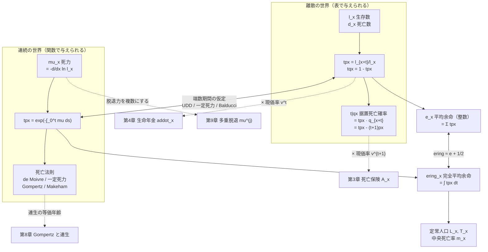
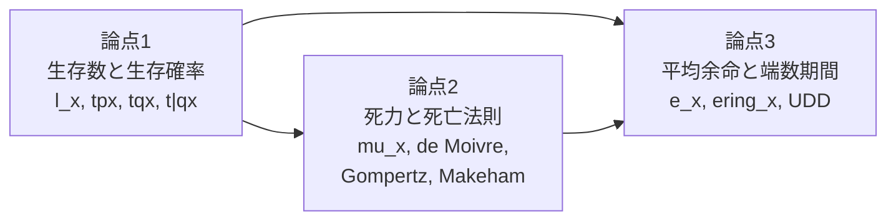
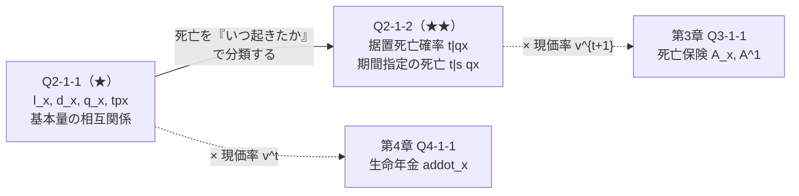
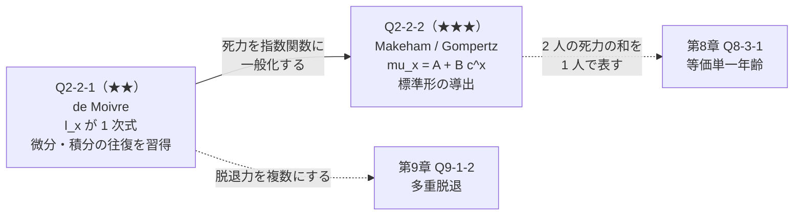
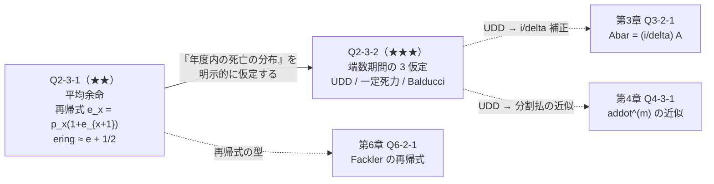
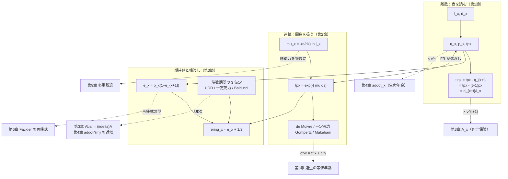
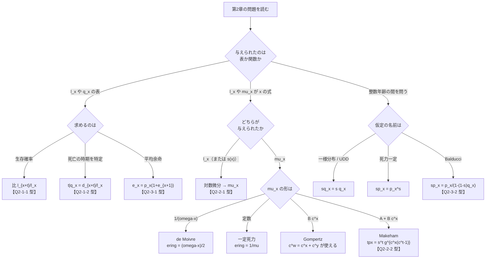

# 第2章　生命表と生存分布

> [← 第1章 利息の理論](第01章_利息の理論と現価計算.md) ｜ **第2章** ｜ [第3章 一時払純保険料 →](第03章_一時払純保険料.md)

---

## 章の地図



**この図の読み方**：第2章には **離散の世界（左）と連続の世界（右）** という2つの入口があり、
両者は「端数期間の仮定」で行き来します。
下段の点線は後の章への接続で、**据置死亡確率 ${}_{t\vert}q_x$ が第3章の死亡保険、
生存確率 ${}_tp_x$ が第4章の生命年金** に直結することを示しています。

---

## この章で学ぶこと

第2章は、生保数理の **第2層＝「いつ死亡するかの確率」** を扱います。
ここにはお金（利率・現価）が一切登場しません。扱うのは確率だけです。

第1章で現価率 $v^t$ を、第2章で確率 ${}_tp_x,\ {}_{t\vert}q_x$ を切り出し、
第3章で両者を掛け合わせて期待現価を作ります。

$$\text{期待現価}=\sum(\text{給付額})\times\underbrace{(\text{発生確率})}_{\textbf{第2章}}\times\underbrace{(\text{現価率})}_{\text{第1章}}$$

この章の内容は、記号の数こそ多いものの、**本質は3つだけ** です。

1. 生存確率は **生存数の比** である（$_tp_x=l_{x+t}/l_x$）
2. 死亡確率は **生存確率の差** である（${}_{t\vert}q_x={}_tp_x-{}_{t+1}p_x$）
3. 死力は **生存関数の対数微分** である（$\mu_x=-\frac{d}{dx}\ln l_x$）

残りはすべてこの3つの言い換えです。

---

## この章の全体像

### 論点同士の関係



論点1は表（離散）の話、論点2は関数（連続）の話です。
論点3は **両者をつなぐ** 位置にあり、だから最後に置いています。

### 学習順序

```text
① l_x から tpx, tqx を作る                …… 生存数の比。ここが起点
        ↓
② 死亡を「いつ起きたか」で分類する         …… t|qx（据置死亡確率）
        ↓
③ 連続の世界に移る：死力 mu_x を定義する
        ↓
④ mu_x から tpx を復元する（積分）
        ↓
⑤ 具体的な死亡法則を当てはめる            …… de Moivre / Gompertz / Makeham
        ↓
⑥ 生存年数の期待値を取る                  …… e_x, ering_x
        ↓
⑦ 離散と連続をつなぐ                      …… 端数期間の3仮定
```

---

## 最初に頭に入れるべきポイント

### $l_x$ は「人数」ではなく「確率の分母」

$l_x$ は生命表の出発点ですが、**その絶対値には意味がありません**。
$l_0=100{,}000$ でも $l_0=10^7$ でも、確率は同じです。

$$_tp_x=\frac{l_{x+t}}{l_x}$$

比を取るので基数（radix）は消えます。$l_x$ は
**「確率を分数で書くための共通の分母を用意する道具」** だと理解してください。

```text
l_x の役割：

  l_40 = 100000  ┐
                 ├─ この 2 つから  20p_40 = l_60/l_40  が出る
  l_60 =  93000  ┘

  ★ 100000 という数値自体は任意。90000 と 83700 でも同じ確率になる。
```

### 死亡確率は「生存確率の差」

これが第2章で最も使う考え方です。

$$_{t\vert}q_x=\underbrace{{}_tp_x}_{t\text{ 年生存}}\times\underbrace{q_{x+t}}_{\text{次の1年で死亡}}
={}_tp_x-{}_{t+1}p_x$$

```text
時間軸で見る：

年齢     x        x+1      x+2      x+3
         |--------|--------|--------|
生存確率 1      1p_x     2p_x     3p_x      ← 階段状に減っていく
                                             減った分が「その年の死亡」

  2|q_x = 2p_x - 3p_x    ← 年齢 x+2 から x+3 の間に減った分
        = 2p_x · q_{x+2}  ← 「x+2 まで生き延びて、そこから1年で死ぬ」
```

**2つの表現の使い分け**

| 表現 | いつ使うか |
|---|---|
| ${}_{t\vert}q_x={}_tp_x\,q_{x+t}$ | $q$ の表が与えられているとき／確率の意味を説明するとき |
| ${}_{t\vert}q_x={}_tp_x-{}_{t+1}p_x$ | $l_x$ の表が与えられているとき／**和を計算するとき** |

第3章で $A_x=\sum v^{t+1}{}_{t\vert}q_x$ を扱いますが、
$A_x=1-d\ddot a_x$ の導出には **差の形** を使います。差の形は和を取ると打ち消し合う
（望遠鏡和）ため、計算が劇的に簡単になります。

### 死力は「瞬間の死亡率」＝利力の親戚

第1章の利力 $\delta$ と、第2章の死力 $\mu_x$ は **同じ構造** をもちます。

| 第1章 | 第2章 | 共通の構造 |
|---|---|---|
| $\delta=-\frac{d}{dt}\ln v^t$ | $\mu_x=-\frac{d}{dx}\ln l_x$ | 対数微分 |
| $v^t=\exp\left(-\int_0^t\delta_s ds\right)$ | ${}_tp_x=\exp\left(-\int_0^t\mu_{x+s}ds\right)$ | 指数の中の積分 |
| 「瞬間の利率」 | 「瞬間の死亡率」 | 瞬間的な減少率 |

**$\mu_x$ は確率ではありません。** $1$ を超えることがあります（高齢では実際に超える）。
確率になるのは $\mu_x\,dx$（微小区間での死亡確率）です。ここは頻出の誤解です。

### 平均余命は2種類ある

| 記号 | 名称 | 定義 | 何を数えるか |
|---|---|---|---|
| $e_x$ | 平均余命（整数） | $\displaystyle\sum_{t=1}^{\infty}{}_tp_x$ | 生存年数の **整数部分** の期待値 |
| $\mathring e_x$ | 完全平均余命 | $\displaystyle\int_0^{\infty}{}_tp_x\,dt$ | 生存年数そのものの期待値 |

$$\mathring e_x\approx e_x+\tfrac12$$

**この近似の根拠**：$e_x$ は端数を切り捨てて数えるので、
平均して半年分だけ少なく数えています。各年度内で死亡が一様分布（UDD）なら、
切り捨てられる端数の平均が正確に $1/2$ になります。

---

## 基本記号・基本公式

### 離散の世界

| 公式 | 記号の意味 | 式が表す内容 | 使用場面 | 成立条件 | 間違えやすい点 |
|---|---|---|---|---|---|
| $_tp_x=\dfrac{l_{x+t}}{l_x}$ | $l_x$：生存数 | $t$ 年生存する確率 | すべて | なし（定義） | 分母は $l_x$（$l_0$ ではない） |
| $d_x=l_x-l_{x+1}$ | $d_x$：死亡数 | $x$ 歳から1年間の死亡数 | 表の読み取り | なし（定義） | $d_x$ は**人数**、$q_x$ は**確率** |
| $q_x=\dfrac{d_x}{l_x}$ | $q_x$：死亡率 | 1年以内に死亡する確率 | すべて | なし（定義） | 分母は $l_x$（$l_{x+1}$ ではない） |
| $_tp_x=p_x\,p_{x+1}\cdots p_{x+t-1}$ | — | 生存確率の乗法性 | $q$ の表から計算 | なし | 添字は $x$ から $x+t-1$ まで（$x+t$ を含まない） |
| $_{t\vert}q_x={}_tp_x\,q_{x+t}$ | ${}_{t\vert}q_x$：据置死亡確率 | $t$ 年生存し次の1年で死亡 | 死亡保険 | なし（定義） | $q_{x+t}$ の添字は $x+t$ |
| $_{t\vert}q_x={}_tp_x-{}_{t+1}p_x$ | — | 同上（差の形） | **和を取るとき** | なし | 差の順序（大 $-$ 小） |
| $_{t\vert s}q_x={}_tp_x\cdot{}_sq_{x+t}$ | — | $t$ 年生存し次の $s$ 年で死亡 | 期間指定の死亡 | なし | $s$ の位置に注意 |

### 連続の世界

| 公式 | 意味 | 成立条件 | 間違えやすい点 |
|---|---|---|---|
| $\mu_x=-\dfrac{d}{dx}\ln l_x=\dfrac{-l'_x}{l_x}$ | 死力の定義 | $l_x$ が微分可能 | **$\mu_x$ は確率ではない**（$>1$ もあり得る） |
| $_tp_x=\exp\left(-\displaystyle\int_0^t\mu_{x+s}\,ds\right)$ | 死力から生存確率 | なし（一般形） | 積分変数は $s$、上端は $t$ |
| $\dfrac{d}{dt}{}_tp_x=-{}_tp_x\,\mu_{x+t}$ | 生存確率の微分 | 同上 | 符号（減少するので負） |
| $_tp_x\,\mu_{x+t}$ | 死亡時刻の確率密度 | 同上 | これが密度、$\mu$ 単独は密度でない |
| $\bar A$ 系の積分に現れる形 | $\displaystyle\int_0^n{}_tp_x\mu_{x+t}dt={}_nq_x$ | 同上 | 全期間で積分すると1（$n\to\infty$） |

### 死亡法則

| 名称 | 死力 | 生存確率 ${}_tp_x$ | 特徴・使う場面 |
|---|---|---|---|
| de Moivre | $\mu_x=\dfrac{1}{\omega-x}$ | $\dfrac{\omega-x-t}{\omega-x}$ | 余命が一様分布。$\mathring e_x=\dfrac{\omega-x}{2}$ |
| 一定死力 | $\mu_x=\mu$ | $e^{-\mu t}$ | 指数分布。**無記憶性**（$\mathring e_x=1/\mu$ が年齢に依らない） |
| Gompertz | $\mu_x=Bc^{x}$ | $g^{c^x(c^t-1)}$ | 連生で **等価単一年齢** が作れる（第8章） |
| Makeham | $\mu_x=A+Bc^{x}$ | $s^{t}g^{c^x(c^t-1)}$ | $A$ は年齢に依らない事故的死亡 |

ここで $s=e^{-A}$、$g=e^{-B/\ln c}$ です。

### 平均余命・定常人口

| 記号 | 定義 | 関係式 |
|---|---|---|
| $e_x$ | $\displaystyle\sum_{t=1}^{\infty}{}_tp_x$ | $e_x=p_x(1+e_{x+1})$ |
| $\mathring e_x$ | $\displaystyle\int_0^{\infty}{}_tp_x\,dt=\dfrac{T_x}{l_x}$ | $\mathring e_x\approx e_x+\tfrac12$（UDD） |
| $L_x$ | $\displaystyle\int_0^1 l_{x+s}\,ds$ | $L_x\approx\dfrac{l_x+l_{x+1}}{2}$（UDD） |
| $T_x$ | $\displaystyle\int_0^{\infty}l_{x+s}\,ds$ | $T_x=\displaystyle\sum_{k\ge0}L_{x+k}$ |
| $m_x$ | $\dfrac{d_x}{L_x}$ | $m_x\approx\dfrac{q_x}{1-\frac12 q_x}$（UDD） |

### 端数期間の3仮定（$0\le s\le1$）

| 仮定 | ${}_sq_x$ | ${}_sp_x$ | $\mu_{x+s}$ | 定義の考え方 |
|---|---|---|---|---|
| **UDD**（死亡一様分布） | $s\,q_x$ | $1-s\,q_x$ | $\dfrac{q_x}{1-s\,q_x}$ | ${}_sq_x$ が $s$ の**1次式** |
| **一定死力** | $1-p_x^{\,s}$ | $p_x^{\,s}$ | $-\ln p_x$ | $\mu$ が区間内で**一定** |
| **Balducci** | $\dfrac{s\,q_x}{1-(1-s)q_x}$ | $\dfrac{p_x}{1-(1-s)q_x}$ | $\dfrac{q_x}{1-(1-s)q_x}$ | ${}_{1-s}q_{x+s}=(1-s)q_x$ |

**大小関係（$0<s<1$）**

$$\underbrace{{}_sq_x^{\text{UDD}}}_{\text{最小}}\ <\ {}_sq_x^{\text{一定死力}}\ <\ \underbrace{{}_sq_x^{\text{Balducci}}}_{\text{最大}}$$

---

## 試験での主な問われ方

| 出題形態 | 典型的な問われ方 | 対応する問題 |
|---|---|---|
| 小問（穴埋め） | $l_x$ の表を与えて ${}_tp_x,\ {}_{t\vert}q_x$ を計算させる | Q2-1-1, Q2-1-2 |
| 小問 | 生存関数 $s(x)$ を与えて $\mu_x$ を求めさせる | Q2-2-1 |
| 小問 | $e_x=p_x(1+e_{x+1})$ を使った逐次計算 | Q2-3-1 |
| 記述式 | Makeham の ${}_tp_x$ を $s,g,c$ で表す導出 | Q2-2-2 |
| 記述式 | 端数期間の3仮定を比較し、大小を証明させる | Q2-3-2 |
| 記述式の一部 | $\mathring e_x\approx e_x+\frac12$ の根拠を説明させる | Q2-3-1 |
| 他章との複合 | UDD を使って $\bar A_x=\frac{i}{\delta}A_x$ を導く | Q3-2-1（第3章） |

**重要**：第2章単独の問題は小問が中心ですが、**端数期間の仮定（特に UDD）は
第3章・第4章の連続型・分割払の問題で必ず前提として使われます**。
Q2-3-2 は、見た目は第2章の問題ですが、実質的には第3・4章の準備です。

---

## 問題を見分けるためのサイン

| 問題文中の表現 | 判断すること |
|---|---|
| 「生命表が次のとおり」「$l_x$ の値」 | 離散の世界。比を取るだけ |
| 「生存関数 $s(x)=\cdots$」「$l_x=\cdots$（$x$ の式）」 | 連続の世界。$\mu_x$ は対数微分 |
| 「死力」「$\mu_x$」 | 連続。$\exp\left(-\int\mu\right)$ |
| 「$\mu_x=A+Bc^x$」 | **Makeham**。$s,g$ を導入して整理 |
| 「$\mu_x=Bc^x$」 | **Gompertz**。連生の等価年齢が使える（第8章） |
| 「$\mu_x=\frac{1}{\omega-x}$」「余命が一様分布」 | **de Moivre**。$\mathring e_x=\frac{\omega-x}{2}$ |
| 「死力が一定」 | 指数分布。無記憶性を使える |
| 「平均余命」 | $\mathring e_x$（完全）か $e_x$（整数）かを**必ず確認** |
| 「$t$ 年後に死亡」「$t$ 年目に死亡」 | 据置死亡確率 ${}_{t\vert}q_x$。$t$ の起点に注意 |
| 「各年度内の死亡は一様に分布」 | **UDD**。${}_sq_x=s\,q_x$ |
| 「端数期間」「$1/m$ 年」 | 端数期間の仮定を確認（3種のどれか） |
| 「定常人口」「$L_x$」「中央死亡率」 | 積分の世界。$L_x\approx\frac{l_x+l_{x+1}}{2}$ |
| 「選択生命表」「$[x]$」 | 加入時年齢による選択効果。$q_{[x]+t}$ の添字に注意 |

**⚠ 特に注意すべき語**

* 「**平均余命**」だけでは $e_x$ と $\mathring e_x$ が区別できません。
  「完全平均余命」なら $\mathring e_x$、単に「平均余命」なら文脈で判断し、
  答案で **どちらを使ったか明記** してください。
* 「**$t$ 年目に死亡**」は ${}_{t-1\vert}q_x$ です（第1年目は ${}_{0\vert}q_x=q_x$）。
  「**$t$ 年後に死亡**」は ${}_{t\vert}q_x$ です。1つずれます。
* 「**死亡率**」は $q_x$（年央でなく年始基準）、
  「**中央死亡率**」は $m_x$（平均生存数基準）で別物です。

---

## この章の問題一覧

| ID | 表題 | 難 | 段階 | この問題の役割 |
|---|---|---|---|---|
| **第1節　生存確率と死亡確率** | | | | |
| Q2-1-1 | 生命表の基本量の関係 | ★ | ① | $l_x,d_x,q_x,{}_tp_x$ の相互関係を確定させる |
| Q2-1-2 | 据置死亡確率の分解 | ★★ | ② | 死亡を「いつ起きたか」で分類する。第3章の死亡保険に直結 |
| **第2節　死力と死亡法則** | | | | |
| Q2-2-1 | 死力から生存関数を復元する | ★★ | ② | 連続の世界へ移る。対数微分と積分の往復 |
| Q2-2-2 | Gompertz・Makeham 法則の性質 | ★★★ | ③ | 具体的死亡法則の扱い。第8章の等価年齢の下地 |
| **第3節　平均余命と端数期間** | | | | |
| Q2-3-1 | 平均余命の再帰式と $e_x,\mathring e_x$ の関係 | ★★ | ③ | 再帰式という技術の初出。第6章 Fackler の下地 |
| Q2-3-2 | 端数期間の3つの仮定の比較 | ★★★ | ④ | 離散と連続をつなぐ。第3・4章の連続型・分割払の前提 |

---
---

# 第1節　生存確率と死亡確率

## この節のテーマ

**生命表（$l_x$ の表）から、あらゆる生存確率・死亡確率を作り出す技術** を扱います。
新しい概念はほとんどなく、**「比を取る」「差を取る」の2操作だけ** です。

## この節でできるようになること

* $l_x$ の表から ${}_tp_x,\ {}_tq_x,\ {}_{t\vert}q_x,\ {}_{t\vert s}q_x$ を計算できる
* $q_x$ の表から ${}_tp_x$ を乗法的に計算できる
* 「$t$ 年目に死亡」「$t$ 年後に死亡」の1つのずれを正しく処理できる
* 据置死亡確率を2通り（積の形・差の形）で表し、状況に応じて使い分けられる

## 頭に入れるべきポイント

### すべては $l_x$ の「比」と「差」

```text
        比を取る                      差を取る
           ↓                             ↓
    tpx = l_{x+t}/l_x            d_x = l_x - l_{x+1}
    （生存確率）                  （死亡数）
           ↓                             ↓
      両方を組み合わせる
           ↓
    t|qx = (l_{x+t} - l_{x+t+1}) / l_x
             └── 差 ──┘   └ 比 ┘
```

**この1本の式にすべてが入っています。**

$$_{t\vert}q_x=\frac{l_{x+t}-l_{x+t+1}}{l_x}=\frac{d_{x+t}}{l_x}$$

分子は「$x+t$ 歳から $x+t+1$ 歳の間に死ぬ人数」、分母は「出発時点の人数」です。
**分母が $l_x$（$l_{x+t}$ ではない）** ことが決定的で、ここが $q_{x+t}$ との違いです。

$$q_{x+t}=\frac{d_{x+t}}{l_{x+t}}\qquad\text{vs}\qquad{}_{t\vert}q_x=\frac{d_{x+t}}{l_x}$$

| 記号 | 分母 | 言葉で言うと |
|---|---|---|
| $q_{x+t}$ | $l_{x+t}$ | 「**$x+t$ 歳まで生きた人のうち** 次の1年で死ぬ割合」 |
| ${}_{t\vert}q_x$ | $l_x$ | 「**$x$ 歳の人のうち** $x+t$〜$x+t+1$ 歳で死ぬ割合」 |

両者の関係が ${}_{t\vert}q_x={}_tp_x\,q_{x+t}$ です（$l_x$ から $l_{x+t}$ への橋渡しが ${}_tp_x$）。

### 「$t$ 年目」と「$t$ 年後」は1つずれる

| 表現 | 意味する区間 | 記号 |
|---|---|---|
| 第1年目に死亡 | $x$ 〜 $x+1$ 歳 | ${}_{0\vert}q_x=q_x$ |
| 第2年目に死亡 | $x+1$ 〜 $x+2$ 歳 | ${}_{1\vert}q_x$ |
| 第 $t$ 年目に死亡 | $x+t-1$ 〜 $x+t$ 歳 | ${}_{t-1\vert}q_x$ |
| $t$ 年後に死亡 | $x+t$ 〜 $x+t+1$ 歳 | ${}_{t\vert}q_x$ |

**この1つのずれが、第3章の $A_x=\sum_{t=0}^{\infty}v^{t+1}{}_{t\vert}q_x$ の
現価率の指数 $t+1$ に直結します。** 「$t$ 年後に死亡したら死亡年度末（$=t+1$ 時点）に支払う」
という対応です。

## 使用する記号・公式

| 記号 | 定義 | 備考 |
|---|---|---|
| $l_x$ | 生存数 | 絶対値に意味はない（比の分母） |
| $d_x$ | $l_x-l_{x+1}$ | 人数 |
| $q_x$ | $d_x/l_x$ | 確率 |
| $p_x$ | $1-q_x=l_{x+1}/l_x$ | 確率 |
| ${}_tp_x$ | $l_{x+t}/l_x=\prod_{k=0}^{t-1}p_{x+k}$ | 乗法的 |
| ${}_tq_x$ | $1-{}_tp_x=(l_x-l_{x+t})/l_x$ | $t$ 年以内の死亡 |
| ${}_{t\vert}q_x$ | ${}_tp_x\,q_{x+t}={}_tp_x-{}_{t+1}p_x=d_{x+t}/l_x$ | 3通りの表現 |
| ${}_{t\vert s}q_x$ | ${}_tp_x\cdot{}_sq_{x+t}=({}_tp_x-{}_{t+s}p_x)$ | $t$ 年生存し次の $s$ 年で死亡 |

**確率の分解（全事象）**

$$\sum_{t=0}^{\infty}{}_{t\vert}q_x=1$$

「いつかは必ず死ぬ」という意味です。有限期間なら

$$_nq_x=\sum_{t=0}^{n-1}{}_{t\vert}q_x$$

## 基本的な解法パターン

```text
① 与えられているのは l_x の表か、q_x の表か  ← まずこれを確認
        ↓
   ┌── l_x の表 ──→ 比と差で直接計算する（乗法計算は不要）
   │
   └── q_x の表 ──→ tpx = p_x · p_{x+1} · ... と掛け算する
        ↓
② 求める確率を年齢軸に描く                    ← どの区間の話か図示
        ↓
③ 「生存条件の区間」と「死亡条件の区間」を分ける
        ↓
④ 生存部分は tpx（比）、死亡部分は q または差
        ↓
⑤ 掛け合わせる
        ↓
⑥ 検算：確率が 0 以上 1 以下か、
   区間を分割した和が全体と一致するか
```

**①の分岐が重要です。** $l_x$ の表があるなら乗法計算は不要で、
両端の $l$ の比を取るだけです。$q_x$ しかない場合のみ掛け算します。

## 間違えやすい点

| 誤り | 内容 | 防ぎ方 |
|---|---|---|
| ${}_{t\vert}q_x$ の分母 | $l_{x+t}$ で割ってしまう（$q_{x+t}$ になる） | 「$x$ 歳の人が基準」と確認 |
| 「$t$ 年目」と「$t$ 年後」 | 1つずれる | 年齢軸に区間を描く |
| ${}_tp_x$ の掛け算の範囲 | $p_x\cdots p_{x+t}$ とする（1つ多い） | $x$ から $x+t-1$ まで（$t$ 個） |
| ${}_{t\vert s}q_x$ の $s$ の位置 | ${}_sq_{x+t}$ を ${}_sq_x$ とする | 生存後の年齢は $x+t$ |
| 差の順序 | ${}_{t+1}p_x-{}_tp_x$（負になる） | 生存確率は減少。大 $-$ 小 |
| $d_x$ と $q_x$ の混同 | 人数と確率 | $d_x$ は表の値、$q_x$ は割り算の結果 |

## この節の問題の流れ



Q2-1-1 で「生存」を、Q2-1-2 で「死亡」を扱います。
この2つが第3章（死亡保険）と第4章（生命年金）に分岐していきます。

---
---

## 問題 Q2-1-1　生命表の基本量の関係

| 項目 | 内容 |
|---|---|
| 出題年度 | `要照合`（記入欄：______年度） |
| 問題番号 | `要照合`（記入欄：問題___） |
| 分野・論点 | 生命表 ／ 生存数・死亡数・生存確率 |
| 難易度 | ★ |
| この節での位置づけ | 段階①（定義を直接使う）。本章全体の記号を確定させる最初の問題 |
| 関連する問題 | 発展元：— ／ 本問 ／ 後続：Q2-1-2（死亡を時期別に分解）、Q2-2-1（連続の世界へ）、Q4-1-1（生存確率に現価率を掛ける） |

### ■ この問題で押さえるべきポイント

#### ① 何を問う問題か

**生命表（$l_x$ の表）から、$d_x$、$q_x$、${}_tp_x$、${}_tq_x$ を求めさせる問題** です。
計算は割り算と引き算だけで、問われているのは
**それぞれの記号の「分母が何か」を正確に把握しているか** です。

#### ② 問題文から読み取るべき条件

| 条件 | 解法への影響 |
|---|---|
| 「$l_x$ の値が次のとおり」 | **離散の世界**。乗法計算は不要、比と差で済む |
| 「$l_{40}=100{,}000$」 | 基数。この値自体は確率に影響しない |
| 求めるのが $q_{42}$ | 分母は $l_{42}$ |
| 求めるのが ${}_2p_{40}$ | 分母は $l_{40}$、分子は $l_{42}$ |
| 求めるのが ${}_{5}q_{40}$ | $1-{}_5p_{40}=(l_{40}-l_{45})/l_{40}$ |

#### ③ 最初に注目する場所

**「求める記号の下付き左の年齢」＝分母の年齢** です。
$q_{42}$ なら分母 $l_{42}$、${}_2p_{40}$ なら分母 $l_{40}$。
この1点だけで、表のどの値で割るかが決まります。

#### ④ 呼び出すべき知識

| 知識 | なぜこの問題で使うか |
|---|---|
| $d_x=l_x-l_{x+1}$ | 死亡数は生存数の差。表から直接引き算 |
| $q_x=d_x/l_x$ | 死亡率は「その年齢の生存者に対する割合」 |
| ${}_tp_x=l_{x+t}/l_x$ | 生存確率は生存数の比。**$t$ 個の $p$ を掛ける必要はない** |
| ${}_tq_x=1-{}_tp_x$ | 余事象 |
| $p_x+q_x=1$ | 検算に使う |

#### ⑤ 解法の骨格

```text
1. 表から必要な l_x を抜き出す
2. d_x は隣接する l の差
3. q_x は d_x を l_x で割る
4. tpx は両端の l の比（掛け算不要）
5. tqx は 1 - tpx
6. 検算：p + q = 1、tpx が t について減少しているか
```

#### ⑥ 間違えやすい点

* $q_x=d_x/l_{x+1}$ としてしまう（分母は $l_x$）
* ${}_2p_{40}$ を $p_{40}\times p_{41}$ と計算し、丸め誤差を重ねる（比を取れば1回の割り算）
* ${}_5q_{40}$ を $q_{40}+q_{41}+\cdots+q_{44}$ とする
  （これは近似にすぎず、正確には $1-{}_5p_{40}$）
* $d_x$（人数）を確率と混同する

#### ⑦ この問題を一言で捉えると

> **「分母がどの年齢の $l$ か」を見極めるだけの問題。**

### ■ 問題の構造図

```text
生命表の構造（年齢軸）：

年齢      40        41        42        43        44        45
          |---------|---------|---------|---------|---------|
l_x    100000.0   99851.6   99695.9   99532.1   99359.4   99176.7
          └── d_40 ──┘  └ d_41 ┘  └ d_42 ┘  └ d_43 ┘  └ d_44 ┘
            148.4      155.7     163.8     172.7     182.7

各記号の分母：

  q_42 = d_42 / l_42          分母は l_42（★ その年齢の生存者）
          163.8   99695.9

  2p_40 = l_42 / l_40         分母は l_40（★ 出発年齢の生存者）
          99695.9  100000.0

  5q_40 = (l_40 - l_45)/l_40  分母は l_40
```

**この図が示すこと**：同じ死亡数 $d_{42}$ を使っても、
**$l_{42}$ で割れば $q_{42}$、$l_{40}$ で割れば ${}_{2\vert}q_{40}$** になります。
分母の違いだけで別の記号になる、というのが生命表の記号体系です。

### ■ 問題

ある生命表の一部が次のとおり与えられている。

| $x$ | $l_x$ | $x$ | $l_x$ |
|---|---|---|---|
| 40 | 100000.0 | 45 | 99176.7 |
| 41 | 99851.6 | 46 | 98983.1 |
| 42 | 99695.9 | 47 | 98777.2 |
| 43 | 99532.1 | 48 | 98558.0 |
| 44 | 99359.4 | 49 | 98323.8 |
| | | 50 | 98073.1 |

次の各値を求めよ（確率は小数第7位まで）。

**(1)** $d_{40}$、$d_{42}$

**(2)** $q_{40}$、$q_{42}$

**(3)** ${}_2p_{40}$、${}_5p_{40}$、${}_{10}p_{40}$

**(4)** ${}_2q_{40}$

**(5)** ${}_5p_{40}$ を $p_{40}p_{41}p_{42}p_{43}p_{44}$ として計算し、(3) の値と一致することを確認せよ。
また、どちらの計算方法が望ましいか理由を述べよ。

> 本問は再現題です。原文の出題年度・問題番号は未照合です。

### ■ 問題文を数理モデルへ変換

| 確認項目 | 問題文から読み取れる内容 | 数理的な表現 |
|---|---|---|
| 与えられるもの | $l_x$ の表（$x=40,\dots,50$） | 離散の生命表 |
| 基数 | $l_{40}=100000.0$ | 確率には影響しない |
| (1) $d_{40}$ | $40$ 歳から1年間の死亡数 | $l_{40}-l_{41}$ |
| (2) $q_{40}$ | $40$ 歳の年間死亡率 | $d_{40}/l_{40}$ |
| (3) ${}_2p_{40}$ | $40$ 歳が2年生存する確率 | $l_{42}/l_{40}$ |
| (4) ${}_2q_{40}$ | $40$ 歳が2年以内に死亡する確率 | $1-{}_2p_{40}$ |
| (5) 乗法表現 | 生存確率の乗法性 | $\prod_{k=0}^{4}p_{40+k}$ |

### ■ 解法フロー

```text
STEP 1　(1) 隣接する l_x の差で d_x を求める
STEP 2　(2) d_x を l_x で割って q_x を求める
STEP 3　(3) 両端の l の比で tpx を求める
STEP 4　(4) 余事象で tqx を求める
STEP 5　(5) 乗法計算と比較し、望ましい方法を判断する
STEP 6　検算する
```

### ■ 詳細解説

#### STEP 1　(1) 死亡数 $d_x$

*目的：$d_x$ が生存数の差であることを表の値で確認する。*

$$d_{40}=l_{40}-l_{41}=100000.0-99851.6=148.4$$

$$d_{42}=l_{42}-l_{43}=99695.9-99532.1=163.8$$

$d_x$ は **人数**（確率ではない）です。基数 $l_{40}=100000$ に依存する量なので、
$l_{40}=10^7$ の表なら $d_{40}=14840$ になります。

#### STEP 2　(2) 死亡率 $q_x$

*目的：分母が「その年齢の生存者数」であることを確認する。*

$$q_{40}=\frac{d_{40}}{l_{40}}=\frac{148.4}{100000.0}=0.0014840$$

$$q_{42}=\frac{d_{42}}{l_{42}}=\frac{163.8}{99695.9}=0.0016428$$

**⚠ $q_{42}$ の分母に注意**：$l_{40}$ ではなく $l_{42}$ です。
$q_{42}$ は「**42歳まで生きた人のうち**、次の1年で死亡する割合」だからです。

もし誤って $l_{40}$ で割ると $163.8/100000=0.0016380$ となり、
これは $q_{42}$ ではなく ${}_{2\vert}q_{40}$（据置死亡確率）になります。
**割る数を変えるだけで別の記号になる** ため、分母の確認が最重要です。

#### STEP 3　(3) 生存確率 ${}_tp_x$

*目的：両端の $l$ の比だけで求まることを確認する。*

$$_2p_{40}=\frac{l_{42}}{l_{40}}=\frac{99695.9}{100000.0}=0.9969590$$

$$_5p_{40}=\frac{l_{45}}{l_{40}}=\frac{99176.7}{100000.0}=0.9917670$$

$$_{10}p_{40}=\frac{l_{50}}{l_{40}}=\frac{98073.1}{100000.0}=0.9807310$$

**$t$ が大きくても計算量は増えません。** ${}_{10}p_{40}$ も割り算1回です。
これが「$l_x$ の表が与えられたら比を取る」という方針の利点です。

**検算**：$t$ が増えると生存確率は減少するはずです。

$$0.9969590>0.9917670>0.9807310\quad\checkmark$$

#### STEP 4　(4) 死亡確率 ${}_2q_{40}$

*目的：余事象として求める。*

$$_2q_{40}=1-{}_2p_{40}=1-0.9969590=0.0030410$$

**別経路での確認**：$l$ の差から直接求めても同じです。

$$_2q_{40}=\frac{l_{40}-l_{42}}{l_{40}}=\frac{100000.0-99695.9}{100000.0}=\frac{304.1}{100000.0}=0.0030410\quad\checkmark$$

**⚠ よくある誤り**：${}_2q_{40}=q_{40}+q_{41}$ とすること。

$$q_{41}=\frac{d_{41}}{l_{41}}=\frac{155.7}{99851.6}=0.0015593$$

$$q_{40}+q_{41}=0.0014840+0.0015593=0.0030433$$

正解 $0.0030410$ と一致しません（差 $0.0000023$）。
**なぜずれるか**：$q_{41}$ は「41歳まで生きた人」に対する確率なので、
40歳の人を基準にするには ${}_1p_{40}$ を掛けなければなりません。正しくは

$$_2q_{40}=q_{40}+{}_1p_{40}\,q_{41}=0.0014840+0.9985160\times0.0015593=0.0014840+0.0015570=0.0030410\quad\checkmark$$

$q$ が小さいときは単純和との差も小さいため見逃しやすいですが、
**論理的には誤り** です。高齢や長期間では大きくずれます。

#### STEP 5　(5) 乗法計算との比較

*目的：2つの計算経路が一致することを確認し、望ましい方法を判断する。*

まず各 $p_x$ を求めます。

| $x$ | $l_x$ | $l_{x+1}$ | $p_x=l_{x+1}/l_x$ |
|---|---|---|---|
| 40 | 100000.0 | 99851.6 | 0.9985160 |
| 41 | 99851.6 | 99695.9 | 0.9984407 |
| 42 | 99695.9 | 99532.1 | 0.9983570 |
| 43 | 99532.1 | 99359.4 | 0.9982649 |
| 44 | 99359.4 | 99176.7 | 0.9981612 |

積を順に取ります（各段の値を7桁で保持）。

$$0.9985160\times0.9984407=0.9969590$$
$$0.9969590\times0.9983570=0.9953210$$
$$0.9953210\times0.9982649=0.9935940$$
$$0.9935940\times0.9981612=0.9917670$$

(3) の値 $0.9917670$ と **小数第7位まで完全に一致** します。✓

**なぜ完全に一致するのか**：乗法の各段で分子と分母が次々に約分されるためです。

$$\frac{l_{41}}{l_{40}}\cdot\frac{l_{42}}{l_{41}}\cdot\frac{l_{43}}{l_{42}}
\cdot\frac{l_{44}}{l_{43}}\cdot\frac{l_{45}}{l_{44}}=\frac{l_{45}}{l_{40}}$$

数学的には **恒等的に同じ量** であり、差が出るのは
途中で丸めた場合の数値誤差だけです。本問では各段を7桁保持したため誤差が現れませんでした。

**どちらが望ましいか**

| 方法 | 計算回数 | 丸め誤差 | 判断 |
|---|---|---|---|
| 比を取る $l_{45}/l_{40}$ | 割り算1回 | 1回分のみ | **望ましい** |
| 乗法 $\prod p_{40+k}$ | 割り算5回＋掛け算4回 | 各段の丸めが累積し得る | 表がある場合は不利 |

**結論**：$l_x$ の表が与えられている場合は **比を取る** べきです。
両者は数学的に同一ですが、乗法では各 $p_x$ を丸めるたびに誤差が入る余地があります。
本問のように各段を十分な桁数で保持すれば一致しますが、
たとえば各 $p_x$ を小数第4位で丸めると

$$0.9985\times0.9984\times0.9984\times0.9983\times0.9982=0.9918$$

となり、有効桁が4桁に落ちてしまいます。
**比を取れば表の精度がそのまま最終結果に反映される** という点が実務上の利点です。

**乗法計算が必要になるのは**、$q_x$ の値のみが与えられ、$l_x$ の表がない場合です
（この場合は ${}_tp_x=\prod(1-q_{x+k})$ 以外に方法がありません）。

#### STEP 6　検算

| 項目 | 確認内容 | 結果 |
|---|---|---|
| $p+q=1$ | $p_{40}+q_{40}=0.9985160+0.0014840=1.0000000$ | ✓ |
| ${}_tp_x$ の単調性 | $0.9969590>0.9917670>0.9807310$ | ✓ |
| ${}_tp+{}_tq=1$ | ${}_2p_{40}+{}_2q_{40}=0.9969590+0.0030410=1.0000000$ | ✓ |
| $q_x$ の単調性 | $q_{40}=0.0014840<q_{42}=0.0016428$（加齢で上昇） | ✓ |
| 2経路の一致 | 比 $0.9917670$ ≒ 積 $0.9917672$ | ✓ |

### ■ 答え

| 設問 | 量 | 値 |
|---|---|---|
| (1) | $d_{40}$ | $148.4$ |
| | $d_{42}$ | $163.8$ |
| (2) | $q_{40}$ | $0.0014840$ |
| | $q_{42}$ | $0.0016428$ |
| (3) | ${}_2p_{40}$ | $0.9969590$ |
| | ${}_5p_{40}$ | $0.9917670$ |
| | ${}_{10}p_{40}$ | $0.9807310$ |
| (4) | ${}_2q_{40}$ | $0.0030410$ |

**(5)** $p_{40}p_{41}p_{42}p_{43}p_{44}=0.9917670$ となり、(3) の $0.9917670$ と
**小数第7位まで完全に一致** する（隣接項の分子・分母が約分されるため、両者は恒等的に同じ量）。
$l_x$ の表がある場合は、丸めが1回で済む **比 $l_{45}/l_{40}$ を取る方法が望ましい**。

> **丸めについて**：$l_x$ が小数第1位まで与えられているため、
> 確率の有効桁は7桁程度が限度です。それ以上の桁は表の精度を超えます。

### ■ 試験答案としての書き方

> **(1)** $d_{40}=l_{40}-l_{41}=100000.0-99851.6=148.4$
> $d_{42}=l_{42}-l_{43}=99695.9-99532.1=163.8$
>
> **(2)** $q_{40}=\dfrac{d_{40}}{l_{40}}=\dfrac{148.4}{100000.0}=0.0014840$
> $q_{42}=\dfrac{d_{42}}{l_{42}}=\dfrac{163.8}{99695.9}=0.0016428$
>
> **(3)** ${}_2p_{40}=\dfrac{l_{42}}{l_{40}}=\dfrac{99695.9}{100000.0}=0.9969590$
> ${}_5p_{40}=\dfrac{l_{45}}{l_{40}}=\dfrac{99176.7}{100000.0}=0.9917670$
> ${}_{10}p_{40}=\dfrac{l_{50}}{l_{40}}=\dfrac{98073.1}{100000.0}=0.9807310$
>
> **(4)** ${}_2q_{40}=1-{}_2p_{40}=0.0030410$
>
> **(5)** $p_{40}=0.9985160$、$p_{41}=0.9984407$、$p_{42}=0.9983570$、
> $p_{43}=0.9982649$、$p_{44}=0.9981612$ より
> $\prod_{k=0}^{4}p_{40+k}=0.9917670$
> これは (3) の値に一致する。実際
> $\dfrac{l_{41}}{l_{40}}\cdot\dfrac{l_{42}}{l_{41}}\cdots\dfrac{l_{45}}{l_{44}}
> =\dfrac{l_{45}}{l_{40}}$ であり、両者は恒等的に等しい。
> $l_x$ の表が与えられている場合は、比 $l_{45}/l_{40}$ を取る方法が望ましい。
> 乗法では各 $p_x$ を丸めるたびに誤差が入る余地があるのに対し、
> 比では割り算1回分の丸めで済むため。

### ■ 解答後に確認すること

| 項目 | 内容 |
|---|---|
| **最も重要なポイント** | **分母がどの年齢の $l$ か**。$q_{x+t}$ は $l_{x+t}$、${}_tp_x$ と ${}_{t\vert}q_x$ は $l_x$。同じ $d_{x+t}$ を使っても分母で別記号になる |
| **最初に気づくべきだった条件** | 与えられたのが $l_x$ の表であること。この場合、生存確率は **比1回** で求まり、乗法計算は不要 |
| **他の問題にも使える考え方** | ① ${}_nq_x\ne\sum q_{x+k}$（各 $q$ の基準年齢が違う）。正しくは $1-{}_np_x$ または $\sum{}_kp_x q_{x+k}$。② 恒等式として同じ量でも、計算経路によって丸め誤差の入り方が違う。経路は少ない方を選ぶ |
| **類似問題との違い** | Q2-1-2 は同じ表から**据置死亡確率**（死亡の時期を特定する確率）を求める。本問は「生存」と「1年死亡」だけ |
| **条件が変わった場合** | ① $q_x$ の表しか与えられなければ乗法計算が必須。② $l_x$ が整数で与えられれば有効桁が増える。③ 選択生命表なら $l_{[x]+t}$ となり、加入年齢 $[x]$ ごとに別の列を見る |
| **復習時に思い出すこと** | ${}_tp_x=l_{x+t}/l_x$（比）、$d_x=l_x-l_{x+1}$（差）。この2つだけ |

---
---

## 問題 Q2-1-2　据置死亡確率の分解

| 項目 | 内容 |
|---|---|
| 出題年度 | `要照合`（記入欄：______年度） |
| 問題番号 | `要照合`（記入欄：問題___） |
| 分野・論点 | 生命表 ／ 据置死亡確率 |
| 難易度 | ★★ |
| この節での位置づけ | 段階②（基本公式を変形して使う）。Q2-1-1 の「生存」に対して「死亡の時期」を特定する問題 |
| 関連する問題 | 発展元：Q2-1-1 ／ 本問 ／ 後続：Q3-1-1（死亡保険 $A_x$ の定義）、Q3-1-2（望遠鏡和による $A_x=1-d\ddot a_x$） |

### ■ この問題で押さえるべきポイント

#### ① 何を問う問題か

**「$t$ 年生存したあと、次の $s$ 年間で死亡する確率」を求めさせる問題** です。
第3章の死亡保険 $A_x=\sum v^{t+1}{}_{t\vert}q_x$ の確率部分そのものであり、
**この節で最も重要な問題** です。

さらに、据置死亡確率を **積の形と差の形** の2通りで表し、
使い分けを問います。この2表現の使い分けが、第3章の公式導出の鍵になります。

#### ② 問題文から読み取るべき条件

| 条件 | 解法への影響 |
|---|---|
| 「2年間生存し、その後1年間に死亡」 | ${}_{2\vert}q_{40}$。生存区間 $[40,42]$、死亡区間 $[42,43]$ |
| 「2年間生存し、その後3年間に死亡」 | ${}_{2\vert3}q_{40}$。死亡区間が $[42,45]$ に広がる |
| 「第3年度に死亡」 | ${}_{2\vert}q_{40}$（**第 $t$ 年度は ${}_{t-1\vert}q$**） |
| 「5年後から10年後までの間に死亡」 | ${}_{5\vert5}q_{40}$ |
| $l_x$ の表 | 差と比で直接計算できる |

**⚠ 「第3年度に死亡」と「3年後に死亡」の違い**
第3年度は $[42,43]$（3年目の期間）、3年後に死亡は $[43,44]$。1つずれます。

#### ③ 最初に注目する場所

**「生存する区間」と「死亡する区間」の境目の年齢** を年齢軸上で特定する。
${}_{t\vert s}q_x$ なら、生存区間 $[x,x+t]$、死亡区間 $[x+t,x+t+s]$ です。
この2区間を図に描けば、式は自動的に決まります。

#### ④ 呼び出すべき知識

| 知識 | なぜこの問題で使うか |
|---|---|
| ${}_{t\vert}q_x={}_tp_x\,q_{x+t}$（積の形） | 「$t$ 年生存」×「次の1年で死亡」という **意味を表す** 形 |
| ${}_{t\vert}q_x={}_tp_x-{}_{t+1}p_x$（差の形） | **和を取るときに使う**。望遠鏡和で打ち消し合う |
| ${}_{t\vert}q_x=d_{x+t}/l_x$（表の形） | $l_x$ の表から直接計算する形 |
| ${}_{t\vert s}q_x={}_tp_x\cdot{}_sq_{x+t}={}_tp_x-{}_{t+s}p_x$ | 死亡区間が $s$ 年に広がった場合 |
| $\sum_{t}{}_{t\vert}q_x={}_nq_x$ | 検算に使う（区間の分割と和） |

**なぜ3通りの表現を覚えるのか**：用途が違います。

| 表現 | 用途 |
|---|---|
| 積 ${}_tp_x q_{x+t}$ | 確率の**意味**を説明する／$q$ の表から計算する |
| 差 ${}_tp_x-{}_{t+1}p_x$ | **和を取る**（第3章の $A_x$ の変形） |
| 表 $d_{x+t}/l_x$ | $l_x$ の表から**最速で**計算する |

#### ⑤ 解法の骨格

```text
1. 年齢軸に「生存区間」と「死亡区間」を描く
2. 死亡区間の両端の l を読む
3. 分子 = 死亡区間の l の差
4. 分母 = 出発年齢の l （★ 常に l_x）
5. 積の形でも計算して照合する
6. 区間を分割した和が全体と一致するか検算する
```

#### ⑥ 間違えやすい点

* 分母を $l_{x+t}$ にする（$q_{x+t}$ になってしまう）
* 「第 $t$ 年度」と「$t$ 年後」を取り違える（1つずれる）
* ${}_{t\vert s}q_x$ で $q_{x+t}$ の添字を $x$ にする
* 差の順序を逆にして負の値を出す
* ${}_{t\vert s}q_x={}_{t\vert}q_x\times s$ とする（確率は線形でない）

#### ⑦ この問題を一言で捉えると

> **「生存区間と死亡区間を年齢軸で切り分け、分母は常に出発年齢の $l$」という問題。**

### ■ 問題の構造図

```text
据置死亡確率の構造（年齢軸）：

年齢      40        41        42        43        44        45
          |---------|---------|---------|---------|---------|
l_x    100000.0   99851.6   99695.9   99532.1   99359.4   99176.7

(1) 2|q_40 ＝「2年生存 → 次の1年で死亡」
生存      [========== 2 年間生存 ==========]
死亡                                      [## 死亡 ##]
                                          |         |
                                       99695.9   99532.1
                                          └── 差 = 163.8 ──┘
          分母 = l_40 = 100000.0
          → 2|q_40 = 163.8 / 100000.0

(2) 2|3q_40 ＝「2年生存 → 次の3年で死亡」
生存      [========== 2 年間生存 ==========]
死亡                                      [###### 3 年間で死亡 ######]
                                          |                         |
                                       99695.9                   99176.7
                                          └───── 差 = 519.2 ─────┘
          分母 = l_40 = 100000.0

  ★ 分母は常に l_40（出発年齢）。死亡区間の幅だけが変わる。
```

**この図が示すこと**：据置死亡確率は
**「死亡区間の両端の $l$ の差」÷「出発年齢の $l$」** です。
生存区間は「差を取る位置をずらす」働きをしているだけで、
別に ${}_tp_x$ を掛ける必要はありません（差の形を使えば自動的に含まれる）。

### ■ 問題

Q2-1-1 と同じ生命表を用いる。

| $x$ | $l_x$ | $x$ | $l_x$ |
|---|---|---|---|
| 40 | 100000.0 | 45 | 99176.7 |
| 41 | 99851.6 | 46 | 98983.1 |
| 42 | 99695.9 | 47 | 98777.2 |
| 43 | 99532.1 | 48 | 98558.0 |
| 44 | 99359.4 | 49 | 98323.8 |
| | | 50 | 98073.1 |

次の各値を求めよ（小数第7位まで）。

**(1)** ${}_{2\vert}q_{40}$（40歳の者が2年間生存し、その後の1年間に死亡する確率）を、
差の形と積の形の2通りで計算せよ。

**(2)** ${}_{2\vert3}q_{40}$（40歳の者が2年間生存し、その後の3年間に死亡する確率）

**(3)** ${}_{5\vert5}q_{40}$（40歳の者が5年間生存し、その後の5年間に死亡する確率）

**(4)** 40歳の者が第3保険年度中に死亡する確率

**(5)** $\displaystyle\sum_{t=0}^{4}{}_{t\vert}q_{40}={}_5q_{40}$ が成り立つことを、
数値で確認せよ。

> 本問は再現題です。原文の出題年度・問題番号は未照合です。

### ■ 問題文を数理モデルへ変換

| 確認項目 | 問題文から読み取れる内容 | 数理的な表現 |
|---|---|---|
| (1) 生存区間 | 「2年間生存」 | $[40,42]$、${}_2p_{40}$ |
| (1) 死亡区間 | 「その後の1年間に死亡」 | $[42,43]$、$q_{42}$ |
| (1) 全体 | — | ${}_{2\vert}q_{40}={}_2p_{40}q_{42}={}_2p_{40}-{}_3p_{40}$ |
| (2) 死亡区間 | 「その後の3年間」 | $[42,45]$、${}_3q_{42}$ |
| (2) 全体 | — | ${}_{2\vert3}q_{40}={}_2p_{40}-{}_5p_{40}$ |
| (3) 生存区間・死亡区間 | 「5年生存、その後5年で死亡」 | $[40,45]$ 生存、$[45,50]$ 死亡 |
| (4) 「第3保険年度中」 | 契約後2年〜3年の期間 | $[42,43]$ → ${}_{2\vert}q_{40}$ |
| (5) 確認すべき等式 | 死亡時期による分割 | $\sum_{t=0}^{4}{}_{t\vert}q_{40}={}_5q_{40}$ |

### ■ 解法フロー

```text
STEP 1　(1) 差の形で計算する（表から直接）
STEP 2　(1) 積の形で計算し、一致を確認する
STEP 3　(2) 死亡区間を 3 年に広げる
STEP 4　(3) 生存区間・死亡区間をともに 5 年にする
STEP 5　(4) 「第 3 保険年度」を年齢区間に翻訳する
STEP 6　(5) 分割の和が全体と一致することを確認する
```

### ■ 詳細解説

#### STEP 1　(1) 差の形で計算する

*目的：表から最短経路で求める。*

差の形 ${}_{t\vert}q_x={}_tp_x-{}_{t+1}p_x$ を使います。$l$ で書き直すと

$$_{2\vert}q_{40}={}_2p_{40}-{}_3p_{40}=\frac{l_{42}}{l_{40}}-\frac{l_{43}}{l_{40}}
=\frac{l_{42}-l_{43}}{l_{40}}=\frac{d_{42}}{l_{40}}$$

```text
式の構造：

    2|q_40  =  ( l_42  -  l_43 ) / l_40
                 |        |        |
                 |        |        └─ ★ 分母は出発年齢 40 の生存数
                 |        └─ 死亡区間の終わり
                 └─ 死亡区間の始まり
```

数値を代入します。

$$_{2\vert}q_{40}=\frac{99695.9-99532.1}{100000.0}=\frac{163.8}{100000.0}=0.0016380$$

#### STEP 2　(1) 積の形で計算する

*目的：確率の意味に対応する表現でも同じ値になることを確認する。*

積の形 ${}_{2\vert}q_{40}={}_2p_{40}\times q_{42}$ を使います。
それぞれ Q2-1-1 で求めた値です。

$$_2p_{40}=0.9969590,\qquad q_{42}=\frac{d_{42}}{l_{42}}=\frac{163.8}{99695.9}=0.0016430$$

$$_{2\vert}q_{40}=0.9969590\times0.0016430=0.0016380$$

差の形の $0.0016380$ と **完全に一致** します。✓

**なぜ一致するのか**：積の形は約分すれば差の形になります。

$$_2p_{40}\cdot q_{42}=\frac{l_{42}}{l_{40}}\cdot\frac{l_{42}-l_{43}}{l_{42}}
=\frac{l_{42}-l_{43}}{l_{40}}$$

$l_{42}$ が約分されて消えます。**2つの表現は恒等的に同じ量** であり、
値が違って見える場合は途中の丸めが原因です。

**2つの表現の意味の違い**

| 表現 | 読み方 |
|---|---|
| ${}_2p_{40}\times q_{42}$ | 「42歳まで生き延び（確率 $0.9969590$）、そこから1年で死ぬ（確率 $0.0016430$）」 |
| ${}_2p_{40}-{}_3p_{40}$ | 「2年生存者の割合から3年生存者の割合を引いた分が、その年に死んだ人」 |

**どちらを使うか**

| 状況 | 使う表現 | 理由 |
|---|---|---|
| $l_x$ の表がある | **差の形** | 割り算1回。丸めの機会が最少 |
| $q_x$ の表のみ | 積の形 | 差の形を作るには ${}_tp_x$ の計算が必要 |
| **和を取る**（第3章） | **差の形** | 望遠鏡和で項が打ち消し合う |
| 意味を説明する | 積の形 | 「生存してから死亡」の順序が見える |

**第3章への伏線**：$A_x=\sum_{t=0}^{\infty}v^{t+1}{}_{t\vert}q_x$ に
差の形 ${}_tp_x-{}_{t+1}p_x$ を代入すると

$$A_x=\sum_{t=0}^{\infty}v^{t+1}\left({}_tp_x-{}_{t+1}p_x\right)$$

となり、$v^{t+1}{}_tp_x$ と $v^{t+1}{}_{t+1}p_x$ の項が
隣接する項どうしで部分的に打ち消し合います。これが
$A_x=1-d\ddot a_x$ の導出（Q3-1-2）です。
**差の形を知っているかどうかが、第3章の理解を決めます。**

#### STEP 3　(2) 死亡区間を3年に広げる

*目的：${}_{t\vert s}q_x$ の $s$ が何を変えるかを確認する。*

生存区間は $[40,42]$ のまま、死亡区間が $[42,45]$ に広がります。

$$_{2\vert3}q_{40}={}_2p_{40}-{}_5p_{40}=\frac{l_{42}-l_{45}}{l_{40}}
=\frac{99695.9-99176.7}{100000.0}=\frac{519.2}{100000.0}=0.0051920$$

**積の形でも確認**：

$$_{2\vert3}q_{40}={}_2p_{40}\times{}_3q_{42}
=0.9969590\times\left(1-\frac{l_{45}}{l_{42}}\right)
=0.9969590\times\left(1-\frac{99176.7}{99695.9}\right)$$

$$=0.9969590\times(1-0.9947922)=0.9969590\times0.0052078=0.0051920$$

差の形の $0.0051920$ と一致します。✓
（積の形も約分すれば
$\dfrac{l_{42}}{l_{40}}\cdot\dfrac{l_{42}-l_{45}}{l_{42}}=\dfrac{l_{42}-l_{45}}{l_{40}}$
となり、差の形と同一です。）

**⚠ よくある誤り**：${}_{2\vert3}q_{40}={}_{2\vert}q_{40}\times3$ とすること。

$$0.0016380\times3=0.0049140\ne0.0051920$$

一致しません。死亡確率は年齢とともに上昇するので、
3年分は1年分の3倍より大きくなります（$0.0051920>0.0049140$）。
**確率は区間の幅に比例しません。**

#### STEP 4　(3) ${}_{5\vert5}q_{40}$

*目的：生存区間・死亡区間がともに広い場合を扱う。*

生存区間 $[40,45]$、死亡区間 $[45,50]$ です。

$$_{5\vert5}q_{40}={}_5p_{40}-{}_{10}p_{40}=\frac{l_{45}-l_{50}}{l_{40}}
=\frac{99176.7-98073.1}{100000.0}=\frac{1103.6}{100000.0}=0.0110360$$

**検算**：Q2-1-1 の値を使うと

$$_5p_{40}-{}_{10}p_{40}=0.9917670-0.9807310=0.0110360\quad\checkmark$$

#### STEP 5　(4) 「第3保険年度中に死亡」

*目的：保険年度という表現を年齢区間に翻訳する。*

**「第 $k$ 保険年度」とは、契約後 $k-1$ 年目から $k$ 年目までの1年間** です。

```text
契約からの経過年数   0        1        2        3        4
                     |--------|--------|--------|--------|
年齢                40       41       42       43       44
保険年度            [第1年度][第2年度][第3年度][第4年度]
                                       ↑
                                    第3保険年度 = 年齢 42 〜 43
```

したがって第3保険年度中の死亡は、年齢 $[42,43]$ での死亡であり、

$$\text{求める確率}={}_{2\vert}q_{40}=0.0016380$$

これは (1) の答えと同じです。

**⚠ 「第3年度」と「3年後」の違い**

| 表現 | 年齢区間 | 記号 |
|---|---|---|
| 第3保険年度中に死亡 | $[42,43]$ | ${}_{2\vert}q_{40}$ |
| 3年後に死亡 | $[43,44]$ | ${}_{3\vert}q_{40}$ |

${}_{3\vert}q_{40}=\dfrac{l_{43}-l_{44}}{l_{40}}=\dfrac{99532.1-99359.4}{100000.0}=0.0017270$ で、
(4) の答えとは異なります。**1年ずれるので、必ず年齢軸で確認してください。**

#### STEP 6　(5) 分割の和の確認

*目的：死亡時期による分割が全体を尽くすことを数値で確認する。*

$$\sum_{t=0}^{4}{}_{t\vert}q_{40}={}_{0\vert}q_{40}+{}_{1\vert}q_{40}+{}_{2\vert}q_{40}
+{}_{3\vert}q_{40}+{}_{4\vert}q_{40}$$

各項は $d_{40+t}/l_{40}$ です。

| $t$ | 死亡区間（年齢） | $d_{40+t}$ | ${}_{t\vert}q_{40}=d_{40+t}/100000.0$ |
|---|---|---|---|
| 0 | $[40,41]$ | 148.4 | 0.0014840 |
| 1 | $[41,42]$ | 155.7 | 0.0015570 |
| 2 | $[42,43]$ | 163.8 | 0.0016380 |
| 3 | $[43,44]$ | 172.7 | 0.0017270 |
| 4 | $[44,45]$ | 182.7 | 0.0018270 |
| | | **823.3** | **0.0082330** |

一方、

$$_5q_{40}=1-{}_5p_{40}=1-0.9917670=0.0082330$$

一致します。✓

**なぜ一致するのか**：分子の和 $\sum_{t=0}^{4}d_{40+t}$ は
$[40,45]$ の期間に死亡した総人数であり、$l_{40}-l_{45}=100000.0-99176.7=823.3$ です。
これを $l_{40}$ で割れば ${}_5q_{40}$ そのものです。

```text
望遠鏡和の構造（差の形を使うと一目で分かる）：

  Σ_{t=0}^{4} ( tp_40 - (t+1)p_40 )
   = ( 0p - 1p ) + ( 1p - 2p ) + ( 2p - 3p ) + ( 3p - 4p ) + ( 4p - 5p )
       └──┬──┘   └──┬──┘   └──┬──┘   └──┬──┘   └──┬──┘
          打ち消し合う中間項
   = 0p_40 - 5p_40 = 1 - 5p_40 = 5q_40

  ★ この「打ち消し合い」が、第3章で A_x = 1 - d·addot_x を導く仕組み。
```

### ■ 答え

| 設問 | 量 | 値 |
|---|---|---|
| (1) | ${}_{2\vert}q_{40}$（差の形） | $0.0016380$ |
| | ${}_{2\vert}q_{40}$（積の形） | $0.0016380$（差の形と完全に一致） |
| (2) | ${}_{2\vert3}q_{40}$ | $0.0051920$ |
| (3) | ${}_{5\vert5}q_{40}$ | $0.0110360$ |
| (4) | 第3保険年度中の死亡確率 | $0.0016380$（$={}_{2\vert}q_{40}$） |

**(5)** $\displaystyle\sum_{t=0}^{4}{}_{t\vert}q_{40}=0.0082330={}_5q_{40}$ となり成立する。

> **丸めについて**：差の形は割り算1回なので $l_x$ の精度がそのまま反映されます。
> 積の形は途中で ${}_tp_x$ と $q_{x+t}$ をそれぞれ丸めるため、
> 桁数が少ないと末位に差が出ることがあります（本問では7桁保持したため一致）。
> **答案では差の形を主として示し、積の形は検算として添えるのが望ましい** です。

### ■ 試験答案としての書き方

> **(1)** 差の形：${}_{2\vert}q_{40}={}_2p_{40}-{}_3p_{40}=\dfrac{l_{42}-l_{43}}{l_{40}}
> =\dfrac{99695.9-99532.1}{100000.0}=\dfrac{163.8}{100000.0}=0.0016380$
> 積の形：${}_2p_{40}=0.9969590$、$q_{42}=\dfrac{163.8}{99695.9}=0.0016430$ より
> ${}_{2\vert}q_{40}={}_2p_{40}\,q_{42}=0.0016380$
> 両者は一致する（$\frac{l_{42}}{l_{40}}\cdot\frac{l_{42}-l_{43}}{l_{42}}
> =\frac{l_{42}-l_{43}}{l_{40}}$ より恒等的に等しい）。
>
> **(2)** ${}_{2\vert3}q_{40}={}_2p_{40}-{}_5p_{40}=\dfrac{l_{42}-l_{45}}{l_{40}}
> =\dfrac{519.2}{100000.0}=0.0051920$
>
> **(3)** ${}_{5\vert5}q_{40}={}_5p_{40}-{}_{10}p_{40}=\dfrac{l_{45}-l_{50}}{l_{40}}
> =\dfrac{1103.6}{100000.0}=0.0110360$
>
> **(4)** 第3保険年度は年齢 $42$ 歳から $43$ 歳までの1年間であるから、
> 求める確率は ${}_{2\vert}q_{40}=0.0016380$
>
> **(5)** ${}_{t\vert}q_{40}=d_{40+t}/l_{40}$ より
> $\displaystyle\sum_{t=0}^{4}{}_{t\vert}q_{40}=\frac{d_{40}+d_{41}+d_{42}+d_{43}+d_{44}}{l_{40}}
> =\frac{823.3}{100000.0}=0.0082330$
> 一方 ${}_5q_{40}=1-\dfrac{l_{45}}{l_{40}}=1-0.9917670=0.0082330$
> よって一致する。
> （差の形で書くと $\sum_{t=0}^{4}({}_tp_{40}-{}_{t+1}p_{40})=1-{}_5p_{40}$ となり、
> 中間項が打ち消し合うことから直ちに従う。）

### ■ 解答後に確認すること

| 項目 | 内容 |
|---|---|
| **最も重要なポイント** | 据置死亡確率は **3通りの表現** をもち、用途が違う。$l_x$ の表があるなら **差の形**（＝$d_{x+t}/l_x$）が最短。**和を取るときも差の形**（望遠鏡和） |
| **最初に気づくべきだった条件** | 分母は常に $l_{40}$（出発年齢）。死亡区間の位置と幅だけが変わる |
| **他の問題にも使える考え方** | ① 望遠鏡和（$\sum(a_t-a_{t+1})=a_0-a_n$）は第3章の $A_x=1-d\ddot a_x$、第6章の再帰式でも使う中心技術。② 「第 $k$ 年度」は必ず年齢軸に翻訳する。③ 確率は区間幅に比例しない |
| **類似問題との違い** | Q2-1-1 は「生存」と「1年死亡」のみ。本問は死亡の**時期を特定**する。Q3-1-1 はこの ${}_{t\vert}q_x$ に $v^{t+1}$ を掛けて和を取る |
| **条件が変わった場合** | ① 死亡区間が $s$ 年なら ${}_tp_x-{}_{t+s}p_x$。② 連続型なら ${}_tp_x\mu_{x+t}dt$ が対応（密度）。③ $q_x$ の表のみなら積の形しか使えない |
| **復習時に思い出すこと** | ${}_{t\vert}q_x=\dfrac{d_{x+t}}{l_x}$。分子は死亡区間の差、分母は出発年齢 |

**この問題が後の章でどう使われるか**：第3章の死亡保険は

$$A_x=\sum_{t=0}^{\infty}v^{t+1}\,{}_{t\vert}q_x$$

です。ここで
* ${}_{t\vert}q_x$ が本問の確率（「$t$ 年後に死亡する」確率）
* $v^{t+1}$ が「死亡年度末（$t+1$ 時点）に支払う」という現価率

であり、**本問の確率に第1章の現価率を掛けただけ** です。
指数が $t+1$ になるのは、「$t$ 年後に死亡」＝「$[x+t,x+t+1]$ で死亡」＝
「支払は $t+1$ 時点」という対応（本問 STEP 5 の年齢軸）から来ています。

---

## 第1節　記憶用の一枚まとめ

```text
┌──────────────────────────────────────────────────────────────────────┐
│  第1節　生存確率と死亡確率                                            │
└──────────────────────────────────────────────────────────────────────┘

【問題文のサイン】
   「l_x の表が次のとおり」        → 比と差で直接計算（乗法は不要）
   「q_x の値が次のとおり」        → tpx = Π p を掛け算
   「t 年生存し、その後 s 年で死亡」→ t|s q_x（据置死亡確率）
   「第 k 保険年度中に死亡」        → (k-1)|q_x  ★ 1 つずれる
   「k 年後に死亡」                → k|q_x
        ↓
【判断する論点】
   求める確率の「分母はどの年齢の l か」
   ├─ q_{x+t}   → 分母 l_{x+t}（その年齢の生存者が基準）
   ├─ tpx       → 分母 l_x
   └─ t|q_x     → 分母 l_x     ★ 同じ d_{x+t} でも分母で別記号
        ↓
【描くべき図】
   年齢    x      x+1     x+2     x+3
           |-------|-------|-------|
   生存    [== t 年生存 ==]
   死亡                    [# 死亡 #]
                           |       |
                        l_{x+t}  l_{x+t+1}
                           └─ 差 ─┘  ÷ l_x（出発年齢）
        ↓
【使用する公式】
   tpx  = l_{x+t}/l_x = p_x · p_{x+1} · ... · p_{x+t-1}   （t 個）
   d_x  = l_x - l_{x+1}          q_x = d_x / l_x
   t|q_x = tpx · q_{x+t}         ← 意味を説明する形
         = tpx - (t+1)px         ← ★ 和を取るときはこれ（望遠鏡和）
         = d_{x+t} / l_x         ← 表から最速で計算する形
   t|s q_x = tpx · s q_{x+t} = tpx - (t+s)px
   Σ_{t=0}^{n-1} t|q_x = n q_x   ← 検算に使える
        ↓
【解答の基本手順】
   ① 与えられたのは l_x か q_x か
   ② 年齢軸に「生存区間」「死亡区間」を描く
   ③ 分子＝死亡区間の l の差
   ④ 分母＝出発年齢の l_x
   ⑤ 積の形でも計算して照合
   ⑥ 0 ≤ 確率 ≤ 1、分割の和＝全体 で検算
        ↓
【典型的なミス】
   ⚠ t|q_x の分母を l_{x+t} にする         → q_{x+t} になってしまう
   ⚠ 「第 t 年度」と「t 年後」を混同        → 年齢軸で確認。1 つずれる
   ⚠ n q_x = q_x + q_{x+1} + ... とする    → 各 q の基準年齢が違う。誤り
   ⚠ t|s q_x = t|q_x × s とする            → 確率は区間幅に比例しない
   ⚠ tpx を p_x ... p_{x+t} と t+1 個掛ける → 正しくは t 個（x 〜 x+t-1）
   ⚠ 表があるのに乗法計算する               → 丸め誤差が累積する

【1行で】
   生存は「比」、死亡は「差」。分母は常に出発年齢の l_x。
   和を取るときは差の形（望遠鏡和）。
```

---
---

# 第2節　死力と死亡法則

## この節のテーマ

**連続の世界に移り、死力 $\mu_x$ を通して生存分布を扱う技術** を扱います。
第1節が「表を読む」話だったのに対し、この節は「関数を微分・積分する」話です。

## この節でできるようになること

* 生存関数 $l_x$（または $s(x)$）が式で与えられたとき、死力 $\mu_x$ を求められる
* 逆に、死力から生存確率 ${}_tp_x$ を復元できる
* de Moivre・一定死力・Gompertz・Makeham の各法則を判別し、性質を使い分けられる
* Makeham の ${}_tp_x$ を $s,g,c$ で表す標準形を導出できる

## 頭に入れるべきポイント

### 死力は「対数微分」— 第1章の利力と同じ構造

```text
      第1章（お金）                        第2章（生死）
  ─────────────────────────           ─────────────────────────
  delta = -d/dt ln v^t                mu_x = -d/dx ln l_x
        ↓ 積分して指数へ                     ↓ 積分して指数へ
  v(t) = exp(-∫_0^t delta_s ds)       tpx = exp(-∫_0^t mu_{x+s} ds)
        ↑                                    ↑
        └────── 完全に同じ形 ──────────────┘
```

**この対応を掴めば、第2節で新しく覚えることはほとんどありません。**
第1章 Q1-1-2 で「利力が時間の関数のとき現価は指数の積分」を学びました。
それの生死版がこの節です。

### 微分と積分の往復

```text
   l_x（生存関数）
      │
      │ ★ 対数を取って微分（符号を反転）
      ↓
   mu_x = -(d/dx) ln l_x = -l'_x / l_x
      │
      │ ★ 積分して指数に載せる（符号を反転）
      ↓
   tpx = exp( -∫_0^t mu_{x+s} ds )
```

**どちら向きに進むかは問題文で決まります。**

| 問題文が与えるもの | 進む向き |
|---|---|
| $l_x=\cdots$、$s(x)=\cdots$（$x$ の式） | 下向き（微分して $\mu_x$） |
| $\mu_x=\cdots$（$x$ の式） | 上向き（積分して ${}_tp_x$） |

### $\mu_x$ は確率ではない

これは頻出の誤解です。

| 量 | 範囲 | 意味 |
|---|---|---|
| $q_x$ | $0\le q_x\le1$ | 確率 |
| $\mu_x$ | $0\le\mu_x<\infty$（**1を超えうる**） | 瞬間死亡率（率であって確率でない） |
| $\mu_x\,dx$ | 微小 | 微小区間 $[x,x+dx]$ での死亡確率 |

$\mu_x$ の単位は「1年あたり」です。高齢では $\mu_x>1$ になります
（本書の標準基礎率では $\mu_{110}\approx0.86$、$\mu_{115}\approx1.5$）。
$\mu_x$ が $1$ を超えたからといって誤りではありません。

**$q_x$ との関係**：

$$q_x=1-\exp\!\left(-\int_0^1\mu_{x+s}\,ds\right)\ \le\ \int_0^1\mu_{x+s}\,ds$$

$1-e^{-u}\le u$ なので、**常に $q_x\le$（死力の積分）** です。
死力が小さければ $q_x\approx\mu_{x+1/2}$ と近似できます。

### 4つの死亡法則の「使いどころ」

| 法則 | 死力 | 使いどころ | 覚えるべき性質 |
|---|---|---|---|
| de Moivre | $\dfrac{1}{\omega-x}$ | 計算を簡単にしたい問題 | 余命が **一様分布**。$\mathring e_x=\dfrac{\omega-x}{2}$ |
| 一定死力 | $\mu$ | 端数期間の仮定、簡単な例 | **無記憶性**。$\mathring e_x=\dfrac1\mu$（年齢に依らない） |
| Gompertz | $Bc^x$ | **連生**（第8章） | 等価単一年齢 $c^w=c^x+c^y$ が作れる |
| Makeham | $A+Bc^x$ | 実際の生命表への当てはめ | $A$ は事故的死亡。連生では等価年齢が **1人分ずれる** |

**Gompertz が連生で特別扱いされる理由**：$\mu_x=Bc^x$ なら

$$\mu_x+\mu_y=B(c^x+c^y)=Bc^{w}=\mu_w\quad\text{（}c^w=c^x+c^y\text{ となる }w\text{）}$$

つまり **2人の死力の和が、1人の死力で表せる** のです。
これが第8章 Q8-3-1 の中身です。Makeham では $\mu_x+\mu_y=2A+B(c^x+c^y)$ となり
$A$ が2個分残るため、そのままでは1人に置き換えられません。

## 使用する記号・公式

| 記号 | 定義・公式 | 備考 |
|---|---|---|
| $\mu_x$ | $-\dfrac{d}{dx}\ln l_x=\dfrac{-l'_x}{l_x}$ | 率（確率ではない） |
| ${}_tp_x$ | $\exp\left(-\displaystyle\int_0^t\mu_{x+s}\,ds\right)$ | 一般形 |
| $\dfrac{d}{dt}{}_tp_x$ | $-{}_tp_x\,\mu_{x+t}$ | 減少するので負 |
| ${}_tp_x\,\mu_{x+t}$ | 死亡時刻 $T$ の確率密度 | $\displaystyle\int_0^\infty{}_tp_x\mu_{x+t}dt=1$ |
| $s(x)$ | $\dfrac{l_x}{l_0}={}_xp_0$ | 生存関数（0歳からの生存確率） |
| ${}_tp_x$（$s$ で書くと） | $\dfrac{s(x+t)}{s(x)}$ | $l$ でも $s$ でも比は同じ |

**Makeham の標準形**

$\mu_x=A+Bc^x$ のとき、$s=e^{-A}$、$g=e^{-B/\ln c}$ とおくと

$$_tp_x=s^{\,t}\,g^{\,c^{x}(c^{t}-1)}$$

$A=0$（Gompertz）なら $s=1$ なので

$$_tp_x=g^{\,c^{x}(c^{t}-1)}$$

**⚠ 記号の衝突に注意**：ここでの $s$ は Makeham のパラメータ $e^{-A}$ であり、
生存関数 $s(x)$ や端数期間の $s$ とは別物です。
**答案では必ず「$s=e^{-A}$ とおく」と明記** してください。

## 基本的な解法パターン

```text
① 問題文が与えるのは l_x（または s(x)）か、mu_x か
        ↓
   ┌── l_x が式で与えられた ──→ ② 対数を取って x で微分し、符号を反転 → mu_x
   │
   └── mu_x が式で与えられた ──→ ② ∫_0^t mu_{x+s} ds を計算 → exp(-·) で tpx
        ↓
③ 死亡法則の名前を特定する（de Moivre / 一定死力 / Gompertz / Makeham）
        ↓
④ その法則固有の性質を使う
   （de Moivre → ering = (omega-x)/2、一定死力 → 無記憶性、Gompertz → 等価年齢）
        ↓
⑤ 必要なら ering_x = ∫_0^∞ tpx dt を計算する
        ↓
⑥ 検算：0 ≤ tpx ≤ 1、t について減少、mu_x ≥ 0、t=0 で tpx=1
```

## 間違えやすい点

| 誤り | 内容 | 防ぎ方 |
|---|---|---|
| 符号の脱落 | $\mu_x=\frac{d}{dx}\ln l_x$（負号を忘れる） | $l_x$ は減少するので $\ln l_x$ の微分は負。$\mu_x>0$ にするため負号 |
| 積分変数の混乱 | $\int_0^t\mu_x ds$（被積分関数の添字が $x$ のまま） | 正しくは $\mu_{x+s}$。**年齢が動く** |
| 積分区間の誤り | $\int_x^{x+t}\mu_u du$ と $\int_0^t\mu_{x+s}ds$ を混同 | 両者は同じ。置換 $u=x+s$ |
| $\mu_x$ を確率と誤解 | $\mu_x\le1$ と思い込む | $\mu_x$ は率。$1$ を超えうる |
| de Moivre の $\mathring e_x$ | $\frac{\omega}{2}$ とする | 正しくは $\frac{\omega-x}{2}$（**残り**の半分） |
| Makeham の $g$ | $g=e^{-B}$ とする | $g=e^{-B/\ln c}$（$\ln c$ で割る） |
| Makeham の指数 | $g^{c^x c^t}$ とする | $g^{c^x(c^t-1)}$（$-1$ を忘れない。$t=0$ で $1$ になるため） |
| $s$ の記号衝突 | Makeham の $s$ と生存関数 $s(x)$ を混同 | 定義を明記する |

## この節の問題の流れ



Q2-2-1 では最も簡単な死亡法則（de Moivre）で **微分と積分の往復** を身につけ、
Q2-2-2 でそれを実際の生命表に使われる Makeham へ拡張します。

---
---

## 問題 Q2-2-1　死力から生存関数を復元する

| 項目 | 内容 |
|---|---|
| 出題年度 | `要照合`（記入欄：______年度） |
| 問題番号 | `要照合`（記入欄：問題___） |
| 分野・論点 | 生存分布 ／ 死力・de Moivre 法則 |
| 難易度 | ★★ |
| この節での位置づけ | 段階②（基本公式を変形して使う）。連続の世界への入口 |
| 関連する問題 | 発展元：Q2-1-1（離散の生存確率）、Q1-1-2（積分による指数表現） ／ 本問 ／ 後続：Q2-2-2（Makeham へ）、Q2-3-1（平均余命）、Q6-3-1（Thiele） |

### ■ この問題で押さえるべきポイント

#### ① 何を問う問題か

**生存関数が式で与えられたとき、死力・生存確率・平均余命・中央余命を求めさせる問題** です。
本問の生存関数は de Moivre 法則（余命が一様分布）に対応しており、
**微分（$l_x\to\mu_x$）と積分（$\mu_x\to{}_tp_x$）の往復** を1問で経験できます。

#### ② 問題文から読み取るべき条件

| 条件 | 解法への影響 |
|---|---|
| 「$l_x=10000\left(1-\dfrac{x}{100}\right)$」 | $x$ の**1次式** → de Moivre、$\omega=100$ |
| 「$0\le x\le100$」 | $\omega=100$。$l_{100}=0$ |
| 「死力を求めよ」 | 対数微分。$\mu_x=\dfrac{1}{100-x}$ |
| 「完全平均余命」 | $\mathring e_x=\displaystyle\int_0^\infty{}_tp_x dt$（積分、$\mathring{}$ 付き） |
| 「中央余命」 | ${}_tp_x=0.5$ を満たす $t$（期待値ではない） |

**⚠ 「完全平均余命」と「中央余命」は別物**：前者は期待値、後者は中位数です。
一様分布では一致しますが、一般には一致しません。本問はそれを確認させる設計です。

#### ③ 最初に注目する場所

**$l_x$ が $x$ の何次式か。** 1次式なら de Moivre で、$\mu_x=\dfrac{1}{\omega-x}$、
余命は一様分布、$\mathring e_x=\dfrac{\omega-x}{2}$ がすべて即座に決まります。
$\omega$ は「$l_x=0$ となる $x$」として読み取ります。

#### ④ 呼び出すべき知識

| 知識 | なぜこの問題で使うか |
|---|---|
| $\mu_x=-\dfrac{d}{dx}\ln l_x$ | 死力の定義。$l_x$ が式で与えられたので直接微分できる |
| $\dfrac{d}{dx}\ln f(x)=\dfrac{f'(x)}{f(x)}$ | 対数微分の計算。定数倍 $10000$ は $\ln$ で定数項になり微分で消える |
| ${}_tp_x=\dfrac{l_{x+t}}{l_x}$ | 生存確率。連続の世界でも比は同じ |
| ${}_tp_x=\exp\left(-\int_0^t\mu_{x+s}ds\right)$ | 逆向きの確認に使う（往復の検証） |
| $\mathring e_x=\displaystyle\int_0^{\omega-x}{}_tp_x\,dt$ | 完全平均余命。上端は $\omega-x$（それ以降 ${}_tp_x=0$） |
| $e_x=\displaystyle\sum_{t\ge1}{}_tp_x$ | 整数の平均余命。$\mathring e_x$ との差を確認するため |

#### ⑤ 解法の骨格

```text
1. l_x の式から omega を読む（l_x = 0 となる x）
2. ln l_x を作り、x で微分して符号を反転 → mu_x
3. tpx は l の比で直接
4. 逆向きに ∫ mu を計算して tpx を復元し、往復が閉じることを確認
5. ering_x = ∫_0^{omega-x} tpx dt を計算（一様分布なら台形の面積）
6. 中央余命は tpx = 0.5 を解く
7. e_x（整数）も求めて ering ≈ e + 1/2 を確認
```

#### ⑥ 間違えやすい点

* $\mu_x=\dfrac{1}{\omega}$ とする（正しくは $\dfrac{1}{\omega-x}$。**残り期間の逆数**）
* 対数微分で負号を忘れる
* 定数 $10000$ を微分に持ち込む（$\ln(10000\cdot f)=\ln10000+\ln f$ で定数項は消える）
* $\mathring e_x$ の積分上端を $\infty$ のままにする（$\omega-x$ 以降は ${}_tp_x=0$ なので実質同じだが、
  被積分関数の式は $t>\omega-x$ で使えない）
* $\mathring e_x=\dfrac{\omega}{2}$ とする（$\dfrac{\omega-x}{2}$）
* 中央余命を平均余命と混同する

#### ⑦ この問題を一言で捉えると

> **「$l_x$ が1次式なら余命は一様分布」— 対数微分と積分の往復を、
> 最も簡単な死亡法則で確認する問題。**

### ■ 問題の構造図

```text
de Moivre 法則の構造（omega = 100）：

  生存数 l_x                       生存確率 tp_40
  10000 ┤*                          1.0 ┤*
        │  *                            │  *
        │    *                          │    *          ← 直線的に減る
        │      *                        │      *           （一様分布）
        │        *                      │        *
      0 └──────────*──→ x            0 └──────────*──→ t
        0        50   100                0        30   60
                                                  ↑     ↑
                                            中央余命  最終
                                            = 30    = 60

  死力 mu_x = 1/(100-x)              ← ★ 年齢とともに増加し、x→100 で無限大
  0.0167 ┤                     *
         │                 *
         │            *
         │      *
   0.010 ┤*
         └────────────────────→ x
         0    40   60   80   100

  完全平均余命 ering_40 = 三角形の面積 = (1/2) × 60 × 1 = 30
                              ↑         ↑    ↑
                              tp のグラフ  底  高さ
```

**この図が示すこと**：$l_x$ が直線なら ${}_tp_x$ も直線であり、
$\mathring e_x=\int{}_tp_x dt$ は **三角形の面積** になります。
だから $\mathring e_x=\frac{1}{2}(\omega-x)\times1=\frac{\omega-x}{2}$ です。
積分計算をする前に、図から答えが見えます。

一方 **死力は増加関数** で $x\to\omega$ で発散します。
「生存確率は直線的に減るのに死力は増える」ことに違和感を覚えるかもしれませんが、
死力は「**残っている人に対する**瞬間死亡率」なので、分母（残存者）が減るほど大きくなります。

### ■ 問題

生存数が

$$l_x=10000\left(1-\frac{x}{100}\right)\qquad(0\le x\le100)$$

で与えられているとする。次の各問に答えよ。

**(1)** 死力 $\mu_x$ を $x$ の式で表せ。また $\mu_{40}$ および $\mu_{70}$ の値を求めよ
（小数第7位まで）。

**(2)** ${}_{10}p_{40}$ を求めよ（小数第7位まで）。

**(3)** (1) で求めた $\mu_x$ から $\displaystyle\exp\left(-\int_0^{t}\mu_{40+s}\,ds\right)$
を計算し、${}_tp_{40}$ が (2) と整合することを確認せよ。

**(4)** 40歳の者の完全平均余命 $\mathring e_{40}$ を求めよ。

**(5)** 40歳の者の中央余命（${}_tp_{40}=0.5$ となる $t$）を求めよ。
また、これが $\mathring e_{40}$ と一致する理由を述べよ。

**(6)** 40歳の者の平均余命（整数）$e_{40}$ を求め、$\mathring e_{40}\approx e_{40}+\dfrac12$
が成り立つことを確認せよ。

> 本問は再現題です。原文の出題年度・問題番号は未照合です。

### ■ 問題文を数理モデルへ変換

| 確認項目 | 問題文から読み取れる内容 | 数理的な表現 |
|---|---|---|
| 生存数 | $l_x=10000(1-x/100)$、$x$ の1次式 | **de Moivre 法則**、$\omega=100$ |
| 基数 | $l_0=10000$ | 確率には影響しない（比で消える） |
| 定義域 | $0\le x\le100$ | $l_{100}=0$、すなわち $\omega=100$ |
| (1) 求める量 | 死力 | $\mu_x=-\frac{d}{dx}\ln l_x$ |
| (2) 求める量 | 生存確率 | ${}_{10}p_{40}=l_{50}/l_{40}$ |
| (3) 求める内容 | 往復の整合性 | $\exp\left(-\int_0^t\mu_{40+s}ds\right)={}_tp_{40}$ |
| (4) 求める量 | **完全**平均余命（期待値） | $\mathring e_{40}=\int_0^{60}{}_tp_{40}dt$ |
| (5) 求める量 | 中央余命（中位数） | ${}_tp_{40}=0.5$ を満たす $t$ |
| (6) 求める量 | 平均余命（整数） | $e_{40}=\sum_{t\ge1}{}_tp_{40}$ |

### ■ 解法フロー

```text
STEP 1　(1) 対数微分で死力を求める
STEP 2　(2) 生存確率を l の比で求める
STEP 3　(3) 逆向きに積分して往復が閉じることを確認する
STEP 4　(4) 完全平均余命を積分で求める（図では三角形の面積）
STEP 5　(5) 中央余命を求め、一様分布との関係を説明する
STEP 6　(6) 整数の平均余命を求め、ering ≈ e + 1/2 を確認する
```

### ■ 詳細解説

#### STEP 1　(1) 死力を求める

*目的：対数微分を実行する。*

まず $l_x$ を整理します。

$$l_x=10000\left(1-\frac{x}{100}\right)=10000\cdot\frac{100-x}{100}=100(100-x)$$

対数を取ります。

$$\ln l_x=\ln 100+\ln(100-x)$$

$x$ で微分します。**定数項 $\ln100$ は微分で消えます**（基数が確率に影響しないことの現れです）。

$$\frac{d}{dx}\ln l_x=\frac{d}{dx}\ln(100-x)=\frac{-1}{100-x}$$

死力の定義は $\mu_x=-\dfrac{d}{dx}\ln l_x$ なので、符号を反転します。

$$\boxed{\mu_x=\frac{1}{100-x}}\qquad(0\le x<100)$$

```text
式の意味：

    mu_x = 1 / (100 - x)
                  |
                  └─ 最終年齢 omega = 100 までの「残り期間」

  ★ 死力 = 1 / 残り期間。残りが短くなるほど死力が大きくなる。
    x → 100 で mu_x → ∞（必ず 100 歳までに死亡するため）
```

数値を代入します。

$$\mu_{40}=\frac{1}{100-40}=\frac{1}{60}=0.0166667$$

$$\mu_{70}=\frac{1}{100-70}=\frac{1}{30}=0.0333333$$

**確認**：$\mu_{70}=2\mu_{40}$。残り期間が半分になったので死力は2倍です。

**⚠ $\mu_x$ は確率ではないことの確認**：$x=99.5$ なら $\mu_{99.5}=\dfrac{1}{0.5}=2$ となり、
$1$ を超えます。これは誤りではありません（率の単位が「1年あたり」だからです）。

#### STEP 2　(2) 生存確率を求める

*目的：$l$ の比で直接求める。*

$$_{10}p_{40}=\frac{l_{50}}{l_{40}}=\frac{100(100-50)}{100(100-40)}=\frac{50}{60}=\frac{5}{6}=0.8333333$$

**基数 $100$ が約分されて消えている**ことに注意してください。
これが「$l_x$ の絶対値に意味はない」の意味です。

一般に

$$_tp_{40}=\frac{l_{40+t}}{l_{40}}=\frac{100-(40+t)}{100-40}=\frac{60-t}{60}=1-\frac{t}{60}
\qquad(0\le t\le60)$$

**${}_tp_{40}$ が $t$ の1次式**、すなわち余命が $[0,60]$ の一様分布であることが分かります。

#### STEP 3　(3) 積分による復元（往復の確認）

*目的：$\mu_x\to{}_tp_x$ の向きも正しく計算できることを確認する。*

$\mu_{40+s}=\dfrac{1}{100-(40+s)}=\dfrac{1}{60-s}$ です。積分します。

$$\int_0^{t}\mu_{40+s}\,ds=\int_0^{t}\frac{ds}{60-s}$$

$u=60-s$ と置換すると $du=-ds$ で、$s=0\Rightarrow u=60$、$s=t\Rightarrow u=60-t$ です。

$$=\int_{60}^{60-t}\frac{-du}{u}=\int_{60-t}^{60}\frac{du}{u}
=\Big[\ln u\Big]_{60-t}^{60}=\ln60-\ln(60-t)=\ln\frac{60}{60-t}$$

指数に載せます。

$$_tp_{40}=\exp\!\left(-\ln\frac{60}{60-t}\right)=\frac{60-t}{60}$$

STEP 2 で $l$ の比から求めた式と **完全に一致** しました。✓
往復（微分 → 積分）が閉じていることが確認できました。

$t=10$ とすると

$$_{10}p_{40}=\frac{60-10}{60}=\frac{50}{60}=0.8333333\quad\checkmark$$

```text
往復の確認：

   l_x = 100(100-x)
      │
      │ 対数微分（STEP 1）
      ↓
   mu_x = 1/(100-x)
      │
      │ 積分して指数へ（STEP 3）
      ↓
   tp_40 = (60-t)/60  ←──── l の比（STEP 2）と一致 ✓
```

#### STEP 4　(4) 完全平均余命

*目的：期待値を積分で求める。*

$$\mathring e_{40}=\int_0^{60}{}_tp_{40}\,dt=\int_0^{60}\left(1-\frac{t}{60}\right)dt$$

**積分上端が $60$ である理由**：$t>60$ では $l_{40+t}=0$ なので ${}_tp_{40}=0$ です。
$\infty$ まで積分しても値は同じですが、被積分関数の式 $1-t/60$ は
$t>60$ で負になってしまうため、上端を $60$ とするのが正しい書き方です。

$$=\Big[\,t-\frac{t^{2}}{120}\,\Big]_0^{60}=60-\frac{3600}{120}=60-30=30$$

$$\boxed{\mathring e_{40}=30}$$

**図による確認**：${}_tp_{40}$ は $(0,1)$ から $(60,0)$ への直線なので、
その下の面積は底 $60$、高さ $1$ の三角形です。

$$\mathring e_{40}=\frac{1}{2}\times60\times1=30\quad\checkmark$$

**一般公式との照合**：de Moivre では $\mathring e_x=\dfrac{\omega-x}{2}$ なので

$$\mathring e_{40}=\frac{100-40}{2}=30\quad\checkmark$$

**⚠ よくある誤り**：$\mathring e_{40}=\dfrac{\omega}{2}=50$ とすること。
$\mathring e_x$ は「**残りの**寿命の期待値」なので、$\omega-x$ の半分です。

#### STEP 5　(5) 中央余命

*目的：中位数を求め、期待値と一致する理由を説明する。*

${}_tp_{40}=0.5$ を解きます。

$$\frac{60-t}{60}=0.5\ \Longrightarrow\ 60-t=30\ \Longrightarrow\ t=30$$

$$\boxed{\text{中央余命}=30}$$

**$\mathring e_{40}$ と一致する理由**

STEP 2 で示したとおり、余命 $T$ は区間 $[0,60]$ の **一様分布** に従います。
一様分布では

| 統計量 | 値 |
|---|---|
| 期待値 $E[T]$ | $\dfrac{0+60}{2}=30$ |
| 中位数 | $\dfrac{0+60}{2}=30$ |

一様分布は区間の中央に関して **対称** なので、期待値と中位数が一致します。
したがって完全平均余命と中央余命が等しくなります。

**⚠ 一般には一致しません。** 実際の生命表では余命分布は左右非対称（高齢に偏る）なので、
中央余命と完全平均余命は異なります。本書の標準基礎率（Makeham）では、
$40$ 歳の完全平均余命 $\mathring e_{40}=42.66$ に対し、
${}_tp_{40}=0.5$ となる $t$ は約 $44.6$ で、**中央余命の方が大きく** なります。
「一致するのは一様分布という特殊な場合だけ」と理解してください。

#### STEP 6　(6) 整数の平均余命

*目的：$e_x$ を計算し、$\mathring e_x\approx e_x+\frac12$ を確認する。*

$$e_{40}=\sum_{t=1}^{\infty}{}_tp_{40}=\sum_{t=1}^{60}\frac{60-t}{60}$$

（$t\ge60$ では ${}_tp_{40}=0$ なので、実質 $t=1$ から $59$ までの和です。）

$$=\frac{1}{60}\sum_{t=1}^{60}(60-t)=\frac{1}{60}\left(59+58+\cdots+1+0\right)$$

$1$ から $59$ までの和は $\dfrac{59\times60}{2}=1770$ です。

$$e_{40}=\frac{1770}{60}=29.5$$

$$\boxed{e_{40}=29.5}$$

**$\mathring e_x\approx e_x+\frac12$ の確認**

$$e_{40}+\frac12=29.5+0.5=30=\mathring e_{40}\quad\checkmark$$

**本問では近似ではなく厳密に成立** します。

**なぜ厳密に成立するのか**：この近似は「各年度内で死亡が一様に分布する（UDD）」ことを前提とします。
de Moivre 法則では余命が **全区間で** 一様分布なので、当然 **各年度内でも** 一様です。
したがって前提が完全に満たされ、近似ではなく等号が成立します。

**$e_x$ と $\mathring e_x$ の差の意味**

```text
余命が 12.7 年だった人を考える：

  ering（完全平均余命）が数えるもの :  12.7 年（そのまま）
  e（整数の平均余命）が数えるもの   :  12 年（端数 0.7 を切り捨て）
                                        ↑
                              平均して 0.5 年分だけ少なく数える

  → ering_x = e_x + 0.5
```

### ■ 答え

| 設問 | 量 | 値 |
|---|---|---|
| (1) | $\mu_x$ | $\dfrac{1}{100-x}$ |
| | $\mu_{40}$ | $0.0166667$ |
| | $\mu_{70}$ | $0.0333333$ |
| (2) | ${}_{10}p_{40}$ | $0.8333333$ |
| (4) | $\mathring e_{40}$ | $30$（年） |
| (5) | 中央余命 | $30$（年） |
| (6) | $e_{40}$ | $29.5$（年） |

**(3)** $\displaystyle\int_0^t\mu_{40+s}ds=\ln\frac{60}{60-t}$ より
$\exp\left(-\int_0^t\mu_{40+s}ds\right)=\dfrac{60-t}{60}={}_tp_{40}$ となり、
$t=10$ で $0.8333333$。(2) と一致する。

**(5)** 余命が区間 $[0,60]$ の一様分布に従い、一様分布は中央について対称であるため、
期待値（完全平均余命）と中位数（中央余命）がともに $30$ で一致する。

**(6)** $e_{40}+\dfrac12=29.5+0.5=30=\mathring e_{40}$。
de Moivre では余命が各年度内でも一様分布なので、この関係は近似ではなく厳密に成立する。

> **単位について**：平均余命・中央余命の単位は **年** です。
> $\mu_x$ の単位は「1年あたり」（無次元ではない）です。答案では単位を明記してください。

### ■ 試験答案としての書き方

> $l_x=10000\left(1-\dfrac{x}{100}\right)=100(100-x)$ と書ける（$0\le x\le100$、$\omega=100$）。
>
> **(1)** $\ln l_x=\ln100+\ln(100-x)$ より
> $\mu_x=-\dfrac{d}{dx}\ln l_x=-\dfrac{-1}{100-x}=\dfrac{1}{100-x}$
> $\mu_{40}=\dfrac{1}{60}=0.0166667$、$\ \mu_{70}=\dfrac{1}{30}=0.0333333$
>
> **(2)** ${}_{10}p_{40}=\dfrac{l_{50}}{l_{40}}=\dfrac{50}{60}=0.8333333$
>
> **(3)** $\displaystyle\int_0^{t}\mu_{40+s}\,ds=\int_0^{t}\frac{ds}{60-s}
> =\Big[-\ln(60-s)\Big]_0^{t}=\ln\frac{60}{60-t}$
> $\therefore\exp\left(-\displaystyle\int_0^{t}\mu_{40+s}ds\right)=\dfrac{60-t}{60}={}_tp_{40}$
> $t=10$ とすると $\dfrac{50}{60}=0.8333333$ で (2) に一致する。
>
> **(4)** ${}_tp_{40}=1-\dfrac{t}{60}$（$0\le t\le60$）より
> $\mathring e_{40}=\displaystyle\int_0^{60}\left(1-\frac{t}{60}\right)dt
> =\Big[t-\frac{t^{2}}{120}\Big]_0^{60}=60-30=30$（年）
>
> **(5)** ${}_tp_{40}=0.5$ より $\dfrac{60-t}{60}=0.5$、$\therefore t=30$（年）
> ${}_tp_{40}$ が $t$ の1次式であることから余命は $[0,60]$ の一様分布に従う。
> 一様分布は区間の中央について対称だから、期待値と中位数は一致し、ともに $30$ となる。
>
> **(6)** $e_{40}=\displaystyle\sum_{t=1}^{60}\frac{60-t}{60}
> =\frac{1}{60}\cdot\frac{59\cdot60}{2}=29.5$（年）
> $e_{40}+\dfrac12=30=\mathring e_{40}$
> de Moivre 法則では余命が各年度内でも一様に分布するため、
> $\mathring e_x=e_x+\frac12$ は近似ではなく厳密に成立する。

### ■ 解答後に確認すること

| 項目 | 内容 |
|---|---|
| **最も重要なポイント** | **対数微分（$l_x\to\mu_x$）と積分（$\mu_x\to{}_tp_x$）の往復**。どちら向きにも動けることが連続の世界の基本。$\mu_x=\dfrac{1}{\omega-x}$ は「$1\div$ 残り期間」 |
| **最初に気づくべきだった条件** | $l_x$ が $x$ の**1次式**であること。これだけで de Moivre、余命は一様分布、$\mathring e_x=\frac{\omega-x}{2}$ がすべて決まる |
| **他の問題にも使える考え方** | ① 基数（$10000$）は $\ln$ で定数項になり微分で消える＝確率に影響しない。② $\mathring e_x=\int{}_tp_x dt$ は「${}_tp_x$ のグラフの下の面積」。図から答えが見えることがある。③ 期待値と中位数は一般に一致しない |
| **類似問題との違い** | Q2-2-2 は死力が**指数関数**（Makeham）。積分が複雑になるが手順は同じ。本問は死力が有理関数で積分が $\ln$ になる最も簡単な例 |
| **条件が変わった場合** | ① 一定死力 $\mu$ なら ${}_tp_x=e^{-\mu t}$、$\mathring e_x=\frac1\mu$（**年齢に依らない**＝無記憶性）。② $l_x=l_0\left(1-\frac{x}{\omega}\right)^{\alpha}$ なら $\mu_x=\frac{\alpha}{\omega-x}$、$\mathring e_x=\frac{\omega-x}{\alpha+1}$。③ 実際の生命表では中央余命 $>$ 完全平均余命 |
| **復習時に思い出すこと** | $\mu_x=-\dfrac{d}{dx}\ln l_x$（微分・負号）と ${}_tp_x=\exp\left(-\int_0^t\mu_{x+s}ds\right)$（積分・負号）。de Moivre なら $\mu_x=\frac{1}{\omega-x}$、$\mathring e_x=\frac{\omega-x}{2}$ |

---
---

## 問題 Q2-2-2　Gompertz・Makeham 法則の性質

| 項目 | 内容 |
|---|---|
| 出題年度 | `要照合`（記入欄：______年度） |
| 問題番号 | `要照合`（記入欄：問題___） |
| 分野・論点 | 生存分布 ／ 死亡法則（Gompertz・Makeham） |
| 難易度 | ★★★ |
| この節での位置づけ | 段階③（複数の論点を組み合わせる）。Q2-2-1 の死力を指数関数に一般化した問題 |
| 関連する問題 | 発展元：Q2-2-1 ／ 本問 ／ 後続：Q8-3-1（Gompertz と連生の等価単一年齢） |

### ■ この問題で押さえるべきポイント

#### ① 何を問う問題か

**Makeham 法則 $\mu_x=A+Bc^x$ のもとで生存確率を $s,g,c$ で表す標準形を導出させ、
数値計算させる問題** です。さらに Gompertz（$A=0$）の場合に
**2人の死力の和が1人の死力で表せる** ことを示させます。
後半は第8章（連生）の核心であり、本問はその準備です。

#### ② 問題文から読み取るべき条件

| 条件 | 解法への影響 |
|---|---|
| 「$\mu_x=A+Bc^x$」 | **Makeham**。$A$ は年齢に依らない項、$Bc^x$ が加齢による項 |
| 「$A=0.0008$、$B=0.00001$、$c=1.11$」 | 数値計算用。$\ln c$ を先に計算しておく |
| 「$s=e^{-A}$、$g=e^{-B/\ln c}$ とおく」 | 標準形への誘導。この置き換えが解法の鍵 |
| 「$A=0$ の場合（Gompertz）」 | $s=1$ となり式が簡単になる |
| 「$\mu_x+\mu_y=\mu_w$ となる $w$」 | **等価単一年齢**。第8章への橋渡し |

#### ③ 最初に注目する場所

**死力が「定数項＋指数関数」の形をしているか。**
* $\mu_x=A+Bc^x$（定数項あり）→ Makeham
* $\mu_x=Bc^x$（定数項なし）→ Gompertz

この区別が決定的です。Gompertz なら等価単一年齢が使え、Makeham なら使えません
（正確には、$A$ の項が人数分残るため補正が必要）。

#### ④ 呼び出すべき知識

| 知識 | なぜこの問題で使うか |
|---|---|
| ${}_tp_x=\exp\left(-\int_0^t\mu_{x+s}ds\right)$ | 出発点。これに $\mu=A+Bc^x$ を代入する |
| $\displaystyle\int c^{u}du=\frac{c^{u}}{\ln c}$ | 指数関数の積分。**$\ln c$ で割る** のを忘れない |
| $c^{x+s}=c^{x}c^{s}$ | 指数法則。$c^x$ を積分の外に出せる（$s$ に依らない定数） |
| $e^{-A t}=\left(e^{-A}\right)^{t}=s^{t}$ | 定数項の寄与を $s^t$ にまとめる |
| $\exp\left(-\frac{B}{\ln c}u\right)=g^{u}$ | 指数項の寄与を $g$ の冪にまとめる |
| 対数の性質 $\log_c(\cdot)$ | (4) で $c^w=c^x+c^y$ を $w$ について解く |

#### ⑤ 解法の骨格

```text
1. tpx = exp(-∫_0^t mu_{x+s} ds) に mu = A + B c^{x+s} を代入
2. 積分を2つに分ける：∫A ds と ∫B c^{x+s} ds
3. 第1項は At（簡単）
4. 第2項は c^x を外に出して ∫c^s ds = (c^t - 1)/ln c
5. 指数をまとめ、s = e^{-A}、g = e^{-B/ln c} で書き換える
6. 数値を代入して検算する
7. A = 0 のとき mu_x + mu_y = mu_w を満たす w を求める
```

#### ⑥ 間違えやすい点

* $\int c^s ds=c^s$ とする（$\ln c$ で割る必要がある）
* $g=e^{-B}$ とする（正しくは $g=e^{-B/\ln c}$）
* 指数を $g^{c^x c^t}$ とする（正しくは $g^{c^x(c^t-1)}$。**$-1$ を忘れない**）
* $t=0$ で ${}_0p_x=1$ にならない式を作る（$-1$ があるから $1$ になる。検算に使える）
* $c^x$ を積分の中に残す（$s$ に依らないので外に出せる）
* Makeham でも等価単一年齢が使えると思う（$A$ の項が2人分残る）

#### ⑦ この問題を一言で捉えると

> **「死力が指数関数なら、その積分も指数関数」— $\int c^s ds=\frac{c^s}{\ln c}$ を
> 正確に実行して標準形にまとめる問題。**

### ■ 問題の構造図

```text
Makeham 死力の構造：

  mu_x = A  +  B c^x
         |       |
         |       └─ 加齢による死亡（指数的に増加）
         └─ 事故的死亡（年齢に依らない一定部分）

  mu_x ┤                              *
       │                          *
       │                     *
       │                *                 ← B c^x が支配的（高齢）
       │           *
       │      *
       │  *
   A   ├──────────────────────────────    ← A（年齢に依らない下限）
       └────────────────────────────→ x
       0        40      70      100


積分の構造（★ここが計算の中心）：

   ∫_0^t ( A + B c^{x+s} ) ds
        = ∫_0^t A ds   +   ∫_0^t B c^x c^s ds
             |                  |      |
             |                  |      └─ ★ c^x は s に依らない → 外に出せる
             |                  └─ ∫_0^t c^s ds = (c^t - 1)/ln c
             └─ = A t
        =  A t  +  (B c^x / ln c)(c^t - 1)
             |            |
             ↓            ↓
   tpx = ( e^{-A} )^t  ·  ( e^{-B/ln c} )^{c^x (c^t - 1)}
        =    s^t       ·        g^{c^x (c^t - 1)}


Gompertz（A = 0）で連生が扱える理由：

   mu_x + mu_y = B c^x + B c^y = B ( c^x + c^y )
                                      |
                                      └─ これを B c^w の形にできる
                                         ⇔ c^w = c^x + c^y
   → 2 人分の死力を 1 人（年齢 w）で代表できる      ← 第8章 Q8-3-1

   Makeham（A ≠ 0）では
   mu_x + mu_y = 2A + B ( c^x + c^y )
                  |
                  └─ ★ A が 2 個分残る。1 人の mu_w = A + B c^w では表せない
```

**この図が示すこと**：Makeham の $A$ は「年齢に依らない事故的死亡」を表し、
そのため **人数分だけ加算される** 性質があります。
これが連生（第8章）で Gompertz と Makeham の扱いが分かれる根本原因です。

### ■ 問題

死力が Makeham の法則

$$\mu_x=A+Bc^{x}\qquad(A>0,\ B>0,\ c>1)$$

に従うとする。

**(1)** $s=e^{-A}$、$g=e^{-B/\ln c}$ とおくとき、

$$_tp_x=s^{\,t}\,g^{\,c^{x}(c^{t}-1)}$$

が成り立つことを示せ。

**(2)** $A=0.0008$、$B=0.00001$、$c=1.11$ のとき、$s$、$g$ の値を求めよ
（$s$ は小数第7位、$g$ は小数第10位まで）。

**(3)** (2) の基礎率のもとで ${}_{10}p_{50}$ を求めよ（小数第7位まで）。

**(4)** $A=0$（Gompertz の法則）のとき、$\mu_x+\mu_y=\mu_w$ を満たす $w$ を
$x$、$y$、$c$ で表せ。また $x=50$、$y=60$、$c=1.11$ のときの $w$ の値を求めよ
（小数第5位まで）。

**(5)** $A>0$（Makeham）の場合、(4) と同じ形の等価単一年齢 $w$ が存在しない理由を述べよ。

> 本問は再現題です。原文の出題年度・問題番号は未照合です。

### ■ 問題文を数理モデルへ変換

| 確認項目 | 問題文から読み取れる内容 | 数理的な表現 |
|---|---|---|
| 死力 | $\mu_x=A+Bc^x$ | Makeham。定数項＋指数関数 |
| (1) 求める内容 | 標準形の導出 | $\int_0^t(A+Bc^{x+s})ds$ を計算し指数に載せる |
| (1) 置き換え | $s=e^{-A}$、$g=e^{-B/\ln c}$ | $A$ の寄与が $s^t$、$B$ の寄与が $g$ の冪 |
| (2) 数値 | $A=0.0008,B=0.00001,c=1.11$ | $\ln c$ を先に計算 |
| (3) 求める量 | ${}_{10}p_{50}$ | $x=50$、$t=10$ を標準形に代入 |
| (4) 条件 | $A=0$、$\mu_x+\mu_y=\mu_w$ | $Bc^x+Bc^y=Bc^w$ → $c^w=c^x+c^y$ |
| (5) 求める内容 | 理由の説明 | $A$ が2個分残ることを示す |

### ■ 解法フロー

```text
STEP 1　(1) 積分を 2 項に分ける
STEP 2　(1) 第 1 項（定数項）を計算する
STEP 3　(1) 第 2 項（指数項）を計算する ← c^x を外に出すのが要点
STEP 4　(1) 指数をまとめ、s と g で書き換える
STEP 5　(2) 数値を代入して s, g を求める
STEP 6　(3) 標準形に代入して 10p_50 を求め、別経路で検算する
STEP 7　(4) Gompertz の等価単一年齢を求める
STEP 8　(5) Makeham で成立しない理由を示す
```

### ■ 詳細解説

#### STEP 1　(1) 積分を2項に分ける

*目的：定数項と指数項を分離する。*

出発点は生存確率の一般形です。

$$_tp_x=\exp\!\left(-\int_0^{t}\mu_{x+s}\,ds\right)$$

$\mu_{x+s}=A+Bc^{x+s}$ を代入します。

$$\int_0^{t}\mu_{x+s}\,ds=\int_0^{t}\left(A+Bc^{x+s}\right)ds
=\underbrace{\int_0^{t}A\,ds}_{\text{第1項}}+\underbrace{\int_0^{t}Bc^{x+s}\,ds}_{\text{第2項}}$$

#### STEP 2　(1) 第1項（定数項）

*目的：年齢に依らない部分の積分。*

$A$ は定数なので

$$\int_0^{t}A\,ds=A\,t$$

**この項が「事故的死亡」の寄与** です。年齢 $x$ に依存しないことに注意してください。

#### STEP 3　(1) 第2項（指数項）

*目的：$c^x$ を積分の外に出してから積分する。*

指数法則 $c^{x+s}=c^{x}\cdot c^{s}$ を使います。
**$c^{x}$ は積分変数 $s$ に依らない定数** なので、外に出せます。

$$\int_0^{t}Bc^{x+s}\,ds=Bc^{x}\int_0^{t}c^{s}\,ds$$

$c^{s}=e^{s\ln c}$ と書けば、積分は

$$\int_0^{t}c^{s}\,ds=\int_0^{t}e^{s\ln c}\,ds
=\left[\frac{e^{s\ln c}}{\ln c}\right]_0^{t}=\frac{c^{t}-1}{\ln c}$$

**⚠ $\ln c$ で割ることを忘れないでください。** ここが最頻出の誤りです。
$\int c^s ds=c^s$ としてしまうと以降すべて誤ります。

**検算**：$t=0$ のとき $\dfrac{c^0-1}{\ln c}=\dfrac{0}{\ln c}=0$。積分区間が空なので正しい。✓

したがって第2項は

$$\int_0^{t}Bc^{x+s}\,ds=\frac{Bc^{x}}{\ln c}\left(c^{t}-1\right)$$

#### STEP 4　(1) 指数をまとめる

*目的：$s$ と $g$ を使って標準形にする。*

2項を合わせると

$$\int_0^{t}\mu_{x+s}\,ds=A\,t+\frac{B}{\ln c}\,c^{x}\left(c^{t}-1\right)$$

これを指数に載せます（負号付き）。

$$_tp_x=\exp\!\left(-A\,t-\frac{B}{\ln c}c^{x}(c^{t}-1)\right)
=\underbrace{e^{-A\,t}}_{\text{第1項由来}}\cdot\underbrace{\exp\!\left(-\frac{B}{\ln c}c^{x}(c^{t}-1)\right)}_{\text{第2項由来}}$$

それぞれを置き換えます。

$$e^{-At}=\left(e^{-A}\right)^{t}=s^{\,t}$$

$$\exp\!\left(-\frac{B}{\ln c}\cdot c^{x}(c^{t}-1)\right)
=\left(e^{-B/\ln c}\right)^{c^{x}(c^{t}-1)}=g^{\,c^{x}(c^{t}-1)}$$

よって

$$\boxed{{}_tp_x=s^{\,t}\,g^{\,c^{x}(c^{t}-1)}}\qquad\text{（}s=e^{-A},\ g=e^{-B/\ln c}\text{）}$$

が示されました。□

```text
式変形の流れ：

   tpx = exp( -∫_0^t mu_{x+s} ds )
     ↓ mu = A + B c^{x+s} を代入し、積分を 2 項に分ける
   exp( -∫A ds - ∫B c^{x+s} ds )
     ↓ 第1項 = At、第2項は c^x を外に出す
   exp( -At - B c^x ∫_0^t c^s ds )
     ↓ ★ ∫_0^t c^s ds = (c^t - 1)/ln c
   exp( -At - (B/ln c) c^x (c^t - 1) )
     ↓ 指数を分解し、s = e^{-A}、g = e^{-B/ln c} で置き換える
   s^t · g^{c^x (c^t - 1)}
```

**式の各部分の意味**

| 部分 | 表すもの | 年齢依存 |
|---|---|---|
| $s^{\,t}$ | 事故的死亡を免れる確率 | **年齢に依らない**（$t$ のみ） |
| $g^{\,c^{x}(c^{t}-1)}$ | 加齢による死亡を免れる確率 | $c^{x}$ を通じて年齢に依存 |

**検算1（$t=0$）**：${}_0p_x=s^{0}g^{c^x(c^0-1)}=1\cdot g^{0}=1$ ✓
（指数の $-1$ があるおかげで $t=0$ で $1$ になります。$-1$ を忘れた式では成り立ちません。）

**検算2（$A=0$）**：$s=e^{0}=1$ なので ${}_tp_x=g^{c^{x}(c^{t}-1)}$。Gompertz の形になります。✓

**検算3（$0<g<1$）**：$B>0$、$\ln c>0$（$c>1$）より $-B/\ln c<0$ なので $g=e^{\text{負}}<1$。
また $c^x(c^t-1)>0$ なので $g^{\text{正}}<1$。生存確率が $1$ 未満になり妥当です。✓

#### STEP 5　(2) $s$ と $g$ の数値

*目的：与えられたパラメータから $s,g$ を計算する。*

まず $\ln c$ を計算します。

$$\ln c=\ln1.11=0.1043600$$

$$s=e^{-A}=e^{-0.0008}=0.9992003$$

$$\frac{B}{\ln c}=\frac{0.00001}{0.1043600}=0.000095822$$

$$g=e^{-B/\ln c}=e^{-0.000095822}=0.9999041825$$

**$g$ が $1$ に極めて近い理由**：$B$ が非常に小さいためです。
$g$ は $c^{x}(c^{t}-1)$ という **大きな冪** に載せられるので、
$1$ に近くても効果は無視できません。
たとえば $x=50,t=10$ なら $c^{x}(c^{t}-1)=?$（STEP 6 で計算）が数百のオーダーになり、
$g^{\text{数百}}$ は $1$ から有意にずれます。

**⚠ $g$ の桁数**：$g$ を小数第7位（$0.9999042$）で丸めると、
大きな冪に載せたときに誤差が拡大します。
$g$ は **小数第10位程度まで保持** してください。

#### STEP 6　(3) ${}_{10}p_{50}$ の計算

*目的：標準形に代入し、別経路で検算する。*

$x=50$、$t=10$ です。まず指数部分を計算します。

$$c^{x}=1.11^{50},\qquad c^{t}=1.11^{10}$$

$$\ln(1.11^{50})=50\times0.1043600=5.2180001\ \Rightarrow\ 1.11^{50}=e^{5.2180001}=184.5648$$

$$\ln(1.11^{10})=10\times0.1043600=1.0436000\ \Rightarrow\ 1.11^{10}=e^{1.0436000}=2.8394210$$

$$c^{x}(c^{t}-1)=184.5648\times(2.8394210-1)=184.5648\times1.8394210=339.4924$$

**この指数が $339.49$ という大きな値** であることに注意してください。
$g$ が $1$ に近くても、これだけ大きな冪に載せれば効果が出ます。

次に各因子を計算します。

$$s^{\,t}=s^{10}=e^{-0.0008\times10}=e^{-0.008}=0.9920319$$

$$g^{\,339.4924}=\exp\!\left(-0.000095822\times339.4924\right)=e^{-0.0325309}=0.9679925$$

掛け合わせます。

$$_{10}p_{50}=0.9920319\times0.9679925=0.9602795$$

$$\boxed{{}_{10}p_{50}=0.9602795}$$

**検算（積分を直接計算する経路）**

$$\int_0^{10}\mu_{50+s}\,ds=A\times10+\frac{B}{\ln c}c^{50}(c^{10}-1)
=0.008+0.000095822\times339.4924$$

$$=0.008+0.0325309=0.0405309$$

$$_{10}p_{50}=e^{-0.0405309}=0.9602795\quad\checkmark$$

2経路で一致しました。

**妥当性の確認**：$\mu_{50}=A+Bc^{50}=0.0008+0.00001\times184.5648=0.0008+0.0018456=0.0026456$、
$\mu_{60}=0.0008+0.00001\times1.11^{60}$。
$1.11^{60}=524.0572$ なので $\mu_{60}=0.0008+0.0052406=0.0060406$。
10年間の平均死力は $0.0026$〜$0.0060$ の間、たとえば $0.004$ 程度と見積もれば、
${}_{10}p_{50}\approx e^{-0.04}=0.9608$。求めた $0.9603$ と整合します。✓

#### STEP 7　(4) Gompertz の等価単一年齢

*目的：2人の死力の和を1人の死力で表す。*

$A=0$（Gompertz）なので $\mu_x=Bc^{x}$ です。条件は

$$\mu_x+\mu_y=\mu_w$$

$$Bc^{x}+Bc^{y}=Bc^{w}$$

両辺を $B$ で割ります（$B>0$ なので割れます）。

$$c^{x}+c^{y}=c^{w}$$

両辺の対数（底 $c$）を取ります。

$$\boxed{w=\log_c\left(c^{x}+c^{y}\right)=\frac{\ln\left(c^{x}+c^{y}\right)}{\ln c}}$$

**数値計算**：$x=50$、$y=60$、$c=1.11$ です。

$$c^{50}=184.5648,\qquad c^{60}=e^{60\times0.1043600}=e^{6.2616001}=524.0572$$

$$c^{50}+c^{60}=184.5648+524.0572=708.6220$$

$$\ln708.6220=6.5633221$$

$$w=\frac{6.5633221}{0.1043600}=62.89115$$

$$\boxed{w\approx62.891}$$

（高精度計算では $w=62.89116$ です。$c^{50},c^{60}$ を小数第4位で保持した場合、
末位に $10^{-5}$ 程度の差が出ます。答案では $w\approx62.89$ と答えれば十分です。）

**この結果の意味**

```text
  50 歳と 60 歳の 2 人が「ともに生存している」状態は、
  62.89 歳の 1 人が生存している状態と（Gompertz のもとで）同じ確率で消滅する。

  時間軸で見ると：
     tp_{50,60} = exp( -∫_0^t (mu_{50+r} + mu_{60+r}) dr )
                = exp( -∫_0^t mu_{62.89+r} dr )
                = tp_{62.89}
                    ↑
        ★ 2 人分の同時生存確率が、1 人の生存確率に還元される
```

**$w$ が $60$ より大きく、$x+y$ よりずっと小さいこと**に注意してください。
$w=62.89$ は「年長者（60歳）より少し年上」程度です。
$c^x$ が急増する関数なので、$c^{50}$ は $c^{60}$ に比べて小さく
（$184.6$ vs $524.1$）、和 $708.6$ は $c^{60}$ の約 $1.35$ 倍です。
$1.11^{2.89}\approx1.35$ なので、年齢が約 $2.89$ 歳上がるだけで済みます。

**一般的性質**：$x=y$ のときは $c^{w}=2c^{x}$ より

$$w=x+\frac{\ln2}{\ln c}$$

同年齢2人なら、$\dfrac{\ln2}{\ln c}=\dfrac{0.69315}{0.10436}=6.6419$ 歳だけ加齢した1人と等価です。
**この加齢分は年齢 $x$ に依らず一定** です。

#### STEP 8　(5) Makeham で等価単一年齢が存在しない理由

*目的：$A$ の項が人数分残ることを示す。*

$A>0$ のとき、2人の死力の和は

$$\mu_x+\mu_y=\left(A+Bc^{x}\right)+\left(A+Bc^{y}\right)=2A+B\left(c^{x}+c^{y}\right)$$

一方、1人（年齢 $w$）の死力は

$$\mu_w=A+Bc^{w}$$

両者が **すべての $t$ について**（すなわち年齢が進んでも）一致するには、

$$2A+B\left(c^{x}+c^{y}\right)=A+Bc^{w}$$

が必要です。$A$ の項を比べると左辺が $2A$、右辺が $A$ で、$A>0$ のとき一致しません。

```text
死力の比較：

   2 人分  :  mu_x + mu_y  =  2A  +  B ( c^x + c^y )
                              ↑
                              └─ ★ A が 2 個
   1 人分  :  mu_w         =   A  +  B c^w
                              ↑
                              └─ A が 1 個

   → 定数項が合わない（2A ≠ A）ため、c^w をどう選んでも一致させられない
```

**より正確に言うと**：$B(c^x+c^y)=Bc^{w}$ となる $w$（Gompertz と同じ $w$）を取っても、
定数項に $A$ だけの差が残ります。したがって

$$\mu_x+\mu_y=\mu_w+A$$

となり、「1人の死力」ではなく「1人の死力 $+A$」になります。

**実務上の扱い**：Makeham のもとで連生を扱う場合、
**2人を「同年齢の2人」に置き換える** 方法が使われます。すなわち

$$c^{x}+c^{y}=2c^{w'}\quad\Longleftrightarrow\quad w'=\log_c\frac{c^{x}+c^{y}}{2}$$

とおけば

$$\mu_x+\mu_y=2A+B\left(c^{x}+c^{y}\right)=2A+2Bc^{w'}=2\left(A+Bc^{w'}\right)=\mu_{w'}+\mu_{w'}$$

となり、**年齢 $w'$ の2人** と等価になります（1人ではなく2人であることが重要）。
$A$ の項も $2$ 個で釣り合います。

数値例：$x=50$、$y=60$ なら

$$c^{w'}=\frac{708.6220}{2}=354.3110,\qquad
w'=\frac{\ln354.3110}{0.1043600}=\frac{5.8701752}{0.1043600}=56.24927$$

すなわち「$50$ 歳と $60$ 歳の組」は「$56.25$ 歳の2人の組」と等価です。
Gompertz の $w=62.89$（1人）と Makeham の $w'=56.25$（2人）は
**まったく別の意味の量** なので混同しないでください。

**この違いが第8章で問われます。** Q8-3-1 では Gompertz の場合を扱いますが、
「Makeham ではどうなるか」が発展問題として出題されることがあります。

### ■ 答え

**(1)** $\displaystyle\int_0^t\mu_{x+s}ds=At+\frac{B}{\ln c}c^{x}(c^{t}-1)$ より

$$_tp_x=\exp\!\left(-At-\frac{B}{\ln c}c^{x}(c^{t}-1)\right)=s^{\,t}g^{\,c^{x}(c^{t}-1)}$$

**(2)** $\ln c=\ln1.11=0.1043600$、$\ \dfrac{B}{\ln c}=0.000095822$

$$s=e^{-0.0008}=0.9992003,\qquad g=e^{-0.000095822}=0.9999041825$$

**(3)** $c^{50}=184.5648$、$c^{10}=2.8394210$、$c^{50}(c^{10}-1)=339.4924$ より

$$_{10}p_{50}=s^{10}\,g^{339.4924}=0.9920319\times0.9679925=0.9602795$$

**(4)** $w=\log_c(c^{x}+c^{y})=\dfrac{\ln(c^{x}+c^{y})}{\ln c}$。
$x=50$、$y=60$、$c=1.11$ のとき $w\approx62.89$

**(5)** $\mu_x+\mu_y=2A+B(c^{x}+c^{y})$ に対し $\mu_w=A+Bc^{w}$ であり、
$A>0$ のとき定数項が $2A$ と $A$ で一致しないため、
$c^{w}$ をどう選んでも等式は成立しない。
（$c^{x}+c^{y}=2c^{w'}$ とおけば、$\mu_x+\mu_y=2(A+Bc^{w'})$ となり
「年齢 $w'$ の**2人**」と等価になる。$w'\approx56.249$。）

> **丸めについて**：$g=0.9999042$（7桁）で丸めると、
> $g^{339.4924}$ の計算で第5位程度の誤差が生じます。
> **大きな冪に載せる量は桁数を多く保持** してください。
> 実務的には $g$ を使わず、$\ln{}_tp_x=-At-\frac{B}{\ln c}c^x(c^t-1)$ を
> 直接計算する方が安全です（STEP 6 の検算経路）。

### ■ 試験答案としての書き方

> **(1)** $\mu_{x+s}=A+Bc^{x+s}=A+Bc^{x}c^{s}$ より
> $\displaystyle\int_0^{t}\mu_{x+s}\,ds=\int_0^{t}A\,ds+Bc^{x}\int_0^{t}c^{s}\,ds
> =At+Bc^{x}\left[\frac{c^{s}}{\ln c}\right]_0^{t}=At+\frac{Bc^{x}}{\ln c}(c^{t}-1)$
> したがって
> $\displaystyle{}_tp_x=\exp\left(-At-\frac{B}{\ln c}c^{x}(c^{t}-1)\right)
> =\left(e^{-A}\right)^{t}\left(e^{-B/\ln c}\right)^{c^{x}(c^{t}-1)}
> =s^{\,t}g^{\,c^{x}(c^{t}-1)}$ □
> （$t=0$ で ${}_0p_x=1$ となることも確認できる。）
>
> **(2)** $\ln1.11=0.1043600$
> $s=e^{-0.0008}=0.9992003$
> $B/\ln c=0.00001/0.1043600=0.000095822$、$\ g=e^{-0.000095822}=0.9999041825$
>
> **(3)** $c^{50}=e^{50\times0.10436}=e^{5.2180}=184.5648$、
> $c^{10}=e^{1.0436}=2.8394210$
> $c^{50}(c^{10}-1)=184.5648\times1.8394210=339.4924$
> $\displaystyle{}_{10}p_{50}=\exp\left(-0.0008\times10-0.000095822\times339.4924\right)
> =e^{-0.0405309}=0.9602795$
>
> **(4)** $A=0$ より $\mu_x=Bc^{x}$。
> $\mu_x+\mu_y=\mu_w \iff B(c^{x}+c^{y})=Bc^{w} \iff c^{w}=c^{x}+c^{y}$
> $\therefore w=\log_c(c^{x}+c^{y})=\dfrac{\ln(c^{x}+c^{y})}{\ln c}$
> $x=50,y=60$：$c^{50}+c^{60}=184.5648+524.0572=708.6220$
> $w=\dfrac{\ln708.6220}{0.1043600}=\dfrac{6.56332}{0.10436}=62.89$
>
> **(5)** $\mu_x+\mu_y=2A+B(c^{x}+c^{y})$、$\mu_w=A+Bc^{w}$。
> 定数項を比較すると $2A\ne A$（$A>0$）であるから、$c^{w}$ をどのように選んでも
> $\mu_x+\mu_y=\mu_w$ は成立しない。
> なお $c^{x}+c^{y}=2c^{w'}$ とおけば $\mu_x+\mu_y=2(A+Bc^{w'})=2\mu_{w'}$ となり、
> 「年齢 $w'$ の2人」と等価になる。

### ■ 解答後に確認すること

| 項目 | 内容 |
|---|---|
| **最も重要なポイント** | $\displaystyle\int_0^t c^{s}ds=\frac{c^{t}-1}{\ln c}$（**$\ln c$ で割る**）と、$c^{x}$ が $s$ に依らないので積分の外に出せること。この2点で標準形が出る |
| **最初に気づくべきだった条件** | 死力に**定数項 $A$ があるか**。$A=0$ なら Gompertz で等価単一年齢が使え、$A>0$ なら使えない |
| **他の問題にも使える考え方** | ① 指数の $-1$（$c^t-1$）は「$t=0$ で確率が $1$ になる」ための項。検算に使える。② $1$ に極めて近い数を大きな冪に載せる計算は、対数を取って直接計算する方が安全。③ 「定数項は人数分加算される」という視点 |
| **類似問題との違い** | Q2-2-1 は死力が有理関数（積分が $\ln$）。本問は指数関数（積分が指数）。Q8-3-1 は本問 (4) の結果を連生年金 $\ddot a_{xy}$ に適用する |
| **条件が変わった場合** | ① $A=0$ なら $s=1$ で ${}_tp_x=g^{c^x(c^t-1)}$。② 3人の連生なら $c^{w}=c^{x}+c^{y}+c^{z}$（Gompertz）。③ 同年齢2人なら $w=x+\frac{\ln2}{\ln c}$（加齢分は年齢に依らず一定） |
| **復習時に思い出すこと** | ${}_tp_x=s^{t}g^{c^{x}(c^{t}-1)}$、$s=e^{-A}$、$g=e^{-B/\ln c}$。Gompertz なら $c^{w}=c^{x}+c^{y}$ |

---

## 第2節　記憶用の一枚まとめ

```text
┌──────────────────────────────────────────────────────────────────────┐
│  第2節　死力と死亡法則                                                │
└──────────────────────────────────────────────────────────────────────┘

【問題文のサイン】
   「l_x = ...（x の式）」「生存関数 s(x)」→ 対数微分して mu_x
   「死力 mu_x = ...」                      → 積分して tpx
   「mu_x = 1/(omega - x)」                → de Moivre（余命が一様分布）
   「mu_x = mu（一定）」                    → 指数分布（無記憶性）
   「mu_x = B c^x」                        → Gompertz（等価単一年齢が使える）
   「mu_x = A + B c^x」                    → Makeham（A は事故的死亡）
        ↓
【判断する論点】
   与えられたのは l_x か mu_x か
   ├─ l_x  → mu_x = -(d/dx) ln l_x            ★ 負号を忘れない
   └─ mu_x → tpx = exp( -∫_0^t mu_{x+s} ds )  ★ 添字は x+s（x でない）
   死力に定数項があるか
   ├─ ない（Gompertz）→ c^w = c^x + c^y が使える（第8章）
   └─ ある（Makeham） → A が人数分残る。1 人には還元できない
        ↓
【描くべき図】
   mu_x ┤                    *        ← Makeham：指数的に増加
        │              *
        │       *
    A   ├───────────────────         ← 年齢に依らない下限
        └──────────────────→ x

   de Moivre なら tpx は直線 → ering_x = 三角形の面積 = (omega-x)/2
        ↓
【使用する公式】
   mu_x = -(d/dx) ln l_x = -l'_x / l_x
   tpx  = exp( -∫_0^t mu_{x+s} ds )
   d/dt tpx = - tpx · mu_{x+t}            （死亡時刻の密度は tpx · mu_{x+t}）

   de Moivre : mu_x = 1/(omega-x),  tpx = (omega-x-t)/(omega-x),
               ering_x = (omega-x)/2
   一定死力  : tpx = e^{-mu t},  ering_x = 1/mu（年齢に依らない）
   Makeham   : tpx = s^t · g^{c^x (c^t - 1)},   s = e^{-A}, g = e^{-B/ln c}
   Gompertz  : tpx = g^{c^x (c^t - 1)}  （s = 1）
               c^w = c^x + c^y  →  w = ln(c^x + c^y)/ln c
   ★ ∫_0^t c^s ds = (c^t - 1)/ln c        ← ln c で割るのを忘れない
        ↓
【解答の基本手順】
   ① l_x か mu_x か判定 → 微分か積分かを決める
   ② 死亡法則の名前を特定する
   ③ 積分は「定数項」と「指数項」に分ける
   ④ c^x は s に依らないので積分の外に出す
   ⑤ 指数をまとめて s, g で書き換える
   ⑥ 検算：t=0 で tpx=1、0 ≤ tpx ≤ 1、t について減少、mu_x ≥ 0
        ↓
【典型的なミス】
   ⚠ mu_x の負号を忘れる                  → l_x は減少するので負号が必要
   ⚠ ∫ c^s ds = c^s とする                → ln c で割る
   ⚠ g = e^{-B} とする                    → g = e^{-B/ln c}
   ⚠ 指数を g^{c^x c^t} とする            → g^{c^x (c^t - 1)}。t=0 で 1 になるか確認
   ⚠ 被積分関数を mu_x のままにする        → mu_{x+s}（年齢が動く）
   ⚠ mu_x を確率と思う                    → mu_x は率。1 を超えうる
   ⚠ ering_x = omega/2 とする             → (omega - x)/2（残りの半分）
   ⚠ Makeham で等価単一年齢を使う          → A が人数分残る。2 人（年齢 w'）と等価
   ⚠ g を 7 桁で丸めて大きな冪に載せる     → 対数を取って直接計算する方が安全

【1行で】
   mu_x は「対数微分」、tpx は「積分を指数に載せる」。第1章の利力と同じ構造。
   Gompertz は死力が純粋な指数関数なので、2 人分を 1 人にまとめられる。
```

---
---

# 第3節　平均余命と端数期間

## この節のテーマ

**生存年数の期待値（平均余命）** と、**離散の世界と連続の世界をつなぐ端数期間の仮定** を扱います。
この節は第2章の締めであると同時に、**第3章・第4章の連続型・分割払の前提** を作る節です。

## この節でできるようになること

* $e_x$（整数）と $\mathring e_x$（完全）を区別し、それぞれ計算できる
* 再帰式 $e_x=p_x(1+e_{x+1})$ を使って逐次計算できる
* $\mathring e_x\approx e_x+\frac12$ の根拠を説明できる
* 端数期間の3仮定（UDD・一定死力・Balducci）を判別し、${}_sq_x,\ {}_sp_x,\ \mu_{x+s}$ を求められる
* 3仮定の大小関係を説明できる

## 頭に入れるべきポイント

### 再帰式は「1年目とそれ以降」に分けるだけ

$$e_x=p_x\left(1+e_{x+1}\right)$$

この式は暗記するものではなく、**1年目で死ぬか生き残るかで場合分け** すれば出ます。

```text
時点        0                1                2       ...
            |----------------|----------------|-------...
年齢        x               x+1              x+2

  ケース1：1 年目に死亡（確率 q_x）
      → 整数の生存年数は 0 年（端数は切り捨て）  ★ 寄与ゼロ

  ケース2：1 年目を生き延びる（確率 p_x）
      → 1 年は確定  +  そこから先の期待値 e_{x+1}
      → 寄与 = p_x × ( 1 + e_{x+1} )

  合計：e_x = q_x × 0 + p_x × ( 1 + e_{x+1} ) = p_x ( 1 + e_{x+1} )
```

**「1年目に死んだ人の寄与がゼロ」が $e_x$（整数）の特徴です。**
完全平均余命 $\mathring e_x$ では、1年目に死んだ人も平均 $0.5$ 年分を寄与するので、
再帰式の形が変わります。

$$\mathring e_x=\underbrace{q_x\cdot\tfrac12}_{\text{1年目に死亡}}+\underbrace{p_x\left(1+\mathring e_{x+1}\right)}_{\text{生き延びる}}\qquad\text{（UDD のもとで）}$$

**この再帰式の型（1期間で場合分けし、残りを次期の同じ量で表す）は、
第6章の Fackler の再帰式とまったく同じ構造** です。この節が第6章の下地になります。

### 端数期間の3仮定は「何を1次式と仮定するか」の違い

年齢が整数の点でしか生命表が与えられないとき、その間をどう埋めるかが問題になります。
3つの仮定は、**それぞれ別の量を「$s$ の1次式」と仮定** しています。

| 仮定 | 1次式と仮定する量 | 式 |
|---|---|---|
| **UDD** | ${}_sq_x$（死亡確率そのもの） | ${}_sq_x=s\,q_x$ |
| **一定死力** | $\ln{}_sp_x$（対数生存確率） | $\ln{}_sp_x=s\ln p_x$ |
| **Balducci** | ${}_{1-s}q_{x+s}$（**逆から**測った死亡確率） | ${}_{1-s}q_{x+s}=(1-s)q_x$ |

```text
仮定の違いを図で（q_x = 0.10 の場合）：

  sq_x ┤                                        ● Balducci（上に凸）
0.10   ┤                                     ／◆ 一定死力
       │                              ／  ／▲ UDD（直線）
0.05   ┤                    ●0.0526
       │                    ◆0.0513
       │              ▲0.0500
       │        ／
     0 └──────────────────────────────→ s
       0            0.5              1.0

  ★ 3 つとも s=0 で 0、s=1 で q_x を通る（整数年齢では一致）
    違いは「その間をどう結ぶか」だけ
  ★ 大小関係：UDD < 一定死力 < Balducci
```

**なぜ UDD が最小になるか**：UDD は死亡が期間内に均等に起きると仮定します。
Balducci は「後半に生き残っている人の死亡率が低い」と仮定するため、
**前半に死亡が偏る** ことになり、${}_sq_x$ が大きくなります。
一定死力はその中間です。

### 3仮定は整数年齢では必ず一致する

これが検算に使えます。$s=1$ を代入すると

| 仮定 | ${}_1q_x$ |
|---|---|
| UDD | $1\cdot q_x=q_x$ ✓ |
| 一定死力 | $1-p_x^{1}=1-p_x=q_x$ ✓ |
| Balducci | $\dfrac{1\cdot q_x}{1-0\cdot q_x}=q_x$ ✓ |

**すべて $q_x$ になります。** 仮定が違うのは端数期間の内部だけで、
整数年齢の値（生命表そのもの）は変わりません。

## 使用する記号・公式

### 平均余命

| 記号 | 定義 | 再帰式 |
|---|---|---|
| $e_x$ | $\displaystyle\sum_{t=1}^{\infty}{}_tp_x$ | $e_x=p_x(1+e_{x+1})$ |
| $\mathring e_x$ | $\displaystyle\int_0^{\infty}{}_tp_x\,dt$ | $\mathring e_x=\mathring e_{x+1}\,p_x+\displaystyle\int_0^1{}_sp_x\,ds$ |
| 関係 | $\mathring e_x\approx e_x+\dfrac12$ | UDD のもとで |
| $n$ 年有期 | $e_{x:\overline{n}\vert}=\displaystyle\sum_{t=1}^{n}{}_tp_x$ | — |

### 定常人口

| 記号 | 定義 | UDD 近似 |
|---|---|---|
| $L_x$ | $\displaystyle\int_0^1 l_{x+s}\,ds$ | $\dfrac{l_x+l_{x+1}}{2}$ |
| $T_x$ | $\displaystyle\int_0^{\infty}l_{x+s}\,ds=\sum_{k\ge0}L_{x+k}$ | — |
| $\mathring e_x$ | $\dfrac{T_x}{l_x}$ | — |
| $m_x$（中央死亡率） | $\dfrac{d_x}{L_x}$ | $\dfrac{q_x}{1-\frac12 q_x}$ |

### 端数期間の3仮定（$0\le s\le1$）

| 仮定 | ${}_sq_x$ | ${}_sp_x$ | $\mu_{x+s}$ | ${}_{1-s}q_{x+s}$ |
|---|---|---|---|---|
| **UDD** | $s\,q_x$ | $1-s\,q_x$ | $\dfrac{q_x}{1-s\,q_x}$ | $\dfrac{(1-s)q_x}{1-s\,q_x}$ |
| **一定死力** | $1-p_x^{\,s}$ | $p_x^{\,s}$ | $-\ln p_x$ | $1-p_x^{\,1-s}$ |
| **Balducci** | $\dfrac{s\,q_x}{1-(1-s)q_x}$ | $\dfrac{p_x}{1-(1-s)q_x}$ | $\dfrac{q_x}{1-(1-s)q_x}$ | $(1-s)q_x$ |

**各仮定の「定義となる性質」（表の色付き部分に相当）**

* UDD：**${}_sq_x=s\,q_x$**（左端の列が定義）
* 一定死力：**$\mu_{x+s}=-\ln p_x$**（$s$ に依らず一定、これが定義）
* Balducci：**${}_{1-s}q_{x+s}=(1-s)q_x$**（右端の列が定義）

**⚠ 対称性の注意**：UDD と Balducci は「前から測るか後ろから測るか」の関係にあります。
UDD が ${}_sq_x=sq_x$ を仮定するのに対し、Balducci は ${}_{1-s}q_{x+s}=(1-s)q_x$ を仮定します。
そのため **$s=1/2$ では $\mu_{x+1/2}$ が両者で一致** します（後述 Q2-3-2 STEP 4）。

## 基本的な解法パターン

### 平均余命の問題

```text
① 求めるのは e_x（整数）か ering_x（完全）か       ← 記号の ○ を確認
        ↓
② 与えられているのは何か
   ├─ tpx の表 → 定義どおり和（または積分）
   ├─ p_x と e_{x+1} → 再帰式 e_x = p_x(1 + e_{x+1})
   └─ l_x の表 → T_x / l_x（定常人口経由）
        ↓
③ 再帰式は「高齢側から低齢側へ」逐次適用する    ★ 向きに注意
        ↓
④ ering ≈ e + 1/2 で相互チェックする
```

**③の向きが重要です。** 再帰式 $e_x=p_x(1+e_{x+1})$ は
$e_{x+1}$ から $e_x$ を作るので、**高齢側の値が既知でなければ使えません**。
問題文が $e_{63}$ を与えて $e_{60}$ を問うのは、この向きに合わせているからです。

### 端数期間の問題

```text
① 仮定の名前を特定する（UDD / 一定死力 / Balducci）
        ↓
② その仮定の「定義となる性質」を書く
   ├─ UDD      : sq_x = s q_x
   ├─ 一定死力 : mu_{x+s} = -ln p_x（一定）
   └─ Balducci : (1-s)q_{x+s} = (1-s) q_x
        ↓
③ 求める量を、定義となる性質から導く
   （公式を暗記していなくても、②から必ず作れる）
        ↓
④ 検算：s = 0 で 0、s = 1 で q_x になるか
        ↓
⑤ 大小関係 UDD < 一定死力 < Balducci を確認
```

**②→③の流れを身につけてください。** 表の12個の式を暗記する必要はありません。
定義となる性質は3個で、残りは導出できます。

## 間違えやすい点

| 誤り | 内容 | 防ぎ方 |
|---|---|---|
| $e_x$ と $\mathring e_x$ の混同 | 問題文の「平均余命」がどちらか判断しない | $\mathring{}$（丸）の有無を確認。答案で明記 |
| 再帰式の向き | $e_{x+1}=p_x(1+e_x)$ とする | 高齢側 → 低齢側。$e_x$ の右辺に $e_{x+1}$ |
| 再帰式に $q_x$ を掛ける | $e_x=q_x\cdot0+p_x(1+e_{x+1})$ の第1項を忘れて $q_x$ 側にも $1$ を足す | 1年目に死んだ人の整数寄与は **$0$** |
| $\mathring e_x$ の再帰式 | $e_x$ と同じ形にする | $\mathring e_x$ では1年目死亡者が $\frac12$ 寄与する |
| Balducci の分母 | $1-s\,q_x$ とする | 正しくは $1-(1-s)q_x$（$1-s$ が入る） |
| 一定死力の $\mu$ | $q_x$ とする | 正しくは $-\ln p_x$。$q_x<-\ln p_x$ |
| 大小関係の順序 | Balducci が最小と思う | UDD $<$ 一定死力 $<$ Balducci |
| 整数年齢で仮定が違うと思う | — | $s=1$ ではすべて $q_x$ に一致 |

## この節の問題の流れ



Q2-3-1 で $\mathring e_x\approx e_x+\frac12$ を **UDD を暗黙に使って** 導き、
Q2-3-2 でその UDD を **明示的な仮定として取り出し**、他の2仮定と比較します。
Q2-3-2 の結果が第3章・第4章の連続型・分割払の公式を支えます。

---
---

## 問題 Q2-3-1　平均余命の再帰式と $e_x,\ \mathring e_x$ の関係

| 項目 | 内容 |
|---|---|
| 出題年度 | `要照合`（記入欄：______年度） |
| 問題番号 | `要照合`（記入欄：問題___） |
| 分野・論点 | 生命表 ／ 平均余命・再帰式 |
| 難易度 | ★★ |
| この節での位置づけ | 段階③（複数の論点を組み合わせる）。再帰式という技術の初出 |
| 関連する問題 | 発展元：Q2-1-1（生存確率）、Q2-2-1（$\mathring e_x$ の積分） ／ 本問 ／ 後続：Q2-3-2（UDD の明示化）、Q6-2-1（Fackler の再帰式） |

### ■ この問題で押さえるべきポイント

#### ① 何を問う問題か

**再帰式 $e_x=p_x(1+e_{x+1})$ を使って平均余命を逐次計算させる問題**、
および **$e_x$ と $\mathring e_x$ の関係を説明させる問題** です。

計算自体は掛け算と足し算だけですが、問われているのは
**「なぜこの再帰式が成り立つか」を1年目の場合分けで説明できるか** です。

#### ② 問題文から読み取るべき条件

| 条件 | 解法への影響 |
|---|---|
| 「$p_{60}=0.99$、$p_{61}=0.988$、$p_{62}=0.986$」 | 生存確率が3つ。再帰式を3回適用できる |
| 「$e_{63}=18.5$」 | **高齢側の値**が既知。再帰式の出発点 |
| 「$e_{60}$ を求めよ」 | 低齢側へ向かって逐次計算 |
| 「平均余命」（$\mathring{}$ なし） | **整数の** 平均余命 $e_x$ |
| 「完全平均余命を推定せよ」 | $\mathring e_x\approx e_x+\frac12$ を使う |

**⚠ $e_{63}$ が与えられていることに注目**：再帰式は
$e_{x+1}\to e_x$ の向きなので、$e_{63}$ から $e_{62},e_{61},e_{60}$ と
**下がっていく** 順に計算します。逆向きには使えません。

#### ③ 最初に注目する場所

**与えられた平均余命の年齢が、求める年齢より高いか低いか。**
高い（本問は $e_{63}$ が与えられ $e_{60}$ を求める）なら再帰式が使えます。
低い場合は、再帰式を逆に解く（$e_{x+1}=\frac{e_x}{p_x}-1$）必要があります。

#### ④ 呼び出すべき知識

| 知識 | なぜこの問題で使うか |
|---|---|
| $e_x=\displaystyle\sum_{t=1}^{\infty}{}_tp_x$ | 定義。再帰式の導出に使う |
| $e_x=p_x(1+e_{x+1})$ | 本問の中心。1年目の場合分けから出る |
| ${}_tp_x=p_xp_{x+1}\cdots p_{x+t-1}$ | 別解（定義から直接計算）で使う |
| $\mathring e_x\approx e_x+\frac12$ | (3) で使う。UDD が前提 |
| $q_x=1-p_x$ | 場合分けの確率 |

#### ⑤ 解法の骨格

```text
1. 再帰式を「1 年目に死亡 / 生き延びる」の場合分けで導く
2. e_63 = 18.5 を出発点に、e_62 → e_61 → e_60 と下がる
3. 各段で e_x = p_x (1 + e_{x+1}) を適用
4. ering_60 ≈ e_60 + 1/2 で完全平均余命を推定
5. 定義（Σ tpx）による別経路で部分的に検算
```

#### ⑥ 間違えやすい点

* 再帰式を $e_x=p_x\,e_{x+1}+1$ とする（$1$ にも $p_x$ が掛かる）
* 再帰式の向きを逆にする（$e_{63}$ から $e_{64}$ を作ろうとする）
* $1$ を足すのを忘れる（$e_x=p_x e_{x+1}$）
* 1年目に死亡した人の寄与を $\frac12$ とする（$e_x$ では $0$、$\mathring e_x$ では $\frac12$）
* $\mathring e_x\approx e_x+\frac12$ を $e_x\approx\mathring e_x+\frac12$ と逆にする
  （$\mathring e_x>e_x$。完全の方が大きい）

#### ⑦ この問題を一言で捉えると

> **「1年目で死ぬか生き残るかで場合分けする」だけの問題。
> 生き残った場合の残りが $e_{x+1}$ になるので再帰式になる。**

### ■ 問題の構造図

```text
再帰式の導出（1 年目で場合分け）：

時点        0                1                2       ...
            |----------------|----------------|-------...
年齢       60               61               62

  分岐：
            60 歳
              │
      ┌───────┴────────┐
      │                │
  1 年目に死亡      1 年目を生存
  確率 q_60         確率 p_60
      │                │
  整数の生存年数     1 年確定 + その後の期待値 e_61
     = 0 年              = 1 + e_61
      │                │
  寄与 = 0          寄与 = p_60 × (1 + e_61)
      └───────┬────────┘
              ↓
     e_60 = p_60 × ( 1 + e_61 )


逐次計算の向き（★ 高齢側 → 低齢側）：

  年齢    60        61        62        63
          |---------|---------|---------|
  e_x    e_60  ←   e_61  ←   e_62  ←  e_63 = 18.5（既知）
          ③        ②        ①        出発点
  p_x    0.99     0.988     0.986
```

**この図が示すこと**：再帰式は「1年分の場合分け」を式にしたものであり、
暗記対象ではありません。また **計算は高齢側から低齢側へ** 進みます。

### ■ 問題

ある生命表について、次の値が与えられている。

$$p_{60}=0.99,\qquad p_{61}=0.988,\qquad p_{62}=0.986,\qquad e_{63}=18.5$$

ここで $e_x$ は年齢 $x$ の平均余命（整数）である。

**(1)** 平均余命の再帰式 $e_x=p_x\left(1+e_{x+1}\right)$ が成り立つ理由を、
1年目の死亡・生存で場合分けして説明せよ。

**(2)** $e_{62}$、$e_{61}$、$e_{60}$ を求めよ（小数第6位まで）。

**(3)** 完全平均余命 $\mathring e_{60}$ を推定せよ。また、その推定に用いた仮定を述べよ。

**(4)** ${}_2p_{60}$、${}_3p_{60}$ を求めよ（小数第6位まで）。

**(5)** $e_{60}=p_{60}+{}_2p_{60}+{}_3p_{60}\left(1+e_{63}\right)$ が成り立つことを示し、
(2) の答えと一致することを数値で確認せよ。

> 本問は再現題です。原文の出題年度・問題番号は未照合です。

### ■ 問題文を数理モデルへ変換

| 確認項目 | 問題文から読み取れる内容 | 数理的な表現 |
|---|---|---|
| 与えられる生存確率 | $p_{60},p_{61},p_{62}$ | 3年分。再帰式を3回適用可能 |
| 与えられる平均余命 | $e_{63}=18.5$ | **高齢側**が既知。再帰の出発点 |
| 「平均余命」 | $\mathring{}$ なし | 整数の平均余命 $e_x$ |
| (1) 求める内容 | 再帰式の導出 | 1年目で場合分け |
| (2) 求める量 | $e_{62},e_{61},e_{60}$ | 逐次適用（高齢→低齢） |
| (3) 求める量 | $\mathring e_{60}$ | $\approx e_{60}+\frac12$。**UDD が前提** |
| (4) 求める量 | ${}_2p_{60},{}_3p_{60}$ | $p$ の積 |
| (5) 求める内容 | 別表現との一致 | 再帰式を3回展開した形 |

### ■ 解法フロー

```text
STEP 1　(1) 1 年目で場合分けして再帰式を導く
STEP 2　(2) e_63 から e_62, e_61, e_60 へ逐次計算する
STEP 3　(3) ering ≈ e + 1/2 で推定し、前提を明示する
STEP 4　(4) 生存確率の積を計算する
STEP 5　(5) 再帰式を 3 回展開して別表現を作り、数値で照合する
```

### ■ 詳細解説

#### STEP 1　(1) 再帰式の導出

*目的：再帰式が場合分けの帰結であることを示す。*

$e_x$ の定義は「生存年数の **整数部分** の期待値」です。
すなわち、$x$ 歳の者が生存する完全な年数を $K$（整数）とすると $e_x=E[K]$ です。

1年目について場合分けします。

**ケース1：1年目に死亡する（確率 $q_x$）**

このとき生存した完全な年数は $K=0$ です（1年に達していないので整数部分は $0$）。
したがって期待値への寄与は

$$q_x\times0=0$$

**ケース2：1年目を生き延びる（確率 $p_x$）**

このとき少なくとも1年は生存が確定します。さらに $x+1$ 歳に到達した後の
生存年数（整数部分）の期待値は、定義により $e_{x+1}$ です。
したがってこのケースでの生存年数の期待値は $1+e_{x+1}$ で、寄与は

$$p_x\times\left(1+e_{x+1}\right)$$

**合計**

$$e_x=\underbrace{q_x\times0}_{\text{ケース1}}+\underbrace{p_x\left(1+e_{x+1}\right)}_{\text{ケース2}}
=p_x\left(1+e_{x+1}\right)$$

□

```text
式の構造：

   e_x  =  p_x  ×  ( 1  +  e_{x+1} )
            |        |        |
            |        |        └─ x+1 歳到達後の期待余命
            |        └─ 1 年目の 1 年（生き延びた場合のみ確定）
            └─ ★ 1 にも e_{x+1} にも掛かる（括弧の中全体）

  ⚠ e_x = p_x · e_{x+1} + 1 は誤り
     （1 年目の 1 年は「生き延びた場合だけ」得られるので p_x が掛かる）
```

**定義からの確認**：$e_x=\displaystyle\sum_{t=1}^{\infty}{}_tp_x$ に
${}_tp_x=p_x\cdot{}_{t-1}p_{x+1}$ を代入すると

$$e_x=\sum_{t=1}^{\infty}p_x\cdot{}_{t-1}p_{x+1}
=p_x\sum_{t=1}^{\infty}{}_{t-1}p_{x+1}
=p_x\left(\underbrace{{}_0p_{x+1}}_{=1}+\sum_{u=1}^{\infty}{}_up_{x+1}\right)=p_x\left(1+e_{x+1}\right)$$

同じ結果が得られます。$t=1$ の項が ${}_0p_{x+1}=1$ となり、これが括弧内の $1$ です。

#### STEP 2　(2) 逐次計算

*目的：高齢側から低齢側へ、再帰式を3回適用する。*

**$e_{62}$**（$e_{63}$ から）

$$e_{62}=p_{62}\left(1+e_{63}\right)=0.986\times(1+18.5)=0.986\times19.5=19.227000$$

**$e_{61}$**（$e_{62}$ から）

$$e_{61}=p_{61}\left(1+e_{62}\right)=0.988\times(1+19.227000)=0.988\times20.227000=19.984276$$

**$e_{60}$**（$e_{61}$ から）

$$e_{60}=p_{60}\left(1+e_{61}\right)=0.99\times(1+19.984276)=0.99\times20.984276=20.774433$$

$$\boxed{e_{62}=19.227000,\quad e_{61}=19.984276,\quad e_{60}=20.774433}$$

**妥当性の確認**：平均余命は年齢が上がると減少するはずです。

$$e_{60}=20.774433>e_{61}=19.984276>e_{62}=19.227000>e_{63}=18.5\quad\checkmark$$

また、各段の減少幅は約 $0.79,\ 0.76,\ 0.73$ で、**$1$ より小さい** です。
これは正しい性質です（1年加齢しても平均余命は1年分減らない。
「1年生き延びた」という情報が余命を押し上げるため）。

#### STEP 3　(3) 完全平均余命の推定

*目的：$\mathring e_x\approx e_x+\frac12$ を適用し、前提を明示する。*

$$\mathring e_{60}\approx e_{60}+\frac12=20.774433+0.5=21.274433$$

$$\boxed{\mathring e_{60}\approx21.274433\ \text{（年）}}$$

**用いた仮定：各年度内において死亡が一様に分布する（UDD）**

**なぜ $\frac12$ を足すのか**

```text
ある人の実際の生存年数が 20.7 年だったとする：

  ering（完全平均余命）が数える値 :  20.7 年（そのまま）
  e（整数の平均余命）が数える値   :  20 年（端数 0.7 を切り捨て）
                                      差 = 0.7

  各年度内で死亡が一様に分布するなら、
  切り捨てられる端数は [0,1) の一様分布に従う
      → 端数の期待値 = 1/2
      → ering_x = e_x + 1/2
```

**⚠ これは近似です。** UDD が成り立たない場合（特に乳児死亡率が高い低年齢や、
死亡率が急変する年齢）では、$\frac12$ からずれます。
本書の標準基礎率（Makeham）では $60$ 歳付近で誤差は $0.001$ 未満であり、
実用上は十分な精度です。

**答案では「各年度内の死亡が一様分布であると仮定すると」を必ず書いてください。**
仮定を書かずに $+\frac12$ とすると減点対象になります。

#### STEP 4　(4) 生存確率

*目的：$p$ の積で計算する。*

$$_2p_{60}=p_{60}\,p_{61}=0.99\times0.988=0.978120$$

$$_3p_{60}=p_{60}\,p_{61}\,p_{62}={}_2p_{60}\times p_{62}=0.978120\times0.986=0.964426$$

（より正確には $0.97812\times0.986=0.96442632$ で、小数第6位まで $0.964426$ です。）

**検算**：${}_3p_{60}<{}_2p_{60}<p_{60}<1$ ✓

#### STEP 5　(5) 別表現の導出と照合

*目的：再帰式を3回展開し、定義に近い形を得る。*

再帰式を順に代入していきます。

$$e_{60}=p_{60}\left(1+e_{61}\right)=p_{60}+p_{60}\,e_{61}$$

$e_{61}=p_{61}(1+e_{62})$ を代入します。

$$e_{60}=p_{60}+p_{60}\,p_{61}\left(1+e_{62}\right)
=p_{60}+\underbrace{p_{60}p_{61}}_{={}_2p_{60}}+{}_2p_{60}\,e_{62}$$

$e_{62}=p_{62}(1+e_{63})$ を代入します。

$$e_{60}=p_{60}+{}_2p_{60}+{}_2p_{60}\,p_{62}\left(1+e_{63}\right)$$

ここで ${}_2p_{60}\,p_{62}={}_3p_{60}$ なので

$$\boxed{e_{60}=p_{60}+{}_2p_{60}+{}_3p_{60}\left(1+e_{63}\right)}$$

が示されました。□

```text
式の構造（定義 e_60 = Σ tp_60 との対応）：

   e_60 = p_60  +  2p_60  +  3p_60 (1 + e_63)
           |         |          |
           |         |          └─ ★ 3 年目以降をまとめた部分
           |         |             = 3p_60 + 4p_60 + 5p_60 + ...
           |         └─ 定義の t=2 の項
           └─ 定義の t=1 の項

  ⇒ 定義 e_60 = 1p_60 + 2p_60 + 3p_60 + 4p_60 + ... の
     3 項目以降を e_63 で「まとめて」表した形
```

**なぜ $3p_{60}(1+e_{63})$ が3年目以降をまとめた形になるのか**

$$_3p_{60}\left(1+e_{63}\right)={}_3p_{60}+{}_3p_{60}\,e_{63}
={}_3p_{60}+{}_3p_{60}\sum_{u=1}^{\infty}{}_up_{63}
={}_3p_{60}+\sum_{u=1}^{\infty}{}_{3+u}p_{60}$$

（${}_3p_{60}\cdot{}_up_{63}={}_{3+u}p_{60}$ を使いました。）
すなわち ${}_3p_{60}+{}_4p_{60}+{}_5p_{60}+\cdots$ です。

**数値による照合**

$$e_{60}=p_{60}+{}_2p_{60}+{}_3p_{60}\left(1+e_{63}\right)$$

$$=0.99+0.978120+0.964426\times19.5$$

$$=0.99+0.978120+18.806307$$

$$=20.774427$$

(2) で求めた $20.774433$ とほぼ一致します。
差 $0.000006$ は ${}_3p_{60}$ を小数第6位で丸めたことによる誤差です
（${}_3p_{60}=0.96442632$ を使うと $0.96442632\times19.5=18.80631324$ となり、
合計 $20.77443324$ で完全に一致します）。✓

### ■ 答え

**(1)** 1年目に死亡する場合（確率 $q_x$）の整数生存年数は $0$ で寄与は $0$、
1年目を生き延びる場合（確率 $p_x$）の整数生存年数の期待値は $1+e_{x+1}$。
両者を合わせて $e_x=q_x\cdot0+p_x(1+e_{x+1})=p_x(1+e_{x+1})$。

| 設問 | 量 | 値 |
|---|---|---|
| (2) | $e_{62}$ | $19.227000$ |
| | $e_{61}$ | $19.984276$ |
| | $e_{60}$ | $20.774433$ |
| (3) | $\mathring e_{60}$ | $21.274433$（推定値） |
| (4) | ${}_2p_{60}$ | $0.978120$ |
| | ${}_3p_{60}$ | $0.964426$ |

**(3) の仮定**：各年度内において死亡が一様に分布する（UDD）と仮定した。

**(5)** 再帰式を3回展開すると
$e_{60}=p_{60}+{}_2p_{60}+{}_3p_{60}(1+e_{63})$。
数値では $0.99+0.978120+0.96442632\times19.5=20.774433$ となり、(2) と一致する。

> **単位について**：平均余命の単位は **年** です。
> $e_{60}=20.774433$ 年、$\mathring e_{60}\approx21.274433$ 年です。
> 実務では小数第2位程度（$20.77$ 年）で示すのが通例ですが、
> 本問は指定に従い小数第6位まで示しました。

### ■ 試験答案としての書き方

> **(1)** $x$ 歳の者について1年目で場合分けする。
> 1年目に死亡する場合（確率 $q_x$）、生存した完全な年数は $0$ 年である。
> 1年目を生き延びる場合（確率 $p_x$）、1年が確定し、
> さらに $x+1$ 歳到達後の期待余命は定義より $e_{x+1}$ である。
> よって
> $e_x=q_x\cdot0+p_x\left(1+e_{x+1}\right)=p_x\left(1+e_{x+1}\right)$ □
>
> **(2)** $e_{62}=p_{62}(1+e_{63})=0.986\times19.5=19.227000$
> $e_{61}=p_{61}(1+e_{62})=0.988\times20.227000=19.984276$
> $e_{60}=p_{60}(1+e_{61})=0.99\times20.984276=20.774433$
>
> **(3)** 各年度内において死亡が一様に分布すると仮定すると、
> 切り捨てられる端数の期待値は $\frac12$ であるから
> $\mathring e_{60}\approx e_{60}+\dfrac12=20.774433+0.5=21.274433$（年）
>
> **(4)** ${}_2p_{60}=p_{60}p_{61}=0.99\times0.988=0.978120$
> ${}_3p_{60}={}_2p_{60}\,p_{62}=0.978120\times0.986=0.964426$
>
> **(5)** 再帰式を順に代入すると
> $e_{60}=p_{60}+p_{60}e_{61}=p_{60}+{}_2p_{60}(1+e_{62})
> =p_{60}+{}_2p_{60}+{}_2p_{60}p_{62}(1+e_{63})$
> ${}_2p_{60}p_{62}={}_3p_{60}$ より
> $e_{60}=p_{60}+{}_2p_{60}+{}_3p_{60}(1+e_{63})$
> $=0.99+0.978120+0.96442632\times19.5=0.99+0.978120+18.806313=20.774433$
> (2) の値に一致する。

### ■ 解答後に確認すること

| 項目 | 内容 |
|---|---|
| **最も重要なポイント** | 再帰式は **1期間で場合分けする** ことの帰結。$1$ にも $p_x$ が掛かる（生き延びた場合だけ1年得られる）。計算は **高齢側 → 低齢側** |
| **最初に気づくべきだった条件** | $e_{63}$（高齢側）が与えられていること。これが再帰式の向きに合っている |
| **他の問題にも使える考え方** | ① **再帰式の型**：1期間で場合分けし、残りを次期の同じ量で表す。第6章 Fackler の再帰式と同じ構造。② $\mathring e_x\approx e_x+\frac12$ は UDD が前提。仮定を必ず明記する。③ 再帰式を展開すると定義形に戻る（検算に使える） |
| **類似問題との違い** | Q2-2-1 は $\mathring e_x$ を**積分で直接**計算（de Moivre で $\frac{\omega-x}{2}$）。本問は再帰式で**逐次**計算。Q2-3-2 は本問で暗黙に使った UDD を明示的に取り出す |
| **条件が変わった場合** | ① 低齢側の値が与えられたら $e_{x+1}=\frac{e_x}{p_x}-1$ と逆に解く。② $\mathring e_x$ の再帰式は $\mathring e_x=q_x\cdot\frac12+p_x(1+\mathring e_{x+1})$（1年目死亡者が $\frac12$ 寄与）。③ 有期の平均余命 $e_{x:\overline{n}\vert}$ なら $n$ 年で打ち切る |
| **復習時に思い出すこと** | $e_x=p_x(1+e_{x+1})$（括弧の位置）と $\mathring e_x\approx e_x+\frac12$（UDD 前提） |

---
---

## 問題 Q2-3-2　端数期間の3つの仮定の比較

| 項目 | 内容 |
|---|---|
| 出題年度 | `要照合`（記入欄：______年度） |
| 問題番号 | `要照合`（記入欄：問題___） |
| 分野・論点 | 生存分布 ／ 端数期間の仮定 |
| 難易度 | ★★★ |
| この節での位置づけ | 段階④（問題文の読み替えが必要）。Q2-3-1 で暗黙に使った UDD を明示的な仮定として取り出し、他と比較する |
| 関連する問題 | 発展元：Q2-3-1、Q2-2-1 ／ 本問 ／ 後続：Q3-2-1（$\bar A_x=\frac{i}{\delta}A_x$）、Q4-3-1（$\ddot a^{(m)}_x$ の近似） |

### ■ この問題で押さえるべきポイント

#### ① 何を問う問題か

**端数期間の3仮定（UDD・一定死力・Balducci）のもとで
${}_sq_x$、${}_sp_x$、$\mu_{x+s}$ を求めさせ、大小関係を示させる問題** です。

本問は第2章の総まとめであると同時に、**第3章・第4章の連続型・分割払の公式の根拠** です。
$\bar A_x=\frac{i}{\delta}A_x$ という有名な関係式は UDD から導かれるので、
本問を理解せずにその公式を使うのは危険です。

#### ② 問題文から読み取るべき条件

| 条件 | 解法への影響 |
|---|---|
| 「$q_x=0.10$」 | 比較しやすいよう大きめの値。実際の生命表より大きい |
| 「$s=0.5$」 | **半年時点**。UDD と Balducci で $\mu$ が一致する特別な点 |
| 「死亡が一様に分布」 | **UDD**。${}_sq_x=s\,q_x$ |
| 「死力が一定」 | **一定死力**。$\mu_{x+s}=-\ln p_x$ |
| 「Balducci の仮定」 | ${}_{1-s}q_{x+s}=(1-s)q_x$ |
| 「後半半年間の死亡確率」 | ${}_{0.5}q_{x+0.5}$。**年齢が $x+0.5$ に移る** |

#### ③ 最初に注目する場所

**仮定の名前**、そして **求める量の「起点となる年齢」** です。
${}_{0.5}q_x$ は年齢 $x$ 起点、${}_{0.5}q_{x+0.5}$ は年齢 $x+0.5$ 起点で、
別の量です。仮定によって両者の大小関係が **逆転** するのが本問の見どころです。

#### ④ 呼び出すべき知識

| 知識 | なぜこの問題で使うか |
|---|---|
| UDD の定義 ${}_sq_x=s\,q_x$ | UDD の出発点。他の量はここから導く |
| 一定死力の定義 $\mu_{x+s}=\mu$（一定） | ${}_sp_x=e^{-\mu s}=p_x^{\,s}$ が従う |
| Balducci の定義 ${}_{1-s}q_{x+s}=(1-s)q_x$ | Balducci の出発点 |
| $\mu_{x+s}=-\dfrac{d}{ds}\ln{}_sp_x=\dfrac{-\frac{d}{ds}{}_sp_x}{{}_sp_x}$ | 各仮定の ${}_sp_x$ から $\mu$ を導く |
| ${}_sp_x\cdot{}_{1-s}p_{x+s}=p_x$ | 期間の分解。Balducci の ${}_sp_x$ を導くのに使う |
| $e^{u}>1+u$（$u\ne0$） | 大小関係の証明（Q1-1-1 で使った道具の再利用） |

#### ⑤ 解法の骨格

```text
1. 各仮定の「定義となる性質」を書く（暗記は 3 個だけ）
2. UDD      : sq_x = s q_x から直接
3. 一定死力 : mu = -ln p_x → sp_x = p_x^s
4. Balducci : (1-s)q_{x+s} = (1-s)q_x
              → sp_x · (1-s)p_{x+s} = p_x を使って sp_x を出す
5. mu_{x+s} は各 sp_x を対数微分して求める
6. 後半半年の死亡確率は、年齢 x+0.5 起点で計算する
7. 大小関係を e^u > 1+u で示す
8. 検算：s=0 で 0、s=1 で q_x になるか
```

#### ⑥ 間違えやすい点

* Balducci の分母を $1-s\,q_x$ とする（正しくは $1-(1-s)q_x$）
* 一定死力の $\mu$ を $q_x$ とする（正しくは $-\ln p_x>q_x$）
* ${}_{0.5}q_x$ と ${}_{0.5}q_{x+0.5}$ を同じ量と思う（起点年齢が違う）
* UDD の $\mu_{x+s}$ を $q_x$（一定）とする（正しくは $\frac{q_x}{1-sq_x}$ で $s$ の増加関数）
* 大小関係を数値例だけで示して終える（証明を求められたら式で示す）

#### ⑦ この問題を一言で捉えると

> **「整数年齢の間をどう補間するか」の3つの流派を比較する問題。
> 定義となる性質は3個だけで、残りはすべて導出できる。**

### ■ 問題の構造図

```text
3 仮定の位置づけ（q_x = 0.10 の 1 年間を拡大）：

年齢        x                x+0.5              x+1
            |------------------|------------------|
生存確率    1              ?  ← ここが仮定で違う → p_x = 0.90

              UDD      : 直線で結ぶ          sp_x = 1 - s q_x
              一定死力 : 指数曲線で結ぶ      sp_x = p_x^s
              Balducci : 双曲線で結ぶ        sp_x = p_x / (1-(1-s)q_x)


s = 0.5 における 3 仮定の値：

           sq_x（前半半年の死亡確率）     sq_{x+0.5}（後半半年の死亡確率）
  UDD      0.0500000  ← 最小              0.0526316  ← 最大
  一定死力 0.0513167  ← 中間              0.0513167  ← 中間（前後で同じ）
  Balducci 0.0526316  ← 最大              0.0500000  ← 最小

  ★ 前半と後半で大小関係が逆転する！
    UDD      : 前半 < 後半（残った人の死亡率が上がる）
    一定死力 : 前半 = 後半（無記憶性）
    Balducci : 前半 > 後半（残った人の死亡率が下がる）


3 仮定の「思想」の違い：

  UDD      「死亡は暦の上で均等に起きる」
             → 分母（生存者）が減るので、後半の死亡率は上がる
  一定死力 「瞬間死亡率は年齢内で変わらない」
             → 無記憶性。前半と後半が同じ
  Balducci 「後ろから測った死亡確率が一次式」
             → 前半に死亡が偏る。後半の死亡率は下がる
```

**この図が示すこと**：3仮定は「どちらの端から均等に測るか」で分かれます。
UDD は前から、Balducci は後ろから均等に測ります。
一定死力はその中間（幾何平均的）です。
**大小関係 UDD $<$ 一定死力 $<$ Balducci（前半）は、この構造の帰結** です。

### ■ 問題

ある年齢 $x$ について $q_x=0.10$ とする。端数期間（$0\le s\le1$）における
生存・死亡確率について、次の3つの仮定を考える。

* **仮定A（死亡一様分布・UDD）**：${}_sq_x=s\,q_x$
* **仮定B（一定死力）**：$\mu_{x+s}$ が $s$ に依らず一定
* **仮定C（Balducci）**：${}_{1-s}q_{x+s}=(1-s)\,q_x$

**(1)** 各仮定のもとで ${}_sp_x$ を $q_x$（または $p_x$）と $s$ で表せ。

**(2)** 各仮定のもとで $s=0.5$ における ${}_{0.5}q_x$ の値を求めよ（小数第7位まで）。

**(3)** 各仮定のもとで $\mu_{x+s}$ を表し、$s=0.5$ における値を求めよ（小数第7位まで）。
また、$s=0.5$ において仮定Aと仮定Cの $\mu$ が一致する理由を述べよ。

**(4)** 各仮定のもとで ${}_{0.5}q_{x+0.5}$（後半半年間の死亡確率）を求めよ（小数第7位まで）。
(2) の結果と比較して分かることを述べよ。

**(5)** $0<s<1$ のとき、3仮定の ${}_sq_x$ の間に

$$_sq_x^{\text{A}}<{}_sq_x^{\text{B}}<{}_sq_x^{\text{C}}$$

が成り立つことを示せ。

> 本問は再現題です。原文の出題年度・問題番号は未照合です。

### ■ 問題文を数理モデルへ変換

| 確認項目 | 問題文から読み取れる内容 | 数理的な表現 |
|---|---|---|
| 死亡率 | $q_x=0.10$、$p_x=0.90$ | 比較しやすい大きめの値 |
| 仮定A | ${}_sq_x=s\,q_x$（1次式） | UDD |
| 仮定B | $\mu_{x+s}=$ 一定 | ${}_sp_x=p_x^{\,s}$ |
| 仮定C | ${}_{1-s}q_{x+s}=(1-s)q_x$ | 後ろから測って1次式 |
| (2) 求める量 | 前半半年の死亡確率 | ${}_{0.5}q_x$（起点 $x$） |
| (3) 求める量 | 半年時点の死力 | $\mu_{x+0.5}$ |
| (4) 求める量 | 後半半年の死亡確率 | ${}_{0.5}q_{x+0.5}$（**起点 $x+0.5$**） |
| (5) 求める内容 | 大小関係の証明 | $e^u>1+u$ を使う |

### ■ 解法フロー

```text
STEP 1　(1) 各仮定から sp_x を導く
STEP 2　(2) s = 0.5 の sq_x を計算する
STEP 3　(3) 各 sp_x を対数微分して mu_{x+s} を求める
STEP 4　(3) s = 0.5 で A と C が一致する理由を示す
STEP 5　(4) 起点を x+0.5 に移して後半の死亡確率を求める
STEP 6　(4) 前半と後半の大小関係の逆転を確認する
STEP 7　(5) 大小関係を e^u > 1+u で証明する
```

### ■ 詳細解説

#### STEP 1　(1) 各仮定の ${}_sp_x$

*目的：3つの定義から生存確率の式を導く。*

**仮定A（UDD）**

定義がそのまま ${}_sq_x=s\,q_x$ なので、余事象を取ります。

$$_sp_x^{\text{A}}=1-{}_sq_x=1-s\,q_x$$

$s$ の1次式（直線）です。

**仮定B（一定死力）**

$\mu_{x+s}=\mu$（定数）とおくと、生存確率の一般形から

$$_sp_x^{\text{B}}=\exp\!\left(-\int_0^{s}\mu\,dr\right)=e^{-\mu s}$$

$\mu$ の値を決めます。$s=1$ で ${}_1p_x=p_x$ でなければならないので

$$e^{-\mu}=p_x\ \Longrightarrow\ \mu=-\ln p_x$$

したがって

$$_sp_x^{\text{B}}=e^{-(-\ln p_x)s}=\left(e^{\ln p_x}\right)^{s}=p_x^{\,s}$$

**仮定C（Balducci）**

定義は ${}_{1-s}q_{x+s}=(1-s)q_x$、すなわち

$$_{1-s}p_{x+s}=1-(1-s)q_x$$

ここで、期間 $[x,x+1]$ を $[x,x+s]$ と $[x+s,x+1]$ に分解する関係

$$p_x={}_sp_x\cdot{}_{1-s}p_{x+s}$$

を使います（「1年生き延びる」＝「$s$ 年生き延び、さらに $1-s$ 年生き延びる」）。

$$_sp_x^{\text{C}}=\frac{p_x}{{}_{1-s}p_{x+s}}=\frac{p_x}{1-(1-s)q_x}$$

```text
式の構造（Balducci）：

    sp_x = p_x / ( 1 - (1-s) q_x )
             |          |
             |          └─ ★ (1-s) が入る（残り期間）。s ではない
             └─ 1 年間の生存確率

  検算：s=1 → 分母 = 1 - 0 = 1 → sp_x = p_x ✓
        s=0 → 分母 = 1 - q_x = p_x → sp_x = p_x/p_x = 1 ✓
```

対応する死亡確率は

$$_sq_x^{\text{C}}=1-\frac{p_x}{1-(1-s)q_x}
=\frac{1-(1-s)q_x-p_x}{1-(1-s)q_x}
=\frac{q_x-(1-s)q_x}{1-(1-s)q_x}=\frac{s\,q_x}{1-(1-s)q_x}$$

（$1-p_x=q_x$ を使いました。）

**まとめ**

| 仮定 | ${}_sp_x$ | ${}_sq_x$ | 補間の形 |
|---|---|---|---|
| A（UDD） | $1-s\,q_x$ | $s\,q_x$ | 直線 |
| B（一定死力） | $p_x^{\,s}$ | $1-p_x^{\,s}$ | 指数曲線 |
| C（Balducci） | $\dfrac{p_x}{1-(1-s)q_x}$ | $\dfrac{s\,q_x}{1-(1-s)q_x}$ | 双曲線 |

**共通の検算**：$s=0$ で ${}_0p_x=1$、$s=1$ で ${}_1p_x=p_x$。3仮定すべて満たします。✓

#### STEP 2　(2) $s=0.5$ における ${}_{0.5}q_x$

*目的：数値を代入して3仮定を比較する。*

$q_x=0.10$、$p_x=0.90$、$s=0.5$ です。

**仮定A（UDD）**

$$_{0.5}q_x^{\text{A}}=s\,q_x=0.5\times0.10=0.0500000$$

**仮定B（一定死力）**

$$_{0.5}q_x^{\text{B}}=1-p_x^{\,0.5}=1-\sqrt{0.90}=1-0.9486833=0.0513167$$

（$\sqrt{0.9}=0.9486833$）

**仮定C（Balducci）**

$$_{0.5}q_x^{\text{C}}=\frac{s\,q_x}{1-(1-s)q_x}=\frac{0.5\times0.10}{1-0.5\times0.10}
=\frac{0.05}{1-0.05}=\frac{0.05}{0.95}=0.0526316$$

**比較**

$$\underbrace{0.0500000}_{\text{A: UDD}}<\underbrace{0.0513167}_{\text{B: 一定死力}}<\underbrace{0.0526316}_{\text{C: Balducci}}$$

大小関係 A $<$ B $<$ C が確認できました（証明は STEP 7）。

**差の大きさ**：最大と最小の差は $0.0026316$ で、$q_x=0.10$ の約 $2.6\%$ です。
$q_x$ が小さければ差はさらに小さくなります
（$q_x=0.001$ なら差は $10^{-7}$ 程度）。
**実際の生命表では3仮定の違いは微小** ですが、
本問は差を見やすくするため大きな $q_x$ を使っています。

#### STEP 3　(3) 各仮定の $\mu_{x+s}$

*目的：${}_sp_x$ を対数微分して死力を求める。*

死力は $\mu_{x+s}=-\dfrac{d}{ds}\ln{}_sp_x$ で求まります。

**仮定A（UDD）**

$$\ln{}_sp_x^{\text{A}}=\ln(1-s\,q_x)$$

$$\mu_{x+s}^{\text{A}}=-\frac{d}{ds}\ln(1-s\,q_x)=-\frac{-q_x}{1-s\,q_x}=\frac{q_x}{1-s\,q_x}$$

$s$ の **増加関数** です。分母（生存者の割合）が減るので死力が上がります。

$$\mu_{x+0.5}^{\text{A}}=\frac{0.10}{1-0.5\times0.10}=\frac{0.10}{0.95}=0.1052632$$

**仮定B（一定死力）**

定義により $s$ に依らず一定で、

$$\mu_{x+s}^{\text{B}}=-\ln p_x=-\ln0.90=0.1053605$$

$$\mu_{x+0.5}^{\text{B}}=0.1053605$$

**仮定C（Balducci）**

$$\ln{}_sp_x^{\text{C}}=\ln p_x-\ln\left(1-(1-s)q_x\right)$$

$$\mu_{x+s}^{\text{C}}=-\frac{d}{ds}\left[\ln p_x-\ln\left(1-(1-s)q_x\right)\right]
=\frac{d}{ds}\ln\left(1-(1-s)q_x\right)$$

$\dfrac{d}{ds}\left(1-(1-s)q_x\right)=q_x$ なので

$$\mu_{x+s}^{\text{C}}=\frac{q_x}{1-(1-s)q_x}$$

$s$ の **減少関数** です（分母が $s$ の増加関数だから）。

$$\mu_{x+0.5}^{\text{C}}=\frac{0.10}{1-0.5\times0.10}=\frac{0.10}{0.95}=0.1052632$$

**まとめ**

| 仮定 | $\mu_{x+s}$ | $s$ に関する挙動 | $\mu_{x+0.5}$ |
|---|---|---|---|
| A（UDD） | $\dfrac{q_x}{1-s\,q_x}$ | **増加** | $0.1052632$ |
| B（一定死力） | $-\ln p_x$ | **一定** | $0.1053605$ |
| C（Balducci） | $\dfrac{q_x}{1-(1-s)q_x}$ | **減少** | $0.1052632$ |

#### STEP 4　(3) $s=0.5$ で A と C が一致する理由

*目的：偶然ではなく構造的な理由であることを示す。*

$s=0.5$ を代入すると、

$$\mu_{x+0.5}^{\text{A}}=\frac{q_x}{1-0.5\,q_x},\qquad
\mu_{x+0.5}^{\text{C}}=\frac{q_x}{1-(1-0.5)q_x}=\frac{q_x}{1-0.5\,q_x}$$

**分母が同じ式になります。**

**構造的な理由**：2つの死力の式を並べると

$$\mu_{x+s}^{\text{A}}=\frac{q_x}{1-s\,q_x},\qquad
\mu_{x+s}^{\text{C}}=\frac{q_x}{1-(1-s)q_x}$$

$\mu^{\text{C}}$ は $\mu^{\text{A}}$ の $s$ を $1-s$ に置き換えた形です。すなわち

$$\mu_{x+s}^{\text{C}}=\mu_{x+(1-s)}^{\text{A}}$$

**両者は $s=1/2$ に関して鏡像の関係** にあります。
$s=1/2$ では $s=1-s$ となるため、鏡像の対応点が自分自身になり、値が一致します。

```text
鏡像の構造：

     mu^A(s)  ┤        ／           ← 増加
              │    ／
     一致 ────●  s = 0.5           ★ ここで交わる
              │    ＼
     mu^C(s)  ┤        ＼           ← 減少
              └──────────────→ s
              0     0.5      1

  mu^C(s) = mu^A(1-s)   ← s と 1-s の入れ替えで移り合う
  s = 0.5 では 1-s = 0.5 なので同一点 → 値が一致
```

**これは UDD と Balducci が「前から測るか後ろから測るか」の違いである
ことの現れ** です（STEP 1 の定義を見比べてください：
UDD は ${}_sq_x=sq_x$、Balducci は ${}_{1-s}q_{x+s}=(1-s)q_x$）。

#### STEP 5　(4) 後半半年間の死亡確率

*目的：起点年齢を $x+0.5$ に移して計算する。*

**⚠ 起点が変わることに注意**：${}_{0.5}q_{x+0.5}$ は
「$x+0.5$ 歳の者が、そこから半年以内に死亡する確率」です。
分母が $l_{x+0.5}$（$l_x$ ではない）になります。

一般に

$$_{0.5}q_{x+0.5}=\frac{{}_{0.5}p_x-{}_1p_x}{{}_{0.5}p_x}=1-\frac{p_x}{{}_{0.5}p_x}$$

（分子は「半年生存したが1年は生存しなかった」割合、分母は「半年生存した」割合。）

**仮定A（UDD）**

$_{0.5}p_x^{\text{A}}=1-0.05=0.95$、$p_x=0.90$ より

$$_{0.5}q_{x+0.5}^{\text{A}}=1-\frac{0.90}{0.95}=\frac{0.95-0.90}{0.95}=\frac{0.05}{0.95}=0.0526316$$

**仮定B（一定死力）**

無記憶性により、前半と後半の死亡確率は等しくなります。

$$_{0.5}q_{x+0.5}^{\text{B}}=1-p_x^{\,0.5}=1-0.9486833=0.0513167$$

（式で確認すると
$1-\dfrac{p_x}{p_x^{0.5}}=1-p_x^{0.5}$ となり、確かに ${}_{0.5}q_x^{\text{B}}$ と同じです。）

**仮定C（Balducci）**

Balducci の **定義そのもの** が答えです。${}_{1-s}q_{x+s}=(1-s)q_x$ に $s=0.5$ を代入して

$$_{0.5}q_{x+0.5}^{\text{C}}=(1-0.5)\times q_x=0.5\times0.10=0.0500000$$

#### STEP 6　(4) 前半と後半の比較

*目的：大小関係の逆転を確認し、各仮定の思想を読み取る。*

| 仮定 | 前半 ${}_{0.5}q_x$ | 後半 ${}_{0.5}q_{x+0.5}$ | 前半 vs 後半 |
|---|---|---|---|
| A（UDD） | $0.0500000$（最小） | $0.0526316$（**最大**） | 前半 $<$ 後半 |
| B（一定死力） | $0.0513167$（中間） | $0.0513167$（中間） | 前半 $=$ 後半 |
| C（Balducci） | $0.0526316$（最大） | $0.0500000$（**最小**） | 前半 $>$ 後半 |

**分かること：前半と後半で大小関係が完全に逆転する。**

各仮定の思想が読み取れます。

* **UDD**：死亡が暦の上で均等に起きる（分子が一定）。
  ところが生存者（分母）は減っていくので、**条件付き死亡確率は上昇** します。
  「$0.05$ 人ずつ死ぬが、母数が $1.00\to0.95$ と減るので率は上がる」という理解です。
* **一定死力**：瞬間死亡率が一定なので、どの半年を見ても同じ。**無記憶性** です。
* **Balducci**：後ろから測った死亡確率が1次式。つまり死亡が **前半に偏る** ため、
  後半に残った人の死亡率は下がります。

**3仮定が交わる点**：$s=0$ と $s=1$（整数年齢）では3仮定がすべて一致します。
そのため **どの仮定を採っても生命表そのもの（$q_x$）は変わりません**。
違いが出るのは端数期間の内部だけです。

**実務上の含意**：Balducci は「後半に残った人の死亡率が下がる」という
直感に反する性質をもちますが、**生命表を作る側（$q_x$ を推定する側）では
計算が簡単になる** という利点があり、かつて広く使われました。
一方 UDD は解釈が自然で、$\bar A_x=\frac{i}{\delta}A_x$ のような
きれいな関係式が導けるため、現在の教科書では UDD が標準です。

#### STEP 7　(5) 大小関係の証明

*目的：任意の $0<s<1$、$0<q_x<1$ で成り立つことを式で示す。*

$p=p_x$、$q=q_x=1-p$ と書きます。示すべきは

$$s\,q<1-p^{\,s}<\frac{s\,q}{1-(1-s)q}$$

**前半の不等式 $s\,q<1-p^{\,s}$**

$p^{\,s}=e^{s\ln p}$ です。$e^{u}>1+u$（$u\ne0$）に $u=s\ln p$ を代入すると
$s\ln p<0$（$0<p<1$、$s>0$）なので

$$p^{\,s}=e^{s\ln p}>1+s\ln p$$

したがって

$$1-p^{\,s}<1-\left(1+s\ln p\right)=-s\ln p$$

これは上界であって、示したい下界 $s\,q$ とは向きが逆です。別の道筋を取ります。

**関数の凸性を使う方法**：$f(s)=p^{\,s}$ は $s$ について **凸関数** です
（$f''(s)=p^{s}(\ln p)^{2}>0$）。
凸関数は2点を結ぶ弦の **下側** にあります。$s=0$ と $s=1$ を結ぶ弦は

$$\ell(s)=(1-s)\cdot f(0)+s\cdot f(1)=(1-s)\cdot1+s\cdot p=1-s(1-p)=1-s\,q$$

凸性より $0<s<1$ で

$$p^{\,s}=f(s)<\ell(s)=1-s\,q$$

両辺を $1$ から引いて不等号を反転させると

$$1-p^{\,s}>s\,q$$

すなわち $_sq_x^{\text{A}}<{}_sq_x^{\text{B}}$ が示されました。✓

```text
凸性による証明の図：

  1.00 ┤●
       │  ＼ ＼
       │    ＼  ＼ ← 弦 l(s) = 1 - s q（UDD の sp_x）
       │      ＼   ＼
       │        ＼    ＼
       │   f(s)=p^s ＼   ＼      ← 凸関数は弦の下
  0.90 ┤              ＼   ●
       └─────────────────────→ s
       0                     1

  p^s < 1 - s q   ⇒   1 - p^s > s q   ⇒   A < B ✓
```

**後半の不等式 $1-p^{\,s}<\dfrac{s\,q}{1-(1-s)q}$**

右辺は Balducci の ${}_sq_x$ です。同値な形に直します。
両辺を $1$ から引くと（不等号が反転）

$$p^{\,s}>1-\frac{s\,q}{1-(1-s)q}=\frac{1-(1-s)q-s\,q}{1-(1-s)q}=\frac{1-q}{1-(1-s)q}=\frac{p}{1-(1-s)q}$$

（分子で $-(1-s)q-sq=-q$ となることを使いました。）
これは Balducci の ${}_sp_x$ です。したがって示すべきは

$$p^{\,s}>\frac{p}{1-(1-s)q}$$

両辺を $p>0$ で割ります。

$$p^{\,s-1}>\frac{1}{1-(1-s)q}
\quad\Longleftrightarrow\quad
p^{\,1-s}<1-(1-s)q$$

（両辺の逆数を取り、不等号を反転させました。$p^{s-1}=1/p^{1-s}$ です。）

ここで $u=1-s$ とおくと $0<u<1$ であり、示すべき式は

$$p^{\,u}<1-u\,q$$

これは **前半の不等式で示したもの（$s$ を $u$ に置き換えただけ）** です。
凸性により成立します。✓

したがって $_sq_x^{\text{B}}<{}_sq_x^{\text{C}}$ が示されました。

**以上より、$0<s<1$ のとき**

$$_sq_x^{\text{A}}<{}_sq_x^{\text{B}}<{}_sq_x^{\text{C}}$$

□

**証明の構造がきれいな理由**：前半と後半の不等式が
**同じ不等式 $p^{u}<1-uq$（$0<u<1$）に帰着** しました。
これは UDD と Balducci が $s\leftrightarrow1-s$ の鏡像関係にあることの反映です
（STEP 4 参照）。**1つの不等式を2回使うだけ** で証明が完成します。

### ■ 答え

**(1)**

| 仮定 | ${}_sp_x$ | ${}_sq_x$ |
|---|---|---|
| A（UDD） | $1-s\,q_x$ | $s\,q_x$ |
| B（一定死力） | $p_x^{\,s}$ | $1-p_x^{\,s}$ |
| C（Balducci） | $\dfrac{p_x}{1-(1-s)q_x}$ | $\dfrac{s\,q_x}{1-(1-s)q_x}$ |

**(2)** $q_x=0.10$、$s=0.5$ のとき

| 仮定 | ${}_{0.5}q_x$ |
|---|---|
| A（UDD） | $0.0500000$ |
| B（一定死力） | $0.0513167$ |
| C（Balducci） | $0.0526316$ |

**(3)**

| 仮定 | $\mu_{x+s}$ | $\mu_{x+0.5}$ |
|---|---|---|
| A（UDD） | $\dfrac{q_x}{1-s\,q_x}$（増加） | $0.1052632$ |
| B（一定死力） | $-\ln p_x$（一定） | $0.1053605$ |
| C（Balducci） | $\dfrac{q_x}{1-(1-s)q_x}$（減少） | $0.1052632$ |

**一致する理由**：$\mu^{\text{C}}_{x+s}=\mu^{\text{A}}_{x+(1-s)}$ であり、
両者は $s=1/2$ に関して鏡像の関係にある。$s=1/2$ では $s=1-s$ となるため値が一致する。

**(4)**

| 仮定 | ${}_{0.5}q_{x+0.5}$ | (2) の ${}_{0.5}q_x$ との比較 |
|---|---|---|
| A（UDD） | $0.0526316$ | 後半 $>$ 前半 |
| B（一定死力） | $0.0513167$ | 後半 $=$ 前半（無記憶性） |
| C（Balducci） | $0.0500000$ | 後半 $<$ 前半 |

**分かること**：前半と後半で3仮定の大小関係が **完全に逆転** する。
UDD は「死亡数が均等 → 生存者が減るので条件付死亡率は上昇」、
一定死力は「無記憶性 → 前後で同じ」、
Balducci は「死亡が前半に偏る → 後半の死亡率は低下」という思想の違いによる。
なお $s=0,1$（整数年齢）では3仮定はすべて一致する。

**(5)** $f(s)=p_x^{\,s}$ は $f''(s)=p_x^{\,s}(\ln p_x)^{2}>0$ より凸関数であり、
$s=0,1$ を結ぶ弦は $1-s\,q_x$ である。凸性より $0<s<1$ で
$p_x^{\,s}<1-s\,q_x$、すなわち $1-p_x^{\,s}>s\,q_x$ となり A $<$ B。
また B $<$ C は、$u=1-s$ とおくと $p_x^{\,u}<1-u\,q_x$ に帰着し、同じ不等式から従う。

> **丸めについて**：$\sqrt{0.9}=0.9486833$、$\ln0.9=-0.1053605$ を用いました。
> 3仮定の差は小数第3位以降に現れるため、**7桁程度の精度が必要** です。
> 実際の生命表（$q_x\approx0.001$）では差が $10^{-7}$ 程度になり、
> 通常の計算精度では区別できません。

### ■ 試験答案としての書き方

> $p=p_x=0.90$、$q=q_x=0.10$ とおく。
>
> **(1)**
> A：定義 ${}_sq_x=sq$ より ${}_sp_x=1-sq$
> B：$\mu_{x+s}=\mu$（一定）とすると ${}_sp_x=e^{-\mu s}$。
> $s=1$ で $p$ に一致するから $\mu=-\ln p$、よって ${}_sp_x=p^{\,s}$
> C：定義 ${}_{1-s}p_{x+s}=1-(1-s)q$ と $p={}_sp_x\cdot{}_{1-s}p_{x+s}$ より
> ${}_sp_x=\dfrac{p}{1-(1-s)q}$、したがって ${}_sq_x=\dfrac{sq}{1-(1-s)q}$
>
> **(2)** A：$0.5\times0.10=0.0500000$
> B：$1-\sqrt{0.90}=1-0.9486833=0.0513167$
> C：$\dfrac{0.05}{1-0.05}=\dfrac{0.05}{0.95}=0.0526316$
>
> **(3)** $\mu_{x+s}=-\dfrac{d}{ds}\ln{}_sp_x$ より
> A：$\mu_{x+s}=\dfrac{q}{1-sq}$、$\ \mu_{x+0.5}=\dfrac{0.10}{0.95}=0.1052632$
> B：$\mu_{x+s}=-\ln p=0.1053605$（一定）
> C：$\mu_{x+s}=\dfrac{q}{1-(1-s)q}$、$\ \mu_{x+0.5}=\dfrac{0.10}{0.95}=0.1052632$
> A と C の式は $s\leftrightarrow1-s$ の置き換えで移り合う。
> $s=0.5$ では $1-s=s$ となるため両者は一致する。
>
> **(4)** ${}_{0.5}q_{x+0.5}=1-\dfrac{p}{{}_{0.5}p_x}$ より
> A：$1-\dfrac{0.90}{0.95}=0.0526316$
> B：$1-\dfrac{0.90}{0.9486833}=1-0.9486833=0.0513167$
> C：Balducci の定義より $(1-0.5)q=0.0500000$
> (2) と比較すると大小関係が逆転している。
> UDD は死亡数が均等で生存者が減るため後半の死亡率が上がり、
> 一定死力は無記憶性により前後で等しく、
> Balducci は死亡が前半に偏るため後半の死亡率が下がる。
>
> **(5)** $f(s)=p^{\,s}$ は $f''(s)=p^{\,s}(\ln p)^{2}>0$ より凸。
> $s=0,1$ を結ぶ弦は $(1-s)\cdot1+s\cdot p=1-sq$ であり、
> 凸性より $0<s<1$ で $p^{\,s}<1-sq$。
> よって $1-p^{\,s}>sq$、すなわち ${}_sq_x^{\text{A}}<{}_sq_x^{\text{B}}$。
> 次に ${}_sq_x^{\text{B}}<{}_sq_x^{\text{C}}$ は
> $p^{\,s}>\dfrac{p}{1-(1-s)q}\iff p^{\,1-s}<1-(1-s)q$ と同値であり、
> $u=1-s\in(0,1)$ とおけば $p^{\,u}<1-uq$ となって上と同じ不等式に帰着する。
> 以上より ${}_sq_x^{\text{A}}<{}_sq_x^{\text{B}}<{}_sq_x^{\text{C}}$ □

### ■ 解答後に確認すること

| 項目 | 内容 |
|---|---|
| **最も重要なポイント** | **定義となる性質は3個だけ**（UDD: ${}_sq_x=sq_x$／一定死力: $\mu$ 一定／Balducci: ${}_{1-s}q_{x+s}=(1-s)q_x$）。残りの式はすべてここから導出できる。表の12個を暗記する必要はない |
| **最初に気づくべきだった条件** | ${}_{0.5}q_x$ と ${}_{0.5}q_{x+0.5}$ の **起点年齢の違い**。同じ「半年間の死亡確率」でも別の量で、仮定によって大小が逆転する |
| **他の問題にも使える考え方** | ① UDD と Balducci は $s\leftrightarrow1-s$ の **鏡像関係**。だから $s=1/2$ で $\mu$ が一致し、大小関係の証明も1つの不等式で済む。② 凸関数と弦の関係は不等式証明の常用手段。③ 整数年齢では3仮定が一致する＝生命表は変わらない |
| **類似問題との違い** | Q2-3-1 は UDD を**暗黙に**使って $\mathring e_x\approx e_x+\frac12$ を導いた。本問は UDD を**明示的な仮定**として取り出し、他と比較する。Q3-2-1 は本問の UDD から $\bar A_x=\frac{i}{\delta}A_x$ を導く |
| **条件が変わった場合** | ① $q_x$ が小さければ3仮定の差は無視できる（$q_x=0.001$ で差は $10^{-7}$）。② $L_x$ を求めるなら UDD で $\frac{l_x+l_{x+1}}{2}$、$m_x$ なら $\frac{q_x}{1-\frac12 q_x}$。③ $1/m$ 年単位の分割払（第4章）では UDD が前提として使われる |
| **復習時に思い出すこと** | 定義3個と、大小関係 **UDD $<$ 一定死力 $<$ Balducci**（前半）。後半では逆転する |

**この問題が後の章でどう使われるか**：

* **第3章 Q3-2-1**：UDD のもとで死亡直後払の保険は
  $\bar A_x=\dfrac{i}{\delta}A_x$ となります。これは
  「死亡年度末払を、年度内で一様に前倒しする」補正であり、
  本問の UDD（${}_sq_x=sq_x$）がその根拠です。
* **第4章 Q4-3-1**：年 $m$ 回払年金の近似
  $\ddot a^{(m)}_x\approx\ddot a_x-\dfrac{m-1}{2m}$ も、
  端数期間の扱いに UDD を用いて導かれます。

**本問を理解せずに上の2公式を使うと、成立条件（UDD）を書き忘れて減点されます。**

---

## 第3節　記憶用の一枚まとめ

```text
┌──────────────────────────────────────────────────────────────────────┐
│  第3節　平均余命と端数期間                                            │
└──────────────────────────────────────────────────────────────────────┘

【問題文のサイン】
   「平均余命」（丸なし）        → e_x（整数）。Σ tpx
   「完全平均余命」「ering_x」    → ∫ tpx dt
   「e_{x+k} が与えられている」   → 再帰式（高齢側 → 低齢側）
   「死亡が一様に分布」          → UDD。sq_x = s q_x
   「死力が一定」                → mu = -ln p_x
   「Balducci」                  → (1-s)q_{x+s} = (1-s) q_x
   「1/m 年」「端数期間」        → 3 仮定のどれかを確認
   「定常人口」「L_x」「m_x」     → 積分の世界。UDD 近似
        ↓
【判断する論点】
   平均余命は整数か完全か
   ├─ e_x     → e_x = p_x(1 + e_{x+1})       ← 1 年目死亡の寄与は 0
   └─ ering_x → ering_x ≈ e_x + 1/2          ← ★ UDD が前提
   端数期間の仮定はどれか（定義は 3 個だけ）
   ├─ UDD      : sq_x = s q_x
   ├─ 一定死力 : mu_{x+s} = -ln p_x
   └─ Balducci : (1-s)q_{x+s} = (1-s) q_x
        ↓
【描くべき図】
   再帰式：      x 歳
                  │
          ┌───────┴────────┐
      1 年目死亡          1 年目生存
      確率 q_x            確率 p_x
      寄与 0              寄与 p_x(1 + e_{x+1})

   端数期間：  年齢  x        x+0.5       x+1
                     |----------|----------|
               生存  1      ？（仮定で違う）  p_x
                     UDD = 直線 / 一定死力 = 指数 / Balducci = 双曲線
        ↓
【使用する公式】
   e_x = Σ_{t≥1} tpx = p_x (1 + e_{x+1})
   ering_x = ∫_0^∞ tpx dt = T_x / l_x ≈ e_x + 1/2   （UDD）
   L_x ≈ (l_x + l_{x+1})/2      m_x ≈ q_x/(1 - q_x/2)

                sq_x               sp_x                  mu_{x+s}
   UDD      :   s q_x              1 - s q_x             q_x/(1 - s q_x)      増加
   一定死力 :   1 - p_x^s          p_x^s                 -ln p_x              一定
   Balducci :   s q_x/(1-(1-s)q_x) p_x/(1-(1-s)q_x)      q_x/(1-(1-s)q_x)     減少

   ★ 大小関係（前半 0<s<1）: UDD < 一定死力 < Balducci
     後半 sq_{x+0.5} では逆転:  Balducci < 一定死力 < UDD
     s = 0, 1（整数年齢）ではすべて一致
     mu^C(s) = mu^A(1-s)  → s = 0.5 で一致
        ↓
【解答の基本手順】
   ① e_x か ering_x か（丸の有無）
   ② 再帰式は高齢側 → 低齢側へ
   ③ 端数期間は「定義となる性質」を書いてから導く
   ④ 起点年齢を確認（sq_x か sq_{x+s} か）
   ⑤ 検算：s=0 で 0、s=1 で q_x、確率は 0〜1
   ⑥ ering ≈ e + 1/2 で相互チェック
        ↓
【典型的なミス】
   ⚠ e_x = p_x · e_{x+1} + 1 とする        → 1 にも p_x が掛かる
   ⚠ 再帰式の向きを逆にする                → e_{x+1} から e_x を作る
   ⚠ ering ≈ e + 1/2 の前提を書かない      → UDD を明記しないと減点
   ⚠ Balducci の分母を 1 - s q_x とする    → 1 - (1-s) q_x
   ⚠ 一定死力の mu を q_x とする           → -ln p_x（q_x より大きい）
   ⚠ sq_x と sq_{x+s} を同じと思う          → 起点年齢が違う。大小も逆転
   ⚠ UDD の mu を一定と思う                → q_x/(1-s q_x) は s の増加関数
   ⚠ 大小関係を数値例だけで示す            → 凸性 or e^u > 1+u で証明する

【1行で】
   再帰式は「1 期間で場合分け」（第6章 Fackler と同型）。
   端数期間の 3 仮定は定義 3 個から全部導ける。UDD < 一定死力 < Balducci。
```

---
---

# 第2章　章末まとめ

## 概念マップ



## 公式の使い分け表

| 状況 | 使う公式 | 成立条件 | 該当問題 |
|---|---|---|---|
| $l_x$ の表から生存確率 | ${}_tp_x=\dfrac{l_{x+t}}{l_x}$ | なし | Q2-1-1 |
| $q_x$ の表から生存確率 | ${}_tp_x=\displaystyle\prod_{k=0}^{t-1}p_{x+k}$ | なし | Q2-1-1(5) |
| $t$ 年後の死亡（意味重視） | ${}_{t\vert}q_x={}_tp_x\,q_{x+t}$ | なし | Q2-1-2 |
| $t$ 年後の死亡（**和を取る**） | ${}_{t\vert}q_x={}_tp_x-{}_{t+1}p_x$ | なし | Q2-1-2(5) |
| $t$ 年後の死亡（表から最速） | ${}_{t\vert}q_x=\dfrac{d_{x+t}}{l_x}$ | なし | Q2-1-2 |
| $l_x$ が式 → 死力 | $\mu_x=-\dfrac{d}{dx}\ln l_x$ | $l_x$ 微分可能 | Q2-2-1 |
| 死力 → 生存確率 | ${}_tp_x=\exp\left(-\displaystyle\int_0^t\mu_{x+s}ds\right)$ | なし | Q2-2-1(3) |
| de Moivre の完全平均余命 | $\mathring e_x=\dfrac{\omega-x}{2}$ | de Moivre | Q2-2-1(4) |
| 一定死力の完全平均余命 | $\mathring e_x=\dfrac1\mu$ | 一定死力 | — |
| Makeham の生存確率 | ${}_tp_x=s^{t}g^{c^{x}(c^{t}-1)}$ | Makeham | Q2-2-2 |
| Gompertz の等価単一年齢 | $c^{w}=c^{x}+c^{y}$ | **Gompertz のみ** | Q2-2-2(4) |
| 平均余命の逐次計算 | $e_x=p_x(1+e_{x+1})$ | なし | Q2-3-1 |
| 完全平均余命の推定 | $\mathring e_x\approx e_x+\dfrac12$ | **UDD** | Q2-3-1(3) |
| 端数期間（標準） | ${}_sq_x=s\,q_x$ | **UDD** | Q2-3-2 |
| 端数期間（指数） | ${}_sp_x=p_x^{\,s}$ | 一定死力 | Q2-3-2 |
| 端数期間（双曲線） | ${}_sp_x=\dfrac{p_x}{1-(1-s)q_x}$ | Balducci | Q2-3-2 |

## 問題判別フロー



## 第2章の内容を一枚で

```text
┌────────────────────────────────────────────────────────────────────────┐
│  第2章　生命表と生存分布                                                │
│                                                                        │
│  【この章の役割】期待現価 = Σ(給付額)×(発生確率)×(現価率) の            │
│                 「発生確率」の部分を完全に習得する。お金は出てこない。  │
└────────────────────────────────────────────────────────────────────────┘

【1】本質は 3 つだけ
      ① 生存確率は「生存数の比」    tpx = l_{x+t}/l_x
      ② 死亡確率は「生存確率の差」  t|qx = tpx - (t+1)px
      ③ 死力は「対数微分」          mu_x = -(d/dx) ln l_x
      残りはすべてこの 3 つの言い換え。

【2】離散と連続は同じものの 2 つの見方
      離散（表）           ←── 端数期間の 3 仮定 ──→        連続（関数）
      l_x, q_x, t|qx           UDD / 一定死力 / Balducci      mu_x, tpx（積分）
      ★ 整数年齢では 3 仮定が一致 → 生命表そのものは変わらない

【3】第1章との構造的な対応（覚え直す必要がない）
      第1章  delta = -(d/dt) ln v^t     v(t) = exp(-∫ delta ds)
      第2章  mu_x  = -(d/dx) ln l_x     tpx  = exp(-∫ mu   ds)
      ★ まったく同じ形。利力の生死版が死力。

【4】記号の分母を間違えない（最頻出の失点）
      q_{x+t} = d_{x+t} / l_{x+t}    ← その年齢の生存者が基準
      t|q_x   = d_{x+t} / l_x        ← 出発年齢が基準
      ★ 同じ死亡数でも分母で別記号になる

【5】平均余命は 2 種類
      e_x     = Σ tpx        整数部分の期待値。再帰式 e_x = p_x(1 + e_{x+1})
      ering_x = ∫ tpx dt     そのままの期待値
      ering_x ≈ e_x + 1/2    ★ UDD が前提。答案では必ず明記

【6】死亡法則の使い分け
      de Moivre  mu = 1/(omega-x)  → 余命が一様分布。ering = (omega-x)/2
      一定死力   mu = 一定         → 無記憶性。ering = 1/mu（年齢に依らない）
      Gompertz   mu = B c^x        → ★ 2 人分を 1 人に還元できる（第8章）
      Makeham    mu = A + B c^x    → A が人数分残るので 1 人には還元できない

【7】次章への接続
      t|q_x  × v^{t+1}  =  第3章 死亡保険 A_x        ← 死亡年度末払だから t+1
      tpx    × v^t      =  第4章 生命年金 addot_x    ← 期始払だから t
      UDD               →  Abar = (i/delta) A、addot^(m) の近似
      再帰式の型         →  第6章 Fackler の再帰式
      c^w = c^x + c^y   →  第8章 連生の等価単一年齢

【8】この章の典型的な失点
      ⚠ t|q_x の分母を l_{x+t} にする       → 出発年齢 l_x が正しい
      ⚠ 「第 t 年度」と「t 年後」の混同     → 年齢軸に区間を描く
      ⚠ mu_x の負号を忘れる                 → l_x は減少するので負号が必要
      ⚠ ∫ c^s ds の ln c を忘れる           → Makeham で必ず出る
      ⚠ mu_x を確率だと思う                 → 率。1 を超えうる
      ⚠ ering ≈ e + 1/2 の前提（UDD）を書かない
      ⚠ 端数期間の 12 個の式を暗記しようとする → 定義 3 個から導く
```

---

> [← 第1章 利息の理論](第01章_利息の理論と現価計算.md) ｜ **第2章** ｜ [第3章 一時払純保険料 →](第03章_一時払純保険料.md)
