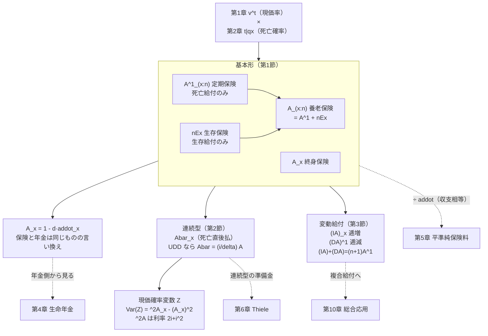
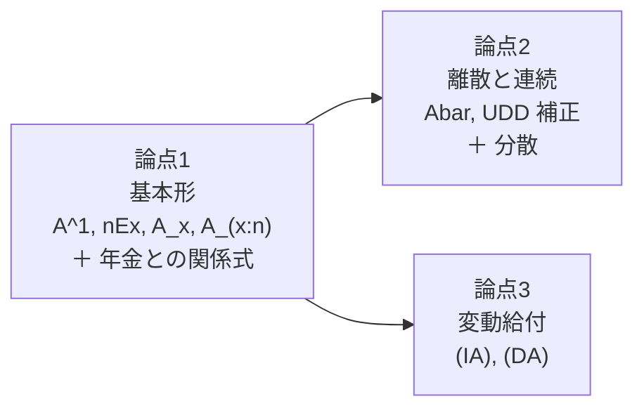
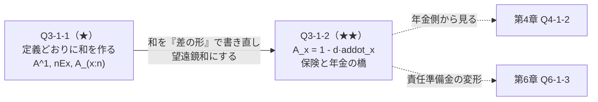
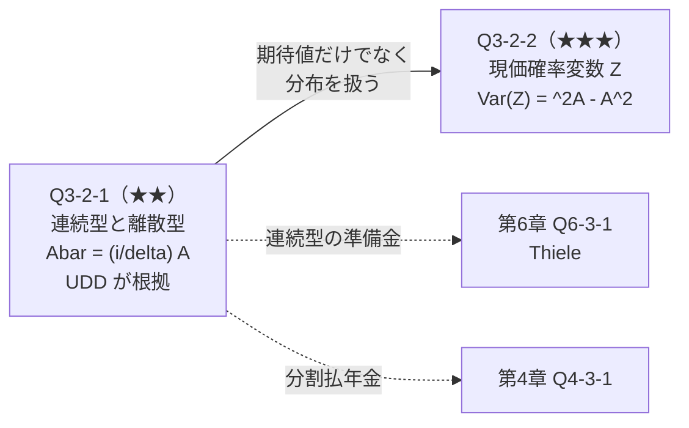
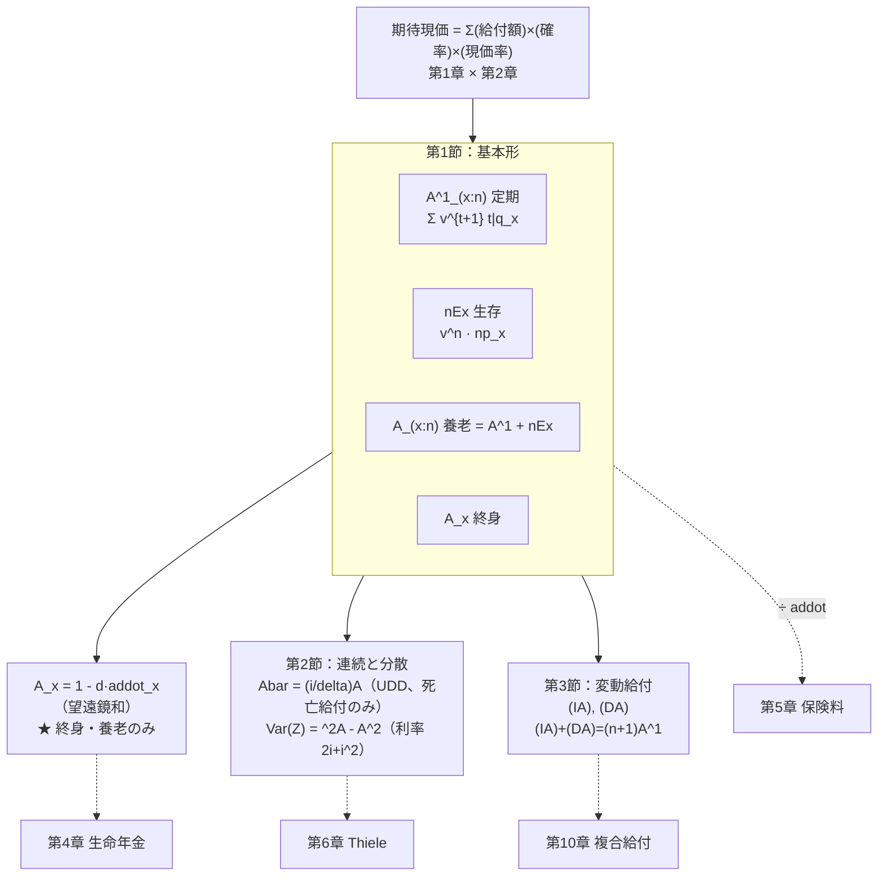
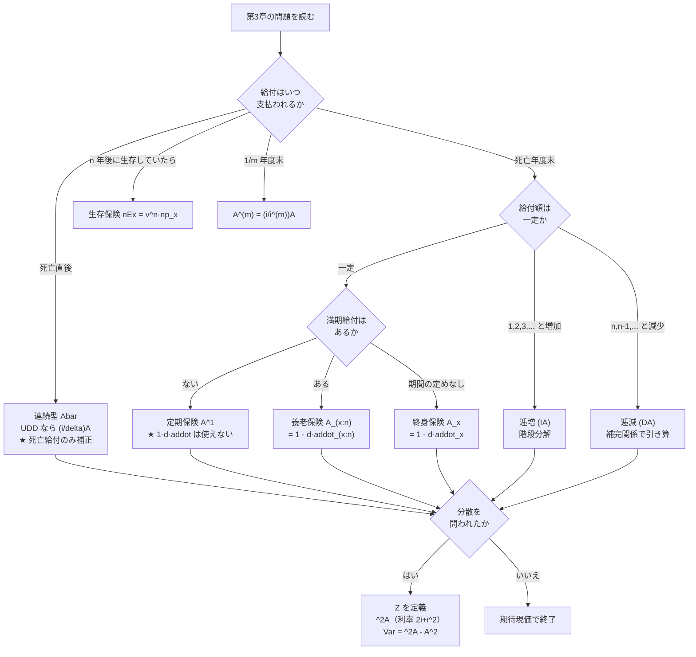

# 第3章　一時払純保険料

> [← 第2章 生命表と生存分布](第02章_生命表と生存分布.md) ｜ **第3章** ｜ [第4章 生命年金 →](第04章_生命年金.md)

---

## 章の地図



**この図の読み方**：第3章は「第1章 × 第2章」です。
左上の掛け算がすべての出発点で、そこから
**給付の形を変える（基本形→変動給付）**、**支払時点を変える（離散→連続）** という
2方向に展開します。$A_x=1-d\ddot a_x$ が第4章への橋です。

---

## この章で学ぶこと

第3章は **第3層＝期待現価** の前半（保険）を扱います。生保数理の本体です。

$$\text{一時払純保険料}=\sum(\text{給付額})\times(\text{発生確率})\times(\text{現価率})$$

**この1本の式しかありません。** 終身保険も定期保険も養老保険も逓増保険も、
すべてこの式で、給付額と発生確率の書き方が変わるだけです。

「一時払純保険料」とは、**契約時点における給付の期待現価** のことです。
第5章の平準純保険料は、この期待現価を年払に分割したものにすぎません。

---

## この章の全体像



**学習順序**

```text
① 給付の発生時点を時間軸に並べる        …… ここを飛ばすと必ず間違える
        ↓
② 各時点の給付額 × 発生確率 × 現価率 を書く
        ↓
③ 和を取る（＝定義どおりの式）
        ↓
④ 望遠鏡和で整理して A = 1 - d·addot を得る
        ↓
⑤ 支払時点を「死亡直後」に変える（連続型）
        ↓
⑥ 給付額を時点の関数にする（変動給付）
```

---

## 最初に頭に入れるべきポイント

### 現価率の指数は「支払時点」そのもの

第3章で最も多い失点が **$v^{t}$ と $v^{t+1}$ の取り違え** です。
指数は常に「**その給付が実際に支払われる時点**」に一致します。

```text
時点        0        1        2        3   ...
            |--------|--------|--------|---...
年齢        x       x+1      x+2      x+3

死亡区間        [x,x+1]  [x+1,x+2]  [x+2,x+3]
確率             0|q_x     1|q_x      2|q_x
支払時点          ↓1        ↓1         ↓1
                  1         2          3        ← ★ 死亡年度末に支払う
現価率           v^1       v^2        v^3       ← 指数 = 支払時点

  ⇒ 「t 年後に死亡」（確率 t|q_x）なら支払は t+1 時点 → v^{t+1}

生存保険：
時点        0                            n
            |----------------------------|
条件        [------ n 年間生存 ------]
支払                                     ↓1
現価率                                  v^n        ← 指数 = n（そのまま）

  ⇒ 生存給付は「時点 n に支払う」ので v^n
```

**判定法**：$1$ を足すかどうかは「死亡給付か生存給付か」で決まります。

| 給付 | 確率 | 現価率 | 理由 |
|---|---|---|---|
| 死亡年度末払 | ${}_{t\vert}q_x$ | $v^{t+1}$ | $[x+t,x+t+1]$ で死亡 → 支払は $t+1$ 時点 |
| 死亡直後払 | ${}_tp_x\mu_{x+t}dt$ | $v^{t}$ | 死亡した瞬間 $t$ に支払う |
| 生存給付 | ${}_np_x$ | $v^{n}$ | 時点 $n$ に支払う |

### 上付き $1$ の位置で「死亡」か「生存」かが決まる

$$A^1_{x:\overline{n}\vert}\quad\text{vs}\quad A_{x:\overline{n}\vert}^{\ \ 1}={}_nE_x$$

**「$1$ が付いている方の事象が先に起きたら支払う」** と読みます。

* $A^1_{x:\overline{n}\vert}$：$1$ が $x$ 側 → 「$(x)$ の死亡が $n$ 年の満了より先」→ **定期保険**
* $A_{x:\overline{n}\vert}^{\ \ 1}$：$1$ が $\overline{n}\vert$ 側 → 「満了が死亡より先」→ **生存保険**

### 4種類の保険は「足し引き」で結ばれている

```text
                    A_(x:n)  養老保険
                   ／        ＼
                  ／          ＼
      A^1_(x:n)                nEx
      定期保険                 生存保険
      （死亡給付）             （生存給付）

              A_(x:n) = A^1_(x:n) + nEx

  終身保険は「n → ∞」の定期保険：
              A_x = A^1_(x:∞)

  据置終身保険：
              m|A_x = mEx · A_(x+m)     ← 生存保険 × 据置後の保険
```

**新しい保険が出てきたら、この4つの組み合わせに分解できないか** を最初に考えてください。

### $A_x=1-d\,\ddot a_x$ は「望遠鏡和」の結果

この関係式は暗記事項ではなく、第2章 Q2-1-2 の **差の形** ${}_{t\vert}q_x={}_tp_x-{}_{t+1}p_x$ を
代入して和を取れば自動的に出ます（Q3-1-2 で導出）。

$$A_x=\sum_{t=0}^{\infty}v^{t+1}\left({}_tp_x-{}_{t+1}p_x\right)\ \longrightarrow\ 1-d\,\ddot a_x$$

**$d$ が出る理由は $\ddot a_x$ が期始払だから** です（第1章）。
連続型では $\delta$ になります（$\bar A_x=1-\delta\bar a_x$）。

---

## 基本記号・基本公式

### 離散型（死亡年度末払）

| 記号 | 保険の種類 | 定義式 | 使用場面 | 間違えやすい点 |
|---|---|---|---|---|
| $A_x$ | 終身保険 | $\displaystyle\sum_{t=0}^{\infty}v^{t+1}{}_{t\vert}q_x$ | 基本 | 指数は $t+1$ |
| $A^1_{x:\overline{n}\vert}$ | $n$ 年定期保険 | $\displaystyle\sum_{t=0}^{n-1}v^{t+1}{}_{t\vert}q_x$ | 死亡給付のみ | 和の上端は $n-1$ |
| ${}_nE_x$ | $n$ 年生存保険 | $v^{n}{}_np_x$ | 生存給付のみ | 指数は $n$（$n+1$ でない） |
| $A_{x:\overline{n}\vert}$ | $n$ 年養老保険 | $A^1_{x:\overline{n}\vert}+{}_nE_x$ | 満期金あり | 生存保険を足し忘れる |
| ${}_{m\vert}A_x$ | $m$ 年据置終身保険 | ${}_mE_x\,A_{x+m}$ | 据置 | $A_{x+m}$ の年齢は $x+m$ |
| $(IA)_x$ | 逓増終身保険 | $\displaystyle\sum_{t=0}^{\infty}(t+1)v^{t+1}{}_{t\vert}q_x$ | 変動給付 | 給付額は $t+1$ |
| $(DA)^1_{x:\overline{n}\vert}$ | 逓減定期保険 | $\displaystyle\sum_{t=0}^{n-1}(n-t)v^{t+1}{}_{t\vert}q_x$ | 変動給付 | 給付額は $n-t$ |
| ${}^2\!A_x$ | 2次の積率 | 利率 $2i+i^{2}$ での $A_x$ | 分散 | 利率を変える（$A$ を2乗しない） |

### 連続型（死亡直後払）

| 記号 | 定義式 | 離散との関係（**UDD のもと**） |
|---|---|---|
| $\bar A_x$ | $\displaystyle\int_0^{\infty}v^{t}{}_tp_x\mu_{x+t}dt$ | $\bar A_x=\dfrac{i}{\delta}A_x$ |
| $\bar A^1_{x:\overline{n}\vert}$ | $\displaystyle\int_0^{n}v^{t}{}_tp_x\mu_{x+t}dt$ | $\dfrac{i}{\delta}A^1_{x:\overline{n}\vert}$ |
| $\bar A_{x:\overline{n}\vert}$ | $\bar A^1_{x:\overline{n}\vert}+{}_nE_x$ | **${}_nE_x$ には補正しない** |
| $A^{(m)}_x$ | 年 $m$ 回の死亡年度末払 | $\dfrac{i}{i^{(m)}}A_x$ |

**⚠ 最重要の注意**：$\dfrac{i}{\delta}$ 補正は **死亡給付にのみ** 適用します。
生存保険 ${}_nE_x$ は支払時点が確定しているので補正不要です。
養老保険では

$$\bar A_{x:\overline{n}\vert}=\underbrace{\frac{i}{\delta}A^1_{x:\overline{n}\vert}}_{\text{補正する}}+\underbrace{{}_nE_x}_{\text{補正しない}}
\ \ne\ \frac{i}{\delta}A_{x:\overline{n}\vert}$$

### 保険と年金の関係式

$$A_x=1-d\,\ddot a_x,\qquad
A_{x:\overline{n}\vert}=1-d\,\ddot a_{x:\overline{n}\vert},\qquad
\bar A_x=1-\delta\,\bar a_x$$

**成立条件**：離散なら $d$、連続なら $\delta$。**定期保険には成立しません**
（$A^1_{x:\overline{n}\vert}\ne1-d\ddot a_{x:\overline{n}\vert}$。左辺に ${}_nE_x$ が欠けているため）。

### 分散

$$\operatorname{Var}(Z)={}^2\!A_x-\left(A_x\right)^{2}$$

${}^2\!A_x$ は「利率を $j=2i+i^{2}$（すなわち $v\to v^{2}$）に置き換えた $A_x$」です。
$1+j=(1+i)^{2}$ なので $\dfrac{1}{1+j}=v^{2}$ となります。

---

## 試験での主な問われ方

| 出題形態 | 典型的な問われ方 | 対応する問題 |
|---|---|---|
| 小問 | 生命表と利率から $A^1$、${}_nE_x$、$A_{x:\overline{n}\vert}$ を計算 | Q3-1-1 |
| 小問 | $A_x$ が与えられて $\ddot a_x$ を求める（またはその逆） | Q3-1-2 |
| 小問 | UDD のもとで $\bar A_x$ を $A_x$ から求める | Q3-2-1 |
| 記述式 | $A_x=1-d\ddot a_x$ を定義から導出 | Q3-1-2 |
| 記述式 | 現価確率変数 $Z$ を定義し、期待値と分散を求める | Q3-2-2 |
| 記述式 | $(IA)_x$ を階段分解で導出 | Q3-3-1 |
| 記述式 | $(IA)+(DA)=(n+1)A^1$ を示す | Q3-3-2 |
| 他章との複合 | 保険料（第5章）・責任準備金（第6章）の前半部 | 全問 |

---

## 問題を見分けるためのサイン

| 問題文中の表現 | 判断すること |
|---|---|
| 「死亡した年度末に」「死亡年度末に」 | **離散型**。$v^{t+1}$ |
| 「死亡した直後に」「死亡と同時に」「死亡時に」 | **連続型** $\bar A$。$v^{t}$ |
| 「$n$ 年以内に死亡した場合に」 | 定期保険 $A^1_{x:\overline{n}\vert}$ |
| 「$n$ 年後に生存していた場合に」「満期時に」 | 生存保険 ${}_nE_x$ |
| 「死亡または満期のいずれか早い時」 | **養老保険** $A_{x:\overline{n}\vert}$ |
| 「一生涯」「終身」 | 終身保険 $A_x$ |
| 「$m$ 年据置」「$m$ 年経過後から」 | ${}_{m\vert}A_x={}_mE_x A_{x+m}$ |
| 「1年目は1、2年目は2、…」 | **逓増** $(IA)$ |
| 「1年目は $n$、2年目は $n-1$、…」 | **逓減** $(DA)$ |
| 「一時払」「一時払保険料」 | **期待現価そのもの**（第5章の平準保険料ではない） |
| 「分散」「標準偏差」「現価確率変数」 | ${}^2\!A$（利率 $2i+i^2$）を使う |
| 「各年度内の死亡は一様」 | UDD。$\frac{i}{\delta}$ 補正が使える |

**⚠ 特に注意すべき語**

* 「**死亡年度末**」と「**死亡直後**」の1語の違いで、離散か連続かが決まります。
* 「**一時払**」は「契約時に全額払う」＝期待現価そのもの。
  「平準払」「年払」なら第5章の $P$ です。
* 「**満期保険金**」があれば養老保険、なければ定期保険です。

---

## この章の問題一覧

| ID | 表題 | 難 | 段階 | この問題の役割 |
|---|---|---|---|---|
| **第1節　基本形と年金との関係** | | | | |
| Q3-1-1 | 4種類の保険の期待現価を分解する | ★ | ① | 定義どおりに和を作る。$v^{t+1}$ と $v^n$ の使い分けを確定 |
| Q3-1-2 | $A_x=1-d\ddot a_x$ の導出と応用 | ★★ | ② | 望遠鏡和。第4章・第6章への橋 |
| **第2節　離散型と連続型・分散** | | | | |
| Q3-2-1 | 連続型と離散型の関係（UDD） | ★★ | ③ | UDD 補正の根拠と適用範囲 |
| Q3-2-2 | 現価確率変数の分散 | ★★★ | ⑤ | 期待値だけでなく分布を扱う |
| **第3節　変動給付** | | | | |
| Q3-3-1 | 逓増終身保険 $(IA)_x$ | ★★ | ③ | 階段分解（Q1-2-2 の再利用） |
| Q3-3-2 | 逓減定期保険と読み替え | ★★ | ④ | 逓増との補完関係で解く |

---
---

# 第1節　基本形と年金との関係

## この節のテーマ

**4種類の基本的な保険（定期・生存・終身・養老）の期待現価を定義から作る技術**、
および **保険と年金を結ぶ関係式 $A_x=1-d\ddot a_x$** を扱います。

## この節でできるようになること

* 給付の発生時点を時間軸に並べ、$v^{t+1}$ と $v^{n}$ を正しく使い分けられる
* 生命表と利率から4種類の保険の期待現価を計算できる
* $A_x=1-d\ddot a_x$ を定義から導出できる
* $A_x$ から $\ddot a_x$（およびその逆）を求められる

## 頭に入れるべきポイント

### 解法は常に「時間軸 → 表 → 和」

```text
① 時間軸に給付の発生時点を書く
        ↓
② 各時点について次の 3 列の表を作る
        ┌──────────┬──────────┬──────────┐
        │ 給付額    │ 発生確率  │ 現価率    │
        ├──────────┼──────────┼──────────┤
        │ 1 または  │ t|q_x     │ v^{t+1}   │  ← 死亡給付
        │ 変動      │ np_x      │ v^n       │  ← 生存給付
        └──────────┴──────────┴──────────┘
        ↓
③ 3 列を掛けて足す
```

**この3列表を必ず書いてください。** 記号を直接思い出そうとすると
$v^t$ と $v^{t+1}$ を取り違えます。

### 期待現価の大小関係（検算に使う）

$$A^1_{x:\overline{n}\vert}<A_{x:\overline{n}\vert}<1,\qquad
{}_nE_x<A_{x:\overline{n}\vert},\qquad
A^1_{x:\overline{n}\vert}<A_x$$

さらに、**必ず $1$ 未満** です（給付 $1$ を割り引いた期待値だから）。
$1$ を超えたら計算ミスです。

## 使用する記号・公式

| 記号 | 定義 |
|---|---|
| $A^1_{x:\overline{n}\vert}$ | $\displaystyle\sum_{t=0}^{n-1}v^{t+1}\,{}_{t\vert}q_x=\sum_{t=0}^{n-1}v^{t+1}\frac{d_{x+t}}{l_x}$ |
| ${}_nE_x$ | $v^{n}\,{}_np_x=v^{n}\dfrac{l_{x+n}}{l_x}$ |
| $A_{x:\overline{n}\vert}$ | $A^1_{x:\overline{n}\vert}+{}_nE_x$ |
| $A_x$ | $\displaystyle\sum_{t=0}^{\infty}v^{t+1}{}_{t\vert}q_x$ |
| $\ddot a_x$ | $\displaystyle\sum_{t=0}^{\infty}v^{t}{}_tp_x$ |
| 関係式 | $A_x=1-d\,\ddot a_x$、$\ A_{x:\overline{n}\vert}=1-d\,\ddot a_{x:\overline{n}\vert}$ |

## 基本的な解法パターン

```text
① 給付の種類を判定する（死亡給付 / 生存給付 / 両方）
        ↓
② 時間軸に発生時点を描く
        ↓
③ 死亡給付：確率 t|q_x = d_{x+t}/l_x、現価率 v^{t+1}
   生存給付：確率 np_x = l_{x+n}/l_x、現価率 v^n
        ↓
④ 3 列表を作って和を取る
        ↓
⑤ 関係式 A = 1 - d·addot が使える形なら、それでも計算して検算
        ↓
⑥ 検算：0 < A < 1、A^1 < A_(x:n)、大小関係
```

## 間違えやすい点

| 誤り | 内容 | 防ぎ方 |
|---|---|---|
| 指数の取り違え | 死亡給付に $v^{t}$ を使う | 「支払時点＝指数」。$t$ 年後に死亡なら支払は $t+1$ |
| 生存保険の指数 | ${}_nE_x=v^{n+1}{}_np_x$ とする | 生存給付は時点 $n$ に支払う。$v^{n}$ |
| 和の上端 | $A^1_{x:\overline{n}\vert}$ を $t=0$ から $n$ まで | $n-1$ まで（$n$ 個の項） |
| 養老保険で ${}_nE_x$ を忘れる | $A_{x:\overline{n}\vert}=A^1_{x:\overline{n}\vert}$ とする | 「満期保険金」の有無を確認 |
| 定期保険に $1-d\ddot a$ を使う | $A^1_{x:\overline{n}\vert}=1-d\ddot a_{x:\overline{n}\vert}$ | この式は**養老・終身のみ**。定期には成立しない |
| 確率の分母 | ${}_{t\vert}q_x$ の分母を $l_{x+t}$ にする | 分母は常に $l_x$（第2章 Q2-1-2） |

## この節の問題の流れ



---
---

## 問題 Q3-1-1　4種類の保険の期待現価を分解する

| 項目 | 内容 |
|---|---|
| 出題年度 | `要照合`（記入欄：______年度） |
| 問題番号 | `要照合`（記入欄：問題___） |
| 分野・論点 | 生命保険 ／ 一時払純保険料の基本形 |
| 難易度 | ★ |
| この節での位置づけ | 段階①（定義を直接使う）。本章全体の基準となる問題 |
| 関連する問題 | 発展元：Q2-1-2（据置死亡確率）、Q1-2-1（現価率） ／ 本問 ／ 後続：Q3-1-2（望遠鏡和）、Q5-1-1（収支相等で割る） |

### ■ この問題で押さえるべきポイント

#### ① 何を問う問題か

**生命表と利率から、定期保険・生存保険・養老保険の一時払純保険料を
定義どおりに計算させる問題** です。問われているのは
**現価率の指数（$v^{t+1}$ か $v^{n}$ か）を正しく選べるか** の一点です。

#### ② 問題文から読み取るべき条件

| 条件 | 解法への影響 |
|---|---|
| 「$l_x$ の表」「$i=0.05$」 | 離散の世界。$v=1/1.05$ |
| 「5年以内に死亡した場合、**死亡した年度末に** 1」 | 定期保険 $A^1_{40:\overline{5}\vert}$、$v^{t+1}$ |
| 「5年後に生存していた場合、1」 | 生存保険 ${}_5E_{40}$、$v^{5}$ |
| 「死亡または満期のいずれか早い時に1」 | 養老保険 $A_{40:\overline{5}\vert}$ |
| 「保険金額 1」 | 保険金額 $S$ なら $S$ 倍するだけ |

#### ③ 最初に注目する場所

**給付が「死亡したとき」か「生存していたとき」か。**
死亡給付なら $v^{t+1}$（支払は死亡年度末）、
生存給付なら $v^{n}$（支払は時点 $n$）。この判断が最初で、かつ最重要です。

#### ④ 呼び出すべき知識

| 知識 | なぜこの問題で使うか |
|---|---|
| ${}_{t\vert}q_x=\dfrac{d_{x+t}}{l_x}$ | 死亡給付の発生確率。$l_x$ の表から最速で出る（第2章 Q2-1-2） |
| $A^1_{x:\overline{n}\vert}=\displaystyle\sum_{t=0}^{n-1}v^{t+1}{}_{t\vert}q_x$ | 定義。$t$ 年後に死亡 → 支払は $t+1$ 時点 |
| ${}_nE_x=v^{n}\dfrac{l_{x+n}}{l_x}$ | 生存給付。支払時点は $n$ |
| $A_{x:\overline{n}\vert}=A^1_{x:\overline{n}\vert}+{}_nE_x$ | 養老保険は2つの給付の和 |
| $A_{x:\overline{n}\vert}=1-d\,\ddot a_{x:\overline{n}\vert}$ | **検算に使う**（養老保険には成立する） |

#### ⑤ 解法の骨格

```text
1. v, v^2, ..., v^5 を先に計算しておく
2. 死亡給付の 3 列表（d_{40+t}, t|q_40, v^{t+1}）を作る
3. 掛けて足す → A^1_(40:5)
4. 生存保険は 1 行だけ → 5E_40 = v^5 · l_45/l_40
5. 足して養老保険
6. 検算：A_(40:5) = 1 - d·addot_(40:5)
```

#### ⑥ 間違えやすい点

* 死亡給付に $v^{t}$ を使う（$t=0$ の給付を割引なしにしてしまう）
* 生存保険に $v^{6}$ を使う
* 和の上端を $t=5$ にする（正しくは $t=4$、5項）
* ${}_{t\vert}q_{40}$ の分母を $l_{40+t}$ にする
* 定期保険に $1-d\ddot a$ を適用する

#### ⑦ この問題を一言で捉えると

> **「支払時点が現価率の指数」— 死亡給付は $t+1$、生存給付は $n$。それだけの問題。**

### ■ 問題の構造図

```text
3 つの保険の時間軸（x = 40, n = 5）：

時点        0      1      2      3      4      5
            |------|------|------|------|------|
年齢       40     41     42     43     44     45

(1) 定期保険 A^1_(40:5)  ── 死亡給付のみ
死亡区間     [40,41][41,42][42,43][43,44][44,45]
確率          0|q    1|q    2|q    3|q    4|q
支払                v1     v1     v1     v1     v1    ← 死亡年度末
現価率              v^1    v^2    v^3    v^4    v^5   ← ★ 指数 = 支払時点

(2) 生存保険 5E_40  ── 生存給付のみ
条件        [-------- 5 年間生存 --------]
確率                                      5p_40
支払                                       v1
現価率                                    v^5        ← ★ 指数 = 5

(3) 養老保険 A_(40:5) = (1) + (2)
支払                v1     v1     v1     v1     v1
                                          +v1        ← 生存なら満期金
   ⇒ 「必ず 1 が支払われる」（死亡か満期のどちらか）
      だから A_(40:5) は 1 に近い値になる
```

**この図が示すこと**：養老保険は「死亡しても満期でも必ず $1$ を受け取る」ので、
期待現価は **$v^{5}$ より大きく $1$ より小さい** はずです（$0.7835<A<1$）。
この見当を先に付けておくと、計算結果の妥当性がすぐ判断できます。

### ■ 問題

次の生命表と年利率 $i=0.05$ を用いる。

| $x$ | $l_x$ | $x$ | $l_x$ |
|---|---|---|---|
| 40 | 100000.0 | 43 | 99532.1 |
| 41 | 99851.6 | 44 | 99359.4 |
| 42 | 99695.9 | 45 | 99176.7 |

40歳の被保険者、保険期間5年、保険金額1の保険について、次の一時払純保険料を求めよ
（小数第7位まで）。

**(1)** 保険期間中に死亡した場合、**死亡した年度末**に保険金を支払う保険
（定期保険）$A^1_{40:\overline{5}\vert}$

**(2)** 5年後に生存していた場合に保険金を支払う保険（生存保険）${}_5E_{40}$

**(3)** 死亡した年度末、または5年後の生存時のいずれか早い時点で保険金を支払う保険
（養老保険）$A_{40:\overline{5}\vert}$

**(4)** $\ddot a_{40:\overline{5}\vert}$ を求め、$A_{40:\overline{5}\vert}=1-d\,\ddot a_{40:\overline{5}\vert}$
が成り立つことを確認せよ。

**(5)** (4) の関係式が定期保険 $A^1_{40:\overline{5}\vert}$ については成り立たないことを、
数値で示せ。

> 本問は再現題です。原文の出題年度・問題番号は未照合です。

### ■ 問題文を数理モデルへ変換

| 確認項目 | 問題文から読み取れる内容 | 数理的な表現 |
|---|---|---|
| 被保険者 | 40歳 | $x=40$ |
| 保険期間 | 5年 | $n=5$ |
| 保険金額 | 1 | $S=1$（$S$ 倍すれば一般化） |
| 利率 | $i=0.05$ | $v=1/1.05$、$d=0.05/1.05$ |
| (1) 給付条件 | 「死亡した年度末に」 | 離散型死亡給付、$v^{t+1}$ |
| (2) 給付条件 | 「5年後に生存していた場合」 | 生存給付、$v^{5}$ |
| (3) 給付条件 | 「いずれか早い時点」 | 養老保険 $=$ (1) $+$ (2) |
| (4) 検算 | 保険と年金の関係 | $A_{x:\overline{n}\vert}=1-d\ddot a_{x:\overline{n}\vert}$ |

### ■ 解法フロー

```text
STEP 1　現価率 v^1 〜 v^5 を計算する
STEP 2　(1) 死亡給付の 3 列表を作り、和を取る
STEP 3　(2) 生存保険を 1 行で計算する
STEP 4　(3) 足して養老保険を得る
STEP 5　(4) 期始払年金を計算し、関係式で検算する
STEP 6　(5) 定期保険では関係式が成り立たないことを示す
```

### ■ 詳細解説

#### STEP 1　現価率の準備

*目的：以降で使う $v$ の冪をまとめて計算する。*

$$v=\frac{1}{1.05}=0.9523810,\qquad d=\frac{0.05}{1.05}=0.0476190$$

| $k$ | 1 | 2 | 3 | 4 | 5 |
|---|---|---|---|---|---|
| $v^{k}$ | 0.9523810 | 0.9070295 | 0.8638376 | 0.8227025 | 0.7835262 |

#### STEP 2　(1) 定期保険

*目的：3列表を作って和を取る。*

死亡給付なので、$t$ 年後に死亡（確率 ${}_{t\vert}q_{40}=d_{40+t}/l_{40}$）した場合、
支払は **$t+1$ 時点** です。

| $t$ | 死亡区間（年齢） | $d_{40+t}$ | ${}_{t\vert}q_{40}=\dfrac{d_{40+t}}{100000}$ | 支払時点 | $v^{t+1}$ | 積 |
|---|---|---|---|---|---|---|
| 0 | $[40,41]$ | 148.4 | 0.0014840 | 1 | 0.9523810 | 0.00141333 |
| 1 | $[41,42]$ | 155.7 | 0.0015570 | 2 | 0.9070295 | 0.00141224 |
| 2 | $[42,43]$ | 163.8 | 0.0016380 | 3 | 0.8638376 | 0.00141497 |
| 3 | $[43,44]$ | 172.7 | 0.0017270 | 4 | 0.8227025 | 0.00142081 |
| 4 | $[44,45]$ | 182.7 | 0.0018270 | 5 | 0.7835262 | 0.00143150 |
| | | | | | **合計** | **0.00709285** |

$$\boxed{A^1_{40:\overline{5}\vert}=0.0070929}$$

**⚠ 和の上端に注意**：$t=0,1,2,3,4$ の **5項** です。$t=5$ の項はありません
（5年目までの死亡しか対象にならないため）。

**各項がほぼ等しい理由**：$d_{40+t}$ は年齢とともに増加（$148.4\to182.7$）しますが、
$v^{t+1}$ は減少（$0.952\to0.784$）します。両者がほぼ打ち消し合うため、
各項が $0.00141$ 前後で揃っています。

#### STEP 3　(2) 生存保険

*目的：生存給付は1行だけで済むことを確認する。*

$$_5E_{40}=v^{5}\cdot{}_5p_{40}=v^{5}\cdot\frac{l_{45}}{l_{40}}
=0.7835262\times\frac{99176.7}{100000.0}=0.7835262\times0.9917670$$

$$\boxed{{}_5E_{40}=0.7770754}$$

**指数が $5$ である理由**：生存保険は「時点 $5$ に支払う」ので $v^{5}$ です。
死亡給付のように $+1$ する必要はありません
（死亡は区間内で起きるが、満期は時点そのものだから）。

**妥当性**：${}_5E_{40}=0.7770754$ は $v^{5}=0.7835262$ より少し小さい値です。
「確実に5年後に $1$ をもらえる」なら $v^{5}$ ですが、
生存確率 $0.9918$ が掛かるぶん小さくなります。✓

#### STEP 4　(3) 養老保険

*目的：2つの給付を足す。*

$$A_{40:\overline{5}\vert}=A^1_{40:\overline{5}\vert}+{}_5E_{40}=0.0070929+0.7770754$$

$$\boxed{A_{40:\overline{5}\vert}=0.7841683}$$

```text
式の構造：

   A_(40:5)  =  A^1_(40:5)  +   5E_40
   0.7841683 =  0.0070929   +  0.7770754
                    |              |
                    |              └─ 生存給付（満期保険金）… 大半を占める
                    └─ 死亡給付 … わずか 0.9%

  ★ 40 歳・5 年という短期・若年の契約では、
    死亡する確率が低い（5q_40 = 0.0082）ため、
    養老保険はほぼ「5 年後に 1 をもらう約束」＝生存保険に近い。
```

**妥当性の確認**：STEP の構造図で予想したとおり、
$v^{5}=0.7835262<A_{40:\overline{5}\vert}=0.7841683<1$ です。✓

養老保険が $v^5$ **より大きい** 理由：一部の人は5年より前に死亡し、
その場合は満期（時点5）より早く保険金を受け取るため、割引が弱くなるからです。

#### STEP 5　(4) 関係式による検算

*目的：$A_{x:\overline{n}\vert}=1-d\ddot a_{x:\overline{n}\vert}$ を確認する。*

まず期始払年金を計算します。支払時点は $t=0,1,2,3,4$（5回）です。

| $t$ | $l_{40+t}$ | ${}_tp_{40}=\dfrac{l_{40+t}}{100000}$ | $v^{t}$ | 積 |
|---|---|---|---|---|
| 0 | 100000.0 | 1.0000000 | 1.0000000 | 1.0000000 |
| 1 | 99851.6 | 0.9985160 | 0.9523810 | 0.9509676 |
| 2 | 99695.9 | 0.9969590 | 0.9070295 | 0.9042708 |
| 3 | 99532.1 | 0.9953210 | 0.8638376 | 0.8597952 |
| 4 | 99359.4 | 0.9935940 | 0.8227025 | 0.8174332 |
| | | | **合計** | **4.5324668** |

$$\ddot a_{40:\overline{5}\vert}=4.5324668$$

関係式に代入します。

$$1-d\,\ddot a_{40:\overline{5}\vert}=1-0.0476190\times4.5324668=1-0.2158318=0.7841682$$

STEP 4 の $0.7841683$ と一致します（末位の差は丸め）。✓

**この関係式が成り立つ理由**（詳細は Q3-1-2）：
養老保険は「死亡か満期で必ず $1$ が支払われる」ので、
$1$（確実な給付）から「支払われるまでの利息分」を引いた形になります。
その利息分が $d\,\ddot a$ です。

#### STEP 6　(5) 定期保険では成り立たない

*目的：関係式の適用範囲を確認する。*

もし定期保険に同じ式を適用すると

$$1-d\,\ddot a_{40:\overline{5}\vert}=0.7841682$$

ですが、実際の $A^1_{40:\overline{5}\vert}=0.0070929$ とはまったく異なります。

**差の正体**

$$0.7841682-0.0070929=0.7770753={}_5E_{40}$$

**差はちょうど生存保険 ${}_5E_{40}$ です。** これは当然で、

$$1-d\,\ddot a_{x:\overline{n}\vert}=A_{x:\overline{n}\vert}=A^1_{x:\overline{n}\vert}+{}_nE_x$$

だからです。すなわち

$$A^1_{x:\overline{n}\vert}=1-d\,\ddot a_{x:\overline{n}\vert}-{}_nE_x$$

**⚠ 覚え方**：$1-d\ddot a$ の形が使えるのは
「**必ず $1$ が支払われる保険**」（終身保険・養老保険）だけです。
定期保険は「死亡しなければ何ももらえない」ので、この形になりません。

### ■ 答え

| 設問 | 量 | 値 |
|---|---|---|
| (1) | $A^1_{40:\overline{5}\vert}$ | $0.0070929$ |
| (2) | ${}_5E_{40}$ | $0.7770754$ |
| (3) | $A_{40:\overline{5}\vert}$ | $0.7841683$ |
| (4) | $\ddot a_{40:\overline{5}\vert}$ | $4.5324668$ |

**(4)** $1-d\,\ddot a_{40:\overline{5}\vert}=1-0.0476190\times4.5324668=0.7841682$ となり、
(3) の値と一致する。

**(5)** $1-d\,\ddot a_{40:\overline{5}\vert}=0.7841682$ に対し
$A^1_{40:\overline{5}\vert}=0.0070929$ であり一致しない。
差 $0.7770753$ はちょうど ${}_5E_{40}$ に等しく、
$1-d\ddot a_{x:\overline{n}\vert}=A^1_{x:\overline{n}\vert}+{}_nE_x$ であることによる。

> **保険金額について**：本問は保険金額 $1$ の場合です。
> 保険金額が $S$ なら、すべての答えを $S$ 倍します
> （たとえば $S=1000$ 万円なら $A_{40:\overline{5}\vert}=784.17$ 万円）。

### ■ 試験答案としての書き方

> $v=\dfrac{1}{1.05}=0.9523810$、$\ d=\dfrac{0.05}{1.05}=0.0476190$
>
> **(1)** 死亡年度末払であるから、$t$ 年後の死亡に対する支払時点は $t+1$。
> $\displaystyle A^1_{40:\overline{5}\vert}=\sum_{t=0}^{4}v^{t+1}\frac{d_{40+t}}{l_{40}}
> =\frac{1}{100000}\left(148.4v+155.7v^{2}+163.8v^{3}+172.7v^{4}+182.7v^{5}\right)$
> $=0.00141333+0.00141224+0.00141497+0.00142081+0.00143150=0.0070929$
>
> **(2)** ${}_5E_{40}=v^{5}\dfrac{l_{45}}{l_{40}}=0.7835262\times0.9917670=0.7770754$
>
> **(3)** $A_{40:\overline{5}\vert}=A^1_{40:\overline{5}\vert}+{}_5E_{40}
> =0.0070929+0.7770754=0.7841683$
>
> **(4)** $\displaystyle\ddot a_{40:\overline{5}\vert}=\sum_{t=0}^{4}v^{t}\frac{l_{40+t}}{l_{40}}
> =1+0.9509676+0.9042708+0.8597952+0.8174332=4.5324668$
> $1-d\,\ddot a_{40:\overline{5}\vert}=1-0.0476190\times4.5324668=0.7841682$
> これは (3) の $A_{40:\overline{5}\vert}$ に一致する。
>
> **(5)** $1-d\,\ddot a_{40:\overline{5}\vert}=0.7841682\ne0.0070929=A^1_{40:\overline{5}\vert}$。
> 差は $0.7770753={}_5E_{40}$ であり、
> $1-d\ddot a_{x:\overline{n}\vert}=A_{x:\overline{n}\vert}=A^1_{x:\overline{n}\vert}+{}_nE_x$
> であることによる。すなわち $1-d\ddot a$ の形が使えるのは、
> 死亡・満期のいずれかで**必ず保険金が支払われる**保険（養老保険・終身保険）に限られる。

### ■ 解答後に確認すること

| 項目 | 内容 |
|---|---|
| **最も重要なポイント** | **現価率の指数＝支払時点**。死亡年度末払は $v^{t+1}$、生存給付は $v^{n}$。3列表（給付額・確率・現価率）を書けば取り違えない |
| **最初に気づくべきだった条件** | 「死亡した**年度末**に」＝離散型。「5年後に**生存**していた場合」＝生存給付 |
| **他の問題にも使える考え方** | ① 養老保険は「必ず $1$ を受け取る」から $v^{n}<A_{x:\overline{n}\vert}<1$。見当を先に付けられる。② $1-d\ddot a$ が使えるのは終身・養老のみ。③ 保険金額 $S$ なら単純に $S$ 倍 |
| **類似問題との違い** | Q3-1-2 は同じ量を**定義からではなく望遠鏡和で**導く。Q3-2-1 は支払時点を「死亡直後」に変える。Q3-3-1 は給付額を変動させる |
| **条件が変わった場合** | ① 終身保険なら和を $\omega-x$ まで。② 据置なら ${}_mE_x A_{x+m}$。③ 死亡直後払なら $\frac{i}{\delta}$ 補正（Q3-2-1）。④ 保険期間を延ばすと $A^1$ は増え ${}_nE_x$ は減る |
| **復習時に思い出すこと** | $A^1=\sum v^{t+1}{}_{t\vert}q_x$、${}_nE_x=v^{n}{}_np_x$、$A_{x:\overline{n}\vert}=A^1+{}_nE_x$ |

---
---

## 問題 Q3-1-2　$A_x=1-d\,\ddot a_x$ の導出と応用

| 項目 | 内容 |
|---|---|
| 出題年度 | `要照合`（記入欄：______年度） |
| 問題番号 | `要照合`（記入欄：問題___） |
| 分野・論点 | 生命保険 ／ 保険と年金の関係 |
| 難易度 | ★★ |
| この節での位置づけ | 段階②（基本公式を変形して使う）。Q3-1-1 で作った和を、望遠鏡和で別の形に書き直す |
| 関連する問題 | 発展元：Q3-1-1、Q2-1-2（差の形）、Q1-1-1（$d$） ／ 本問 ／ 後続：Q4-1-2（年金側）、Q6-1-3（責任準備金の変形）、Q8-1-1（連生版） |

### ■ この問題で押さえるべきポイント

#### ① 何を問う問題か

**保険と年金を結ぶ関係式 $A_x=1-d\,\ddot a_x$ を定義から導出させ、
それを使って一方から他方を求めさせる問題** です。

生保数理で最も使用頻度の高い関係式であり、
**第4章・第5章・第6章のすべてで前提** になります。

#### ② 問題文から読み取るべき条件

| 条件 | 解法への影響 |
|---|---|
| 「導出せよ」 | 定義から出発する。結果を書くだけでは不可 |
| 「$A_{40}=0.300387$、$i=0.03$」 | 逆向きに使う（$A\to\ddot a$） |
| 「終身保険」 | 関係式が成立する（定期保険では不成立） |
| 「養老保険についても同様の式」 | $A_{x:\overline{n}\vert}=1-d\ddot a_{x:\overline{n}\vert}$ |
| 「期末払年金 $a_x$」 | $\ddot a_x=1+a_x$ を使う |

#### ③ 最初に注目する場所

**「必ず $1$ が支払われる保険か」**。終身保険・養老保険なら成立、
定期保険・生存保険単独なら不成立です。次に **離散か連続か**（$d$ か $\delta$ か）。

#### ④ 呼び出すべき知識

| 知識 | なぜこの問題で使うか |
|---|---|
| ${}_{t\vert}q_x={}_tp_x-{}_{t+1}p_x$（差の形） | **導出の鍵**。第2章 Q2-1-2 で学んだ形 |
| $A_x=\displaystyle\sum_{t=0}^{\infty}v^{t+1}{}_{t\vert}q_x$ | 出発点 |
| $\ddot a_x=\displaystyle\sum_{t=0}^{\infty}v^{t}{}_tp_x$ | 到達点に現れる |
| $d=1-v$ | 最後にまとめるときに使う（第1章） |
| 望遠鏡和 | 隣接項が打ち消し合う仕組み |

#### ⑤ 解法の骨格

```text
1. A_x の定義に、差の形 t|q_x = tp_x - (t+1)p_x を代入する
2. 和を 2 つに分ける
3. 第 2 の和の添字を 1 つずらす（s = t+1）
4. 2 つの和を比べると、ほとんどの項が共通
5. 共通部分を括り出すと (1-v) = d が現れる
6. 残った項を整理して 1 - d·addot_x を得る
```

#### ⑥ 間違えやすい点

* 積の形 ${}_{t\vert}q_x={}_tp_x q_{x+t}$ を使う（望遠鏡和にならない）
* 添字のずらしで項を1つ落とす（$t=0$ の項の扱い）
* $d$ ではなく $i$ で括る
* 定期保険にも成立すると思う
* 連続型で $d$ を使う（正しくは $\delta$）

#### ⑦ この問題を一言で捉えると

> **「死亡確率を差の形で書けば、和が望遠鏡的に潰れて年金が現れる」問題。**

### ■ 問題の構造図

```text
望遠鏡和の仕組み：

  A_x = Σ_{t≥0} v^{t+1} ( tp_x - (t+1)p_x )

      = Σ v^{t+1} tp_x  -  Σ v^{t+1} (t+1)p_x
           第 1 の和            第 2 の和

  第 1 の和 : v·0p + v^2·1p + v^3·2p + v^4·3p + ...
  第 2 の和 :       v·1p·(v^0?)  ← 添字をずらすと
              → s = t+1 とおくと Σ_{s≥1} v^s · sp_x

  第 1 の和 = v · Σ_{t≥0} v^t tp_x = v · addot_x
  第 2 の和 = Σ_{s≥1} v^s sp_x = addot_x - 1     （s=0 の項 v^0·0p_x = 1 を除いた分）

  ⇒ A_x = v·addot_x - ( addot_x - 1 ) = 1 - (1-v) addot_x = 1 - d·addot_x
                                              |
                                              └─ ★ d = 1 - v が出現


意味による理解（もう 1 つの見方）：

時点        0        1        2        3   ...
            |--------|--------|--------|---...
確実な 1     ●（時点 0 に 1 を持っている状態）

  終身保険は「いつか必ず 1 を支払う」
    → 今 1 を持っているのと比べて、
      「支払われるまでの間の利息」だけ価値が低い

  A_x  =    1     -    d · addot_x
            |            |
            |            └─ 生存中、毎年初に d の利息を受け取る権利の現価
            └─ 確実な 1（いつか必ずもらえる）
```

**この図が示すこと**：$A_x=1-d\ddot a_x$ は
「**確実な $1$ から、生きている間の利息 $d$ を引いたもの**」と解釈できます。
$d$（期始で測る割引率）が現れるのは、$\ddot a_x$ が期始払だからです。

### ■ 問題

**(1)** 定義

$$A_x=\sum_{t=0}^{\infty}v^{t+1}\,{}_{t\vert}q_x,\qquad
\ddot a_x=\sum_{t=0}^{\infty}v^{t}\,{}_tp_x$$

から出発して、$A_x=1-d\,\ddot a_x$ を導出せよ。

**(2)** $i=0.03$、$A_{40}=0.300387$ のとき、$\ddot a_{40}$ および期末払終身年金 $a_{40}$ を
求めよ（小数第6位まで）。

**(3)** 同じ生命表・利率のもとで $\ddot a_{40:\overline{20}\vert}=15.041461$ であるとき、
養老保険 $A_{40:\overline{20}\vert}$ を求めよ（小数第6位まで）。

**(4)** さらに ${}_{20}E_{40}=0.521439$ であるとき、定期保険 $A^1_{40:\overline{20}\vert}$ を
求めよ（小数第6位まで）。

**(5)** 連続型の場合に $\bar A_x=1-\delta\,\bar a_x$ となる理由を、
(1) の導出と対比して簡潔に述べよ。

> 本問は再現題です。原文の出題年度・問題番号は未照合です。

### ■ 問題文を数理モデルへ変換

| 確認項目 | 問題文から読み取れる内容 | 数理的な表現 |
|---|---|---|
| (1) 求める内容 | 関係式の導出 | 差の形を代入し望遠鏡和 |
| (2) 与えられる量 | $A_{40}$、$i$ | $\ddot a_{40}=\dfrac{1-A_{40}}{d}$（逆向き） |
| (2) $a_{40}$ | 期末払 | $a_x=\ddot a_x-1$ |
| (3) 与えられる量 | $\ddot a_{40:\overline{20}\vert}$ | $A_{x:\overline{n}\vert}=1-d\ddot a_{x:\overline{n}\vert}$ |
| (4) 与えられる量 | ${}_{20}E_{40}$ | $A^1=A_{x:\overline{n}\vert}-{}_nE_x$ |
| (5) 求める内容 | 連続版の理由 | 和 → 積分、$d\to\delta$ |

### ■ 解法フロー

```text
STEP 1　(1) 差の形を代入して和を 2 つに分ける
STEP 2　(1) 添字をずらして 2 つの和を addot_x で表す
STEP 3　(1) 整理して d = 1 - v を出す
STEP 4　(2) 関係式を逆に解いて addot_40 を求める
STEP 5　(3)(4) 養老保険と定期保険を求める
STEP 6　(5) 連続版の対応関係を説明する
```

### ■ 詳細解説

#### STEP 1　(1) 差の形を代入する

*目的：望遠鏡和が起きる形に持ち込む。*

第2章 Q2-1-2 で確認した **差の形**

$$_{t\vert}q_x={}_tp_x-{}_{t+1}p_x$$

を $A_x$ の定義に代入します。

$$A_x=\sum_{t=0}^{\infty}v^{t+1}\left({}_tp_x-{}_{t+1}p_x\right)
=\underbrace{\sum_{t=0}^{\infty}v^{t+1}\,{}_tp_x}_{\text{和}\,S_1}
-\underbrace{\sum_{t=0}^{\infty}v^{t+1}\,{}_{t+1}p_x}_{\text{和}\,S_2}$$

**なぜ積の形ではなく差の形を使うのか**：
積の形 ${}_tp_x\,q_{x+t}$ を代入しても $q_{x+t}$ が残ってしまい、
年金（$\ddot a_x=\sum v^t{}_tp_x$）の形になりません。
**差の形なら ${}_tp_x$ だけが現れる** ので、年金に到達できます。

#### STEP 2　(1) 2つの和を $\ddot a_x$ で表す

*目的：$S_1,S_2$ をそれぞれ $\ddot a_x$ を使って書く。*

**$S_1$**：$v^{t+1}=v\cdot v^{t}$ と分けて、$v$ を和の外に出します。

$$S_1=\sum_{t=0}^{\infty}v\cdot v^{t}\,{}_tp_x=v\sum_{t=0}^{\infty}v^{t}\,{}_tp_x=v\,\ddot a_x$$

**$S_2$**：添字を $s=t+1$ とずらします（$t=0\Rightarrow s=1$、$t\to\infty\Rightarrow s\to\infty$）。

$$S_2=\sum_{t=0}^{\infty}v^{t+1}\,{}_{t+1}p_x=\sum_{s=1}^{\infty}v^{s}\,{}_sp_x$$

これは $\ddot a_x$ の和から **$s=0$ の項を除いたもの** です。
$s=0$ の項は $v^{0}\cdot{}_0p_x=1\times1=1$ なので

$$S_2=\ddot a_x-1$$

```text
2 つの和の関係：

  addot_x = v^0·0p + v^1·1p + v^2·2p + v^3·3p + ...
             ↑ = 1

  S_1 = v · addot_x = v^1·0p + v^2·1p + v^3·2p + ...
  S_2 =               v^1·1p + v^2·2p + v^3·3p + ...   = addot_x - 1
                        ↑ addot_x から先頭の 1 を除いたもの
```

#### STEP 3　(1) 整理する

*目的：$d=1-v$ を導く。*

$$A_x=S_1-S_2=v\,\ddot a_x-\left(\ddot a_x-1\right)=1-\ddot a_x+v\,\ddot a_x=1-(1-v)\,\ddot a_x$$

第1章より $d=1-v$ なので

$$\boxed{A_x=1-d\,\ddot a_x}$$

□

```text
式変形の流れ：

   A_x = Σ v^{t+1} t|q_x
     ↓ ★ 差の形 t|q_x = tp_x - (t+1)p_x を代入
   Σ v^{t+1} tp_x  -  Σ v^{t+1} (t+1)p_x
     ↓ 第 1 の和は v を外に出す／第 2 の和は添字を s=t+1 にずらす
   v·addot_x  -  ( addot_x - 1 )
     ↓ addot_x で括る
   1 - (1 - v) addot_x
     ↓ ★ d = 1 - v
   1 - d·addot_x
```

**同じ導出が養老保険でも成立**：和の上端を $n-1$ に変えると

$$A^1_{x:\overline{n}\vert}=v\,\ddot a_{x:\overline{n}\vert}-\left(\ddot a_{x:\overline{n}\vert}-1+{}_np_xv^{n}\right)$$

（$S_2$ の最後の項 $v^{n}{}_np_x$ が $\ddot a_{x:\overline{n}\vert}$ には含まれないため、
その分を補正する必要があります。）整理すると

$$A^1_{x:\overline{n}\vert}=1-d\,\ddot a_{x:\overline{n}\vert}-{}_nE_x$$

両辺に ${}_nE_x$ を足せば

$$A_{x:\overline{n}\vert}=A^1_{x:\overline{n}\vert}+{}_nE_x=1-d\,\ddot a_{x:\overline{n}\vert}$$

**養老保険には成立し、定期保険には成立しない** ことが導出から確認できます
（Q3-1-1 (5) の数値がこれを裏付けています）。

#### STEP 4　(2) 逆向きに使う

*目的：$A_{40}$ から $\ddot a_{40}$ を求める。*

$$A_{40}=1-d\,\ddot a_{40}\ \Longrightarrow\ \ddot a_{40}=\frac{1-A_{40}}{d}$$

$i=0.03$ なので

$$d=\frac{0.03}{1.03}=0.0291262$$

$$\ddot a_{40}=\frac{1-0.300387}{0.0291262}=\frac{0.699613}{0.0291262}=24.020061$$

$$\boxed{\ddot a_{40}=24.020061}$$

期末払年金は $\ddot a_x=1+a_x$ より

$$a_{40}=\ddot a_{40}-1=24.020061-1=23.020061$$

$$\boxed{a_{40}=23.020061}$$

**妥当性**：$\ddot a_{40}=24.02$ は「40歳の人が生存中に毎年初に $1$ を受け取る権利の現価」です。
$40$ 歳の完全平均余命が約 $42.7$ 年（第2章の標準基礎率）なので、
割引がなければ $42.7$ 程度になるはずですが、
利率 $3\%$ で割り引かれて $24.02$ になっています。妥当な水準です。✓

#### STEP 5　(3)(4) 養老保険と定期保険

*目的：有期の関係式を使い、分解する。*

**(3) 養老保険**

$$A_{40:\overline{20}\vert}=1-d\,\ddot a_{40:\overline{20}\vert}
=1-0.0291262\times15.041461=1-0.438101=0.561899$$

$$\boxed{A_{40:\overline{20}\vert}=0.561899}$$

**(4) 定期保険**

$$A^1_{40:\overline{20}\vert}=A_{40:\overline{20}\vert}-{}_{20}E_{40}=0.561899-0.521439=0.040460$$

$$\boxed{A^1_{40:\overline{20}\vert}=0.040460}$$

（より高精度に計算すると $0.040461$ です。差は与えられた値の丸めによるものです。）

**構造の確認**

```text
   A_(40:20)  =  A^1_(40:20)  +   20E_40
   0.561899   =   0.040461    +  0.521439
                     |               |
                     7.2%           92.8%
                     死亡給付        生存給付

  ★ 20 年でも 40 歳なら死亡確率は低いので、
    養老保険の価値の大半は満期保険金（生存給付）が占める。
```

#### STEP 6　(5) 連続型の場合

*目的：離散版と連続版の対応を説明する。*

連続型では、$A_x$ の定義における **和が積分に、$v^{t+1}$ が $v^{t}$ に** なります。

$$\bar A_x=\int_0^{\infty}v^{t}\,{}_tp_x\,\mu_{x+t}\,dt,\qquad
\bar a_x=\int_0^{\infty}v^{t}\,{}_tp_x\,dt$$

導出は「差を取る」代わりに **部分積分** を使います。
第2章の $\dfrac{d}{dt}{}_tp_x=-{}_tp_x\mu_{x+t}$ より
${}_tp_x\mu_{x+t}=-\dfrac{d}{dt}{}_tp_x$ なので

$$\bar A_x=\int_0^{\infty}v^{t}\left(-\frac{d}{dt}{}_tp_x\right)dt
=\Big[-v^{t}\,{}_tp_x\Big]_0^{\infty}+\int_0^{\infty}\frac{d\,v^{t}}{dt}\,{}_tp_x\,dt$$

$v^{t}=e^{-\delta t}$ より $\dfrac{d\,v^{t}}{dt}=-\delta v^{t}$ です。
また $t\to\infty$ で $v^{t}{}_tp_x\to0$、$t=0$ で $v^{0}{}_0p_x=1$ なので

$$\bar A_x=\left(0-(-1)\right)-\delta\int_0^{\infty}v^{t}\,{}_tp_x\,dt=1-\delta\,\bar a_x$$

$$\boxed{\bar A_x=1-\delta\,\bar a_x}$$

**離散版との対応**

| 離散 | 連続 | 対応の理由 |
|---|---|---|
| 和 $\sum$ | 積分 $\int$ | 支払が離散点か連続か |
| 差 ${}_tp_x-{}_{t+1}p_x$ | 微分 $-\frac{d}{dt}{}_tp_x$ | 差分 → 微分 |
| 望遠鏡和 | 部分積分 | 同じ役割（隣接項の打ち消し） |
| $d=1-v$ | $\delta=-\ln v$ | **期始で測る** vs **瞬間で測る** |

**$d$ が $\delta$ になる理由**：$\bar a_x$ は連続払の年金です。
第1章で確認したとおり、**連続払の年金には $\delta$ が対応** します
（$\bar a_{\overline{n}\vert}=\frac{1-v^n}{\delta}$）。
期始払なら $d$、連続払なら $\delta$、という第1章の原則がそのまま効いています。

### ■ 答え

**(1)** ${}_{t\vert}q_x={}_tp_x-{}_{t+1}p_x$ を代入し、
$\displaystyle\sum v^{t+1}{}_tp_x=v\ddot a_x$、$\displaystyle\sum v^{t+1}{}_{t+1}p_x=\ddot a_x-1$
より $A_x=v\ddot a_x-(\ddot a_x-1)=1-(1-v)\ddot a_x=1-d\,\ddot a_x$

| 設問 | 量 | 値 |
|---|---|---|
| (2) | $\ddot a_{40}$ | $24.020061$ |
| | $a_{40}$ | $23.020061$ |
| (3) | $A_{40:\overline{20}\vert}$ | $0.561899$ |
| (4) | $A^1_{40:\overline{20}\vert}$ | $0.040460$ |

**(5)** 連続型では和が積分に、差分 ${}_tp_x-{}_{t+1}p_x$ が微分 $-\frac{d}{dt}{}_tp_x$ に対応し、
望遠鏡和の代わりに部分積分を用いる。
その際 $\frac{d}{dt}v^{t}=-\delta v^{t}$ から $\delta$ が現れる。
離散では期始払年金に対応して $d=1-v$ が、
連続では連続払年金に対応して $\delta=-\ln v$ が現れる。

### ■ 試験答案としての書き方

> **(1)** ${}_{t\vert}q_x={}_tp_x-{}_{t+1}p_x$ より
> $\displaystyle A_x=\sum_{t=0}^{\infty}v^{t+1}\left({}_tp_x-{}_{t+1}p_x\right)
> =\sum_{t=0}^{\infty}v^{t+1}{}_tp_x-\sum_{t=0}^{\infty}v^{t+1}{}_{t+1}p_x$
> 第1項は $\displaystyle v\sum_{t=0}^{\infty}v^{t}{}_tp_x=v\,\ddot a_x$。
> 第2項は $s=t+1$ とおくと $\displaystyle\sum_{s=1}^{\infty}v^{s}{}_sp_x=\ddot a_x-1$
> （$s=0$ の項 $v^{0}{}_0p_x=1$ を除いたもの）。
> よって $A_x=v\ddot a_x-(\ddot a_x-1)=1-(1-v)\ddot a_x=1-d\,\ddot a_x$ □
>
> **(2)** $d=\dfrac{0.03}{1.03}=0.0291262$
> $\ddot a_{40}=\dfrac{1-A_{40}}{d}=\dfrac{1-0.300387}{0.0291262}=24.020061$
> $a_{40}=\ddot a_{40}-1=23.020061$
>
> **(3)** $A_{40:\overline{20}\vert}=1-d\,\ddot a_{40:\overline{20}\vert}
> =1-0.0291262\times15.041461=0.561899$
>
> **(4)** $A^1_{40:\overline{20}\vert}=A_{40:\overline{20}\vert}-{}_{20}E_{40}
> =0.561899-0.521439=0.040460$
>
> **(5)** 連続型では ${}_tp_x\mu_{x+t}=-\dfrac{d}{dt}{}_tp_x$ を用いて部分積分すると
> $\displaystyle\bar A_x=\Big[-v^{t}{}_tp_x\Big]_0^{\infty}
> +\int_0^{\infty}\frac{d v^{t}}{dt}{}_tp_x dt=1-\delta\bar a_x$
> （$\frac{d}{dt}v^{t}=-\delta v^{t}$）。
> 離散の望遠鏡和が連続では部分積分に対応し、
> 期始払に対応する $d$ が連続払に対応する $\delta$ に置き換わる。

### ■ 解答後に確認すること

| 項目 | 内容 |
|---|---|
| **最も重要なポイント** | 導出の鍵は **差の形 ${}_{t\vert}q_x={}_tp_x-{}_{t+1}p_x$**。積の形では年金に到達できない。$d$ が出るのは $\ddot a_x$ が期始払だから |
| **最初に気づくべきだった条件** | この式が使えるのは「必ず $1$ が支払われる保険」＝終身・養老のみ。定期保険には ${}_nE_x$ の分だけずれる |
| **他の問題にも使える考え方** | ① 差を取ってから和を取ると打ち消し合う（望遠鏡和）。第6章の再帰式でも同じ。② 離散↔連続の対応表（和↔積分、差分↔微分、望遠鏡和↔部分積分、$d\leftrightarrow\delta$）。③ 関係式は双方向に使える |
| **類似問題との違い** | Q3-1-1 は定義どおり足す。本問は**別の形に書き換える**。Q4-1-2 は同じ式を年金側から使う。Q6-1-3 は責任準備金でこの式を使う |
| **条件が変わった場合** | ① 有期なら $A_{x:\overline{n}\vert}=1-d\ddot a_{x:\overline{n}\vert}$。② 連続なら $\delta$。③ 年 $m$ 回払なら $A^{(m)}_x=1-d^{(m)}\ddot a^{(m)}_x$。④ 連生なら $A_{xy}=1-d\ddot a_{xy}$（第8章） |
| **復習時に思い出すこと** | $A_x=1-d\ddot a_x$（離散・期始払）、$\bar A_x=1-\delta\bar a_x$（連続）。**定期保険には成立しない** |

---

## 第1節　記憶用の一枚まとめ

```text
┌──────────────────────────────────────────────────────────────────────┐
│  第1節　基本形と年金との関係                                          │
└──────────────────────────────────────────────────────────────────────┘

【問題文のサイン】
   「死亡した年度末に」        → 離散型死亡給付。v^{t+1}
   「n 年後に生存していたら」   → 生存給付 nEx。v^n
   「死亡または満期の早い方」   → 養老保険 = A^1 + nEx
   「一生涯」                  → 終身保険 A_x
   「一時払」                  → 期待現価そのもの（第5章の P ではない）
        ↓
【判断する論点】
   給付は死亡給付か生存給付か
   ├─ 死亡給付 → 確率 t|q_x = d_{x+t}/l_x、現価率 v^{t+1}
   └─ 生存給付 → 確率 np_x = l_{x+n}/l_x、現価率 v^n
   1 - d·addot が使えるか
   ├─ 終身・養老（必ず 1 が支払われる）→ 使える
   └─ 定期・生存保険単独               → ★ 使えない
        ↓
【描くべき図】
   時点   0     1     2     3     4     5
          |-----|-----|-----|-----|-----|
   死亡         v1    v1    v1    v1    v1   ← 死亡年度末（v^{t+1}）
   生存                                 v1   ← 満期（v^n）
   評価   *

   3 列表：  給付額 × 発生確率 × 現価率
        ↓
【使用する公式】
   A^1_(x:n) = Σ_{t=0}^{n-1} v^{t+1} t|q_x      ← 上端は n-1
   nEx       = v^n · np_x
   A_(x:n)   = A^1_(x:n) + nEx
   A_x       = Σ_{t≥0} v^{t+1} t|q_x
   ★ A_x = 1 - d·addot_x        A_(x:n) = 1 - d·addot_(x:n)
     Abar_x = 1 - delta·abar_x
     A^1_(x:n) = 1 - d·addot_(x:n) - nEx     ← 定期は nEx の分ずれる
        ↓
【解答の基本手順】
   ① 給付の種類を判定（死亡 / 生存 / 両方）
   ② 時間軸に発生時点を描く
   ③ 3 列表（給付額・確率・現価率）を作る
   ④ 掛けて足す
   ⑤ 1 - d·addot で検算（使える形なら）
   ⑥ 0 < A < 1、v^n < A_(x:n) < 1 を確認
        ↓
【典型的なミス】
   ⚠ 死亡給付に v^t を使う              → 支払時点は t+1
   ⚠ 生存保険に v^{n+1} を使う           → 時点 n に支払う
   ⚠ 和の上端を n にする                 → n-1（項数は n 個）
   ⚠ 養老保険で nEx を足し忘れる          → 「満期保険金」の有無を確認
   ⚠ 定期保険に 1 - d·addot を使う        → nEx の分だけずれる
   ⚠ 導出で積の形 tp_x·q_{x+t} を使う     → 差の形でないと望遠鏡和にならない
   ⚠ 連続型で d を使う                   → delta

【1行で】
   現価率の指数＝支払時点。死亡は t+1、生存は n。
   差の形を代入して和を取れば A = 1 - d·addot。
```

---
---

# 第2節　離散型と連続型・分散

## この節のテーマ

**支払時点を「死亡年度末」から「死亡直後」に変えたときの扱い**（連続型と UDD 補正）と、
**期待値だけでなくばらつき（分散）を扱う技術** を扱います。

## この節でできるようになること

* $\bar A_x$ の定義（積分形）を書け、$A_x$ との関係を UDD のもとで導ける
* $\dfrac{i}{\delta}$ 補正を **死亡給付にのみ** 適用できる（生存給付には適用しない）
* 現価確率変数 $Z$ を定義し、その期待値と分散を求められる
* ${}^2\!A_x$ が「利率を $2i+i^{2}$ に置き換えた $A_x$」であることを説明できる

## 頭に入れるべきポイント

### $\frac{i}{\delta}$ 補正は「支払を年度内に前倒しする」効果

死亡年度末払（離散）と死亡直後払（連続）の違いは、**支払時点だけ** です。

```text
時点        t              t+1
            |---------------|
死亡        # （区間内のどこかで死亡）
            ↑
離散型：    支払は年度末          → v^{t+1}
連続型：    支払は死亡した瞬間     → v^{t+s}（0 ≤ s ≤ 1）

  ⇒ 連続型の方が「平均して 1 年の半分ほど早く」支払う
    → 割引が弱い → Abar > A
```

UDD（年度内の死亡が一様分布）のもとでは、死亡時点が区間内で一様なので

$$\bar A_x=\frac{i}{\delta}A_x$$

$\dfrac{i}{\delta}>1$（第1章の $\delta<i$）なので、確かに $\bar A_x>A_x$ です。

**補正係数の意味**：$\dfrac{i}{\delta}$ は
「1年間の利息を、期末にまとめて受け取る（$i$）か、連続的に受け取る（$\delta$）か」の比です。
$i=0.03$ なら $\dfrac{i}{\delta}=1.0149$ で、約 $1.5\%$ 増えます。

### 補正してよいのは死亡給付だけ

**この節で最も重要な注意点です。**

$$\bar A_{x:\overline{n}\vert}=\underbrace{\bar A^1_{x:\overline{n}\vert}}_{\frac{i}{\delta}\text{ を掛ける}}
+\underbrace{{}_nE_x}_{\text{そのまま}}
\ \ne\ \frac{i}{\delta}A_{x:\overline{n}\vert}$$

**理由**：生存保険 ${}_nE_x$ は「時点 $n$ に支払う」と決まっており、
離散型でも連続型でも支払時点が同じです。**前倒しする余地がない** ので補正しません。

### 現価確率変数 $Z$ は「確率変数としての給付現価」

いままで扱ってきた $A_x$ は **期待値** でした。
$Z$ はその期待値を取る前の確率変数です。

| 保険 | 現価確率変数 $Z$ | $E[Z]$ |
|---|---|---|
| 終身保険（離散） | $Z=v^{K+1}$（$K$ は生存完全年数） | $A_x$ |
| 終身保険（連続） | $Z=v^{T}$（$T$ は生存年数） | $\bar A_x$ |
| 養老保険（離散） | $Z=v^{\min(K+1,\,n)}$ | $A_{x:\overline{n}\vert}$ |

分散は

$$\operatorname{Var}(Z)=E[Z^{2}]-\left(E[Z]\right)^{2}$$

ここで $Z^{2}=\left(v^{K+1}\right)^{2}=\left(v^{2}\right)^{K+1}$ なので、
**$E[Z^{2}]$ は「$v$ を $v^{2}$ に置き換えた $A_x$」** です。これを ${}^2\!A_x$ と書きます。

```text
v → v^2 は「利率をどう変えることか」：

   v = 1/(1+i)   →   v^2 = 1/(1+i)^2 = 1/(1+j)
                            ↑
                     1 + j = (1+i)^2 = 1 + 2i + i^2
                     ⇒  j = 2i + i^2

  ★ ^2A_x = 「利率 j = 2i + i^2 で計算した A_x」
    A_x を 2 乗するのではない！
```

## 使用する記号・公式

| 記号 | 定義・公式 | 成立条件 |
|---|---|---|
| $\bar A_x$ | $\displaystyle\int_0^{\infty}v^{t}{}_tp_x\mu_{x+t}dt$ | 定義 |
| $\bar A_x=\dfrac{i}{\delta}A_x$ | 離散との関係 | **UDD**、**死亡給付のみ** |
| $A^{(m)}_x=\dfrac{i}{i^{(m)}}A_x$ | 年 $m$ 回払 | **UDD**、死亡給付のみ |
| $\bar A_x=1-\delta\bar a_x$ | 年金との関係 | 連続型 |
| $Z$ | 現価確率変数 | — |
| ${}^2\!A_x$ | 利率 $j=2i+i^{2}$ での $A_x$ | $v\to v^{2}$ |
| $\operatorname{Var}(Z)$ | ${}^2\!A_x-(A_x)^{2}$ | — |

## 基本的な解法パターン

```text
① 支払時点を判定する
   ├─ 「死亡年度末」  → 離散型 A
   ├─ 「死亡直後」    → 連続型 Abar
   └─ 「1/m 年度末」  → A^(m)
        ↓
② 給付を「死亡給付」と「生存給付」に分解する      ★ 補正の可否が分かれる
        ↓
③ 死亡給付にのみ i/delta（または i/i^(m)）を掛ける
        ↓
④ 生存給付はそのまま足す
        ↓
⑤ 分散を問われたら
   ├─ Z を定義する（v^{K+1} など）
   ├─ E[Z] = A（通常の利率）
   ├─ E[Z^2] = ^2A（利率 2i+i^2）
   └─ Var = ^2A - A^2
        ↓
⑥ 検算：Abar > A、Var > 0、^2A < A（利率が高いほど現価は小さい）
```

## 間違えやすい点

| 誤り | 内容 | 防ぎ方 |
|---|---|---|
| 生存給付にも補正 | $\bar A_{x:\overline{n}\vert}=\frac{i}{\delta}A_{x:\overline{n}\vert}$ | 生存給付は支払時点が確定。分解してから補正 |
| 補正の向き | $\frac{\delta}{i}$ を掛ける | 連続の方が大きい。$\frac{i}{\delta}>1$ |
| UDD の明記漏れ | 前提を書かずに補正を使う | 「各年度内の死亡が一様分布と仮定すると」を必ず書く |
| ${}^2\!A$ の意味 | $(A_x)^{2}$ と混同 | **利率を変える**（$2i+i^{2}$）。2乗ではない |
| 利率 $j$ | $j=2i$ とする | $j=2i+i^{2}$（$(1+i)^2-1$） |
| $Z$ の指数 | 離散で $Z=v^{K}$ とする | $Z=v^{K+1}$（死亡年度末払だから） |

## この節の問題の流れ



---
---

## 問題 Q3-2-1　連続型と離散型の関係（UDD）

| 項目 | 内容 |
|---|---|
| 出題年度 | `要照合`（記入欄：______年度） |
| 問題番号 | `要照合`（記入欄：問題___） |
| 分野・論点 | 生命保険 ／ 離散型と連続型 |
| 難易度 | ★★ |
| この節での位置づけ | 段階③（複数の論点を組み合わせる）。第2章の UDD と第3章の保険を結ぶ |
| 関連する問題 | 発展元：Q2-3-2（UDD）、Q3-1-1 ／ 本問 ／ 後続：Q3-2-2（分散）、Q4-3-1（分割払）、Q6-3-1（Thiele） |

### ■ この問題で押さえるべきポイント

#### ① 何を問う問題か

**UDD のもとで $\bar A_x=\dfrac{i}{\delta}A_x$ を導出させ、
その適用範囲（死亡給付のみ）を確認させる問題** です。

補正公式を「知っている」だけでは足りず、
**養老保険で誤って全体に掛けないか** が問われます。

#### ② 問題文から読み取るべき条件

| 条件 | 解法への影響 |
|---|---|
| 「死亡した**直後**に」 | 連続型 $\bar A$。$v^{t}$（$v^{t+1}$ ではない） |
| 「各年度内の死亡は一様に分布する」 | **UDD**。補正公式が使える |
| 「$A_{40}=0.300387$、$i=0.03$」 | 補正の出発点 |
| 「養老保険についても求めよ」 | **分解が必要**。生存給付は補正しない |
| 「$A^1_{40:\overline{20}\vert}$、${}_{20}E_{40}$」 | 分解済みの値が与えられる |

#### ③ 最初に注目する場所

**「直後」という語**、そして **給付に生存保険が含まれるか**。
含まれるなら、必ず死亡給付と生存給付に分解してから補正します。

#### ④ 呼び出すべき知識

| 知識 | なぜこの問題で使うか |
|---|---|
| $\bar A_x=\displaystyle\int_0^{\infty}v^{t}{}_tp_x\mu_{x+t}dt$ | 定義。導出の出発点 |
| UDD：${}_sq_x=s\,q_x$、すなわち ${}_{t+s}p_x\mu_{x+t+s}={}_{t\vert}q_x$（$0\le s<1$ で一定） | 年度内の死亡密度が一定になる |
| $\displaystyle\int_0^{1}v^{s}ds=\frac{1-v}{\delta}=\frac{d}{\delta}$ | 年度内の積分。補正係数の源 |
| $d=iv$ | $\frac{d}{\delta}\cdot\frac{1}{v}=\frac{i}{\delta}$ を出す |
| $\bar A_{x:\overline{n}\vert}=\bar A^1_{x:\overline{n}\vert}+{}_nE_x$ | 分解。生存給付は補正しない |

#### ⑤ 解法の骨格

```text
1. Abar_x の積分を「年度ごと」に分割する
2. 各年度の積分で UDD を使い、死亡密度を定数にする
3. 年度内の割引 ∫_0^1 v^s ds を計算する
4. 全体をまとめて i/delta を出す
5. 養老保険は「死亡給付だけ補正、生存給付はそのまま」
6. 誤って全体に掛けた場合との差を確認する
```

#### ⑥ 間違えやすい点

* 養老保険全体に $\frac{i}{\delta}$ を掛ける（生存給付を補正してしまう）
* UDD の明記を忘れる
* $\frac{\delta}{i}$ を掛ける（向きが逆）
* 連続型の現価率を $v^{t+1}$ とする

#### ⑦ この問題を一言で捉えると

> **「年度内のどこで死んでも年度末に払う」を「死んだ瞬間に払う」に直す補正。
> 生存給付には前倒しの余地がないので補正しない。**

### ■ 問題の構造図

```text
離散型と連続型の支払時点（1 年度分を拡大）：

年齢       x+t                              x+t+1
            |--------------------------------|
死亡時点     #    #      #     #      #    #      ← 年度内に一様に分布（UDD）
             \    \      \     \      \    \
離散型：      →   →     →     →     →   →   すべて年度末にまとめて支払
                                            ↓ v^{t+1}

連続型：     ↓    ↓      ↓     ↓      ↓    ↓   死んだ瞬間に支払
            v^{t+s}（s は年度内の位置、0 ≤ s < 1）

  平均すると 1/2 年ほど早い → 割引が弱い → Abar > A
  補正係数 = ∫_0^1 v^s ds ÷ v^1 = (d/delta) / v = i/delta


養老保険での分解（★ ここが本問の核心）：

   Abar_(x:n)  =  Abar^1_(x:n)   +   nEx
                       |               |
                  i/delta を掛ける   そのまま
                  （死亡給付：        （生存給付：支払時点は
                   前倒しできる）      時点 n に確定。前倒し不可）

   ⚠ 誤り：Abar_(x:n) = (i/delta) · A_(x:n)
       → nEx にも 1.0149 倍を掛けてしまい、大きくずれる
```

### ■ 問題

年利率 $i=0.03$ とし、各年度内において死亡は一様に分布する（UDD）と仮定する。
40歳について次の値が与えられている。

$$A_{40}=0.300387,\qquad A^1_{40:\overline{20}\vert}=0.040461,\qquad
{}_{20}E_{40}=0.521439,\qquad A_{40:\overline{20}\vert}=0.561899$$

**(1)** UDD のもとで $\bar A_x=\dfrac{i}{\delta}A_x$ が成り立つことを、
$\bar A_x$ の定義から導出せよ。

**(2)** $\delta$ および $\dfrac{i}{\delta}$ の値を求めよ（小数第7位まで）。

**(3)** $\bar A_{40}$（死亡直後払の終身保険）を求めよ（小数第6位まで）。

**(4)** $\bar A^1_{40:\overline{20}\vert}$（死亡直後払の20年定期保険）を求めよ（小数第6位まで）。

**(5)** $\bar A_{40:\overline{20}\vert}$（死亡直後払・満期時に生存給付ありの20年養老保険）を
求めよ（小数第6位まで）。また、誤って $\dfrac{i}{\delta}A_{40:\overline{20}\vert}$ と
計算した場合の値を求め、その差の原因を説明せよ。

> 本問は再現題です。原文の出題年度・問題番号は未照合です。

### ■ 問題文を数理モデルへ変換

| 確認項目 | 問題文から読み取れる内容 | 数理的な表現 |
|---|---|---|
| 利率 | $i=0.03$ | $\delta=\ln1.03$ |
| 死亡分布の仮定 | 「各年度内で一様」 | **UDD**。${}_sq_x=s\,q_x$ |
| (3) 給付 | 死亡直後払・終身 | $\bar A_{40}=\frac{i}{\delta}A_{40}$ |
| (4) 給付 | 死亡直後払・20年定期 | $\bar A^1=\frac{i}{\delta}A^1$ |
| (5) 給付 | 死亡直後払＋満期生存給付 | $\bar A^1+{}_{20}E_{40}$（**生存分は補正しない**） |

### ■ 解法フロー

```text
STEP 1　(1) 積分を年度ごとに分割する
STEP 2　(1) UDD で死亡密度を定数化し、年度内積分を計算する
STEP 3　(1) まとめて i/delta を導く
STEP 4　(2)(3)(4) 数値を代入する
STEP 5　(5) 養老保険を分解して補正する
STEP 6　(5) 誤答との差を分析する
```

### ■ 詳細解説

#### STEP 1　(1) 積分を年度ごとに分割する

*目的：連続の積分を、離散の和と年度内積分の積に分ける。*

定義から出発します。

$$\bar A_x=\int_0^{\infty}v^{t}\,{}_tp_x\,\mu_{x+t}\,dt$$

積分区間 $[0,\infty)$ を年度ごと $[k,k+1)$（$k=0,1,2,\dots$）に分割し、
各区間で $t=k+s$（$0\le s<1$）と置換します。

$$\bar A_x=\sum_{k=0}^{\infty}\int_0^{1}v^{k+s}\,{}_{k+s}p_x\,\mu_{x+k+s}\,ds$$

#### STEP 2　(1) UDD を使う

*目的：年度内の死亡密度を定数にする。*

${}_{k+s}p_x\,\mu_{x+k+s}$ は「$x$ 歳の者が時点 $k+s$ で死亡する確率密度」です。
これを分解します。

$$_{k+s}p_x\,\mu_{x+k+s}={}_kp_x\cdot\underbrace{{}_sp_{x+k}\,\mu_{x+k+s}}_{\text{年度内の死亡密度}}$$

**UDD のもとでは** ${}_sq_{x+k}=s\,q_{x+k}$ なので、これを $s$ で微分すると

$$_sp_{x+k}\,\mu_{x+k+s}=\frac{d}{ds}{}_sq_{x+k}=\frac{d}{ds}\left(s\,q_{x+k}\right)=q_{x+k}$$

**$s$ に依らない定数** になりました。これが UDD の効果です。

したがって

$$_{k+s}p_x\,\mu_{x+k+s}={}_kp_x\,q_{x+k}={}_{k\vert}q_x$$

これも $s$ に依らないので、積分の外に出せます。

$$\bar A_x=\sum_{k=0}^{\infty}{}_{k\vert}q_x\int_0^{1}v^{k+s}\,ds
=\sum_{k=0}^{\infty}{}_{k\vert}q_x\cdot v^{k}\int_0^{1}v^{s}\,ds$$

#### STEP 3　(1) 年度内積分を計算してまとめる

*目的：補正係数 $\frac{i}{\delta}$ を出す。*

年度内の積分は

$$\int_0^{1}v^{s}\,ds=\int_0^{1}e^{-\delta s}ds
=\left[\frac{e^{-\delta s}}{-\delta}\right]_0^{1}=\frac{1-v}{\delta}=\frac{d}{\delta}$$

（$d=1-v$。第1章）

代入します。

$$\bar A_x=\frac{d}{\delta}\sum_{k=0}^{\infty}v^{k}\,{}_{k\vert}q_x$$

ここで、離散型の定義は $A_x=\displaystyle\sum_{k=0}^{\infty}v^{k+1}{}_{k\vert}q_x$ なので、

$$\sum_{k=0}^{\infty}v^{k}\,{}_{k\vert}q_x=\frac{1}{v}\sum_{k=0}^{\infty}v^{k+1}{}_{k\vert}q_x=\frac{A_x}{v}$$

したがって

$$\bar A_x=\frac{d}{\delta}\cdot\frac{A_x}{v}=\frac{d}{v\,\delta}A_x$$

第1章の $d=iv$ より $\dfrac{d}{v}=i$ なので

$$\boxed{\bar A_x=\frac{i}{\delta}A_x}$$

□

```text
式変形の流れ：

   Abar_x = ∫_0^∞ v^t tp_x mu_{x+t} dt
     ↓ 年度ごとに分割（t = k+s）
   Σ_k ∫_0^1 v^{k+s} (k+s)p_x mu_{x+k+s} ds
     ↓ ★ UDD：年度内の死亡密度 = k|q_x（s に依らない定数）
   Σ_k k|q_x · v^k ∫_0^1 v^s ds
     ↓ ∫_0^1 v^s ds = (1-v)/delta = d/delta
   (d/delta) Σ_k v^k k|q_x
     ↓ Σ v^k k|q_x = A_x / v
   (d/(v·delta)) A_x
     ↓ ★ d = iv より d/v = i
   (i/delta) A_x
```

**補正係数が現れる場所**：$\dfrac{i}{\delta}$ は
「年度内の連続的な割引 $\int_0^1 v^s ds$」と「年度末の一括割引 $v^{1}$」の比です。

$$\frac{\int_0^1 v^{s}ds}{v}=\frac{d/\delta}{v}=\frac{i}{\delta}$$

#### STEP 4　(2)(3)(4) 数値計算

*目的：補正係数を求め、死亡給付に適用する。*

**(2)**

$$\delta=\ln(1+i)=\ln1.03=0.0295588$$

$$\frac{i}{\delta}=\frac{0.03}{0.0295588}=1.0149261$$

**検算**：$\delta<i$（第1章 Q1-1-1）なので $\frac{i}{\delta}>1$。✓
補正は約 $1.49\%$ の増加です。

**(3) 終身保険**

$$\bar A_{40}=\frac{i}{\delta}A_{40}=1.0149261\times0.300387=0.304870$$

$$\boxed{\bar A_{40}=0.304870}$$

**(4) 定期保険**

$$\bar A^1_{40:\overline{20}\vert}=\frac{i}{\delta}A^1_{40:\overline{20}\vert}
=1.0149261\times0.040461=0.041065$$

$$\boxed{\bar A^1_{40:\overline{20}\vert}=0.041065}$$

**近似の精度**：本書の標準基礎率で厳密に積分すると
$\bar A_{40}=0.304852$、$\bar A^1_{40:\overline{20}\vert}=0.041057$ です。
UDD 近似との誤差はそれぞれ $+0.006\%$、$+0.018\%$ で、実用上十分な精度です。
（誤差が生じるのは、実際の死力が年度内で完全には一定でないためです。）

#### STEP 5　(5) 養老保険（分解が必要）

*目的：死亡給付と生存給付を分けて扱う。*

養老保険は「死亡直後払の死亡給付」と「時点20の生存給付」からなります。

$$\bar A_{40:\overline{20}\vert}=\underbrace{\bar A^1_{40:\overline{20}\vert}}_{\text{補正する}}
+\underbrace{{}_{20}E_{40}}_{\text{補正しない}}$$

$$=0.041065+0.521439=0.562504$$

$$\boxed{\bar A_{40:\overline{20}\vert}=0.562504}$$

（厳密な積分では $0.562496$ です。）

**${}_{20}E_{40}$ を補正しない理由**：生存保険の支払は「時点 $20$ ちょうど」に確定しています。
離散型でも連続型でも同じ時点なので、前倒しする余地がありません。

#### STEP 6　(5) 誤答との比較

*目的：全体に補正を掛けた場合の誤りの大きさを確認する。*

もし誤って養老保険全体に補正を掛けると

$$\frac{i}{\delta}A_{40:\overline{20}\vert}=1.0149261\times0.561899=0.570286$$

正しい値との差は

$$0.570286-0.562504=0.007782$$

**差の正体**：生存保険に誤って補正を掛けた分です。

$$\left(\frac{i}{\delta}-1\right){}_{20}E_{40}=0.0149261\times0.521439=0.007783$$

（末位の差は丸め。）

```text
誤りの構造：

  正しい :  (i/delta)·A^1  +  1.0000000 · 20E40
             0.041065          0.521439        = 0.562504

  誤り   :  (i/delta)·A^1  +  1.0149261 · 20E40
             0.041065          0.529222        = 0.570286
                                   ↑
                          ★ ここで 0.007783 だけ過大になる

  誤差率 = 0.007782 / 0.562504 = 1.38%
```

**誤差が大きい理由**：この契約では養老保険の価値の $92.8\%$ が生存給付です。
そこに $1.49\%$ の誤った補正が掛かるので、全体で $1.38\%$ もずれます。
**生存給付の比重が大きい契約ほど、この誤りの影響は深刻** になります。

### ■ 答え

**(1)** 積分を年度ごとに分割し、UDD により年度内の死亡密度が ${}_{k\vert}q_x$（定数）となることから

$$\bar A_x=\frac{d}{\delta}\sum_{k}v^{k}{}_{k\vert}q_x=\frac{d}{v\delta}A_x=\frac{i}{\delta}A_x$$

| 設問 | 量 | 値 |
|---|---|---|
| (2) | $\delta$ | $0.0295588$ |
| | $i/\delta$ | $1.0149261$ |
| (3) | $\bar A_{40}$ | $0.304870$ |
| (4) | $\bar A^1_{40:\overline{20}\vert}$ | $0.041065$ |
| (5) | $\bar A_{40:\overline{20}\vert}$ | $0.562504$ |

**(5) の誤答**：$\dfrac{i}{\delta}A_{40:\overline{20}\vert}=0.570286$。
正しい値との差 $0.007782$ は、生存保険 ${}_{20}E_{40}$ に誤って補正を掛けた分
$\left(\frac{i}{\delta}-1\right){}_{20}E_{40}=0.007783$ に等しい。
生存給付は支払時点が時点20に確定しており前倒しの余地がないため、
$\frac{i}{\delta}$ 補正を適用してはならない。

### ■ 試験答案としての書き方

> 各年度内において死亡が一様に分布すると仮定する（UDD）。
>
> **(1)** $t=k+s$（$k$ は整数、$0\le s<1$）と置くと
> $\displaystyle\bar A_x=\sum_{k=0}^{\infty}\int_0^{1}v^{k+s}\,{}_{k+s}p_x\,\mu_{x+k+s}\,ds$
> UDD より ${}_sq_{x+k}=s\,q_{x+k}$ であるから
> ${}_sp_{x+k}\mu_{x+k+s}=\dfrac{d}{ds}(s\,q_{x+k})=q_{x+k}$ となり、
> ${}_{k+s}p_x\mu_{x+k+s}={}_kp_x\,q_{x+k}={}_{k\vert}q_x$（$s$ に依らない）。
> よって
> $\displaystyle\bar A_x=\sum_{k=0}^{\infty}{}_{k\vert}q_x\,v^{k}\int_0^{1}v^{s}ds
> =\frac{d}{\delta}\sum_{k=0}^{\infty}v^{k}{}_{k\vert}q_x=\frac{d}{\delta}\cdot\frac{A_x}{v}
> =\frac{i}{\delta}A_x$（$d=iv$） □
>
> **(2)** $\delta=\ln1.03=0.0295588$、$\ \dfrac{i}{\delta}=\dfrac{0.03}{0.0295588}=1.0149261$
>
> **(3)** $\bar A_{40}=1.0149261\times0.300387=0.304870$
>
> **(4)** $\bar A^1_{40:\overline{20}\vert}=1.0149261\times0.040461=0.041065$
>
> **(5)** 生存保険は支払時点が時点20に確定しており補正の対象外であるから
> $\bar A_{40:\overline{20}\vert}=\bar A^1_{40:\overline{20}\vert}+{}_{20}E_{40}
> =0.041065+0.521439=0.562504$
> 一方 $\dfrac{i}{\delta}A_{40:\overline{20}\vert}=1.0149261\times0.561899=0.570286$ であり、
> 差 $0.007782$ は $\left(\dfrac{i}{\delta}-1\right){}_{20}E_{40}=0.007783$ に等しい。
> すなわち生存給付にも誤って補正を掛けた分である。

### ■ 解答後に確認すること

| 項目 | 内容 |
|---|---|
| **最も重要なポイント** | $\frac{i}{\delta}$ 補正は **死亡給付のみ**。生存給付は支払時点が確定しているので補正しない。養老保険は必ず分解する |
| **最初に気づくべきだった条件** | 「死亡**直後**」＝連続型。「各年度内の死亡が一様」＝ UDD（補正の前提） |
| **他の問題にも使える考え方** | ① 補正係数は「年度内の連続割引 ÷ 年度末の一括割引」。年 $m$ 回払なら $\frac{i}{i^{(m)}}$。② 前提（UDD）を明記しないと減点。③ 「支払時点が動くか」で補正の可否が決まる |
| **類似問題との違い** | Q3-1-1 は離散型のみ。Q4-3-1 は年金の分割払で似た補正を扱うが、年金は $\frac{i}{i^{(m)}}$ ではなく $\ddot a^{(m)}\approx\ddot a-\frac{m-1}{2m}$ の形になる（給付が連続的に発生するため構造が違う） |
| **条件が変わった場合** | ① 年 $m$ 回払なら $A^{(m)}_x=\frac{i}{i^{(m)}}A_x$。② 一定死力の仮定なら補正係数が変わる。③ 生存給付の比重が大きい契約ほど、誤補正の影響が大きい |
| **復習時に思い出すこと** | $\bar A_x=\frac{i}{\delta}A_x$（UDD、**死亡給付のみ**）、$\bar A_{x:\overline{n}\vert}=\frac{i}{\delta}A^1_{x:\overline{n}\vert}+{}_nE_x$ |

---
---

## 問題 Q3-2-2　現価確率変数の分散

| 項目 | 内容 |
|---|---|
| 出題年度 | `要照合`（記入欄：______年度） |
| 問題番号 | `要照合`（記入欄：問題___） |
| 分野・論点 | 生命保険 ／ 現価確率変数・分散 |
| 難易度 | ★★★ |
| この節での位置づけ | 段階⑤（計算量・論理構造が複雑な応用）。期待値だけでなく分布を扱う |
| 関連する問題 | 発展元：Q3-2-1、Q3-1-1 ／ 本問 ／ 後続：第10章（リスク評価） |

### ■ この問題で押さえるべきポイント

#### ① 何を問う問題か

**保険金の現価を確率変数 $Z$ として定義し、その期待値と分散を求めさせる問題** です。

これまで $A_x$ は「期待現価」という **1つの数** でした。
本問では $Z$ が **確率変数** であることを意識し、
「平均だけでなくばらつきも見る」視点を導入します。

#### ② 問題文から読み取るべき条件

| 条件 | 解法への影響 |
|---|---|
| 「現価確率変数」「$Z$」 | 期待値を取る前の確率変数を定義する |
| 「死亡年度末に支払う終身保険」 | $Z=v^{K+1}$（$K$ は生存完全年数） |
| 「20年養老保険」 | $Z=v^{\min(K+1,\,20)}$ |
| 「分散」「標準偏差」 | ${}^2\!A$（利率 $2i+i^{2}$）が必要 |
| 「${}^2\!A_{40}=0.107527$」 | 与えられる場合が多い |

#### ③ 最初に注目する場所

**$Z$ の指数がどう決まるか**。死亡年度末払なら $K+1$、
養老保険なら $\min(K+1,n)$ で **上限が付く** ことが重要です。
この「上限」が分散を劇的に小さくします。

#### ④ 呼び出すべき知識

| 知識 | なぜこの問題で使うか |
|---|---|
| $Z=v^{K+1}$、$E[Z]=A_x$ | 定義。$A_x$ は $Z$ の期待値 |
| $Z^{2}=\left(v^{2}\right)^{K+1}$ | 2乗すると $v\to v^{2}$ になる |
| $v^{2}=\dfrac{1}{(1+i)^{2}}=\dfrac{1}{1+j}$、$j=2i+i^{2}$ | ${}^2\!A$ の利率 |
| $\operatorname{Var}(Z)=E[Z^{2}]-(E[Z])^{2}={}^2\!A_x-(A_x)^{2}$ | 分散の定義 |
| 養老保険の $Z$ は有界 | $v^{n}\le Z\le v$。分散が小さくなる理由 |

#### ⑤ 解法の骨格

```text
1. Z を「生存年数 K の関数」として定義する
2. E[Z] = A（通常の利率 i）
3. E[Z^2] = ^2A（利率 j = 2i + i^2）
   ★ ここで「利率を変える」ことに注意（A を 2 乗するのではない）
4. Var = ^2A - A^2
5. 標準偏差 = √Var
6. 終身と養老を比較し、なぜ養老の分散が小さいかを説明する
```

#### ⑥ 間違えやすい点

* ${}^2\!A_x=(A_x)^{2}$ とする（**まったく違う**）
* 利率を $j=2i$ とする（正しくは $2i+i^{2}$）
* $Z=v^{K}$ とする（死亡年度末払なので $K+1$）
* 養老保険の $Z$ に上限がないと考える
* 分散が負になる（$^2\!A<A^{2}$ になったら計算ミス）

#### ⑦ この問題を一言で捉えると

> **「$Z$ を2乗すると $v$ が $v^{2}$ になる」＝「利率が $2i+i^{2}$ になる」。
> それだけで分散が計算できる。**

### ■ 問題の構造図

```text
現価確率変数 Z の分布（終身保険）：

  死亡が早い          →  Z が大きい（割引が少ない）
  死亡が遅い          →  Z が小さい（割引が多い）

   Z = v^{K+1}
   K=0 → Z = v   = 0.9709   ← 最大
   K=1 → Z = v^2 = 0.9426
   K=5 → Z = v^6 = 0.8375
   K=40→ Z = v^41= 0.2976
   K=70→ Z = v^71= 0.1226   ← 小さい

   E[Z] = A_40 = 0.3004
   ★ Z は 0.12 〜 0.97 と大きく散らばる → 分散が大きい


養老保険（n = 20）の場合：

   Z = v^{min(K+1, 20)}
   K=0  → Z = v    = 0.9709   ← 最大
   K=19 → Z = v^20 = 0.5537
   K≥19 → Z = v^20 = 0.5537   ← ★ ここで止まる（下限）

   ★ Z は 0.55 〜 0.97 の範囲に閉じ込められる → 分散が小さい


  ⇒ 満期給付があると「必ず時点 20 までに払う」ので、
    現価のばらつきが劇的に小さくなる。


^2A の意味：

   Z^2 = ( v^{K+1} )^2 = ( v^2 )^{K+1}
                            |
                            └─ ★ 現価率が v^2 に変わっただけ
                               ＝「利率 j の世界での A」

   v^2 = 1/(1+i)^2 = 1/(1+j)   ⇒   1+j = (1+i)^2   ⇒   j = 2i + i^2
```

### ■ 問題

年利率 $i=0.03$、40歳の被保険者、保険金額1とする。次の値が与えられている。

$$A_{40}=0.300387,\qquad A_{40:\overline{20}\vert}=0.561899$$

また、利率 $j=2i+i^{2}$ で計算した値として

$${}^2\!A_{40}=0.107527,\qquad {}^2\!A_{40:\overline{20}\vert}=0.317646$$

が与えられている。

**(1)** 死亡年度末に保険金を支払う終身保険について、現価確率変数 $Z$ を
生存完全年数 $K$ を用いて定義せよ。また $E[Z]$ が $A_{40}$ に等しいことを説明せよ。

**(2)** $j=2i+i^{2}$ の値を求め、${}^2\!A_x$ が「利率 $j$ で計算した $A_x$」であることを、
$Z^{2}$ の形から説明せよ。

**(3)** 終身保険について $\operatorname{Var}(Z)$ と標準偏差を求めよ（小数第6位まで）。

**(4)** 20年養老保険について、現価確率変数 $Z$ を定義し、
$\operatorname{Var}(Z)$ と標準偏差を求めよ（小数第6位まで）。

**(5)** (3) と (4) の標準偏差を比較し、差が生じる理由を $Z$ の取りうる範囲から説明せよ。

> 本問は再現題です。原文の出題年度・問題番号は未照合です。

### ■ 問題文を数理モデルへ変換

| 確認項目 | 問題文から読み取れる内容 | 数理的な表現 |
|---|---|---|
| 支払時点 | 「死亡年度末」 | $Z=v^{K+1}$ |
| 保険金額 | 1 | $S$ 倍なら $Z$ も $S$ 倍、分散は $S^{2}$ 倍 |
| 生存完全年数 | — | $K=\lfloor T\rfloor$（$T$ は生存年数） |
| (2) の利率 | $j=2i+i^{2}$ | $v^{2}=\frac{1}{1+j}$ |
| (4) 養老保険 | 死亡または満期 | $Z=v^{\min(K+1,20)}$ |

### ■ 解法フロー

```text
STEP 1　(1) Z を K の関数として定義し、E[Z] = A を示す
STEP 2　(2) Z^2 から j = 2i + i^2 を導く
STEP 3　(3) 終身保険の分散を計算する
STEP 4　(4) 養老保険の Z を定義し、分散を計算する
STEP 5　(5) Z の範囲を比較して差の理由を説明する
```

### ■ 詳細解説

#### STEP 1　(1) $Z$ の定義と期待値

*目的：$A_x$ が確率変数の期待値であることを確認する。*

$(x)$ が生存する完全な年数を $K$（$K=0,1,2,\dots$）とします。
$K=t$ ということは「$t$ 年は生き延びたが $t+1$ 年は生きなかった」、
すなわち **$t$ 年後に死亡した** ことを意味します。その確率は

$$P(K=t)={}_{t\vert}q_x$$

死亡年度末払なので、$K=t$ のとき保険金 $1$ は **時点 $t+1$** に支払われます。
その現価は $v^{t+1}$ です。したがって

$$\boxed{Z=v^{K+1}}$$

期待値を計算します。

$$E[Z]=\sum_{t=0}^{\infty}v^{t+1}\,P(K=t)=\sum_{t=0}^{\infty}v^{t+1}\,{}_{t\vert}q_x=A_x$$

**最後の等号は $A_x$ の定義そのもの** です。
つまり **$A_x$ は現価確率変数 $Z$ の期待値** であり、
これまで「期待現価」と呼んできたものの正体がこれです。

#### STEP 2　(2) 2次の積率の利率

*目的：$Z^{2}$ の形から $j$ を導く。*

$$Z^{2}=\left(v^{K+1}\right)^{2}=\left(v^{2}\right)^{K+1}$$

**$Z$ の2乗は、現価率 $v$ が $v^{2}$ に置き換わった同じ形** です。
したがって

$$E[Z^{2}]=\sum_{t=0}^{\infty}\left(v^{2}\right)^{t+1}{}_{t\vert}q_x$$

これは「現価率が $v^{2}$ である世界での $A_x$」です。
その世界の利率を $j$ とすると

$$v^{2}=\frac{1}{1+j}\quad\Longleftrightarrow\quad
1+j=\frac{1}{v^{2}}=(1+i)^{2}=1+2i+i^{2}$$

$$\boxed{j=2i+i^{2}}$$

数値では

$$j=2\times0.03+0.03^{2}=0.06+0.0009=0.0609$$

**検算**：$v^{2}=\left(\dfrac{1}{1.03}\right)^{2}=0.9425959$、
$\dfrac{1}{1+j}=\dfrac{1}{1.0609}=0.9425959$。一致します。✓

この記法で $E[Z^{2}]={}^2\!A_x$ と書きます。

**⚠ 最頻出の誤り**：${}^2\!A_x$ は $A_x$ を2乗したものでは **ありません**。
実際、$(A_{40})^{2}=0.300387^{2}=0.0902321$ ですが、
${}^2\!A_{40}=0.107527$ で別の値です。
左肩の $2$ は「2次の積率」を表す記号であって、指数ではありません。

#### STEP 3　(3) 終身保険の分散

*目的：分散公式を適用する。*

$$\operatorname{Var}(Z)=E[Z^{2}]-\left(E[Z]\right)^{2}={}^2\!A_{40}-\left(A_{40}\right)^{2}$$

$$=0.107527-(0.300387)^{2}=0.107527-0.090232=0.017295$$

$$\boxed{\operatorname{Var}(Z)=0.017295}$$

標準偏差は

$$\sqrt{0.017295}=0.131511$$

$$\boxed{\text{標準偏差}=0.131511}$$

**意味の確認**：期待現価 $0.300387$ に対して標準偏差 $0.131511$ です。
変動係数は $\dfrac{0.131511}{0.300387}=0.4378$、すなわち **約 $44\%$** です。
1件の終身保険契約の現価は、平均の周りに非常に大きくばらつきます。

**検算**：${}^2\!A_{40}=0.107527<A_{40}=0.300387$。
利率が高い（$j=0.0609>i=0.03$）ほど現価は小さくなるので、正しい方向です。✓
また $\operatorname{Var}>0$ も満たしています。✓

#### STEP 4　(4) 養老保険の分散

*目的：$Z$ に上限（時点の上限）が付く場合を扱う。*

養老保険は「死亡年度末」または「時点20（満期）」の **いずれか早い方** に支払います。
支払時点は $\min(K+1,\,20)$ なので

$$\boxed{Z=v^{\min(K+1,\,20)}}$$

具体的には

$$Z=\begin{cases}
v^{K+1} & (K=0,1,\dots,18)\quad\text{…… 20年以内に死亡}\\[4pt]
v^{20} & (K\ge19)\quad\text{…… 20年生存（満期）}
\end{cases}$$

（$K=19$ なら19年生き延びて20年目に死亡ですが、その支払時点は $20$ で満期と同じです。）

期待値と2次の積率は

$$E[Z]=A_{40:\overline{20}\vert}=0.561899,\qquad
E[Z^{2}]={}^2\!A_{40:\overline{20}\vert}=0.317646$$

分散は

$$\operatorname{Var}(Z)=0.317646-(0.561899)^{2}=0.317646-0.315731=0.001915$$

$$\boxed{\operatorname{Var}(Z)=0.001915}$$

標準偏差は

$$\sqrt{0.001915}=0.043763$$

$$\boxed{\text{標準偏差}=0.043763}$$

#### STEP 5　(5) 比較と理由

*目的：$Z$ の取りうる範囲から分散の差を説明する。*

| 保険 | 期待現価 $E[Z]$ | 標準偏差 | 変動係数 |
|---|---|---|---|
| 終身保険 | $0.300387$ | $0.131511$ | $43.78\%$ |
| 20年養老保険 | $0.561899$ | $0.043763$ | $7.79\%$ |

**養老保険の標準偏差は終身保険の約 $1/3$**（変動係数では約 $1/5.6$）です。

**理由：$Z$ の取りうる範囲が違う**

```text
終身保険   Z = v^{K+1}
  最大 : K=0    → v^1  = 0.970874
  最小 : K が大 → v^71 ≈ 0.1226（実質ゼロに近づく）
  範囲 : 約 0.12 〜 0.97      幅 ≈ 0.85    ← 広い

20年養老  Z = v^{min(K+1,20)}
  最大 : K=0    → v^1  = 0.970874
  最小 : K≥19   → v^20 = 0.553676    ← ★ ここで止まる
  範囲 : 0.55 〜 0.97          幅 ≈ 0.42    ← 狭い（約半分）


   Z の分布イメージ：

   終身保険                          20 年養老保険
   ├──────────────────┤              ├─────────┤
   0.12              0.97            0.55      0.97
        ↑ E[Z]=0.30                        ↑ E[Z]=0.56
        （分布が左に大きく広がる）        （狭い範囲に集中）
```

**本質的な理由**：養老保険には **満期給付があるため、遅くとも時点20には必ず支払われます**。
「支払時点が20年以内に閉じ込められる」ので、現価が取りうる値の下限が $v^{20}=0.5537$ に固定されます。

一方、終身保険では死亡が何十年も先になりうるため、現価がほぼゼロに近い値も取り得ます。
この **裾の広がり** が分散を大きくします。

**実務上の含意**：保険会社にとって、養老保険は終身保険より
**1件あたりのリスクが小さい商品** です。
逆に終身保険は、死亡時期の不確実性がそのまま現価の不確実性になります。
（ただし多数の契約を引き受ければ、大数の法則により
1件あたりの分散は $\frac{1}{N}$ に縮小します。）

**保険金額が $S$ の場合**：$Z\to SZ$ なので

$$E[SZ]=S\,E[Z],\qquad \operatorname{Var}(SZ)=S^{2}\operatorname{Var}(Z),\qquad
\text{標準偏差}=S\times\text{標準偏差}$$

分散は $S^{2}$ 倍、標準偏差は $S$ 倍です。変動係数は $S$ に依りません。

### ■ 答え

**(1)** $Z=v^{K+1}$（$K$ は生存完全年数）。
$P(K=t)={}_{t\vert}q_x$ であり、$K=t$ のとき支払時点は $t+1$ であるから
$E[Z]=\sum_{t\ge0}v^{t+1}{}_{t\vert}q_x=A_x$。

**(2)** $Z^{2}=(v^{2})^{K+1}$ であり、現価率が $v^{2}$ の世界の $A_x$ にあたる。
$v^{2}=\frac{1}{1+j}$ より $1+j=(1+i)^{2}$、すなわち $j=2i+i^{2}=0.0609$。

| 設問 | 保険 | $\operatorname{Var}(Z)$ | 標準偏差 |
|---|---|---|---|
| (3) | 終身保険 | $0.017295$ | $0.131511$ |
| (4) | 20年養老保険 | $0.001915$ | $0.043763$ |

**(4)** $Z=v^{\min(K+1,\,20)}$

**(5)** 終身保険の $Z$ は $0.12$ 程度から $0.97$ まで広く分布するのに対し、
養老保険の $Z$ は満期給付があるため $v^{20}=0.5537$ 以上に限られ、
$0.55$〜$0.97$ の狭い範囲に収まる。
支払時点が20年以内に必ず到来することで現価の下限が固定され、分散が小さくなる。

> **保険金額について**：保険金額が $S$ なら
> 期待値は $S$ 倍、分散は $S^{2}$ 倍、標準偏差は $S$ 倍になります。
> 変動係数（標準偏差 ÷ 期待値）は $S$ に依存しません。

### ■ 試験答案としての書き方

> **(1)** $(x)$ の生存完全年数を $K$ とすると $P(K=t)={}_{t\vert}q_x$。
> 死亡年度末払であるから $K=t$ のとき支払時点は $t+1$ であり、$Z=v^{K+1}$。
> $\displaystyle E[Z]=\sum_{t=0}^{\infty}v^{t+1}{}_{t\vert}q_x=A_x$
>
> **(2)** $Z^{2}=\left(v^{K+1}\right)^{2}=\left(v^{2}\right)^{K+1}$ であるから、
> $E[Z^{2}]$ は現価率を $v^{2}$ とした場合の $A_x$ に等しい。
> $v^{2}=\dfrac{1}{1+j}$ とおくと $1+j=(1+i)^{2}=1+2i+i^{2}$、
> $\therefore j=2i+i^{2}=0.0609$。これを ${}^2\!A_x$ と書く。
>
> **(3)** $\operatorname{Var}(Z)={}^2\!A_{40}-\left(A_{40}\right)^{2}
> =0.107527-0.300387^{2}=0.107527-0.090232=0.017295$
> 標準偏差 $=\sqrt{0.017295}=0.131511$
>
> **(4)** 支払時点は $\min(K+1,20)$ であるから $Z=v^{\min(K+1,20)}$。
> $\operatorname{Var}(Z)={}^2\!A_{40:\overline{20}\vert}-\left(A_{40:\overline{20}\vert}\right)^{2}
> =0.317646-0.561899^{2}=0.317646-0.315731=0.001915$
> 標準偏差 $=\sqrt{0.001915}=0.043763$
>
> **(5)** 終身保険では $Z=v^{K+1}$ が $K$ の増加とともに $0$ に近づくため、
> $Z$ は $0.97$ 程度から極めて小さい値まで広く分布する。
> 一方、養老保険では満期給付により支払時点が高々20年であるから
> $Z\ge v^{20}=0.5537$ であり、$Z$ は $0.55$〜$0.97$ の狭い範囲に限られる。
> この範囲の違いが分散の差（標準偏差で約3倍）を生む。

### ■ 解答後に確認すること

| 項目 | 内容 |
|---|---|
| **最も重要なポイント** | ${}^2\!A_x$ は **利率を $j=2i+i^{2}$ に変えた $A_x$**。$A_x$ を2乗したものではない。$Z^{2}=(v^{2})^{K+1}$ から導ける |
| **最初に気づくべきだった条件** | 死亡年度末払だから $Z=v^{K+1}$（$K$ ではない）。養老保険は $\min$ が付いて **上限（＝現価の下限）** ができる |
| **他の問題にも使える考え方** | ① 「$Z$ を2乗する」＝「$v$ を $v^{2}$ にする」＝「利率を $2i+i^{2}$ にする」。② 給付に上限時点があると分散が小さくなる。③ 保険金額 $S$ なら分散は $S^{2}$ 倍 |
| **類似問題との違い** | Q3-1-1・Q3-1-2 は期待値のみ。本問は**分布**を扱う。連続型なら $Z=v^{T}$ で ${}^2\!\bar A_x$ を使う（利力が $2\delta$ になる） |
| **条件が変わった場合** | ① 連続型なら $Z=v^{T}$、${}^2\!\bar A_x$ は利力 $2\delta$。② 定期保険なら死亡しなければ $Z=0$ となり分散が大きい。③ $N$ 件独立なら合計の分散は $N$ 倍、1件あたりは $\frac{1}{N}$ 倍 |
| **復習時に思い出すこと** | $\operatorname{Var}(Z)={}^2\!A_x-(A_x)^{2}$、$j=2i+i^{2}$、$Z=v^{K+1}$ |

---

## 第2節　記憶用の一枚まとめ

```text
┌──────────────────────────────────────────────────────────────────────┐
│  第2節　離散型と連続型・分散                                          │
└──────────────────────────────────────────────────────────────────────┘

【問題文のサイン】
   「死亡年度末に」        → 離散 A。v^{t+1}
   「死亡直後に」「死亡時」 → 連続 Abar。v^t
   「1/m 年度末に」        → A^(m)。補正は i/i^(m)
   「各年度内の死亡は一様」 → UDD（補正公式の前提）
   「分散」「標準偏差」     → ^2A（利率 j = 2i + i^2）
        ↓
【判断する論点】
   給付は死亡給付か生存給付か
   ├─ 死亡給付 → ★ i/delta 補正を掛ける（支払時点が前倒しできる）
   └─ 生存給付 → ★ 補正しない（支払時点が確定している）
   求めるのは期待値か分散か
   ├─ 期待値 → A（利率 i）
   └─ 分散   → ^2A（利率 j = 2i + i^2）− A^2
        ↓
【描くべき図】
   年齢  x+t                    x+t+1
          |----------------------|
   死亡    #   #    #   #    #        ← UDD：年度内に一様
   離散    →  →   →   →   →   ↓ v^{t+1}（年度末にまとめる）
   連続    ↓   ↓    ↓   ↓    ↓        v^{t+s}（その場で払う）
                                       平均 1/2 年早い → Abar > A
        ↓
【使用する公式】
   Abar_x = (i/delta) A_x            ← ★ UDD、死亡給付のみ
   A^(m)_x = (i/i^(m)) A_x           ← 同上
   Abar_(x:n) = (i/delta) A^1_(x:n) + nEx     ← ★ nEx は補正しない
   Abar_x = 1 - delta·abar_x

   Z = v^{K+1}（終身・離散）    Z = v^{min(K+1,n)}（養老）
   E[Z] = A          E[Z^2] = ^2A（利率 j = 2i + i^2）
   Var(Z) = ^2A - A^2         保険金額 S なら Var は S^2 倍
        ↓
【解答の基本手順】
   ① 支払時点を判定（年度末 / 直後 / 1/m 年度末）
   ② 給付を死亡給付と生存給付に分解        ★ ここを飛ばすと誤る
   ③ 死亡給付にのみ補正係数を掛ける
   ④ 生存給付をそのまま足す
   ⑤ 分散なら Z を定義 → ^2A（利率 j）→ Var = ^2A - A^2
   ⑥ 検算：Abar > A、^2A < A、Var > 0
        ↓
【典型的なミス】
   ⚠ 養老保険全体に i/delta を掛ける   → nEx の分だけ過大になる
   ⚠ delta/i を掛ける                  → 向きが逆。i/delta > 1
   ⚠ UDD の明記を忘れる                → 前提を書かないと減点
   ⚠ ^2A = (A)^2 と思う                → 利率を変える。2 乗ではない
   ⚠ j = 2i とする                     → j = 2i + i^2
   ⚠ Z = v^K とする（離散）            → v^{K+1}
   ⚠ 養老の Z に上限がないと思う        → min(K+1, n) で止まる

【1行で】
   i/delta 補正は「死亡給付を年度内に前倒しする」効果。生存給付には掛けない。
   Z を 2 乗すると v が v^2 になる ＝ 利率が 2i + i^2 になる。
```

---
---

# 第3節　変動給付

## この節のテーマ

**給付額が時点とともに変わる保険**（逓増・逓減）を扱います。
新しい原理は登場しません。第1章 Q1-2-2 で学んだ **階段分解** をそのまま使います。

## この節でできるようになること

* $(IA)_x$、$(DA)^1_{x:\overline{n}\vert}$ を定義から書ける
* 階段分解によって逓増保険を「一定給付保険の重ね合わせ」に直せる
* $(IA)^1+(DA)^1=(n+1)A^1$ を導き、一方から他方を求められる
* 給付額が時点の1次関数である任意の保険を分解できる

## 頭に入れるべきポイント

### 逓増・逓減は「一定給付保険の重ね合わせ」

第1章 Q1-2-2 とまったく同じ構造です。

```text
給付額の階段分解（n = 5、逓増の場合）：

死亡年度   1年目 2年目 3年目 4年目 5年目
給付額      1     2     3     4     5

第1段     [1     1     1     1     1]  ← 全期間に 1  = A^1_(x:5)
第2段           [1     1     1     1]  ← 2年目以降   = 1|A^1（1年据置）
第3段                 [1     1     1]  ← 3年目以降   = 2|A^1
第4段                       [1     1]
第5段                             [1]
          ────────────────────────
合計        1     2     3     4     5   ✓

  ⇒ (IA)^1_(x:n) = Σ_{k=0}^{n-1} k|A^1_(x:n-k)
                  = Σ_{k=0}^{n-1} kEx · A^1_(x+k : n-k)
```

**逓増は独立した新概念ではありません。** 据置定期保険を重ねたものです。

### 逓増と逓減は「足すと一定」

$$(IA)^1_{x:\overline{n}\vert}+(DA)^1_{x:\overline{n}\vert}=(n+1)\,A^1_{x:\overline{n}\vert}$$

**理由は各年度の給付額を足すだけ** で分かります。

```text
死亡年度      1年目  2年目  3年目  ...  n年目
逓増 (IA)      1      2      3    ...    n        ← 給付額 t+1（t = 0..n-1）
逓減 (DA)      n     n-1    n-2   ...    1        ← 給付額 n-t
              ───────────────────────────
合計         n+1    n+1    n+1   ...   n+1        ← ★ 常に一定！

  ⇒ 「給付額が常に n+1 の定期保険」＝ (n+1)·A^1_(x:n)
```

$(t+1)+(n-t)=n+1$ が $t$ に依らないことが本質です。
**片方を計算すれば、もう片方は引き算で出ます。**

### 給付額が1次関数なら必ず分解できる

給付額が $a+bt$ の形なら

$$\sum_{t}(a+bt)v^{t+1}{}_{t\vert}q_x
=a\,A^1_{x:\overline{n}\vert}+b\left[(IA)^1_{x:\overline{n}\vert}-A^1_{x:\overline{n}\vert}\right]$$

（$t=(t+1)-1$ と書き直しました。）
つまり **$A^1$ と $(IA)^1$ の2つが分かれば、1次関数の給付はすべて表せます**。

## 使用する記号・公式

| 記号 | 定義 | 給付額 |
|---|---|---|
| $(IA)_x$ | $\displaystyle\sum_{t=0}^{\infty}(t+1)v^{t+1}{}_{t\vert}q_x$ | $t$ 年後の死亡に $t+1$ |
| $(IA)^1_{x:\overline{n}\vert}$ | $\displaystyle\sum_{t=0}^{n-1}(t+1)v^{t+1}{}_{t\vert}q_x$ | 同上（$n$ 年まで） |
| $(DA)^1_{x:\overline{n}\vert}$ | $\displaystyle\sum_{t=0}^{n-1}(n-t)v^{t+1}{}_{t\vert}q_x$ | $t$ 年後の死亡に $n-t$ |
| 階段分解 | $(IA)^1_{x:\overline{n}\vert}=\displaystyle\sum_{k=0}^{n-1}{}_kE_x\,A^1_{x+k:\overline{n-k}\vert}$ | — |
| 補完関係 | $(IA)^1+(DA)^1=(n+1)A^1$ | — |

## 基本的な解法パターン

```text
① 給付額を「死亡年度 t の関数」として書く      ★ t か t+1 か n-t か
        ↓
② 一定給付か変動給付かを判定する
        ↓
③ 変動なら階段分解する（据置保険の重ね合わせ）
        ↓
④ または補完関係 (IA)+(DA)=(n+1)A^1 を使う   ← 一方が既知なら最速
        ↓
⑤ 給付額が 1 次関数 a+bt なら
   a·A^1 + b·[(IA)^1 - A^1] に分解する
        ↓
⑥ 検算：(IA) > A^1（給付額が 1 以上だから）
        (IA) + (DA) = (n+1)A^1
```

## 間違えやすい点

| 誤り | 内容 | 防ぎ方 |
|---|---|---|
| 給付額の添字 | 逓増で $t$ 年後の給付を $t$ とする | 第1年度は $1$。$t$ 年後なら $t+1$ |
| 逓減の給付額 | $n-t-1$ とする | 第1年度（$t=0$）に $n$、最終年度（$t=n-1$）に $1$。よって $n-t$ |
| 補完関係の係数 | $(IA)+(DA)=n\,A^1$ とする | $(t+1)+(n-t)=n+1$ |
| 階段分解の段数 | $n$ 段でなく $n-1$ 段にする | 第1段〜第 $n$ 段の $n$ 段 |
| 現価率 | 逓増で $v^{t}$ を使う | 死亡年度末払は $v^{t+1}$ |

## この節の問題の流れ


---
---

## 問題 Q3-3-1　逓増終身保険 $(IA)_x$

| 項目 | 内容 |
|---|---|
| 出題年度 | `要照合`（記入欄：______年度） |
| 問題番号 | `要照合`（記入欄：問題___） |
| 分野・論点 | 生命保険 ／ 変動給付（逓増） |
| 難易度 | ★★ |
| この節での位置づけ | 段階③（複数の論点を組み合わせる）。Q1-2-2 の階段分解に生存確率を掛けた形 |
| 関連する問題 | 発展元：Q1-2-2（逓増確定年金）、Q3-1-1 ／ 本問 ／ 後続：Q3-3-2（逓減）、Q10-1-1（複合給付） |

### ■ この問題で押さえるべきポイント

#### ① 何を問う問題か

**給付額が $1,2,3,\dots$ と増える保険の期待現価を、階段分解によって導出させる問題** です。
第1章 Q1-2-2 の技術を、確率が入った世界に持ち込みます。

#### ② 問題文から読み取るべき条件

| 条件 | 解法への影響 |
|---|---|
| 「第1保険年度中の死亡には1、第2年度には2、…」 | 給付額は「死亡年度」で決まる。$t$ 年後の死亡なら $t+1$ |
| 「死亡した年度末に支払う」 | 離散型。$v^{t+1}$ |
| 「終身」 | 和の上端は $\omega-x$（実質 $\infty$） |
| 「$n$ 年で打ち切る」なら | $(IA)^1_{x:\overline{n}\vert}$、上端 $n-1$ |

#### ③ 最初に注目する場所

**「給付額が何によって決まるか」**。
「死亡した年度」で決まるなら $(IA)$ 型、
「経過年数に比例して保険金額が増える」なども同じです。
給付額を $t$ の式で書けるかが第一歩です。

#### ④ 呼び出すべき知識

| 知識 | なぜこの問題で使うか |
|---|---|
| $(IA)_x=\displaystyle\sum_{t=0}^{\infty}(t+1)v^{t+1}{}_{t\vert}q_x$ | 定義 |
| 階段分解（Q1-2-2） | 変動給付を一定給付の重ね合わせに直す |
| ${}_{m\vert}A_x={}_mE_x\,A_{x+m}$ | 各段が据置保険になる |
| $A^1_{x:\overline{n}\vert}$ | 各段の中身 |

#### ⑤ 解法の骨格

```text
1. 給付額を t の式で書く（t 年後の死亡に t+1）
2. 定義どおり和を書く
3. ★ 階段分解：給付額 t+1 を「1 が t+1 個重なったもの」と見る
4. 第 k 段は「k 年据置の終身（または定期）保険」
5. 各段を kEx · A_{x+k} で表す
6. まとめる
```

#### ⑥ 間違えやすい点

* 給付額を $t$ とする（$t$ 年後の死亡は第 $t+1$ 年度なので $t+1$）
* 現価率を $v^{t}$ とする
* 階段の段数を間違える
* 据置保険の年齢を $x$ のままにする（$A_{x+k}$）

#### ⑦ この問題を一言で捉えると

> **「給付額 $1,2,3,\dots$ は、据置定期保険を重ねたもの」— 分解すれば一定給付に帰着する。**

### ■ 問題の構造図

```text
逓増保険の階段分解（時間軸と給付額）：

時点        0     1     2     3     4     5
            |-----|-----|-----|-----|-----|
年齢        x    x+1   x+2   x+3   x+4   x+5
死亡年度      1年目 2年目 3年目 4年目 5年目
給付額         1     2     3     4     5
支払時点      v1    v1    v1    v1    v1        ← 死亡年度末（v^{t+1}）

横に切る：

第1段（据置0年）  [1    1    1    1    1]   → A^1_(x:5)
第2段（据置1年）       [1    1    1    1]   → 1Ex · A^1_(x+1:4)
第3段（据置2年）            [1    1    1]   → 2Ex · A^1_(x+2:3)
第4段（据置3年）                 [1    1]   → 3Ex · A^1_(x+3:2)
第5段（据置4年）                      [1]   → 4Ex · A^1_(x+4:1)
                  ──────────────────────
合計                1    2    3    4    5   ✓

  ⇒ (IA)^1_(x:n) = Σ_{k=0}^{n-1} kEx · A^1_(x+k : n-k)

  ★ 第1章 Q1-2-2 の (Iaddot)_n = Σ v^j · addot_{n-j} とまったく同じ構造。
    v^j が kEx に、addot が A^1 に置き換わっただけ。
```

### ■ 問題

年利率 $i=0.03$、40歳の被保険者について、次の保険を考える。

> 被保険者が死亡した年度末に保険金を支払う。保険金額は、第1保険年度中の死亡には1、
> 第2保険年度中の死亡には2、…、第 $t$ 保険年度中の死亡には $t$ とする（終身）。

**(1)** この保険の一時払純保険料 $(IA)_{40}$ を、定義に従って和の形で表せ。

**(2)** 給付を階段状に分解することにより、

$$(IA)_x=\sum_{k=0}^{\infty}{}_kE_x\,A_{x+k}$$

が成り立つことを示せ。

**(3)** 保険期間を20年に限定した場合の $(IA)^1_{40:\overline{20}\vert}$ について、
定義の和の最初の4項（$t=0,1,2,3$）を計算せよ（小数第9位まで）。
ただし ${}_{t\vert}q_{40}$ は次のとおりとする。

| $t$ | ${}_{t\vert}q_{40}$ |
|---|---|
| 0 | 0.00148404 |
| 1 | 0.00155697 |
| 2 | 0.00163781 |
| 3 | 0.00172739 |

**(4)** $(IA)_{40}=11.403095$、$(IA)^1_{40:\overline{20}\vert}=0.478816$、
$A^1_{40:\overline{20}\vert}=0.040461$ であるとき、
$(IA)^1_{40:\overline{20}\vert}$ と $A^1_{40:\overline{20}\vert}$ の比を求め、
その値が何を意味するか述べよ。

> 本問は再現題です。原文の出題年度・問題番号は未照合です。

### ■ 問題文を数理モデルへ変換

| 確認項目 | 問題文から読み取れる内容 | 数理的な表現 |
|---|---|---|
| 被保険者 | 40歳 | $x=40$ |
| 支払時点 | 「死亡した年度末」 | $v^{t+1}$ |
| 給付額 | 「第 $t$ 年度中の死亡には $t$」 | $t$ 年後の死亡は第 $t+1$ 年度 → 給付額 $t+1$ |
| 保険期間 | 終身 | 和は $\infty$ まで |
| (3) 期間 | 20年に限定 | 上端 $t=19$ |

**⚠ 給付額の対応**：「第 $t$ 保険年度中の死亡に $t$」は、
「$t-1$ 年後の死亡に $t$」と同じです。$t$ 年後の死亡（第 $t+1$ 年度）なら給付額は $t+1$ です。

### ■ 解法フロー

```text
STEP 1　(1) 給付額と支払時点を対応させて定義を書く
STEP 2　(2) 階段分解を実行する
STEP 3　(3) 数値で最初の 4 項を計算する
STEP 4　(4) 比を求めて意味を解釈する
```

### ■ 詳細解説

#### STEP 1　(1) 定義

*目的：給付額・確率・現価率の3列を対応させる。*

$t$ 年後に死亡する（確率 ${}_{t\vert}q_{40}$）とき、それは **第 $t+1$ 保険年度中** の死亡です。
したがって給付額は $t+1$、支払時点は $t+1$（死亡年度末）です。

| $t$ | 死亡年度 | 給付額 | 確率 | 支払時点 | 現価率 |
|---|---|---|---|---|---|
| 0 | 第1年度 | 1 | ${}_{0\vert}q_{40}$ | 1 | $v^{1}$ |
| 1 | 第2年度 | 2 | ${}_{1\vert}q_{40}$ | 2 | $v^{2}$ |
| 2 | 第3年度 | 3 | ${}_{2\vert}q_{40}$ | 3 | $v^{3}$ |
| $t$ | 第 $t+1$ 年度 | $t+1$ | ${}_{t\vert}q_{40}$ | $t+1$ | $v^{t+1}$ |

$$\boxed{(IA)_{40}=\sum_{t=0}^{\infty}(t+1)\,v^{t+1}\,{}_{t\vert}q_{40}}$$

**給付額と現価率の指数がどちらも $t+1$** になるのは偶然です。
給付額が $t+1$ なのは「第 $t+1$ 年度だから」、
現価率が $v^{t+1}$ なのは「支払時点が $t+1$ だから」で、理由は別です。

#### STEP 2　(2) 階段分解

*目的：変動給付を据置保険の重ね合わせに直す。*

給付額 $t+1$ を「$1$ が $t+1$ 個重なったもの」と見ます。
第 $k+1$ 段（$k=0,1,2,\dots$）は「第 $k+1$ 年度以降のすべての死亡に $1$ を支払う保険」です。

```text
第 k+1 段の中身：

  死亡年度   1年目 ... k年目 | (k+1)年目 (k+2)年目 ...
  給付                       |    1        1      ...
                             ↑
                     k 年間は給付なし（据置）

  ⇒ 第 k+1 段 = 「k 年据置の終身保険」= k|A_x = kEx · A_{x+k}
```

時点 $t$（第 $t+1$ 年度）の死亡を通る段は、第1段から第 $t+1$ 段までの **$t+1$ 個** です。
したがって重ね合わせた給付額は $t+1$ となり、元の保険と一致します。

式にすると

$$(IA)_x=\sum_{k=0}^{\infty}{}_{k\vert}A_x=\sum_{k=0}^{\infty}{}_kE_x\,A_{x+k}$$

$$\boxed{(IA)_x=\sum_{k=0}^{\infty}{}_kE_x\,A_{x+k}}$$

□

**式による確認**：右辺を定義に戻して計算します。

$$_kE_x\,A_{x+k}=v^{k}\,{}_kp_x\sum_{u=0}^{\infty}v^{u+1}\,{}_{u\vert}q_{x+k}$$

ここで ${}_kp_x\cdot{}_{u\vert}q_{x+k}={}_{k+u\vert}q_x$（$k$ 年生存してから $u$ 年後に死亡）なので

$$_kE_x\,A_{x+k}=\sum_{u=0}^{\infty}v^{k+u+1}\,{}_{k+u\vert}q_x
\ \overset{t=k+u}{=}\ \sum_{t=k}^{\infty}v^{t+1}\,{}_{t\vert}q_x$$

$k$ について足し合わせます。

$$\sum_{k=0}^{\infty}{}_kE_x\,A_{x+k}=\sum_{k=0}^{\infty}\sum_{t=k}^{\infty}v^{t+1}{}_{t\vert}q_x$$

和の順序を入れ替えます。各 $t$ について、$k$ は $0$ から $t$ までの **$t+1$ 個** の値を取ります。

$$=\sum_{t=0}^{\infty}\left(\sum_{k=0}^{t}1\right)v^{t+1}{}_{t\vert}q_x
=\sum_{t=0}^{\infty}(t+1)\,v^{t+1}{}_{t\vert}q_x=(IA)_x\quad\checkmark$$

```text
式変形の流れ：

   (IA)_x = Σ_t (t+1) v^{t+1} t|q_x
     ↓ ★ 給付額 t+1 を「1 が t+1 個」と見て階段分解
   Σ_k （k 年据置の終身保険）
     ↓ 据置保険 = kEx · A_{x+k}
   Σ_k kEx · A_{x+k}
     ↓ 逆に展開して和の順序を入れ替えると
   Σ_t (Σ_{k=0}^{t} 1) v^{t+1} t|q_x = Σ_t (t+1) v^{t+1} t|q_x  ✓
```

**有期の場合**：保険期間 $n$ 年なら、各段も $n-k$ 年で打ち切られます。

$$(IA)^1_{x:\overline{n}\vert}=\sum_{k=0}^{n-1}{}_kE_x\,A^1_{x+k:\overline{n-k}\vert}$$

#### STEP 3　(3) 数値計算

*目的：定義の最初の4項を計算する。*

$v=\dfrac{1}{1.03}$ です。

| $t$ | 給付額 $t+1$ | $v^{t+1}$ | ${}_{t\vert}q_{40}$ | 積 $(t+1)v^{t+1}{}_{t\vert}q_{40}$ |
|---|---|---|---|---|
| 0 | 1 | 0.9708738 | 0.00148404 | 0.001440811 |
| 1 | 2 | 0.9425959 | 0.00155697 | 0.002935190 |
| 2 | 3 | 0.9151417 | 0.00163781 | 0.004496488 |
| 3 | 4 | 0.8884870 | 0.00172739 | 0.006139045 |

**計算例（$t=2$）**

$$3\times0.9151417\times0.00163781=3\times0.001498829=0.004496488$$

**項が増加していく理由**：給付額 $t+1$ が増え、死亡確率 ${}_{t\vert}q_{40}$ も増えるのに対し、
現価率 $v^{t+1}$ の減少はゆるやかなためです。
定期保険 $A^1$ では各項がほぼ一定でしたが（Q3-1-1）、
逓増保険では **項が後ろほど大きくなる** のが特徴です。

#### STEP 4　(4) 比の意味

*目的：逓増保険と一定給付保険の比を解釈する。*

$$\frac{(IA)^1_{40:\overline{20}\vert}}{A^1_{40:\overline{20}\vert}}
=\frac{0.478816}{0.040461}=11.8339$$

$$\boxed{\text{比}=11.8339}$$

**この値の意味**：**保険金額の加重平均** です。

$$\frac{(IA)^1_{x:\overline{n}\vert}}{A^1_{x:\overline{n}\vert}}
=\frac{\sum(t+1)v^{t+1}{}_{t\vert}q_x}{\sum v^{t+1}{}_{t\vert}q_x}$$

これは「給付額 $t+1$ を、重み $v^{t+1}{}_{t\vert}q_x$（各年度の死亡給付の現価）で
加重平均したもの」です。

**$11.83$ という値の妥当性**：給付額は $1$ から $20$ まで動きます。
単純平均なら $\dfrac{1+20}{2}=10.5$ ですが、実際は $11.83$ とそれより大きくなっています。

**なぜ単純平均より大きいのか**：40歳では死亡確率が年齢とともに増加するため、
**後半の年度（給付額が大きい年度）の重みが相対的に大きい** からです。
割引（$v^{t+1}$ が減る）は逆向きに働きますが、
この年齢帯では死亡率上昇の効果が上回っています。

```text
重みの構造：

  年度        1年目 ...  10年目  ...  20年目
  給付額        1    ...   10     ...   20
  重み         小さい      中      ★ 大きい（死亡率が高い）
                ↓                      ↓
        加重平均は「大きい給付額」の側に引っ張られる
                ↓
        11.83 > 10.5（単純平均）
```

### ■ 答え

**(1)** $\displaystyle(IA)_{40}=\sum_{t=0}^{\infty}(t+1)\,v^{t+1}\,{}_{t\vert}q_{40}$

**(2)** 給付額 $t+1$ を「$k$ 年据置の終身保険（$k=0,1,\dots,t$）の重ね合わせ」と見ることにより

$$(IA)_x=\sum_{k=0}^{\infty}{}_{k\vert}A_x=\sum_{k=0}^{\infty}{}_kE_x\,A_{x+k}$$

**(3)**

| $t$ | 項の値 |
|---|---|
| 0 | $0.001440811$ |
| 1 | $0.002935190$ |
| 2 | $0.004496488$ |
| 3 | $0.006139045$ |

**(4)** 比は $\dfrac{0.478816}{0.040461}=11.8339$。
これは **死亡給付の現価を重みとした保険金額の加重平均** を表す。
給付額の単純平均 $\dfrac{1+20}{2}=10.5$ より大きいのは、
年齢とともに死亡確率が上昇し、給付額の大きい後半年度の重みが相対的に大きいためである。

> **丸めについて**：(3) は小数第9位まで示しました。
> 逓増保険は給付額が大きくなるため、各項の絶対値も大きくなります。
> 全期間（20年）を合計すると $0.478816$ となり、
> $A^1_{40:\overline{20}\vert}=0.040461$ の約12倍です。

### ■ 試験答案としての書き方

> **(1)** $t$ 年後の死亡は第 $t+1$ 保険年度中の死亡であり、給付額 $t+1$、
> 支払時点 $t+1$（死亡年度末）であるから
> $\displaystyle(IA)_{40}=\sum_{t=0}^{\infty}(t+1)v^{t+1}{}_{t\vert}q_{40}$
>
> **(2)** 第 $t+1$ 年度の給付額 $t+1$ を、
> 「第 $k+1$ 年度以降のすべての死亡に $1$ を支払う保険」（$k=0,1,\dots$）の重ね合わせと見る。
> 第 $t+1$ 年度の死亡を通るのは $k=0,1,\dots,t$ の $t+1$ 個であるから、
> 重ね合わせた給付額は $t+1$ となり元の保険に一致する。
> 第 $k+1$ 段は $k$ 年据置終身保険 ${}_{k\vert}A_x={}_kE_x A_{x+k}$ であるから
> $\displaystyle(IA)_x=\sum_{k=0}^{\infty}{}_kE_x\,A_{x+k}$ □
>
> **(3)** $v=\dfrac{1}{1.03}$ より
> $t=0$：$1\times0.9708738\times0.00148404=0.001440811$
> $t=1$：$2\times0.9425959\times0.00155697=0.002935190$
> $t=2$：$3\times0.9151417\times0.00163781=0.004496488$
> $t=3$：$4\times0.8884870\times0.00172739=0.006139045$
>
> **(4)** $\dfrac{(IA)^1_{40:\overline{20}\vert}}{A^1_{40:\overline{20}\vert}}
> =\dfrac{0.478816}{0.040461}=11.8339$
> これは重み $v^{t+1}{}_{t\vert}q_{40}$ による保険金額 $t+1$ の加重平均である。
> 単純平均 $10.5$ より大きいのは、死亡確率が年齢とともに増加し、
> 給付額の大きい後半年度の重みが相対的に大きいためである。

### ■ 解答後に確認すること

| 項目 | 内容 |
|---|---|
| **最も重要なポイント** | **階段分解**（変動給付 → 据置保険の重ね合わせ）。第1章 Q1-2-2 とまったく同じ技術で、$v^{j}$ が ${}_kE_x$ に、$\ddot a$ が $A$ に置き換わっただけ |
| **最初に気づくべきだった条件** | 「第 $t$ 年度の死亡に $t$」＝「$t-1$ 年後の死亡に $t$」。すなわち $t$ 年後の死亡には $t+1$ |
| **他の問題にも使える考え方** | ① 変動する量は一定の量の重ね合わせに分解する。② $\frac{(IA)}{A^1}$ は保険金額の加重平均。③ 給付額が1次関数 $a+bt$ なら $A^1$ と $(IA)^1$ で表せる |
| **類似問題との違い** | Q1-2-2 は確率なし（確定年金）。本問は確率あり。Q3-3-2 は逓**減**で、補完関係を使う方が速い |
| **条件が変わった場合** | ① 有期なら各段も打ち切られ $(IA)^1_{x:\overline{n}\vert}=\sum_{k=0}^{n-1}{}_kE_xA^1_{x+k:\overline{n-k}\vert}$。② 連続型なら $(\bar I\bar A)_x$。③ 給付が $1,3,5,\dots$（公差2）なら $2(IA)-A^1$ |
| **復習時に思い出すこと** | $(IA)_x=\sum(t+1)v^{t+1}{}_{t\vert}q_x=\sum_k{}_kE_xA_{x+k}$（階段分解） |

---
---

## 問題 Q3-3-2　逓減定期保険と読み替え

| 項目 | 内容 |
|---|---|
| 出題年度 | `要照合`（記入欄：______年度） |
| 問題番号 | `要照合`（記入欄：問題___） |
| 分野・論点 | 生命保険 ／ 変動給付（逓減） |
| 難易度 | ★★ |
| この節での位置づけ | 段階④（問題文の読み替えが必要）。Q3-3-1 の結果を補完関係で利用する |
| 関連する問題 | 発展元：Q3-3-1 ／ 本問 ／ 後続：Q10-1-1（複合給付）、Q7-3-2（延長定期保険） |

### ■ この問題で押さえるべきポイント

#### ① 何を問う問題か

**給付額が $n,n-1,\dots,1$ と減る保険（逓減定期保険）の期待現価を求めさせる問題** です。

階段分解でも解けますが、**補完関係 $(IA)^1+(DA)^1=(n+1)A^1$ を使えば引き算だけ** で済みます。
「別の量から間接的に求める」という発想が問われます。

#### ② 問題文から読み取るべき条件

| 条件 | 解法への影響 |
|---|---|
| 「第1年度は $n$、第2年度は $n-1$、…、第 $n$ 年度は1」 | 逓減。$t$ 年後の死亡に $n-t$ |
| 「$n=20$」 | 第1年度は20、第20年度は1 |
| 「$(IA)^1$、$A^1$ が与えられている」 | **補完関係で引き算** が最速 |
| 「住宅ローンの残高に対応」 | 実務での典型例（収入保障・団体信用生命保険） |

#### ③ 最初に注目する場所

**「給付額が減るか増えるか」**、そして **「他の量が与えられているか」**。
$(IA)^1$ と $A^1$ が与えられていれば、階段分解する必要はありません。

#### ④ 呼び出すべき知識

| 知識 | なぜこの問題で使うか |
|---|---|
| $(DA)^1_{x:\overline{n}\vert}=\displaystyle\sum_{t=0}^{n-1}(n-t)v^{t+1}{}_{t\vert}q_x$ | 定義 |
| $(t+1)+(n-t)=n+1$ | **補完関係の根拠**。$t$ に依らない |
| $(IA)^1+(DA)^1=(n+1)A^1$ | 本問の中心 |
| 階段分解 | 別解（$(DA)$ を直接分解する） |

#### ⑤ 解法の骨格

```text
1. 給付額を t の式で書く（t 年後の死亡に n-t）
2. ★ 逓増との和を取ると (t+1)+(n-t) = n+1 で一定になることに気づく
3. (IA)^1 + (DA)^1 = (n+1) A^1 を導く
4. (DA)^1 = (n+1)A^1 - (IA)^1 として引き算で求める
5. 別解：階段分解でも確認する
6. 検算：(DA)^1 > 0、(DA)^1 < n·A^1
```

#### ⑥ 間違えやすい点

* 給付額を $n-t-1$ とする（第1年度は $n$ なので $n-t$）
* 補完関係の係数を $n$ とする（正しくは $n+1$）
* $(DA)$ を $(IA)$ の逆数や符号違いと思う
* $(DA)$ の階段分解で段の形を間違える

#### ⑦ この問題を一言で捉えると

> **「逓増と逓減を足すと給付額が一定になる」— 引き算1回で解ける問題。**

### ■ 問題の構造図

```text
逓増と逓減の補完関係（n = 5 で図示）：

死亡年度      1年目 2年目 3年目 4年目 5年目
              ┌────┬────┬────┬────┬────┐
逓増 (IA)^1   │ 1  │ 2  │ 3  │ 4  │ 5  │   ← 給付額 t+1
              ├────┼────┼────┼────┼────┤
逓減 (DA)^1   │ 5  │ 4  │ 3  │ 2  │ 1  │   ← 給付額 n-t
              ├────┼────┼────┼────┼────┤
合計          │ 6  │ 6  │ 6  │ 6  │ 6  │   ← ★ 常に n+1 = 6
              └────┴────┴────┴────┴────┘
                        ↓
              「給付額 n+1 の定期保険」= (n+1)·A^1_(x:n)

  ⇒ (IA)^1 + (DA)^1 = (n+1) A^1        引き算で片方が出る


逓減保険の階段分解（別解）：

死亡年度      1年目 2年目 3年目 4年目 5年目
給付額         5    4    3    2    1

第1段        [1    1    1    1    1]    → A^1_(x:5)   （5 年定期）
第2段        [1    1    1    1]         → A^1_(x:4)   （4 年定期）
第3段        [1    1    1]              → A^1_(x:3)
第4段        [1    1]                   → A^1_(x:2)
第5段        [1]                        → A^1_(x:1)
             ────────────────────
合計          5    4    3    2    1  ✓

  ⇒ (DA)^1_(x:n) = Σ_{k=1}^{n} A^1_(x:k)

  ★ 逓増は「据置を重ねる」、逓減は「期間の異なる定期保険を重ねる」。
    どちらも据置なし側／据置あり側から積み上げる違い。
```

### ■ 問題

年利率 $i=0.03$、40歳の被保険者について、次の保険を考える。

> 保険期間20年。被保険者が死亡した年度末に保険金を支払う。
> 保険金額は、第1保険年度中の死亡には20、第2保険年度中の死亡には19、…、
> 第20保険年度中の死亡には1とする。20年間生存した場合の給付はない。

次の値が与えられている。

$$A^1_{40:\overline{20}\vert}=0.040461,\qquad (IA)^1_{40:\overline{20}\vert}=0.478816$$

**(1)** この保険の一時払純保険料 $(DA)^1_{40:\overline{20}\vert}$ を、定義に従って和の形で表せ。

**(2)** $(IA)^1_{x:\overline{n}\vert}+(DA)^1_{x:\overline{n}\vert}=(n+1)A^1_{x:\overline{n}\vert}$
が成り立つことを示せ。

**(3)** (2) を用いて $(DA)^1_{40:\overline{20}\vert}$ の値を求めよ（小数第6位まで）。

**(4)** $(DA)^1_{x:\overline{n}\vert}=\displaystyle\sum_{k=1}^{n}A^1_{x:\overline{k}\vert}$
が成り立つことを、階段分解により示せ。

**(5)** この保険は実務上どのような場面で用いられるか、給付額の減り方から述べよ。

> 本問は再現題です。原文の出題年度・問題番号は未照合です。

### ■ 問題文を数理モデルへ変換

| 確認項目 | 問題文から読み取れる内容 | 数理的な表現 |
|---|---|---|
| 被保険者 | 40歳 | $x=40$ |
| 保険期間 | 20年 | $n=20$ |
| 支払時点 | 「死亡した年度末」 | $v^{t+1}$ |
| 給付額 | 第1年度20、第20年度1 | $t$ 年後の死亡に $n-t=20-t$ |
| 満期給付 | 「20年間生存した場合の給付はない」 | **定期保険**（${}_nE_x$ を足さない） |

### ■ 解法フロー

```text
STEP 1　(1) 給付額を t の式で書き、定義を作る
STEP 2　(2) 逓増との和が一定になることから補完関係を示す
STEP 3　(3) 引き算で値を求める
STEP 4　(4) 階段分解による別表現を示す
STEP 5　(5) 実務での用途を説明する
```

### ■ 詳細解説

#### STEP 1　(1) 定義

*目的：給付額を $t$ の式で正しく書く。*

$t$ 年後の死亡は第 $t+1$ 保険年度中の死亡です。給付額の対応は

| $t$ | 死亡年度 | 給付額 |
|---|---|---|
| 0 | 第1年度 | 20 |
| 1 | 第2年度 | 19 |
| 2 | 第3年度 | 18 |
| $t$ | 第 $t+1$ 年度 | $20-t$ |
| 19 | 第20年度 | 1 |

給付額は $n-t=20-t$ です。

$$\boxed{(DA)^1_{40:\overline{20}\vert}=\sum_{t=0}^{19}(20-t)\,v^{t+1}\,{}_{t\vert}q_{40}}$$

**検算**：$t=0$ で $20$、$t=19$ で $20-19=1$。問題文と一致します。✓

**⚠ よくある誤り**：$n-t-1$ とすると $t=0$ で $19$、$t=19$ で $0$ となり、
第1年度が $19$、第20年度が $0$ になってしまいます。

#### STEP 2　(2) 補完関係の証明

*目的：逓増と逓減を足すと給付額が一定になることを示す。*

定義どおり和を取ります。

$$(IA)^1_{x:\overline{n}\vert}+(DA)^1_{x:\overline{n}\vert}
=\sum_{t=0}^{n-1}(t+1)v^{t+1}{}_{t\vert}q_x+\sum_{t=0}^{n-1}(n-t)v^{t+1}{}_{t\vert}q_x$$

両者は **同じ添字範囲、同じ現価率、同じ確率** なので、給付額だけを足せます。

$$=\sum_{t=0}^{n-1}\Big[(t+1)+(n-t)\Big]v^{t+1}{}_{t\vert}q_x$$

括弧の中を計算します。

$$(t+1)+(n-t)=t+1+n-t=n+1$$

**$t$ が消えて定数になりました。** これが補完関係の本質です。

$$=(n+1)\sum_{t=0}^{n-1}v^{t+1}{}_{t\vert}q_x=(n+1)\,A^1_{x:\overline{n}\vert}$$

$$\boxed{(IA)^1_{x:\overline{n}\vert}+(DA)^1_{x:\overline{n}\vert}=(n+1)A^1_{x:\overline{n}\vert}}$$

□

```text
式の構造：

   Σ [ (t+1) + (n-t) ] v^{t+1} t|q_x
        |        |
        |        └─ 逓減の給付額
        └─ 逓増の給付額
              ↓
        和は n+1（★ t に依らない定数）
              ↓
   (n+1) Σ v^{t+1} t|q_x = (n+1) A^1_(x:n)
```

**なぜ $n+1$ で $n$ ではないのか**：
第1年度に着目すると、逓増は $1$、逓減は $n$ で、和は $n+1$ です。
逓増の最小値 $1$ と逓減の最大値 $n$ が同じ年度に来るため、和が $n+1$ になります。

#### STEP 3　(3) 数値計算

*目的：引き算で求める。*

$$(DA)^1_{40:\overline{20}\vert}=(n+1)A^1_{40:\overline{20}\vert}-(IA)^1_{40:\overline{20}\vert}$$

$$=21\times0.040461-0.478816$$

$$=0.849681-0.478816=0.370865$$

$$\boxed{(DA)^1_{40:\overline{20}\vert}=0.370865}$$

（本書の標準基礎率で直接計算すると $0.370857$ です。
差は与えられた値 $A^1=0.040461$ の丸めによるもので、
$21\times0.0404606=0.849673$ とすれば $0.370857$ になります。）

**検算**

| 確認項目 | 内容 | 結果 |
|---|---|---|
| 正値か | $(DA)^1=0.370865>0$ | ✓ |
| 上限 | $(DA)^1<n\,A^1=20\times0.040461=0.809220$（給付額は最大 $n$） | ✓ |
| 逓増との比較 | $(IA)^1=0.478816>(DA)^1=0.370865$ | ✓（後述） |

**$(IA)^1>(DA)^1$ となる理由**：どちらも給付額の総和は同じ（$1+2+\cdots+20$）ですが、
* 逓増は **後半に大きな給付**（割引は強いが死亡率が高い）
* 逓減は **前半に大きな給付**（割引は弱いが死亡率が低い）

この年齢帯では死亡率の上昇効果が割引効果を上回るため、逓増の方が大きくなります。
（高齢者や高利率では逆転することもあります。）

#### STEP 4　(4) 階段分解による別表現

*目的：$(DA)$ を直接分解する。*

給付額 $n-t$ を「$1$ が $n-t$ 個重なったもの」と見ます。
第 $k$ 段（$k=1,2,\dots,n$）を **「$k$ 年定期保険」** とします。

```text
第 k 段の中身（k 年定期保険）：

  死亡年度   1年目 2年目 ... k年目 | (k+1)年目 ...
  給付         1     1   ...   1   |    なし
                                   ↑
                            k 年で打ち切り

  ⇒ 第 k 段 = A^1_(x:k)
```

時点 $t$（第 $t+1$ 年度）の死亡を通る段は、$k\ge t+1$ を満たす段、
すなわち $k=t+1,t+2,\dots,n$ の **$n-t$ 個** です。
したがって重ね合わせた給付額は $n-t$ となり、元の保険と一致します。

$$\boxed{(DA)^1_{x:\overline{n}\vert}=\sum_{k=1}^{n}A^1_{x:\overline{k}\vert}}$$

□

**式による確認**：

$$\sum_{k=1}^{n}A^1_{x:\overline{k}\vert}=\sum_{k=1}^{n}\sum_{t=0}^{k-1}v^{t+1}{}_{t\vert}q_x$$

和の順序を入れ替えます。各 $t$（$0\le t\le n-1$）について、
$k$ は $t+1$ から $n$ までの $n-t$ 個の値を取ります。

$$=\sum_{t=0}^{n-1}\left(\sum_{k=t+1}^{n}1\right)v^{t+1}{}_{t\vert}q_x
=\sum_{t=0}^{n-1}(n-t)v^{t+1}{}_{t\vert}q_x=(DA)^1_{x:\overline{n}\vert}\quad\checkmark$$

**逓増との対比**

| 保険 | 階段分解 | 各段の形 |
|---|---|---|
| $(IA)^1_{x:\overline{n}\vert}$ | $\displaystyle\sum_{k=0}^{n-1}{}_kE_x A^1_{x+k:\overline{n-k}\vert}$ | **据置**が増えていく |
| $(DA)^1_{x:\overline{n}\vert}$ | $\displaystyle\sum_{k=1}^{n}A^1_{x:\overline{k}\vert}$ | **期間**が伸びていく |

どちらも「$1$ の保険を積み重ねる」点は同じで、
**積み重ね方（据置を変えるか期間を変えるか）** が違います。

#### STEP 5　(5) 実務での用途

*目的：給付額の減り方から用途を考える。*

給付額が年々一定額ずつ減っていく保険は、
**「時間とともに減っていく債務や必要保障額」に対応させる** ために使われます。

| 用途 | 対応する減少 |
|---|---|
| **団体信用生命保険**（住宅ローン） | ローン残高が返済とともに減少する |
| **収入保障保険** | 残りの保障期間が短くなるにつれ必要総額が減る |
| **事業保険**（借入金対応） | 借入残高の減少 |

**住宅ローンの例**：20年ローンを組んだ場合、
* 契約直後に死亡 → 残債が最大 → 大きな保険金が必要
* 19年後に死亡 → 残債はわずか → 小さな保険金で足りる

このため、**保険金額を残債に合わせて逓減させる** ことで、
必要な保障だけを買い、保険料を抑えられます。

**逓減の効果**：保険期間20年で保険金額を一定（20）にすると
$20\times A^1_{40:\overline{20}\vert}=0.809220$ ですが、
逓減にすれば $0.370865$ で済みます。**約 $54\%$ の削減** です。

**⚠ 厳密には**：実際のローン残高は元利均等返済なら
1次関数ではなく **指数的に減る** ので、
本問のような直線的な逓減は近似です。
実務では残高表に合わせた給付額を設定します。

### ■ 答え

**(1)** $\displaystyle(DA)^1_{40:\overline{20}\vert}=\sum_{t=0}^{19}(20-t)\,v^{t+1}\,{}_{t\vert}q_{40}$

**(2)** 給付額を足すと $(t+1)+(n-t)=n+1$（$t$ に依らない定数）となるので

$$(IA)^1+(DA)^1=\sum_{t=0}^{n-1}(n+1)v^{t+1}{}_{t\vert}q_x=(n+1)A^1_{x:\overline{n}\vert}$$

**(3)** $(DA)^1_{40:\overline{20}\vert}=21\times0.040461-0.478816=0.849681-0.478816=0.370865$

**(4)** 給付額 $n-t$ を「$k$ 年定期保険（$k=1,\dots,n$）の重ね合わせ」と見ると、
第 $t+1$ 年度の死亡を通る段は $k=t+1,\dots,n$ の $n-t$ 個であるから

$$(DA)^1_{x:\overline{n}\vert}=\sum_{k=1}^{n}A^1_{x:\overline{k}\vert}$$

**(5)** 時間とともに減少する債務・必要保障額に対応させる場面で用いられる。
代表例は住宅ローンの**団体信用生命保険**（ローン残高の減少に対応）、
**収入保障保険**（残存保障期間の短縮に対応）、
事業保険（借入残高の減少に対応）である。
保険金額を一定（20）にした場合の $0.809220$ に対し、
逓減にすれば $0.370865$ と約 $54\%$ 抑えられる。

### ■ 試験答案としての書き方

> **(1)** $t$ 年後の死亡は第 $t+1$ 年度中の死亡であり給付額は $20-t$ であるから
> $\displaystyle(DA)^1_{40:\overline{20}\vert}=\sum_{t=0}^{19}(20-t)v^{t+1}{}_{t\vert}q_{40}$
>
> **(2)** $\displaystyle(IA)^1_{x:\overline{n}\vert}+(DA)^1_{x:\overline{n}\vert}
> =\sum_{t=0}^{n-1}\left[(t+1)+(n-t)\right]v^{t+1}{}_{t\vert}q_x$
> $(t+1)+(n-t)=n+1$ は $t$ に依らないから
> $\displaystyle=(n+1)\sum_{t=0}^{n-1}v^{t+1}{}_{t\vert}q_x=(n+1)A^1_{x:\overline{n}\vert}$ □
>
> **(3)** $(DA)^1_{40:\overline{20}\vert}=(20+1)A^1_{40:\overline{20}\vert}-(IA)^1_{40:\overline{20}\vert}$
> $=21\times0.040461-0.478816=0.849681-0.478816=0.370865$
>
> **(4)** 給付額 $n-t$ を、$k$ 年定期保険（$k=1,2,\dots,n$）の重ね合わせと見る。
> 第 $t+1$ 年度の死亡に給付が生じるのは $k\ge t+1$ を満たす段、
> すなわち $k=t+1,\dots,n$ の $n-t$ 個であり、給付額の合計は $n-t$ となって一致する。
> $\displaystyle\therefore(DA)^1_{x:\overline{n}\vert}=\sum_{k=1}^{n}A^1_{x:\overline{k}\vert}$ □
>
> **(5)** 保険金額が時間とともに減少するため、住宅ローンの団体信用生命保険や
> 収入保障保険など、**時間とともに減少する債務・必要保障額**に対応する場面で用いられる。

### ■ 解答後に確認すること

| 項目 | 内容 |
|---|---|
| **最も重要なポイント** | **$(t+1)+(n-t)=n+1$ が $t$ に依らない** ことから補完関係が出る。片方が既知なら引き算1回で解ける |
| **最初に気づくべきだった条件** | 第1年度の給付額が $n$（$n-1$ ではない）。$t$ 年後の死亡に $n-t$ |
| **他の問題にも使える考え方** | ① 「和を取ると定数になる2つの量」を探す（補完関係）。② 階段分解は積み上げ方が2通り（据置を変える／期間を変える）。③ 与えられた量から間接的に求める発想 |
| **類似問題との違い** | Q3-3-1 は逓増を**直接**分解。本問は逓増の結果を**引き算で利用**。同じ階段分解でも段の形が違う（据置 vs 期間） |
| **条件が変わった場合** | ① 給付が $a+bt$ の1次関数なら $aA^1+b[(IA)^1-A^1]$。② 連続型なら $(\bar D\bar A)$。③ 実際のローン残高は指数減少なので直線逓減は近似 |
| **復習時に思い出すこと** | $(IA)^1+(DA)^1=(n+1)A^1$。$(DA)^1=\sum_{k=1}^{n}A^1_{x:\overline{k}\vert}$ |

---

## 第3節　記憶用の一枚まとめ

```text
┌──────────────────────────────────────────────────────────────────────┐
│  第3節　変動給付                                                      │
└──────────────────────────────────────────────────────────────────────┘

【問題文のサイン】
   「第1年度は1、第2年度は2、…」        → 逓増 (IA)。給付額 t+1
   「第1年度は n、第2年度は n-1、…」     → 逓減 (DA)。給付額 n-t
   「ローン残高に対応」「収入保障」       → 逓減
   「保険金額が毎年 k ずつ増加」          → a + bt の 1 次関数に分解
        ↓
【判断する論点】
   給付額は t の何次式か
   ├─ 定数    → A^1 そのまま
   ├─ 1 次式  → a·A^1 + b·[(IA)^1 - A^1]
   └─ 逓増/逓減 → 階段分解 or 補完関係
   他の量が与えられているか
   ├─ (IA)^1 と A^1 が既知 → ★ 引き算だけ（補完関係）
   └─ 何もない             → 階段分解
        ↓
【描くべき図】
   死亡年度   1年目 2年目 3年目 ... n年目
   逓増        1     2     3   ...   n
   逓減        n    n-1   n-2  ...   1
   合計       n+1   n+1   n+1  ...  n+1     ← ★ 常に一定
        ↓
【使用する公式】
   (IA)_x        = Σ_{t≥0} (t+1) v^{t+1} t|q_x
   (IA)^1_(x:n)  = Σ_{t=0}^{n-1} (t+1) v^{t+1} t|q_x
                 = Σ_{k=0}^{n-1} kEx · A^1_(x+k : n-k)     ← 据置を重ねる
   (DA)^1_(x:n)  = Σ_{t=0}^{n-1} (n-t) v^{t+1} t|q_x
                 = Σ_{k=1}^{n} A^1_(x:k)                    ← 期間を伸ばして重ねる
   ★ (IA)^1 + (DA)^1 = (n+1) A^1_(x:n)
   (IA)^1 / A^1 = 保険金額の加重平均
        ↓
【解答の基本手順】
   ① 給付額を t の式で書く（第1年度の値で検算）
   ② 定義の和を書く
   ③ 補完関係が使えるなら引き算（最速）
   ④ 使えないなら階段分解
   ⑤ 検算：(IA) > A^1、(DA) < n·A^1、(IA)+(DA)=(n+1)A^1
        ↓
【典型的なミス】
   ⚠ 逓増の給付額を t とする        → t 年後は第 t+1 年度なので t+1
   ⚠ 逓減の給付額を n-t-1 とする    → 第1年度が n なので n-t
   ⚠ 補完関係を n·A^1 とする        → (t+1)+(n-t) = n+1
   ⚠ 現価率を v^t とする            → 死亡年度末払は v^{t+1}
   ⚠ 階段の段数を間違える           → 逓増は k=0..n-1、逓減は k=1..n

【1行で】
   逓増・逓減は「一定給付保険の重ね合わせ」。
   足すと給付額が n+1 で一定になるので、片方から引き算で出る。
```

---
---

# 第3章　章末まとめ

## 概念マップ



## 公式の使い分け表

| 状況 | 使う公式 | 成立条件 | 該当問題 |
|---|---|---|---|
| 死亡年度末払・有期 | $A^1_{x:\overline{n}\vert}=\sum_{t=0}^{n-1}v^{t+1}{}_{t\vert}q_x$ | — | Q3-1-1 |
| 生存給付 | ${}_nE_x=v^{n}{}_np_x$ | — | Q3-1-1 |
| 養老保険 | $A^1_{x:\overline{n}\vert}+{}_nE_x$ | — | Q3-1-1 |
| $A$ から $\ddot a$（逆も） | $A_x=1-d\,\ddot a_x$ | **終身・養老のみ** | Q3-1-2 |
| 定期保険と年金 | $A^1_{x:\overline{n}\vert}=1-d\ddot a_{x:\overline{n}\vert}-{}_nE_x$ | — | Q3-1-2 |
| 連続型（死亡直後払） | $\bar A_x=\dfrac{i}{\delta}A_x$ | **UDD、死亡給付のみ** | Q3-2-1 |
| 連続型の養老 | $\dfrac{i}{\delta}A^1_{x:\overline{n}\vert}+{}_nE_x$ | UDD | Q3-2-1 |
| 連続型と年金 | $\bar A_x=1-\delta\,\bar a_x$ | 連続 | Q3-1-2 |
| 年 $m$ 回払 | $A^{(m)}_x=\dfrac{i}{i^{(m)}}A_x$ | UDD、死亡給付のみ | — |
| 分散 | $\operatorname{Var}(Z)={}^2\!A_x-(A_x)^{2}$ | $j=2i+i^{2}$ | Q3-2-2 |
| 逓増 | $(IA)_x=\sum{}_kE_xA_{x+k}$ | — | Q3-3-1 |
| 逓減 | $(DA)^1=\sum_{k=1}^{n}A^1_{x:\overline{k}\vert}$ | — | Q3-3-2 |
| 逓増↔逓減 | $(IA)^1+(DA)^1=(n+1)A^1$ | — | Q3-3-2 |

## 問題判別フロー



## 第3章の内容を一枚で

```text
┌────────────────────────────────────────────────────────────────────────┐
│  第3章　一時払純保険料                                                  │
│                                                                        │
│  【この章の役割】第1章（現価率）× 第2章（確率）＝ 期待現価。            │
│                 生保数理の本体。以降の章はすべてこれを加工するだけ。    │
└────────────────────────────────────────────────────────────────────────┘

【1】唯一の原理
      期待現価 = Σ (給付額) × (発生確率) × (現価率)
      ★ 終身も定期も養老も逓増も、この式で給付額と確率の書き方が変わるだけ

【2】現価率の指数 ＝ 支払時点（最頻出の失点）
      死亡年度末払  t 年後に死亡 → 支払は t+1 → v^{t+1}
      死亡直後払    死亡した瞬間 → 支払は t   → v^t
      生存給付      時点 n       → 支払は n   → v^n

【3】4 種類の保険は足し引きで結ばれる
                A_(x:n) 養老
               ／        ＼
      A^1_(x:n)            nEx
      （死亡給付）        （生存給付）
      A_x = n→∞ の A^1        m|A_x = mEx · A_{x+m}

【4】保険と年金の橋（★ 最重要）
      A_x       = 1 - d·addot_x        離散・期始払 → d
      Abar_x    = 1 - delta·abar_x     連続        → delta
      A_(x:n)   = 1 - d·addot_(x:n)
      ⚠ 定期保険には成立しない（nEx の分だけずれる）
      導出：t|q_x = tp_x - (t+1)p_x（差の形）を代入 → 望遠鏡和

【5】連続型への補正
      Abar = (i/delta) A    ← ★ UDD が前提、★ 死亡給付のみ
      Abar_(x:n) = (i/delta) A^1_(x:n) + nEx
      ⚠ 養老保険全体に掛けると nEx の分だけ過大になる

【6】分散
      Z = v^{K+1}（離散・終身）    Z = v^{min(K+1,n)}（養老）
      Var(Z) = ^2A - A^2       ^2A は利率 j = 2i + i^2 の A
      ⚠ ^2A ≠ (A)^2。利率を変える
      満期給付があると Z の範囲が狭まり分散が小さくなる

【7】変動給付
      階段分解：変動給付 = 一定給付保険の重ね合わせ
      逓増 (IA)^1 = Σ kEx · A^1_(x+k:n-k)     ← 据置を重ねる
      逓減 (DA)^1 = Σ_{k=1}^{n} A^1_(x:k)      ← 期間を伸ばす
      ★ (IA)^1 + (DA)^1 = (n+1) A^1           ← 引き算で片方が出る

【8】次章への接続
      A（期待現価） ÷ addot（年金現価） = 第5章 平準純保険料 P
      A_x = 1 - d·addot_x               = 第4章 生命年金の裏返し
      連続型 Abar                        → 第6章 Thiele
      変動給付の分解                     → 第10章 複合給付

【9】この章の典型的な失点
      ⚠ v^t と v^{t+1} の取り違え          → 支払時点を時間軸で確認
      ⚠ 養老保険で nEx を足し忘れる        → 「満期保険金」の有無
      ⚠ 定期保険に 1-d·addot を使う        → 終身・養老のみ
      ⚠ 生存給付に i/delta を掛ける        → 死亡給付のみ補正
      ⚠ UDD の明記漏れ                     → 前提を必ず書く
      ⚠ ^2A を (A)^2 と混同                → 利率 2i+i^2
      ⚠ 逓増の給付額を t とする            → t+1
```

---

> [← 第2章 生命表と生存分布](第02章_生命表と生存分布.md) ｜ **第3章** ｜ [第4章 生命年金 →](第04章_生命年金.md)
