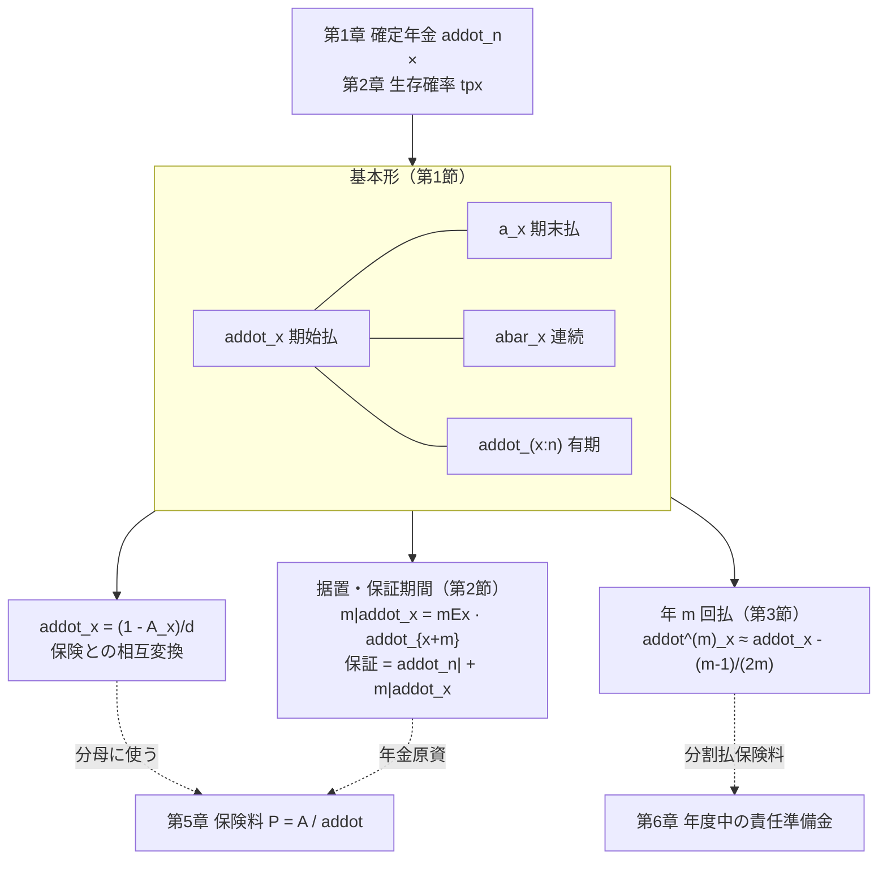
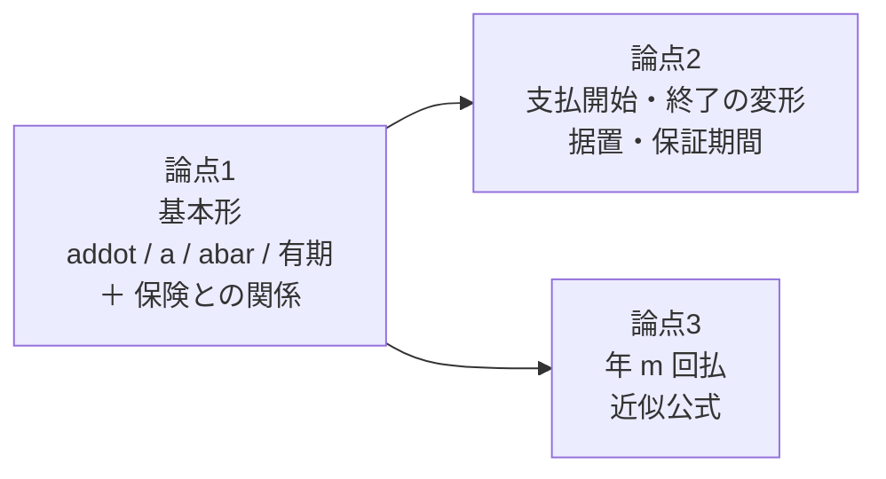
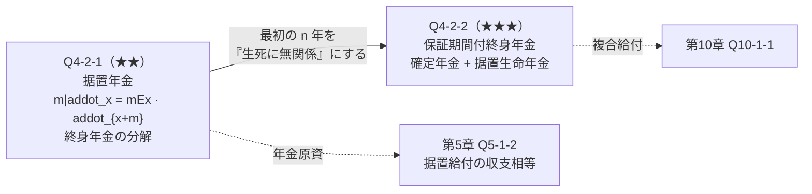
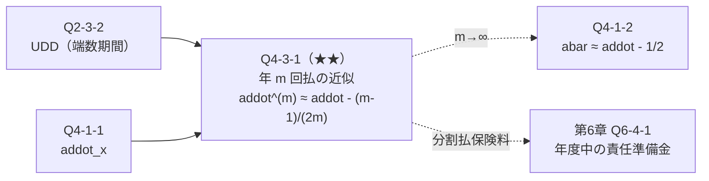
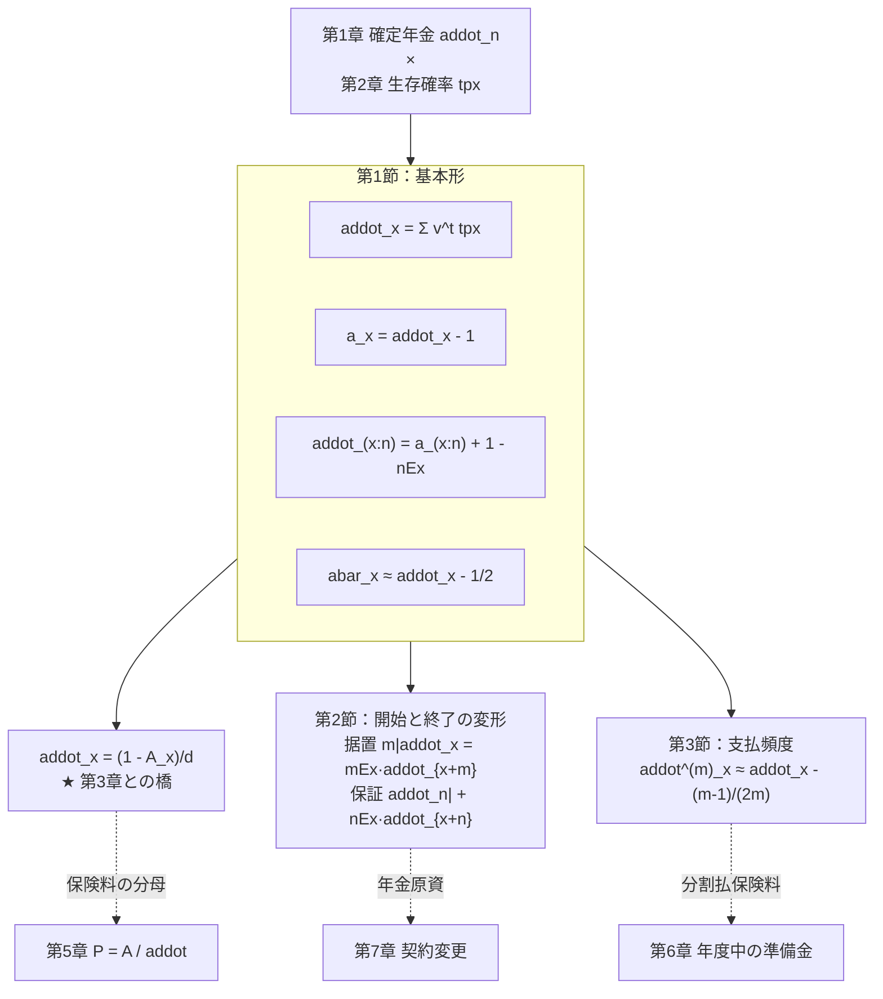
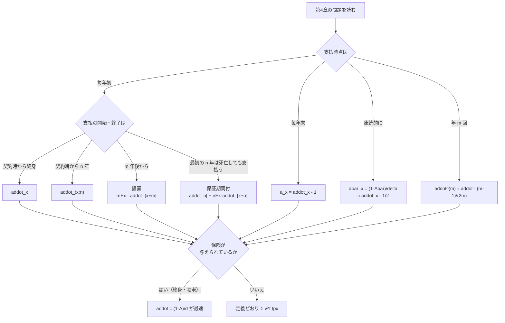

# 第4章　生命年金

> [← 第3章 一時払純保険料](第03章_一時払純保険料.md) ｜ **第4章** ｜ [第5章 平準純保険料 →](第05章_平準純保険料.md)

---

## 章の地図



**この図の読み方**：第4章は「第1章の確定年金の各支払に生存確率を掛けたもの」です。
第3章（保険）と第4章（年金）は $A_x=1-d\ddot a_x$ で表裏一体であり、
第5章以降では **年金は保険料現価の分母** として使われます。

---

## この章で学ぶこと

第3章が「死亡したとき1回だけ支払う」保険だったのに対し、
第4章は **「生存している限り毎年支払う」年金** を扱います。

| | 第3章 保険 | 第4章 年金 |
|---|---|---|
| 給付の回数 | 1回だけ | 生存中ずっと |
| 使う確率 | 死亡確率 ${}_{t\vert}q_x$ | **生存確率 ${}_tp_x$** |
| 時間軸上の形 | 1点 | 点列 |
| 現価率の指数 | $t+1$（死亡年度末） | $t$（期始払）／$t+1$（期末払） |

**第4章の年金は、第5章以降で「保険料を払う側」としても使われます。**
「毎年初に保険料 $P$ を生存中払い込む」の期待現価が $P\,\ddot a_x$ だからです。
したがって年金は給付でもあり保険料でもある、という二重の役割をもちます。

---

## この章の全体像



```text
学習順序：
① 支払時点の列を時間軸に書く            …… 期始払は t=0,1,...、期末払は t=1,2,...
        ↓
② 各時点に生存確率 tpx と現価率 v^t を掛ける
        ↓
③ 和を取る（＝定義）
        ↓
④ 保険との関係式 addot = (1-A)/d で相互変換
        ↓
⑤ 支払開始を遅らせる（据置）／打ち切りをなくす（保証期間）
        ↓
⑥ 支払頻度を上げる（年 m 回払）
```

---

## 最初に頭に入れるべきポイント

### 年金は「生存確率を掛けた確定年金」

$$\underbrace{\ddot a_{\overline{n}\vert}=\sum_{t=0}^{n-1}v^{t}}_{\text{第1章：確定年金}}
\quad\longrightarrow\quad
\underbrace{\ddot a_{x:\overline{n}\vert}=\sum_{t=0}^{n-1}v^{t}\,{}_tp_x}_{\text{第4章：生命年金}}$$

**支払時点の判断（期始払なら $t=0,\dots,n-1$）は第1章とまったく同じ** です。
第1章で支払時点を間違える人は、第4章でも間違えます。

```text
時点        0      1      2      3    ...   n-1     n
            |------|------|------|---...----|------|
期始払      ^1     ^1     ^1     ^1   ...   ^1            ← t=0..n-1
確率        1     1p_x   2p_x   3p_x  ...  (n-1)p_x
現価率      v^0    v^1    v^2    v^3  ...   v^{n-1}

期末払             ^1     ^1     ^1   ...   ^1     ^1     ← t=1..n
確率              1p_x   2p_x   3p_x  ...  (n-1)p  np_x
現価率             v^1    v^2    v^3  ...   v^{n-1} v^n
```

**$t=0$ の支払には確率が付かない**（${}_0p_x=1$）ことに注意してください。
契約時点で被保険者は必ず生存しているからです。

### 年金と保険は同じものの裏返し

$$\ddot a_x=\frac{1-A_x}{d}\qquad\Longleftrightarrow\qquad A_x=1-d\,\ddot a_x$$

第3章 Q3-1-2 で導いた式を、年金について解いただけです。
**新しく覚えることはありません。**

| 離散・期始払 | 連続 |
|---|---|
| $\ddot a_x=\dfrac{1-A_x}{d}$ | $\bar a_x=\dfrac{1-\bar A_x}{\delta}$ |
| $\ddot a_{x:\overline{n}\vert}=\dfrac{1-A_{x:\overline{n}\vert}}{d}$ | $\bar a_{x:\overline{n}\vert}=\dfrac{1-\bar A_{x:\overline{n}\vert}}{\delta}$ |

### 据置は「生存保険で橋渡しする」

$$_{m\vert}\ddot a_x={}_mE_x\,\ddot a_{x+m}$$

```text
時点        0                m                 →
            |----------------|-----------------
            [--- 支払なし ---][--- 毎年 1 を支払う ---]
                              ↑
                        ここから年齢 x+m の年金が始まる

  時点 m の年金現価 addot_{x+m} を、
  時点 0 まで持ってくる係数が mEx = v^m · mp_x
       |
       └─ 「m 年間生き延びて、m 年分割り引く」の両方を含む
```

**${}_mE_x$ は「生存保険」であると同時に「据置係数」** です。
第1章 Q1-3-1 の $v_1^{5}$（利率変更後の年金を時点0へ引き戻す係数）と
まったく同じ役割を果たしています。

### 分解の原則：$\ddot a_x=\ddot a_{x:\overline{m}\vert}+{}_{m\vert}\ddot a_x$

終身年金は「最初の $m$ 年」と「$m$ 年以降」に必ず分解できます。

$$\ddot a_x=\underbrace{\ddot a_{x:\overline{m}\vert}}_{t=0,\dots,m-1}
+\underbrace{{}_mE_x\,\ddot a_{x+m}}_{t=m,m+1,\dots}$$

据置年金の問題は、ほぼすべてこの分解で処理できます。

---

## 基本記号・基本公式

| 記号 | 支払時点 | 定義式 | 保険との関係 | 間違えやすい点 |
|---|---|---|---|---|
| $\ddot a_x$ | $0,1,2,\dots$ | $\displaystyle\sum_{t=0}^{\infty}v^{t}{}_tp_x$ | $\dfrac{1-A_x}{d}$ | $t=0$ の項は $1$ |
| $a_x$ | $1,2,\dots$ | $\displaystyle\sum_{t=1}^{\infty}v^{t}{}_tp_x$ | $\dfrac{1-A_x}{d}-1$ | $\ddot a_x=1+a_x$ |
| $\bar a_x$ | 連続 | $\displaystyle\int_0^{\infty}v^{t}{}_tp_x\,dt$ | $\dfrac{1-\bar A_x}{\delta}$ | 分母は $\delta$ |
| $\ddot a_{x:\overline{n}\vert}$ | $0,\dots,n-1$ | $\displaystyle\sum_{t=0}^{n-1}v^{t}{}_tp_x$ | $\dfrac{1-A_{x:\overline{n}\vert}}{d}$ | 上端は $n-1$ |
| $a_{x:\overline{n}\vert}$ | $1,\dots,n$ | $\displaystyle\sum_{t=1}^{n}v^{t}{}_tp_x$ | — | $\ddot a_{x:\overline{n}\vert}=a_{x:\overline{n}\vert}+1-{}_nE_x$ |
| ${}_{m\vert}\ddot a_x$ | $m,m+1,\dots$ | ${}_mE_x\,\ddot a_{x+m}$ | — | 年齢が $x+m$ になる |
| $\ddot a^{(m)}_x$ | $0,\frac1m,\frac2m,\dots$ | $\dfrac{1}{m}\displaystyle\sum_{k\ge0}v^{k/m}{}_{k/m}p_x$ | — | **年額合計が1**（1回あたり $\frac1m$） |

**重要な関係式**

$$\ddot a_x=1+a_x,\qquad
\ddot a_{x:\overline{n}\vert}=a_{x:\overline{n}\vert}+1-{}_nE_x,\qquad
\ddot a_x=\ddot a_{x:\overline{n}\vert}+{}_nE_x\,\ddot a_{x+n}$$

$$\ddot a^{(m)}_x\approx\ddot a_x-\frac{m-1}{2m},\qquad
\bar a_x\approx\ddot a_x-\frac12$$

**⚠ $\ddot a_{x:\overline{n}\vert}=a_{x:\overline{n}\vert}+1$ は誤り** です。
有期の場合、期始払は $t=0$ を追加する代わりに $t=n$ を除くので、
$+1-{}_nE_x$ となります。終身（$n\to\infty$）では ${}_nE_x\to0$ で $+1$ に戻ります。

---

## 試験での主な問われ方

| 出題形態 | 典型的な問われ方 | 対応する問題 |
|---|---|---|
| 小問 | $\ddot a_x$ と $a_x$、有期年金の関係式 | Q4-1-1 |
| 小問 | $A_x$ から $\ddot a_x$（またはその逆） | Q4-1-2 |
| 小問 | 据置年金の現価 | Q4-2-1 |
| 記述式 | 保証期間付終身年金の現価と保証コスト | Q4-2-2 |
| 記述式 | $\ddot a^{(m)}_x$ の近似公式の導出 | Q4-3-1 |
| 他章との複合 | 保険料の分母（第5章）、年金原資（第7章） | 全問 |

---

## 問題を見分けるためのサイン

| 問題文中の表現 | 判断すること |
|---|---|
| 「毎年初に」「年始に」「前払」 | $\ddot a$。支払は $t=0,\dots$ |
| 「毎年末に」「年末に」「後払」 | $a$。支払は $t=1,\dots$ |
| 「生存している限り」「生存を条件に」 | 生命年金（確定年金ではない） |
| 「連続的に年額」 | $\bar a$。分母は $\delta$ |
| 「$m$ 年経過後から」「$m$ 年据置」 | ${}_{m\vert}\ddot a_x={}_mE_x\ddot a_{x+m}$ |
| 「$n$ 年間は死亡しても支払う」「保証期間」 | **保証期間付**。確定年金＋据置生命年金 |
| 「最長 $n$ 年」「$n$ 年を限度に」 | 有期年金 $\ddot a_{x:\overline{n}\vert}$ |
| 「毎月」「年12回」 | $\ddot a^{(12)}_x$。**年額合計が1** |
| 「年金額 $R$」 | すべて $R$ 倍する |
| 「年金原資」「一時払保険料」 | 年金現価そのもの |

**⚠ 特に注意すべき語**

* 「**保証期間**」は「死亡しても支払う」という意味で、有期年金とはまったく別物です。
* 「**年12回払、年金額120万円**」なら、1回あたり10万円です（年額を $m$ で割る）。
* 「**据置**」は支払開始の遅れ。保険期間の長さとは無関係です。

---

## この章の問題一覧

| ID | 表題 | 難 | 段階 | この問題の役割 |
|---|---|---|---|---|
| **第1節　基本形と保険との関係** | | | | |
| Q4-1-1 | 期始払・期末払・有期年金の関係 | ★ | ① | 支払時点の列を確定させる。$+1-{}_nE_x$ の根拠 |
| Q4-1-2 | 年金と保険の相互変換 | ★★ | ② | $\ddot a=(1-A)/d$ を双方向に使う |
| **第2節　据置と保証期間** | | | | |
| Q4-2-1 | 据置年金と生存保険への分解 | ★★ | ③ | ${}_mE_x$ が「据置係数」であることの理解 |
| Q4-2-2 | 保証期間付終身年金 | ★★★ | ④ | 確定年金＋生命年金の合成。読み替えが必要 |
| **第3節　年 $m$ 回払** | | | | |
| Q4-3-1 | 年 $m$ 回払年金の近似 | ★★ | ③ | UDD からの近似公式の導出 |

---
---

# 第1節　基本形と保険との関係

## この節のテーマ

**支払時点の列（期始・期末・連続・有期）を正しく設定する技術** と、
**保険との相互変換** を扱います。

## この節でできるようになること

* 期始払・期末払・有期・連続の年金現価を定義から書ける
* $\ddot a_{x:\overline{n}\vert}=a_{x:\overline{n}\vert}+1-{}_nE_x$ を導ける
* $A$ と $\ddot a$ を双方向に変換できる
* 終身・有期・連続の使い分けを判断できる

## 頭に入れるべきポイント

### 期始払と期末払の差は「$t=0$ を足して $t=n$ を引く」

```text
時点        0    1    2   ...  n-1   n
            |----|----|--...--|----|
期始払 n 回  ^    ^    ^  ...   ^              t = 0..n-1
期末払 n 回       ^    ^  ...   ^    ^         t = 1..n
            └┬┘                    └┬┘
             │                       │
        期始払だけにある          期末払だけにある
        t=0 の支払（現価 1）      t=n の支払（現価 v^n·np_x = nEx）

  ⇒ addot_(x:n) = a_(x:n) + 1 - nEx
```

終身（$n\to\infty$）では ${}_nE_x\to0$ なので $\ddot a_x=1+a_x$ になります。

### 相互変換は「$1$ から引いて $d$ で割る」

$$\ddot a_x=\frac{1-A_x}{d}\qquad\text{（$d$ で割る。$i$ ではない）}$$

**$d$ を使う理由**：$\ddot a$ が期始払だからです（第1章の原則）。
連続なら $\delta$、年 $m$ 回払なら $d^{(m)}$ です。

## 使用する記号・公式

| 関係 | 離散（期始払） | 連続 |
|---|---|---|
| 保険 → 年金 | $\ddot a_x=\dfrac{1-A_x}{d}$ | $\bar a_x=\dfrac{1-\bar A_x}{\delta}$ |
| 年金 → 保険 | $A_x=1-d\,\ddot a_x$ | $\bar A_x=1-\delta\,\bar a_x$ |
| 有期 | $\ddot a_{x:\overline{n}\vert}=\dfrac{1-A_{x:\overline{n}\vert}}{d}$ | 同様 |
| 期始↔期末 | $\ddot a_x=1+a_x$、$\ddot a_{x:\overline{n}\vert}=a_{x:\overline{n}\vert}+1-{}_nE_x$ | — |
| 分解 | $\ddot a_x=\ddot a_{x:\overline{n}\vert}+{}_nE_x\,\ddot a_{x+n}$ | — |

## 基本的な解法パターン

```text
① 支払時点の列を時間軸に書く（期始 t=0.. / 期末 t=1.. / 連続）
        ↓
② 各時点に「生存確率 tpx」と「現価率 v^t」を掛ける
        ↓
③ 和（または積分）を取る
        ↓
④ 保険が与えられているなら (1-A)/d で変換する方が速い
        ↓
⑤ 検算：addot > a、addot_(x:n) < addot_x、addot_x < 1/d（永久年金の上限）
```

## 間違えやすい点

| 誤り | 内容 | 防ぎ方 |
|---|---|---|
| 有期の期始↔期末 | $\ddot a_{x:\overline{n}\vert}=a_{x:\overline{n}\vert}+1$ | $-{}_nE_x$ を忘れない（時間軸で確認） |
| 分母 | $\ddot a_x=(1-A_x)/i$ | 期始払なので $d$ |
| $t=0$ に確率を掛ける | $v^{0}\,{}_0p_x$ を $p_x$ とする | ${}_0p_x=1$ |
| 有期の上端 | $\ddot a_{x:\overline{n}\vert}$ を $t=n$ まで | $n-1$ まで |
| 連続で $d$ を使う | — | 連続は $\delta$ |

## この節の問題の流れ


---
---

## 問題 Q4-1-1　期始払・期末払・有期年金の関係

| 項目 | 内容 |
|---|---|
| 出題年度 | `要照合`（記入欄：______年度） |
| 問題番号 | `要照合`（記入欄：問題___） |
| 分野・論点 | 生命年金 ／ 基本形 |
| 難易度 | ★ |
| この節での位置づけ | 段階①（定義を直接使う）。本章の基準となる問題 |
| 関連する問題 | 発展元：Q1-2-1（確定年金）、Q2-1-1（生存確率） ／ 本問 ／ 後続：Q4-1-2、Q4-2-1、Q5-1-1 |

### ■ この問題で押さえるべきポイント

#### ① 何を問う問題か

**期始払・期末払・有期・連続の年金現価の関係を確認させる問題** です。
特に **$\ddot a_{x:\overline{n}\vert}=a_{x:\overline{n}\vert}+1-{}_nE_x$** の $-{}_nE_x$ が
なぜ必要かを問います。

#### ② 問題文から読み取るべき条件

| 条件 | 解法への影響 |
|---|---|
| 「毎年初」 | $\ddot a$。支払 $t=0,\dots$ |
| 「毎年末」 | $a$。支払 $t=1,\dots$ |
| 「最長20年」 | 有期 $\ddot a_{65:\overline{20}\vert}$ |
| 「生存している限り」 | 生命年金（各支払に ${}_tp_x$） |
| 「年金額 1」 | 年金額 $R$ なら $R$ 倍 |

#### ③ 最初に注目する場所

**「毎年初」か「毎年末」か**、そして **期間の有無**。
この2つで支払時点の列が決まり、公式が一意に定まります。

#### ④ 呼び出すべき知識

| 知識 | なぜこの問題で使うか |
|---|---|
| $\ddot a_x=\sum_{t\ge0}v^{t}{}_tp_x$ | 定義 |
| $\ddot a_x=1+a_x$ | 終身の場合の関係 |
| $\ddot a_{x:\overline{n}\vert}=a_{x:\overline{n}\vert}+1-{}_nE_x$ | 有期の場合。$-{}_nE_x$ が本問の焦点 |
| ${}_nE_x=v^{n}{}_np_x$ | 期末払だけにある $t=n$ の支払 |
| $\ddot a_x=\ddot a_{x:\overline{n}\vert}+{}_nE_x\ddot a_{x+n}$ | 分解（Q4-2-1 の下地） |

#### ⑤ 解法の骨格

```text
1. 支払時点の列を時間軸に書く
2. 期始払と期末払の差を「集合の差」として見る
   （期始払だけにある t=0、期末払だけにある t=n）
3. それぞれの現価を求めて関係式を作る
4. 数値で確認
```

#### ⑥ 間違えやすい点

* 有期で $-{}_nE_x$ を忘れる
* 有期の上端を $t=n$ にする
* $t=0$ の支払に $p_x$ を掛ける
* 連続年金の分母に $d$ を使う

#### ⑦ この問題を一言で捉えると

> **「期始払と期末払は、$t=0$ を足して $t=n$ を引くだけの違い」。**

### ■ 問題の構造図

```text
支払時点の列（x = 65, n = 20）：

時点     0    1    2   ...  19   20
         |----|----|--...--|----|
年齢    65   66   67  ...  84   85

期始払   ^1   ^1   ^1  ...  ^1              ← t = 0..19（20 回）
確率     1  1p_65 2p_65 ... 19p_65
現価率  v^0  v^1  v^2  ...  v^19

期末払        ^1   ^1  ...  ^1   ^1         ← t = 1..20（20 回）
確率       1p_65 2p_65 ... 19p_65 20p_65
現価率      v^1  v^2  ...  v^19  v^20

  差分：
    期始払だけ：t=0 の支払 → 現価 v^0 · 0p_65 = 1
    期末払だけ：t=20 の支払 → 現価 v^20 · 20p_65 = 20E_65

  ⇒ addot_(65:20) = a_(65:20) + 1 - 20E_65
                                 ↑    ↑
                          足す（t=0）  引く（t=20）
```

### ■ 問題

年利率 $i=0.03$、65歳の被保険者について、次の値が与えられている。

$$\ddot a_{65}=15.136291,\qquad {}_{20}E_{65}=0.299761,\qquad
a_{65:\overline{20}\vert}=12.396747$$

**(1)** 期末払終身年金 $a_{65}$ を求めよ（小数第6位まで）。

**(2)** 期始払20年有期年金 $\ddot a_{65:\overline{20}\vert}$ を求めよ（小数第6位まで）。

**(3)** (2) で用いた関係式 $\ddot a_{x:\overline{n}\vert}=a_{x:\overline{n}\vert}+1-{}_nE_x$ が
成り立つ理由を、支払時点の列から説明せよ。

**(4)** $\ddot a_{85}=?$ とするとき、分解 $\ddot a_{65}=\ddot a_{65:\overline{20}\vert}+{}_{20}E_{65}\,\ddot a_{85}$
を用いて $\ddot a_{85}$ を求めよ（小数第6位まで）。

**(5)** 年金額が年額120万円で、毎年初に生存している限り終身にわたり支払われる場合、
この年金の現価（年金原資）はいくらか。

> 本問は再現題です。原文の出題年度・問題番号は未照合です。

### ■ 問題文を数理モデルへ変換

| 確認項目 | 問題文から読み取れる内容 | 数理的な表現 |
|---|---|---|
| 被保険者 | 65歳 | $x=65$ |
| 利率 | $i=0.03$ | $v=1/1.03$、$d=0.03/1.03$ |
| (1) 支払時点 | 毎年末・終身 | $a_{65}$、$t=1,2,\dots$ |
| (2) 支払時点 | 毎年初・20年有期 | $\ddot a_{65:\overline{20}\vert}$、$t=0,\dots,19$ |
| (4) 分解 | 最初の20年＋20年以降 | $\ddot a_{65}=\ddot a_{65:\overline{20}\vert}+{}_{20}E_{65}\ddot a_{85}$ |
| (5) 年金額 | 年額120万円 | すべて $120$ 万円倍 |

### ■ 解法フロー

```text
STEP 1　(1) 終身の期始↔期末（差は 1 だけ）
STEP 2　(2) 有期の期始↔期末（差は 1 - nEx）
STEP 3　(3) 支払時点の集合差から理由を説明
STEP 4　(4) 分解式を逆に解く
STEP 5　(5) 年金額を掛ける
```

### ■ 詳細解説

#### STEP 1　(1) 期末払終身年金

*目的：終身の場合の期始↔期末を確認する。*

終身年金では、期始払の支払時点は $t=0,1,2,\dots$、期末払は $t=1,2,\dots$ です。
**差は $t=0$ の支払1回だけ** で、その現価は $v^{0}\cdot{}_0p_{65}=1$ です。

$$\ddot a_{65}=1+a_{65}\quad\Longrightarrow\quad a_{65}=\ddot a_{65}-1=15.136291-1$$

$$\boxed{a_{65}=14.136291}$$

**${}_0p_{65}=1$ である理由**：契約時点で被保険者は生存しているので、
$t=0$ の支払は確実に行われます。確率を掛ける必要がありません。

#### STEP 2　(2) 期始払有期年金

*目的：有期の場合に $-{}_nE_x$ が必要なことを使う。*

$$\ddot a_{65:\overline{20}\vert}=a_{65:\overline{20}\vert}+1-{}_{20}E_{65}
=12.396747+1-0.299761$$

$$\boxed{\ddot a_{65:\overline{20}\vert}=13.096986}$$

（より高精度には $13.096987$ です。）

**⚠ $-{}_{20}E_{65}$ を忘れると** $13.396747$ となり、$0.3$ も過大になります。

#### STEP 3　(3) 関係式の理由

*目的：支払時点の集合の差として説明する。*

期始払 $n$ 年有期年金の支払時点は

$$T_{\text{期始}}=\{0,1,2,\dots,n-1\}$$

期末払 $n$ 年有期年金の支払時点は

$$T_{\text{期末}}=\{1,2,\dots,n-1,n\}$$

**共通部分は $\{1,2,\dots,n-1\}$** で、差は次の2点だけです。

| | 支払時点 | その現価 |
|---|---|---|
| 期始払だけにある | $t=0$ | $v^{0}\,{}_0p_x=1$ |
| 期末払だけにある | $t=n$ | $v^{n}\,{}_np_x={}_nE_x$ |

したがって

$$\ddot a_{x:\overline{n}\vert}-a_{x:\overline{n}\vert}
=\underbrace{1}_{t=0\text{ を加える}}-\underbrace{{}_nE_x}_{t=n\text{ を除く}}$$

$$\therefore\quad\ddot a_{x:\overline{n}\vert}=a_{x:\overline{n}\vert}+1-{}_nE_x$$

□

**終身の場合との対応**：$n\to\infty$ とすると ${}_nE_x=v^{n}{}_np_x\to0$ なので
$\ddot a_x=a_x+1$ に帰着します。
**終身の関係式は有期の関係式の特別な場合** です。

#### STEP 4　(4) 分解式から $\ddot a_{85}$

*目的：終身年金の分解を逆に使う。*

終身年金は「最初の20年」と「20年以降」に分解できます。

$$\ddot a_{65}=\underbrace{\ddot a_{65:\overline{20}\vert}}_{t=0,\dots,19}
+\underbrace{{}_{20}E_{65}\,\ddot a_{85}}_{t=20,21,\dots}$$

$\ddot a_{85}$ について解きます。

$$\ddot a_{85}=\frac{\ddot a_{65}-\ddot a_{65:\overline{20}\vert}}{{}_{20}E_{65}}
=\frac{15.136291-13.096987}{0.299761}=\frac{2.039304}{0.299761}=6.803096$$

$$\boxed{\ddot a_{85}=6.803096}$$

**妥当性**：$85$ 歳の期始払終身年金が $6.80$ です。
$65$ 歳の $15.14$ に比べて大幅に小さく、高齢で余命が短いことを反映しています。
また $\ddot a_{85}<\dfrac{1}{d}=\dfrac{1}{0.0291262}=34.33$（永久年金の上限）も満たします。✓

**分解の意味**

```text
時点     0                     20                    →
         |----------------------|---------------------
         [--- addot_(65:20) ---][--- 20E65 · addot_85 ---]
              20 回の支払          20 年後から始まる年金を
                                  時点 0 へ引き戻したもの

  ★ 20E65 が「20 年生き延びて 20 年分割り引く」係数
```

#### STEP 5　(5) 年金額を掛ける

*目的：年金額 $R$ の場合への一般化。*

年金額が年額 $R=120$ 万円の場合、すべての支払が $R$ 倍になるので、現価も $R$ 倍です。

$$R\times\ddot a_{65}=120\times15.136291=1816.355$$

$$\boxed{\text{年金原資}=1816.35\ \text{万円}}$$

**約 $1816$ 万円**（$1$ 億 $8163$ 千円ではなく、$1816$ 万円）です。

**意味の確認**：年額120万円を終身で受け取るために、
契約時に約1816万円が必要ということです。
$1816/120=15.14$ 年分に相当し、これが $\ddot a_{65}$ そのものです。

### ■ 答え

| 設問 | 量 | 値 |
|---|---|---|
| (1) | $a_{65}$ | $14.136291$ |
| (2) | $\ddot a_{65:\overline{20}\vert}$ | $13.096986$ |
| (4) | $\ddot a_{85}$ | $6.803096$ |
| (5) | 年金原資 | $1816.35$ 万円 |

**(3)** 期始払の支払時点は $\{0,1,\dots,n-1\}$、期末払は $\{1,\dots,n\}$ であり、
共通部分 $\{1,\dots,n-1\}$ を除くと、
期始払だけにある $t=0$（現価 $1$）と期末払だけにある $t=n$（現価 ${}_nE_x$）が残る。
よって $\ddot a_{x:\overline{n}\vert}=a_{x:\overline{n}\vert}+1-{}_nE_x$。

### ■ 試験答案としての書き方

> **(1)** 終身年金では期始払と期末払の差は $t=0$ の支払（現価 $1$）のみであるから
> $a_{65}=\ddot a_{65}-1=15.136291-1=14.136291$
>
> **(2)** $\ddot a_{65:\overline{20}\vert}=a_{65:\overline{20}\vert}+1-{}_{20}E_{65}
> =12.396747+1-0.299761=13.096986$
>
> **(3)** 期始払 $n$ 年有期年金の支払時点は $\{0,1,\dots,n-1\}$、
> 期末払 $n$ 年有期年金の支払時点は $\{1,\dots,n\}$ である。
> 共通部分 $\{1,\dots,n-1\}$ を除くと、
> 期始払にのみ $t=0$ の支払（現価 $v^{0}{}_0p_x=1$）があり、
> 期末払にのみ $t=n$ の支払（現価 $v^{n}{}_np_x={}_nE_x$）がある。
> よって $\ddot a_{x:\overline{n}\vert}=a_{x:\overline{n}\vert}+1-{}_nE_x$ □
>
> **(4)** $\ddot a_{65}=\ddot a_{65:\overline{20}\vert}+{}_{20}E_{65}\ddot a_{85}$ より
> $\ddot a_{85}=\dfrac{15.136291-13.096987}{0.299761}=\dfrac{2.039304}{0.299761}=6.803096$
>
> **(5)** $120\times\ddot a_{65}=120\times15.136291=1816.35$（万円）

### ■ 解答後に確認すること

| 項目 | 内容 |
|---|---|
| **最も重要なポイント** | 期始払と期末払の差は **$t=0$ を足して $t=n$ を引く**。有期では $+1-{}_nE_x$、終身では ${}_nE_x\to0$ で $+1$ |
| **最初に気づくべきだった条件** | 「毎年初／毎年末」と「期間の有無」。この2つで支払時点の列が決まる |
| **他の問題にも使える考え方** | ① 関係式は「支払時点の集合の差」で導ける（暗記不要）。② 終身年金は任意の時点で2つに分解できる。③ 年金額 $R$ なら単純に $R$ 倍 |
| **類似問題との違い** | Q1-2-1 は確定年金（確率なし）。本問は生存確率が入る。支払時点の判断はまったく同じ |
| **条件が変わった場合** | ① 連続なら $\bar a_x\approx\ddot a_x-\frac12$。② 年 $m$ 回払なら $\ddot a^{(m)}_x\approx\ddot a_x-\frac{m-1}{2m}$（Q4-3-1）。③ 据置なら ${}_mE_x$ を掛ける（Q4-2-1） |
| **復習時に思い出すこと** | $\ddot a_{x:\overline{n}\vert}=a_{x:\overline{n}\vert}+1-{}_nE_x$、$\ddot a_x=\ddot a_{x:\overline{n}\vert}+{}_nE_x\ddot a_{x+n}$ |

---
---

## 問題 Q4-1-2　年金と保険の相互変換

| 項目 | 内容 |
|---|---|
| 出題年度 | `要照合`（記入欄：______年度） |
| 問題番号 | `要照合`（記入欄：問題___） |
| 分野・論点 | 生命年金 ／ 保険との関係 |
| 難易度 | ★★ |
| この節での位置づけ | 段階②（基本公式を変形して使う）。Q3-1-2 を年金側から使う |
| 関連する問題 | 発展元：Q3-1-2、Q4-1-1 ／ 本問 ／ 後続：Q5-1-1（保険料）、Q6-1-3（責任準備金） |

### ■ この問題で押さえるべきポイント

#### ① 何を問う問題か

**$A$ と $\ddot a$ を双方向に変換させる問題** です。
第5章以降では「$A$ が与えられて $\ddot a$ が必要」「その逆」という場面が頻出するため、
**変換を反射的にできること** が問われます。

#### ② 問題文から読み取るべき条件

| 条件 | 解法への影響 |
|---|---|
| 「$A_{65}=0.559137$」 | $\ddot a_{65}=(1-A_{65})/d$ |
| 「$\ddot a_{65:\overline{20}\vert}=13.096987$」 | $A_{65:\overline{20}\vert}=1-d\ddot a$ |
| 「連続型 $\bar A_{65}$」 | $\bar a_{65}=(1-\bar A_{65})/\delta$。**$\delta$ を使う** |
| 「定期保険 $A^1$」 | 直接は変換できない。${}_nE_x$ を経由 |

#### ③ 最初に注目する場所

**離散か連続か**（$d$ か $\delta$ か）、そして
**終身・養老か定期か**（関係式が使えるか）。

#### ④ 呼び出すべき知識

| 知識 | なぜこの問題で使うか |
|---|---|
| $\ddot a_x=\dfrac{1-A_x}{d}$ | 基本の変換 |
| $\bar a_x=\dfrac{1-\bar A_x}{\delta}$ | 連続版 |
| $A^1_{x:\overline{n}\vert}=A_{x:\overline{n}\vert}-{}_nE_x$ | 定期保険は分解を経由 |
| $d=\dfrac{i}{1+i}$、$\delta=\ln(1+i)$ | 第1章 |

#### ⑤ 解法の骨格

```text
1. 離散か連続かを判定 → d か delta か
2. 終身・養老なら関係式を直接適用
3. 定期保険なら養老 - nEx を経由
4. 検算：addot < 1/d、abar < 1/delta、A < 1
```

#### ⑥ 間違えやすい点

* 分母に $i$ を使う
* 連続型に $d$ を使う
* 定期保険に直接適用する
* $1-A$ の順序を $A-1$ にする（負になる）

#### ⑦ この問題を一言で捉えると

> **「$1$ から引いて割る」だけ。割る数が $d$ か $\delta$ かを間違えなければよい。**

### ■ 問題の構造図

```text
変換の全体像：

              ÷ d（期始払・離散）
   1 - A_x  ───────────────────→  addot_x
      ↑                              │
      │        × d                   │
      └──────────────────────────────┘

              ÷ delta（連続）
   1 - Abar_x ──────────────────→  abar_x


定期保険は直接変換できない（★）：

   A^1_(x:n)  =  A_(x:n)  -  nEx
                    │
                    │ = 1 - d·addot_(x:n)
                    ↓
   A^1_(x:n) = 1 - d·addot_(x:n) - nEx

   ⚠ A^1 から直接 addot を作る式は存在しない
     （A^1 だけでは生存側の情報が足りないため）


分母の選び方（第1章の原則がそのまま）：

   期始払 addot   →  d
   期末払 a       →  i（ただし A との関係式は addot 経由が普通）
   連続   abar    →  delta
   年 m 回 addot^(m) → d^(m)
```

### ■ 問題

年利率 $i=0.03$ とする。65歳について次の値が与えられている。

$$A_{65}=0.559137,\qquad \bar A_{65}=0.567465,\qquad
\ddot a_{65:\overline{20}\vert}=13.096987,\qquad {}_{20}E_{65}=0.299761$$

**(1)** $d$ および $\delta$ を求めよ（小数第7位まで）。

**(2)** $A_{65}$ から $\ddot a_{65}$ を求めよ（小数第6位まで）。

**(3)** $\bar A_{65}$ から $\bar a_{65}$ を求めよ（小数第6位まで）。
また $\ddot a_{65}$ との差を求め、その意味を述べよ。

**(4)** $\ddot a_{65:\overline{20}\vert}$ から養老保険 $A_{65:\overline{20}\vert}$ を求め、
さらに定期保険 $A^1_{65:\overline{20}\vert}$ を求めよ（小数第6位まで）。

**(5)** 定期保険 $A^1_{x:\overline{n}\vert}$ から $\ddot a_{x:\overline{n}\vert}$ を
直接求める公式が存在しない理由を述べよ。

> 本問は再現題です。原文の出題年度・問題番号は未照合です。

### ■ 問題文を数理モデルへ変換

| 確認項目 | 問題文から読み取れる内容 | 数理的な表現 |
|---|---|---|
| (2) 変換 | 離散・終身 | $\ddot a_{65}=(1-A_{65})/d$ |
| (3) 変換 | 連続・終身 | $\bar a_{65}=(1-\bar A_{65})/\delta$ |
| (4) 変換 | 離散・有期（養老） | $A_{65:\overline{20}\vert}=1-d\ddot a_{65:\overline{20}\vert}$ |
| (4) 分解 | 定期 = 養老 − 生存 | $A^1=A_{x:\overline{n}\vert}-{}_nE_x$ |

### ■ 解法フロー

```text
STEP 1　(1) d と delta を計算する
STEP 2　(2) 離散の変換
STEP 3　(3) 連続の変換と差の解釈
STEP 4　(4) 有期の変換と定期保険への分解
STEP 5　(5) 定期保険から直接変換できない理由
```

### ■ 詳細解説

#### STEP 1　(1) $d$ と $\delta$

$$d=\frac{i}{1+i}=\frac{0.03}{1.03}=0.0291262$$

$$\delta=\ln(1+i)=\ln1.03=0.0295588$$

**検算**：$d<\delta<i$（第1章 Q1-1-1）。
$0.0291262<0.0295588<0.03$ ✓

#### STEP 2　(2) 離散の変換

$$\ddot a_{65}=\frac{1-A_{65}}{d}=\frac{1-0.559137}{0.0291262}=\frac{0.440863}{0.0291262}=15.136291$$

$$\boxed{\ddot a_{65}=15.136291}$$

**検算**：永久年金の上限 $\dfrac{1}{d}=\dfrac{1}{0.0291262}=34.334$ より小さい。✓
（$\ddot a_x<\frac1d$ は「必ず死ぬ」ことから常に成立します。）

#### STEP 3　(3) 連続の変換と差の意味

$$\bar a_{65}=\frac{1-\bar A_{65}}{\delta}=\frac{1-0.567465}{0.0295588}=\frac{0.432535}{0.0295588}=14.633025$$

$$\boxed{\bar a_{65}=14.633025}$$

**$\ddot a_{65}$ との差**

$$\ddot a_{65}-\bar a_{65}=15.136291-14.633025=0.503266$$

**この差が約 $0.5$ である意味**

```text
時点     0      1      2      3   ...
         |------|------|------|---...
期始払   ^1     ^1     ^1     ^1        ← 各年の「最初」にまとめて 1
連続払   [======][======][======]       ← 各年に均等に分散して合計 1

  ⇒ 期始払は連続払より「平均して半年分早く」受け取る
    → 割引が弱い → addot > abar
    → 差は約 1/2

  近似公式：abar_x ≈ addot_x - 1/2
```

実際、$\ddot a_{65}-\frac12=15.136291-0.5=14.636291$ で、
$\bar a_{65}=14.633025$ に非常に近い値です（誤差 $0.003$）。

**なぜ厳密に $0.5$ でないか**：$\bar a_x\approx\ddot a_x-\frac12$ は
年金支払の時点をずらす近似であり、生存確率の年度内変化を無視しています。
より精密には $\bar a_x\approx\ddot a_x-\frac12-\frac{1}{12}(\delta+\mu_x)$ 程度の補正が入ります
（Woolhouse の公式）。

#### STEP 4　(4) 有期の変換と定期保険

**養老保険**

$$A_{65:\overline{20}\vert}=1-d\,\ddot a_{65:\overline{20}\vert}
=1-0.0291262\times13.096987=1-0.381466=0.618534$$

$$\boxed{A_{65:\overline{20}\vert}=0.618534}$$

**定期保険**：養老保険から生存保険を引きます。

$$A^1_{65:\overline{20}\vert}=A_{65:\overline{20}\vert}-{}_{20}E_{65}
=0.618534-0.299761=0.318773$$

$$\boxed{A^1_{65:\overline{20}\vert}=0.318773}$$

**妥当性**：65歳の20年定期保険が $0.318773$ です。
Q3-1-2 の40歳20年定期保険 $0.040461$ と比べて **約8倍** です。
65歳では20年以内に死亡する確率がはるかに高いので妥当です。✓

（確認：${}_{20}p_{65}=\dfrac{{}_{20}E_{65}}{v^{20}}=\dfrac{0.299761}{0.5536758}=0.541396$。
つまり65歳の約 $46\%$ が20年以内に死亡します。）

#### STEP 5　(5) 定期保険から直接変換できない理由

*目的：関係式の情報構造を理解する。*

養老保険と年金の関係式

$$A_{x:\overline{n}\vert}=1-d\,\ddot a_{x:\overline{n}\vert}$$

は、**「死亡でも満期でも必ず $1$ が支払われる」** という性質から導かれます
（第3章 Q3-1-2 の望遠鏡和）。

定期保険では

$$A^1_{x:\overline{n}\vert}=1-d\,\ddot a_{x:\overline{n}\vert}-{}_nE_x$$

となり、**右辺に $\ddot a_{x:\overline{n}\vert}$ と ${}_nE_x$ の2つの未知量が現れます**。

```text
情報の数え方：

   既知：A^1_(x:n)                     …… 1 個の情報
   未知：addot_(x:n) と nEx            …… 2 個の未知量
   関係式：A^1 = 1 - d·addot - nEx     …… 1 本の方程式

   ⇒ 方程式 1 本で未知数 2 個は決まらない
```

**必要な追加情報**：${}_nE_x$（または ${}_np_x$）が与えられれば決まります。

$$\ddot a_{x:\overline{n}\vert}=\frac{1-A^1_{x:\overline{n}\vert}-{}_nE_x}{d}$$

**直感的な説明**：定期保険は「死亡した場合の給付」だけを表しており、
「生存した場合に何が起きるか」の情報を含みません。
一方、年金は「生存している間ずっと」の給付なので、生存側の情報が必要です。
**両者は情報の重なりが不完全** なので、直接変換できないのです。

**⚠ 頻出の誤り**：$A^1_{x:\overline{n}\vert}=1-d\ddot a_{x:\overline{n}\vert}$ と
書いてしまうこと。Q3-1-1 (5) で数値的に確認したとおり、
$0.0070929$ と $0.7841682$ のように桁違いにずれます。

### ■ 答え

| 設問 | 量 | 値 |
|---|---|---|
| (1) | $d$ | $0.0291262$ |
| | $\delta$ | $0.0295588$ |
| (2) | $\ddot a_{65}$ | $15.136291$ |
| (3) | $\bar a_{65}$ | $14.633025$ |
| | $\ddot a_{65}-\bar a_{65}$ | $0.503266$ |
| (4) | $A_{65:\overline{20}\vert}$ | $0.618534$ |
| | $A^1_{65:\overline{20}\vert}$ | $0.318773$ |

**(3) の差の意味**：期始払は各年の最初にまとめて $1$ を受け取るのに対し、
連続払は年間に分散して受け取るため、期始払の方が平均して約半年早い。
したがって $\ddot a_x-\bar a_x\approx\frac12$ となる。

**(5)** $A^1_{x:\overline{n}\vert}=1-d\ddot a_{x:\overline{n}\vert}-{}_nE_x$ において、
既知量が $A^1$ の1個に対し未知量が $\ddot a_{x:\overline{n}\vert}$ と ${}_nE_x$ の2個であり、
方程式が1本では決まらない。
定期保険は死亡給付の情報のみを含み、生存側の情報を欠くためである。
${}_nE_x$ が別に与えられれば
$\ddot a_{x:\overline{n}\vert}=\dfrac{1-A^1_{x:\overline{n}\vert}-{}_nE_x}{d}$ で求まる。

### ■ 試験答案としての書き方

> **(1)** $d=\dfrac{0.03}{1.03}=0.0291262$、$\ \delta=\ln1.03=0.0295588$
>
> **(2)** $\ddot a_{65}=\dfrac{1-A_{65}}{d}=\dfrac{0.440863}{0.0291262}=15.136291$
>
> **(3)** $\bar a_{65}=\dfrac{1-\bar A_{65}}{\delta}=\dfrac{0.432535}{0.0295588}=14.633025$
> 差は $15.136291-14.633025=0.503266$。
> 期始払は各年の最初に $1$ を受け取るのに対し連続払は年間に分散するため、
> 期始払の方が平均して約半年早く受け取ることになり、差は約 $\frac12$ となる。
>
> **(4)** $A_{65:\overline{20}\vert}=1-d\,\ddot a_{65:\overline{20}\vert}
> =1-0.0291262\times13.096987=0.618534$
> $A^1_{65:\overline{20}\vert}=A_{65:\overline{20}\vert}-{}_{20}E_{65}=0.618534-0.299761=0.318773$
>
> **(5)** 関係式は $A^1_{x:\overline{n}\vert}=1-d\ddot a_{x:\overline{n}\vert}-{}_nE_x$ であり、
> $A^1$ が既知でも未知量が $\ddot a_{x:\overline{n}\vert}$ と ${}_nE_x$ の2個あるため一意に定まらない。
> 定期保険は死亡給付のみの情報であり、生存に関する情報を含まないことによる。

### ■ 解答後に確認すること

| 項目 | 内容 |
|---|---|
| **最も重要なポイント** | $\ddot a=\dfrac{1-A}{d}$（離散・期始払）、$\bar a=\dfrac{1-\bar A}{\delta}$（連続）。**分母は支払形態で決まる** |
| **最初に気づくべきだった条件** | 離散か連続か。終身・養老か定期か。定期保険は直接変換できない |
| **他の問題にも使える考え方** | ① $\ddot a_x-\bar a_x\approx\frac12$（期始払は半年早い）。② 「既知量の数 vs 未知量の数」で解けるかを判断する。③ $\ddot a_x<\frac1d$ で検算 |
| **類似問題との違い** | Q3-1-2 は同じ式を保険側から使う。本問は年金側。式は同一で、どちらを求めるかが違うだけ |
| **条件が変わった場合** | ① 年 $m$ 回払なら $A^{(m)}_x=1-d^{(m)}\ddot a^{(m)}_x$。② 連生なら $A_{xy}=1-d\ddot a_{xy}$（第8章）。③ 定期保険は ${}_nE_x$ が別に必要 |
| **復習時に思い出すこと** | 「$1$ から引いて $d$（または $\delta$）で割る」。定期保険には使えない |

---

## 第1節　記憶用の一枚まとめ

```text
┌──────────────────────────────────────────────────────────────────────┐
│  第1節　基本形と保険との関係                                          │
└──────────────────────────────────────────────────────────────────────┘

【問題文のサイン】
   「毎年初に」「前払」        → addot。支払 t = 0..（n-1）
   「毎年末に」「後払」        → a。   支払 t = 1..n
   「連続的に年額」            → abar。分母は delta
   「生存している限り」        → 生命年金（各支払に tpx）
   「最長 n 年」「n 年を限度」  → 有期 addot_(x:n)
   「年金額 R」                → すべて R 倍
        ↓
【判断する論点】
   支払時点の列はどれか → 期始 / 期末 / 連続
   期間は有限か無限か   → 有期 / 終身
   保険が与えられているか
   ├─ 終身・養老 → addot = (1-A)/d で一発
   └─ 定期のみ   → ★ 直接変換できない（nEx が別途必要）
        ↓
【描くべき図】
   時点   0    1    2   ...  n-1   n
          |----|----|--...--|----|
   期始   ^1   ^1   ^1  ...  ^1          ← t=0 の確率は 1（0px=1）
   期末        ^1   ^1  ...  ^1   ^1
          └┬┘                    └┬┘
       期始だけ（+1）        期末だけ（-nEx）
        ↓
【使用する公式】
   addot_x       = Σ_{t≥0} v^t tpx          a_x = Σ_{t≥1} v^t tpx
   addot_(x:n)   = Σ_{t=0}^{n-1} v^t tpx    （上端は n-1）
   ★ addot_x = 1 + a_x
   ★ addot_(x:n) = a_(x:n) + 1 - nEx        （終身では nEx → 0）
   ★ addot_x = addot_(x:n) + nEx · addot_{x+n}   （分解）
   ★ addot_x = (1 - A_x)/d      abar_x = (1 - Abar_x)/delta
     A^1_(x:n) = 1 - d·addot_(x:n) - nEx    （定期は nEx の分ずれる）
     abar_x ≈ addot_x - 1/2
        ↓
【解答の基本手順】
   ① 支払時点の列を時間軸に書く
   ② 各時点に tpx と v^t を掛ける
   ③ 和（積分）を取る
   ④ 保険が既知なら (1-A)/d が速い
   ⑤ 検算：addot > a、addot_x < 1/d、addot_(x:n) < addot_x
        ↓
【典型的なミス】
   ⚠ 有期で addot = a + 1 とする      → -nEx を忘れている
   ⚠ 分母に i を使う                  → 期始払は d
   ⚠ 連続に d を使う                  → delta
   ⚠ 有期の上端を t=n にする          → n-1
   ⚠ t=0 の支払に p_x を掛ける        → 0px = 1
   ⚠ 定期保険に (1-A)/d を使う        → nEx の分ずれる

【1行で】
   年金 = 確定年金 × 生存確率。期始と期末の差は「t=0 を足して t=n を引く」。
   保険との変換は「1 から引いて d（連続なら delta）で割る」。
```

---
---

# 第2節　据置と保証期間

## この節のテーマ

**支払の「開始」を遅らせる（据置）**、**支払の「打ち切り」をなくす（保証期間）** という
2つの変形を扱います。どちらも基本形の組み合わせで表せます。

## この節でできるようになること

* 据置年金を ${}_mE_x\,\ddot a_{x+m}$ と表し、生存保険が「据置係数」であることを説明できる
* 終身年金を任意の時点で2つに分解できる
* 保証期間付終身年金を「確定年金＋据置生命年金」に分解できる
* 保証期間を付けることのコストを計算できる

## 頭に入れるべきポイント

### 据置は「生存保険で橋を架ける」

$$_{m\vert}\ddot a_x={}_mE_x\,\ddot a_{x+m}
=\underbrace{v^{m}}_{\text{$m$ 年分の割引}}\times\underbrace{{}_mp_x}_{\text{$m$ 年生存}}\times\underbrace{\ddot a_{x+m}}_{\text{時点 $m$ での年金現価}}$$

```text
時点     0                     m                        →
         |---------------------|-------------------------
         [--- 支払なし（据置）---][--- 毎年初に 1 を支払う ---]
                                 ↑
                        ここから「年齢 x+m の人の年金」が始まる
                                 │
         ← mEx を掛けて時点 0 へ ─┘
              = v^m（割引）× mpx（生存）
```

**${}_mE_x$ の二重の役割**：生存保険としての意味（$m$ 年後に生存していたら1）と、
据置係数としての意味（$m$ 年後の価値を時点0へ引き戻す）は同じものです。
第1章 Q1-3-1 で利率変更後の年金を $v_1^{5}$ で引き戻したのと同じ構造です。

### 保証期間は「確定年金＋据置生命年金」

「最初の $n$ 年は死亡しても支払う」というのが保証期間です。

```text
時点     0        1   ...   n-1    n    n+1   ...
         |--------|---...---|------|-----|---...

保証部分  ^1      ^1   ...   ^1                     ← 生死に関係なく必ず支払う
          └──── 確定年金 addot_n| ────┘

生命部分                            ^1    ^1   ...  ← n 年後に生存していれば支払う
                                    └── n|addot_x ──┘
                                       = nEx · addot_{x+n}

  ⇒ 保証期間付終身年金 = addot_n| + nEx · addot_{x+n}
                          ↑           ↑
                      確定年金     据置生命年金
```

**⚠ 最頻出の誤り**：$\ddot a_{\overline{n}\vert}+\ddot a_x$ としてしまうこと。
これでは最初の $n$ 年が二重計上されます。
**生命年金の部分は必ず $n$ 年据置** にしなければなりません。

### 保証コストは「確定年金 − 有期生命年金」

保証期間付年金と通常の終身年金の差は、次のように整理できます。

$$\underbrace{\ddot a_{\overline{n}\vert}+{}_{n\vert}\ddot a_x}_{\text{保証期間付}}
-\underbrace{\left(\ddot a_{x:\overline{n}\vert}+{}_{n\vert}\ddot a_x\right)}_{\text{通常の終身}}
=\ddot a_{\overline{n}\vert}-\ddot a_{x:\overline{n}\vert}$$

**据置部分 ${}_{n\vert}\ddot a_x$ が共通なので打ち消し合い**、
最初の $n$ 年の部分だけが残ります。

$$\text{保証コスト}=\ddot a_{\overline{n}\vert}-\ddot a_{x:\overline{n}\vert}
=\sum_{t=0}^{n-1}v^{t}\left(1-{}_tp_x\right)$$

これは「最初の $n$ 年に死亡した場合でも支払う分の期待現価」であり、
必ず正の値になります（$0\le{}_tp_x\le1$）。

## 使用する記号・公式

| 記号 | 意味 | 公式 |
|---|---|---|
| ${}_{m\vert}\ddot a_x$ | $m$ 年据置期始払終身年金 | ${}_mE_x\,\ddot a_{x+m}$ |
| ${}_{m\vert}\ddot a_{x:\overline{n}\vert}$ | $m$ 年据置 $n$ 年有期年金 | ${}_mE_x\,\ddot a_{x+m:\overline{n}\vert}$ |
| 分解 | 終身 = 有期 + 据置 | $\ddot a_x=\ddot a_{x:\overline{m}\vert}+{}_mE_x\,\ddot a_{x+m}$ |
| 保証期間付終身年金 | $n$ 年保証 | $\ddot a_{\overline{n}\vert}+{}_nE_x\,\ddot a_{x+n}$ |
| 保証コスト | 保証付 − 通常 | $\ddot a_{\overline{n}\vert}-\ddot a_{x:\overline{n}\vert}$ |

## 基本的な解法パターン

```text
① 支払開始時点と終了時点を時間軸に描く
        ↓
② 支払が「生死に関係ない期間」と「生存条件付きの期間」に分かれるか確認
   ├─ 分かれる（保証期間）→ 確定年金 + 据置生命年金
   └─ 分かれない          → 生命年金のみ
        ↓
③ 開始が遅れているなら mEx を掛ける（年齢を x+m にする）
        ↓
④ 分解して足す
        ↓
⑤ 検算：
   ・分解した和が元の終身年金に戻るか
   ・保証付 > 通常の終身年金（必ず）
   ・保証コスト = 確定年金 - 有期生命年金
```

## 間違えやすい点

| 誤り | 内容 | 防ぎ方 |
|---|---|---|
| 据置後の年齢 | ${}_mE_x\,\ddot a_x$ とする | 年齢は $x+m$ になる |
| 保証期間の二重計上 | $\ddot a_{\overline{n}\vert}+\ddot a_x$ | 生命部分は $n$ 年据置 |
| 保証を有期と混同 | 「$n$ 年保証」を $\ddot a_{x:\overline{n}\vert}$ とする | 保証は「死亡しても払う」、有期は「$n$ 年で打ち切る」 |
| 据置係数に確率を忘れる | $v^{m}\ddot a_{x+m}$ とする | ${}_mE_x=v^{m}{}_mp_x$ |
| 確定年金に生存確率を掛ける | 保証部分に ${}_tp_x$ を掛ける | 保証部分は生死に無関係 |

## この節の問題の流れ



---
---

## 問題 Q4-2-1　据置年金と生存保険への分解

| 項目 | 内容 |
|---|---|
| 出題年度 | `要照合`（記入欄：______年度） |
| 問題番号 | `要照合`（記入欄：問題___） |
| 分野・論点 | 生命年金 ／ 据置年金 |
| 難易度 | ★★ |
| この節での位置づけ | 段階③（複数の論点を組み合わせる）。Q4-1-1 の分解式を据置年金として読み直す |
| 関連する問題 | 発展元：Q4-1-1、Q3-1-1（生存保険）、Q1-3-1（据置の構造） ／ 本問 ／ 後続：Q4-2-2、Q5-1-2 |

### ■ この問題で押さえるべきポイント

#### ① 何を問う問題か

**支払開始が $m$ 年遅れる年金（据置年金）の現価を求めさせる問題** です。
実務上は「$40$ 歳で加入し $65$ 歳から受け取る個人年金」がこれにあたります。

本質は **${}_mE_x$ が「$m$ 年後の価値を時点0へ引き戻す係数」** であることの理解です。

#### ② 問題文から読み取るべき条件

| 条件 | 解法への影響 |
|---|---|
| 「40歳で加入」 | $x=40$ |
| 「65歳から」 | 据置期間 $m=25$ |
| 「毎年初に」 | 期始払 $\ddot a$ |
| 「生存している限り終身」 | 据置後は終身年金 $\ddot a_{65}$ |
| 「年金額 60万円」 | すべて $60$ 万円倍 |

#### ③ 最初に注目する場所

**支払開始時点と、そのときの年齢**。
「65歳から」なら据置後の年金は $\ddot a_{65}$（$\ddot a_{40}$ ではない）です。
据置期間は $65-40=25$ 年です。

#### ④ 呼び出すべき知識

| 知識 | なぜこの問題で使うか |
|---|---|
| ${}_{m\vert}\ddot a_x={}_mE_x\,\ddot a_{x+m}$ | 据置年金の基本式 |
| ${}_mE_x=v^{m}\,{}_mp_x$ | 据置係数の中身（割引 × 生存確率） |
| $\ddot a_x=\ddot a_{x:\overline{m}\vert}+{}_mE_x\,\ddot a_{x+m}$ | 分解。検算に使う |
| $\ddot a_{x+m}=\dfrac{1-A_{x+m}}{d}$ | 据置後の年金を保険から求める場合 |

#### ⑤ 解法の骨格

```text
1. 据置期間 m と据置後の年齢 x+m を確定する
2. 据置後の年金 addot_{x+m} を求める
3. 据置係数 mEx = v^m · mpx を求める
4. 掛ける
5. 検算：addot_(x:m) + m|addot_x = addot_x
```

#### ⑥ 間違えやすい点

* 据置後の年金を $\ddot a_{40}$ とする（$\ddot a_{65}$ が正しい）
* 据置係数を $v^{25}$ だけにする（生存確率 ${}_{25}p_{40}$ を忘れる）
* 据置期間を $65$ とする（$65-40=25$）
* 「$65$ 歳から」を「$65$ 歳まで」と読み違える

#### ⑦ この問題を一言で捉えると

> **「$65$ 歳時点の年金現価を、$25$ 年分だけ時点0へ引き戻す」問題。
> 引き戻す係数が ${}_{25}E_{40}$。**

### ■ 問題の構造図

```text
据置年金の時間軸（x = 40, m = 25）：

時点     0                          25                       →
         |---------------------------|-------------------------
年齢    40                          65

支払     （なし）                    ^1    ^1    ^1   ...      ← 65 歳から毎年初
条件     [--- 25 年間生存する必要 ---][--- 生存している限り ---]
評価     *

  時点 25 における年金現価 = addot_65 = 15.136291
         │
         │ × 25E40 = v^25 · 25p_40 = 0.4328522
         ↓                 ↑        ↑
  時点 0 における現価       │        └─ 25 年生き延びる確率
       = 6.551777          └─ 25 年分の割引


終身年金の分解（検算に使う）：

時点     0                          25                       →
         |---------------------------|-------------------------
         [---- addot_(40:25) ----][---- 25E40 · addot_65 ----]
              17.468284                    6.551777
         └──────────────── 合計 = addot_40 = 24.020061 ────────┘
```

### ■ 問題

年利率 $i=0.03$ とし、次の値が与えられている。

$$\ddot a_{40}=24.020061,\qquad \ddot a_{65}=15.136291,\qquad
\ddot a_{40:\overline{25}\vert}=17.468284$$

40歳の被保険者が、65歳から生存している限り毎年初に年金を受け取る契約
（25年据置終身年金）を考える。

**(1)** この年金の現価 ${}_{25\vert}\ddot a_{40}$ を、分解式
$\ddot a_{40}=\ddot a_{40:\overline{25}\vert}+{}_{25\vert}\ddot a_{40}$ を用いて求めよ
（小数第6位まで）。

**(2)** (1) の結果から ${}_{25}E_{40}$ を求めよ（小数第7位まで）。

**(3)** ${}_{25}E_{40}=v^{25}\cdot{}_{25}p_{40}$ であることを用いて ${}_{25}p_{40}$ を求めよ
（小数第6位まで）。

**(4)** 年金額が年額60万円の場合、この年金の現価（年金原資）を求めよ。

**(5)** 同じ被保険者が「65歳から10年間だけ受け取る」（25年据置10年有期年金）とした場合、
現価はどう表されるか。式で示せ。ただし $\ddot a_{65:\overline{10}\vert}=8.309119$ とする
（数値も求めよ、小数第6位まで）。

> 本問は再現題です。原文の出題年度・問題番号は未照合です。

### ■ 問題文を数理モデルへ変換

| 確認項目 | 問題文から読み取れる内容 | 数理的な表現 |
|---|---|---|
| 加入年齢 | 40歳 | $x=40$ |
| 支払開始年齢 | 65歳 | 据置期間 $m=65-40=25$ |
| 支払時点 | 毎年初 | 期始払 $\ddot a$ |
| 支払期間 | 生存している限り終身 | 据置後は $\ddot a_{65}$ |
| (5) 支払期間 | 65歳から10年間 | 据置後は $\ddot a_{65:\overline{10}\vert}$ |
| 年金額 | 年額60万円 | すべて $60$ 万円倍 |

### ■ 解法フロー

```text
STEP 1　(1) 分解式から据置年金を引き算で求める
STEP 2　(2) 据置年金 ÷ 据置後の年金 = 据置係数
STEP 3　(3) 据置係数 ÷ v^25 = 生存確率
STEP 4　(4) 年金額を掛ける
STEP 5　(5) 据置後を有期年金に置き換える
```

### ■ 詳細解説

#### STEP 1　(1) 分解式から求める

*目的：終身年金を「据置前」と「据置後」に分ける。*

終身年金 $\ddot a_{40}$ の支払時点は $t=0,1,2,\dots$ です。
これを $t=0,\dots,24$（最初の25年）と $t=25,26,\dots$（25年以降）に分けます。

$$\underbrace{\ddot a_{40}}_{t=0,1,2,\dots}
=\underbrace{\ddot a_{40:\overline{25}\vert}}_{t=0,\dots,24}
+\underbrace{{}_{25\vert}\ddot a_{40}}_{t=25,26,\dots}$$

$$_{25\vert}\ddot a_{40}=\ddot a_{40}-\ddot a_{40:\overline{25}\vert}
=24.020061-17.468284$$

$$\boxed{{}_{25\vert}\ddot a_{40}=6.551777}$$

**妥当性**：終身年金 $24.02$ のうち、$65$ 歳以降の部分が $6.55$（約 $27\%$）です。
$25$ 年間の割引（$v^{25}=0.4776$）と生存確率が両方効くため、
期間の長さの割に小さくなります。

#### STEP 2　(2) 据置係数

*目的：${}_mE_x$ を逆算する。*

据置年金の定義 ${}_{25\vert}\ddot a_{40}={}_{25}E_{40}\,\ddot a_{65}$ より

$$_{25}E_{40}=\frac{{}_{25\vert}\ddot a_{40}}{\ddot a_{65}}=\frac{6.551777}{15.136291}=0.4328522$$

$$\boxed{{}_{25}E_{40}=0.4328522}$$

**⚠ 分母が $\ddot a_{65}$ である理由**：据置後の年金は
**65歳の人の年金** です。$\ddot a_{40}$ で割ってはいけません。

#### STEP 3　(3) 生存確率

*目的：据置係数を「割引」と「生存確率」に分解する。*

$$_{25}E_{40}=v^{25}\cdot{}_{25}p_{40}$$

$v^{25}$ を計算します。

$$v^{25}=\left(\frac{1}{1.03}\right)^{25}=\frac{1}{1.03^{25}}=\frac{1}{2.0937779}=0.4776061$$

したがって

$$_{25}p_{40}=\frac{{}_{25}E_{40}}{v^{25}}=\frac{0.4328522}{0.4776061}=0.906296$$

$$\boxed{{}_{25}p_{40}=0.906296}$$

**意味の確認**：40歳の人が65歳まで生きる確率が約 $90.6\%$ です。
本書の標準基礎率（Makeham）として妥当な水準です。

```text
据置係数の分解：

   25E40  =  v^25     ×   25p40
   0.4328 = 0.4776    ×   0.9063
     ↑        ↑             ↑
   据置係数  割引の効果    生存の効果
             （大きい）    （小さい）

  ★ 25 年据置の場合、価値が下がる主因は「割引」であって
    「死亡リスク」ではない（40→65 歳の死亡確率は約 9.4% にすぎない）
```

#### STEP 4　(4) 年金額を掛ける

$$60\times{}_{25\vert}\ddot a_{40}=60\times6.551777=393.107$$

$$\boxed{\text{年金原資}=393.11\ \text{万円}}$$

**意味**：40歳時点で約393万円を払い込めば、
65歳から終身にわたり年額60万円を受け取れる、ということです。

**比較**：もし65歳時点で同じ年金を買うなら
$60\times\ddot a_{65}=60\times15.136291=908.18$ 万円が必要です。
40歳時点なら393万円で済むのは、**25年間の運用（割引の裏返し）と
25年間の生存リスク（一部の人は65歳に達しない）** の両方によります。

#### STEP 5　(5) 据置有期年金

*目的：据置後の年金を有期に置き換える。*

「65歳から10年間だけ」なので、据置後の年金は $\ddot a_{65:\overline{10}\vert}$ です。

$$_{25\vert}\ddot a_{40:\overline{10}\vert}={}_{25}E_{40}\times\ddot a_{65:\overline{10}\vert}$$

$$=0.4328522\times8.309119=3.596633$$

$$\boxed{{}_{25\vert}\ddot a_{40:\overline{10}\vert}=3.596633}$$

**構造の確認**

```text
時点     0                    25              35            →
         |---------------------|---------------|-------------
年齢    40                    65              75

(1) 終身  （なし）             ^1  ^1 ... ^1  ^1  ^1  ...     ← ずっと
                              └── addot_65 = 15.136291 ──┘

(5) 有期  （なし）             ^1  ^1 ... ^1                  ← 10 年で終了
                              └ addot_(65:10) = 8.309119 ┘

  どちらも同じ 25E40 = 0.4328522 を掛けて時点 0 へ

  ⇒ 有期版は終身版の 8.309119/15.136291 = 54.9%
```

**妥当性**：有期版 $3.596633$ は終身版 $6.551777$ の約 $54.9\%$ です。
65歳の期始払年金のうち、最初の10年分が $8.309119/15.136291=54.9\%$ を占めるという意味で、
整合しています。✓

### ■ 答え

| 設問 | 量 | 値 |
|---|---|---|
| (1) | ${}_{25\vert}\ddot a_{40}$ | $6.551777$ |
| (2) | ${}_{25}E_{40}$ | $0.4328522$ |
| (3) | ${}_{25}p_{40}$ | $0.906296$ |
| (4) | 年金原資（年額60万円） | $393.11$ 万円 |
| (5) | ${}_{25\vert}\ddot a_{40:\overline{10}\vert}$ | $3.596633$ |

**(5) の式**：${}_{25\vert}\ddot a_{40:\overline{10}\vert}={}_{25}E_{40}\,\ddot a_{65:\overline{10}\vert}$

### ■ 試験答案としての書き方

> **(1)** 終身年金を最初の25年と25年以降に分けると
> $\ddot a_{40}=\ddot a_{40:\overline{25}\vert}+{}_{25\vert}\ddot a_{40}$
> $\therefore{}_{25\vert}\ddot a_{40}=24.020061-17.468284=6.551777$
>
> **(2)** ${}_{25\vert}\ddot a_{40}={}_{25}E_{40}\,\ddot a_{65}$ より
> ${}_{25}E_{40}=\dfrac{6.551777}{15.136291}=0.4328522$
>
> **(3)** $v^{25}=\dfrac{1}{1.03^{25}}=\dfrac{1}{2.0937779}=0.4776061$
> ${}_{25}E_{40}=v^{25}{}_{25}p_{40}$ より
> ${}_{25}p_{40}=\dfrac{0.4328522}{0.4776061}=0.906296$
>
> **(4)** $60\times6.551777=393.11$（万円）
>
> **(5)** 据置期間は同じ25年で、据置後の年金が10年有期になるから
> ${}_{25\vert}\ddot a_{40:\overline{10}\vert}={}_{25}E_{40}\,\ddot a_{65:\overline{10}\vert}
> =0.4328522\times8.309119=3.596633$

### ■ 解答後に確認すること

| 項目 | 内容 |
|---|---|
| **最も重要なポイント** | ${}_{m\vert}\ddot a_x={}_mE_x\,\ddot a_{x+m}$。**据置後の年齢は $x+m$**。${}_mE_x=v^{m}{}_mp_x$ は「割引 × 生存確率」の2つの効果を含む |
| **最初に気づくべきだった条件** | 「65歳から」＝据置期間 $25$ 年、据置後の年齢 $65$ 歳。この2つを取り違えない |
| **他の問題にも使える考え方** | ① 終身年金は任意の時点で「有期＋据置」に分解できる。② ${}_mE_x$ を「割引」と「生存」に分けると、どちらが効いているか分かる。③ 据置後の年金を有期に変えても据置係数は同じ |
| **類似問題との違い** | Q4-2-2 は最初の $n$ 年が「生死に無関係」になる（保証期間）。本問は最初の $m$ 年が「支払なし」（据置）。まったく逆の変形 |
| **条件が変わった場合** | ① 据置後が有期なら $\ddot a_{x+m:\overline{n}\vert}$ に置き換える。② 期末払なら ${}_mE_x\,a_{x+m}$。③ 据置期間中に死亡した場合に払込保険料を返す契約なら、死亡給付が別途必要 |
| **復習時に思い出すこと** | ${}_{m\vert}\ddot a_x={}_mE_x\ddot a_{x+m}$、${}_mE_x=v^{m}{}_mp_x$、$\ddot a_x=\ddot a_{x:\overline{m}\vert}+{}_{m\vert}\ddot a_x$ |

---
---

## 問題 Q4-2-2　保証期間付終身年金

| 項目 | 内容 |
|---|---|
| 出題年度 | `要照合`（記入欄：______年度） |
| 問題番号 | `要照合`（記入欄：問題___） |
| 分野・論点 | 生命年金 ／ 保証期間 |
| 難易度 | ★★★ |
| この節での位置づけ | 段階④（問題文の読み替えが必要）。「死亡しても支払う」を確定年金として読み替える |
| 関連する問題 | 発展元：Q4-2-1、Q1-2-1（確定年金） ／ 本問 ／ 後続：Q10-1-1（複合給付） |

### ■ この問題で押さえるべきポイント

#### ① 何を問う問題か

**「最初の $n$ 年間は死亡しても支払う」という保証期間付年金の現価を求めさせる問題** です。

本質は **「生死に関係ない期間」と「生存条件付きの期間」を切り分ける読み替え** です。
前者は確定年金（第1章）、後者は据置生命年金（Q4-2-1）になります。

#### ② 問題文から読み取るべき条件

| 条件 | 解法への影響 |
|---|---|
| 「65歳から」 | 年金開始年齢 $x=65$ |
| 「10年間の保証期間」 | 最初の10年は**生死に無関係**。確定年金 $\ddot a_{\overline{10}\vert}$ |
| 「保証期間中に死亡した場合も遺族に支払う」 | 同上（確定年金であることの確認） |
| 「保証期間経過後は生存している限り」 | 10年据置生命年金 ${}_{10}E_{65}\,\ddot a_{75}$ |
| 「毎年初」 | 期始払 |

#### ③ 最初に注目する場所

**「死亡しても支払う期間があるか」**。
あれば、その期間は **確定年金** です。生存確率を掛けてはいけません。

#### ④ 呼び出すべき知識

| 知識 | なぜこの問題で使うか |
|---|---|
| $\ddot a_{\overline{n}\vert}=\dfrac{1-v^{n}}{d}$ | 保証部分（確定年金、第1章） |
| ${}_{n\vert}\ddot a_x={}_nE_x\,\ddot a_{x+n}$ | 保証期間後の生命年金（Q4-2-1） |
| $\ddot a_x=\ddot a_{x:\overline{n}\vert}+{}_nE_x\ddot a_{x+n}$ | 通常の終身年金との比較（保証コスト） |
| $\ddot a_{\overline{n}\vert}>\ddot a_{x:\overline{n}\vert}$ | 確定年金 > 生命年金（検算） |

#### ⑤ 解法の骨格

```text
1. 時間軸を「保証期間」と「保証後」に分ける
2. 保証期間 → 確定年金 addot_n|（生存確率を掛けない）
3. 保証後   → 据置生命年金 nEx · addot_{x+n}
4. 足す
5. 通常の終身年金と比較して保証コストを求める
   保証コスト = addot_n| - addot_(x:n)   ← 据置部分は共通なので消える
```

#### ⑥ 間違えやすい点

* $\ddot a_{\overline{n}\vert}+\ddot a_x$ とする（最初の $n$ 年を二重計上）
* 保証部分に生存確率を掛ける
* 保証期間後の年齢を $x$ のままにする（$x+n$）
* 「保証期間」を「有期年金」と混同する
* 保証コストを $\ddot a_{\overline{n}\vert}$ 全体と考える

#### ⑦ この問題を一言で捉えると

> **「最初の $n$ 年は確定年金、その後は据置生命年金」と読み替える問題。**

### ■ 問題の構造図

```text
保証期間付終身年金の分解（x = 65, n = 10）：

時点     0     1   ...   9    10    11   ...
         |-----|--...---|-----|-----|---...
年齢    65    66   ...  74    75    76

【保証部分】生死に無関係
支払     ^1    ^1  ...  ^1                          ← t = 0..9（10 回）
確率     1     1   ...   1                          ← ★ 確率を掛けない
       └────── addot_10| = 8.786109 ──────┘

【生命部分】生存条件付き
支払                          ^1    ^1   ...        ← t = 10, 11, ...
確率                        10p65 11p65 ...
       └──── 10E65 · addot_75 = 0.6317668 × 10.806475 = 6.827172 ────┘

合計 = 8.786109 + 6.827172 = 15.613281


通常の終身年金との比較：

              保証期間付          通常の終身
時点 0-9      addot_10|         addot_(65:10)      ← ★ ここだけが違う
              = 8.786109        = 8.309119
時点 10-      10E65·addot_75    10E65·addot_75     ← 共通（打ち消し合う）
              = 6.827172        = 6.827172
              ─────────         ─────────
合計          15.613281         15.136291

保証コスト = 15.613281 - 15.136291 = 0.476990
           = addot_10| - addot_(65:10) = 8.786109 - 8.309119 = 0.476990  ✓

  ★ 保証コストは「最初の 10 年に死亡した場合でも支払う分」の期待現価
    = Σ_{t=0}^{9} v^t (1 - tp_65)
```

### ■ 問題

年利率 $i=0.03$ とする。65歳の被保険者が受け取る年金について、次の値が与えられている。

$$\ddot a_{65}=15.136291,\qquad \ddot a_{65:\overline{10}\vert}=8.309119,\qquad
\ddot a_{75}=10.806475,\qquad {}_{10}E_{65}=0.6317668$$

**(1)** 10年保証期間付終身年金
（毎年初に1を支払う。最初の10年間は生死に関係なく支払い、
その後は生存している限り終身にわたり支払う）の現価を求めよ（小数第6位まで）。
まず確定年金 $\ddot a_{\overline{10}\vert}$ を求めること。

**(2)** (1) の値と通常の終身年金 $\ddot a_{65}$ との差（保証コスト）を求めよ。

**(3)** 保証コストが $\ddot a_{\overline{10}\vert}-\ddot a_{65:\overline{10}\vert}$ に等しいことを、
式の上で示せ。

**(4)** 保証コストが
$\displaystyle\sum_{t=0}^{9}v^{t}\left(1-{}_tp_{65}\right)$
と表せることを示し、この式が保証期間の意味をどう表しているか述べよ。

**(5)** 年金額が年額100万円のとき、保証期間を付けることによる追加費用はいくらか。

> 本問は再現題です。原文の出題年度・問題番号は未照合です。

### ■ 問題文を数理モデルへ変換

| 確認項目 | 問題文から読み取れる内容 | 数理的な表現 |
|---|---|---|
| 年金開始年齢 | 65歳 | $x=65$ |
| 保証期間 | 10年、「生死に関係なく」 | **確定年金** $\ddot a_{\overline{10}\vert}$ |
| 保証後 | 「生存している限り終身」 | ${}_{10}E_{65}\,\ddot a_{75}$ |
| 支払時点 | 毎年初 | 期始払 |
| 年金額 | (5) 年額100万円 | すべて $100$ 万円倍 |

### ■ 解法フロー

```text
STEP 1　(1) 確定年金 addot_10| を計算する
STEP 2　(1) 据置生命年金を計算し、足す
STEP 3　(2) 通常の終身年金との差を取る
STEP 4　(3) 据置部分が共通で消えることを式で示す
STEP 5　(4) 差を定義に戻して意味を読む
STEP 6　(5) 年金額を掛ける
```

### ■ 詳細解説

#### STEP 1　(1) 保証部分（確定年金）

*目的：生死に無関係な支払を確定年金として扱う。*

保証期間の10年間は **生死に関係なく** 支払われるので、
生存確率を掛けない **確定年金** です（第1章 Q1-2-1）。

$$\ddot a_{\overline{10}\vert}=\frac{1-v^{10}}{d}$$

$v=\dfrac{1}{1.03}$、$d=\dfrac{0.03}{1.03}=0.0291262$ です。

$$v^{10}=\frac{1}{1.03^{10}}=\frac{1}{1.3439164}=0.7440939$$

$$\ddot a_{\overline{10}\vert}=\frac{1-0.7440939}{0.0291262}=\frac{0.2559061}{0.0291262}=8.786109$$

$$\boxed{\ddot a_{\overline{10}\vert}=8.786109}$$

**⚠ 生存確率を掛けない理由**：保証期間中に被保険者が死亡しても、
残りの保証期間分は遺族に支払われます。したがって
**支払が行われることは確実** であり、確率は $1$ です。

**比較**：生命年金 $\ddot a_{65:\overline{10}\vert}=8.309119$ より
確定年金 $\ddot a_{\overline{10}\vert}=8.786109$ の方が大きくなっています。
「必ず支払われる」方が価値が高いので当然です。✓

#### STEP 2　(1) 保証後（据置生命年金）と合計

*目的：保証期間後の部分を据置年金として扱う。*

10年経過後は「生存している限り」支払われます。
これは **10年据置の終身年金** です。

$$_{10\vert}\ddot a_{65}={}_{10}E_{65}\times\ddot a_{75}=0.6317668\times10.806475=6.827172$$

**年齢が $75$ になる** ことに注意してください（$65+10=75$）。

合計します。

$$\text{保証期間付年金}=\ddot a_{\overline{10}\vert}+{}_{10}E_{65}\,\ddot a_{75}
=8.786109+6.827172$$

$$\boxed{\text{保証期間付終身年金}=15.613281}$$

**⚠ よくある誤り**：$\ddot a_{\overline{10}\vert}+\ddot a_{65}=8.786109+15.136291=23.922400$
としてしまうこと。これでは **最初の10年が二重に計上** されます。
$\ddot a_{65}$ にはすでに最初の10年分（$8.309119$）が含まれているためです。

#### STEP 3　(2) 保証コスト

*目的：通常の終身年金との差を取る。*

$$\text{保証コスト}=15.613281-15.136291=0.476990$$

$$\boxed{\text{保証コスト}=0.476990}$$

**割合**：$\dfrac{0.476990}{15.136291}=3.15\%$。
10年保証を付けることで年金原資が約 $3.2\%$ 増える、ということです。

#### STEP 4　(3) 保証コストの別表現

*目的：据置部分が共通であることを式で示す。*

通常の終身年金を、同じ時点（10年）で分解します。

$$\ddot a_{65}=\underbrace{\ddot a_{65:\overline{10}\vert}}_{t=0,\dots,9}
+\underbrace{{}_{10}E_{65}\,\ddot a_{75}}_{t=10,11,\dots}$$

保証期間付年金は

$$\text{保証付}=\underbrace{\ddot a_{\overline{10}\vert}}_{t=0,\dots,9}
+\underbrace{{}_{10}E_{65}\,\ddot a_{75}}_{t=10,11,\dots}$$

差を取ります。

$$\text{保証コスト}=\left(\ddot a_{\overline{10}\vert}+{}_{10}E_{65}\ddot a_{75}\right)
-\left(\ddot a_{65:\overline{10}\vert}+{}_{10}E_{65}\ddot a_{75}\right)$$

**据置部分 ${}_{10}E_{65}\ddot a_{75}$ が両方に現れるので打ち消し合います。**

$$=\ddot a_{\overline{10}\vert}-\ddot a_{65:\overline{10}\vert}$$

$$\boxed{\text{保証コスト}=\ddot a_{\overline{n}\vert}-\ddot a_{x:\overline{n}\vert}}$$

数値で確認します。

$$8.786109-8.309119=0.476990\quad\checkmark$$

STEP 3 の値と一致しました。

```text
式変形の流れ：

   保証コスト = 保証付 - 通常
     ↓ どちらも同じ時点 n で分解する
   ( addot_n| + nEx·addot_{x+n} ) - ( addot_(x:n) + nEx·addot_{x+n} )
     ↓ ★ 据置部分 nEx·addot_{x+n} が共通 → 打ち消し合う
   addot_n| - addot_(x:n)
     ↓ 最初の n 年だけの差
   確定年金 - 有期生命年金
```

**この結果の重要性**：保証コストの計算に $\ddot a_{75}$ や ${}_{10}E_{65}$ は **不要** です。
最初の10年の情報だけで決まります。

#### STEP 5　(4) 保証コストの意味

*目的：差を定義に戻して、何に対する対価かを読む。*

両者を定義に戻します。

$$\ddot a_{\overline{10}\vert}=\sum_{t=0}^{9}v^{t},\qquad
\ddot a_{65:\overline{10}\vert}=\sum_{t=0}^{9}v^{t}\,{}_tp_{65}$$

差を取ります。

$$\text{保証コスト}=\sum_{t=0}^{9}v^{t}-\sum_{t=0}^{9}v^{t}\,{}_tp_{65}
=\sum_{t=0}^{9}v^{t}\left(1-{}_tp_{65}\right)$$

$$\boxed{\text{保証コスト}=\sum_{t=0}^{9}v^{t}\left(1-{}_tp_{65}\right)
=\sum_{t=0}^{9}v^{t}\,{}_tq_{65}}$$

□

**この式が表す意味**

```text
   Σ_{t=0}^{9}  v^t  ×  ( 1 - tp_65 )
        |         |          |
        |         |          └─ ★ 時点 t までに死亡している確率 tq_65
        |         └─ 時点 t までの割引
        └─ 保証期間の各時点

  ⇒ 「時点 t にすでに死亡している人にも支払う」分の期待現価の合計

  通常の年金なら支払わない（生存者だけに支払う）が、
  保証期間があるため死亡者（の遺族）にも支払う。
  その追加分がちょうど保証コストになる。
```

**時点ごとの寄与**

| $t$ | ${}_tq_{65}$（死亡している確率） | 寄与 $v^{t}{}_tq_{65}$ |
|---|---|---|
| 0 | $0$ | $0$ |
| 1 | 小さい | 小さい |
| … | 増加 | 増加 |
| 9 | 最大 | 最大 |

**$t=0$ の寄与がゼロ** であることに注意してください。
契約時点では必ず生存しているので、保証の意味がありません。
保証の価値は **時間が経つほど大きくなります**。

#### STEP 6　(5) 年金額100万円の場合

$$100\times0.476990=47.699$$

$$\boxed{\text{追加費用}=47.70\ \text{万円}}$$

**参考**：
* 保証なし（通常の終身年金）：$100\times15.136291=1513.63$ 万円
* 10年保証付：$100\times15.613281=1561.33$ 万円
* 差：$47.70$ 万円（約 $3.2\%$ 増）

### ■ 答え

| 設問 | 量 | 値 |
|---|---|---|
| (1) | $\ddot a_{\overline{10}\vert}$ | $8.786109$ |
| | 保証期間付終身年金 | $15.613281$ |
| (2) | 保証コスト | $0.476990$ |
| (5) | 追加費用（年額100万円） | $47.70$ 万円 |

**(3)** 保証期間付と通常の終身年金をともに時点10で分解すると、
据置部分 ${}_{10}E_{65}\ddot a_{75}$ が共通で打ち消し合い、
保証コスト $=\ddot a_{\overline{10}\vert}-\ddot a_{65:\overline{10}\vert}
=8.786109-8.309119=0.476990$。

**(4)** $\ddot a_{\overline{n}\vert}=\sum_{t=0}^{n-1}v^{t}$、
$\ddot a_{x:\overline{n}\vert}=\sum_{t=0}^{n-1}v^{t}{}_tp_x$ より
保証コスト $=\sum_{t=0}^{n-1}v^{t}(1-{}_tp_x)=\sum_{t=0}^{n-1}v^{t}\,{}_tq_x$。
これは「時点 $t$ にすでに死亡している人にも支払う」分の期待現価であり、
保証期間の対価そのものを表している。

### ■ 試験答案としての書き方

> **(1)** 保証期間中の支払は生死に関係なく行われるから確定年金である。
> $v^{10}=\dfrac{1}{1.03^{10}}=0.7440939$、$d=\dfrac{0.03}{1.03}=0.0291262$ より
> $\ddot a_{\overline{10}\vert}=\dfrac{1-0.7440939}{0.0291262}=8.786109$
> 保証期間経過後は10年据置終身年金であるから
> ${}_{10}E_{65}\ddot a_{75}=0.6317668\times10.806475=6.827172$
> $\therefore$ 求める現価 $=8.786109+6.827172=15.613281$
>
> **(2)** 保証コスト $=15.613281-15.136291=0.476990$
>
> **(3)** $\ddot a_{65}=\ddot a_{65:\overline{10}\vert}+{}_{10}E_{65}\ddot a_{75}$ であるから
> 保証コスト $=\left(\ddot a_{\overline{10}\vert}+{}_{10}E_{65}\ddot a_{75}\right)
> -\left(\ddot a_{65:\overline{10}\vert}+{}_{10}E_{65}\ddot a_{75}\right)
> =\ddot a_{\overline{10}\vert}-\ddot a_{65:\overline{10}\vert}$
> $=8.786109-8.309119=0.476990$（(2) に一致）
>
> **(4)** $\ddot a_{\overline{n}\vert}=\displaystyle\sum_{t=0}^{n-1}v^{t}$、
> $\ddot a_{x:\overline{n}\vert}=\displaystyle\sum_{t=0}^{n-1}v^{t}{}_tp_x$ より
> 保証コスト $=\displaystyle\sum_{t=0}^{n-1}v^{t}\left(1-{}_tp_x\right)
> =\sum_{t=0}^{n-1}v^{t}{}_tq_x$
> これは、通常の年金では支払われない「時点 $t$ にすでに死亡している者」への
> 支払の期待現価であり、保証期間を付けることの対価を表す。
>
> **(5)** $100\times0.476990=47.70$（万円）

### ■ 解答後に確認すること

| 項目 | 内容 |
|---|---|
| **最も重要なポイント** | 保証期間は **確定年金**（生存確率を掛けない）。保証後は **据置生命年金**（年齢は $x+n$）。$\ddot a_{\overline{n}\vert}+\ddot a_x$ は二重計上で誤り |
| **最初に気づくべきだった条件** | 「生死に関係なく支払う」＝確率を掛けない。この1語で確定年金と決まる |
| **他の問題にも使える考え方** | ① 差を取るとき、共通部分は打ち消し合う（保証コストに $\ddot a_{75}$ は不要）。② 「確定 − 生命」の差は「死亡している確率」の重み付き和。③ 給付を「生死に無関係な部分」と「生存条件付き部分」に切り分ける |
| **類似問題との違い** | Q4-2-1 の据置は「最初の $m$ 年は**支払なし**」。本問の保証は「最初の $n$ 年は**必ず支払う**」。まったく逆の変形で、有期年金（$n$ 年で**打ち切る**）とも別物 |
| **条件が変わった場合** | ① 保証期間 $n$ を延ばすとコストは増える。② 高齢ほど ${}_tq_x$ が大きいので保証コストも大きい。③ 「保証期間中の死亡時に残額を一時金で払う」形式なら、確定年金の未払分の現価を死亡給付として計算する |
| **復習時に思い出すこと** | 保証付 $=\ddot a_{\overline{n}\vert}+{}_nE_x\ddot a_{x+n}$、保証コスト $=\ddot a_{\overline{n}\vert}-\ddot a_{x:\overline{n}\vert}$ |

---

## 第2節　記憶用の一枚まとめ

```text
┌──────────────────────────────────────────────────────────────────────┐
│  第2節　据置と保証期間                                                │
└──────────────────────────────────────────────────────────────────────┘

【問題文のサイン】
   「m 年据置」「x+m 歳から受け取る」   → m|addot_x = mEx · addot_{x+m}
   「n 年間は死亡しても支払う」         → ★ 保証期間。確定年金 addot_n|
   「保証期間」「遺族に支払う」         → 同上（確率を掛けない）
   「最長 n 年」「n 年で終了」          → 有期年金（保証とは別物）
        ↓
【判断する論点】
   最初の期間はどうなっているか
   ├─ 支払なし         → 据置。mEx を掛ける
   ├─ 生死に無関係に支払 → ★ 保証。確定年金
   └─ 生存中のみ支払    → 通常の有期生命年金
   支払開始後の年齢は？ → ★ 必ず x+m（x のままにしない）
        ↓
【描くべき図】
   据置：
   時点  0              m                →
         |--------------|-----------------
         [--- 支払なし --][--- 生存中支払 ---]
                  ← mEx で引き戻す ─┘

   保証：
   時点  0        n                      →
         |--------|-----------------------
         [確定年金][--- 据置生命年金 ---]
          addot_n|   nEx · addot_{x+n}
          ↑ 確率を掛けない
        ↓
【使用する公式】
   m|addot_x        = mEx · addot_{x+m}          mEx = v^m · mpx
   m|addot_(x:n)    = mEx · addot_{x+m:n}
   ★ addot_x = addot_(x:m) + mEx · addot_{x+m}   （分解・検算用）
   ★ 保証期間付 = addot_n| + nEx · addot_{x+n}
   ★ 保証コスト = addot_n| - addot_(x:n)
                = Σ_{t=0}^{n-1} v^t (1 - tpx) = Σ v^t · tqx
        ↓
【解答の基本手順】
   ① 時間軸を「生死に無関係な期間」「生存条件付き期間」「支払なし期間」に分ける
   ② 生死に無関係 → 確定年金（第1章の公式）
   ③ 生存条件付き → 生命年金
   ④ 開始が遅れる → mEx を掛け、年齢を x+m にする
   ⑤ 足す
   ⑥ 検算：保証付 > 通常の終身、分解の和が元に戻る
        ↓
【典型的なミス】
   ⚠ addot_n| + addot_x とする        → ★ 最初の n 年が二重計上
   ⚠ 保証部分に生存確率を掛ける        → 生死に無関係なので確率は 1
   ⚠ 据置後の年齢を x のままにする     → x+m
   ⚠ 据置係数を v^m だけにする         → mEx = v^m · mpx
   ⚠ 保証期間と有期年金を混同          → 保証は「死んでも払う」、有期は「打ち切る」
   ⚠ 保証コストに addot_{x+n} を使う   → 据置部分は打ち消し合うので不要

【1行で】
   据置は「mEx で引き戻す」。保証は「最初の n 年を確定年金にする」。
   保証コストは確定年金と有期生命年金の差 ＝ Σ v^t · tqx。
```

---
---

# 第3節　年 $m$ 回払

## この節のテーマ

**支払頻度を年1回から年 $m$ 回に上げたときの年金現価** を扱います。
実務では年金は月払・半年払が普通なので、実用上の重要度が高い論点です。

## この節でできるようになること

* $\ddot a^{(m)}_x$ の定義（年額合計が1）を正確に書ける
* 近似公式 $\ddot a^{(m)}_x\approx\ddot a_x-\dfrac{m-1}{2m}$ を導ける
* $m\to\infty$ で連続年金 $\bar a_x\approx\ddot a_x-\dfrac12$ になることを確認できる
* 近似の精度と、その誤差の向きを判断できる

## 頭に入れるべきポイント

### $\ddot a^{(m)}_x$ は「年額合計が1」

**1回あたりの支払額は $\dfrac{1}{m}$** です。ここが最頻出の誤解です。

$$\ddot a^{(m)}_x=\frac{1}{m}\sum_{k=0}^{\infty}v^{k/m}\,{}_{k/m}p_x$$

```text
年 12 回払、年金額 120 万円の場合：

   1 回あたり = 120 / 12 = 10 万円     ← ★ 年額を m で割る
   現価 = 120 × addot^(12)_x           ← 年額を掛ける

  ⚠ 120 × 12 × addot^(12)_x としない
```

### 近似公式は「支払時点を平均で前倒しする」効果

```text
年 1 回払（期始）：各年の最初にまとめて 1 を受け取る
年 m 回払：       各年に m 回に分けて 1/m ずつ受け取る

  時点   0    1/m   2/m   ...  (m-1)/m   1
         |-----|-----|----...----|-------|
  年 1 回 ^1                                ← 全額を年初に
  年 m 回 ^1/m ^1/m ^1/m ... ^1/m           ← 分散して受け取る

  ⇒ 年 m 回払は年 1 回払より「平均して遅く」受け取る
    → 割引が強い → addot^(m) < addot

  遅れの平均 = ( 0 + 1/m + 2/m + ... + (m-1)/m ) / m
             = (1/m) · (1/m) · (0+1+...+(m-1))
             = (1/m^2) · m(m-1)/2
             = (m-1)/(2m)      ← ★ これが近似公式の減算項
```

$$\boxed{\ddot a^{(m)}_x\approx\ddot a_x-\frac{m-1}{2m}}$$

**極限の確認**

| $m$ | $\dfrac{m-1}{2m}$ | 意味 |
|---|---|---|
| 1 | $0$ | 年1回払（補正なし） |
| 2 | $0.25$ | 半年払 |
| 4 | $0.375$ | 四半期払 |
| 12 | $0.458\overline{3}$ | 月払 |
| $\infty$ | $0.5$ | **連続払**（$\bar a_x\approx\ddot a_x-\frac12$） |

$m\to\infty$ で $\dfrac{m-1}{2m}\to\dfrac12$ となり、
Q4-1-2 で確認した $\bar a_x\approx\ddot a_x-\dfrac12$ に一致します。

### 保険の補正とは形が違う

第3章 Q3-2-1 では $A^{(m)}_x=\dfrac{i}{i^{(m)}}A_x$ という **掛け算** の補正でした。
年金は **引き算** の補正です。

| | 補正の形 | 理由 |
|---|---|---|
| 保険 $A^{(m)}$ | $\dfrac{i}{i^{(m)}}$ を**掛ける** | 給付は1回だけ。支払時点が年度内で前倒しされる |
| 年金 $\ddot a^{(m)}$ | $\dfrac{m-1}{2m}$ を**引く** | 給付が毎年発生。各年で平均 $\frac{m-1}{2m}$ 年遅れる |

**混同しないでください。** 保険は前倒し（価値が増える）、年金は後ろ倒し（価値が減る）です。

## 使用する記号・公式

| 記号 | 定義 | 近似 |
|---|---|---|
| $\ddot a^{(m)}_x$ | $\dfrac{1}{m}\displaystyle\sum_{k\ge0}v^{k/m}{}_{k/m}p_x$ | $\ddot a_x-\dfrac{m-1}{2m}$ |
| $a^{(m)}_x$ | 期末払 | $\ddot a^{(m)}_x-\dfrac1m$ |
| $\bar a_x$ | 連続 | $\ddot a_x-\dfrac12$ |
| $\ddot a^{(m)}_{x:\overline{n}\vert}$ | 有期 | $\ddot a_{x:\overline{n}\vert}-\dfrac{m-1}{2m}\left(1-{}_nE_x\right)$ |

**有期の場合の注意**：有期年金では、期間の終わりでも補正の調整が必要なため
$\left(1-{}_nE_x\right)$ が掛かります。終身（${}_nE_x\to0$）では通常の形に戻ります。

## 基本的な解法パターン

```text
① 年金額の単位を確認する（年額か 1 回あたりか）
        ↓
② 年 1 回払の年金現価 addot_x を求める
        ↓
③ 補正項 (m-1)/(2m) を引く
        ↓
④ 有期なら (1 - nEx) を掛けた補正にする
        ↓
⑤ 年額を掛ける
        ↓
⑥ 検算：addot^(m) < addot、m が大きいほど小さい、
        m→∞ で abar に近づく
```

## 間違えやすい点

| 誤り | 内容 | 防ぎ方 |
|---|---|---|
| 支払額の単位 | 1回あたり1と考える | **年額合計が1**。1回は $\frac1m$ |
| 補正の符号 | 足してしまう | 年 $m$ 回払は**遅く**受け取るので引く |
| 補正項の分母 | $\frac{m-1}{m}$ とする | $\frac{m-1}{2m}$（平均だから $2$ で割る） |
| 保険の補正と混同 | $\frac{i}{i^{(m)}}$ を掛ける | 保険は掛け算、年金は引き算 |
| 有期の補正 | $\left(1-{}_nE_x\right)$ を忘れる | 終身と有期で形が違う |

## この節の問題の流れ



---
---

## 問題 Q4-3-1　年 $m$ 回払年金の近似

| 項目 | 内容 |
|---|---|
| 出題年度 | `要照合`（記入欄：______年度） |
| 問題番号 | `要照合`（記入欄：問題___） |
| 分野・論点 | 生命年金 ／ 分割払年金 |
| 難易度 | ★★ |
| この節での位置づけ | 段階③（複数の論点を組み合わせる）。第2章の UDD と第4章の年金を結ぶ |
| 関連する問題 | 発展元：Q2-3-2（UDD）、Q4-1-1、Q4-1-2 ／ 本問 ／ 後続：Q6-4-1（年度中の責任準備金） |

### ■ この問題で押さえるべきポイント

#### ① 何を問う問題か

**年 $m$ 回払年金の近似公式を導出させ、数値で確認させる問題** です。
「なぜ $\dfrac{m-1}{2m}$ を引くのか」を **支払時点の平均的な遅れ** から説明できるかが問われます。

#### ② 問題文から読み取るべき条件

| 条件 | 解法への影響 |
|---|---|
| 「年 $m$ 回に分けて」 | $\ddot a^{(m)}$。1回あたり $\frac1m$ |
| 「各期の初めに」 | 期始払（$k/m$、$k=0,1,2,\dots$） |
| 「年額合計が1」 | 1回あたり $\frac1m$ であることの確認 |
| 「年金額120万円」 | 1回あたり $120/m$ 万円 |
| 「$\ddot a_{65}=15.136291$」 | 近似の出発点 |

#### ③ 最初に注目する場所

**「年 $m$ 回」の $m$ と、年金額が「年額」か「1回あたり」か**。
この2つで支払額の単位が決まります。

#### ④ 呼び出すべき知識

| 知識 | なぜこの問題で使うか |
|---|---|
| $\ddot a^{(m)}_x=\frac{1}{m}\sum_{k\ge0}v^{k/m}{}_{k/m}p_x$ | 定義 |
| 支払時点の平均的な遅れ $\dfrac{m-1}{2m}$ | 近似公式の根拠 |
| $\ddot a_x-\bar a_x\approx\frac12$ | $m\to\infty$ の極限（Q4-1-2） |
| UDD | 年度内の生存確率の補間に使う |
| $0+1+\cdots+(m-1)=\dfrac{m(m-1)}{2}$ | 平均の計算 |

#### ⑤ 解法の骨格

```text
1. 年 1 回払と年 m 回払の支払時点を並べる
2. 各年について「支払時点の平均的な遅れ」を計算する
   ( 0 + 1/m + ... + (m-1)/m ) / m = (m-1)/(2m)
3. 全体を (m-1)/(2m) 年だけ遅らせたとみなす
4. 遅れの分だけ年金現価が減る → addot^(m) ≈ addot - (m-1)/(2m)
5. 数値で確認し、m→∞ の極限を見る
```

#### ⑥ 間違えやすい点

* 1回あたりの支払額を1とする（$\frac1m$）
* 補正を足す（引くのが正しい）
* 分母を $m$ とする（$2m$）
* 有期年金で $\left(1-{}_nE_x\right)$ を忘れる

#### ⑦ この問題を一言で捉えると

> **「年 $m$ 回に分けると、平均して $\dfrac{m-1}{2m}$ 年だけ受け取りが遅れる」問題。**

### ■ 問題の構造図

```text
支払時点の比較（m = 4、1 年分を拡大）：

時点     0     0.25   0.5   0.75    1
         |------|------|------|------|

年 1 回   ^1                                ← 年初に 1 をまとめて
         （遅れ 0 年）

年 4 回   ^1/4  ^1/4  ^1/4  ^1/4            ← 4 回に分けて 1/4 ずつ
         遅れ:  0    0.25   0.5   0.75

  平均の遅れ = ( 0 + 0.25 + 0.5 + 0.75 ) / 4 = 1.5/4 = 0.375
             = (m-1)/(2m) = 3/8 = 0.375  ✓


一般の m：

  遅れ = 0, 1/m, 2/m, ..., (m-1)/m
  平均 = (1/m) × Σ_{k=0}^{m-1} (k/m)
       = (1/m^2) × m(m-1)/2
       = (m-1)/(2m)

  m=1  → 0        （補正なし）
  m=2  → 1/4      = 0.25
  m=4  → 3/8      = 0.375
  m=12 → 11/24    = 0.4583
  m=∞  → 1/2      ★ 連続払


近似の考え方：

  「毎年 (m-1)/(2m) 年だけ遅れて受け取る」
       ↓
  年金全体が (m-1)/(2m) 年分だけ後ろにずれる
       ↓
  現価が (m-1)/(2m) だけ小さくなる（年金額 1 の 1 年分に相当）
       ↓
  addot^(m)_x ≈ addot_x - (m-1)/(2m)
```

### ■ 問題

年利率 $i=0.03$ とし、$\ddot a_{65}=15.136291$、$\bar a_{65}=14.633025$ が与えられている。
また各年度内の死亡は一様に分布する（UDD）と仮定する。

年 $m$ 回払期始払終身年金 $\ddot a^{(m)}_{65}$（年額合計が1、各期の初めに $\dfrac1m$ ずつ支払う）
を考える。

**(1)** 年 $m$ 回払における「支払時点の年 $1$ 回払からの遅れ」の平均が
$\dfrac{m-1}{2m}$ となることを示せ。

**(2)** (1) を用いて近似公式 $\ddot a^{(m)}_x\approx\ddot a_x-\dfrac{m-1}{2m}$ を説明せよ。

**(3)** $m=2,4,12$ について $\ddot a^{(m)}_{65}$ の近似値を求めよ（小数第6位まで）。

**(4)** $m\to\infty$ の極限を求め、与えられた $\bar a_{65}$ と比較せよ。

**(5)** UDD のもとで厳密に計算すると
$\ddot a^{(2)}_{65}=14.883395$、$\ddot a^{(4)}_{65}=14.757671$、$\ddot a^{(12)}_{65}=14.674123$
である。(3) の近似値との誤差を求め、誤差の向きについて述べよ。

> 本問は再現題です。原文の出題年度・問題番号は未照合です。

### ■ 問題文を数理モデルへ変換

| 確認項目 | 問題文から読み取れる内容 | 数理的な表現 |
|---|---|---|
| 被保険者 | 65歳 | $x=65$ |
| 支払頻度 | 年 $m$ 回 | 支払時点 $t=0,\frac1m,\frac2m,\dots$ |
| 支払時点 | 各期の初め | 期始払 |
| 支払額 | 年額合計1 | **1回あたり $\frac1m$** |
| 死亡分布 | 各年度内で一様 | UDD |

### ■ 解法フロー

```text
STEP 1　(1) 支払時点の遅れの平均を計算する
STEP 2　(2) 近似公式の意味を説明する
STEP 3　(3) 数値を代入する
STEP 4　(4) m→∞ の極限と連続年金の比較
STEP 5　(5) 厳密値との誤差を求め、向きを分析する
```

### ■ 詳細解説

#### STEP 1　(1) 遅れの平均

*目的：$\dfrac{m-1}{2m}$ を導出する。*

ある1年間（時点 $j$ から $j+1$）に着目します。

**年1回払**：時点 $j$ に $1$ をまとめて受け取ります。遅れは $0$ です。

**年 $m$ 回払**：時点 $j,\ j+\frac1m,\ j+\frac2m,\ \dots,\ j+\frac{m-1}{m}$ に
それぞれ $\dfrac1m$ ずつ受け取ります。
$k$ 回目（$k=0,1,\dots,m-1$）の遅れは $\dfrac{k}{m}$ 年です。

各回の支払額が等しく $\dfrac1m$ なので、遅れの **単純平均** を取ります。

$$\text{遅れの平均}=\frac{1}{m}\sum_{k=0}^{m-1}\frac{k}{m}
=\frac{1}{m^{2}}\sum_{k=0}^{m-1}k$$

$0$ から $m-1$ までの和は $\dfrac{m(m-1)}{2}$ なので

$$=\frac{1}{m^{2}}\cdot\frac{m(m-1)}{2}=\frac{m-1}{2m}$$

$$\boxed{\text{遅れの平均}=\frac{m-1}{2m}}$$

□

**検算**

| $m$ | 支払時点の遅れ | 平均 | $\dfrac{m-1}{2m}$ |
|---|---|---|---|
| 1 | $0$ | $0$ | $0$ ✓ |
| 2 | $0,\ \frac12$ | $\frac14$ | $\frac{1}{4}$ ✓ |
| 4 | $0,\frac14,\frac12,\frac34$ | $\frac{1.5}{4}=\frac38$ | $\frac{3}{8}$ ✓ |

#### STEP 2　(2) 近似公式の説明

*目的：遅れが現価をどれだけ減らすかを説明する。*

年 $m$ 回払では、**毎年、平均して $\dfrac{m-1}{2m}$ 年だけ遅れて** 受け取ります。

年金全体を「$\dfrac{m-1}{2m}$ 年だけ後ろにずらしたもの」とみなすと、
その分だけ現価が小さくなります。

**減少量の見積もり**：年金額は年間 $1$ です。
支払全体が $\tau=\dfrac{m-1}{2m}$ 年遅れると、
現価はおよそ「年金額 $1$ の $\tau$ 年分」だけ減ります。

$$\ddot a^{(m)}_x\approx\ddot a_x-\frac{m-1}{2m}$$

```text
式の構造：

   addot^(m)_x  ≈  addot_x  -  (m-1)/(2m)
        |             |            |
        |             |            └─ 平均的な遅れ（年単位）× 年金額 1
        |             └─ 年 1 回払の年金現価
        └─ 年 m 回払の年金現価（★ 必ず小さくなる）
```

**より厳密な導出（参考）**：UDD と Woolhouse の公式を用いると

$$\ddot a^{(m)}_x\approx\ddot a_x-\frac{m-1}{2m}-\frac{m^{2}-1}{12m^{2}}\left(\delta+\mu_x\right)$$

第3項が本問の近似で無視されている補正項です。
試験では通常、第2項までの近似を用います。

#### STEP 3　(3) 数値計算

*目的：近似公式を適用する。*

$\ddot a_{65}=15.136291$ です。

| $m$ | $\dfrac{m-1}{2m}$ | $\ddot a^{(m)}_{65}$（近似） |
|---|---|---|
| 2 | $\dfrac{1}{4}=0.2500000$ | $15.136291-0.25=14.886291$ |
| 4 | $\dfrac{3}{8}=0.3750000$ | $15.136291-0.375=14.761291$ |
| 12 | $\dfrac{11}{24}=0.4583333$ | $15.136291-0.4583333=14.677958$ |

$$\boxed{\ddot a^{(2)}_{65}\approx14.886291,\quad
\ddot a^{(4)}_{65}\approx14.761291,\quad
\ddot a^{(12)}_{65}\approx14.677958}$$

**検算**：$m$ が大きいほど値が小さくなっています。✓
（支払が後ろに寄るほど現価が小さい。）

#### STEP 4　(4) $m\to\infty$ の極限

*目的：連続年金との整合を確認する。*

$$\lim_{m\to\infty}\frac{m-1}{2m}=\lim_{m\to\infty}\frac{1-\frac1m}{2}=\frac12$$

したがって

$$\lim_{m\to\infty}\ddot a^{(m)}_x=\ddot a_x-\frac12=\bar a_x\ \text{（近似）}$$

数値では

$$\ddot a_{65}-\frac12=15.136291-0.5=14.636291$$

**与えられた $\bar a_{65}=14.633025$ との比較**

$$14.636291-14.633025=0.003266$$

近似値が厳密値より $0.003266$ だけ **大きく** なっています。
相対誤差は $\dfrac{0.003266}{14.633025}=0.022\%$ で、実用上は十分な精度です。

**連続払が年 $m$ 回払の極限である理由**

```text
   m = 1   :  ^1                          年初に全額
   m = 2   :  ^0.5  ^0.5
   m = 4   :  ^.25 ^.25 ^.25 ^.25
   m = 12  :  ^^^^^^^^^^^^                月々に分散
   m = ∞   :  [============]              連続的に受け取る = abar

  ⇒ m を大きくすると支払が均等に分散し、連続払に近づく
```

#### STEP 5　(5) 厳密値との誤差

*目的：近似の精度と誤差の向きを分析する。*

| $m$ | 近似値 | 厳密値（UDD） | 誤差（近似 − 厳密） | 相対誤差 |
|---|---|---|---|---|
| 2 | $14.886291$ | $14.883395$ | $+0.002896$ | $+0.019\%$ |
| 4 | $14.761291$ | $14.757671$ | $+0.003620$ | $+0.025\%$ |
| 12 | $14.677958$ | $14.674123$ | $+0.003835$ | $+0.026\%$ |
| $\infty$ | $14.636291$ | $14.633025$ | $+0.003266$ | $+0.022\%$ |

**誤差の向き：近似値は常に厳密値より大きい（過大評価）**

**理由**：近似公式は「支払の遅れ」だけを考慮し、
**遅れている間に死亡する可能性** を無視しています。

```text
年 m 回払で「1 年の途中に受け取る」支払について：

  近似の考え方 : 遅れる分だけ割引が強くなる（利息の効果のみ）
  実際         : 遅れる分だけ割引が強くなる
                 ＋ ★ その間に死亡して受け取れない可能性がある
                                    ↓
                 実際の現価は、近似よりさらに小さい
                                    ↓
                 近似値 > 厳密値（過大評価）
```

これが、より厳密な Woolhouse の公式に
$-\dfrac{m^{2}-1}{12m^{2}}\left(\delta+\mu_x\right)$ という
**死力 $\mu_x$ を含む補正項** が現れる理由です。

**誤差が $m$ とともに増える理由**：$m$ が大きいほど支払が年度内に分散し、
「途中で死亡する可能性」の影響を受ける支払が増えるためです。
ただし $m=12$ 以上では誤差はほぼ頭打ち（$0.0038$ 程度）になります。

**実用上の判断**：相対誤差が $0.03\%$ 未満なので、
試験・実務ともにこの近似で十分です。
ただし **答案では「近似公式を用いた」ことを明記** してください。

### ■ 答え

**(1)** 年 $m$ 回払の $k$ 回目（$k=0,\dots,m-1$）の遅れは $\dfrac{k}{m}$ 年であり、
各回の支払額が等しいから

$$\text{遅れの平均}=\frac{1}{m}\sum_{k=0}^{m-1}\frac{k}{m}
=\frac{1}{m^{2}}\cdot\frac{m(m-1)}{2}=\frac{m-1}{2m}$$

**(2)** 年 $m$ 回払は年1回払より平均 $\dfrac{m-1}{2m}$ 年だけ遅れて受け取るため、
年金額1に対しその年数分だけ現価が小さくなる。よって
$\ddot a^{(m)}_x\approx\ddot a_x-\dfrac{m-1}{2m}$。

| 設問 | $m$ | $\ddot a^{(m)}_{65}$（近似） |
|---|---|---|
| (3) | 2 | $14.886291$ |
| | 4 | $14.761291$ |
| | 12 | $14.677958$ |

**(4)** $\displaystyle\lim_{m\to\infty}\frac{m-1}{2m}=\frac12$ より
$\ddot a_{65}-0.5=14.636291$。
与えられた $\bar a_{65}=14.633025$ との差は $0.003266$（相対誤差 $0.022\%$）であり、
近似公式は連続年金の場合とも整合している。

**(5)**

| $m$ | 誤差（近似 − 厳密） | 相対誤差 |
|---|---|---|
| 2 | $+0.002896$ | $+0.019\%$ |
| 4 | $+0.003620$ | $+0.025\%$ |
| 12 | $+0.003835$ | $+0.026\%$ |

いずれも近似値が厳密値より **大きい（過大評価）**。
近似公式は支払の遅れによる割引の効果のみを見ており、
**遅れている間に死亡して受け取れなくなる可能性** を無視しているためである。
より厳密な Woolhouse の公式では
$-\dfrac{m^{2}-1}{12m^{2}}(\delta+\mu_x)$ という死力を含む補正項が加わる。

> **年金額について**：年金額が年額 $R$ の場合は $R\,\ddot a^{(m)}_x$ です。
> **1回あたりの支払額は $\dfrac{R}{m}$** であって $R$ ではありません。
> たとえば年額120万円の月払なら1回あたり10万円、現価は $120\times\ddot a^{(12)}_{65}$ です。

### ■ 試験答案としての書き方

> **(1)** 年 $m$ 回払では各年について時点 $0,\frac1m,\dots,\frac{m-1}{m}$ に
> それぞれ $\frac1m$ を支払う。年1回払（時点 $0$ に $1$）と比べた遅れは
> $\frac{k}{m}$（$k=0,\dots,m-1$）であり、各回の支払額が等しいから平均は
> $\displaystyle\frac{1}{m}\sum_{k=0}^{m-1}\frac{k}{m}
> =\frac{1}{m^{2}}\cdot\frac{m(m-1)}{2}=\frac{m-1}{2m}$ □
>
> **(2)** 年金額は年間 $1$ であり、支払全体が平均 $\frac{m-1}{2m}$ 年遅れるから、
> 現価はおよそその年数分だけ減少する。
> $\therefore\ \ddot a^{(m)}_x\approx\ddot a_x-\dfrac{m-1}{2m}$
>
> **(3)** $m=2$：$15.136291-\dfrac14=14.886291$
> $m=4$：$15.136291-\dfrac38=14.761291$
> $m=12$：$15.136291-\dfrac{11}{24}=14.677958$
>
> **(4)** $\displaystyle\lim_{m\to\infty}\frac{m-1}{2m}=\frac12$ より
> $\ddot a_{65}-\dfrac12=14.636291$。
> 与えられた $\bar a_{65}=14.633025$ との差は $0.003266$ であり、よく一致する。
>
> **(5)** 誤差（近似 − 厳密）は $m=2$：$+0.002896$、$m=4$：$+0.003620$、
> $m=12$：$+0.003835$ でいずれも正、すなわち近似値は過大評価である。
> 近似公式は支払時点の遅れによる割引のみを考慮し、
> 遅れている間に死亡して支払を受けられない可能性を無視しているためである。

### ■ 解答後に確認すること

| 項目 | 内容 |
|---|---|
| **最も重要なポイント** | 年 $m$ 回払は年1回払より平均 $\dfrac{m-1}{2m}$ 年遅れる。だから **引き算** の補正。1回あたりの支払額は $\dfrac1m$ |
| **最初に気づくべきだった条件** | 「年額合計が1」。1回あたりではない。$m\to\infty$ で $\frac12$ になり連続年金に一致する |
| **他の問題にも使える考え方** | ① 「支払時点の平均的なずれ」を計算して現価を補正する発想。② 近似は必ず誤差の向きを確認する。③ 極限（$m\to\infty$）で既知の結果に一致するかで検算 |
| **類似問題との違い** | 第3章 Q3-2-1 の保険は $\frac{i}{i^{(m)}}$ を**掛ける**補正（前倒しで価値が増える）。年金は**引く**補正（後ろ倒しで価値が減る）。混同しないこと |
| **条件が変わった場合** | ① 有期なら $\ddot a^{(m)}_{x:\overline{n}\vert}\approx\ddot a_{x:\overline{n}\vert}-\frac{m-1}{2m}(1-{}_nE_x)$。② 期末払なら $a^{(m)}_x=\ddot a^{(m)}_x-\frac1m$。③ より精密には Woolhouse の補正項 $-\frac{m^{2}-1}{12m^{2}}(\delta+\mu_x)$ |
| **復習時に思い出すこと** | $\ddot a^{(m)}_x\approx\ddot a_x-\dfrac{m-1}{2m}$、$m\to\infty$ で $\bar a_x\approx\ddot a_x-\dfrac12$ |

---

## 第3節　記憶用の一枚まとめ

```text
┌──────────────────────────────────────────────────────────────────────┐
│  第3節　年 m 回払                                                     │
└──────────────────────────────────────────────────────────────────────┘

【問題文のサイン】
   「毎月」「年12回」          → addot^(12)。1 回は 1/12
   「半年ごと」               → addot^(2)
   「年額合計が 1」           → ★ 1 回あたりは 1/m
   「年金額 R の月払」        → 1 回 R/12、現価 R × addot^(12)
        ↓
【判断する論点】
   保険か年金か（★ 補正の形が違う）
   ├─ 保険 A^(m) → i/i^(m) を掛ける（前倒し。価値が増える）
   └─ 年金 addot^(m) → (m-1)/(2m) を引く（後ろ倒し。価値が減る）
   終身か有期か
   ├─ 終身 → addot_x - (m-1)/(2m)
   └─ 有期 → addot_(x:n) - (m-1)/(2m)(1 - nEx)
        ↓
【描くべき図】
   時点  0    1/m   2/m  ...  (m-1)/m   1
         |-----|-----|---...----|-------|
   年1回  ^1                              遅れ 0
   年m回  ^1/m ^1/m ^1/m ... ^1/m         遅れ 0, 1/m, ..., (m-1)/m
                                          平均 = (m-1)/(2m)
        ↓
【使用する公式】
   addot^(m)_x = (1/m) Σ_{k≥0} v^{k/m} (k/m)p_x        （定義）
   ★ addot^(m)_x ≈ addot_x - (m-1)/(2m)
     addot^(m)_(x:n) ≈ addot_(x:n) - (m-1)/(2m)(1 - nEx)
     a^(m)_x = addot^(m)_x - 1/m
   m→∞ : (m-1)/(2m) → 1/2   ⇒  abar_x ≈ addot_x - 1/2

   m :   1      2      4      12     ∞
   補正: 0    0.250  0.375  0.4583  0.5
        ↓
【解答の基本手順】
   ① 年額か 1 回あたりかを確認
   ② addot_x（年 1 回払）を求める
   ③ (m-1)/(2m) を引く
   ④ 有期なら (1 - nEx) を掛ける
   ⑤ 年額を掛ける
   ⑥ 検算：addot^(m) < addot、m 大ほど小、m→∞ で abar に一致
        ↓
【典型的なミス】
   ⚠ 1 回あたりを 1 と考える        → 年額合計が 1。1 回は 1/m
   ⚠ 補正を足す                     → 遅れるので引く
   ⚠ 分母を m とする                → 2m（平均だから 2 で割る）
   ⚠ 保険の i/i^(m) を年金に使う     → 保険は掛け算、年金は引き算
   ⚠ 有期で (1 - nEx) を忘れる       → 終身と形が違う
   ⚠ 近似であることを書かない        → 「近似公式による」と明記

【1行で】
   年 m 回払は平均 (m-1)/(2m) 年だけ遅れて受け取る。だから引き算。
   m→∞ で 1/2 となり連続年金に一致。近似値は常にわずかに過大。
```

---
---

# 第4章　章末まとめ

## 概念マップ



## 公式の使い分け表

| 状況 | 使う公式 | 成立条件 | 該当問題 |
|---|---|---|---|
| 期始払終身 | $\ddot a_x=\sum_{t\ge0}v^{t}{}_tp_x$ | — | Q4-1-1 |
| 期末払終身 | $a_x=\ddot a_x-1$ | — | Q4-1-1 |
| 期始払有期 | $\ddot a_{x:\overline{n}\vert}=a_{x:\overline{n}\vert}+1-{}_nE_x$ | — | Q4-1-1 |
| 終身年金の分解 | $\ddot a_x=\ddot a_{x:\overline{m}\vert}+{}_mE_x\ddot a_{x+m}$ | — | Q4-1-1, Q4-2-1 |
| 保険から年金 | $\ddot a_x=\dfrac{1-A_x}{d}$ | 終身・養老のみ | Q4-1-2 |
| 連続年金 | $\bar a_x=\dfrac{1-\bar A_x}{\delta}$ | 連続 | Q4-1-2 |
| 据置年金 | ${}_{m\vert}\ddot a_x={}_mE_x\,\ddot a_{x+m}$ | — | Q4-2-1 |
| 保証期間付 | $\ddot a_{\overline{n}\vert}+{}_nE_x\,\ddot a_{x+n}$ | — | Q4-2-2 |
| 保証コスト | $\ddot a_{\overline{n}\vert}-\ddot a_{x:\overline{n}\vert}$ | — | Q4-2-2 |
| 年 $m$ 回払（終身） | $\ddot a_x-\dfrac{m-1}{2m}$ | 近似・UDD | Q4-3-1 |
| 年 $m$ 回払（有期） | $\ddot a_{x:\overline{n}\vert}-\dfrac{m-1}{2m}(1-{}_nE_x)$ | 近似・UDD | Q4-3-1 |
| 連続の近似 | $\bar a_x\approx\ddot a_x-\dfrac12$ | 近似 | Q4-1-2, Q4-3-1 |

## 問題判別フロー



## 第4章の内容を一枚で

```text
┌────────────────────────────────────────────────────────────────────────┐
│  第4章　生命年金                                                        │
│                                                                        │
│  【この章の役割】第3章が「死亡時に1回」なら、第4章は「生存中ずっと」。  │
│                 第5章以降では保険料現価の分母として使われる。          │
└────────────────────────────────────────────────────────────────────────┘

【1】年金 ＝ 確定年金 × 生存確率
      addot_n| = Σ v^t        →   addot_(x:n) = Σ v^t · tpx
      ★ 支払時点の判断（期始は t=0..n-1）は第1章とまったく同じ

【2】期始払と期末払の差は「t=0 を足して t=n を引く」
      addot_x       = a_x + 1
      addot_(x:n)   = a_(x:n) + 1 - nEx      ← ★ 有期では -nEx が必要
      （終身では nEx → 0 なので +1 に戻る）

【3】保険との橋（★ 第3章 Q3-1-2 の裏返し）
      addot_x = (1 - A_x)/d        abar_x = (1 - Abar_x)/delta
      ⚠ 定期保険からは直接変換できない（nEx が別途必要）

【4】終身年金は任意の時点で分解できる
      addot_x = addot_(x:m) + mEx · addot_{x+m}
                    ↑              ↑
                 最初の m 年    m 年以降（据置）

【5】3 つの変形を混同しない
      据置   ：最初の m 年は支払なし    → mEx を掛ける、年齢 x+m
      有期   ：n 年で打ち切る           → addot_(x:n)
      保証   ：最初の n 年は必ず支払う  → 確定年金 addot_n|（確率を掛けない）
      ⚠ 保証で addot_n| + addot_x とすると二重計上

【6】支払頻度の補正（★ 保険と形が違う）
      保険 A^(m) = (i/i^(m)) · A          掛け算（前倒し・増える）
      年金 addot^(m) ≈ addot - (m-1)/(2m) 引き算（後ろ倒し・減る）
      m→∞ で (m-1)/(2m) → 1/2 ⇒ abar ≈ addot - 1/2

【7】次章への接続
      収支相等： P × addot_(x:h)  =  A_(x:n)
                    ↑                  ↑
                 第4章（分母）      第3章（分子）
      ⇒ 第5章の保険料は「第3章 ÷ 第4章」でしかない

【8】この章の典型的な失点
      ⚠ 有期で addot = a + 1 とする（-nEx を忘れる）
      ⚠ 分母に i を使う（期始払は d、連続は delta）
      ⚠ 据置後の年齢を x のままにする（x+m）
      ⚠ 保証期間で最初の n 年を二重計上
      ⚠ 保証部分に生存確率を掛ける
      ⚠ 年 m 回払で 1 回あたりを 1 とする（1/m）
      ⚠ 年金の補正に保険の i/i^(m) を使う
```

---

> [← 第3章 一時払純保険料](第03章_一時払純保険料.md) ｜ **第4章** ｜ [第5章 平準純保険料 →](第05章_平準純保険料.md)
