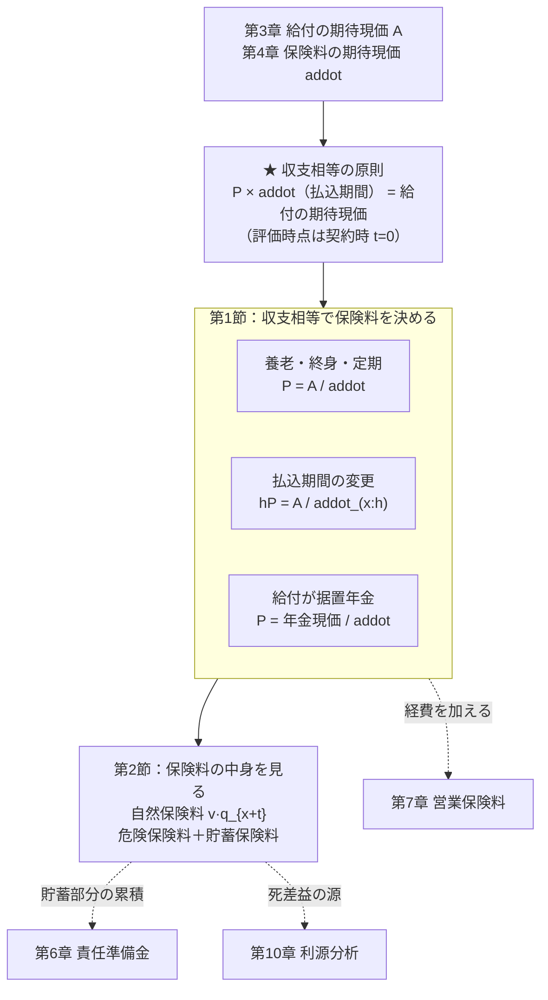
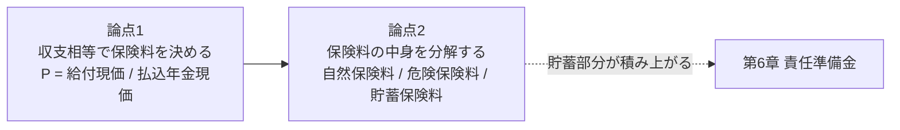
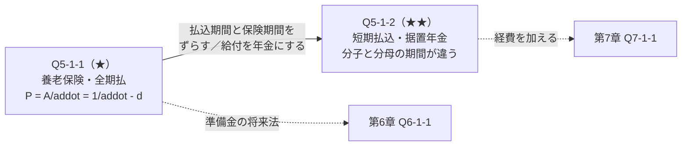
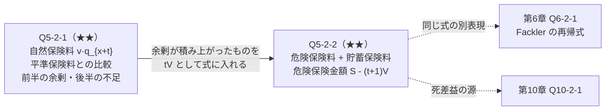
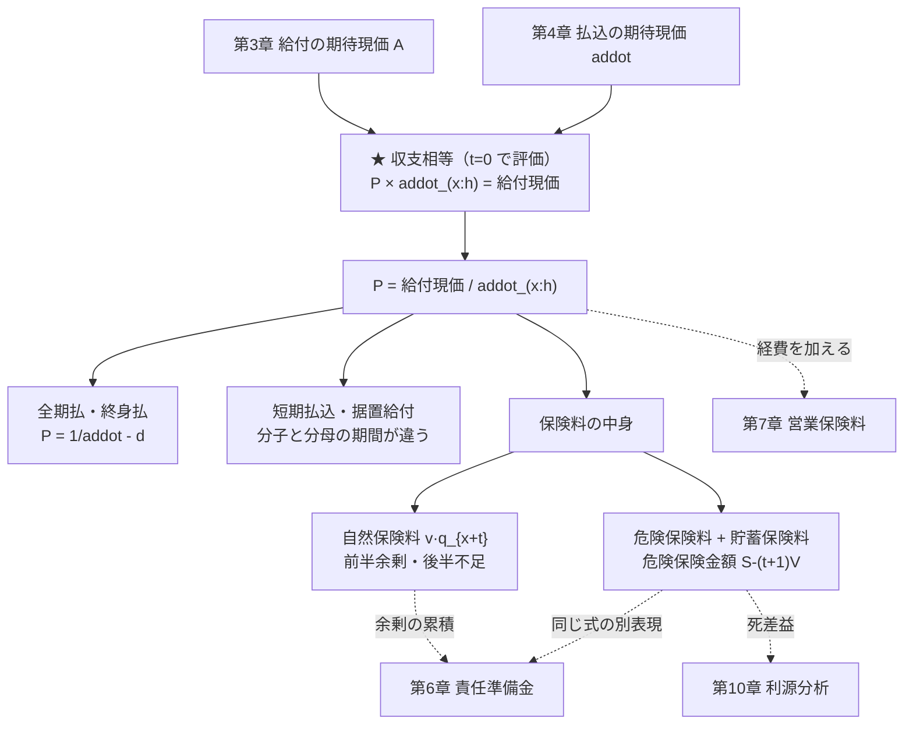
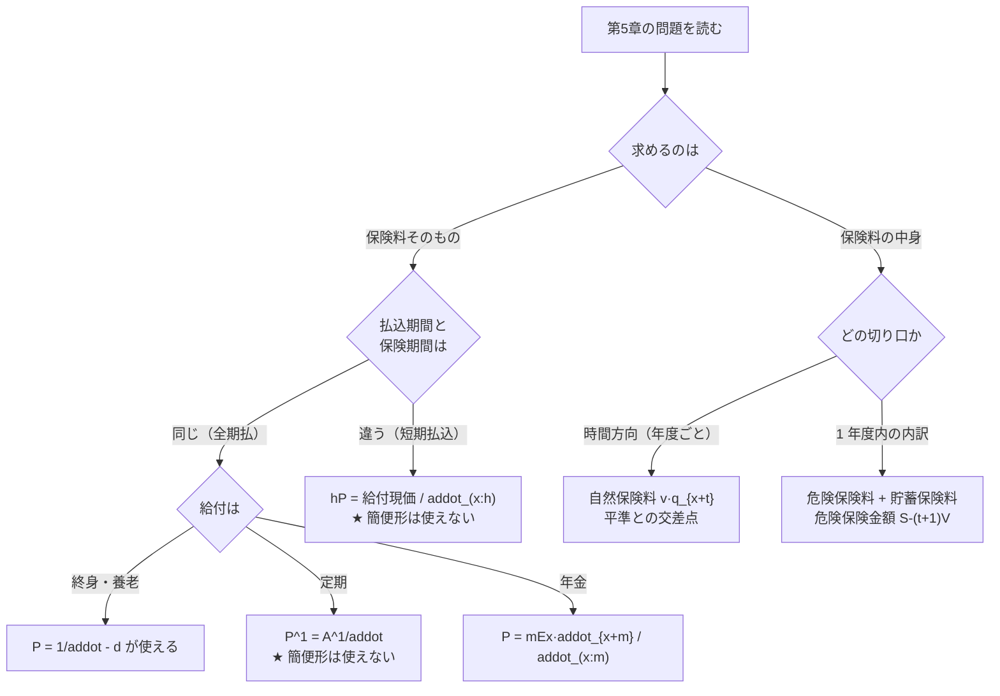

# 第5章　平準純保険料

> [← 第4章 生命年金](第04章_生命年金.md) ｜ **第5章** ｜ [第6章 責任準備金 →](第06章_責任準備金.md)

---

## 章の地図



**この図の読み方**：第5章に **新しい確率概念は登場しません**。
第3章で作った給付の期待現価を、第4章の年金で割るだけです。
新しいのは「**収支相等**」という等式の立て方だけです。

---

## この章で学ぶこと

第5章は **第4層＝契約の会計** の入口です。

第3章で「給付の期待現価（一時払純保険料）」を求めました。
しかし実際の契約では保険料を毎年分割して払い込みます。
その分割の仕方を決めるのが **収支相等の原則** です。

$$\underbrace{P\,\ddot a_{x:\overline{h}\vert}}_{\text{保険料の期待現価}}
=\underbrace{\text{給付の期待現価}}_{\text{第3章で計算済み}}$$

**両辺とも契約時点（$t=0$）で評価する** ことが絶対条件です。
評価時点がずれた等式を立てると、以降すべて誤ります。

---

## この章の全体像



```text
学習順序：
① 給付の期待現価を第3章の方法で求める     …… 分子
        ↓
② 払込の期待現価を第4章の方法で求める     …… 分母
        ↓
③ 収支相等の等式を立てて P について解く
        ↓
④ 払込期間と保険期間が違う場合を扱う
        ↓
⑤ 保険料が「毎年の死亡費用」とどう違うかを見る（自然保険料）
        ↓
⑥ 保険料を「危険部分」と「貯蓄部分」に分解する
```

---

## 最初に頭に入れるべきポイント

### 収支相等は「天秤」

```text
        契約時点 t = 0 で評価
                 │
     ┌───────────┴───────────┐
     │                       │
  保険料の期待現価        給付の期待現価
     │                       │
  P × addot_(x:h)         A_(x:n)
     │                       │
  ↑ 払込時点               ↑ 給付発生時点
  ↑ 生存条件               ↑ 死亡条件・生存条件
  ↑ 割引                   ↑ 割引
     │                       │
     └────── 等しい ─────────┘

  ⇒ P = A_(x:n) / addot_(x:h)
        ↑          ↑
     第3章      第4章
```

**分子と分母で期間が違うことがある**のが最大の注意点です。

| 契約 | 分子（給付） | 分母（払込） |
|---|---|---|
| 20年養老・20年払 | $A_{40:\overline{20}\vert}$ | $\ddot a_{40:\overline{20}\vert}$ |
| 20年養老・**10年**払 | $A_{40:\overline{20}\vert}$ | $\ddot a_{40:\overline{10}\vert}$ |
| 終身保険・**20年**払 | $A_{40}$ | $\ddot a_{40:\overline{20}\vert}$ |
| 据置年金・25年払 | ${}_{25}E_{40}\ddot a_{65}$ | $\ddot a_{40:\overline{25}\vert}$ |

**保険期間（給付）と払込期間は別物** です。問題文で必ず区別してください。

### $P=\dfrac{1}{\ddot a}-d$ という便利な形

養老保険・終身保険（**必ず $1$ が支払われる保険**）では、
$A=1-d\ddot a$（第3章）を代入すると

$$P_{x:\overline{n}\vert}=\frac{A_{x:\overline{n}\vert}}{\ddot a_{x:\overline{n}\vert}}
=\frac{1-d\,\ddot a_{x:\overline{n}\vert}}{\ddot a_{x:\overline{n}\vert}}
=\frac{1}{\ddot a_{x:\overline{n}\vert}}-d$$

**年金現価さえ分かれば保険料が出ます。**（定期保険には使えません。）

### 保険料は「毎年の死亡費用」とは違う

$t$ 年度に必要な死亡費用（**自然保険料**）は

$$P^{\text{nat}}_{x+t}=v\,q_{x+t}$$

これは年齢とともに **増加** します。一方、平準保険料 $P$ は一定です。

```text
保険料      ↑
            │            自然保険料 v·q_{x+t}（増加）
            │                          ／
            │                      ／
   平準 P   ├──────────────────／───────────  ← 一定
            │              ／  ↑
            │          ／      ここで交差
            │      ／
            │  ／
            └──────────────────────────→ t
              前半：P > 自然保険料      後半：P < 自然保険料
              （余剰が積み立てられる）  （積立を取り崩す）
                        ↓
                 ★ この積立が責任準備金（第6章）
```

**第6章の責任準備金は、この前半の余剰の累積** です。
第5章と第6章が直結していることが、この図から見えます。

---

## 基本記号・基本公式

| 記号 | 保険 | 公式 | 間違えやすい点 |
|---|---|---|---|
| $P_x$ | 終身・終身払 | $\dfrac{A_x}{\ddot a_x}=\dfrac{1}{\ddot a_x}-d$ | 分母は $\ddot a_x$（有期でない） |
| ${}_hP_x$ | 終身・$h$ 年払 | $\dfrac{A_x}{\ddot a_{x:\overline{h}\vert}}$ | 分子は終身、分母は有期 |
| $P^1_{x:\overline{n}\vert}$ | $n$ 年定期 | $\dfrac{A^1_{x:\overline{n}\vert}}{\ddot a_{x:\overline{n}\vert}}$ | $\frac{1}{\ddot a}-d$ は**使えない** |
| $P_{x:\overline{n}\vert}$ | $n$ 年養老 | $\dfrac{A_{x:\overline{n}\vert}}{\ddot a_{x:\overline{n}\vert}}=\dfrac{1}{\ddot a_{x:\overline{n}\vert}}-d$ | — |
| ${}_hP_{x:\overline{n}\vert}$ | $n$ 年養老・$h$ 年払 | $\dfrac{A_{x:\overline{n}\vert}}{\ddot a_{x:\overline{h}\vert}}$ | 分子と分母で期間が違う |
| $\bar P(\bar A_x)$ | 連続払・連続給付 | $\dfrac{\bar A_x}{\bar a_x}=\dfrac{1}{\bar a_x}-\delta$ | $\delta$ を使う |
| $P^{\text{nat}}_{x+t}$ | 自然保険料 | $v\,q_{x+t}$ | 年齢とともに増加 |

**保険料の分解**

$$P=\underbrace{P^{\text{risk}}_t}_{\text{危険保険料}}+\underbrace{P^{\text{sav}}_t}_{\text{貯蓄保険料}}$$

$$P^{\text{risk}}_t=v\,q_{x+t}\left(S-{}_{t+1}V\right),\qquad
P^{\text{sav}}_t=v\,{}_{t+1}V-{}_tV$$

$S-{}_{t+1}V$ を **危険保険金額**（net amount at risk）といいます（第6章 Q6-2-2）。

---

## 試験での主な問われ方

| 出題形態 | 典型的な問われ方 | 対応する問題 |
|---|---|---|
| 小問 | $A$ と $\ddot a$ から $P$ を計算 | Q5-1-1 |
| 小問 | $P=\frac{1}{\ddot a}-d$ の利用 | Q5-1-1 |
| 記述式 | 短期払込・据置給付の収支相等式を立てる | Q5-1-2 |
| 記述式 | 自然保険料と平準保険料の比較・交差時点 | Q5-2-1 |
| 記述式 | 保険料を危険部分と貯蓄部分に分解 | Q5-2-2 |
| 他章との複合 | 責任準備金（第6章）、営業保険料（第7章） | 全問 |

---

## 問題を見分けるためのサイン

| 問題文中の表現 | 判断すること |
|---|---|
| 「毎年初に平準保険料を払い込む」 | 分母は $\ddot a$（期始払） |
| 「保険料払込期間は $h$ 年」 | 分母は $\ddot a_{x:\overline{h}\vert}$ |
| 「保険期間は $n$ 年」 | 分子は $n$ 年分の給付 |
| 「全期払」「保険期間と同じ」 | $h=n$ |
| 「短期払込」「$h$ 年で払い済み」 | $h<n$。分子と分母で期間が違う |
| 「一時払」 | $P$ ではなく期待現価そのもの（第3章） |
| 「自然保険料」 | $v\,q_{x+t}$。毎年変わる |
| 「危険保険料」「貯蓄保険料」 | 保険料の分解（Q5-2-2） |
| 「収支相等の原則により」 | 契約時点で両辺を評価した等式を立てる |
| 「年金開始まで保険料を払い込む」 | 分子は年金現価、分母は据置期間の年金 |

**⚠ 特に注意すべき語**

* 「**払込期間**」と「**保険期間**」は別物です。一致するとは限りません。
* 「**平準**」は「毎年同額」の意味です。自然保険料は平準ではありません。
* 「**純**保険料」は経費を含みません。経費込みは営業保険料（第7章）です。

---

## この章の問題一覧

| ID | 表題 | 難 | 段階 | この問題の役割 |
|---|---|---|---|---|
| **第1節　収支相等の原則** | | | | |
| Q5-1-1 | 養老保険の年払純保険料 | ★ | ① | 収支相等の基本形。$P=\frac{1}{\ddot a}-d$ の導出 |
| Q5-1-2 | 短期払込・据置給付の収支相等 | ★★ | ③ | 分子と分母で期間が違う場合 |
| **第2節　自然保険料と保険料の分解** | | | | |
| Q5-2-1 | 自然保険料と平準保険料の比較 | ★★ | ③ | 平準化の意味。第6章への橋 |
| Q5-2-2 | 危険保険料と貯蓄保険料への分解 | ★★ | ④ | 保険料の内訳。Fackler の再帰式と表裏 |

---
---

# 第1節　収支相等の原則

## この節のテーマ

**契約時点で「保険料の期待現価＝給付の期待現価」とおいて保険料を決める技術** を扱います。

## この節でできるようになること

* 収支相等の等式を、評価時点を揃えて正しく立てられる
* 保険期間と払込期間が異なる場合に、分子と分母を正しく設定できる
* $P=\dfrac{1}{\ddot a}-d$ を導き、使える場合と使えない場合を判別できる
* 給付が年金である場合（据置年金）の保険料を求められる

## 頭に入れるべきポイント

### 立式の3ステップ

```text
① 分子：給付の期待現価を第3章の方法で求める
   ├─ 死亡給付 → A^1、A_x
   ├─ 生存給付 → nEx
   └─ 年金給付 → mEx · addot_{x+m}
        ↓
② 分母：保険料の期待現価（1 単位あたり）を第4章の方法で求める
   └─ 毎年初に払込 → addot_(x:h)      ★ h は払込期間
        ↓
③ P = ① ÷ ②
```

**分子と分母の期間が違うことに注意**してください。
「20年養老保険を10年で払い済み」なら
分子は $A_{40:\overline{20}\vert}$、分母は $\ddot a_{40:\overline{10}\vert}$ です。

### $P=\dfrac{1}{\ddot a}-d$ が使えるのは「必ず $1$ が支払われる」保険だけ

| 保険 | $\frac{1}{\ddot a}-d$ | 理由 |
|---|---|---|
| 終身保険（終身払） | **使える** | $A_x=1-d\ddot a_x$ |
| 養老保険（全期払） | **使える** | $A_{x:\overline{n}\vert}=1-d\ddot a_{x:\overline{n}\vert}$ |
| 定期保険 | 使えない | $A^1\ne1-d\ddot a$ |
| 短期払込 | 使えない | 分子と分母の期間が違う |

**「分子の関係式が使えて、かつ分母が同じ年金」のときだけ** 成立します。

## 使用する記号・公式

| 記号 | 公式 |
|---|---|
| 収支相等 | $P\,\ddot a_{x:\overline{h}\vert}=(\text{給付の期待現価})$ |
| 終身・終身払 | $P_x=\dfrac{A_x}{\ddot a_x}=\dfrac{1}{\ddot a_x}-d$ |
| 養老・全期払 | $P_{x:\overline{n}\vert}=\dfrac{A_{x:\overline{n}\vert}}{\ddot a_{x:\overline{n}\vert}}=\dfrac{1}{\ddot a_{x:\overline{n}\vert}}-d$ |
| 養老・$h$ 年払 | ${}_hP_{x:\overline{n}\vert}=\dfrac{A_{x:\overline{n}\vert}}{\ddot a_{x:\overline{h}\vert}}$ |
| 定期 | $P^1_{x:\overline{n}\vert}=\dfrac{A^1_{x:\overline{n}\vert}}{\ddot a_{x:\overline{n}\vert}}$ |
| 据置年金 | $P=\dfrac{{}_mE_x\,\ddot a_{x+m}}{\ddot a_{x:\overline{m}\vert}}$ |

## 基本的な解法パターン

```text
① 給付を列挙する（死亡給付 / 生存給付 / 年金給付）
        ↓
② 時間軸に「給付発生時点」と「保険料払込時点」を別の行で描く
        ↓
③ 分子＝給付の期待現価（第3章）
        ↓
④ 分母＝払込期間の期始払年金（第4章）
        ↓
⑤ 割る
        ↓
⑥ 検算：
   ・払込期間が短いほど P は大きい
   ・P < 1（保険金額 1 に対して）
   ・全期払なら P = 1/addot - d と一致するか
```

## 間違えやすい点

| 誤り | 内容 | 防ぎ方 |
|---|---|---|
| 分母の期間 | 保険期間を使ってしまう | **払込期間**を使う |
| 評価時点のずれ | 給付を時点 $n$、保険料を時点 $0$ で評価 | 両辺とも $t=0$ |
| 定期保険に $\frac1{\ddot a}-d$ | — | 終身・養老のみ |
| 短期払込に $\frac1{\ddot a}-d$ | — | 分子と分母の期間が違うので不可 |
| 期末払と混同 | 分母に $a$ を使う | 「毎年初」なら $\ddot a$ |

## この節の問題の流れ



---
---

## 問題 Q5-1-1　養老保険の年払純保険料

| 項目 | 内容 |
|---|---|
| 出題年度 | `要照合`（記入欄：______年度） |
| 問題番号 | `要照合`（記入欄：問題___） |
| 分野・論点 | 保険料 ／ 収支相等の原則 |
| 難易度 | ★ |
| この節での位置づけ | 段階①（定義を直接使う）。本章の基準となる問題 |
| 関連する問題 | 発展元：Q3-1-1、Q4-1-2 ／ 本問 ／ 後続：Q5-1-2、Q6-1-1（同じ契約の責任準備金） |

### ■ この問題で押さえるべきポイント

#### ① 何を問う問題か

**収支相等の原則により、養老保険の年払純保険料を求めさせる問題** です。
併せて $P=\dfrac{1}{\ddot a}-d$ を導出させ、
その式が **定期保険には使えない** ことを確認させます。

#### ② 問題文から読み取るべき条件

| 条件 | 解法への影響 |
|---|---|
| 「40歳、保険期間20年」 | 分子は $A_{40:\overline{20}\vert}$ |
| 「保険料払込期間20年」 | 分母は $\ddot a_{40:\overline{20}\vert}$（**全期払**） |
| 「毎年初に」 | 期始払 $\ddot a$ |
| 「死亡年度末または満期に保険金1」 | 養老保険 |
| 「純保険料」 | 経費を含まない |

#### ③ 最初に注目する場所

**保険期間と払込期間が一致しているか**。
一致していれば $P=\frac{1}{\ddot a}-d$ が使え、
一致していなければ分子と分母を別々に求める必要があります。

#### ④ 呼び出すべき知識

| 知識 | なぜこの問題で使うか |
|---|---|
| 収支相等：$P\ddot a=A$ | 立式の原理 |
| $A_{x:\overline{n}\vert}=1-d\,\ddot a_{x:\overline{n}\vert}$ | $P=\frac{1}{\ddot a}-d$ の導出（第3章 Q3-1-2） |
| $A_{x:\overline{n}\vert}=A^1_{x:\overline{n}\vert}+{}_nE_x$ | 給付の分解 |
| $P^1_{x:\overline{n}\vert}=\frac{A^1}{\ddot a}$ | 定期保険との比較 |

#### ⑤ 解法の骨格

```text
1. 給付の期待現価（分子）を確認する
2. 払込の期待現価（分母）を確認する
3. 割る
4. P = 1/addot - d でも計算して一致を確認
5. 定期保険では成り立たないことを確認
```

#### ⑥ 間違えやすい点

* 分母に保険期間を使う（払込期間が違う場合）
* 定期保険に $\frac{1}{\ddot a}-d$ を適用する
* 期末払の $a$ を使う
* 保険金額が $S$ のとき $P$ を $S$ 倍し忘れる

#### ⑦ この問題を一言で捉えると

> **「給付の期待現価 ÷ 払込の期待現価」。第3章 ÷ 第4章。それだけの問題。**

### ■ 問題の構造図

```text
収支相等の天秤（x = 40, n = 20, 全期払）：

時点       0    1    2   ...   19    20
           |----|----|--...---|-----|
年齢      40   41   42  ...   59    60

保険料 P   ^P   ^P   ^P  ...   ^P            ← t = 0..19（20 回、生存中）
           └──── P × addot_(40:20) ────┘
                  = P × 15.041461

死亡給付        v1   v1  ...   v1    v1      ← 死亡年度末（20 年以内）
満期給付                            v1       ← 20 年生存
           └──── A_(40:20) = 0.561899 ────┘

評価時点   *（両辺とも t = 0 で評価）

  ⇒ P × 15.041461 = 0.561899
    P = 0.561899 / 15.041461 = 0.037357


給付の内訳：

   A_(40:20)  =  A^1_(40:20)  +   20E40
   0.561899   =   0.040461    +  0.521439
                    7.2%          92.8%
                  死亡給付       満期保険金
```

### ■ 問題

年利率 $i=0.03$ とし、次の値が与えられている。

$$A_{40:\overline{20}\vert}=0.561899,\qquad A^1_{40:\overline{20}\vert}=0.040461,\qquad
{}_{20}E_{40}=0.521439,\qquad \ddot a_{40:\overline{20}\vert}=15.041461$$

40歳の被保険者、保険期間20年、保険金額1の養老保険
（保険期間中に死亡した場合は死亡年度末に、20年生存した場合は満期時に保険金1を支払う）
について、保険料は毎年初に20年間払い込むものとする。

**(1)** 収支相等の原則により、年払純保険料 $P_{40:\overline{20}\vert}$ を求めよ（小数第6位まで）。

**(2)** $P_{x:\overline{n}\vert}=\dfrac{1}{\ddot a_{x:\overline{n}\vert}}-d$ が成り立つことを示し、
数値で (1) と一致することを確認せよ。

**(3)** 同じ被保険者・同じ期間の定期保険（満期給付なし）の年払純保険料
$P^1_{40:\overline{20}\vert}$ を求めよ（小数第7位まで）。

**(4)** (2) の式が定期保険には成り立たないことを、数値で示せ。

**(5)** 保険金額が1000万円の場合の年払純保険料を求めよ。

> 本問は再現題です。原文の出題年度・問題番号は未照合です。

### ■ 問題文を数理モデルへ変換

| 確認項目 | 問題文から読み取れる内容 | 数理的な表現 |
|---|---|---|
| 被保険者 | 40歳 | $x=40$ |
| 保険期間 | 20年 | $n=20$ |
| 払込期間 | 20年（毎年初） | $h=20$、分母 $\ddot a_{40:\overline{20}\vert}$ |
| 死亡給付 | 死亡年度末に1 | $A^1_{40:\overline{20}\vert}$ |
| 満期給付 | 20年生存時に1 | ${}_{20}E_{40}$ |
| 求める量 | 年払純保険料 | $P=\dfrac{A_{40:\overline{20}\vert}}{\ddot a_{40:\overline{20}\vert}}$ |

### ■ 解法フロー

```text
STEP 1　(1) 収支相等の等式を立てて P を求める
STEP 2　(2) A = 1 - d·addot を代入して別形を導き、数値で確認
STEP 3　(3) 定期保険の保険料を求める
STEP 4　(4) 別形が定期保険に使えないことを数値で示す
STEP 5　(5) 保険金額を掛ける
```

### ■ 詳細解説

#### STEP 1　(1) 収支相等

*目的：契約時点で両辺を評価した等式を立てる。*

**保険料の期待現価**：毎年初（$t=0,\dots,19$）に、生存している場合に $P$ を払い込みます。

$$P\times\ddot a_{40:\overline{20}\vert}=P\times15.041461$$

**給付の期待現価**：死亡給付と満期給付の合計です。

$$A_{40:\overline{20}\vert}=0.561899$$

収支相等の原則により両者を等しくおきます。

$$P\times15.041461=0.561899$$

$$P_{40:\overline{20}\vert}=\frac{0.561899}{15.041461}=0.037357$$

$$\boxed{P_{40:\overline{20}\vert}=0.037357}$$

**妥当性**：保険金額 $1$ に対し年払保険料が $0.037357$、
20年間で総額 $0.037357\times20=0.747$ を払い込みます。
保険金 $1$ より少ないのは、**利息が付くから** です。✓

#### STEP 2　(2) $P=\dfrac{1}{\ddot a}-d$ の導出

*目的：養老保険特有の簡便形を導く。*

第3章 Q3-1-2 の関係式 $A_{x:\overline{n}\vert}=1-d\,\ddot a_{x:\overline{n}\vert}$ を
分子に代入します。

$$P_{x:\overline{n}\vert}=\frac{A_{x:\overline{n}\vert}}{\ddot a_{x:\overline{n}\vert}}
=\frac{1-d\,\ddot a_{x:\overline{n}\vert}}{\ddot a_{x:\overline{n}\vert}}
=\frac{1}{\ddot a_{x:\overline{n}\vert}}-\frac{d\,\ddot a_{x:\overline{n}\vert}}{\ddot a_{x:\overline{n}\vert}}$$

$$\boxed{P_{x:\overline{n}\vert}=\frac{1}{\ddot a_{x:\overline{n}\vert}}-d}$$

□

**数値による確認**

$$d=\frac{0.03}{1.03}=0.0291262$$

$$\frac{1}{15.041461}-0.0291262=0.0664830-0.0291262=0.0373568$$

(1) の $0.037357$ と一致します。✓

```text
式の意味：

   P = 1/addot  -  d
       |            |
       |            └─ 利息分（保険会社が運用で得る分）
       └─ 「addot 年分に分割して払う」ための単位あたり額

  ★ 年金現価さえ分かれば、保険料が即座に出る
    （A を経由する必要がない）
```

**⚠ 成立条件**：この式は
「$A=1-d\ddot a$ が成り立つ」かつ「分母が同じ $\ddot a$」のときだけ有効です。
すなわち **終身保険（終身払）と養老保険（全期払）** に限られます。

#### STEP 3　(3) 定期保険の保険料

*目的：分子を死亡給付だけにする。*

$$P^1_{40:\overline{20}\vert}=\frac{A^1_{40:\overline{20}\vert}}{\ddot a_{40:\overline{20}\vert}}
=\frac{0.040461}{15.041461}=0.0026899$$

$$\boxed{P^1_{40:\overline{20}\vert}=0.0026899}$$

**養老保険との比較**

$$\frac{P^1_{40:\overline{20}\vert}}{P_{40:\overline{20}\vert}}
=\frac{0.0026899}{0.037357}=0.0720$$

定期保険の保険料は養老保険の **約 $7.2\%$** にすぎません。
これは給付の内訳（死亡給付 $7.2\%$、満期保険金 $92.8\%$）に対応しています。

**差の意味**

$$P_{40:\overline{20}\vert}-P^1_{40:\overline{20}\vert}=0.037357-0.002690=0.034667$$

この差は「満期保険金 ${}_{20}E_{40}$ を積み立てるための保険料」です。

$$\frac{{}_{20}E_{40}}{\ddot a_{40:\overline{20}\vert}}=\frac{0.521439}{15.041461}=0.034667\quad\checkmark$$

#### STEP 4　(4) 定期保険では成り立たない

*目的：適用範囲を数値で確認する。*

もし定期保険に $\dfrac{1}{\ddot a}-d$ を適用すると

$$\frac{1}{15.041461}-0.0291262=0.0373568$$

これは実際の $P^1_{40:\overline{20}\vert}=0.0026899$ とはまったく異なります。

**差の正体**

$$0.0373568-0.0026899=0.0346669=\frac{{}_{20}E_{40}}{\ddot a_{40:\overline{20}\vert}}$$

すなわち **満期保険金の分だけ過大** になっています。

**理由**：$\dfrac{1}{\ddot a}-d$ は $A=1-d\ddot a$（＝必ず $1$ が支払われる）を前提としますが、
定期保険では $A^1=1-d\ddot a-{}_nE_x$ であり、${}_nE_x$ の分だけずれるためです。

$$P^1_{x:\overline{n}\vert}=\frac{1-d\ddot a_{x:\overline{n}\vert}-{}_nE_x}{\ddot a_{x:\overline{n}\vert}}
=\frac{1}{\ddot a_{x:\overline{n}\vert}}-d-\frac{{}_nE_x}{\ddot a_{x:\overline{n}\vert}}$$

#### STEP 5　(5) 保険金額1000万円

*目的：保険金額 $S$ への一般化。*

保険金額が $S$ なら、給付の期待現価が $S$ 倍になるので保険料も $S$ 倍です。

$$1000\times0.037357=37.357$$

$$\boxed{\text{年払純保険料}=37.36\ \text{万円}}$$

**確認**：20年間の払込総額は $37.357\times20=747.1$ 万円で、
保険金1000万円より少なくなっています（利息の効果）。✓

### ■ 答え

| 設問 | 量 | 値 |
|---|---|---|
| (1) | $P_{40:\overline{20}\vert}$ | $0.037357$ |
| (3) | $P^1_{40:\overline{20}\vert}$ | $0.0026899$ |
| (5) | 保険金額1000万円の年払純保険料 | $37.36$ 万円 |

**(2)** $A_{x:\overline{n}\vert}=1-d\ddot a_{x:\overline{n}\vert}$ より
$P_{x:\overline{n}\vert}=\dfrac{1-d\ddot a_{x:\overline{n}\vert}}{\ddot a_{x:\overline{n}\vert}}
=\dfrac{1}{\ddot a_{x:\overline{n}\vert}}-d$。
数値では $\dfrac{1}{15.041461}-0.0291262=0.037357$ で (1) に一致する。

**(4)** 定期保険に適用すると $0.0373568$ となるが実際は $0.0026899$ であり一致しない。
差 $0.0346669$ は $\dfrac{{}_{20}E_{40}}{\ddot a_{40:\overline{20}\vert}}$ に等しく、
満期保険金の分だけ過大になっている。
$A^1_{x:\overline{n}\vert}=1-d\ddot a_{x:\overline{n}\vert}-{}_nE_x$ であることによる。

### ■ 試験答案としての書き方

> **(1)** 収支相等の原則より、契約時点において
> $P\,\ddot a_{40:\overline{20}\vert}=A_{40:\overline{20}\vert}$
> $\therefore P_{40:\overline{20}\vert}=\dfrac{0.561899}{15.041461}=0.037357$
>
> **(2)** $A_{x:\overline{n}\vert}=1-d\,\ddot a_{x:\overline{n}\vert}$ を代入すると
> $P_{x:\overline{n}\vert}=\dfrac{1-d\ddot a_{x:\overline{n}\vert}}{\ddot a_{x:\overline{n}\vert}}
> =\dfrac{1}{\ddot a_{x:\overline{n}\vert}}-d$
> $d=\dfrac{0.03}{1.03}=0.0291262$ より
> $\dfrac{1}{15.041461}-0.0291262=0.0664830-0.0291262=0.037357$（(1) に一致）
>
> **(3)** $P^1_{40:\overline{20}\vert}=\dfrac{A^1_{40:\overline{20}\vert}}{\ddot a_{40:\overline{20}\vert}}
> =\dfrac{0.040461}{15.041461}=0.0026899$
>
> **(4)** $\dfrac{1}{\ddot a_{40:\overline{20}\vert}}-d=0.0373568\ne0.0026899$。
> 差 $0.0346669=\dfrac{{}_{20}E_{40}}{\ddot a_{40:\overline{20}\vert}}
> =\dfrac{0.521439}{15.041461}$ である。
> これは $A^1_{x:\overline{n}\vert}=1-d\ddot a_{x:\overline{n}\vert}-{}_nE_x$ により、
> $\frac{1}{\ddot a}-d$ が満期保険金を含んだ養老保険の保険料になっているためである。
>
> **(5)** $1000\times0.037357=37.36$（万円）

### ■ 解答後に確認すること

| 項目 | 内容 |
|---|---|
| **最も重要なポイント** | 収支相等は **契約時点で両辺を評価** した等式。$P=\dfrac{\text{給付現価}}{\text{払込年金現価}}$。第3章 ÷ 第4章 |
| **最初に気づくべきだった条件** | 保険期間と払込期間がともに20年（全期払）。だから $\frac{1}{\ddot a}-d$ が使える |
| **他の問題にも使える考え方** | ① $P=\frac{1}{\ddot a}-d$ は「必ず $1$ が支払われる保険」のみ。② 給付を分解すれば保険料も分解できる（$P=P^1+\frac{{}_nE_x}{\ddot a}$）。③ 保険金額 $S$ なら $P$ も $S$ 倍 |
| **類似問題との違い** | Q5-1-2 は払込期間 $\ne$ 保険期間、または給付が年金。本問は最も単純な全期払 |
| **条件が変わった場合** | ① 短期払込なら分母が $\ddot a_{x:\overline{h}\vert}$ になり $P$ は大きくなる。② 連続なら $\bar P=\frac{1}{\bar a}-\delta$。③ 年 $m$ 回払なら分母が $\ddot a^{(m)}$ |
| **復習時に思い出すこと** | $P=\dfrac{A}{\ddot a}$、養老・終身なら $=\dfrac{1}{\ddot a}-d$ |

---
---

## 問題 Q5-1-2　短期払込・据置給付の収支相等

| 項目 | 内容 |
|---|---|
| 出題年度 | `要照合`（記入欄：______年度） |
| 問題番号 | `要照合`（記入欄：問題___） |
| 分野・論点 | 保険料 ／ 払込期間の変更・年金給付 |
| 難易度 | ★★ |
| この節での位置づけ | 段階③（複数の論点を組み合わせる）。分子と分母の期間が異なる場合 |
| 関連する問題 | 発展元：Q5-1-1、Q4-2-1（据置年金） ／ 本問 ／ 後続：Q6-1-1、Q7-3-1（払済保険） |

### ■ この問題で押さえるべきポイント

#### ① 何を問う問題か

**保険期間と払込期間が異なる場合**、および **給付が年金である場合** の保険料を求めさせる問題です。

本質は **「分子と分母は独立に決まる」** ことの理解です。
分子は給付、分母は払込で、両者の期間が一致する必然性はありません。

#### ② 問題文から読み取るべき条件

| 条件 | 解法への影響 |
|---|---|
| 「保険期間20年、払込期間10年」 | 分子 $A_{40:\overline{20}\vert}$、分母 $\ddot a_{40:\overline{10}\vert}$ |
| 「10年で払い済み」 | 同上。$h=10<n=20$ |
| 「65歳から終身年金」 | 分子は ${}_{25}E_{40}\,\ddot a_{65}$ |
| 「65歳まで保険料を払い込む」 | 分母は $\ddot a_{40:\overline{25}\vert}$ |

#### ③ 最初に注目する場所

**「給付は何か」と「保険料はいつまで払うか」を別々に読み取る**。
この2つを混同すると立式を誤ります。

#### ④ 呼び出すべき知識

| 知識 | なぜこの問題で使うか |
|---|---|
| 収支相等 | 立式の原理 |
| ${}_hP_{x:\overline{n}\vert}=\dfrac{A_{x:\overline{n}\vert}}{\ddot a_{x:\overline{h}\vert}}$ | 短期払込 |
| ${}_{m\vert}\ddot a_x={}_mE_x\ddot a_{x+m}$ | 据置年金の給付現価（Q4-2-1） |
| $\ddot a_{x:\overline{h}\vert}<\ddot a_{x:\overline{n}\vert}$（$h<n$） | 短期払込の方が保険料が高い理由 |

#### ⑤ 解法の骨格

```text
1. 時間軸を 2 段（給付／保険料）に分けて描く
2. 分子＝給付の期待現価（期間は保険期間）
3. 分母＝払込の期待現価（期間は払込期間）★ 別物
4. 割る
5. 全期払の場合と比較して、比率が妥当か確認
```

#### ⑥ 間違えやすい点

* 分母に保険期間を使う
* 据置年金の給付で年齢を $x$ のままにする（$x+m$）
* 払込期間を「$65$ 歳まで」＝ $65$ 年と誤読（$65-40=25$ 年）
* 短期払込に $\frac{1}{\ddot a}-d$ を適用する

#### ⑦ この問題を一言で捉えると

> **「分子は給付、分母は払込」— 両者の期間は独立に決まる。**

### ■ 問題の構造図

```text
【ケース1】20 年養老保険・10 年払込

時点       0    ...    9    10   ...   19    20
           |---...----|----|---...----|-----|
年齢      40   ...    49   50   ...   59    60

保険料 P   ^P   ...    ^P                       ← ★ t = 0..9（10 回だけ）
           └── P × addot_(40:10) = P × 8.722037 ──┘

死亡給付        v1  ...  v1   v1   ...   v1     ← 20 年間ずっと
満期給付                                  v1
           └──── A_(40:20) = 0.561899 ────┘

  ⇒ 払込は 10 年で終わるが、保障は 20 年続く
    → 分母が小さくなる → 保険料は高くなる


【ケース2】25 年据置終身年金・25 年払込

時点       0                     25                    →
           |----------------------|---------------------
年齢      40                     65

保険料 P   ^P  ^P  ...  ^P                              ← t = 0..24
           └── P × addot_(40:25) = P × 17.468284 ──┘

年金給付                          ^1  ^1  ^1  ...       ← 65 歳から終身
           └── 25E40 · addot_65 = 6.551777 ──┘

  ⇒ 給付は年金、保険料は据置期間中のみ
```

### ■ 問題

年利率 $i=0.03$ とし、次の値が与えられている。

$$A_{40:\overline{20}\vert}=0.561899,\qquad
\ddot a_{40:\overline{20}\vert}=15.041461,\qquad
\ddot a_{40:\overline{10}\vert}=8.722037$$

$$\ddot a_{40:\overline{25}\vert}=17.468284,\qquad
{}_{25}E_{40}=0.4328522,\qquad \ddot a_{65}=15.136291$$

**(1)** 40歳、保険期間20年、保険金額1の養老保険について、
保険料を毎年初に **10年間** 払い込む場合の年払純保険料 ${}_{10}P_{40:\overline{20}\vert}$
を求めよ（小数第6位まで）。

**(2)** (1) の値を、全期払（20年払込）の場合の $P_{40:\overline{20}\vert}=0.037357$ と比較し、
比を求めて意味を述べよ。

**(3)** 40歳の被保険者が、65歳から生存している限り毎年初に年額1の年金を受け取る契約
（25年据置終身年金）について、保険料を毎年初に **65歳になるまで（25年間）** 払い込む場合の
年払純保険料を求めよ（小数第6位まで）。

**(4)** (3) の契約で、年金額が年額120万円のときの年払保険料を求めよ。

**(5)** (1) の契約に $P=\dfrac{1}{\ddot a_{40:\overline{10}\vert}}-d$ を適用すると
誤りであることを、数値で示せ。

> 本問は再現題です。原文の出題年度・問題番号は未照合です。

### ■ 問題文を数理モデルへ変換

| 確認項目 | 問題文から読み取れる内容 | 数理的な表現 |
|---|---|---|
| (1) 給付 | 20年養老保険 | 分子 $A_{40:\overline{20}\vert}=0.561899$ |
| (1) 払込 | 毎年初、10年間 | 分母 $\ddot a_{40:\overline{10}\vert}=8.722037$ |
| (3) 給付 | 65歳から終身年金 | 分子 ${}_{25}E_{40}\ddot a_{65}$ |
| (3) 払込 | 毎年初、65歳まで（25年） | 分母 $\ddot a_{40:\overline{25}\vert}$ |
| (4) 年金額 | 年額120万円 | 保険料も $120$ 倍 |

### ■ 解法フロー

```text
STEP 1　(1) 分子と分母を別々に確認して割る
STEP 2　(2) 全期払と比較する
STEP 3　(3) 給付が年金の場合の分子を作る
STEP 4　(4) 年金額を掛ける
STEP 5　(5) 簡便形が使えない理由を数値で示す
```

### ■ 詳細解説

#### STEP 1　(1) 短期払込の保険料

*目的：分子と分母の期間が違う場合の立式。*

**分子（給付の期待現価）**：保険期間は20年なので

$$A_{40:\overline{20}\vert}=0.561899$$

**分母（払込の期待現価）**：払込期間は10年なので

$$\ddot a_{40:\overline{10}\vert}=8.722037$$

**⚠ 分母が $\ddot a_{40:\overline{20}\vert}$ ではない** ことに注意してください。
保険料は最初の10年しか払い込まないので、
払込の期待現価は10年分の年金現価です。

収支相等より

$$_{10}P_{40:\overline{20}\vert}=\frac{A_{40:\overline{20}\vert}}{\ddot a_{40:\overline{10}\vert}}
=\frac{0.561899}{8.722037}=0.064423$$

$$\boxed{{}_{10}P_{40:\overline{20}\vert}=0.064423}$$

#### STEP 2　(2) 全期払との比較

*目的：短期払込で保険料が上がる理由を確認する。*

$$\frac{{}_{10}P_{40:\overline{20}\vert}}{P_{40:\overline{20}\vert}}
=\frac{0.064423}{0.037357}=1.7245$$

$$\boxed{\text{比}=1.7245}$$

**意味**：10年払込の保険料は20年払込の **約 $1.72$ 倍** です。

**なぜ $2$ 倍ではないのか**

```text
   払込回数だけ見れば 20 回 → 10 回で「2 倍になりそう」だが、実際は 1.72 倍。

   理由：年金現価の比を見る
       addot_(40:20) / addot_(40:10) = 15.041461 / 8.722037 = 1.7245

   後半 10 年分の年金現価は
       15.041461 - 8.722037 = 6.319424
   であり、前半 10 年分 8.722037 より小さい。
       ↓
   後半の払込は「割引が強く」「生存確率も低い」ため、
   1 回あたりの価値が小さい
       ↓
   前半 10 年に集約しても、2 倍まではいかない
```

**同じ給付に対し、払込期間を短くすると保険料が上がる**のは当然ですが、
上がり方は払込回数の比（$2$ 倍）ではなく **年金現価の比**（$1.72$ 倍）です。

#### STEP 3　(3) 給付が年金の場合

*目的：分子を年金現価にする。*

**分子（給付の期待現価）**：65歳から終身の年金なので、25年据置終身年金です（Q4-2-1）。

$$_{25\vert}\ddot a_{40}={}_{25}E_{40}\times\ddot a_{65}=0.4328522\times15.136291=6.551777$$

**分母（払込の期待現価）**：65歳になるまで、すなわち $40$ 歳から $25$ 年間です。

$$\ddot a_{40:\overline{25}\vert}=17.468284$$

**⚠ 払込期間は $25$ 年** です（$65-40=25$）。$65$ 年ではありません。

収支相等より

$$P=\frac{{}_{25}E_{40}\,\ddot a_{65}}{\ddot a_{40:\overline{25}\vert}}
=\frac{6.551777}{17.468284}=0.375067$$

$$\boxed{P=0.375067}$$

```text
式の構造：

   P  =   25E40 × addot_65    /    addot_(40:25)
              |                        |
              └─ 分子：65 歳から       └─ 分母：40〜65 歳の
                 受け取る年金の現価        払込の現価
                 （第4章 据置年金）        （第4章 有期年金）
```

**妥当性**：年額 $1$ の終身年金を受け取るために、
25年間毎年 $0.375$ を払い込むということです。
払込総額は $0.375067\times25=9.377$ で、
年金の給付現価 $6.552$（時点0での価値）より大きくなっています。
これは **払込も割り引かれる** ためで、矛盾しません。✓

#### STEP 4　(4) 年金額120万円

$$120\times0.375067=45.008$$

$$\boxed{\text{年払保険料}=45.01\ \text{万円}}$$

**確認**：25年間で総額 $45.008\times25=1125.2$ 万円を払い込み、
65歳から年額120万円を終身で受け取ります。
$1125.2/120=9.4$ 年分に相当し、
$65$ 歳の平均余命（本書の基礎率で約 $20$ 年）より短いので、
受取総額の方が大きくなります（利息と死亡による調整を除けば）。

#### STEP 5　(5) 簡便形が使えない理由

*目的：$\frac{1}{\ddot a}-d$ の適用範囲を確認する。*

もし適用すると

$$\frac{1}{\ddot a_{40:\overline{10}\vert}}-d=\frac{1}{8.722037}-0.0291262
=0.1146519-0.0291262=0.0855257$$

実際の ${}_{10}P_{40:\overline{20}\vert}=0.064423$ とはまったく異なります。

**理由**：$\dfrac{1}{\ddot a}-d$ は

$$\frac{A_{x:\overline{n}\vert}}{\ddot a_{x:\overline{n}\vert}}
=\frac{1-d\ddot a_{x:\overline{n}\vert}}{\ddot a_{x:\overline{n}\vert}}$$

という変形から出ており、**分子と分母の年金が同じ $\ddot a_{x:\overline{n}\vert}$** であることが必要です。

本問では分子が $A_{40:\overline{20}\vert}=1-d\,\ddot a_{40:\overline{20}\vert}$ で
$\ddot a_{40:\overline{20}\vert}$ を含むのに対し、分母は $\ddot a_{40:\overline{10}\vert}$ です。
**両者が異なるため約分できません。**

正しくは

$$_{10}P_{40:\overline{20}\vert}=\frac{1-d\,\ddot a_{40:\overline{20}\vert}}{\ddot a_{40:\overline{10}\vert}}
=\frac{1-0.0291262\times15.041461}{8.722037}=\frac{0.561899}{8.722037}=0.064423\quad\checkmark$$

計算した $0.0855257$ は、実は
「10年養老保険を10年払込にした場合の保険料」$P_{40:\overline{10}\vert}$ に相当します
（分子・分母がともに10年の場合）。**まったく別の商品の保険料** です。

### ■ 答え

| 設問 | 量 | 値 |
|---|---|---|
| (1) | ${}_{10}P_{40:\overline{20}\vert}$ | $0.064423$ |
| (2) | 全期払との比 | $1.7245$ |
| (3) | 据置年金の年払保険料 | $0.375067$ |
| (4) | 年金額120万円の場合 | $45.01$ 万円 |

**(2) の意味**：10年払込は20年払込の約 $1.72$ 倍。
これは払込回数の比 $2$ 倍ではなく **年金現価の比**
$\dfrac{\ddot a_{40:\overline{20}\vert}}{\ddot a_{40:\overline{10}\vert}}
=\dfrac{15.041461}{8.722037}=1.7245$ である。
後半10年の払込は割引が強く生存確率も低いため、1回あたりの価値が小さいことによる。

**(5)** $\dfrac{1}{\ddot a_{40:\overline{10}\vert}}-d=0.0855257$ となり
実際の $0.064423$ と一致しない。
$\dfrac{1}{\ddot a}-d$ は分子の $A=1-d\ddot a$ に現れる年金と
分母の年金が同一である場合にのみ成立するが、
本問では分子が $\ddot a_{40:\overline{20}\vert}$、分母が $\ddot a_{40:\overline{10}\vert}$ で
異なるため約分できない。

### ■ 試験答案としての書き方

> **(1)** 保険期間は20年、払込期間は10年であるから、収支相等の原則により
> ${}_{10}P_{40:\overline{20}\vert}\,\ddot a_{40:\overline{10}\vert}=A_{40:\overline{20}\vert}$
> $\therefore{}_{10}P_{40:\overline{20}\vert}=\dfrac{0.561899}{8.722037}=0.064423$
>
> **(2)** $\dfrac{0.064423}{0.037357}=1.7245$
> これは $\dfrac{\ddot a_{40:\overline{20}\vert}}{\ddot a_{40:\overline{10}\vert}}
> =\dfrac{15.041461}{8.722037}=1.7245$ に等しい。
> 払込回数の比 $2$ ではなく年金現価の比になるのは、
> 後半10年の払込が割引と生存確率の両面で価値が小さいためである。
>
> **(3)** 給付は25年据置終身年金であるから、その期待現価は
> ${}_{25}E_{40}\,\ddot a_{65}=0.4328522\times15.136291=6.551777$
> 払込期間は $65-40=25$ 年であるから
> $P=\dfrac{6.551777}{17.468284}=0.375067$
>
> **(4)** $120\times0.375067=45.01$（万円）
>
> **(5)** $\dfrac{1}{\ddot a_{40:\overline{10}\vert}}-d=\dfrac{1}{8.722037}-0.0291262=0.0855257$
> であり実際の $0.064423$ と一致しない。
> $\dfrac{1}{\ddot a}-d$ は $\dfrac{1-d\ddot a_{x:\overline{n}\vert}}{\ddot a_{x:\overline{n}\vert}}$
> の約分から得られるものであり、分子に現れる年金と分母の年金が同一でなければ成立しない。
> 本問では前者が $\ddot a_{40:\overline{20}\vert}$、後者が $\ddot a_{40:\overline{10}\vert}$ で異なる。

### ■ 解答後に確認すること

| 項目 | 内容 |
|---|---|
| **最も重要なポイント** | **分子は給付、分母は払込**。両者の期間は独立に決まる。混同が最大の失点源 |
| **最初に気づくべきだった条件** | 「保険期間20年、払込期間10年」／「65歳まで払い込む」＝25年。期間の読み取り |
| **他の問題にも使える考え方** | ① 払込期間を短くすると保険料は上がるが、比は「年金現価の比」であって回数の比ではない。② 給付が年金でも立式は同じ（分子が年金現価になるだけ）。③ 簡便形は約分できる場合のみ |
| **類似問題との違い** | Q5-1-1 は全期払（分子と分母の期間が同じ）。本問は期間が違う。第7章 Q7-3-1（払済保険）では逆に「払込を止めて給付を減らす」 |
| **条件が変わった場合** | ① 一時払なら分母が $1$（$P=$ 給付現価）。② 据置期間中の死亡に払込保険料を返す契約なら、分子に死亡給付が加わる。③ 年 $m$ 回払なら分母が $\ddot a^{(m)}_{x:\overline{h}\vert}$ |
| **復習時に思い出すこと** | ${}_hP=\dfrac{\text{給付現価}}{\ddot a_{x:\overline{h}\vert}}$。分母の期間は**払込期間** |

---

## 第1節　記憶用の一枚まとめ

```text
┌──────────────────────────────────────────────────────────────────────┐
│  第1節　収支相等の原則                                                │
└──────────────────────────────────────────────────────────────────────┘

【問題文のサイン】
   「毎年初に平準保険料を払い込む」  → 分母は addot（期始払）
   「保険料払込期間 h 年」          → ★ 分母は addot_(x:h)
   「保険期間 n 年」                → 分子は n 年分の給付
   「全期払」                       → h = n（簡便形が使える）
   「短期払込」「h 年で払い済み」    → h < n（簡便形は使えない）
   「x+m 歳から年金」               → 分子は mEx · addot_{x+m}
   「純保険料」                     → 経費なし（第7章と区別）
        ↓
【判断する論点】
   分子（給付）は何か → A_x / A^1 / A_(x:n) / mEx·addot_{x+m}
   分母（払込）は何年か → addot_(x:h)   ★ 保険期間ではない
   簡便形 1/addot - d が使えるか
   ├─ 終身（終身払）・養老（全期払） → 使える
   └─ 定期・短期払込                 → ★ 使えない
        ↓
【描くべき図】
   時点   0    ...   h    ...   n
          |---...---|---...----|
   保険料 ^P  ...   ^P               ← 払込期間 h（分母）
   給付        v1  ...  v1    v1     ← 保険期間 n（分子）
   評価   *（両辺とも t=0 で評価）
        ↓
【使用する公式】
   ★ 収支相等： P × addot_(x:h) = 給付の期待現価     （両辺 t=0 で評価）
   P_x            = A_x / addot_x = 1/addot_x - d
   P_(x:n)        = A_(x:n) / addot_(x:n) = 1/addot_(x:n) - d
   hP_(x:n)       = A_(x:n) / addot_(x:h)            ← 簡便形は使えない
   P^1_(x:n)      = A^1_(x:n) / addot_(x:n)          ← 簡便形は使えない
   据置年金       = mEx·addot_{x+m} / addot_(x:m)
   Pbar           = Abar / abar = 1/abar - delta
        ↓
【解答の基本手順】
   ① 給付を列挙する（死亡 / 生存 / 年金）
   ② 時間軸を 2 段（給付／保険料）に描く
   ③ 分子＝給付の期待現価（第3章・第4章）
   ④ 分母＝払込期間の期始払年金（第4章）
   ⑤ 割る
   ⑥ 検算：払込期間が短いほど P は大きい、P < 1、全期払なら 1/addot - d と一致
        ↓
【典型的なミス】
   ⚠ 分母に保険期間を使う              → ★ 払込期間
   ⚠ 定期保険に 1/addot - d を使う      → nEx の分ずれる
   ⚠ 短期払込に 1/addot - d を使う      → 分子と分母の年金が違い約分できない
   ⚠ 「65 歳まで」を 65 年と読む        → 65 - 40 = 25 年
   ⚠ 据置年金の年齢を x のままにする    → x+m
   ⚠ 評価時点をずらす                   → 両辺とも t = 0
   ⚠ 期末払 a を使う                    → 「毎年初」なら addot

【1行で】
   P ＝（第3章で作った給付の期待現価）÷（第4章で作った払込の期待現価）。
   分子と分母の期間は独立。両辺とも契約時点で評価する。
```

---
---

# 第2節　自然保険料と保険料の分解

## この節のテーマ

**平準保険料の「中身」を見る技術** を扱います。
毎年一定額の保険料が、実際には各年度でどのように使われているのかを分解します。
この節が **第6章（責任準備金）への直接の橋** です。

## この節でできるようになること

* 自然保険料 $v\,q_{x+t}$ を求め、平準保険料と比較できる
* 平準化によって「前半に余剰、後半に不足」が生じることを説明できる
* 平準保険料を危険保険料と貯蓄保険料に分解できる
* 危険保険金額 $S-{}_{t+1}V$ の意味を説明できる

## 頭に入れるべきポイント

### 自然保険料は「その年の死亡費用そのもの」

$t$ 年度（年齢 $x+t$）に必要な死亡保障の費用は

$$P^{\text{nat}}_{x+t}=v\,q_{x+t}$$

「その年に死亡する確率 $q_{x+t}$ × 保険金 $1$ を年度末に払う現価 $v$」です。
**毎年その年の分だけを払う** 方式（自然保険料方式）なら、これが保険料になります。

しかし自然保険料は年齢とともに **増加** するため、高齢時に負担が重くなります。
そこで実務では **平準化**（毎年同額）します。

### 平準化＝前半の余剰を後半に回す

```text
保険料      ↑
            │                            自然保険料 v·q_{x+t}
            │                        ／
            │                    ／
            │                ／
   平準 P   ├────────────／──────────────────  一定
            │        ／  ↑
            │    ／     交差点（本問では t ≈ 10〜11）
            │／
            └────────────────────────────────→ t
            ← 前半：P > 自然 →  ← 後半：P < 自然 →
              余剰を積み立てる     積立を取り崩す
                        ↓
                責任準備金（第6章）として貯まる
```

**責任準備金は「前半の余剰の累積」** です。第6章はこれを厳密に扱います。

### 保険料の2分解

平準保険料 $P$ は、各年度で次の2つに分かれます。

$$P=\underbrace{v\,q_{x+t}\left(S-{}_{t+1}V\right)}_{\text{危険保険料}}
+\underbrace{v\,{}_{t+1}V-{}_tV}_{\text{貯蓄保険料}}$$

```text
         保険料 P（1 年分）
              │
      ┌───────┴────────┐
      │                │
  危険保険料        貯蓄保険料
      │                │
  その年の死亡      責任準備金を
  保障の費用        tV → (t+1)V へ
                    増やすための積立
      │                │
  v·q·(S - (t+1)V)   v·(t+1)V - tV
        ↑
   ★ 危険保険金額 = S - (t+1)V
     「保険金 S のうち、まだ積み立てられていない部分」
```

### 危険保険金額の意味

$t+1$ 時点で死亡した場合、保険会社は $S$ を支払います。
しかしその時点で **${}_{t+1}V$ はすでに積み立て済み** です。
したがって「追加で必要な額」は

$$S-{}_{t+1}V\qquad(\text{危険保険金額、net amount at risk})$$

だけです。危険保険料はこの部分だけをカバーします。

**養老保険では満期に近づくほど ${}_{t+1}V\to S$ となり、危険保険金額は $0$ に近づきます。**
最終年度（$t=n-1$）では ${}_nV=S$ なので危険保険金額はちょうど $0$ で、
保険料の全額が貯蓄保険料になります。

## 使用する記号・公式

| 記号 | 意味 | 公式 |
|---|---|---|
| $P^{\text{nat}}_{x+t}$ | 自然保険料 | $v\,q_{x+t}$ |
| $P^{\text{risk}}_t$ | 危険保険料 | $v\,q_{x+t}\left(S-{}_{t+1}V\right)$ |
| $P^{\text{sav}}_t$ | 貯蓄保険料 | $v\,{}_{t+1}V-{}_tV$ |
| $S-{}_{t+1}V$ | 危険保険金額 | — |
| 分解 | — | $P=P^{\text{risk}}_t+P^{\text{sav}}_t$ |

**Fackler の再帰式との関係**（第6章 Q6-2-1 で扱う）

$$\left({}_tV+P\right)(1+i)=q_{x+t}S+p_{x+t}\,{}_{t+1}V$$

この式を $P$ について解くと、上の2分解が得られます。
**保険料の分解と責任準備金の再帰式は同じ式の別表現** です。

## 基本的な解法パターン

```text
① 自然保険料 v·q_{x+t} を各年度について計算する
        ↓
② 平準保険料 P と比較し、交差点を探す
        ↓
③ 分解を求める場合：
   ├─ 責任準備金 tV, (t+1)V を用意する（第6章）
   ├─ 危険保険金額 S - (t+1)V を計算
   ├─ 危険保険料 = v·q·(S - (t+1)V)
   └─ 貯蓄保険料 = v·(t+1)V - tV
        ↓
④ 検算：危険 + 貯蓄 = P（必ず成立）
        ↓
⑤ 最終年度で危険保険金額が 0 になることを確認
```

## 間違えやすい点

| 誤り | 内容 | 防ぎ方 |
|---|---|---|
| 自然保険料に $v$ を忘れる | $q_{x+t}$ だけとする | 年度末払なので $v$ を掛ける |
| 危険保険金額の添字 | $S-{}_tV$ とする | $S-{}_{t+1}V$（**次期末**の準備金） |
| 貯蓄保険料の符号 | ${}_tV-v\,{}_{t+1}V$ とする | $v\,{}_{t+1}V-{}_tV$（増える方向） |
| 危険保険料に $v$ を忘れる | — | 死亡給付は年度末払 |
| 分解の和が $P$ にならない | 計算ミス | 必ず検算する |

## この節の問題の流れ



---
---

## 問題 Q5-2-1　自然保険料と平準保険料の比較

| 項目 | 内容 |
|---|---|
| 出題年度 | `要照合`（記入欄：______年度） |
| 問題番号 | `要照合`（記入欄：問題___） |
| 分野・論点 | 保険料 ／ 自然保険料 |
| 難易度 | ★★ |
| この節での位置づけ | 段階③（複数の論点を組み合わせる）。平準化の意味を数値で見る |
| 関連する問題 | 発展元：Q5-1-1、Q2-1-1 ／ 本問 ／ 後続：Q5-2-2、Q6-1-1（余剰の累積＝責任準備金） |

### ■ この問題で押さえるべきポイント

#### ① 何を問う問題か

**自然保険料と平準保険料を比較させ、平準化の帰結（前半の余剰・後半の不足）を
確認させる問題** です。

計算は易しいですが、**「なぜ責任準備金が必要になるのか」の理由を説明させる**
という点で、第6章の動機づけになる重要な問題です。

#### ② 問題文から読み取るべき条件

| 条件 | 解法への影響 |
|---|---|
| 「自然保険料方式」 | 毎年 $v\,q_{x+t}$ を払う。保険料は毎年変わる |
| 「平準保険料方式」 | 毎年同額 $P$。$P=\frac{A^1}{\ddot a}$ |
| 「20年定期保険」 | 死亡給付のみ。満期給付なし |
| 「$q_x$ の値」 | 自然保険料の計算に使う |

#### ③ 最初に注目する場所

**「毎年変わるか、毎年同額か」**。
自然保険料は年齢の関数、平準保険料は定数です。

#### ④ 呼び出すべき知識

| 知識 | なぜこの問題で使うか |
|---|---|
| $P^{\text{nat}}_{x+t}=v\,q_{x+t}$ | 自然保険料の定義 |
| $P^1_{x:\overline{n}\vert}=\dfrac{A^1_{x:\overline{n}\vert}}{\ddot a_{x:\overline{n}\vert}}$ | 平準保険料 |
| $A^1_{x:\overline{n}\vert}=\sum v^{t+1}{}_{t\vert}q_x$ | 両方式の期待現価が等しいこと |
| $q_x$ が年齢とともに増加 | 交差点が存在する理由 |

#### ⑤ 解法の骨格

```text
1. 平準保険料 P を求める
2. 各年度の自然保険料 v·q_{x+t} を計算する
3. 両者を比較して交差点を探す
4. 前半の余剰と後半の不足を確認する
5. 両方式の期待現価が等しいことを説明する
```

#### ⑥ 間違えやすい点

* 自然保険料に $v$ を掛け忘れる
* 自然保険料の年齢を $x$ のままにする（$x+t$）
* 「両方式で保険料総額が等しい」と誤解する（等しいのは **期待現価** であって単純な総額ではない）
* 交差点が必ず期間の中央にあると思う

#### ⑦ この問題を一言で捉えると

> **「毎年の実費（自然保険料）を平らにならすと、前半に余剰が生じる」問題。
> その余剰が責任準備金になる。**

### ■ 問題の構造図

```text
自然保険料と平準保険料（x = 40, n = 20, 定期保険）：

保険料
 0.006 ┤                                                    ●  ← v·q_59
       │                                              ●
       │                                        ●
 0.004 ┤                                  ●
       │                            ●
       │                      ●                    自然保険料 v·q_{40+t}
 0.0027├───────────────●─────────────────────────  平準 P^1 = 0.0026899
       │         ●    ↑
 0.002 ┤   ●          交差点（t ≈ 10〜11、年齢 50〜51 歳）
       │●
       └──────────────────────────────────────────→ t
        0    5    10   15   20

  前半（t = 0..10）：P > 自然保険料 → 余剰（積み立てられる）
  後半（t = 11..19）：P < 自然保険料 → 不足（積立を取り崩す）

  ★ 両方式の「期待現価」は等しい（収支相等）
    しかし各年度の額は違う → その差が責任準備金として蓄積される


責任準備金が生まれる仕組み：

時点   0    ...   10   ...   20
       |---...---|---...----|
余剰   ++++++++++          ← 前半に積み立て
不足              ---------  ← 後半に取り崩し
準備金 0 → 増加 → ピーク → 減少 → 0（満期）
                            ↑
                  ★ 定期保険では満期に 0 に戻る
```

### ■ 問題

年利率 $i=0.03$ とし、40歳の被保険者、保険期間20年、保険金額1の定期保険を考える。
死亡保険金は死亡年度末に支払う。次の値が与えられている。

$$A^1_{40:\overline{20}\vert}=0.040461,\qquad \ddot a_{40:\overline{20}\vert}=15.041461$$

また死亡率は次のとおりである。

| 年齢 $x$ | $q_x$ | 年齢 $x$ | $q_x$ |
|---|---|---|---|
| 40 | 0.0014840 | 50 | 0.0027416 |
| 44 | 0.0018384 | 51 | 0.0029550 |
| 46 | 0.0020793 | 54 | 0.0037462 |
| 48 | 0.0023761 | 59 | 0.0057597 |

**(1)** 平準純保険料 $P^1_{40:\overline{20}\vert}$ を求めよ（小数第7位まで）。

**(2)** 年齢 $40,44,48,50,51,54,59$ における自然保険料 $v\,q_x$ を求めよ（小数第7位まで）。

**(3)** (1) と (2) を比較し、平準保険料が自然保険料を上回る期間と下回る期間を述べよ。
また両者が交差するおおよその年齢を答えよ。

**(4)** 平準保険料方式と自然保険料方式で、契約時点における保険料の期待現価が
等しくなることを説明せよ。

**(5)** (3) の結果から、平準保険料方式ではなぜ責任準備金が必要になるのかを述べよ。

> 本問は再現題です。原文の出題年度・問題番号は未照合です。

### ■ 問題文を数理モデルへ変換

| 確認項目 | 問題文から読み取れる内容 | 数理的な表現 |
|---|---|---|
| 保険 | 20年定期保険 | 死亡給付のみ、$A^1_{40:\overline{20}\vert}$ |
| 支払時点 | 死亡年度末 | $v^{t+1}$、自然保険料は $v\,q_{x+t}$ |
| 平準保険料 | 毎年同額 | $P^1=\dfrac{A^1}{\ddot a}$（定数） |
| 自然保険料 | 毎年その年の分 | $v\,q_{x+t}$（$t$ の関数） |

### ■ 解法フロー

```text
STEP 1　(1) 平準保険料を計算する
STEP 2　(2) 各年齢の自然保険料を計算する
STEP 3　(3) 比較して交差点を特定する
STEP 4　(4) 両方式の期待現価が等しいことを示す
STEP 5　(5) 責任準備金が必要な理由を説明する
```

### ■ 詳細解説

#### STEP 1　(1) 平準保険料

$$P^1_{40:\overline{20}\vert}=\frac{A^1_{40:\overline{20}\vert}}{\ddot a_{40:\overline{20}\vert}}
=\frac{0.040461}{15.041461}=0.0026899$$

$$\boxed{P^1_{40:\overline{20}\vert}=0.0026899}$$

#### STEP 2　(2) 自然保険料

*目的：各年度の実費を計算する。*

$v=\dfrac{1}{1.03}=0.9708738$ です。自然保険料は $v\,q_x$ です。

| 年齢 $x$ | $q_x$ | $v\,q_x$ | 平準 $P^1$ との比較 |
|---|---|---|---|
| 40 | 0.0014840 | $0.0014408$ | $<P^1$ |
| 44 | 0.0018384 | $0.0017848$ | $<P^1$ |
| 48 | 0.0023761 | $0.0023069$ | $<P^1$ |
| 50 | 0.0027416 | $0.0026618$ | $<P^1$（わずかに） |
| 51 | 0.0029550 | $0.0028689$ | $>P^1$ |
| 54 | 0.0037462 | $0.0036371$ | $>P^1$ |
| 59 | 0.0057597 | $0.0055920$ | $>P^1$ |

**計算例（年齢50）**

$$v\,q_{50}=0.9708738\times0.0027416=0.0026618$$

**$v$ を掛ける理由**：保険金は死亡年度末に支払われるので、
年度初に徴収する保険料は1年分割り引いた額でよいからです。

#### STEP 3　(3) 交差点

*目的：どこで大小が入れ替わるかを特定する。*

| 年齢 | $v\,q_x$ | $P^1=0.0026899$ | 差 |
|---|---|---|---|
| 50（$t=10$） | $0.0026618$ | | $-0.0000282$ |
| 51（$t=11$） | $0.0028689$ | | $+0.0001790$ |

**交差点は年齢50歳と51歳の間**（$t=10$ と $t=11$ の間）です。

$$\boxed{\text{交差はおよそ年齢 }50\text{〜}51\text{ 歳}}$$

**結論**

| 期間 | 年齢 | 大小関係 | 意味 |
|---|---|---|---|
| 前半（$t=0$〜$10$） | 40〜50歳 | 平準 $>$ 自然 | **余剰**が生じる |
| 後半（$t=11$〜$19$） | 51〜59歳 | 平準 $<$ 自然 | **不足**が生じる |

**交差点が期間の中央（$t=10$）付近にある理由**：
自然保険料 $v\,q_{x+t}$ が概ね単調に増加し、平準保険料はその「加重平均」だからです。
ただし **重みは割引と生存確率** なので、単純平均の位置（$t=9.5$）とは
必ずしも一致しません。本問では死亡率の増加が加速的なため、
交差点はやや後ろ（$t=10$ 付近）になっています。

#### STEP 4　(4) 期待現価が等しい理由

*目的：両方式が同じ収支相等を満たすことを示す。*

**自然保険料方式**：$t$ 年度初（時点 $t$）に、生存している場合に $v\,q_{x+t}$ を払い込みます。
その期待現価は

$$\sum_{t=0}^{n-1}v^{t}\,{}_tp_x\times v\,q_{x+t}
=\sum_{t=0}^{n-1}v^{t+1}\,{}_tp_x\,q_{x+t}
=\sum_{t=0}^{n-1}v^{t+1}\,{}_{t\vert}q_x$$

$$=A^1_{x:\overline{n}\vert}$$

（${}_tp_x\,q_{x+t}={}_{t\vert}q_x$ を使いました。第2章 Q2-1-2。）

**自然保険料方式の期待現価は、ちょうど給付の期待現価 $A^1$ に等しい** のです。
これは当然で、「毎年その年の実費を払う」方式だからです。

**平準保険料方式**：収支相等の定義により

$$P^1_{x:\overline{n}\vert}\times\ddot a_{x:\overline{n}\vert}=A^1_{x:\overline{n}\vert}$$

**両方式とも期待現価は $A^1_{x:\overline{n}\vert}$ で等しい** です。

```text
   自然保険料方式  :  Σ v^t · tpx · (v q_{x+t})  =  A^1_(x:n)  = 0.040461
   平準保険料方式  :  P^1 × addot_(x:n)          =  A^1_(x:n)  = 0.040461
                        ↑
              どちらも同じ給付をまかなうので、期待現価は等しい
              違うのは「いつ払うか」の配分だけ
```

**⚠ 「保険料総額が等しい」わけではありません。**
等しいのは割引と生存確率を考慮した **期待現価** です。

#### STEP 5　(5) 責任準備金が必要な理由

*目的：前半の余剰の帰結を説明する。*

前半（40〜50歳）では、保険会社は
**その年に必要な死亡費用（自然保険料）より多くの保険料を受け取っています**。

$$P^1-v\,q_{x+t}>0\qquad(t=0,\dots,10)$$

この余剰は保険会社の利益ではありません。
**後半（51〜59歳）に生じる不足を埋めるために、必ず積み立てておかなければなりません。**

$$P^1-v\,q_{x+t}<0\qquad(t=11,\dots,19)$$

この **積立額が責任準備金** です。

```text
時点   0        10        20
       |--------|--------|
余剰   ++++++++++
不足            ----------
                          ↓
準備金  0 → 増加 → ピーク → 減少 → 0

  ★ もし積み立てていなければ、後半に保険料収入が
    死亡給付に足りなくなり、保険会社は支払不能になる
       ↓
  責任準備金は「将来の不足に備えて負債として計上すべき額」
```

**責任準備金の定義（第6章）との対応**

第6章では責任準備金を **将来法** で定義します。

$$_tV=\underbrace{A^1_{x+t:\overline{n-t}\vert}}_{\text{将来の給付現価}}
-\underbrace{P^1\,\ddot a_{x+t:\overline{n-t}\vert}}_{\text{将来の保険料現価}}$$

「将来受け取る保険料だけでは将来の給付をまかなえない差額」であり、
まさに **後半の不足の現価** です。
本問で見た「前半の余剰の累積」と一致します（第6章 Q6-1-2 で厳密に示します）。

**⚠ 定期保険の特徴**：定期保険では満期時に給付がないため、
責任準備金は満期で $0$ に戻ります。
一方、養老保険では満期保険金があるため、責任準備金は満期で保険金額 $1$ まで増加します。

### ■ 答え

**(1)** $P^1_{40:\overline{20}\vert}=\dfrac{0.040461}{15.041461}=0.0026899$

**(2)**

| 年齢 | 40 | 44 | 48 | 50 | 51 | 54 | 59 |
|---|---|---|---|---|---|---|---|
| $v\,q_x$ | $0.0014408$ | $0.0017848$ | $0.0023069$ | $0.0026618$ | $0.0028689$ | $0.0036371$ | $0.0055920$ |

**(3)** 年齢40〜50歳（$t=0$〜$10$）では平準保険料が自然保険料を **上回り**、
年齢51〜59歳（$t=11$〜$19$）では **下回る**。
交差はおよそ **年齢50〜51歳** の間で起きる。

**(4)** 自然保険料方式の期待現価は

$$\sum_{t=0}^{n-1}v^{t}{}_tp_x\cdot v\,q_{x+t}=\sum_{t=0}^{n-1}v^{t+1}{}_{t\vert}q_x=A^1_{x:\overline{n}\vert}$$

平準保険料方式は収支相等により $P^1\ddot a_{x:\overline{n}\vert}=A^1_{x:\overline{n}\vert}$。
いずれも給付の期待現価 $A^1_{x:\overline{n}\vert}$ に等しく、
**払込のタイミングが違うだけ** である。

**(5)** 前半では平準保険料がその年の死亡費用（自然保険料）を上回るため余剰が生じ、
後半では下回るため不足が生じる。
前半の余剰を積み立てておかなければ後半の給付をまかなえないため、
その積立額を **責任準備金** として負債計上する必要がある。

### ■ 試験答案としての書き方

> $v=\dfrac{1}{1.03}=0.9708738$
>
> **(1)** $P^1_{40:\overline{20}\vert}=\dfrac{A^1_{40:\overline{20}\vert}}{\ddot a_{40:\overline{20}\vert}}
> =\dfrac{0.040461}{15.041461}=0.0026899$
>
> **(2)** 自然保険料は $v\,q_x$ であるから
> 年齢40：$0.0014408$、44：$0.0017848$、48：$0.0023069$、50：$0.0026618$、
> 51：$0.0028689$、54：$0.0036371$、59：$0.0055920$
>
> **(3)** 年齢50では $v\,q_{50}=0.0026618<P^1=0.0026899$、
> 年齢51では $v\,q_{51}=0.0028689>P^1$ であるから、交差は年齢50〜51歳の間。
> 40〜50歳では平準保険料が自然保険料を上回り、51〜59歳では下回る。
>
> **(4)** 自然保険料方式では時点 $t$ に生存している場合 $v\,q_{x+t}$ を払うから、
> その期待現価は
> $\displaystyle\sum_{t=0}^{n-1}v^{t}{}_tp_x\cdot v\,q_{x+t}
> =\sum_{t=0}^{n-1}v^{t+1}{}_{t\vert}q_x=A^1_{x:\overline{n}\vert}$
> 平準保険料方式は収支相等より $P^1\ddot a_{x:\overline{n}\vert}=A^1_{x:\overline{n}\vert}$。
> よって両方式の保険料の期待現価はともに $A^1_{x:\overline{n}\vert}$ で等しい。
>
> **(5)** (3) より前半は平準保険料が自然保険料を上回るので余剰が生じ、
> 後半は下回るので不足が生じる。
> 前半の余剰を積み立てておかなければ後半の死亡給付をまかなえないため、
> その積立額を責任準備金として保有する必要がある。

### ■ 解答後に確認すること

| 項目 | 内容 |
|---|---|
| **最も重要なポイント** | 平準化は「前半に余剰、後半に不足」を生む。**その余剰の累積が責任準備金**。第6章の存在理由がここにある |
| **最初に気づくべきだった条件** | 自然保険料は $v\,q_{x+t}$（$v$ を掛ける、年齢は $x+t$）。平準保険料は定数 |
| **他の問題にも使える考え方** | ① 自然保険料方式の期待現価は $A^1$ そのもの。② 両方式で等しいのは**期待現価**であって総額ではない。③ 交差点は期間中央付近だが厳密には一致しない |
| **類似問題との違い** | Q5-2-2 は同じ分解を「危険＋貯蓄」という別の切り口で行う。本問は「自然 vs 平準」の時間的な比較 |
| **条件が変わった場合** | ① 養老保険なら準備金は満期で $1$ まで増える（定期保険は $0$ に戻る）。② 終身保険なら交差点は定期保険より早い。③ 死亡率が一定なら交差せず、自然保険料＝平準保険料 |
| **復習時に思い出すこと** | $P^{\text{nat}}_{x+t}=v\,q_{x+t}$（増加）、$P$ は定数。前半余剰 → 責任準備金 |

---
---

## 問題 Q5-2-2　危険保険料と貯蓄保険料への分解

| 項目 | 内容 |
|---|---|
| 出題年度 | `要照合`（記入欄：______年度） |
| 問題番号 | `要照合`（記入欄：問題___） |
| 分野・論点 | 保険料 ／ 保険料の分解 |
| 難易度 | ★★ |
| この節での位置づけ | 段階④（問題文の読み替えが必要）。Q5-2-1 の「余剰」を責任準備金を使って厳密に表す |
| 関連する問題 | 発展元：Q5-2-1、Q6-1-1（責任準備金） ／ 本問 ／ 後続：Q6-2-1（Fackler）、Q6-2-2（危険保険金額）、Q10-2-1（死差益） |

### ■ この問題で押さえるべきポイント

#### ① 何を問う問題か

**平準保険料を「危険保険料」と「貯蓄保険料」に分解させる問題** です。

本質は **危険保険金額 $S-{}_{t+1}V$** の理解です。
「保険金 $S$ のうち、まだ積み立てられていない部分だけが本当のリスク」という考え方は、
第6章の再帰式、第10章の死差益にそのまま使われます。

#### ② 問題文から読み取るべき条件

| 条件 | 解法への影響 |
|---|---|
| 「危険保険料」 | $v\,q_{x+t}(S-{}_{t+1}V)$ |
| 「貯蓄保険料」 | $v\,{}_{t+1}V-{}_tV$ |
| 「責任準備金 ${}_tV$ が与えられている」 | 分解に必要 |
| 「20年養老保険」 | ${}_{20}V=1$（満期で保険金額に一致） |
| 「保険金額1」 | $S=1$ |

#### ③ 最初に注目する場所

**${}_{t+1}V$（次期末の準備金）が必要** であること。
危険保険金額は $S-{}_tV$ ではなく $S-{}_{t+1}V$ です。
「死亡給付を支払う時点（$t+1$）で、すでに積み立てられている額」を引くからです。

#### ④ 呼び出すべき知識

| 知識 | なぜこの問題で使うか |
|---|---|
| $P^{\text{risk}}_t=v\,q_{x+t}\left(S-{}_{t+1}V\right)$ | 危険保険料 |
| $P^{\text{sav}}_t=v\,{}_{t+1}V-{}_tV$ | 貯蓄保険料 |
| Fackler：$({}_tV+P)(1+i)=q_{x+t}S+p_{x+t}{}_{t+1}V$ | 分解の導出元（第6章 Q6-2-1） |
| $p_{x+t}=1-q_{x+t}$ | 導出で使う |
| ${}_nV=S$（養老保険） | 最終年度の確認 |

#### ⑤ 解法の骨格

```text
1. Fackler の再帰式から出発する
   (tV + P)(1+i) = q·S + p·(t+1)V
2. 右辺の p = 1 - q を代入して整理する
   q·S + (1-q)·(t+1)V = (t+1)V + q(S - (t+1)V)
3. 両辺を (1+i) で割る（= v を掛ける）
   tV + P = v·(t+1)V + v·q·(S - (t+1)V)
4. P について解く
   P = [v·(t+1)V - tV] + v·q·(S - (t+1)V)
        └─ 貯蓄保険料 ─┘  └─ 危険保険料 ─┘
5. 数値で検算（和が P になるか）
```

#### ⑥ 間違えやすい点

* 危険保険金額を $S-{}_tV$ とする（$S-{}_{t+1}V$）
* 貯蓄保険料の符号を逆にする
* $v$ を掛け忘れる
* 最終年度で危険保険金額が $0$ にならない（養老保険では $0$）

#### ⑦ この問題を一言で捉えると

> **「保険金 $S$ のうち、まだ貯まっていない $S-{}_{t+1}V$ だけが本当のリスク」— 
> 保険料をその費用と積立に分ける問題。**

### ■ 問題の構造図

```text
1 年度分の資金の流れ（t 年度、養老保険 S = 1）：

時点          t                        t+1
              |------------------------|
期首資産    tV + P                          ← 前期末準備金 + 保険料
              │  × (1+i)                    ← 1 年間運用
              ↓
期末資産   (tV + P)(1+i)
              │
      ┌───────┴────────┐
      │                │
  死亡（確率 q）    生存（確率 p）
      │                │
   S を支払う      (t+1)V を保有
      │                │
      └───────┬────────┘
              ↓
   (tV+P)(1+i) = q·S + p·(t+1)V        ← Fackler（第6章）


右辺を書き換える（★ここが分解の核心）：

   q·S + (1-q)·(t+1)V
 = (t+1)V + q·S - q·(t+1)V
 = (t+1)V  +  q·( S - (t+1)V )
      ↑              ↑
   必ず必要      ★ 危険保険金額
   な積立額         死亡した場合の「追加」支出


保険料の 2 分解：

        P = 0.0373567（20 年養老、t = 10）
             │
     ┌───────┴────────┐
     │                │
  危険保険料        貯蓄保険料
  0.0014000        0.0359567
   （3.7%）          （96.3%）
     │                │
  v·q_50·(1 - 11V)  v·11V - 10V
  = 0.9709×0.0027416 = 0.9709×0.4740460
    ×0.5259540         - 0.4242821

  ★ 養老保険では貯蓄部分が圧倒的に大きい
    （満期保険金を積み立てる必要があるため）
```

### ■ 問題

年利率 $i=0.03$、40歳、保険期間20年、保険金額1の養老保険について、
平準純保険料は $P=0.0373567$ である。責任準備金は次のとおりとする。

| $t$ | ${}_tV$ | $t$ | ${}_tV$ |
|---|---|---|---|
| 0 | $0.0000000$ | 11 | $0.4740460$ |
| 1 | $0.0370483$ | 15 | $0.6890857$ |
| 5 | $0.1965665$ | 16 | $0.7472069$ |
| 6 | $0.2394559$ | 19 | $0.9335171$ |
| 10 | $0.4242821$ | 20 | $1.0000000$ |

死亡率は $q_{40}=0.0014840$、$q_{45}=0.0019526$、$q_{50}=0.0027416$、
$q_{55}=0.0040698$、$q_{59}=0.0057597$ とする。

**(1)** Fackler の再帰式 $({}_tV+P)(1+i)=q_{x+t}S+p_{x+t}\,{}_{t+1}V$ から出発して、

$$P=\underbrace{v\,q_{x+t}\left(S-{}_{t+1}V\right)}_{\text{危険保険料}}
+\underbrace{\left(v\,{}_{t+1}V-{}_tV\right)}_{\text{貯蓄保険料}}$$

を導け。

**(2)** $t=0,\,5,\,10,\,15,\,19$ について、危険保険金額 $1-{}_{t+1}V$、危険保険料、貯蓄保険料を
求め、和が $P$ に等しいことを確認せよ（小数第7位まで）。

**(3)** $t=19$（最終年度）で危険保険料が $0$ になる理由を述べよ。

**(4)** 危険保険料が保険料に占める割合を $t=0$ と $t=15$ で比較し、
その変化の理由を述べよ。

**(5)** 同じ被保険者の **定期保険**（満期給付なし）の場合、
危険保険金額と貯蓄保険料はどうなるか、養老保険と対比して述べよ。

> 本問は再現題です。原文の出題年度・問題番号は未照合です。

### ■ 問題文を数理モデルへ変換

| 確認項目 | 問題文から読み取れる内容 | 数理的な表現 |
|---|---|---|
| 保険 | 20年養老保険、保険金額1 | $S=1$、${}_{20}V=1$ |
| 保険料 | 平準 $P=0.0373567$ | 一定 |
| 危険保険金額 | 「まだ積み立てていない額」 | $S-{}_{t+1}V$ |
| 危険保険料 | 死亡費用 | $v\,q_{x+t}(S-{}_{t+1}V)$ |
| 貯蓄保険料 | 準備金の増加分 | $v\,{}_{t+1}V-{}_tV$ |

### ■ 解法フロー

```text
STEP 1　(1) Fackler の再帰式から分解を導く
STEP 2　(2) 各時点で数値計算し、和を検算する
STEP 3　(3) 最終年度で危険保険料が 0 になる理由
STEP 4　(4) 割合の変化を分析する
STEP 5　(5) 定期保険との対比
```

### ■ 詳細解説

#### STEP 1　(1) 分解の導出

*目的：Fackler の再帰式を $P$ について解く。*

出発点は Fackler の再帰式です（第6章 Q6-2-1 で導出しますが、
ここでは「1年間の収支が合う」ことを表す式として使います）。

$$\left({}_tV+P\right)(1+i)=q_{x+t}\,S+p_{x+t}\,{}_{t+1}V$$

**左辺**：期首の準備金 ${}_tV$ と保険料 $P$ を1年運用した額。
**右辺**：死亡した場合（確率 $q$）に $S$ を支払い、生存した場合（確率 $p$）に ${}_{t+1}V$ を保有する。

右辺を書き換えます。$p_{x+t}=1-q_{x+t}$ を代入します。

$$q_{x+t}S+\left(1-q_{x+t}\right){}_{t+1}V
=q_{x+t}S+{}_{t+1}V-q_{x+t}\,{}_{t+1}V$$

$q_{x+t}$ で括ります。

$$={}_{t+1}V+q_{x+t}\left(S-{}_{t+1}V\right)$$

**この変形が本問の核心です。** 右辺が
「**必ず必要な積立額 ${}_{t+1}V$**」と
「**死亡した場合の追加支出 $q_{x+t}(S-{}_{t+1}V)$**」に分かれました。

したがって

$$\left({}_tV+P\right)(1+i)={}_{t+1}V+q_{x+t}\left(S-{}_{t+1}V\right)$$

両辺を $(1+i)$ で割ります（$v=\dfrac{1}{1+i}$ を掛けます）。

$$_tV+P=v\,{}_{t+1}V+v\,q_{x+t}\left(S-{}_{t+1}V\right)$$

$P$ について解きます。

$$\boxed{P=\underbrace{v\,q_{x+t}\left(S-{}_{t+1}V\right)}_{\text{危険保険料}}
+\underbrace{\left(v\,{}_{t+1}V-{}_tV\right)}_{\text{貯蓄保険料}}}$$

□

```text
式変形の流れ：

   (tV + P)(1+i) = q·S + p·(t+1)V
     ↓ p = 1 - q を代入
   (tV + P)(1+i) = q·S + (t+1)V - q·(t+1)V
     ↓ ★ q で括る
   (tV + P)(1+i) = (t+1)V + q·( S - (t+1)V )
                      ↑          ↑
                 必ず必要   危険保険金額（追加分）
     ↓ 両辺に v を掛ける
   tV + P = v·(t+1)V + v·q·(S - (t+1)V)
     ↓ P について解く
   P = [ v·(t+1)V - tV ] + v·q·( S - (t+1)V )
       └─ 貯蓄保険料 ─┘  └─── 危険保険料 ───┘
```

#### STEP 2　(2) 数値計算と検算

*目的：各時点で分解し、和が $P$ になることを確認する。*

$v=0.9708738$、$S=1$ です。

**$t=10$ の計算例**

危険保険金額：

$$S-{}_{11}V=1-0.4740460=0.5259540$$

危険保険料：

$$v\,q_{50}\left(1-{}_{11}V\right)=0.9708738\times0.0027416\times0.5259540=0.0014000$$

貯蓄保険料：

$$v\,{}_{11}V-{}_{10}V=0.9708738\times0.4740460-0.4242821=0.4602388-0.4242821=0.0359567$$

和：

$$0.0014000+0.0359567=0.0373567=P\quad\checkmark$$

**全時点の表**

| $t$ | 年齢 | ${}_tV$ | ${}_{t+1}V$ | 危険保険金額 $1-{}_{t+1}V$ | $q_{x+t}$ | 危険保険料 | 貯蓄保険料 | 和 |
|---|---|---|---|---|---|---|---|---|
| 0 | 40 | $0.0000000$ | $0.0370483$ | $0.9629517$ | $0.0014840$ | $0.0013874$ | $0.0359693$ | $0.0373567$ |
| 5 | 45 | $0.1965665$ | $0.2394559$ | $0.7605441$ | $0.0019526$ | $0.0014418$ | $0.0359149$ | $0.0373567$ |
| 10 | 50 | $0.4242821$ | $0.4740460$ | $0.5259540$ | $0.0027416$ | $0.0014000$ | $0.0359567$ | $0.0373567$ |
| 15 | 55 | $0.6890857$ | $0.7472069$ | $0.2527931$ | $0.0040698$ | $0.0009989$ | $0.0363578$ | $0.0373567$ |
| 19 | 59 | $0.9335171$ | $1.0000000$ | $0.0000000$ | $0.0057597$ | $0.0000000$ | $0.0373567$ | $0.0373567$ |

**すべての時点で和が $P=0.0373567$ になっています。** ✓

**危険保険料の推移が単調でない点に注目**してください。
$t=0$ で $0.0013874$、$t=5$ で $0.0014418$（増加）、
$t=10$ で $0.0014000$、$t=15$ で $0.0009989$（減少）です。

**理由**：危険保険料は $q_{x+t}$（増加）と危険保険金額 $1-{}_{t+1}V$（減少）の **積** です。

```text
   危険保険料 = v × q_{x+t} × ( 1 - (t+1)V )
                    ↑              ↑
                 増加する        減少する
                    └──── 積 ────┘
                          ↓
              前半：q の増加が勝つ → 危険保険料は増加
              後半：準備金の増加が勝つ → 危険保険料は減少
                          ↓
              t = 5 付近でピークを迎える
```

#### STEP 3　(3) 最終年度で危険保険料が $0$ になる理由

*目的：養老保険の満期の性質を確認する。*

$t=19$ では ${}_{20}V=1=S$ です。したがって危険保険金額は

$$S-{}_{20}V=1-1=0$$

危険保険料は

$$v\,q_{59}\times0=0$$

$$\boxed{\text{危険保険料}=0}$$

**意味**：最終年度（59歳から60歳）において、
* 生存すれば満期保険金 $1$ を支払う
* 死亡すれば死亡保険金 $1$ を支払う

**どちらでも $1$ を支払う** ので、死亡は保険会社にとって
**追加の損失を生みません**。したがって死亡リスクをカバーする保険料は不要です。

保険料の全額 $0.0373567$ が **貯蓄保険料** となり、
準備金を $0.9335171$ から $1$ へ引き上げるために使われます。

$$v\times1-0.9335171=0.9708738-0.9335171=0.0373567\quad\checkmark$$

#### STEP 4　(4) 割合の変化

*目的：危険部分の比重がどう変わるかを見る。*

| $t$ | 危険保険料 | 保険料に占める割合 |
|---|---|---|
| 0 | $0.0013874$ | $\dfrac{0.0013874}{0.0373567}=3.71\%$ |
| 15 | $0.0009989$ | $\dfrac{0.0009989}{0.0373567}=2.67\%$ |

$$\boxed{t=0:\ 3.71\%\ \longrightarrow\ t=15:\ 2.67\%}$$

**低下している理由**

```text
   t = 0  : 準備金がまだ 0 に近い
            → 危険保険金額 = 1 - 0.0370 = 0.9630（ほぼ保険金全額）
            → 死亡率は低いが（q_40 = 0.00148）、リスク額が大きい

   t = 15 : 準備金が 0.69 まで積み上がっている
            → 危険保険金額 = 1 - 0.7472 = 0.2528（保険金の 1/4 程度）
            → 死亡率は高いが（q_55 = 0.00407、約 2.7 倍）、リスク額が小さい

   ⇒ 死亡率の上昇（2.7 倍）より危険保険金額の減少（0.26 倍）が大きく、
     結果として危険保険料は減少する
```

**養老保険の本質**：期間が進むほど「保険」から「貯蓄」へ性格が移ります。
最終的には（$t=19$）完全に貯蓄になります。

#### STEP 5　(5) 定期保険との対比

*目的：満期給付の有無が分解に与える影響を見る。*

| | 養老保険 | 定期保険 |
|---|---|---|
| ${}_nV$（満期時） | $S=1$ | $0$ |
| ${}_tV$ の推移 | $0\to1$ へ単調増加 | $0\to$ 増加 $\to$ 減少 $\to0$ |
| 危険保険金額 $S-{}_{t+1}V$ | $1\to0$ へ減少 | 常に $S$ に近い（準備金が小さい） |
| 危険保険料 | 小さくなっていく | ほぼ $v\,q_{x+t}$ に近い |
| 貯蓄保険料 | **大きい**（96%以上） | **小さい** |

```text
責任準備金の推移の比較：

  tV  ↑
   1.0┤                          ●  ← 養老保険（満期で S = 1）
      │                     ●
      │                ●
   0.5┤           ●
      │      ●
      │  ●         ○──○──○
      │●      ○──○         ○──○  ← 定期保険（満期で 0）
    0 └●○──────────────────────●→ t
      0         10          20

  養老：準備金が積み上がる → 危険保険金額が減る → 貯蓄保険料が主
  定期：準備金が小さい     → 危険保険金額が S に近い → 危険保険料が主
```

**定期保険の場合**：責任準備金は養老保険よりはるかに小さく（本書の基礎率で最大 $0.01$ 程度）、
危険保険金額は $S=1$ にほぼ等しいままです。
したがって危険保険料は **ほぼ自然保険料 $v\,q_{x+t}$ に一致** し、
貯蓄保険料は前半に少し積み立てて後半に取り崩す小さな額になります。

これは Q5-2-1 で見た「定期保険では準備金が満期に $0$ に戻る」ことと整合しています。

### ■ 答え

**(1)** Fackler の再帰式で $p_{x+t}=1-q_{x+t}$ とおくと

$$\left({}_tV+P\right)(1+i)={}_{t+1}V+q_{x+t}\left(S-{}_{t+1}V\right)$$

両辺に $v$ を掛けて $P$ について解けば

$$P=v\,q_{x+t}\left(S-{}_{t+1}V\right)+\left(v\,{}_{t+1}V-{}_tV\right)$$

**(2)**

| $t$ | 危険保険金額 | 危険保険料 | 貯蓄保険料 | 和 |
|---|---|---|---|---|
| 0 | $0.9629517$ | $0.0013874$ | $0.0359693$ | $0.0373567$ |
| 5 | $0.7605441$ | $0.0014418$ | $0.0359149$ | $0.0373567$ |
| 10 | $0.5259540$ | $0.0014000$ | $0.0359567$ | $0.0373567$ |
| 15 | $0.2527931$ | $0.0009989$ | $0.0363578$ | $0.0373567$ |
| 19 | $0.0000000$ | $0.0000000$ | $0.0373567$ | $0.0373567$ |

すべて和が $P=0.0373567$ に一致する。

**(3)** $t=19$ では ${}_{20}V=1=S$ であり危険保険金額 $S-{}_{20}V=0$ となる。
最終年度は生存しても死亡しても保険金 $1$ を支払うため、
死亡は保険会社に追加の支出を生まない。よって危険保険料は $0$ で、
保険料の全額が貯蓄保険料となる。

**(4)** $t=0$：$3.71\%$、$t=15$：$2.67\%$。
死亡率は $q_{40}=0.0014840$ から $q_{55}=0.0040698$ へ約 $2.7$ 倍に上昇するが、
危険保険金額は $0.9630$ から $0.2528$ へ約 $0.26$ 倍に減少する。
後者の効果が大きいため危険保険料の割合は低下する。

**(5)** 定期保険では ${}_nV=0$ であり責任準備金が小さいままなので、
危険保険金額 $S-{}_{t+1}V$ は $S$ にほぼ等しく保たれる。
したがって危険保険料はほぼ自然保険料 $v\,q_{x+t}$ に一致し、
貯蓄保険料は小さい。養老保険では逆に貯蓄保険料が保険料の大半（本問では $96\%$ 以上）を占める。

### ■ 試験答案としての書き方

> **(1)** Fackler の再帰式 $({}_tV+P)(1+i)=q_{x+t}S+p_{x+t}{}_{t+1}V$ において
> $p_{x+t}=1-q_{x+t}$ を代入すると
> $q_{x+t}S+(1-q_{x+t}){}_{t+1}V={}_{t+1}V+q_{x+t}\left(S-{}_{t+1}V\right)$
> よって $({}_tV+P)(1+i)={}_{t+1}V+q_{x+t}(S-{}_{t+1}V)$。
> 両辺に $v$ を掛けると
> ${}_tV+P=v\,{}_{t+1}V+v\,q_{x+t}(S-{}_{t+1}V)$
> $\therefore P=v\,q_{x+t}\left(S-{}_{t+1}V\right)+\left(v\,{}_{t+1}V-{}_tV\right)$ □
>
> **(2)** $v=0.9708738$、$S=1$ として
> $t=10$：危険保険金額 $=1-0.4740460=0.5259540$
> 危険保険料 $=0.9708738\times0.0027416\times0.5259540=0.0014000$
> 貯蓄保険料 $=0.9708738\times0.4740460-0.4242821=0.0359567$
> 和 $=0.0373567=P$
> （他の $t$ も同様に計算すると、いずれも和が $P$ に一致する。）
>
> **(3)** ${}_{20}V=S=1$ であるから危険保険金額は $S-{}_{20}V=0$ となり、
> 危険保険料 $v\,q_{59}\times0=0$。
> 最終年度は生死いずれの場合も保険金 $1$ を支払うため、
> 死亡による追加支出が存在しないことによる。
>
> **(4)** $t=0$ では $\dfrac{0.0013874}{0.0373567}=3.71\%$、
> $t=15$ では $\dfrac{0.0009989}{0.0373567}=2.67\%$。
> 死亡率は約 $2.7$ 倍に増えるが危険保険金額が $0.963\to0.253$ と約 $0.26$ 倍に減るため、
> 積である危険保険料は減少する。
>
> **(5)** 定期保険では ${}_nV=0$ で責任準備金が小さいため危険保険金額は $S$ にほぼ等しく、
> 危険保険料はほぼ自然保険料 $v\,q_{x+t}$ となる。
> 貯蓄保険料は小さく、養老保険とは逆に危険部分が保険料の大半を占める。

### ■ 解答後に確認すること

| 項目 | 内容 |
|---|---|
| **最も重要なポイント** | **危険保険金額 $=S-{}_{t+1}V$**（$S-{}_tV$ ではない）。「保険金のうち、まだ積み立てられていない部分だけが本当のリスク」 |
| **最初に気づくべきだった条件** | 分解には ${}_{t+1}V$（**次期末**の準備金）が必要。養老保険では ${}_nV=S$ |
| **他の問題にも使える考え方** | ① $p=1-q$ を代入して $q$ で括ると危険保険金額が現れる（第6章・第10章で繰り返し使う）。② 危険保険料は $q$（増加）と危険保険金額（減少）の積なので、途中でピークを持つ。③ 分解の和が $P$ になるかで必ず検算 |
| **類似問題との違い** | Q5-2-1 は「自然 vs 平準」の時間比較。本問は1年度内の「危険 vs 貯蓄」の内訳。Q6-2-2 は同じ式を責任準備金の側から見る |
| **条件が変わった場合** | ① 定期保険なら貯蓄部分が小さい。② 保険金額 $S$ なら危険保険金額も $S-{}_{t+1}V$（準備金も $S$ 倍）。③ 連続型なら Thiele の微分方程式に対応（第6章 Q6-3-1） |
| **復習時に思い出すこと** | $P=v\,q_{x+t}(S-{}_{t+1}V)+(v\,{}_{t+1}V-{}_tV)$。危険保険金額は $S-{}_{t+1}V$ |

---

## 第2節　記憶用の一枚まとめ

```text
┌──────────────────────────────────────────────────────────────────────┐
│  第2節　自然保険料と保険料の分解                                      │
└──────────────────────────────────────────────────────────────────────┘

【問題文のサイン】
   「自然保険料」            → v·q_{x+t}（毎年変わる。増加する）
   「平準保険料」            → P（一定）
   「危険保険料」            → v·q·(S - (t+1)V)
   「貯蓄保険料」            → v·(t+1)V - tV
   「危険保険金額」          → ★ S - (t+1)V（次期末の準備金を引く）
        ↓
【判断する論点】
   何と何を比べるか
   ├─ 時間方向の比較（自然 vs 平準）→ 交差点、前半余剰・後半不足
   └─ 1 年度内の内訳（危険 vs 貯蓄）→ Fackler から分解
   保険の種類は
   ├─ 養老 → nV = S。危険保険金額は 0 へ。貯蓄が主
   └─ 定期 → nV = 0。危険保険金額は S のまま。危険が主
        ↓
【描くべき図】
   保険料 ↑           自然 v·q_{x+t}（増加）
          │        ／
      P   ├────／──────────  平準（一定）
          │／  ↑交差点
          └──────────────→ t
          前半：余剰（積立）  後半：不足（取崩し）
                    ↓
              ★ これが責任準備金

   1 年度の資金：
     (tV + P)(1+i) = (t+1)V + q·( S - (t+1)V )
                        ↑          ↑
                    必ず必要   危険保険金額
        ↓
【使用する公式】
   自然保険料   P^nat_{x+t} = v · q_{x+t}
   自然保険料方式の期待現価 = Σ v^{t+1} t|q_x = A^1_(x:n)   （平準と同じ）
   ★ P = v·q_{x+t}·( S - (t+1)V )  +  ( v·(t+1)V - tV )
          └── 危険保険料 ──┘        └── 貯蓄保険料 ──┘
   危険保険金額 = S - (t+1)V
   養老保険：nV = S → 最終年度の危険保険料 = 0
        ↓
【解答の基本手順】
   ① 自然保険料 v·q_{x+t} を計算
   ② 平準 P と比較して交差点を探す
   ③ 分解するなら tV, (t+1)V を用意
   ④ 危険保険金額 S - (t+1)V を計算
   ⑤ 危険保険料・貯蓄保険料を計算
   ⑥ ★ 検算：危険 + 貯蓄 = P
        ↓
【典型的なミス】
   ⚠ 自然保険料に v を掛け忘れる       → 年度末払だから v が必要
   ⚠ 危険保険金額を S - tV とする      → ★ S - (t+1)V
   ⚠ 貯蓄保険料の符号を逆にする        → v·(t+1)V - tV（増える方向）
   ⚠ 「保険料総額が等しい」と書く      → 等しいのは期待現価
   ⚠ 危険保険料が単調に増えると思う    → q は増、危険保険金額は減。途中でピーク
   ⚠ 最終年度で危険保険料を 0 にしない  → 養老では S - nV = 0

【1行で】
   平準化は前半に余剰を生む ＝ 責任準備金。
   1 年度の保険料は「危険保険金額 S-(t+1)V の死亡費用」＋「準備金の積立」。
```

---
---

# 第5章　章末まとめ

## 概念マップ



## 公式の使い分け表

| 状況 | 使う公式 | 成立条件 | 該当問題 |
|---|---|---|---|
| 一般 | $P=\dfrac{\text{給付現価}}{\ddot a_{x:\overline{h}\vert}}$ | 常に | Q5-1-1, Q5-1-2 |
| 終身・終身払 | $P_x=\dfrac{1}{\ddot a_x}-d$ | 必ず $1$ が支払われる | Q5-1-1 |
| 養老・全期払 | $P_{x:\overline{n}\vert}=\dfrac{1}{\ddot a_{x:\overline{n}\vert}}-d$ | 同上 | Q5-1-1 |
| 定期 | $P^1=\dfrac{A^1}{\ddot a}$ | 簡便形は**使えない** | Q5-1-1 |
| 短期払込 | ${}_hP=\dfrac{A}{\ddot a_{x:\overline{h}\vert}}$ | 簡便形は**使えない** | Q5-1-2 |
| 据置年金 | $P=\dfrac{{}_mE_x\ddot a_{x+m}}{\ddot a_{x:\overline{m}\vert}}$ | — | Q5-1-2 |
| 連続 | $\bar P=\dfrac{1}{\bar a_x}-\delta$ | 連続・終身 | — |
| 自然保険料 | $v\,q_{x+t}$ | — | Q5-2-1 |
| 保険料の分解 | $P=v q_{x+t}(S-{}_{t+1}V)+(v\,{}_{t+1}V-{}_tV)$ | — | Q5-2-2 |

## 問題判別フロー



## 第5章の内容を一枚で

```text
┌────────────────────────────────────────────────────────────────────────┐
│  第5章　平準純保険料                                                    │
│                                                                        │
│  【この章の役割】新しい確率概念はゼロ。                                │
│                 第3章の給付現価を第4章の年金で割るだけ。              │
│                 新しいのは「収支相等」という等式の立て方だけ。        │
└────────────────────────────────────────────────────────────────────────┘

【1】収支相等（★ 唯一の原理）
      P × addot_(x:h)  =  給付の期待現価      両辺とも t = 0 で評価
        ↑                     ↑
     第4章（分母）        第3章（分子）
      ★ 分子は「保険期間」、分母は「払込期間」。一致するとは限らない

【2】簡便形が使える条件
      P = 1/addot - d
      ├─ 終身保険（終身払）  → 使える
      ├─ 養老保険（全期払）  → 使える
      ├─ 定期保険            → ★ 使えない（nEx の分ずれる）
      └─ 短期払込            → ★ 使えない（分子と分母の年金が違う）

【3】払込期間を短くすると保険料は上がる
      hP / P = addot_(x:n) / addot_(x:h)
      ★ 払込回数の比ではなく「年金現価の比」

【4】保険料の中身（2 つの切り口）
   ① 時間方向：自然保険料 v·q_{x+t}（増加）vs 平準 P（一定）
         前半：P > 自然 → 余剰      後半：P < 自然 → 不足
         ★ 余剰の累積が責任準備金（第6章の存在理由）
   ② 1 年度内：P = 危険保険料 + 貯蓄保険料
         危険 = v·q_{x+t}·( S - (t+1)V )    ← 危険保険金額
         貯蓄 = v·(t+1)V - tV
         ★ 検算：危険 + 貯蓄 = P

【5】危険保険金額 S - (t+1)V の意味
      「保険金 S のうち、まだ積み立てられていない部分」
      養老保険：満期に向かって 0 に近づく → 保険から貯蓄へ
      定期保険：ほぼ S のまま → 危険部分が主

【6】次章への接続
      前半の余剰の累積        → 第6章 責任準備金（過去法）
      将来の不足の現価        → 第6章 責任準備金（将来法）
      P の分解式              → 第6章 Fackler の再帰式（同じ式の別表現）
      危険保険金額            → 第10章 死差益

【7】この章の典型的な失点
      ⚠ 分母に保険期間を使う（正しくは払込期間）
      ⚠ 定期保険・短期払込に 1/addot - d を使う
      ⚠ 評価時点をずらした等式を立てる
      ⚠ 自然保険料に v を掛け忘れる
      ⚠ 危険保険金額を S - tV とする（正しくは S - (t+1)V）
      ⚠ 「両方式で保険料総額が等しい」と書く（等しいのは期待現価）
```

---

> [← 第4章 生命年金](第04章_生命年金.md) ｜ **第5章** ｜ [第6章 責任準備金 →](第06章_責任準備金.md)
