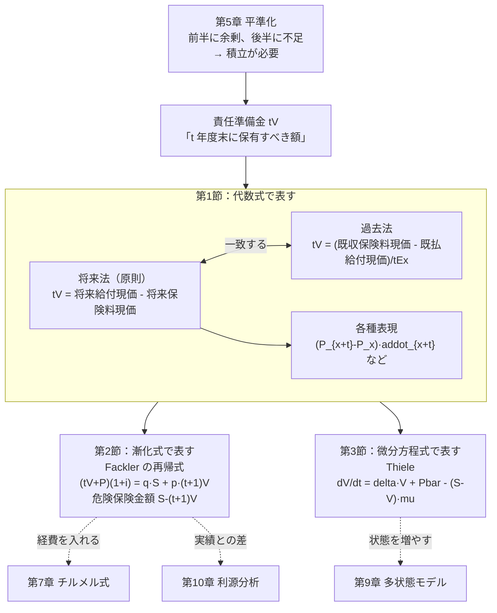
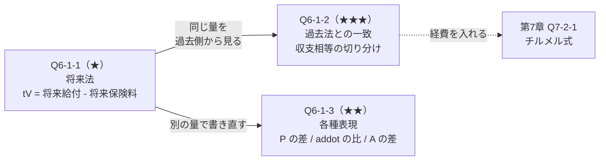
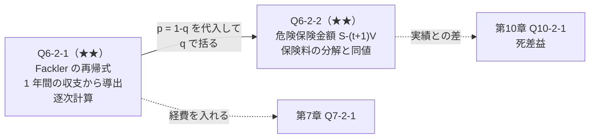
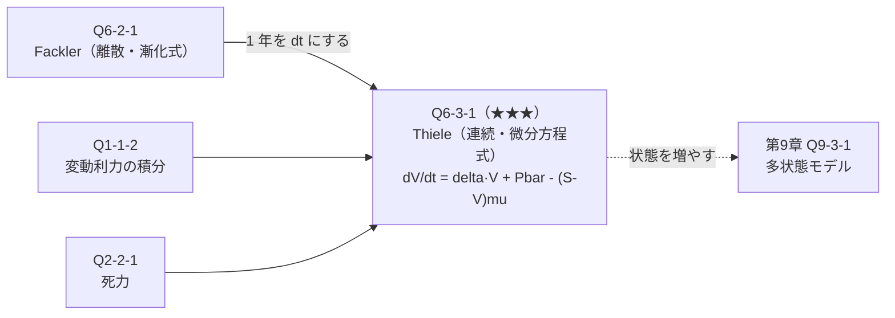
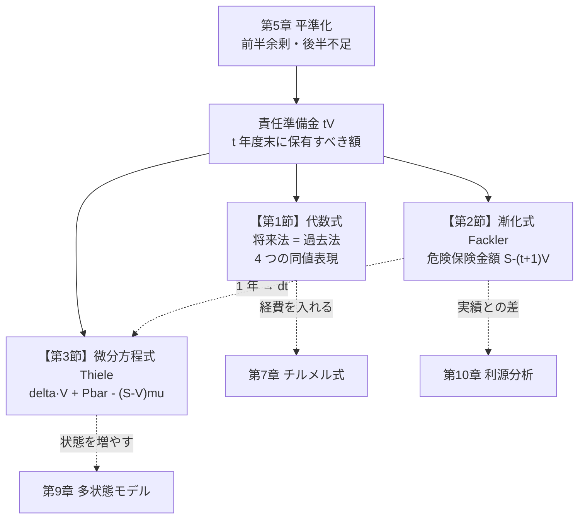
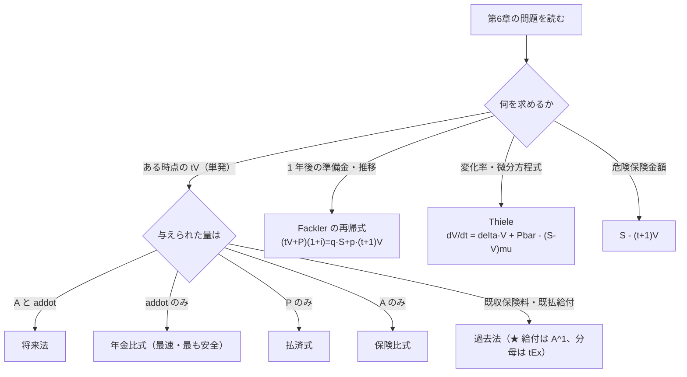

# 第6章　責任準備金

> [← 第5章 平準純保険料](第05章_平準純保険料.md) ｜ **第6章** ｜ [第7章 営業保険料と実務計算 →](第07章_営業保険料と実務計算.md)

---

## 章の地図



**この図の読み方**：責任準備金は **同じ量を3つの道具で表す** 章です。
節が分かれているのは概念が違うからではなく、**式の型（代数式／漸化式／微分方程式）が違う** からです。
どれを使うかの判断が、この章の中心的な技能です。

---

## この章で学ぶこと

第5章で見たとおり、平準保険料方式では
**前半に余剰が生じ、後半に不足が生じます**。
その余剰を積み立てておかなければ、後半の給付をまかなえません。

**責任準備金 ${}_tV$ とは、$t$ 年度末に保有していなければならない額** です。

第6章に **新しい確率概念は登場しません**。
第3章・第4章で作った期待現価を引き算するだけです。
新しいのは「**どの時点で評価するか**」という視点だけです。

```text
第5章：契約時点（t = 0）で収支相等を立てた
              ↓
第6章：任意の時点（t）で収支を見直す
              ↓
       将来給付 - 将来保険料 = 不足分 = 責任準備金
```

---

## この章の全体像


```text
学習順序：
① 将来法で定義する（原則）              …… 将来給付 - 将来保険料
        ↓
② 過去法でも同じ値になることを確認       …… 既収保険料 - 既払給付
        ↓
③ 同値な各種表現を身につける             …… P の差、addot の比、A の差
        ↓
④ 1 年ごとの動きを漸化式で追う           …… Fackler
        ↓
⑤ 危険保険金額という見方を得る
        ↓
⑥ 連続時間で微分方程式にする             …… Thiele
```

---

## 最初に頭に入れるべきポイント

### 責任準備金は「将来の不足の現価」

```text
時点        0            t                    n
            |------------|--------------------|
                         ★ 評価時点

将来の給付          ────────────────────────→  A_{x+t:n-t}
将来の保険料        ────────────────────────→  P · addot_{x+t:n-t}

            将来給付 > 将来保険料
                    ↓
            差額を今持っていなければ足りない
                    ↓
            tV = A_{x+t:n-t} - P · addot_{x+t:n-t}
```

**なぜ将来給付が将来保険料を上回るのか**：契約時点では等しかった（収支相等）のに、
時間が経つと不等になります。理由は
**「保険料は平準（一定）なのに、死亡率は上昇する」** からです（第5章 Q5-2-1）。

### 将来法と過去法は必ず一致する

| | 見る方向 | 式 |
|---|---|---|
| **将来法** | $t$ 以降 | ${}_tV=A_{x+t:\overline{n-t}\vert}-P\,\ddot a_{x+t:\overline{n-t}\vert}$ |
| **過去法** | $t$ 以前 | ${}_tV=\dfrac{P\,\ddot a_{x:\overline{t}\vert}-A^1_{x:\overline{t}\vert}}{{}_tE_x}$ |

```text
       過去法の視点                将来法の視点
       ←──────────                ──────────→
時点   0                t                     n
       |----------------|---------------------|
       [既収保険料 - 既払給付]  [将来給付 - 将来保険料]
              ↓                        ↓
        積み立ててきた額          これから必要な額
              └────── 等しい ──────┘
                     （収支相等の帰結）
```

**一致する理由**：契約時点の収支相等の等式を、時点 $t$ の前後で切り分けただけだからです。
（Q6-1-2 で厳密に示します。）

**⚠ 過去法の分母 ${}_tE_x$**：これは
「契約時点の現価を、$t$ 年度末の **生存者1人あたり** に換算する」係数です。
$t$ 年間で死亡した人の分は、生存者に分配されます。

### 責任準備金には4つの同値な表現がある

終身保険を例にすると、次はすべて同じ値です。

$$_tV_x=\underbrace{A_{x+t}-P_x\,\ddot a_{x+t}}_{\text{将来法}}
=\underbrace{\left(P_{x+t}-P_x\right)\ddot a_{x+t}}_{\text{保険料差式}}
=\underbrace{1-\frac{\ddot a_{x+t}}{\ddot a_x}}_{\text{年金比式}}
=\underbrace{\frac{A_{x+t}-A_x}{1-A_x}}_{\text{保険比式}}$$

**問題によって使いやすい形が違います。** どれか1つを覚えるのではなく、
「与えられた量に合わせて選ぶ」のが正しい使い方です（Q6-1-3）。

### 3つの道具の使い分け

```text
問題文を読む
    │
    ├─ 「ある時点の準備金を求めよ」（単発）
    │      → 将来法（または過去法）  【第1節】
    │
    ├─ 「準備金の推移を求めよ」「1 年後の準備金は」
    │      → Fackler の再帰式        【第2節】
    │
    ├─ 「準備金の変化率」「微分方程式を導け」
    │      → Thiele                  【第3節】
    │
    └─ 「別の量（P や addot）から準備金を表せ」
           → 各種表現                【第1節】
```

---

## 基本記号・基本公式

| 記号 | 意味 |
|---|---|
| ${}_tV$ | $t$ 年度末の純保険料式責任準備金（保険料払込直後） |
| ${}_tV_x$ | 終身保険 |
| ${}_tV_{x:\overline{n}\vert}$ | 養老保険 |
| ${}_t\bar V$ | 連続型 |
| $S$ | 保険金額（本書では原則 $S=1$） |

### 将来法・過去法

$$_tV_{x:\overline{n}\vert}=A_{x+t:\overline{n-t}\vert}-P_{x:\overline{n}\vert}\,\ddot a_{x+t:\overline{n-t}\vert}
\qquad\text{（将来法）}$$

$$_tV_{x:\overline{n}\vert}=\frac{P_{x:\overline{n}\vert}\,\ddot a_{x:\overline{t}\vert}
-A^1_{x:\overline{t}\vert}}{{}_tE_x}\qquad\text{（過去法）}$$

**成立条件**：純保険料式（経費を含まない）、かつ将来法と過去法で同一の基礎率を使うこと。

### 各種表現（終身保険）

| 名称 | 式 | 使う場面 |
|---|---|---|
| 将来法 | $A_{x+t}-P_x\ddot a_{x+t}$ | 原則。$A$ と $\ddot a$ が既知 |
| 保険料差式 | $\left(P_{x+t}-P_x\right)\ddot a_{x+t}$ | **保険料が既知** |
| 年金比式 | $1-\dfrac{\ddot a_{x+t}}{\ddot a_x}$ | **年金現価だけで済む**（最も簡単） |
| 保険比式 | $\dfrac{A_{x+t}-A_x}{1-A_x}$ | 保険の期待現価が既知 |
| 払済式 | $1-\dfrac{P_x+d}{P_{x+t}+d}$ | 保険料のみで済む |

### Fackler の再帰式

$$\left({}_tV+P\right)(1+i)=q_{x+t}\,S+p_{x+t}\,{}_{t+1}V$$

$$\Longleftrightarrow\quad{}_{t+1}V=\frac{\left({}_tV+P\right)(1+i)-q_{x+t}S}{p_{x+t}}$$

**危険保険金額による表現**

$$\left({}_tV+P\right)(1+i)={}_{t+1}V+q_{x+t}\underbrace{\left(S-{}_{t+1}V\right)}_{\text{危険保険金額}}$$

### Thiele の微分方程式

$$\frac{d}{dt}{}_t\bar V=\delta\,{}_t\bar V+\bar P-\left(S-{}_t\bar V\right)\mu_{x+t}$$

```text
各項の意味：

   dV/dt  =  delta·V   +   Pbar   -   (S - V)·mu
     │         │            │           │
     │         │            │           └─ 死亡による流出
     │         │            │              （危険保険金額 × 死力）
     │         │            └─ 保険料収入
     │         └─ 利息収入
     └─ 準備金の増加率
```

**境界条件**：養老保険なら ${}_n\bar V=S$、定期保険なら ${}_n\bar V=0$。

---

## 試験での主な問われ方

| 出題形態 | 典型的な問われ方 | 対応する問題 |
|---|---|---|
| 小問 | 将来法で ${}_tV$ を計算 | Q6-1-1 |
| 小問 | 各種表現の変換 | Q6-1-3 |
| 記述式 | 将来法と過去法の一致を証明 | Q6-1-2 |
| 記述式 | Fackler の再帰式を導出し逐次計算 | Q6-2-1 |
| 記述式 | 危険保険金額の意味と保険料の分解 | Q6-2-2 |
| 記述式 | Thiele の微分方程式を導出 | Q6-3-1 |
| 他章との複合 | チルメル式（第7章）、利源分析（第10章） | 全問 |

---

## 問題を見分けるためのサイン

| 問題文中の表現 | 判断すること |
|---|---|
| 「$t$ 年度末の責任準備金」 | 保険料払込**直後**の時点 |
| 「$t$ 年度末（保険料払込前）」 | ${}_tV$ から $P$ を除く（または $t$ 年度初の直前） |
| 「将来法により」 | 将来給付 $-$ 将来保険料 |
| 「過去法により」 | （既収保険料 $-$ 既払給付）$\div{}_tE_x$ |
| 「一致することを示せ」 | 収支相等を時点 $t$ で切り分ける |
| 「1年後の責任準備金」「推移を求めよ」 | **Fackler の再帰式** |
| 「危険保険金額」 | $S-{}_{t+1}V$ |
| 「連続的に」「微分方程式を導け」 | **Thiele** |
| 「純保険料式」 | 経費なし（チルメル式は第7章） |
| 「保険料が与えられている」 | 保険料差式・払済式が使える |
| 「年金現価だけが与えられている」 | 年金比式 $1-\frac{\ddot a_{x+t}}{\ddot a_x}$ |

**⚠ 特に注意すべき語**

* 「**$t$ 年度末**」は、$t$ 年目の保険料を払い込んだ **後**、$t+1$ 年目の保険料を払う **前** です。
* 「**純保険料式**」と「**チルメル式**」は別物です（第7章）。
* 定期保険では ${}_nV=0$、養老保険では ${}_nV=S$ です。

---

## この章の問題一覧

| ID | 表題 | 難 | 段階 | この問題の役割 |
|---|---|---|---|---|
| **第1節　将来法・過去法と各種表現** | | | | |
| Q6-1-1 | 将来法による責任準備金 | ★ | ① | 定義を確定させる。評価時点の意味 |
| Q6-1-2 | 将来法と過去法の一致 | ★★★ | ③ | 収支相等を時点 $t$ で切り分ける証明 |
| Q6-1-3 | 責任準備金の各種表現 | ★★ | ② | 与えられた量に応じて式を選ぶ |
| **第2節　再帰式と危険保険金額** | | | | |
| Q6-2-1 | Fackler の再帰式 | ★★ | ③ | 漸化式という別の型。逐次計算 |
| Q6-2-2 | 危険保険金額と保険料の分解 | ★★ | ④ | 第5章 Q5-2-2 と表裏一体 |
| **第3節　連続型と Thiele の微分方程式** | | | | |
| Q6-3-1 | Thiele の微分方程式 | ★★★ | ⑤ | 微分方程式という第3の型。第9章の下地 |

---
---

# 第1節　将来法・過去法と各種表現

## この節のテーマ

**責任準備金を代数式（引き算・割り算）で表す技術** を扱います。
評価時点を $t$ に移すこと以外、第3章・第4章の道具しか使いません。

## この節でできるようになること

* 将来法で責任準備金を計算できる
* 過去法でも同じ値になることを証明できる
* 与えられた量（$A$／$\ddot a$／$P$）に応じて最適な表現を選べる
* 責任準備金が $0$ から $S$（または $0$）へ推移する様子を説明できる

## 頭に入れるべきポイント

### 将来法は「収支相等を時点 $t$ でやり直す」

契約時点では

$$P\,\ddot a_{x:\overline{n}\vert}=A_{x:\overline{n}\vert}\qquad(\text{収支相等})$$

でしたが、時点 $t$ では **保険料が平準なのに死亡率が上がっている** ため

$$P\,\ddot a_{x+t:\overline{n-t}\vert}<A_{x+t:\overline{n-t}\vert}$$

となります。この差額が責任準備金です。

$$_tV=A_{x+t:\overline{n-t}\vert}-P\,\ddot a_{x+t:\overline{n-t}\vert}$$

### 表現の選び方

```text
与えられた量は何か？
    │
    ├─ A と addot（時点 t 以降）
    │     → 将来法  tV = A_{x+t:n-t} - P·addot_{x+t:n-t}
    │
    ├─ addot だけ（終身保険）
    │     → 年金比式  tV = 1 - addot_{x+t}/addot_x     ★ 最も簡単
    │
    ├─ 保険料 P_x と P_{x+t}
    │     → 保険料差式  tV = (P_{x+t} - P_x)·addot_{x+t}
    │     → 払済式      tV = 1 - (P_x + d)/(P_{x+t} + d)
    │
    └─ A_x と A_{x+t}
          → 保険比式  tV = (A_{x+t} - A_x)/(1 - A_x)
```

**年金比式が最も計算量が少ない** ので、$\ddot a$ が使えるなら優先します。

## 使用する記号・公式

| 表現 | 終身保険 | 養老保険 |
|---|---|---|
| 将来法 | $A_{x+t}-P_x\ddot a_{x+t}$ | $A_{x+t:\overline{n-t}\vert}-P\,\ddot a_{x+t:\overline{n-t}\vert}$ |
| 過去法 | $\dfrac{P_x\ddot a_{x:\overline{t}\vert}-A^1_{x:\overline{t}\vert}}{{}_tE_x}$ | 同形 |
| 保険料差式 | $\left(P_{x+t}-P_x\right)\ddot a_{x+t}$ | $\left(P_{x+t:\overline{n-t}\vert}-P_{x:\overline{n}\vert}\right)\ddot a_{x+t:\overline{n-t}\vert}$ |
| 年金比式 | $1-\dfrac{\ddot a_{x+t}}{\ddot a_x}$ | $1-\dfrac{\ddot a_{x+t:\overline{n-t}\vert}}{\ddot a_{x:\overline{n}\vert}}$ |
| 保険比式 | $\dfrac{A_{x+t}-A_x}{1-A_x}$ | $\dfrac{A_{x+t:\overline{n-t}\vert}-A_{x:\overline{n}\vert}}{1-A_{x:\overline{n}\vert}}$ |
| 払済式 | $1-\dfrac{P_x+d}{P_{x+t}+d}$ | 同形 |

**境界条件**

| 保険 | ${}_0V$ | ${}_nV$ |
|---|---|---|
| 養老保険 | $0$ | $S$（$=1$） |
| 定期保険 | $0$ | $0$ |
| 終身保険 | $0$ | $\to S$（$t\to\omega-x$） |

## 基本的な解法パターン

```text
① 評価時点 t を確定する（保険料払込直後か直前か）
        ↓
② 与えられた量を確認する（A / addot / P のどれか）
        ↓
③ 表現を選ぶ
   ├─ addot が使える → 年金比式（最速）
   ├─ P が使える     → 保険料差式・払済式
   └─ 一般           → 将来法
        ↓
④ 時点 t 以降の年齢（x+t）と期間（n-t）に注意して代入
        ↓
⑤ 検算：
   ・0V = 0、養老なら nV = 1、定期なら nV = 0
   ・0 ≤ tV ≤ 1（養老保険）
   ・t について単調増加（養老保険）
```

## 間違えやすい点

| 誤り | 内容 | 防ぎ方 |
|---|---|---|
| 年齢と期間 | $A_{x:\overline{n-t}\vert}$ とする | 年齢も $x+t$ に進む |
| 保険料の添字 | 将来法で $P_{x+t}$ を使う | **契約時の $P_x$**（保険料は変わらない） |
| 過去法の分母 | ${}_tE_x$ を忘れる | 生存者1人あたりへの換算 |
| 過去法の給付 | $A_{x:\overline{t}\vert}$（養老）とする | 既払給付は**死亡給付のみ** $A^1_{x:\overline{t}\vert}$ |
| 評価時点 | 払込前と後を混同 | ${}_tV$ は払込**直後** |

## この節の問題の流れ



---
---

## 問題 Q6-1-1　将来法による責任準備金

| 項目 | 内容 |
|---|---|
| 出題年度 | `要照合`（記入欄：______年度） |
| 問題番号 | `要照合`（記入欄：問題___） |
| 分野・論点 | 責任準備金 ／ 将来法 |
| 難易度 | ★ |
| この節での位置づけ | 段階①（定義を直接使う）。本章の基準となる問題 |
| 関連する問題 | 発展元：Q5-1-1（同じ契約の保険料）、Q3-1-1、Q4-1-1 ／ 本問 ／ 後続：Q6-1-2、Q6-2-1 |

### ■ この問題で押さえるべきポイント

#### ① 何を問う問題か

**将来法により責任準備金を計算させる問題** です。
計算は引き算だけですが、問われているのは
**「評価時点を $t$ に移すと、年齢と期間の両方が変わる」** ことの理解です。

#### ② 問題文から読み取るべき条件

| 条件 | 解法への影響 |
|---|---|
| 「40歳、20年養老保険」 | $x=40$、$n=20$ |
| 「10年度末の責任準備金」 | $t=10$。評価時点の年齢は $50$、残期間は $10$ 年 |
| 「純保険料式」 | 経費を含まない。$P=0.0373567$ |
| 「保険料払込直後」 | ${}_{10}V$ の標準的な定義 |

#### ③ 最初に注目する場所

**評価時点 $t$ から、年齢 $x+t$ と残期間 $n-t$ を両方求める**。
$t=10$、$x=40$、$n=20$ なら、年齢 $50$ 歳、残期間 $10$ 年です。
どちらか一方だけを変えるのが最も多い誤りです。

#### ④ 呼び出すべき知識

| 知識 | なぜこの問題で使うか |
|---|---|
| ${}_tV=A_{x+t:\overline{n-t}\vert}-P\,\ddot a_{x+t:\overline{n-t}\vert}$ | 将来法の定義 |
| $P$ は契約時の保険料（変わらない） | 将来法で $P_{x+t}$ を使わない |
| $A_{x:\overline{n}\vert}=1-d\ddot a_{x:\overline{n}\vert}$ | 検算・別解に使う |
| ${}_0V=0$、${}_nV=S$ | 境界条件（検算） |

#### ⑤ 解法の骨格

```text
1. 評価時点 t から年齢 x+t、残期間 n-t を求める
2. 将来給付の期待現価 A_{x+t:n-t} を求める
3. 将来保険料の期待現価 P × addot_{x+t:n-t} を求める
4. 引く
5. 検算：0V = 0、20V = 1、単調増加
```

#### ⑥ 間違えやすい点

* 年齢を $x$ のままにする（$x+t$）
* 期間を $n$ のままにする（$n-t$）
* 将来法で $P_{x+t}$ を使う（契約時の $P$ を使う）
* 保険料払込前と後を混同する

#### ⑦ この問題を一言で捉えると

> **「時点 $t$ で収支相等をやり直すと、いくら足りないか」を計算する問題。**

### ■ 問題の構造図

```text
将来法の時間軸（x = 40, n = 20, t = 10）：

時点       0    ...   10   ...   20
           |---...---|---...----|
年齢      40   ...   50   ...   60
                     ★ 評価時点

【過去】保険料 ^P ... ^P             （既に払い込まれた）
        給付      v1 ... v1          （既に支払われた）

【将来】保険料           ^P ... ^P    → P × addot_(50:10) = 0.0373567 × 8.659639
        死亡給付            v1 ... v1
        満期給付                  v1  → A_(50:10) = 0.747778

        将来給付現価 - 将来保険料現価
      = 0.747778 - 0.323495 = 0.424283  ← ★ これが 10V


責任準備金の推移（養老保険）：

  tV ↑
  1.0┤                                    ●  ← 満期で保険金額に一致
     │                              ●
     │                        ●
  0.5┤                  ●
     │            ●
     │      ●
    0└●───────────────────────────────────→ t
     0     5    10    15    20

  ★ 0V = 0（契約時は何も積み立てていない）
    20V = 1（満期時は保険金額と一致）
```

### ■ 問題

年利率 $i=0.03$、40歳、保険期間20年、保険金額1の養老保険（全期払）について、
純保険料は $P=0.0373567$ である。次の値が与えられている。

| 年齢・期間 | $A$ | $\ddot a$ |
|---|---|---|
| $A_{45:\overline{15}\vert},\ \ddot a_{45:\overline{15}\vert}$ | $0.648015$ | $12.084814$ |
| $A_{50:\overline{10}\vert},\ \ddot a_{50:\overline{10}\vert}$ | $0.747778$ | $8.659639$ |
| $A_{55:\overline{5}\vert},\ \ddot a_{55:\overline{5}\vert}$ | $0.863788$ | $4.676605$ |
| $A_{59:\overline{1}\vert},\ \ddot a_{59:\overline{1}\vert}$ | $0.970874$ | $1.000000$ |

**(1)** 将来法により ${}_{10}V_{40:\overline{20}\vert}$ を求めよ（小数第7位まで）。

**(2)** 同様に ${}_5V$、${}_{15}V$、${}_{19}V$ を求めよ（小数第7位まで）。

**(3)** ${}_0V=0$ および ${}_{20}V=1$ となることを説明せよ。

**(4)** (1)〜(3) の結果から、責任準備金の推移の特徴を述べよ。

**(5)** ${}_tV=1-\dfrac{\ddot a_{x+t:\overline{n-t}\vert}}{\ddot a_{x:\overline{n}\vert}}$
（年金比式）が成り立つことを、$A=1-d\ddot a$ を用いて示せ。
また $t=10$ で (1) と一致することを確認せよ。ただし $\ddot a_{40:\overline{20}\vert}=15.041461$ とする。

> 本問は再現題です。原文の出題年度・問題番号は未照合です。

### ■ 問題文を数理モデルへ変換

| 確認項目 | 問題文から読み取れる内容 | 数理的な表現 |
|---|---|---|
| 契約 | 40歳、20年養老、保険金額1 | $x=40$、$n=20$、$S=1$ |
| 保険料 | 純保険料 $P=0.0373567$、全期払 | 契約時に決まり **一定** |
| (1) 評価時点 | 10年度末 | $t=10$ → 年齢 $50$、残期間 $10$ |
| 将来給付 | 残り10年の養老保険 | $A_{50:\overline{10}\vert}$ |
| 将来保険料 | 残り10年の払込 | $P\,\ddot a_{50:\overline{10}\vert}$ |

### ■ 解法フロー

```text
STEP 1　(1) 年齢と残期間を確定し、将来法で計算する
STEP 2　(2) 他の時点も同様に計算する
STEP 3　(3) 境界条件を確認する
STEP 4　(4) 推移の特徴を読む
STEP 5　(5) 年金比式を導き、一致を確認する
```

### ■ 詳細解説

#### STEP 1　(1) 将来法による計算

*目的：評価時点を $t=10$ に移して収支を見直す。*

**年齢と残期間**：$t=10$ のとき

$$\text{年齢}=x+t=40+10=50,\qquad\text{残期間}=n-t=20-10=10$$

**将来給付の期待現価**：年齢50、残期間10年の養老保険です。

$$A_{50:\overline{10}\vert}=0.747778$$

**将来保険料の期待現価**：残り10年間、毎年初に $P$ を払い込みます。

$$P\times\ddot a_{50:\overline{10}\vert}=0.0373567\times8.659639=0.3234954$$

**責任準備金**

$$_{10}V=0.747778-0.3234954$$

$$\boxed{{}_{10}V_{40:\overline{20}\vert}=0.4242826}$$

（$A$ を小数第6位で丸めたことによる末位の差を除けば、厳密値は $0.4242821$ です。）

**⚠ 桁落ちに注意**：責任準備金は **2つの大きな量の差** です。

```text
   10V  =  0.747778   -   0.323495   =   0.424283
             ↑              ↑              ↑
          6 桁精度      7 桁精度      ★ 有効桁が 1 桁減る

  0.75 と 0.32 の差が 0.42 → 上位の桁が打ち消し合い、
  与えられた値の丸め誤差が相対的に約 2 倍に拡大する
```

精度が必要な場合は、引き算を含まない (5) の年金比式を使う方が安全です。

#### STEP 2　(2) 他の時点

*目的：同じ手順を繰り返す。*

| $t$ | 年齢 $x+t$ | 残期間 $n-t$ | $A$ | $P\,\ddot a$ | ${}_tV$ |
|---|---|---|---|---|---|
| 5 | 45 | 15 | $0.648015$ | $0.0373567\times12.084814=0.4514486$ | $0.1965664$ |
| 10 | 50 | 10 | $0.747778$ | $0.0373567\times8.659639=0.3234954$ | $0.4242826$ |
| 15 | 55 | 5 | $0.863788$ | $0.0373567\times4.676605=0.1747025$ | $0.6890855$ |
| 19 | 59 | 1 | $0.970874$ | $0.0373567\times1.000000=0.0373567$ | $0.9335173$ |

厳密値（丸めのない基礎率による）は
${}_5V=0.1965665$、${}_{10}V=0.4242821$、${}_{15}V=0.6890857$、${}_{19}V=0.9335171$ で、
いずれも小数第6位まで一致しています。

**$t=19$ の $\ddot a_{59:\overline{1}\vert}=1$ について**：期始払1年年金は
**時点 $0$ の支払1回のみ**（生存確率 ${}_0p_{59}=1$）なので、
丸め誤差のない厳密値 $1$ になります。

#### STEP 3　(3) 境界条件

*目的：$t=0$ と $t=n$ での値を確認する。*

**${}_0V=0$**

$t=0$ では年齢 $40$、残期間 $20$ なので

$$_0V=A_{40:\overline{20}\vert}-P\,\ddot a_{40:\overline{20}\vert}$$

これは **契約時の収支相等の式そのもの** です。収支相等により

$$P\,\ddot a_{40:\overline{20}\vert}=A_{40:\overline{20}\vert}$$

なので

$$_0V=0$$

**意味**：契約時点では何も積み立てていません。当然です。

**${}_{20}V=1$**

$t=20$ では残期間 $0$ です。将来の保険料はなく（$\ddot a_{60:\overline{0}\vert}=0$）、
将来の給付は **満期保険金 $1$ を即時に支払う** ことだけです。

$$_{20}V=1-P\times0=1$$

**意味**：満期時点では保険金額と同額を保有していなければなりません。

#### STEP 4　(4) 推移の特徴

*目的：数値から性質を読む。*

| $t$ | 0 | 5 | 10 | 15 | 19 | 20 |
|---|---|---|---|---|---|---|
| ${}_tV$ | $0$ | $0.1966$ | $0.4243$ | $0.6891$ | $0.9335$ | $1$ |
| 増分（5年あたり） | — | $+0.1966$ | $+0.2277$ | $+0.2648$ | — | — |

**特徴1：単調増加**

$0\to1$ へ増え続けます。第5章 Q5-2-1 で見た「前半の余剰の累積」に対応します。

**特徴2：増加が加速する**

5年ごとの増分が $0.1966\to0.2277\to0.2648$ と大きくなっています。

```text
  tV ↑
  1.0┤                                  ● ← 満期
     │                             ●
     │                       ●      増分が
  0.5┤                 ●            大きくなる
     │           ●
     │     ●
    0└●─────────────────────────────→ t
     0    5    10   15   20

  ★ 増加が加速する理由：
    貯蓄保険料 v·(t+1)V - tV はほぼ一定だが、
    既に積み上がった準備金にも利息が付くため、
    複利的に増加する
```

**特徴3：満期で保険金額に一致**

養老保険の特徴です。定期保険なら満期で $0$ に戻ります。

#### STEP 5　(5) 年金比式の導出

*目的：$A=1-d\ddot a$ を使って将来法を書き換える。*

将来法から出発します。

$$_tV=A_{x+t:\overline{n-t}\vert}-P_{x:\overline{n}\vert}\,\ddot a_{x+t:\overline{n-t}\vert}$$

第3章 Q3-1-2 の $A_{x+t:\overline{n-t}\vert}=1-d\,\ddot a_{x+t:\overline{n-t}\vert}$ と、
第5章 Q5-1-1 の $P_{x:\overline{n}\vert}=\dfrac{1}{\ddot a_{x:\overline{n}\vert}}-d$ を代入します。

$$_tV=\left(1-d\,\ddot a_{x+t:\overline{n-t}\vert}\right)
-\left(\frac{1}{\ddot a_{x:\overline{n}\vert}}-d\right)\ddot a_{x+t:\overline{n-t}\vert}$$

$$=1-d\,\ddot a_{x+t:\overline{n-t}\vert}
-\frac{\ddot a_{x+t:\overline{n-t}\vert}}{\ddot a_{x:\overline{n}\vert}}
+d\,\ddot a_{x+t:\overline{n-t}\vert}$$

**$d\,\ddot a_{x+t:\overline{n-t}\vert}$ の項が打ち消し合います。**

$$\boxed{{}_tV=1-\frac{\ddot a_{x+t:\overline{n-t}\vert}}{\ddot a_{x:\overline{n}\vert}}}$$

□

```text
式変形の流れ：

   tV = A_{x+t:n-t} - P·addot_{x+t:n-t}
     ↓ A = 1 - d·addot、P = 1/addot_(x:n) - d を代入
   ( 1 - d·addot_{x+t:n-t} ) - ( 1/addot_(x:n) - d )·addot_{x+t:n-t}
     ↓ ★ -d·addot と +d·addot が打ち消し合う
   1 - addot_{x+t:n-t} / addot_(x:n)
```

**数値による確認**

$$_{10}V=1-\frac{\ddot a_{50:\overline{10}\vert}}{\ddot a_{40:\overline{20}\vert}}
=1-\frac{8.659639}{15.041461}=1-0.5757179=0.4242821$$

(1) の将来法による $0.4242826$ と一致します（差は $A$ の丸めによる末位のみ）。✓

**他の時点でも確認**

| $t$ | $\ddot a_{x+t:\overline{n-t}\vert}$ | $1-\dfrac{\ddot a_{x+t:\overline{n-t}\vert}}{15.041461}$ | 将来法の値 |
|---|---|---|---|
| 5 | $12.084814$ | $0.1965665$ | $0.1965664$ |
| 10 | $8.659639$ | $0.4242821$ | $0.4242826$ |
| 15 | $4.676605$ | $0.6890857$ | $0.6890855$ |
| 19 | $1.000000$ | $0.9335171$ | $0.9335173$ |

**年金比式の利点**：$P$ も $A$ も不要で、**$\ddot a$ だけで計算できます**。
また将来法のような大きな量どうしの引き算がないため、**桁落ちが起きません**。
実際、上表では年金比式の方が厳密値に近い値を与えています。

### ■ 答え

| 設問 | $t$ | ${}_tV$ |
|---|---|---|
| (2) | 5 | $0.1965664$ |
| (1)(2) | 10 | $0.4242826$（将来法）／$0.4242821$（年金比式） |
| (2) | 15 | $0.6890855$ |
| (2) | 19 | $0.9335173$ |

**(3)** ${}_0V=A_{40:\overline{20}\vert}-P\,\ddot a_{40:\overline{20}\vert}=0$
（契約時の収支相等そのもの）。
${}_{20}V$ は残期間 $0$ で将来保険料がなく、満期保険金 $1$ を即時支払うのみだから $1$。

**(4)** 責任準備金は $0$ から $1$ へ **単調増加** し、増加は **加速** する。
これは第5章で見た「前半の余剰の累積」に対応し、
既積立分にも利息が付くため複利的に増える。
養老保険では満期で保険金額に一致する（定期保険なら $0$ に戻る）。

**(5)** $A_{x+t:\overline{n-t}\vert}=1-d\ddot a_{x+t:\overline{n-t}\vert}$ と
$P_{x:\overline{n}\vert}=\frac{1}{\ddot a_{x:\overline{n}\vert}}-d$ を将来法に代入すると
$d\,\ddot a_{x+t:\overline{n-t}\vert}$ の項が打ち消し合い

$$_tV=1-\frac{\ddot a_{x+t:\overline{n-t}\vert}}{\ddot a_{x:\overline{n}\vert}}$$

$t=10$：$1-\dfrac{8.659639}{15.041461}=0.4242821$ で、将来法の $0.4242826$ と一致する。

> **⚠ 桁落ちについて**：責任準備金は「大きな2量の差」なので、
> 与えられた $A$ と $\ddot a$ の丸め誤差が拡大します。
> 年金比式のように **引き算を含まない表現を選ぶ** と精度が保てます。
> 試験では与えられた値をそのまま使い、
> **どの式を用いたかを明記** してください。

### ■ 試験答案としての書き方

> **(1)** $t=10$ において年齢は $50$、残期間は $10$ 年であるから、将来法により
> ${}_{10}V=A_{50:\overline{10}\vert}-P\,\ddot a_{50:\overline{10}\vert}
> =0.747778-0.0373567\times8.659639$
> $=0.747778-0.323495=0.424283$
>
> **(2)** 同様に
> ${}_5V=0.648015-0.0373567\times12.084814=0.648015-0.451449=0.196566$
> ${}_{15}V=0.863788-0.0373567\times4.676605=0.863788-0.174703=0.689086$
> ${}_{19}V=0.970874-0.0373567\times1.000000=0.970874-0.037357=0.933517$
>
> **(3)** ${}_0V=A_{40:\overline{20}\vert}-P\ddot a_{40:\overline{20}\vert}$ は
> 契約時の収支相等式そのものであるから $0$。
> ${}_{20}V$ は残期間 $0$ で将来保険料の現価が $0$、
> 将来給付は満期保険金 $1$ の即時支払のみであるから $1$。
>
> **(4)** ${}_tV$ は $0$ から $1$ へ単調に増加し、その増加は加速する。
> 平準保険料が前半で自然保険料を上回ることによる余剰が累積し、
> さらに既積立分に利息が付くためである。
>
> **(5)** $A_{x+t:\overline{n-t}\vert}=1-d\,\ddot a_{x+t:\overline{n-t}\vert}$、
> $P_{x:\overline{n}\vert}=\dfrac{1}{\ddot a_{x:\overline{n}\vert}}-d$ を将来法に代入すると
> ${}_tV=\left(1-d\ddot a_{x+t:\overline{n-t}\vert}\right)
> -\left(\dfrac{1}{\ddot a_{x:\overline{n}\vert}}-d\right)\ddot a_{x+t:\overline{n-t}\vert}
> =1-\dfrac{\ddot a_{x+t:\overline{n-t}\vert}}{\ddot a_{x:\overline{n}\vert}}$
> $t=10$：$1-\dfrac{8.659639}{15.041461}=0.424282$（(1) に一致）

### ■ 解答後に確認すること

| 項目 | 内容 |
|---|---|
| **最も重要なポイント** | 評価時点を $t$ に移すと **年齢が $x+t$、期間が $n-t$ の両方が変わる**。保険料は契約時の $P$ のまま |
| **最初に気づくべきだった条件** | $t=10$、$x=40$、$n=20$ → 年齢50、残期間10年。片方だけ変えるのが最頻出の誤り |
| **他の問題にも使える考え方** | ① 責任準備金は「大きな2量の差」なので**桁落ち**に注意。引き算の少ない表現を選ぶ。② 年金比式 $1-\frac{\ddot a_{x+t}}{\ddot a_x}$ は $\ddot a$ だけで済み最も安全。③ 境界条件（${}_0V=0$、${}_nV=S$）は必ず検算に使う |
| **類似問題との違い** | Q6-1-2 は同じ値を**過去側**から求める。Q6-1-3 は他の表現。Q6-2-1 は**1年ごとの推移**を漸化式で追う |
| **条件が変わった場合** | ① 定期保険なら ${}_nV=0$（満期給付がない）。② 短期払込なら $t>h$ で将来保険料が $0$ になり ${}_tV=A_{x+t:\overline{n-t}\vert}$。③ 連続型なら Thiele（Q6-3-1） |
| **復習時に思い出すこと** | ${}_tV=A_{x+t:\overline{n-t}\vert}-P\,\ddot a_{x+t:\overline{n-t}\vert}$、$1-\dfrac{\ddot a_{x+t:\overline{n-t}\vert}}{\ddot a_{x:\overline{n}\vert}}$ |

---
---

## 問題 Q6-1-2　将来法と過去法の一致

| 項目 | 内容 |
|---|---|
| 出題年度 | `要照合`（記入欄：______年度） |
| 問題番号 | `要照合`（記入欄：問題___） |
| 分野・論点 | 責任準備金 ／ 過去法 |
| 難易度 | ★★★ |
| この節での位置づけ | 段階③（複数の論点を組み合わせる）。同じ量を反対方向から見る |
| 関連する問題 | 発展元：Q6-1-1、Q5-1-1（収支相等） ／ 本問 ／ 後続：Q7-2-1（チルメル式は過去法で扱う） |

### ■ この問題で押さえるべきポイント

#### ① 何を問う問題か

**将来法と過去法が一致することを証明させる問題** です。

証明の鍵は **「契約時点の収支相等の等式を、時点 $t$ の前後で切り分ける」** ことです。
新しい概念はなく、既知の等式を分解するだけです。

#### ② 問題文から読み取るべき条件

| 条件 | 解法への影響 |
|---|---|
| 「過去法により」 | （既収保険料現価 $-$ 既払給付現価）$\div\,{}_tE_x$ |
| 「既払給付」 | **死亡給付のみ** $A^1_{x:\overline{t}\vert}$（満期はまだ来ていない） |
| 「一致することを示せ」 | 収支相等を分解する |
| 「純保険料式」 | 同一の基礎率。経費なし |

#### ③ 最初に注目する場所

**収支相等の等式 $P\,\ddot a_{x:\overline{n}\vert}=A_{x:\overline{n}\vert}$ を書き出す**。
証明はここから始まります。次に **両辺を時点 $t$ で2つに分ける** ことを考えます。

#### ④ 呼び出すべき知識

| 知識 | なぜこの問題で使うか |
|---|---|
| 収支相等 $P\ddot a_{x:\overline{n}\vert}=A_{x:\overline{n}\vert}$ | 証明の出発点 |
| $\ddot a_{x:\overline{n}\vert}=\ddot a_{x:\overline{t}\vert}+{}_tE_x\,\ddot a_{x+t:\overline{n-t}\vert}$ | 年金の分解（第4章 Q4-2-1） |
| $A_{x:\overline{n}\vert}=A^1_{x:\overline{t}\vert}+{}_tE_x\,A_{x+t:\overline{n-t}\vert}$ | 保険の分解 |
| ${}_tE_x=v^{t}{}_tp_x$ | 据置係数 |

**保険の分解の確認**：$n$ 年養老保険の給付は
「最初の $t$ 年の死亡給付」と「$t$ 年後に生存していれば、そこから $n-t$ 年の養老保険」に分かれます。

$$A_{x:\overline{n}\vert}=\underbrace{A^1_{x:\overline{t}\vert}}_{\text{最初の }t\text{ 年の死亡}}
+\underbrace{{}_tE_x\,A_{x+t:\overline{n-t}\vert}}_{t\text{ 年後以降}}$$

#### ⑤ 解法の骨格

```text
1. 収支相等 P·addot_(x:n) = A_(x:n) を書く
2. 年金と保険を時点 t で分解する
   addot_(x:n) = addot_(x:t) + tEx · addot_{x+t:n-t}
   A_(x:n)     = A^1_(x:t)   + tEx · A_{x+t:n-t}
3. 代入して整理する
4. 「時点 t 以前の項」と「時点 t 以降の項」に分ける
5. 移項すると将来法 = 過去法が出る
```

#### ⑥ 間違えやすい点

* 既払給付を $A_{x:\overline{t}\vert}$（養老）とする（**$A^1$** が正しい）
* 過去法の分母 ${}_tE_x$ を忘れる
* 保険の分解で ${}_tE_x$ を掛け忘れる
* 経費がある場合にも成立すると思う（純保険料式のみ）

#### ⑦ この問題を一言で捉えると

> **「契約時の収支相等を時点 $t$ でハサミを入れる」だけの証明。**

### ■ 問題の構造図

```text
収支相等を時点 t で切り分ける：

時点     0                    t                      n
         |--------------------|----------------------|
                              ✂ ここで切る

【保険料】
  全体 : P · addot_(x:n)
       = P · addot_(x:t)  +  P · tEx · addot_{x+t:n-t}
         └─ 過去部分 ─┘     └──── 将来部分 ────┘

【給付】
  全体 : A_(x:n)
       = A^1_(x:t)  +  tEx · A_{x+t:n-t}
         └ 過去 ┘     └──── 将来 ────┘
         ↑
    ★ 死亡給付のみ（満期はまだ来ていない）

【収支相等】P·addot_(x:n) = A_(x:n) に代入して移項：

   P·addot_(x:t) - A^1_(x:t)  =  tEx·( A_{x+t:n-t} - P·addot_{x+t:n-t} )
   └──── 過去の余剰 ────┘        └──── 将来の不足 = tV ────┘
              ↓                                ↓
       両辺を tEx で割ると
              ↓
   ( P·addot_(x:t) - A^1_(x:t) ) / tEx  =  tV
   └────────── 過去法 ──────────┘      └ 将来法 ┘


分母 tEx の意味：

  過去の余剰は「契約時点の現価」で測られている
       ↓ tEx = v^t · tpx で割る
  「t 年度末に生存している 1 人あたり」の額に換算される
       ↓
  ★ t 年間で死亡した人の積立分は、生存者に分配される
```

### ■ 問題

年利率 $i=0.03$、40歳、保険期間20年、保険金額1の養老保険（全期払、純保険料式）について、
$P=0.0373567$ である。次の値が与えられている。

$$\ddot a_{40:\overline{10}\vert}=8.722037,\qquad A^1_{40:\overline{10}\vert}=0.0162040,\qquad
{}_{10}E_{40}=0.7297561$$

**(1)** 一般に、$n$ 年養老保険について次の分解が成り立つことを説明せよ。

$$\ddot a_{x:\overline{n}\vert}=\ddot a_{x:\overline{t}\vert}+{}_tE_x\,\ddot a_{x+t:\overline{n-t}\vert},
\qquad
A_{x:\overline{n}\vert}=A^1_{x:\overline{t}\vert}+{}_tE_x\,A_{x+t:\overline{n-t}\vert}$$

**(2)** (1) と収支相等の原則を用いて、将来法と過去法が一致すること、すなわち

$$A_{x+t:\overline{n-t}\vert}-P\,\ddot a_{x+t:\overline{n-t}\vert}
=\frac{P\,\ddot a_{x:\overline{t}\vert}-A^1_{x:\overline{t}\vert}}{{}_tE_x}$$

を示せ。

**(3)** 過去法により ${}_{10}V_{40:\overline{20}\vert}$ を求めよ（小数第7位まで）。

**(4)** 過去法の分母 ${}_tE_x$ が果たす役割を説明せよ。

**(5)** 既払給付が $A_{x:\overline{t}\vert}$（養老保険）ではなく
$A^1_{x:\overline{t}\vert}$（定期保険）である理由を述べよ。

> 本問は再現題です。原文の出題年度・問題番号は未照合です。

### ■ 問題文を数理モデルへ変換

| 確認項目 | 問題文から読み取れる内容 | 数理的な表現 |
|---|---|---|
| 契約 | 40歳、20年養老、全期払 | $x=40$、$n=20$、$h=n$ |
| 評価時点 | $t=10$ | 年齢50、残期間10年 |
| 既収保険料 | 10年分 | $P\,\ddot a_{40:\overline{10}\vert}$ |
| 既払給付 | 10年間の**死亡**給付のみ | $A^1_{40:\overline{10}\vert}$ |
| 換算係数 | 生存者1人あたり | ${}_{10}E_{40}$ |

### ■ 解法フロー

```text
STEP 1　(1) 年金と保険の分解を説明する
STEP 2　(2) 収支相等に代入して移項する
STEP 3　(3) 過去法で数値計算し、将来法と一致を確認
STEP 4　(4) tEx の役割を説明する
STEP 5　(5) 既払給付が A^1 である理由
```

### ■ 詳細解説

#### STEP 1　(1) 分解の説明

*目的：給付と払込を時点 $t$ で2つに分ける。*

**年金の分解**（第4章 Q4-2-1 で既習）

期始払 $n$ 年年金の支払時点 $\{0,1,\dots,n-1\}$ を
$\{0,\dots,t-1\}$ と $\{t,\dots,n-1\}$ に分けます。

$$\ddot a_{x:\overline{n}\vert}
=\underbrace{\ddot a_{x:\overline{t}\vert}}_{\text{最初の }t\text{ 回}}
+\underbrace{{}_tE_x\,\ddot a_{x+t:\overline{n-t}\vert}}_{t\text{ 回目以降}}$$

後半は「$t$ 年後に生存していれば、そこから $n-t$ 年の年金が始まる」ので、
${}_tE_x$（$t$ 年生き延びて $t$ 年分割り引く係数）を掛けます。

**保険の分解**

$n$ 年養老保険の給付は次の2つに分かれます。

| 場合 | 給付 | 期待現価 |
|---|---|---|
| 最初の $t$ 年で死亡 | 死亡年度末に $1$ | $A^1_{x:\overline{t}\vert}$ |
| $t$ 年生存 | そこから $n-t$ 年の養老保険 | ${}_tE_x\,A_{x+t:\overline{n-t}\vert}$ |

$$A_{x:\overline{n}\vert}=A^1_{x:\overline{t}\vert}+{}_tE_x\,A_{x+t:\overline{n-t}\vert}$$

**⚠ 前半が $A^1$（定期保険）である理由**：
最初の $t$ 年間に発生しうる給付は **死亡給付だけ** です。
満期（時点 $n$）はまだ来ていないので、満期保険金は前半に含まれません。
（詳しくは STEP 5。）

#### STEP 2　(2) 一致の証明

*目的：収支相等に分解を代入して移項する。*

契約時点の収支相等は

$$P\,\ddot a_{x:\overline{n}\vert}=A_{x:\overline{n}\vert}$$

(1) の分解を代入します。

$$P\left(\ddot a_{x:\overline{t}\vert}+{}_tE_x\,\ddot a_{x+t:\overline{n-t}\vert}\right)
=A^1_{x:\overline{t}\vert}+{}_tE_x\,A_{x+t:\overline{n-t}\vert}$$

展開します。

$$P\,\ddot a_{x:\overline{t}\vert}+P\,{}_tE_x\,\ddot a_{x+t:\overline{n-t}\vert}
=A^1_{x:\overline{t}\vert}+{}_tE_x\,A_{x+t:\overline{n-t}\vert}$$

**「時点 $t$ 以前の項」を左辺に、「時点 $t$ 以降の項」を右辺に集めます。**

$$P\,\ddot a_{x:\overline{t}\vert}-A^1_{x:\overline{t}\vert}
={}_tE_x\,A_{x+t:\overline{n-t}\vert}-P\,{}_tE_x\,\ddot a_{x+t:\overline{n-t}\vert}$$

右辺を ${}_tE_x$ で括ります。

$$P\,\ddot a_{x:\overline{t}\vert}-A^1_{x:\overline{t}\vert}
={}_tE_x\left(A_{x+t:\overline{n-t}\vert}-P\,\ddot a_{x+t:\overline{n-t}\vert}\right)$$

**右辺の括弧の中は将来法の責任準備金 ${}_tV$ です。** 両辺を ${}_tE_x$ で割ります。

$$\boxed{\frac{P\,\ddot a_{x:\overline{t}\vert}-A^1_{x:\overline{t}\vert}}{{}_tE_x}
=A_{x+t:\overline{n-t}\vert}-P\,\ddot a_{x+t:\overline{n-t}\vert}={}_tV}$$

左辺が過去法、右辺が将来法です。□

```text
式変形の流れ：

   P·addot_(x:n) = A_(x:n)                    ← 収支相等
     ↓ 両辺を時点 t で分解して代入
   P·addot_(x:t) + P·tEx·addot_{x+t:n-t}
       = A^1_(x:t) + tEx·A_{x+t:n-t}
     ↓ ★ 時点 t 以前の項を左、以降の項を右に移項
   P·addot_(x:t) - A^1_(x:t)
       = tEx·( A_{x+t:n-t} - P·addot_{x+t:n-t} )
     ↓ 両辺を tEx で割る
   ( P·addot_(x:t) - A^1_(x:t) ) / tEx  =  tV
   └──────── 過去法 ────────┘      └ 将来法 ┘
```

**証明の本質**：収支相等という **1本の等式** を、時点 $t$ で切り分けただけです。
「過去の余剰」と「将来の不足」は、もともと同じ等式の両側にあった量なのです。

#### STEP 3　(3) 過去法による計算

*目的：数値で一致を確認する。*

$$_{10}V=\frac{P\,\ddot a_{40:\overline{10}\vert}-A^1_{40:\overline{10}\vert}}{{}_{10}E_{40}}$$

**分子**（既収保険料現価 $-$ 既払給付現価）

$$P\,\ddot a_{40:\overline{10}\vert}=0.0373567\times8.722037=0.3258265$$

$$0.3258265-0.0162040=0.3096225$$

**分母**

$$_{10}E_{40}=0.7297561$$

**責任準備金**

$$_{10}V=\frac{0.3096225}{0.7297561}=0.4242821$$

$$\boxed{{}_{10}V=0.4242821}$$

Q6-1-1 の将来法・年金比式による値 $0.4242821$ と **完全に一致** します。✓
(2) で証明したとおり、両者は恒等的に等しい量です。

**分子の意味**

```text
   0.3258265  -  0.0162040  =  0.3096225
        │            │              │
        │            │              └─ 10 年間の「余剰」の現価
        │            └─ 既に支払った死亡給付の期待現価
        └─ 既に受け取った保険料の期待現価

   ⇒ 保険料収入が死亡給付を 0.3096 だけ上回っている
     （第5章 Q5-2-1 で見た「前半の余剰」そのもの）
```

**分母で割る効果**

$$\frac{0.3096225}{0.7297561}=0.4242821$$

$1$ より小さい ${}_{10}E_{40}=0.7297561$ で割るので、値は **$1.37$ 倍に増えます**。
これは STEP 4 で説明する「時点の移動」と「生存者への再分配」の効果です。

> **⚠ 桁落ちについて**：過去法は分子が「大きな2量の差」であり、
> さらに $1$ 未満の ${}_tE_x$ で割るため、**与えられた値の丸め誤差が最も増幅されやすい**
> 表現です。本問では値が十分な桁数で与えられているため完全に一致しましたが、
> 実務的な数値計算では将来法または年金比式を使い、
> 過去法は理論的な証明や、既収保険料が直接与えられる場面で使うのが安全です。

#### STEP 4　(4) ${}_tE_x$ の役割

*目的：分母の意味を説明する。*

分子

$$P\,\ddot a_{x:\overline{t}\vert}-A^1_{x:\overline{t}\vert}$$

は「$t$ 年間の余剰（保険料収入 $-$ 死亡給付）」を **契約時点の現価** で測った額です。

一方、責任準備金 ${}_tV$ は「**$t$ 年度末に生存している契約者1人あたり** に
保有すべき額」です。両者は評価時点も対象人数も違います。

```text
契約時点：l_x 人が加入
     ↓ t 年経過（死亡・割引）
t 年度末：l_{x+t} 人が生存

  分子 = 契約時点における「全体の余剰」の現価
     ↓ ÷ tEx = ÷ ( v^t · tpx )
  分子 ÷ tEx = t 年度末における「生存者 1 人あたり」の額

  ★ tEx で割る操作は 2 つの換算を同時に行う：
    ① ÷ v^t   … 契約時点 → t 年度末 へ時点を移す（利息を付ける）
    ② ÷ tpx   … 全体 → 生存者 1 人あたり へ換算する
```

**②の意味**：$t$ 年間で死亡した契約者の積立分は、
**生存している契約者に分配** されます（死亡した人は保険金を受け取って契約終了）。
そのため生存者1人あたりの額は、単純な平均より大きくなります。

$$\frac{1}{{}_tp_x}>1$$

これが **生命保険特有の「生存者への再分配」** であり、
確定利付商品との決定的な違いです。

#### STEP 5　(5) 既払給付が $A^1$ である理由

*目的：満期保険金が前半に含まれない理由を説明する。*

過去法は「時点 $0$ から $t$ までに **実際に発生した** 給付」を数えます。

$n$ 年養老保険の給付は2種類です。

| 給付 | 発生時点 | $t$ 年目までに発生するか |
|---|---|---|
| 死亡給付 | 死亡年度末（$1$〜$n$） | **する**（$t$ 年以内の死亡） |
| 満期給付 | 時点 $n$ | **しない**（$t<n$ なので） |

したがって、時点 $t$ までに発生する給付は **死亡給付だけ** です。
その期待現価は $t$ 年定期保険 $A^1_{x:\overline{t}\vert}$ になります。

**⚠ よくある誤り**：$A_{x:\overline{t}\vert}$（$t$ 年養老保険）を使うこと。
これには「時点 $t$ に生存していたら $1$ を支払う」という
**存在しない給付**（${}_tE_x$）が含まれてしまいます。

$$A_{x:\overline{t}\vert}=A^1_{x:\overline{t}\vert}+{}_tE_x$$

誤って $A_{x:\overline{t}\vert}$ を使うと、分子から ${}_tE_x$ が余分に引かれ、

$$\frac{P\ddot a_{x:\overline{t}\vert}-A^1_{x:\overline{t}\vert}-{}_tE_x}{{}_tE_x}
={}_tV-1$$

となり、**責任準備金が $1$ だけ小さく出ます**。
本問の数値なら $0.424282-1=-0.575718$ と負になり、明らかにおかしいと気づけます。

**検算の指針**：責任準備金が負になったら、
まず「既払給付に満期保険金を含めていないか」を疑ってください。

### ■ 答え

**(1)** 年金は支払時点を $\{0,\dots,t-1\}$ と $\{t,\dots,n-1\}$ に分け、
後半に据置係数 ${}_tE_x$ を掛けることで
$\ddot a_{x:\overline{n}\vert}=\ddot a_{x:\overline{t}\vert}+{}_tE_x\ddot a_{x+t:\overline{n-t}\vert}$。
保険は「最初の $t$ 年の死亡」と「$t$ 年生存後の $n-t$ 年養老保険」に分かれ
$A_{x:\overline{n}\vert}=A^1_{x:\overline{t}\vert}+{}_tE_x A_{x+t:\overline{n-t}\vert}$。

**(2)** 収支相等 $P\ddot a_{x:\overline{n}\vert}=A_{x:\overline{n}\vert}$ に (1) を代入し、
時点 $t$ 以前の項と以降の項に分けて移項すると

$$P\ddot a_{x:\overline{t}\vert}-A^1_{x:\overline{t}\vert}
={}_tE_x\left(A_{x+t:\overline{n-t}\vert}-P\ddot a_{x+t:\overline{n-t}\vert}\right)$$

両辺を ${}_tE_x$ で割れば過去法 $=$ 将来法。

**(3)** $\dfrac{0.0373567\times8.722037-0.0162040}{0.7297561}
=\dfrac{0.3096225}{0.7297561}=0.4242821$

Q6-1-1 の将来法・年金比式による値と完全に一致する。

**(4)** ${}_tE_x=v^{t}{}_tp_x$ で割る操作は、
① $v^{t}$ で割ることで契約時点から $t$ 年度末へ評価時点を移し、
② ${}_tp_x$ で割ることで全体から **$t$ 年度末の生存者1人あたり** へ換算する。
$t$ 年間に死亡した契約者の積立分が生存者へ再分配されることを表している。

**(5)** 過去法は時点 $t$ までに **実際に発生した** 給付を数える。
満期給付は時点 $n$（$>t$）に発生するため、時点 $t$ までには発生していない。
したがって既払給付は死亡給付のみであり $A^1_{x:\overline{t}\vert}$ となる。
誤って $A_{x:\overline{t}\vert}$ を用いると ${}_tE_x$ が余分に引かれ、
責任準備金が $1$ だけ小さく（本問では負に）なる。

### ■ 試験答案としての書き方

> **(1)** 期始払年金の支払時点 $\{0,\dots,n-1\}$ を $\{0,\dots,t-1\}$ と $\{t,\dots,n-1\}$ に分け、
> 後者は $t$ 年後に生存している場合に始まる年金であるから ${}_tE_x$ を掛けて
> $\ddot a_{x:\overline{n}\vert}=\ddot a_{x:\overline{t}\vert}+{}_tE_x\,\ddot a_{x+t:\overline{n-t}\vert}$
> 給付は「最初の $t$ 年間の死亡給付」と「$t$ 年生存後の $n-t$ 年養老保険」に分かれるから
> $A_{x:\overline{n}\vert}=A^1_{x:\overline{t}\vert}+{}_tE_x\,A_{x+t:\overline{n-t}\vert}$
>
> **(2)** 収支相等 $P\,\ddot a_{x:\overline{n}\vert}=A_{x:\overline{n}\vert}$ に (1) を代入すると
> $P\ddot a_{x:\overline{t}\vert}+P\,{}_tE_x\ddot a_{x+t:\overline{n-t}\vert}
> =A^1_{x:\overline{t}\vert}+{}_tE_x A_{x+t:\overline{n-t}\vert}$
> 移項して
> $P\ddot a_{x:\overline{t}\vert}-A^1_{x:\overline{t}\vert}
> ={}_tE_x\left(A_{x+t:\overline{n-t}\vert}-P\ddot a_{x+t:\overline{n-t}\vert}\right)$
> 両辺を ${}_tE_x$ で割ると
> $\dfrac{P\ddot a_{x:\overline{t}\vert}-A^1_{x:\overline{t}\vert}}{{}_tE_x}
> =A_{x+t:\overline{n-t}\vert}-P\ddot a_{x+t:\overline{n-t}\vert}={}_tV$ □
>
> **(3)** ${}_{10}V=\dfrac{P\,\ddot a_{40:\overline{10}\vert}-A^1_{40:\overline{10}\vert}}{{}_{10}E_{40}}
> =\dfrac{0.0373567\times8.722037-0.0162040}{0.7297561}
> =\dfrac{0.3258265-0.0162040}{0.7297561}=\dfrac{0.3096225}{0.7297561}=0.424282$
> （Q6-1-1 の将来法による値に一致する。）
>
> **(4)** ${}_tE_x=v^{t}\,{}_tp_x$ で割ることにより、
> 契約時点の現価を $t$ 年度末の価値に直す（$v^{t}$ で割る）とともに、
> 契約者全体の額を $t$ 年度末の生存者1人あたりの額に換算する（${}_tp_x$ で割る）。
> 死亡した契約者の積立分が生存者に再分配されることを表す。
>
> **(5)** 過去法では時点 $t$ までに実際に発生した給付を計上する。
> 満期給付は時点 $n>t$ に発生するため未発生であり、
> 既払給付は死亡給付のみ、すなわち $A^1_{x:\overline{t}\vert}$ である。

### ■ 解答後に確認すること

| 項目 | 内容 |
|---|---|
| **最も重要なポイント** | 証明は **収支相等を時点 $t$ で切り分けるだけ**。「過去の余剰」と「将来の不足」はもともと同じ等式の両側 |
| **最初に気づくべきだった条件** | 既払給付は **死亡給付のみ**（$A^1$）。満期保険金はまだ発生していない |
| **他の問題にも使える考え方** | ① ${}_tE_x$ で割る＝「時点を移す」＋「生存者1人あたりに換算する」の2操作。② 過去法は**桁落ちに弱い**（分子が小さな差、さらに $<1$ で割る）。数値計算では将来法を優先。③ 準備金が負になったら満期給付の混入を疑う |
| **類似問題との違い** | Q6-1-1 は将来法（数値計算向き）。本問は過去法（証明・理論向き）。第7章 Q7-2-1 のチルメル式は過去法の方が扱いやすい |
| **条件が変わった場合** | ① 定期保険なら分解の $A_{x+t:\overline{n-t}\vert}$ が $A^1_{x+t:\overline{n-t}\vert}$ になる。② 経費があると純保険料式では一致しない（第7章）。③ 短期払込なら $t>h$ で $\ddot a_{x:\overline{t}\vert}$ が $\ddot a_{x:\overline{h}\vert}$ で頭打ちになる |
| **復習時に思い出すこと** | 過去法 $=\dfrac{P\ddot a_{x:\overline{t}\vert}-A^1_{x:\overline{t}\vert}}{{}_tE_x}$。分子の給付は **$A^1$**、分母は ${}_tE_x$ |

---
---

## 問題 Q6-1-3　責任準備金の各種表現

| 項目 | 内容 |
|---|---|
| 出題年度 | `要照合`（記入欄：______年度） |
| 問題番号 | `要照合`（記入欄：問題___） |
| 分野・論点 | 責任準備金 ／ 同値な表現 |
| 難易度 | ★★ |
| この節での位置づけ | 段階②（基本公式を変形して使う）。将来法を別の量で書き直す |
| 関連する問題 | 発展元：Q6-1-1、Q3-1-2、Q5-1-1 ／ 本問 ／ 後続：Q7-3-1（払済保険）、Q7-2-1 |

### ■ この問題で押さえるべきポイント

#### ① 何を問う問題か

**責任準備金を4通りの同値な形で表し、与えられた量に応じて使い分けさせる問題** です。

試験では「$\ddot a$ だけ与えられる」「$P$ だけ与えられる」など
**情報が限定される** ことが多く、そのとき適切な表現を選べるかが問われます。

#### ② 問題文から読み取るべき条件

| 条件 | 使うべき表現 |
|---|---|
| $A_{x+t}$ と $\ddot a_{x+t}$ が与えられる | 将来法 |
| $\ddot a_x$ と $\ddot a_{x+t}$ が与えられる | **年金比式**（最も簡単） |
| $P_x$ と $P_{x+t}$ が与えられる | 保険料差式・払済式 |
| $A_x$ と $A_{x+t}$ が与えられる | 保険比式 |

#### ③ 最初に注目する場所

**「何が与えられているか」**。
$A$、$\ddot a$、$P$ のどれが与えられているかで、選ぶべき表現が決まります。

#### ④ 呼び出すべき知識

| 知識 | なぜこの問題で使うか |
|---|---|
| $A_x=1-d\ddot a_x$ | 表現間の変換の要 |
| $P_x=\dfrac{1}{\ddot a_x}-d$ | 保険料と年金の関係 |
| $P_x+d=\dfrac{1}{\ddot a_x}$ | 払済式の導出 |
| 将来法 | 出発点 |

#### ⑤ 解法の骨格

```text
1. 将来法から出発する
2. A = 1 - d·addot、P = 1/addot - d を代入する
3. 打ち消し合う項を消す
4. 残った形が各表現になる
5. 数値ですべて一致することを確認
```

#### ⑥ 間違えやすい点

* 保険料差式で $\ddot a_x$ を使う（$\ddot a_{x+t}$ が正しい）
* 保険比式の分母を $A_x$ とする（$1-A_x$）
* 年金比式の分子と分母を逆にする
* 定期保険にも同じ式が使えると思う（終身・養老のみ）

#### ⑦ この問題を一言で捉えると

> **「同じ量の4つの顔」— どの顔を見せるかは、与えられた情報で決まる。**

### ■ 問題の構造図

```text
4 つの表現の関係（終身保険、x = 40, t = 10）：

              将来法（原則）
         tV = A_{x+t} - P_x·addot_{x+t}
                    │
        ┌───────────┼───────────┐
        │           │           │
   A=1-d·addot   P=1/addot-d   両方
   を代入        を代入        を代入
        │           │           │
        ↓           ↓           ↓
   保険比式     保険料差式    年金比式
   (A_{x+t}-A_x)  (P_{x+t}-P_x)  1 - addot_{x+t}
   ────────────   ·addot_{x+t}      ────────
      1 - A_x                        addot_x

                      ↓ P + d = 1/addot
                   払済式
                   1 - (P_x + d)/(P_{x+t} + d)


数値（x = 40, t = 10、終身保険、i = 0.03）：

   将来法     : A_50 - P_40·addot_50 = 0.389421 - 0.0125057×20.963201 = 0.1272628
   保険料差式 : (P_50 - P_40)·addot_50 = (0.0185764-0.0125057)×20.963201 = 0.1272628
   年金比式   : 1 - addot_50/addot_40 = 1 - 20.963201/24.020061        = 0.1272628
   保険比式   : (A_50 - A_40)/(1 - A_40) = (0.389421-0.300387)/0.699613 = 0.1272628

   ★ すべて完全に一致
```

### ■ 問題

年利率 $i=0.03$ とし、終身保険（終身払）について次の値が与えられている。

$$A_{40}=0.300387,\quad A_{50}=0.389421,\quad
\ddot a_{40}=24.020061,\quad \ddot a_{50}=20.963201$$

$$P_{40}=0.0125057,\quad P_{50}=0.0185764$$

**(1)** 将来法により ${}_{10}V_{40}$ を求めよ（小数第7位まで）。

**(2)** 保険料差式 ${}_tV_x=\left(P_{x+t}-P_x\right)\ddot a_{x+t}$ を将来法から導き、
数値で (1) と一致することを確認せよ。

**(3)** 年金比式 ${}_tV_x=1-\dfrac{\ddot a_{x+t}}{\ddot a_x}$ を導き、
数値で確認せよ。

**(4)** 保険比式 ${}_tV_x=\dfrac{A_{x+t}-A_x}{1-A_x}$ を導き、数値で確認せよ。

**(5)** 払済式 ${}_tV_x=1-\dfrac{P_x+d}{P_{x+t}+d}$ を導き、数値で確認せよ。

**(6)** 4つの表現のうち、次の場合にどれを使うのが最も適切か述べよ。
(a) $\ddot a_x$ と $\ddot a_{x+t}$ のみが与えられた場合
(b) $P_x$ と $P_{x+t}$ のみが与えられた場合

> 本問は再現題です。原文の出題年度・問題番号は未照合です。

### ■ 問題文を数理モデルへ変換

| 確認項目 | 問題文から読み取れる内容 | 数理的な表現 |
|---|---|---|
| 保険 | 終身保険、終身払 | $A_x$、$\ddot a_x$、$P_x=\frac{A_x}{\ddot a_x}$ |
| 評価時点 | $t=10$ | 年齢 $50$ |
| 保険料 | 契約時の $P_{40}$ | 将来法で使うのは $P_{40}$ |
| $P_{50}$ | 「50歳で新規加入した場合の保険料」 | 保険料差式で使う |

**⚠ $P_{50}$ の意味**：これは「この契約の保険料」ではありません。
**50歳の人が新たに終身保険に加入した場合の保険料** です。
保険料差式はこの2つの差を使います。

### ■ 解法フロー

```text
STEP 1　(1) 将来法で計算する
STEP 2　(2) P = A/addot を使って保険料差式を導く
STEP 3　(3) A = 1 - d·addot を使って年金比式を導く
STEP 4　(4) addot = (1-A)/d を使って保険比式を導く
STEP 5　(5) P + d = 1/addot を使って払済式を導く
STEP 6　(6) 使い分けを整理する
```

### ■ 詳細解説

#### STEP 1　(1) 将来法

$$_{10}V_{40}=A_{50}-P_{40}\,\ddot a_{50}
=0.389421-0.0125057\times20.963201$$

$$=0.389421-0.2621582=0.1272628$$

$$\boxed{{}_{10}V_{40}=0.1272628}$$

**妥当性**：終身保険の10年度末の準備金が $0.127$ です。
Q6-1-1 の養老保険（$0.424$）よりはるかに小さいのは、
**終身保険には満期保険金がなく、積み立てる必要が小さい** ためです。

#### STEP 2　(2) 保険料差式

*目的：$P_{x+t}$ を使って書き直す。*

将来法から出発します。

$$_tV_x=A_{x+t}-P_x\,\ddot a_{x+t}$$

$50$ 歳で新規加入した場合の保険料の定義は $P_{x+t}=\dfrac{A_{x+t}}{\ddot a_{x+t}}$ なので、

$$A_{x+t}=P_{x+t}\,\ddot a_{x+t}$$

これを代入します。

$$_tV_x=P_{x+t}\,\ddot a_{x+t}-P_x\,\ddot a_{x+t}$$

$\ddot a_{x+t}$ で括ります。

$$\boxed{{}_tV_x=\left(P_{x+t}-P_x\right)\ddot a_{x+t}}$$

□

**数値確認**

$$\left(0.0185764-0.0125057\right)\times20.963201=0.0060707\times20.963201=0.1272628\quad\checkmark$$

**意味の解釈**

```text
   tV = ( P_{x+t} - P_x ) × addot_{x+t}
           ↑        ↑          ↑
        50 歳の   40 歳の    残りの払込回数
        保険料    保険料     （の期待現価）

  「本来なら 50 歳で加入する人は P_50 を払うべきなのに、
    この契約者は 40 歳で加入したので P_40 しか払わない。
    その不足分 (P_50 - P_40) を残りの期間分まとめた額が
    責任準備金である」

  ★ 保険会社から見れば「これから受け取る保険料が
    本来必要な額より (P_50 - P_40) ずつ少ない」ので、
    その現価を今持っていなければならない
```

#### STEP 3　(3) 年金比式

*目的：$\ddot a$ だけで表す。*

将来法に $A_{x+t}=1-d\,\ddot a_{x+t}$（第3章）と
$P_x=\dfrac{1}{\ddot a_x}-d$（第5章）を代入します。

$$_tV_x=\left(1-d\,\ddot a_{x+t}\right)-\left(\frac{1}{\ddot a_x}-d\right)\ddot a_{x+t}$$

$$=1-d\,\ddot a_{x+t}-\frac{\ddot a_{x+t}}{\ddot a_x}+d\,\ddot a_{x+t}$$

**$d\,\ddot a_{x+t}$ が打ち消し合います。**

$$\boxed{{}_tV_x=1-\frac{\ddot a_{x+t}}{\ddot a_x}}$$

□

**数値確認**

$$1-\frac{20.963201}{24.020061}=1-0.8727372=0.1272628\quad\checkmark$$

**意味の解釈**：$\dfrac{\ddot a_{x+t}}{\ddot a_x}$ は
「残りの払込の現価が、当初の払込の現価の何割か」を表します。
$87.3\%$ が残っており、$12.7\%$ が既に「使われた」＝準備金として積み上がった、と読めます。

**この式が最も計算しやすい理由**：割り算1回と引き算1回だけで、
$A$ も $P$ も $d$ も不要です。**桁落ちも最小** です。

#### STEP 4　(4) 保険比式

*目的：$A$ だけで表す。*

年金比式から出発し、$\ddot a=\dfrac{1-A}{d}$（第4章）を代入します。

$$_tV_x=1-\frac{\ddot a_{x+t}}{\ddot a_x}
=1-\frac{\dfrac{1-A_{x+t}}{d}}{\dfrac{1-A_x}{d}}
=1-\frac{1-A_{x+t}}{1-A_x}$$

（$d$ が約分されます。）通分します。

$$=\frac{\left(1-A_x\right)-\left(1-A_{x+t}\right)}{1-A_x}$$

$$\boxed{{}_tV_x=\frac{A_{x+t}-A_x}{1-A_x}}$$

□

**数値確認**

$$\frac{0.389421-0.300387}{1-0.300387}=\frac{0.089034}{0.699613}=0.1272628\quad\checkmark$$

**意味の解釈**：分子は「保険の期待現価がどれだけ増えたか」（加齢による死亡リスクの増大）、
分母は「もともとどれだけの余地があったか」です。

#### STEP 5　(5) 払済式

*目的：$P$ だけで表す。*

第5章の $P_x=\dfrac{1}{\ddot a_x}-d$ を変形すると

$$P_x+d=\frac{1}{\ddot a_x}\qquad\Longleftrightarrow\qquad\ddot a_x=\frac{1}{P_x+d}$$

年金比式に代入します。

$$_tV_x=1-\frac{\ddot a_{x+t}}{\ddot a_x}
=1-\frac{\dfrac{1}{P_{x+t}+d}}{\dfrac{1}{P_x+d}}$$

$$\boxed{{}_tV_x=1-\frac{P_x+d}{P_{x+t}+d}}$$

□

**数値確認**

$$d=\frac{0.03}{1.03}=0.0291262$$

$$P_{40}+d=0.0125057+0.0291262=0.0416319$$

$$P_{50}+d=0.0185764+0.0291262=0.0477026$$

$$_{10}V_{40}=1-\frac{0.0416319}{0.0477026}=1-0.8727372=0.1272628\quad\checkmark$$

**「払済式」という名称の由来**：第7章 Q7-3-1 の払済保険では、
保険料の払込を止めて保険金額を減額します。
そのときの減額後の保険金額が $\dfrac{{}_tV}{A_{x+t}}$ で表され、
本式と密接に関係するためこう呼ばれます。

#### STEP 6　(6) 使い分け

*目的：与えられた情報から最適な式を選ぶ。*

**(a) $\ddot a_x$ と $\ddot a_{x+t}$ のみが与えられた場合**

$$\boxed{\text{年金比式}\quad{}_tV_x=1-\frac{\ddot a_{x+t}}{\ddot a_x}}$$

**理由**：他の3つの式はいずれも $A$ または $P$ を必要とします。
$\ddot a$ から $A$ や $P$ を作ることもできますが（$A=1-d\ddot a$、$P=\frac1{\ddot a}-d$）、
**計算が増え、丸め誤差も増えます**。年金比式なら追加計算ゼロです。

**(b) $P_x$ と $P_{x+t}$ のみが与えられた場合**

$$\boxed{\text{払済式}\quad{}_tV_x=1-\frac{P_x+d}{P_{x+t}+d}}$$

**理由**：保険料差式 $\left(P_{x+t}-P_x\right)\ddot a_{x+t}$ は
$\ddot a_{x+t}$ を **別に必要とします**。
$P$ だけしか与えられていない場合、$\ddot a_{x+t}=\dfrac{1}{P_{x+t}+d}$ を
経由しなければならず、それはまさに払済式そのものです。

**まとめ表**

| 与えられた量 | 使う式 | 追加で必要なもの |
|---|---|---|
| $A_{x+t}$、$\ddot a_{x+t}$、$P_x$ | 将来法 | なし |
| $P_x$、$P_{x+t}$、$\ddot a_{x+t}$ | 保険料差式 | なし |
| $\ddot a_x$、$\ddot a_{x+t}$ | **年金比式** | なし（最速） |
| $A_x$、$A_{x+t}$ | 保険比式 | なし |
| $P_x$、$P_{x+t}$ のみ | **払済式** | $d$ のみ |

### ■ 答え

| 設問 | 表現 | 式 | 数値 |
|---|---|---|---|
| (1) | 将来法 | $A_{50}-P_{40}\ddot a_{50}$ | $0.1272628$ |
| (2) | 保険料差式 | $\left(P_{50}-P_{40}\right)\ddot a_{50}$ | $0.1272628$ |
| (3) | 年金比式 | $1-\dfrac{\ddot a_{50}}{\ddot a_{40}}$ | $0.1272628$ |
| (4) | 保険比式 | $\dfrac{A_{50}-A_{40}}{1-A_{40}}$ | $0.1272628$ |
| (5) | 払済式 | $1-\dfrac{P_{40}+d}{P_{50}+d}$ | $0.1272628$ |

**4つの表現はすべて完全に一致する。**

**(6)**
(a) **年金比式** $1-\dfrac{\ddot a_{x+t}}{\ddot a_x}$。
$\ddot a$ のみで完結し、追加計算も丸め誤差も最小。
(b) **払済式** $1-\dfrac{P_x+d}{P_{x+t}+d}$。
保険料差式は $\ddot a_{x+t}$ を別途要するが、
払済式は $P$ と $d$ だけで済む。

### ■ 試験答案としての書き方

> $d=\dfrac{0.03}{1.03}=0.0291262$
>
> **(1)** ${}_{10}V_{40}=A_{50}-P_{40}\,\ddot a_{50}
> =0.389421-0.0125057\times20.963201=0.389421-0.262158=0.127263$
>
> **(2)** $P_{x+t}=\dfrac{A_{x+t}}{\ddot a_{x+t}}$ より $A_{x+t}=P_{x+t}\ddot a_{x+t}$。
> 将来法に代入して
> ${}_tV_x=P_{x+t}\ddot a_{x+t}-P_x\ddot a_{x+t}=\left(P_{x+t}-P_x\right)\ddot a_{x+t}$
> $=(0.0185764-0.0125057)\times20.963201=0.127263$
>
> **(3)** $A_{x+t}=1-d\ddot a_{x+t}$、$P_x=\dfrac{1}{\ddot a_x}-d$ を将来法に代入すると
> $d\ddot a_{x+t}$ の項が消えて
> ${}_tV_x=1-\dfrac{\ddot a_{x+t}}{\ddot a_x}=1-\dfrac{20.963201}{24.020061}=0.127263$
>
> **(4)** $\ddot a=\dfrac{1-A}{d}$ を (3) に代入すると $d$ が約分され
> ${}_tV_x=1-\dfrac{1-A_{x+t}}{1-A_x}=\dfrac{A_{x+t}-A_x}{1-A_x}
> =\dfrac{0.089034}{0.699613}=0.127263$
>
> **(5)** $P_x+d=\dfrac{1}{\ddot a_x}$ より $\ddot a_x=\dfrac{1}{P_x+d}$。(3) に代入して
> ${}_tV_x=1-\dfrac{P_x+d}{P_{x+t}+d}=1-\dfrac{0.0416319}{0.0477026}=0.127263$
>
> **(6)** (a) 年金比式。$\ddot a$ のみで計算でき、変換が不要で丸め誤差も最小。
> (b) 払済式。保険料差式は $\ddot a_{x+t}$ を要するが、払済式は $P$ と $d$ のみで済む。

### ■ 解答後に確認すること

| 項目 | 内容 |
|---|---|
| **最も重要なポイント** | 4つの表現は **同じ量の別の顔**。$A=1-d\ddot a$ と $P=\frac{1}{\ddot a}-d$ の2本で相互に変換できる。与えられた量で選ぶ |
| **最初に気づくべきだった条件** | $P_{x+t}$ は「この契約の保険料」ではなく「$x+t$ 歳で新規加入した場合の保険料」 |
| **他の問題にも使える考え方** | ① 変換の要は $A=1-d\ddot a$ と $P+d=\frac{1}{\ddot a}$ の2本だけ。② 計算経路が短い式ほど丸め誤差が小さい。③ 保険料差式の解釈「本来必要な保険料との差の現価」 |
| **類似問題との違い** | Q6-1-1 は将来法のみ。Q6-1-2 は過去法。本問は**同値な変形**で、証明ではなく使い分けが焦点 |
| **条件が変わった場合** | ① 養老保険なら添字が $x:\overline{n}\vert$、$x+t:\overline{n-t}\vert$ になるが式の形は同じ。② **定期保険には使えない**（$A^1\ne1-d\ddot a$）。③ 短期払込なら $P$ の定義が変わるので式も変わる |
| **復習時に思い出すこと** | 年金比式 $1-\dfrac{\ddot a_{x+t}}{\ddot a_x}$（最速）と保険料差式 $\left(P_{x+t}-P_x\right)\ddot a_{x+t}$（意味が明確） |

---

## 第1節　記憶用の一枚まとめ

```text
┌──────────────────────────────────────────────────────────────────────┐
│  第1節　将来法・過去法と各種表現                                      │
└──────────────────────────────────────────────────────────────────────┘

【問題文のサイン】
   「t 年度末の責任準備金」   → 保険料払込直後
   「将来法により」           → 将来給付 - 将来保険料
   「過去法により」           → (既収保険料 - 既払給付) / tEx
   「一致することを示せ」     → 収支相等を時点 t で切り分ける
   「純保険料式」             → 経費なし（チルメルは第7章）
        ↓
【判断する論点】
   与えられた量は何か
   ├─ A と addot（t 以降） → 将来法
   ├─ addot_x と addot_{x+t} → ★ 年金比式（最速・最も安全）
   ├─ P_x と P_{x+t}        → 払済式
   ├─ P と addot_{x+t}      → 保険料差式
   └─ A_x と A_{x+t}        → 保険比式
        ↓
【描くべき図】
   時点  0            t              n
         |------------|--------------|
                      ★ 評価時点
   過去  [既収保険料 - 既払給付(A^1)]      ÷ tEx → 過去法
   将来               [将来給付 - 将来保険料] → 将来法
                      └──── 等しい ────┘
        ↓
【使用する公式】
   将来法     tV = A_{x+t:n-t} - P·addot_{x+t:n-t}     ★ 年齢も期間も変わる
   過去法     tV = ( P·addot_(x:t) - A^1_(x:t) ) / tEx  ★ 給付は A^1、分母は tEx
   保険料差式 tV = ( P_{x+t} - P_x ) · addot_{x+t}
   年金比式   tV = 1 - addot_{x+t}/addot_x              ★ 最も簡単
   保険比式   tV = ( A_{x+t} - A_x ) / ( 1 - A_x )
   払済式     tV = 1 - ( P_x + d )/( P_{x+t} + d )
   境界条件   0V = 0、養老 nV = 1、定期 nV = 0
        ↓
【解答の基本手順】
   ① 評価時点 t を確定（払込直後か直前か）
   ② 年齢 x+t、残期間 n-t を求める        ★ 両方変わる
   ③ 与えられた量に応じて表現を選ぶ
   ④ 代入する（保険料は契約時の P のまま）
   ⑤ 検算：0V = 0、nV = 1（養老）／0（定期）、単調増加、0 ≤ tV ≤ 1
        ↓
【典型的なミス】
   ⚠ 年齢または期間の片方だけ変える       → x+t と n-t の両方
   ⚠ 将来法で P_{x+t} を使う              → 契約時の P_x
   ⚠ 過去法の既払給付を A_(x:t) とする    → ★ A^1_(x:t)（満期は未発生）
   ⚠ 過去法の分母 tEx を忘れる            → 生存者 1 人あたりへの換算
   ⚠ 定期保険に各種表現を使う             → 終身・養老のみ
   ⚠ 桁落ちを無視する                     → 大きな 2 量の差。年金比式が安全

【1行で】
   責任準備金＝「将来の不足」＝「過去の余剰」。同じ量の 4 つの顔。
   与えられた量で式を選ぶ。addot だけなら 1 - addot_{x+t}/addot_x。
```

---
---

# 第2節　再帰式と危険保険金額

## この節のテーマ

**責任準備金の1年ごとの動きを漸化式で追う技術** を扱います。
第1節が「ある時点の値を直接計算する」代数式だったのに対し、
この節は「前の年から次の年へ」という **漸化式** です。

## この節でできるようになること

* Fackler の再帰式を、1年間の収支から導ける
* 再帰式で責任準備金を逐次計算できる
* 危険保険金額 $S-{}_{t+1}V$ の意味を説明できる
* 再帰式と保険料の分解（第5章 Q5-2-2）が同じ式であることを理解できる

## 頭に入れるべきポイント

### 再帰式は「1年間の資金の流れ」そのもの

```text
時点            t                            t+1
                |----------------------------|

期首に持つ額   tV + P
                 │
                 │ × (1+i)   1 年間運用
                 ↓
期末の資産    (tV + P)(1+i)
                 │
        ┌────────┴─────────┐
        │                  │
   死亡（確率 q_{x+t}）  生存（確率 p_{x+t}）
        │                  │
    S を支払う        (t+1)V を保有
        │                  │
        └────────┬─────────┘
                 ↓
   (tV + P)(1+i) = q_{x+t}·S + p_{x+t}·(t+1)V        ← ★ Fackler
```

**これは単なる収支の等式** です。暗記するものではなく、図から書けます。

### 危険保険金額による書き換え

$p=1-q$ を代入して $q$ で括ると

$$\left({}_tV+P\right)(1+i)={}_{t+1}V+q_{x+t}\underbrace{\left(S-{}_{t+1}V\right)}_{\text{危険保険金額}}$$

```text
   期末に必要な額
     = (t+1)V            ← 生存・死亡にかかわらず必ず必要
     + q·( S - (t+1)V )  ← 死亡した場合の「追加」支出

  ★ 死亡しても (t+1)V は既に積み立てられている。
    追加で用意すべきは S - (t+1)V だけ。
```

### 3つの視点は同じ式

| 視点 | 式 |
|---|---|
| 責任準備金の再帰（第6章） | $({}_tV+P)(1+i)=q S+p\,{}_{t+1}V$ |
| 保険料の分解（第5章 Q5-2-2） | $P=v q(S-{}_{t+1}V)+(v\,{}_{t+1}V-{}_tV)$ |
| 利源分析（第10章） | 予定と実際の差 |

**すべて同じ等式を、どの量について解くかが違うだけ** です。

## 使用する記号・公式

| 名称 | 式 |
|---|---|
| Fackler の再帰式 | $\left({}_tV+P\right)(1+i)=q_{x+t}S+p_{x+t}\,{}_{t+1}V$ |
| ${}_{t+1}V$ について解く | ${}_{t+1}V=\dfrac{\left({}_tV+P\right)(1+i)-q_{x+t}S}{p_{x+t}}$ |
| 危険保険金額形 | $\left({}_tV+P\right)(1+i)={}_{t+1}V+q_{x+t}\left(S-{}_{t+1}V\right)$ |
| 危険保険金額 | $S-{}_{t+1}V$ |
| 初期条件 | ${}_0V=0$ |
| 終期条件 | 養老 ${}_nV=S$、定期 ${}_nV=0$ |

## 基本的な解法パターン

```text
① 1 年間の時間軸を描く（期首・運用・期末の分岐）
        ↓
② 期首資産 = tV + P、これを (1+i) 倍
        ↓
③ 期末は死亡（q）と生存（p）に分岐
        ↓
④ 等式を立てる
        ↓
⑤ 求めたい量について解く
   ├─ (t+1)V を求める → 順方向に解く
   ├─ tV を求める     → 逆方向に解く
   └─ P を求める      → 保険料の分解（第5章）
        ↓
⑥ 検算：0V = 0 から始めて nV = S（または 0）になるか
```

## 間違えやすい点

| 誤り | 内容 | 防ぎ方 |
|---|---|---|
| $(1+i)$ を掛ける対象 | $P$ に掛け忘れる | 期首に持つのは ${}_tV+P$ の両方 |
| 分母 | $p_{x+t}$ で割り忘れる | 生存者に分配されるから割る |
| 添字 | $q_x$ とする | $q_{x+t}$（評価時点の年齢） |
| 危険保険金額 | $S-{}_tV$ とする | $S-{}_{t+1}V$ |
| 逐次計算の向き | 逆向きに使う | ${}_0V=0$ から順に進む |

## この節の問題の流れ



---
---

## 問題 Q6-2-1　Fackler の再帰式

| 項目 | 内容 |
|---|---|
| 出題年度 | `要照合`（記入欄：______年度） |
| 問題番号 | `要照合`（記入欄：問題___） |
| 分野・論点 | 責任準備金 ／ 再帰式 |
| 難易度 | ★★ |
| この節での位置づけ | 段階③（複数の論点を組み合わせる）。代数式から漸化式へ型が変わる |
| 関連する問題 | 発展元：Q6-1-1、Q2-3-1（再帰式の型） ／ 本問 ／ 後続：Q6-2-2、Q10-2-2 |

### ■ この問題で押さえるべきポイント

#### ① 何を問う問題か

**責任準備金の1年ごとの推移を表す再帰式を導出させ、逐次計算させる問題** です。

本質は **「1年間の資金の流れを等式にする」** ことです。
第2章 Q2-3-1 の平均余命の再帰式と **同じ型の思考** です。

#### ② 問題文から読み取るべき条件

| 条件 | 解法への影響 |
|---|---|
| 「1年後の責任準備金」 | 再帰式を順方向に使う |
| 「推移を求めよ」 | ${}_0V=0$ から逐次計算 |
| 「$q_{x+t}$ の値が与えられる」 | 各年度の死亡率が必要 |
| 「保険料払込直後」 | ${}_tV$ に $P$ を足して運用する |

#### ③ 最初に注目する場所

**「期首に保険会社が持っている額は何か」**。
${}_tV$（前期末の準備金）と $P$（当期の保険料）の **合計** です。
どちらか一方を落とすのが最も多い誤りです。

#### ④ 呼び出すべき知識

| 知識 | なぜこの問題で使うか |
|---|---|
| 1年間の収支の等式 | 導出の原理 |
| $p_{x+t}=1-q_{x+t}$ | 分岐の確率 |
| ${}_0V=0$ | 逐次計算の出発点 |
| ${}_nV=S$（養老） | 検算 |
| 将来法（Q6-1-1） | 別経路での検証 |

#### ⑤ 解法の骨格

```text
1. 期首資産 = tV + P
2. 1 年運用 → (tV + P)(1+i)
3. 期末に死亡（確率 q）なら S、生存（確率 p）なら (t+1)V
4. 等式を立てる
5. (t+1)V について解く
6. 0V = 0 から順に計算し、nV = S を確認
```

#### ⑥ 間違えやすい点

* 期首資産を ${}_tV$ だけとする（$P$ を足す）
* $p_{x+t}$ で割り忘れる
* 死亡率の年齢を間違える（$q_{x+t}$）
* 逐次計算で丸めを繰り返して誤差が累積する

#### ⑦ この問題を一言で捉えると

> **「期首に持っている額を1年運用したら、死亡給付と次期末準備金に分かれる」— 
> ただの収支の等式。**

### ■ 問題の構造図

```text
1 年間の資金の流れ（t 年度、養老保険 S = 1）：

時点            t                              t+1
                |------------------------------|

期首          tV      +      P
           前期末準備金   当期保険料
                └────┬─────┘
                     │
                  tV + P              ← ★ 両方を持っている
                     │ × (1+i)
                     ↓
              (tV + P)(1+i)
                     │
          ┌──────────┴───────────┐
          │                      │
    死亡（確率 q_{x+t}）    生存（確率 p_{x+t}）
          │                      │
      S を支払う            (t+1)V を保有
     （契約終了）           （次年度へ）
          │                      │
          └──────────┬───────────┘
                     ↓
      (tV + P)(1+i) = q_{x+t}·S + p_{x+t}·(t+1)V


逐次計算の流れ（★ 0V = 0 から出発）：

   0V = 0
    │ Fackler
    ↓
   1V
    │ Fackler
    ↓
   2V  →  ...  →  19V
                    │ Fackler
                    ↓
                  20V = 1  ← ★ 検算（養老保険なら保険金額に一致）
```

### ■ 問題

年利率 $i=0.03$、40歳、保険期間20年、保険金額1の養老保険（全期払、純保険料式）について、
$P=0.0373567$、${}_{10}V=0.4242821$ である。死亡率は次のとおりとする。

| 年齢 | $q_x$ | 年齢 | $q_x$ |
|---|---|---|---|
| 50 | $0.0027416$ | 52 | $0.0031918$ |
| 51 | $0.0029550$ | 59 | $0.0057597$ |

**(1)** 1年間の資金の流れを考えることにより、Fackler の再帰式

$$\left({}_tV+P\right)(1+i)=q_{x+t}\,S+p_{x+t}\,{}_{t+1}V$$

を導け。

**(2)** (1) を ${}_{t+1}V$ について解け。

**(3)** ${}_{10}V=0.4242821$ から出発して ${}_{11}V$、${}_{12}V$、${}_{13}V$ を
順に求めよ（小数第7位まで）。

**(4)** ${}_{19}V=0.9335171$ のとき、再帰式により ${}_{20}V$ を求め、
養老保険の終期条件 ${}_{20}V=1$ が満たされることを確認せよ。

**(5)** 再帰式による逐次計算と、将来法による直接計算の長所・短所を比較せよ。

> 本問は再現題です。原文の出題年度・問題番号は未照合です。

### ■ 問題文を数理モデルへ変換

| 確認項目 | 問題文から読み取れる内容 | 数理的な表現 |
|---|---|---|
| 期首資産 | 前期末準備金＋当期保険料 | ${}_tV+P$ |
| 運用 | 1年間、利率 $i$ | $\times(1+i)$ |
| 死亡時 | 保険金 $S=1$ を年度末に支払う | 確率 $q_{x+t}$ |
| 生存時 | 次期末準備金を保有 | 確率 $p_{x+t}$、額 ${}_{t+1}V$ |
| 初期条件 | 契約時 | ${}_0V=0$ |
| 終期条件 | 満期 | ${}_{20}V=1$ |

### ■ 解法フロー

```text
STEP 1　(1) 1 年間の収支から再帰式を導く
STEP 2　(2) (t+1)V について解く
STEP 3　(3) 逐次計算する
STEP 4　(4) 終期条件を確認する
STEP 5　(5) 2 つの計算方法を比較する
```

### ■ 詳細解説

#### STEP 1　(1) 再帰式の導出

*目的：1年間の資金の流れを等式にする。*

**時点 $t$（期首）**

保険会社が保有する額は、前年度末の責任準備金 ${}_tV$ と、
この時点で受け取る保険料 $P$ の合計です。

$$\text{期首資産}={}_tV+P$$

**⚠ $P$ を足すことを忘れないでください。** ${}_tV$ は
「$t$ 年度末（$t$ 年目の保険料払込 **後**）」の値ですが、
再帰式では「$t+1$ 年度に向けて $t$ 時点で保有する額」を考えるため、
慣例として ${}_tV$ を「$t$ 年度末＝$t+1$ 年度初の払込前」と解釈し、
$t+1$ 年度初の保険料 $P$ を加えます。

（本書では ${}_tV$ を **$t$ 年度末（第 $t+1$ 回保険料払込前）** の値とします。
${}_0V=0$ は「契約直前」を意味し、第1回保険料 $P$ を加えて運用が始まります。）

**1年間の運用**

$$\left({}_tV+P\right)(1+i)$$

**時点 $t+1$（期末）の分岐**

| 場合 | 確率 | 保険会社が必要とする額 |
|---|---|---|
| $(x+t)$ が死亡 | $q_{x+t}$ | 保険金 $S$ を支払う |
| $(x+t)$ が生存 | $p_{x+t}$ | 次年度以降のために ${}_{t+1}V$ を保有 |

期末に必要な額の期待値は

$$q_{x+t}\,S+p_{x+t}\,{}_{t+1}V$$

**収支が合うためには、運用後の資産がこの期待値に等しくなければなりません。**

$$\boxed{\left({}_tV+P\right)(1+i)=q_{x+t}\,S+p_{x+t}\,{}_{t+1}V}$$

□

**再帰式の型（第2章 Q2-3-1 との対応）**

```text
   第2章 平均余命 :  e_x = q_x · 0 + p_x · ( 1 + e_{x+1} )
                            ↑          ↑
                        死亡の寄与   生存の寄与

   第6章 責任準備金:  (tV+P)(1+i) = q_{x+t}·S + p_{x+t}·(t+1)V
                                       ↑            ↑
                                   死亡の寄与    生存の寄与

  ★ どちらも「1 期間で場合分けし、残りを次期の同じ量で表す」型
```

#### STEP 2　(2) ${}_{t+1}V$ について解く

*目的：順方向の計算式にする。*

$$p_{x+t}\,{}_{t+1}V=\left({}_tV+P\right)(1+i)-q_{x+t}\,S$$

$$\boxed{{}_{t+1}V=\frac{\left({}_tV+P\right)(1+i)-q_{x+t}\,S}{p_{x+t}}}$$

**$p_{x+t}$ で割る意味**：期末に生存している人は $l_{x+t}$ 人のうち $p_{x+t}$ の割合です。
運用後の資産から死亡給付を支払った残りを、**生存者だけで分け合う** ので、
1人あたりの額は $\dfrac{1}{p_{x+t}}>1$ 倍になります。

これは Q6-1-2 で見た「死亡者の積立分が生存者に再分配される」ことと同じ現象です。

#### STEP 3　(3) 逐次計算

*目的：再帰式を3回適用する。*

$S=1$、$i=0.03$ なので $1+i=1.03$ です。

**${}_{11}V$（$t=10$、年齢50）**

$$q_{50}=0.0027416,\qquad p_{50}=1-0.0027416=0.9972584$$

$$\left({}_{10}V+P\right)(1+i)=\left(0.4242821+0.0373567\right)\times1.03
=0.4616388\times1.03=0.4754880$$

$$_{11}V=\frac{0.4754880-0.0027416\times1}{0.9972584}
=\frac{0.4727464}{0.9972584}=0.4740460$$

$$\boxed{{}_{11}V=0.4740460}$$

**${}_{12}V$（$t=11$、年齢51）**

$$q_{51}=0.0029550,\qquad p_{51}=0.9970450$$

$$\left(0.4740460+0.0373567\right)\times1.03=0.5114027\times1.03=0.5267448$$

$$_{12}V=\frac{0.5267448-0.0029550}{0.9970450}=\frac{0.5237898}{0.9970450}=0.5253421$$

$$\boxed{{}_{12}V=0.5253421}$$

**${}_{13}V$（$t=12$、年齢52）**

$$q_{52}=0.0031918,\qquad p_{52}=0.9968082$$

$$\left(0.5253421+0.0373567\right)\times1.03=0.5626988\times1.03=0.5795798$$

$$_{13}V=\frac{0.5795798-0.0031918}{0.9968082}=\frac{0.5763880}{0.9968082}=0.5782336$$

$$\boxed{{}_{13}V=0.5782336}$$

**まとめ**

| $t$ | 年齢 | $q_{x+t}$ | ${}_tV$ | ${}_{t+1}V$ | 増分 |
|---|---|---|---|---|---|
| 10 | 50 | $0.0027416$ | $0.4242821$ | $0.4740460$ | $+0.0497639$ |
| 11 | 51 | $0.0029550$ | $0.4740460$ | $0.5253421$ | $+0.0512961$ |
| 12 | 52 | $0.0031918$ | $0.5253421$ | $0.5782336$ | $+0.0528915$ |

**増分が拡大している** ことに注目してください（$0.0498\to0.0513\to0.0529$）。
これは Q6-1-1 (4) で見た「増加が加速する」性質と一致します。

**検算（将来法との照合）**：本書の標準基礎率で将来法により計算すると
${}_{11}V=0.4740460$、${}_{12}V=0.5253421$、${}_{13}V=0.5782336$ となり、
**すべて完全に一致** します。✓

#### STEP 4　(4) 終期条件

*目的：${}_{19}V$ から ${}_{20}V$ を求める。*

$t=19$、年齢 $59$ です。

$$q_{59}=0.0057597,\qquad p_{59}=0.9942403$$

$$\left({}_{19}V+P\right)(1+i)=\left(0.9335171+0.0373567\right)\times1.03
=0.9708738\times1.03=1.0000000$$

**この積がちょうど $1$ になっている** ことに注目してください。
$0.9708738=v$ であり、$v\times1.03=1$ だからです。

$$_{20}V=\frac{1.0000000-0.0057597\times1}{0.9942403}=\frac{0.9942403}{0.9942403}=1.0000000$$

$$\boxed{{}_{20}V=1}$$

**終期条件 ${}_{20}V=S=1$ が満たされました。** ✓

**なぜちょうど $1$ になるのか**

```text
   最終年度（t = 19）：
     生存しても満期保険金 1 を支払う
     死亡しても死亡保険金 1 を支払う
        ↓
     どちらでも 1 を支払う ＝ 確実に 1 が必要
        ↓
     期首に必要な額 = v × 1 = 0.9708738
        ↓
     19V + P = 0.9335171 + 0.0373567 = 0.9708738  ✓
        ↓
     20V = 1 が自動的に導かれる
```

これは第5章 Q5-2-2 で見た「最終年度の危険保険料が $0$」と同じ現象です。

#### STEP 5　(5) 2つの計算方法の比較

| | 再帰式（逐次計算） | 将来法（直接計算） |
|---|---|---|
| **必要な情報** | ${}_0V=0$、$P$、$q_{x+t}$（全年度） | $A_{x+t:\overline{n-t}\vert}$、$\ddot a_{x+t:\overline{n-t}\vert}$、$P$ |
| **長所** | ・死亡率さえあれば計算できる<br>・**全時点の値が一度に得られる**<br>・実務の帳簿計算に直結<br>・桁落ちが小さい | ・**任意の1時点だけ**を計算できる<br>・途中の年度を飛ばせる<br>・誤差が累積しない |
| **短所** | ・**誤差が累積する**（丸めを繰り返す）<br>・途中の年度を飛ばせない<br>・$t$ が大きいと計算回数が多い | ・保険数理表（$A$、$\ddot a$）が必要<br>・**桁落ちが起きやすい**（大きな2量の差） |
| **向く場面** | 全年度の準備金表を作る／実務計算 | 特定の時点だけを問われる／検算 |

**実務での使い分け**：責任準備金の帳簿は全年度分が必要なので、
実務では **再帰式で一括計算** し、いくつかの時点で将来法により検算します。

**試験での使い分け**：
* 「$t$ 年度末の準備金を求めよ」→ 将来法（または年金比式）
* 「$t+1$ 年度末の準備金を求めよ（$t$ 年度末が与えられている）」→ **再帰式**
* 「準備金の推移を示せ」→ 再帰式

**誤差累積の注意**：本問では小数第7位まで保持したため誤差は現れませんでしたが、
小数第4位で丸めながら20回繰り返すと、末位に $10^{-3}$ 程度の誤差が出ます。
**逐次計算では途中で丸めない** ことが重要です。

### ■ 答え

**(1)** 期首資産 ${}_tV+P$ を1年運用した額 $({}_tV+P)(1+i)$ が、
期末に死亡（確率 $q_{x+t}$）なら $S$、生存（確率 $p_{x+t}$）なら ${}_{t+1}V$ を
必要とすることから

$$\left({}_tV+P\right)(1+i)=q_{x+t}S+p_{x+t}\,{}_{t+1}V$$

**(2)** ${}_{t+1}V=\dfrac{\left({}_tV+P\right)(1+i)-q_{x+t}S}{p_{x+t}}$

**(3)**

| $t$ | ${}_{t+1}V$ |
|---|---|
| 10 | ${}_{11}V=0.4740460$ |
| 11 | ${}_{12}V=0.5253421$ |
| 12 | ${}_{13}V=0.5782336$ |

**(4)** $({}_{19}V+P)(1.03)=0.9708738\times1.03=1.0000000$ より

$$_{20}V=\frac{1-0.0057597}{0.9942403}=\frac{0.9942403}{0.9942403}=1$$

養老保険の終期条件 ${}_{20}V=S=1$ が満たされる。
最終年度は生死いずれでも保険金 $1$ を支払うため、
期首に $v\times1$ を保有していればよく、それが ${}_{19}V+P$ に一致する。

**(5)** 再帰式は死亡率のみで全時点の値が得られ実務の帳簿計算に適するが、
**丸め誤差が累積** し途中の年度を飛ばせない。
将来法は任意の1時点だけを独立に計算でき誤差も累積しないが、
保険数理表が必要で **桁落ちが起きやすい**。
実務では再帰式で一括計算し、将来法で数点を検算するのが通例である。

### ■ 試験答案としての書き方

> **(1)** 時点 $t$ において保険会社は前年度末の責任準備金 ${}_tV$ と
> 当年度の保険料 $P$ を保有する。これを1年間運用すると $({}_tV+P)(1+i)$ となる。
> 時点 $t+1$ では、$(x+t)$ が死亡していれば（確率 $q_{x+t}$）保険金 $S$ を支払い、
> 生存していれば（確率 $p_{x+t}$）次年度以降のために ${}_{t+1}V$ を保有する。
> 収支が均衡するから
> $({}_tV+P)(1+i)=q_{x+t}S+p_{x+t}\,{}_{t+1}V$ □
>
> **(2)** ${}_{t+1}V=\dfrac{({}_tV+P)(1+i)-q_{x+t}S}{p_{x+t}}$
>
> **(3)** $S=1$、$1+i=1.03$ として
> ${}_{11}V=\dfrac{(0.4242821+0.0373567)\times1.03-0.0027416}{0.9972584}
> =\dfrac{0.4754880-0.0027416}{0.9972584}=0.4740460$
> ${}_{12}V=\dfrac{(0.4740460+0.0373567)\times1.03-0.0029550}{0.9970450}
> =\dfrac{0.5267448-0.0029550}{0.9970450}=0.5253421$
> ${}_{13}V=\dfrac{(0.5253421+0.0373567)\times1.03-0.0031918}{0.9968082}
> =\dfrac{0.5795798-0.0031918}{0.9968082}=0.5782336$
>
> **(4)** $({}_{19}V+P)(1.03)=(0.9335171+0.0373567)\times1.03=0.9708738\times1.03=1$
> $\therefore{}_{20}V=\dfrac{1-0.0057597}{0.9942403}=1$
> 養老保険の終期条件 ${}_{20}V=S=1$ が満たされる。
>
> **(5)** 再帰式は死亡率のみで全時点を逐次計算でき実務に適するが丸め誤差が累積する。
> 将来法は特定時点を独立に計算でき誤差も累積しないが、保険数理表を要し桁落ちしやすい。

### ■ 解答後に確認すること

| 項目 | 内容 |
|---|---|
| **最も重要なポイント** | 再帰式は **1年間の収支の等式そのもの**。暗記でなく図から書ける。期首資産は ${}_tV+P$（$P$ を忘れない）、$p_{x+t}$ で割る |
| **最初に気づくべきだった条件** | 期首に持っているのは「前期末準備金 ＋ 当期保険料」の両方 |
| **他の問題にも使える考え方** | ① 再帰式の型（1期間で場合分けし残りを次期の同じ量で表す）は第2章 Q2-3-1 と同じ。② $p$ で割る＝生存者への再分配。③ 逐次計算では途中で丸めない |
| **類似問題との違い** | Q6-1-1 は代数式で1点を直接計算。本問は漸化式で推移を追う。Q6-2-2 は同じ式を危険保険金額の形に書き換える |
| **条件が変わった場合** | ① 定期保険なら ${}_nV=0$ で終わる。② 保険金額 $S$ なら右辺の $S$ をそのまま使う。③ 経費があるとチルメル式の再帰式になる（第7章）。④ 実際の死亡率が予定と違えば利源分析（第10章） |
| **復習時に思い出すこと** | $({}_tV+P)(1+i)=q_{x+t}S+p_{x+t}{}_{t+1}V$。期首は ${}_tV+P$、期末は $q$ と $p$ に分岐 |

---
---

## 問題 Q6-2-2　危険保険金額と保険料の分解

| 項目 | 内容 |
|---|---|
| 出題年度 | `要照合`（記入欄：______年度） |
| 問題番号 | `要照合`（記入欄：問題___） |
| 分野・論点 | 責任準備金 ／ 危険保険金額 |
| 難易度 | ★★ |
| この節での位置づけ | 段階④（問題文の読み替えが必要）。再帰式を別の形に書き換えて意味を読む |
| 関連する問題 | 発展元：Q6-2-1、Q5-2-2 ／ 本問 ／ 後続：Q10-2-1（死差益）、Q7-3-2 |

### ■ この問題で押さえるべきポイント

#### ① 何を問う問題か

**Fackler の再帰式を危険保険金額の形に書き換え、その意味を読み取らせる問題** です。

第5章 Q5-2-2 で保険料の側から見た同じ式を、
今度は **責任準備金の側から** 見ます。
「同じ式が2つの章で別の顔を見せる」ことを理解するのが目的です。

#### ② 問題文から読み取るべき条件

| 条件 | 解法への影響 |
|---|---|
| 「危険保険金額」 | $S-{}_{t+1}V$ |
| 「保険会社が実質的に負担するリスク」 | 同上 |
| 「保険金額 $S$」 | $S=1$ とは限らない場合もある |
| 「養老保険」 | ${}_nV=S$ → 最終年度の危険保険金額は $0$ |
| 「定期保険」 | ${}_nV=0$ → 危険保険金額は $S$ に近い |

#### ③ 最初に注目する場所

**「死亡したときに、すでにいくら積み立てられているか」**。
それが ${}_{t+1}V$ で、追加で必要なのは $S-{}_{t+1}V$ だけです。

#### ④ 呼び出すべき知識

| 知識 | なぜこの問題で使うか |
|---|---|
| Fackler の再帰式 | 出発点 |
| $p_{x+t}=1-q_{x+t}$ | 書き換えの鍵 |
| 危険保険金額 $S-{}_{t+1}V$ | 本問の中心概念 |
| 第5章 Q5-2-2 の保険料分解 | 同じ式の別表現 |

#### ⑤ 解法の骨格

```text
1. Fackler の再帰式を書く
2. p = 1 - q を代入する
3. ★ q で括ると (t+1)V + q·(S - (t+1)V) になる
4. 危険保険金額 S - (t+1)V を読み取る
5. 数値で計算し、養老と定期を比較する
```

#### ⑥ 間違えやすい点

* 危険保険金額を $S-{}_tV$ とする
* 危険保険金額が常に正だと思う（$S<{}_{t+1}V$ なら負になりうる）
* 養老保険の最終年度で $0$ にならない
* 保険金額 $S\ne1$ のとき準備金も $S$ 倍することを忘れる

#### ⑦ この問題を一言で捉えると

> **「保険金のうち、まだ積み立てられていない部分だけが本当のリスク」を式にする問題。**

### ■ 問題の構造図

```text
危険保険金額の意味（養老保険、S = 1）：

時点 t+1 で死亡した場合、保険会社が支払うのは S = 1。
しかしその時点で (t+1)V は既に積み立てられている。

   保険金 S = 1
   ┌─────────────────────────────────────┐
   │                                     │
   │  ← (t+1)V →│← S - (t+1)V →         │
   │  積立済み    │  ★ 危険保険金額       │
   │  （自分の    │  （追加で必要な部分） │
   │    お金）    │                       │
   └─────────────────────────────────────┘

  ⇒ 死亡によって保険会社が「追加で」失うのは S - (t+1)V だけ


時間による変化（養老保険 vs 定期保険）：

  危険保険金額 ↑
       1.0 ┤●○
           │  ●  ○○○○○○○○○○○○○○○○  ← 定期保険（ほぼ S のまま）
           │    ●
       0.5 ┤      ●
           │        ●                        ← 養老保険（0 へ減少）
           │          ●
         0 └────────────●──────────────→ t
           0      10        20
                          ↑
                    ★ 養老は満期で 0
                      （生死どちらでも S を払うため）


再帰式の 2 つの顔：

  【元の形】  (tV + P)(1+i) = q·S + p·(t+1)V
                                ↑     ↑
                          死亡なら S  生存なら (t+1)V

  【危険保険金額の形】
              (tV + P)(1+i) = (t+1)V + q·( S - (t+1)V )
                                 ↑          ↑
                          必ず必要      死亡時の追加分

  ★ 同じ式。見方が違うだけ。
    第5章 Q5-2-2 は同じ式を P について解いたもの。
```

### ■ 問題

年利率 $i=0.03$、40歳、保険期間20年、保険金額 $S$ の養老保険（全期払、純保険料式）を考える。
$S=1$ のとき $P=0.0373567$ であり、責任準備金は次のとおりである。

| $t$ | ${}_tV$ | $t$ | ${}_tV$ |
|---|---|---|---|
| 0 | $0.0000000$ | 11 | $0.4740460$ |
| 1 | $0.0370483$ | 16 | $0.7472069$ |
| 5 | $0.1965665$ | 19 | $0.9335171$ |
| 6 | $0.2394559$ | 20 | $1.0000000$ |
| 10 | $0.4242821$ | | |

死亡率は $q_{40}=0.0014840$、$q_{45}=0.0019526$、$q_{50}=0.0027416$、
$q_{55}=0.0040698$、$q_{59}=0.0057597$ とする。

**(1)** Fackler の再帰式から

$$\left({}_tV+P\right)(1+i)={}_{t+1}V+q_{x+t}\left(S-{}_{t+1}V\right)$$

を導け。

**(2)** $t=0,5,10,15,19$ における危険保険金額（$S=1$）を求めよ（小数第7位まで）。
ただし ${}_{15}V=0.6890857$ とする。

**(3)** 危険保険金額の推移の特徴を述べ、$t=19$ で $0$ になる理由を説明せよ。

**(4)** 同じ被保険者・期間の **定期保険**（満期給付なし、$P^1=0.0026899$、
${}_{10}V^1=0.0099455$）について、$t=10$ の危険保険金額を求め、
養老保険と比較せよ。

**(5)** 保険金額が $S=1000$（万円）の場合、$t=10$ における
危険保険金額と危険保険料はいくらか（責任準備金も $S$ 倍される）。

> 本問は再現題です。原文の出題年度・問題番号は未照合です。

### ■ 問題文を数理モデルへ変換

| 確認項目 | 問題文から読み取れる内容 | 数理的な表現 |
|---|---|---|
| 危険保険金額 | 死亡時の「追加」支出 | $S-{}_{t+1}V$ |
| 養老保険 | 満期給付あり | ${}_{20}V=S$ |
| 定期保険 | 満期給付なし | ${}_{20}V^1=0$、準備金は小さい |
| 保険金額 $S$ | $S=1$ 以外も扱う | 準備金・危険保険金額とも $S$ 倍 |

### ■ 解法フロー

```text
STEP 1　(1) p = 1 - q を代入して q で括る
STEP 2　(2) 各時点の危険保険金額を計算する
STEP 3　(3) 推移の特徴と最終年度の意味
STEP 4　(4) 定期保険と比較する
STEP 5　(5) 保険金額 S 倍への一般化
```

### ■ 詳細解説

#### STEP 1　(1) 書き換えの導出

*目的：$q$ で括って危険保険金額を出す。*

Fackler の再帰式（Q6-2-1）から出発します。

$$\left({}_tV+P\right)(1+i)=q_{x+t}\,S+p_{x+t}\,{}_{t+1}V$$

右辺に $p_{x+t}=1-q_{x+t}$ を代入します。

$$=q_{x+t}\,S+\left(1-q_{x+t}\right){}_{t+1}V$$

展開します。

$$=q_{x+t}\,S+{}_{t+1}V-q_{x+t}\,{}_{t+1}V$$

**${}_{t+1}V$ を先頭に出し、残りを $q_{x+t}$ で括ります。**

$$={}_{t+1}V+q_{x+t}\left(S-{}_{t+1}V\right)$$

したがって

$$\boxed{\left({}_tV+P\right)(1+i)={}_{t+1}V+q_{x+t}\left(S-{}_{t+1}V\right)}$$

□

```text
式変形の流れ：

   q·S + p·(t+1)V
     ↓ p = 1 - q
   q·S + (t+1)V - q·(t+1)V
     ↓ (t+1)V を前に出す
   (t+1)V + q·S - q·(t+1)V
     ↓ ★ q で括る
   (t+1)V + q·( S - (t+1)V )
                  ↑
            危険保険金額
```

**式の読み方**

| 項 | 意味 |
|---|---|
| ${}_{t+1}V$ | **生死にかかわらず** 期末に必要な額 |
| $q_{x+t}\left(S-{}_{t+1}V\right)$ | 死亡した場合にのみ必要な **追加** 支出の期待値 |

**なぜこの書き換えが有用か**：元の形では $S$ と ${}_{t+1}V$ が
別々の分岐に現れますが、書き換えると
**「必ず必要な部分」と「リスク部分」に分離** されます。
リスク管理・利源分析（第10章）では、この分離が本質的です。

#### STEP 2　(2) 危険保険金額の計算

*目的：$S=1$ での値を各時点で求める。*

危険保険金額は $S-{}_{t+1}V=1-{}_{t+1}V$ です。

| $t$ | 年齢 | ${}_{t+1}V$ | 危険保険金額 $1-{}_{t+1}V$ | $q_{x+t}$ | 危険保険料 $v\,q_{x+t}\left(1-{}_{t+1}V\right)$ |
|---|---|---|---|---|---|
| 0 | 40 | $0.0370483$ | $0.9629517$ | $0.0014840$ | $0.0013874$ |
| 5 | 45 | $0.2394559$ | $0.7605441$ | $0.0019526$ | $0.0014418$ |
| 10 | 50 | $0.4740460$ | $0.5259540$ | $0.0027416$ | $0.0014000$ |
| 15 | 55 | $0.7472069$ | $0.2527931$ | $0.0040698$ | $0.0009989$ |
| 19 | 59 | $1.0000000$ | $0.0000000$ | $0.0057597$ | $0.0000000$ |

**計算例（$t=10$）**

$$S-{}_{11}V=1-0.4740460=0.5259540$$

$$v\,q_{50}\left(1-{}_{11}V\right)=0.9708738\times0.0027416\times0.5259540=0.0014000$$

（危険保険料の値は第5章 Q5-2-2 と一致します。**同じ式だからです。**）

#### STEP 3　(3) 推移の特徴

*目的：単調減少と最終年度の $0$ を説明する。*

**特徴：単調減少**

$$0.9630\ \to\ 0.7605\ \to\ 0.5260\ \to\ 0.2528\ \to\ 0$$

責任準備金 ${}_{t+1}V$ が単調増加するので、
その補数である危険保険金額 $1-{}_{t+1}V$ は **単調減少** します。

**$t=19$ で $0$ になる理由**

$t=19$ では ${}_{20}V=S=1$ なので

$$S-{}_{20}V=1-1=0$$

**意味**：最終年度（59歳から60歳の1年間）において、

| 場合 | 支払額 |
|---|---|
| 死亡した | 死亡保険金 $1$ |
| 生存した | 満期保険金 $1$ |

**どちらでも $1$ を支払います。** したがって死亡は保険会社にとって
**追加の損失を生みません**（支払時期が同じ年度末なので、割引も同じ）。

$$\text{危険保険金額}=0\quad\Longrightarrow\quad\text{危険保険料}=0$$

保険料の全額が貯蓄保険料となり、準備金を $0.9335171$ から $1$ へ引き上げます。

```text
養老保険の性格の変化：

   t = 0   :  危険保険金額 0.963 → ほぼ「保険」
                  ↓
   t = 10  :  危険保険金額 0.526 → 「保険」と「貯蓄」が半々
                  ↓
   t = 19  :  危険保険金額 0.000 → 完全に「貯蓄」

  ★ 養老保険は時間とともに保険から貯蓄へ性格を変える商品
```

#### STEP 4　(4) 定期保険との比較

*目的：満期給付の有無が危険保険金額に与える影響を見る。*

**定期保険（$t=10$）**

$$_{11}V^1=?$$

問題文で与えられているのは ${}_{10}V^1=0.0099455$ です。
Fackler の再帰式で ${}_{11}V^1$ を求めます（定期保険なので $S=1$、給付は死亡のみ）。

$$_{11}V^1=\frac{\left({}_{10}V^1+P^1\right)(1+i)-q_{50}\times1}{p_{50}}$$

$$=\frac{\left(0.0099455+0.0026899\right)\times1.03-0.0027416}{0.9972584}$$

$$=\frac{0.0126354\times1.03-0.0027416}{0.9972584}
=\frac{0.0130145-0.0027416}{0.9972584}=\frac{0.0102729}{0.9972584}=0.0103011$$

危険保険金額は

$$S-{}_{11}V^1=1-0.0103011=0.9896989$$

$$\boxed{\text{定期保険の危険保険金額}=0.9896989}$$

**比較**

| | 養老保険 | 定期保険 |
|---|---|---|
| ${}_{11}V$ | $0.4740460$ | $0.0103011$ |
| 危険保険金額 | $0.5259540$ | $0.9896989$ |
| 危険保険料 | $0.0014000$ | $0.0026344$ |
| 保険料 $P$ | $0.0373567$ | $0.0026899$ |
| 危険保険料の割合 | $3.75\%$ | $97.93\%$ |

```text
   養老保険 :  P = 0.0373567
               ├─ 危険 0.0014000（3.75%）
               └─ 貯蓄 0.0359567（96.25%）    ← ほぼ貯蓄

   定期保険 :  P^1 = 0.0026899
               ├─ 危険 0.0026344（97.93%）     ← ほぼ保険
               └─ 貯蓄 0.0000555（2.07%）

  ★ 定期保険は準備金が小さいので、危険保険金額が S にほぼ等しい
    → 危険保険料がほぼ自然保険料 v·q に一致する
       （実際 v·q_50 = 0.0026618 で、0.0026344 に近い）
    ★ 定期保険の責任準備金は最大でも 0.0105 程度（t = 12 付近）
```

#### STEP 5　(5) 保険金額 $S=1000$ の場合

*目的：$S$ 倍への一般化を確認する。*

保険金額が $S$ 倍になると、**責任準備金も保険料も危険保険金額もすべて $S$ 倍** になります。

**責任準備金**

$$_{11}V\big|_{S=1000}=1000\times0.4740460=474.0460$$

**危険保険金額**

$$S-{}_{11}V=1000-474.0460=525.9540$$

$$\boxed{\text{危険保険金額}=525.954\ \text{万円}}$$

（$S=1$ の場合の $0.5259540$ の $1000$ 倍です。）

**危険保険料**

$$v\,q_{50}\left(S-{}_{11}V\right)=0.9708738\times0.0027416\times525.9540=1.4000$$

$$\boxed{\text{危険保険料}=1.400\ \text{万円}}$$

**確認**：$S=1$ の場合の $0.0014000$ の $1000$ 倍です。✓

**一般則**

$$\text{保険金額 }S\text{ のとき：}\quad
{}_tV\to S\,{}_tV,\quad P\to S\,P,\quad
S-{}_{t+1}V\to S\left(1-{}_{t+1}V\right)$$

**すべて線形に $S$ 倍** されます。
（第3章 Q3-2-2 の分散だけは $S^{2}$ 倍になる点が例外です。）

### ■ 答え

**(1)** $p_{x+t}=1-q_{x+t}$ を代入して $q_{x+t}$ で括ると

$$q_{x+t}S+\left(1-q_{x+t}\right){}_{t+1}V={}_{t+1}V+q_{x+t}\left(S-{}_{t+1}V\right)$$

**(2)**

| $t$ | 危険保険金額 $1-{}_{t+1}V$ |
|---|---|
| 0 | $0.9629517$ |
| 5 | $0.7605441$ |
| 10 | $0.5259540$ |
| 15 | $0.2527931$ |
| 19 | $0.0000000$ |

**(3)** 責任準備金が単調増加するため、危険保険金額は **単調減少** する。
$t=19$ では ${}_{20}V=S=1$ となり危険保険金額は $0$。
最終年度は生死いずれでも保険金 $1$ を支払うため、
死亡が保険会社に追加の支出を生じさせないことによる。
養老保険は時間とともに「保険」から「貯蓄」へ性格を変える。

**(4)** 定期保険の ${}_{11}V^1=0.0103011$ より危険保険金額は $0.9896989$。
養老保険の $0.5259540$ に対し **約 $1.9$ 倍** である。
定期保険は責任準備金が小さいため危険保険金額が $S$ にほぼ等しく保たれ、
危険保険料は保険料の $97.93\%$ を占める（養老保険では $3.75\%$）。

**(5)** 危険保険金額 $=1000-474.046=525.954$（万円）
危険保険料 $=0.9708738\times0.0027416\times525.954=1.400$（万円）
いずれも $S=1$ の場合の $1000$ 倍である。

### ■ 試験答案としての書き方

> **(1)** Fackler の再帰式 $({}_tV+P)(1+i)=q_{x+t}S+p_{x+t}{}_{t+1}V$ において
> $p_{x+t}=1-q_{x+t}$ を代入すると
> $q_{x+t}S+(1-q_{x+t}){}_{t+1}V=q_{x+t}S+{}_{t+1}V-q_{x+t}{}_{t+1}V
> ={}_{t+1}V+q_{x+t}\left(S-{}_{t+1}V\right)$
> $\therefore({}_tV+P)(1+i)={}_{t+1}V+q_{x+t}(S-{}_{t+1}V)$ □
>
> **(2)** $S=1$ のとき危険保険金額 $=1-{}_{t+1}V$ より
> $t=0$：$1-0.0370483=0.9629517$
> $t=5$：$1-0.2394559=0.7605441$
> $t=10$：$1-0.4740460=0.5259540$
> $t=15$：$1-0.7472069=0.2527931$
> $t=19$：$1-1.0000000=0.0000000$
>
> **(3)** ${}_tV$ が単調増加するため危険保険金額は単調減少する。
> $t=19$ では ${}_{20}V=S$ であるから危険保険金額は $0$ となる。
> 最終年度は死亡しても満期でも保険金 $S$ を支払うため、
> 死亡による追加支出が生じないことによる。
>
> **(4)** ${}_{11}V^1=\dfrac{(0.0099455+0.0026899)\times1.03-0.0027416}{0.9972584}
> =\dfrac{0.0130145-0.0027416}{0.9972584}=0.0103011$
> 危険保険金額 $=1-0.0103011=0.9896989$
> 養老保険の $0.5259540$ より大きい。
> 定期保険は責任準備金が小さいため危険保険金額が $S$ に近く保たれる。
>
> **(5)** 責任準備金も $S$ 倍されるから
> ${}_{11}V=1000\times0.4740460=474.046$、危険保険金額 $=1000-474.046=525.954$（万円）
> 危険保険料 $=0.9708738\times0.0027416\times525.954=1.400$（万円）

### ■ 解答後に確認すること

| 項目 | 内容 |
|---|---|
| **最も重要なポイント** | 危険保険金額 $=S-{}_{t+1}V$。「保険金のうち、まだ積み立てられていない部分だけが本当のリスク」。$p=1-q$ を代入して $q$ で括ると自然に現れる |
| **最初に気づくべきだった条件** | 引くのは ${}_{t+1}V$（次期末）であって ${}_tV$ ではない。死亡給付を支払うのは時点 $t+1$ だから |
| **他の問題にも使える考え方** | ① 「必ず必要な部分」と「リスク部分」に分離する発想は、リスク管理・利源分析の基本。② 保険金額 $S$ 倍で準備金・保険料・危険保険金額はすべて $S$ 倍（分散だけ $S^{2}$ 倍）。③ 定期保険は危険部分が主、養老保険は貯蓄部分が主 |
| **類似問題との違い** | 第5章 Q5-2-2 は同じ式を $P$ について解いたもの（保険料の側から）。本問は責任準備金の側から。**同じ式の2つの顔** |
| **条件が変わった場合** | ① 定期保険なら危険保険金額は $S$ に近いまま。② 保険金額が責任準備金を下回る商品（貯蓄性が高い年金など）では危険保険金額が**負**になりうる。③ 実際の死亡率が予定と違うと死差損益が生じる（第10章） |
| **復習時に思い出すこと** | $({}_tV+P)(1+i)={}_{t+1}V+q_{x+t}\left(S-{}_{t+1}V\right)$。危険保険金額は $S-{}_{t+1}V$ |

---

## 第2節　記憶用の一枚まとめ

```text
┌──────────────────────────────────────────────────────────────────────┐
│  第2節　再帰式と危険保険金額                                          │
└──────────────────────────────────────────────────────────────────────┘

【問題文のサイン】
   「1 年後の責任準備金」「推移を求めよ」  → ★ Fackler の再帰式
   「危険保険金額」                        → S - (t+1)V
   「保険会社が実質的に負担するリスク」    → 同上
   「t 年度末の準備金が与えられている」    → 再帰式で次期を求める
        ↓
【判断する論点】
   求めるのは何か
   ├─ (t+1)V → 再帰式を順方向に解く
   ├─ tV     → 再帰式を逆方向に解く
   └─ P      → 保険料の分解（第5章 Q5-2-2）
   保険の種類は
   ├─ 養老 → nV = S。危険保険金額は 0 へ減少
   └─ 定期 → nV = 0。危険保険金額は S のまま
        ↓
【描くべき図】
   時点     t                        t+1
            |------------------------|
   期首   tV + P                              ★ 両方を持つ
            │ ×(1+i)
            ↓
       (tV+P)(1+i)
            │
     ┌──────┴───────┐
   死亡(q)         生存(p)
     S           (t+1)V
        ↓
【使用する公式】
   ★ Fackler : (tV + P)(1+i) = q_{x+t}·S + p_{x+t}·(t+1)V
     解いた形 : (t+1)V = [ (tV+P)(1+i) - q_{x+t}·S ] / p_{x+t}
   ★ 危険保険金額形 :
                (tV + P)(1+i) = (t+1)V + q_{x+t}·( S - (t+1)V )
                                  ↑            ↑
                             必ず必要    死亡時の追加分
     危険保険金額 = S - (t+1)V         ← ★ (t+1) であって t ではない
     初期条件 0V = 0    終期条件 養老 nV = S、定期 nV = 0
        ↓
【解答の基本手順】
   ① 1 年間の時間軸を描き、期首・運用・分岐を書く
   ② 期首資産 = tV + P（★ P を忘れない）
   ③ (1+i) 倍する
   ④ 期末を q と p に分岐させて等式を立てる
   ⑤ 求める量について解く
   ⑥ 検算：0V = 0 から始めて nV = S（養老）／0（定期）に到達するか
        ↓
【典型的なミス】
   ⚠ 期首資産を tV だけとする         → tV + P
   ⚠ p_{x+t} で割り忘れる             → 生存者への再分配
   ⚠ 死亡率の年齢を x とする          → q_{x+t}
   ⚠ 危険保険金額を S - tV とする      → ★ S - (t+1)V
   ⚠ 逐次計算で途中を丸める            → 誤差が累積する
   ⚠ 養老の最終年度で危険保険金額≠0    → nV = S なので 0

【1行で】
   再帰式は「1 年間の収支」そのもの。期首 tV+P を運用し、q なら S、p なら (t+1)V。
   p=1-q を代入して q で括ると危険保険金額 S-(t+1)V が現れる。
```

---
---

# 第3節　連続型と Thiele の微分方程式

## この節のテーマ

**責任準備金の変化を微分方程式で表す技術** を扱います。
第2節の再帰式（1年刻み）を、**微小時間 $dt$ 刻み** にしたものです。

## この節でできるようになること

* Thiele の微分方程式を、微小時間の収支から導ける
* 各項（利息・保険料・死亡）の意味を説明できる
* 離散の Fackler と連続の Thiele の対応を説明できる
* 境界条件を使って解を特定できる

## 頭に入れるべきポイント

### Thiele は「Fackler の $dt$ 版」

```text
   離散（第2節）                    連続（第3節）
   ─────────────────              ─────────────────
   1 年間の収支                     微小時間 dt の収支
   (tV + P)(1+i)                   V + (delta·V + Pbar)dt
     = q·S + p·(t+1)V                = mu·dt·S + (1-mu·dt)(V + dV)
        ↓                                ↓
   差分方程式（漸化式）              微分方程式
        ↓                                ↓
   逐次計算で解く                    積分して解く
```

**新しい概念はありません。** 1年を $dt$ に置き換えただけです。

### 各項の意味

$$\frac{d}{dt}{}_t\bar V=\underbrace{\delta\,{}_t\bar V}_{\text{①利息収入}}
+\underbrace{\bar P}_{\text{②保険料収入}}
-\underbrace{\left(S-{}_t\bar V\right)\mu_{x+t}}_{\text{③死亡による流出}}$$

```text
準備金の増加率 = 利息 + 保険料 - 死亡による流出

  ① delta·V     : 今持っている準備金 V に利息が付く
  ② Pbar        : 保険料が連続的に入ってくる
  ③ (S-V)·mu    : 死亡すると危険保険金額 S-V を失う
                   （V は既に積み立て済みなので、失うのは差額だけ）
                   ★ 第2節の危険保険金額がそのまま現れる
```

**③に危険保険金額が現れる** ことが最重要です。
離散の Fackler で $q_{x+t}(S-{}_{t+1}V)$ だった項が、
連続では $\mu_{x+t}(S-{}_t\bar V)$ になります
（$dt\to0$ で ${}_{t+dt}\bar V\to{}_t\bar V$ なので添字が揃います）。

### 符号の見方

| 項 | 符号 | 理由 |
|---|---|---|
| $\delta\,{}_t\bar V$ | $+$ | 利息は準備金を増やす |
| $\bar P$ | $+$ | 保険料は準備金を増やす |
| $-\left(S-{}_t\bar V\right)\mu_{x+t}$ | $-$ | 死亡は準備金を減らす |

**危険保険金額が負になる商品**（$S<{}_t\bar V$、貯蓄性の高い年金など）では
第3項が正になり、死亡が準備金を **増やす** 効果をもちます
（死亡した人の積立が生存者に回るため）。

## 使用する記号・公式

| 記号 | 意味 |
|---|---|
| ${}_t\bar V$ | 連続型の責任準備金 |
| $\bar P$ | 連続払込の保険料（年額） |
| $\delta$ | 利力 |
| $\mu_{x+t}$ | 死力 |
| $S$ | 保険金額 |

**Thiele の微分方程式**

$$\frac{d}{dt}{}_t\bar V=\delta\,{}_t\bar V+\bar P-\left(S-{}_t\bar V\right)\mu_{x+t}$$

**境界条件**

| 保険 | ${}_0\bar V$ | ${}_n\bar V$ |
|---|---|---|
| 養老保険 | $0$ | $S$ |
| 定期保険 | $0$ | $0$ |
| 終身保険 | $0$ | $\to S$ |

**離散との対応表**

| | 離散（Fackler） | 連続（Thiele） |
|---|---|---|
| 時間刻み | 1年 | $dt$ |
| 利息 | $(1+i)$ 倍 | $\delta\,{}_t\bar V\,dt$ |
| 保険料 | $P$（期始一括） | $\bar P\,dt$（連続） |
| 死亡確率 | $q_{x+t}$ | $\mu_{x+t}\,dt$ |
| 危険保険金額 | $S-{}_{t+1}V$ | $S-{}_t\bar V$ |
| 式の型 | 漸化式 | 微分方程式 |

## 基本的な解法パターン

```text
① 微小時間 [t, t+dt] を考える
        ↓
② 期首資産 = V(t)
        ↓
③ dt の間に起きること
   ├─ 利息      : + delta·V·dt
   ├─ 保険料収入: + Pbar·dt
   └─ 死亡      : 確率 mu·dt で S を支払い契約消滅
        ↓
④ 期末資産 = V(t+dt)
        ↓
⑤ 収支を等式にし、dt の 1 次の項を比較する
        ↓
⑥ dt → 0 として微分方程式を得る
        ↓
⑦ 境界条件（0V = 0、nV = S）で解を特定する
```

## 間違えやすい点

| 誤り | 内容 | 防ぎ方 |
|---|---|---|
| 第3項の符号 | $+\left(S-\bar V\right)\mu$ とする | 死亡は準備金を減らす。$-$ |
| 危険保険金額 | $S$ だけとする | $S-{}_t\bar V$（準備金を引く） |
| 利力と利率 | $i$ を使う | 連続なので $\delta$ |
| $dt^{2}$ の項 | 残してしまう | $dt\to0$ で消える |
| 境界条件 | 定期保険で ${}_n\bar V=S$ とする | 定期は $0$ |

## この節の問題の流れ



---
---

## 問題 Q6-3-1　Thiele の微分方程式

| 項目 | 内容 |
|---|---|
| 出題年度 | `要照合`（記入欄：______年度） |
| 問題番号 | `要照合`（記入欄：問題___） |
| 分野・論点 | 責任準備金 ／ 連続型・微分方程式 |
| 難易度 | ★★★ |
| この節での位置づけ | 段階⑤（計算量・論理構造が複雑な応用）。第3の式の型 |
| 関連する問題 | 発展元：Q6-2-1、Q6-2-2、Q1-1-2、Q2-2-1 ／ 本問 ／ 後続：Q9-3-1（多状態モデル） |

### ■ この問題で押さえるべきポイント

#### ① 何を問う問題か

**連続型の責任準備金が満たす微分方程式（Thiele）を導出させ、
各項の意味を説明させる問題** です。

記述式で頻出の論点で、**導出過程が答案の本体** になります。
数値計算より、微小時間の収支を正しく立式できるかが問われます。

#### ② 問題文から読み取るべき条件

| 条件 | 解法への影響 |
|---|---|
| 「連続的に保険料を払い込む」 | $\bar P\,dt$（期始一括ではない） |
| 「死亡直後に保険金を支払う」 | 連続型。$\mu_{x+t}$ を使う |
| 「微分方程式を導け」 | 微小時間 $dt$ の収支から立式 |
| 「利力 $\delta$」 | 連続。$i$ ではない |
| 「養老保険」 | 境界条件 ${}_n\bar V=S$ |

#### ③ 最初に注目する場所

**「微小時間 $dt$ の間に何が起きるか」** を3つ列挙する。
① 利息が付く、② 保険料が入る、③ 死亡すると保険金を払う。
この3つが式の3項に対応します。

#### ④ 呼び出すべき知識

| 知識 | なぜこの問題で使うか |
|---|---|
| 微小時間の死亡確率 $\mu_{x+t}\,dt$ | 死亡による流出 |
| 微小時間の利息 $\delta\,V\,dt$ | 利息収入 |
| 危険保険金額 $S-{}_t\bar V$ | 第3項の中身（Q6-2-2） |
| $\bar V=\bar A-\bar P\,\bar a$（将来法） | 別解（直接微分する方法） |
| $\dfrac{d}{dt}{}_tp_x=-{}_tp_x\mu_{x+t}$ | 別解で使う（第2章） |

#### ⑤ 解法の骨格

```text
1. 微小時間 [t, t+dt] を考える
2. 期首の準備金 V(t) に利息 delta·V·dt が付く
3. 保険料 Pbar·dt が入る
4. 確率 mu·dt で死亡し、S を支払って契約消滅
5. 生存していれば V(t+dt) を保有
6. 収支を等式にする
7. dt の 1 次の項を比較して微分方程式を得る
```

#### ⑥ 間違えやすい点

* 第3項の符号を $+$ にする
* 危険保険金額でなく $S$ を使う
* $dt^{2}$ の項を残す
* $\delta$ と $i$ を混同する
* 境界条件を保険の種類に応じて変えない

#### ⑦ この問題を一言で捉えると

> **「微小時間の収支：利息＋保険料−死亡による流出」— Fackler の $dt$ 版。**

### ■ 問題の構造図

```text
微小時間 [t, t+dt] の収支：

時点          t                    t+dt
              |--------------------|
              ← 微小時間 dt →

期首資産    V(t)
              │
              ├─ ① 利息          : + delta · V(t) · dt
              ├─ ② 保険料収入    : + Pbar · dt
              │
              ├─ ③ 死亡（確率 mu·dt）
              │      保険金 S を支払う
              │      ただし V(t) は既に積立済み
              │      → 実質の流出は ( S - V(t) ) · mu · dt
              ↓
期末資産    V(t+dt) = V(t) + [ delta·V + Pbar - (S-V)·mu ] dt

              ↓ 移項して dt で割り、dt → 0

   dV/dt = delta·V + Pbar - ( S - V )·mu_{x+t}      ← ★ Thiele


離散（Fackler）との対応：

  Fackler : (tV + P)(1+i)  =  (t+1)V + q_{x+t}·( S - (t+1)V )
                 │    │                    │        │
                 ↓    ↓                    ↓        ↓
  Thiele  :  V + delta·V·dt + Pbar·dt = V+dV + mu·dt·( S - V )
                 │    │        │                │       │
              期首  利息    保険料           死亡確率  危険保険金額

  ★ q → mu·dt、P → Pbar·dt、(1+i) → 1 + delta·dt
    という置き換えだけ


準備金の推移と各項の寄与（養老保険 40:20、i = 0.03）：

   t     Vbar      delta·V    Pbar     -(S-V)·mu    dV/dt
   0    0.0000    0.0000    0.0380    -0.0015      0.0365
   5    0.1968    0.0058    0.0380    -0.0015      0.0423
  10    0.4246    0.0126    0.0380    -0.0015      0.0490
  15    0.6894    0.0204    0.0380    -0.0012      0.0572
  19    0.9336    0.0276    0.0380    -0.0004      0.0652

  ★ 準備金が増えるほど利息項が大きくなり、
    危険保険金額が減るので死亡項は小さくなる
    → dV/dt は加速する（Q6-1-1 (4) の「増加が加速」と一致）
```

### ■ 問題

利力 $\delta$、死力 $\mu_{x+t}$ とし、$(x)$ が加入する保険期間 $n$ 年、
保険金額 $S$ の養老保険を考える。保険金は死亡直後に支払い、
保険料は年額 $\bar P$ を連続的に払い込むものとする。
$t$ 時点の責任準備金を ${}_t\bar V$ とする。

**(1)** 微小時間 $[t,\,t+dt]$ における収支を考えることにより、Thiele の微分方程式

$$\frac{d}{dt}{}_t\bar V=\delta\,{}_t\bar V+\bar P-\left(S-{}_t\bar V\right)\mu_{x+t}$$

を導け。

**(2)** 右辺の3項それぞれの意味を述べよ。

**(3)** 離散型の Fackler の再帰式との対応を説明せよ。

**(4)** 養老保険および定期保険について、境界条件をそれぞれ示せ。

**(5)** $i=0.03$（$\delta=0.0295588$）、$x=40$、$n=20$、$S=1$、
$\bar P=0.0380035$ の養老保険について、
$t=10$ における ${}_{10}\bar V=0.4246158$、$\mu_{50}=0.0026456$ である。
このとき $\dfrac{d}{dt}{}_t\bar V\Big|_{t=10}$ を求めよ（小数第7位まで）。

**(6)** 将来法 ${}_t\bar V=\bar A_{x+t:\overline{n-t}\vert}-\bar P\,\bar a_{x+t:\overline{n-t}\vert}$
を直接微分する方法でも同じ式が得られることを、方針だけ述べよ。

> 本問は再現題です。原文の出題年度・問題番号は未照合です。

### ■ 問題文を数理モデルへ変換

| 確認項目 | 問題文から読み取れる内容 | 数理的な表現 |
|---|---|---|
| 給付 | 死亡直後に $S$ | 連続型。密度 ${}_tp_x\mu_{x+t}$ |
| 保険料 | 年額 $\bar P$ を連続払込 | 微小時間で $\bar P\,dt$ |
| 利息 | 利力 $\delta$ | 微小時間で $\delta\,V\,dt$ |
| 死亡確率 | 微小時間 | $\mu_{x+t}\,dt$ |
| 保険 | $n$ 年養老 | ${}_0\bar V=0$、${}_n\bar V=S$ |

### ■ 解法フロー

```text
STEP 1　(1) 微小時間の収支を立式する
STEP 2　(1) dt の 1 次の項を比較して微分方程式を得る
STEP 3　(2) 各項の意味を説明する
STEP 4　(3) Fackler との対応を示す
STEP 5　(4) 境界条件を保険種類ごとに示す
STEP 6　(5) 数値を代入する
STEP 7　(6) 直接微分による別解の方針
```

### ■ 詳細解説

#### STEP 1　(1) 微小時間の収支

*目的：$[t,t+dt]$ で起きることをすべて列挙する。*

時点 $t$ において、生存している契約者1人あたり ${}_t\bar V$ の準備金を保有しています。
微小時間 $dt$ の間に次の3つが起きます。

**① 利息収入**

保有する準備金 ${}_t\bar V$ に利力 $\delta$ で利息が付きます。

$$\delta\,{}_t\bar V\,dt$$

**② 保険料収入**

年額 $\bar P$ を連続的に受け取るので、$dt$ の間の収入は

$$\bar P\,dt$$

**③ 死亡による流出**

確率 $\mu_{x+t}\,dt$ で死亡し、保険金 $S$ を支払って契約が消滅します。

このとき保険会社は $S$ を支払いますが、
**その契約者について ${}_t\bar V$ を保有していた** ので、
実質的に失うのは差額 $S-{}_t\bar V$ です。

$$\left(S-{}_t\bar V\right)\mu_{x+t}\,dt$$

**⚠ ここが導出の要点** です。$S\,\mu_{x+t}\,dt$ ではありません。
死亡した契約者の準備金 ${}_t\bar V$ は、支払原資として使えるからです。

**収支の等式**

生存者1人あたりの準備金の変化は

$$_{t+dt}\bar V-{}_t\bar V
=\underbrace{\delta\,{}_t\bar V\,dt}_{\text{①}}
+\underbrace{\bar P\,dt}_{\text{②}}
-\underbrace{\left(S-{}_t\bar V\right)\mu_{x+t}\,dt}_{\text{③}}$$

#### STEP 2　(1) 微分方程式へ

*目的：$dt$ で割って極限を取る。*

両辺を $dt$ で割ります。

$$\frac{{}_{t+dt}\bar V-{}_t\bar V}{dt}
=\delta\,{}_t\bar V+\bar P-\left(S-{}_t\bar V\right)\mu_{x+t}$$

$dt\to0$ の極限を取ると、左辺は微分係数になります。

$$\boxed{\frac{d}{dt}{}_t\bar V=\delta\,{}_t\bar V+\bar P-\left(S-{}_t\bar V\right)\mu_{x+t}}$$

□

**より厳密な導出（$dt^{2}$ の項の扱い）**

厳密には、時点 $t+dt$ に生存している人数は $(1-\mu_{x+t}dt)$ 倍なので、
生存者1人あたりに直す操作が入ります。

$$\left({}_t\bar V+\delta\,{}_t\bar V\,dt+\bar P\,dt\right)
=\mu_{x+t}dt\cdot S+\left(1-\mu_{x+t}dt\right){}_{t+dt}\bar V$$

右辺を展開します。

$$=\mu_{x+t}dt\cdot S+{}_{t+dt}\bar V-\mu_{x+t}dt\cdot{}_{t+dt}\bar V$$

$${}_{t+dt}\bar V={}_t\bar V+O(dt)$$ なので、$\mu_{x+t}dt\cdot{}_{t+dt}\bar V
=\mu_{x+t}dt\cdot{}_t\bar V+O(dt^{2})$ です。$O(dt^{2})$ を無視すると

$$_t\bar V+\left(\delta\,{}_t\bar V+\bar P\right)dt
={}_{t+dt}\bar V+\mu_{x+t}\left(S-{}_t\bar V\right)dt$$

移項して $dt$ で割り、$dt\to0$ とすれば同じ式が得られます。

**この厳密版は Fackler の危険保険金額形（Q6-2-2）とまったく同じ構造** です。

#### STEP 3　(2) 各項の意味

| 項 | 式 | 意味 | 符号の理由 |
|---|---|---|---|
| ① | $\delta\,{}_t\bar V$ | **利息収入**。保有する準備金に利力で利息が付く | 準備金を増やす → $+$ |
| ② | $\bar P$ | **保険料収入**。年額 $\bar P$ が連続的に入る | 準備金を増やす → $+$ |
| ③ | $-\left(S-{}_t\bar V\right)\mu_{x+t}$ | **死亡による流出**。危険保険金額 $S-{}_t\bar V$ を死力 $\mu_{x+t}$ の割合で失う | 準備金を減らす → $-$ |

**③の解釈がこの式の核心です。**

```text
   死亡すると保険会社は S を支払う。
   しかしその契約者の準備金 V は既に保有している。
        ↓
   実質的な損失 = S - V （危険保険金額）
        ↓
   その期待値 = ( S - V ) · mu · dt

  ★ 第2節の危険保険金額がそのまま連続版に現れる
```

**⚠ 危険保険金額が負の場合**：貯蓄性の高い商品（$S<{}_t\bar V$）では
$S-{}_t\bar V<0$ となり、第3項は **正** になります。
これは「死亡した人の積立が生存者に回るので準備金が増える」効果を表し、
数学的にも実務的にも正しい挙動です。
（生存保険や年金では実際にこの現象が起きます。）

#### STEP 4　(3) Fackler との対応

*目的：離散と連続の置き換えを明示する。*

| | 離散（Fackler） | 連続（Thiele） | 置き換え |
|---|---|---|---|
| 期首資産 | ${}_tV+P$ | ${}_t\bar V$（$\bar P\,dt$ は微小） | — |
| 利息 | $\times(1+i)$ | $+\delta\,{}_t\bar V\,dt$ | $(1+i)\to1+\delta\,dt$ |
| 保険料 | $P$（期始一括） | $\bar P\,dt$（連続） | $P\to\bar P\,dt$ |
| 死亡確率 | $q_{x+t}$ | $\mu_{x+t}\,dt$ | $q\to\mu\,dt$ |
| 危険保険金額 | $S-{}_{t+1}V$ | $S-{}_t\bar V$ | $t+1\to t$（$dt\to0$） |
| 式 | $({}_tV+P)(1+i)={}_{t+1}V+q(S-{}_{t+1}V)$ | $dV=\left(\delta V+\bar P-(S-V)\mu\right)dt$ | 差分 $\to$ 微分 |

**対応の確認**：Fackler を「1年 $\to dt$」に書き換えます。

$$\left({}_t\bar V+\bar P\,dt\right)\left(1+\delta\,dt\right)
={}_{t+dt}\bar V+\mu_{x+t}dt\left(S-{}_{t+dt}\bar V\right)$$

左辺を展開し $dt^{2}$ を無視すると

$$_t\bar V+\delta\,{}_t\bar V\,dt+\bar P\,dt$$

これは STEP 2 の厳密版の左辺と一致します。

**構造的な対応（第2章の再帰式・第1章の変動利力とも同じ型）**

```text
   第2章 Q2-3-1 : e_x = p_x(1 + e_{x+1})          差分（1 年）
   第6章 Q6-2-1 : Fackler                          差分（1 年）
   第6章 Q6-3-1 : Thiele                           微分（dt）
   第1章 Q1-1-2 : v(t) = exp(-∫delta)              微分方程式の解
   第2章 Q2-2-1 : tpx = exp(-∫mu)                  微分方程式の解

  ★ 「1 期間で場合分けし、残りを次期の同じ量で表す」型の
    連続版が微分方程式になる
```

#### STEP 5　(4) 境界条件

*目的：保険の種類ごとに終期の値を示す。*

微分方程式だけでは解が一意に決まりません。**境界条件が必要** です。

| 保険 | 初期条件 | 終期条件 | 理由 |
|---|---|---|---|
| **養老保険** | ${}_0\bar V=0$ | ${}_n\bar V=S$ | 満期に保険金 $S$ を支払う |
| **定期保険** | ${}_0\bar V=0$ | ${}_n\bar V=0$ | 満期給付がない |
| **終身保険** | ${}_0\bar V=0$ | $t\to\omega-x$ で ${}_t\bar V\to S$ | 必ず死亡する |
| **生存保険** | ${}_0\bar V=0$ | ${}_n\bar V=S$ | 満期給付のみ |

**⚠ 初期条件と終期条件のどちらを使うか**

* **数値計算**：初期条件 ${}_0\bar V=0$ から前進的に解く（Euler 法など）
* **理論的な解の特定**：終期条件から後退的に解く方が安定

実務では終期条件から後退積分する方法が使われます。
これは「将来法が定義である」ことに対応しています。

#### STEP 6　(5) 数値計算

*目的：微分方程式に代入する。*

与えられた値：

$$\delta=0.0295588,\quad{}_{10}\bar V=0.4246158,\quad
\bar P=0.0380035,\quad S=1,\quad\mu_{50}=0.0026456$$

**① 利息項**

$$\delta\,{}_{10}\bar V=0.0295588\times0.4246158=0.0125511$$

**② 保険料項**

$$\bar P=0.0380035$$

**③ 死亡項**

危険保険金額は

$$S-{}_{10}\bar V=1-0.4246158=0.5753842$$

$$\left(S-{}_{10}\bar V\right)\mu_{50}=0.5753842\times0.0026456=0.0015222$$

**合計**

$$\frac{d}{dt}{}_t\bar V\Big|_{t=10}=0.0125511+0.0380035-0.0015222$$

$$\boxed{\frac{d}{dt}{}_t\bar V\Big|_{t=10}=0.0490324}$$

**各項の寄与**

```text
   dV/dt = 0.0490324
             │
      ┌──────┼──────┐
      │      │      │
   利息   保険料   死亡
   +0.0126 +0.0380 -0.0015
   (25.6%) (77.5%)  (-3.1%)

  ★ 保険料収入が主。利息も無視できない。死亡による流出は小さい
    （40〜50 代の死亡率が低いため）
```

**検算**：Q6-1-1 (4) で見たとおり、責任準備金の増分は
$t=10$ 付近で5年あたり約 $0.23$、すなわち年あたり約 $0.046$ でした。
求めた $0.0490$ とよく整合しています。✓

**より精密な検算**：本書の標準基礎率で ${}_t\bar V$ を数値微分すると

$$\frac{{}_{10.0001}\bar V-{}_{9.9999}\bar V}{0.0002}=0.0490324$$

微分方程式による値と **小数第7位まで一致** します。✓

#### STEP 7　(6) 直接微分による別解の方針

*目的：将来法を微分しても同じ式が出ることを示す（方針のみ）。*

将来法は

$$_t\bar V=\bar A_{x+t:\overline{n-t}\vert}-\bar P\,\bar a_{x+t:\overline{n-t}\vert}$$

**方針**

```text
1. Abar と abar を積分の形で書く
     Abar_{x+t:n-t} = ∫_0^{n-t} e^{-delta s} · sp_{x+t} · mu_{x+t+s} ds + e^{-delta(n-t)} (n-t)p_{x+t}
     abar_{x+t:n-t} = ∫_0^{n-t} e^{-delta s} · sp_{x+t} ds

2. t で微分する
   ├─ 積分の上端 n-t が t に依存 → 上端の微分（Leibniz の公式）
   └─ 被積分関数の sp_{x+t} も t に依存
        ↓
   ★ d/dt ( sp_{x+t} ) = sp_{x+t} ( mu_{x+t} - mu_{x+t+s} )
     （第2章 d/dt tpx = -tpx·mu を年齢方向に適用）

3. 整理すると
     d/dt Abar_{x+t:n-t} = delta·Abar - mu_{x+t}( S - Abar )   （S=1 のとき）
     d/dt abar_{x+t:n-t} = delta·abar - 1 + mu_{x+t}·abar

4. 将来法の式を微分して代入すると Thiele が得られる
```

**どちらの導出を答案に書くか**

| 方法 | 長所 | 短所 |
|---|---|---|
| **微小時間の収支**（STEP 1） | 意味が明確、短い、図で説明できる | 「厳密性」を問われると $O(dt^2)$ の議論が必要 |
| 将来法の直接微分 | 数学的に厳密 | Leibniz の公式と $\frac{d}{dt}{}_sp_{x+t}$ の扱いが煩雑 |

**微小時間の収支による導出を推奨します。** 実際の試験でも
「収支を考えることにより導け」と誘導されることが多く、
その場合は STEP 1 の方法が求められています。

### ■ 答え

**(1)** 微小時間 $dt$ の間に、利息 $\delta\,{}_t\bar V\,dt$ と保険料 $\bar P\,dt$ が加わり、
確率 $\mu_{x+t}dt$ で死亡して危険保険金額 $S-{}_t\bar V$ を失うから

$$_{t+dt}\bar V-{}_t\bar V=\left(\delta\,{}_t\bar V+\bar P-\left(S-{}_t\bar V\right)\mu_{x+t}\right)dt$$

$dt$ で割って $dt\to0$ とすれば Thiele の微分方程式を得る。

**(2)**
① $\delta\,{}_t\bar V$：保有する準備金への **利息収入**（準備金を増やす）
② $\bar P$：**保険料収入**（準備金を増やす）
③ $-\left(S-{}_t\bar V\right)\mu_{x+t}$：**死亡による流出**。
死亡時に支払う $S$ のうち ${}_t\bar V$ は既に保有しているため、
実質的な損失は危険保険金額 $S-{}_t\bar V$ である（準備金を減らす）。

**(3)** $q_{x+t}\to\mu_{x+t}dt$、$P\to\bar P\,dt$、$(1+i)\to1+\delta\,dt$、
$S-{}_{t+1}V\to S-{}_t\bar V$ と置き換えると、
Fackler の危険保険金額形が Thiele に移る。差分方程式の $dt$ 版が微分方程式である。

**(4)**

| 保険 | 初期条件 | 終期条件 |
|---|---|---|
| 養老保険 | ${}_0\bar V=0$ | ${}_n\bar V=S$ |
| 定期保険 | ${}_0\bar V=0$ | ${}_n\bar V=0$ |

**(5)**

$$\frac{d}{dt}{}_t\bar V\Big|_{t=10}
=0.0295588\times0.4246158+0.0380035-\left(1-0.4246158\right)\times0.0026456$$

$$=0.0125511+0.0380035-0.0015222=0.0490324$$

**(6)** 将来法 ${}_t\bar V=\bar A_{x+t:\overline{n-t}\vert}-\bar P\,\bar a_{x+t:\overline{n-t}\vert}$ を
$t$ で微分する。積分の上端 $n-t$ と被積分関数の ${}_sp_{x+t}$ の
両方が $t$ に依存するため、Leibniz の公式と
$\frac{d}{dt}{}_sp_{x+t}={}_sp_{x+t}\left(\mu_{x+t}-\mu_{x+t+s}\right)$ を用いて整理すると
Thiele の式が得られる。

### ■ 試験答案としての書き方

> **(1)** 時点 $t$ において生存者1人あたり ${}_t\bar V$ を保有している。
> 微小時間 $[t,t+dt]$ において
> ・利息 $\delta\,{}_t\bar V\,dt$ が加わる
> ・保険料 $\bar P\,dt$ が加わる
> ・確率 $\mu_{x+t}\,dt$ で死亡し保険金 $S$ を支払うが、
> 　当該契約者の準備金 ${}_t\bar V$ は保有しているから実質の流出は
> 　$\left(S-{}_t\bar V\right)\mu_{x+t}\,dt$
> よって
> ${}_{t+dt}\bar V-{}_t\bar V
> =\left\{\delta\,{}_t\bar V+\bar P-\left(S-{}_t\bar V\right)\mu_{x+t}\right\}dt+O(dt^{2})$
> 両辺を $dt$ で割り $dt\to0$ として
> $\dfrac{d}{dt}{}_t\bar V=\delta\,{}_t\bar V+\bar P-\left(S-{}_t\bar V\right)\mu_{x+t}$ □
>
> **(2)** 第1項は準備金への利息収入、第2項は連続払込による保険料収入、
> 第3項は死亡による流出である。
> 第3項で $S$ ではなく $S-{}_t\bar V$（危険保険金額）となるのは、
> 死亡時に支払う $S$ のうち ${}_t\bar V$ は既に積み立てられているためである。
>
> **(3)** Fackler の危険保険金額形
> $({}_tV+P)(1+i)={}_{t+1}V+q_{x+t}(S-{}_{t+1}V)$ において
> $q_{x+t}\to\mu_{x+t}dt$、$P\to\bar P dt$、$(1+i)\to1+\delta dt$ と置き、
> $dt\to0$ とすれば Thiele の式が得られる。
>
> **(4)** 養老保険：${}_0\bar V=0$、${}_n\bar V=S$
> 定期保険：${}_0\bar V=0$、${}_n\bar V=0$
>
> **(5)** $\dfrac{d}{dt}{}_t\bar V\Big|_{t=10}
> =0.0295588\times0.4246158+0.0380035-(1-0.4246158)\times0.0026456$
> $=0.0125511+0.0380035-0.0015222=0.0490324$
>
> **(6)** 将来法の式を $t$ で微分する。
> 積分の上端 $n-t$ と被積分関数中の ${}_sp_{x+t}$ がともに $t$ に依存するので、
> Leibniz の公式および
> $\frac{d}{dt}{}_sp_{x+t}={}_sp_{x+t}(\mu_{x+t}-\mu_{x+t+s})$ を用いて整理すれば
> 同じ微分方程式が導かれる。

### ■ 解答後に確認すること

| 項目 | 内容 |
|---|---|
| **最も重要なポイント** | 第3項が $S\mu$ ではなく **$\left(S-{}_t\bar V\right)\mu$**（危険保険金額）であること。死亡時に支払う $S$ のうち ${}_t\bar V$ は既に保有している |
| **最初に気づくべきだった条件** | 「連続払込」「死亡直後払」「利力」＝連続型。$i$ でなく $\delta$、$q$ でなく $\mu$ |
| **他の問題にも使える考え方** | ① 微小時間の収支を「利息＋保険料−流出」の3項で立てる型。第9章の多状態モデルでも同じ。② 離散↔連続の置き換え表（$q\to\mu dt$、$P\to\bar P dt$、$(1+i)\to1+\delta dt$）。③ 微分方程式は境界条件とセット |
| **類似問題との違い** | Q6-2-1 は同じ内容を1年刻みの漸化式で。本問は $dt$ 刻みの微分方程式。Q9-3-1 は状態を3つ以上に増やした版（Thiele 型の連立微分方程式） |
| **条件が変わった場合** | ① 定期保険なら ${}_n\bar V=0$。② 危険保険金額が負（$S<{}_t\bar V$）なら第3項は正になり、死亡が準備金を増やす。③ 利力が変動するなら $\delta\to\delta_t$（第1章 Q1-1-2）。④ 保険金が時点の関数 $S_t$ なら第3項が $\left(S_t-{}_t\bar V\right)\mu_{x+t}$ |
| **復習時に思い出すこと** | $\dfrac{d}{dt}{}_t\bar V=\delta\,{}_t\bar V+\bar P-\left(S-{}_t\bar V\right)\mu_{x+t}$。「利息＋保険料−危険保険金額×死力」 |

---

## 第3節　記憶用の一枚まとめ

```text
┌──────────────────────────────────────────────────────────────────────┐
│  第3節　連続型と Thiele の微分方程式                                  │
└──────────────────────────────────────────────────────────────────────┘

【問題文のサイン】
   「連続的に保険料を払い込む」   → Pbar·dt
   「死亡直後に保険金」           → 連続型。mu_{x+t}
   「利力 delta」                 → 連続。i ではない
   「微分方程式を導け」           → ★ Thiele。微小時間の収支から
   「変化率」「d/dt」             → 同上
        ↓
【判断する論点】
   離散か連続か
   ├─ 離散（1 年刻み）→ Fackler（漸化式）
   └─ 連続（dt 刻み） → ★ Thiele（微分方程式）
   境界条件は
   ├─ 養老 → nVbar = S
   └─ 定期 → nVbar = 0
        ↓
【描くべき図】
   時点   t                 t+dt
          |-----------------|
   期首  V(t)
          ├─ ① 利息      + delta·V·dt
          ├─ ② 保険料    + Pbar·dt
          └─ ③ 死亡      - (S - V)·mu·dt    ★ 危険保険金額
          ↓
   期末  V(t+dt)
        ↓
【使用する公式】
   ★ Thiele : dV/dt = delta·V + Pbar - ( S - V )·mu_{x+t}
                        ↑        ↑         ↑
                      利息     保険料   危険保険金額 × 死力
   境界条件 : 0Vbar = 0、養老 nVbar = S、定期 nVbar = 0

   離散 → 連続の置き換え：
     q_{x+t}     → mu_{x+t}·dt
     P           → Pbar·dt
     (1+i)       → 1 + delta·dt
     S - (t+1)V  → S - Vbar
        ↓
【解答の基本手順】
   ① 微小時間 [t, t+dt] を考える
   ② 起きることを 3 つ列挙（利息・保険料・死亡）
   ③ 死亡の項は ★ 危険保険金額 ( S - V ) を使う
   ④ 収支を等式にする
   ⑤ dt で割って dt → 0
   ⑥ 境界条件を明示する
   ⑦ 検算：各項の符号（+ + -）、数値なら数値微分と照合
        ↓
【典型的なミス】
   ⚠ 第3項を +( S - V )mu とする      → 死亡は準備金を減らす。マイナス
   ⚠ 第3項を S·mu とする              → ★ 危険保険金額 S - V
   ⚠ delta の代わりに i を使う         → 連続なので利力
   ⚠ dt^2 の項を残す                   → dt → 0 で消える
   ⚠ 境界条件を書かない                → 微分方程式は境界条件とセット
   ⚠ 定期保険で nVbar = S とする       → 定期は 0

【1行で】
   準備金の増加率 ＝ 利息 ＋ 保険料 − 危険保険金額 × 死力。
   Fackler の dt 版。q → mu·dt、P → Pbar·dt に置き換えるだけ。
```

---
---

# 第6章　章末まとめ

## 概念マップ



## 公式の使い分け表

| 状況 | 使う式 | 該当問題 |
|---|---|---|
| $A$ と $\ddot a$ が与えられた | 将来法 $A_{x+t:\overline{n-t}\vert}-P\ddot a_{x+t:\overline{n-t}\vert}$ | Q6-1-1 |
| $\ddot a$ だけが与えられた | **年金比式** $1-\dfrac{\ddot a_{x+t:\overline{n-t}\vert}}{\ddot a_{x:\overline{n}\vert}}$ | Q6-1-1(5), Q6-1-3 |
| $P_x$ と $P_{x+t}$ が与えられた | 払済式 $1-\dfrac{P_x+d}{P_{x+t}+d}$ | Q6-1-3 |
| $P$ と $\ddot a_{x+t}$ が与えられた | 保険料差式 $\left(P_{x+t}-P_x\right)\ddot a_{x+t}$ | Q6-1-3 |
| $A_x$ と $A_{x+t}$ が与えられた | 保険比式 $\dfrac{A_{x+t}-A_x}{1-A_x}$ | Q6-1-3 |
| 既収保険料・既払給付が与えられた | 過去法 $\dfrac{P\ddot a_{x:\overline{t}\vert}-A^1_{x:\overline{t}\vert}}{{}_tE_x}$ | Q6-1-2 |
| ${}_tV$ から ${}_{t+1}V$ を求める | **Fackler** | Q6-2-1 |
| 準備金の推移表を作る | Fackler（逐次） | Q6-2-1 |
| 危険保険金額を問われた | $S-{}_{t+1}V$ | Q6-2-2 |
| 連続型・微分方程式 | **Thiele** | Q6-3-1 |

## 問題判別フロー



## 第6章の内容を一枚で

```text
┌────────────────────────────────────────────────────────────────────────┐
│  第6章　責任準備金                                                      │
│                                                                        │
│  【この章の役割】新しい確率概念はゼロ。                                │
│                 第3・4章の期待現価を引き算するだけ。                   │
│                 新しいのは「どの時点で評価するか」という視点だけ。      │
└────────────────────────────────────────────────────────────────────────┘

【1】責任準備金とは
      「t 年度末に保有していなければならない額」
      ＝ 将来の不足の現価 ＝ 過去の余剰の累積
      ★ 第5章の「前半余剰・後半不足」の帰結

【2】3 つの道具（式の型が違うだけ、同じ量）
      ① 代数式   将来法・過去法・各種表現      … 単発の値を求める
      ② 漸化式   Fackler                       … 推移を追う
      ③ 微分方程式 Thiele                      … 連続時間

【3】第1節：代数式
      将来法 tV = A_{x+t:n-t} - P·addot_{x+t:n-t}     ★ 年齢も期間も変わる
      過去法 tV = ( P·addot_(x:t) - A^1_(x:t) ) / tEx  ★ 給付は A^1、分母は tEx
      ★ 両者は一致（収支相等を時点 t で切り分けただけ）
      4 つの同値表現：
        年金比式  1 - addot_{x+t}/addot_x        ← 最速・桁落ちなし
        保険料差式 (P_{x+t} - P_x)·addot_{x+t}
        保険比式  (A_{x+t} - A_x)/(1 - A_x)
        払済式    1 - (P_x + d)/(P_{x+t} + d)

【4】第2節：漸化式
      ★ (tV + P)(1+i) = q_{x+t}·S + p_{x+t}·(t+1)V
        期首 tV+P を運用 → 死亡なら S、生存なら (t+1)V
      p = 1 - q を代入して q で括ると
      ★ (tV + P)(1+i) = (t+1)V + q_{x+t}·( S - (t+1)V )
                                        ↑ 危険保険金額
      「保険金のうち、まだ積み立てられていない部分だけが本当のリスク」

【5】第3節：微分方程式
      ★ dV/dt = delta·V + Pbar - ( S - V )·mu_{x+t}
                  利息    保険料    危険保険金額 × 死力
      境界条件：養老 nVbar = S、定期 nVbar = 0

【6】離散と連続の対応
      q_{x+t}    → mu_{x+t}·dt
      P          → Pbar·dt
      (1+i)      → 1 + delta·dt
      S-(t+1)V   → S - Vbar
      漸化式     → 微分方程式

【7】次章への接続
      純保険料式 tV       → 第7章 チルメル式 tV^Z（α の償却を入れる）
      Fackler の再帰式    → 第10章 利源分析（予定と実際の差）
      Thiele              → 第9章 多状態モデル（状態を増やす）
      危険保険金額        → 第10章 死差益

【8】この章の典型的な失点
      ⚠ 年齢または期間の片方だけ変える（x+t と n-t の両方）
      ⚠ 将来法で P_{x+t} を使う（契約時の P）
      ⚠ 過去法の既払給付を A_(x:t) とする（正しくは A^1_(x:t)）
      ⚠ 過去法の分母 tEx を忘れる
      ⚠ Fackler の期首資産を tV だけとする（tV + P）
      ⚠ 危険保険金額を S - tV とする（正しくは S - (t+1)V）
      ⚠ Thiele の第3項の符号・危険保険金額
      ⚠ 桁落ちを無視する（年金比式が最も安全）
```

---

> [← 第5章 平準純保険料](第05章_平準純保険料.md) ｜ **第6章** ｜ [第7章 営業保険料と実務計算 →](第07章_営業保険料と実務計算.md)
