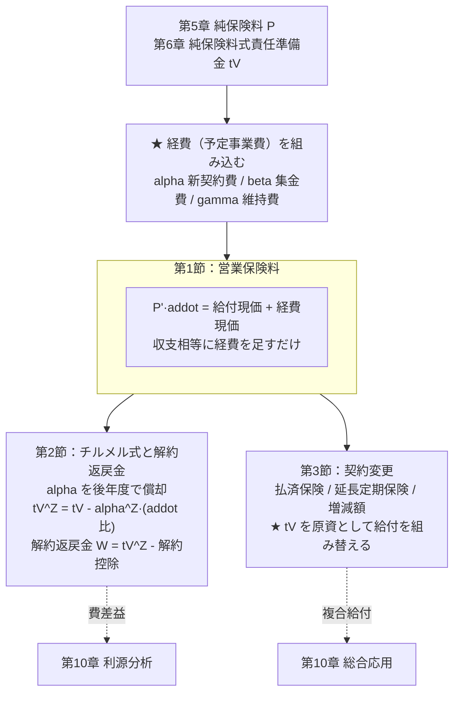
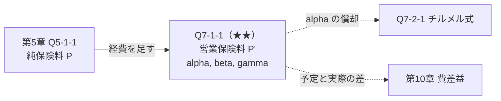
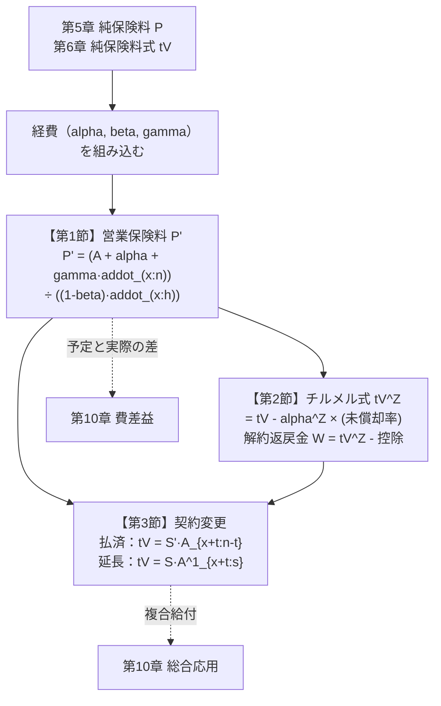
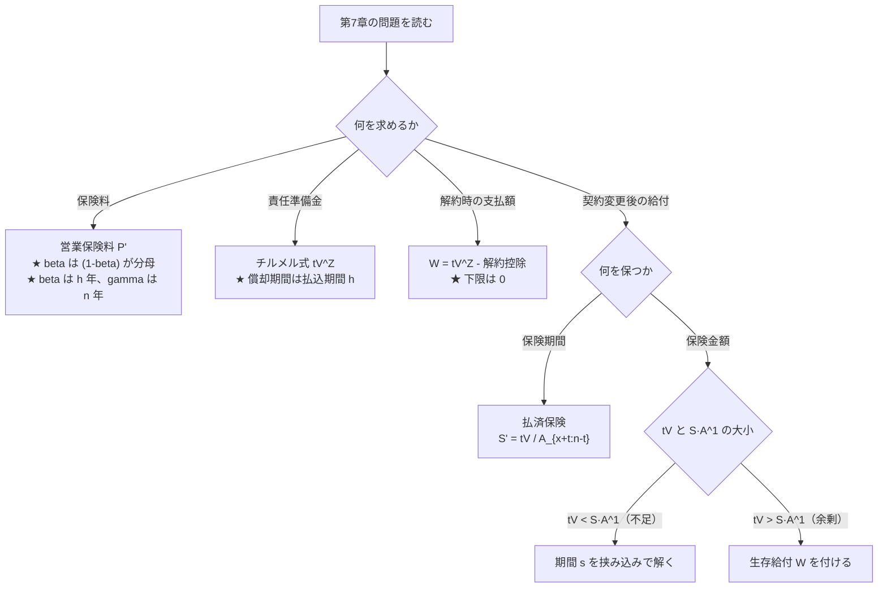

# 第7章　営業保険料と実務計算

> [← 第6章 責任準備金](第06章_責任準備金.md) ｜ **第7章** ｜ [第8章 連生と最終生存 →](第08章_連生と最終生存.md)

---

## 章の地図



**この図の読み方**：第7章は **第5章・第6章に経費を足しただけ** です。
新しい確率も新しい現価計算もありません。
唯一新しいのは第3節の **「責任準備金を原資として給付を組み替える」** という発想です。

---

## この章で学ぶこと

第5章・第6章では経費を無視した **純保険料** を扱いました。
実際の保険料には、保険会社の事業費が上乗せされます。これが **営業保険料** です。

$$\underbrace{P'}_{\text{営業保険料}}=\underbrace{P}_{\text{純保険料}}+\underbrace{\text{付加保険料}}_{\text{経費}}$$

また第3節では、契約者が「保険料を払えなくなった」「保障を変えたい」場合に、
**すでに積み立てられた責任準備金 ${}_tV$ を原資として契約を組み替える** 方法を扱います。

```text
第5・6章：契約を作る（保険料を決める、準備金を積む）
              ↓
第7章    ：契約を運営する（経費を賄う、途中で変更する）
```

---

## この章の全体像


```text
学習順序：
① 3 種類の経費の「かかり方」を区別する    …… alpha / beta / gamma
        ↓
② 収支相等の右辺に経費現価を足す
        ↓
③ alpha が第1年度に集中することの問題を知る
        ↓
④ チルメル式で alpha を後年度に償却する
        ↓
⑤ 解約返戻金を求める
        ↓
⑥ 責任準備金を原資に給付を組み替える（払済・延長）
```

---

## 最初に頭に入れるべきポイント

### 3種類の経費は「かかり方」が違う

| 記号 | 名称 | いつ | 何に比例 | 現価 |
|---|---|---|---|---|
| $\alpha$ | **新契約費** | 第1年度**のみ** | 保険金額 | $\alpha$（そのまま） |
| $\beta$ | **集金費** | 保険料を払うたび | **保険料** | $\beta P'\,\ddot a_{x:\overline{h}\vert}$ |
| $\gamma$ | **維持費** | 保険期間中毎年 | 保険金額 | $\gamma\,\ddot a_{x:\overline{n}\vert}$ |

```text
時点      0    1    2   ...   h   ...   n
          |----|----|--...---|--...----|

alpha    ■                                   ← 第1年度のみ（契約時に一括）
beta     ▲    ▲    ▲  ...   ▲              ← 保険料払込のたび（払込期間 h）
gamma    ●    ●    ●  ...   ●  ...   ●     ← 保険期間中ずっと（期間 n）

  ★ beta の期間は「払込期間 h」、gamma の期間は「保険期間 n」
    両者が違うことが最頻出の失点源
```

**$\beta$ だけが保険料に比例する**ため、$P'$ が両辺に現れます。
これが「$P'$ について解く」ひと手間を生みます。

### 営業保険料の収支相等

$$\underbrace{P'\,\ddot a_{x:\overline{h}\vert}}_{\text{収入}}
=\underbrace{A_{x:\overline{n}\vert}}_{\text{給付}}
+\underbrace{\alpha}_{\text{新契約費}}
+\underbrace{\beta\,P'\,\ddot a_{x:\overline{h}\vert}}_{\text{集金費}}
+\underbrace{\gamma\,\ddot a_{x:\overline{n}\vert}}_{\text{維持費}}$$

$P'$ を含む項を左辺にまとめます。

$$P'\left(1-\beta\right)\ddot a_{x:\overline{h}\vert}
=A_{x:\overline{n}\vert}+\alpha+\gamma\,\ddot a_{x:\overline{n}\vert}$$

$$\boxed{P'=\frac{A_{x:\overline{n}\vert}+\alpha+\gamma\,\ddot a_{x:\overline{n}\vert}}
{\left(1-\beta\right)\ddot a_{x:\overline{h}\vert}}}$$

**$(1-\beta)$ が分母に来る** のが特徴です。$\beta$ が保険料比例だからです。

### チルメルは「$\alpha$ を後年度で償却する」

**問題の所在**：$\alpha$（新契約費）は第1年度に全額発生しますが、
第1年度の保険料収入だけでは賄えません。
そのため第1年度末の営業保険料式責任準備金は **負** になります。

**解決**：$\alpha$ を「保険会社の立替」とみなし、後年度の付加保険料から回収します。
その分だけ責任準備金を **小さく** 計上するのがチルメル式です。

$$_tV^{Z}={}_tV-\alpha^{Z}\cdot
\frac{\ddot a_{x+t:\overline{h-t}\vert}}{\ddot a_{x:\overline{h}\vert}}$$

```text
   純保険料式 tV     ────────────────●
                    ／
                  ／     ← 差が「未償却の alpha」
                ／     ／
   チルメル式 tV^Z  ────●
              ／
            ●
   0 ─────────────────────────────→ t
   0                              h

  ★ 差 = alpha^Z × (残りの払込年金 / 全体の払込年金)
    払込が進むほど差は小さくなり、h 年で 0 になる
```

$\alpha^{Z}=\alpha$ とするのが **全期チルメル**、
$\alpha^{Z}<\alpha$ とするのが **一部チルメル**です。

### 契約変更は「${}_tV$ を原資に給付を買い直す」

```text
   時点 t で保険料の払込を止める
        ↓
   手元にあるのは責任準備金 tV だけ
        ↓
   これを一時払保険料として、新しい保障を買う
        ↓
   ┌─ 保険期間はそのまま、保険金額を減らす  → 払済保険
   └─ 保険金額はそのまま、保険期間を縮める  → 延長定期保険
```

| 変更 | 保つもの | 変えるもの | 式 |
|---|---|---|---|
| **払済保険** | 保険期間 $n$ | 保険金額 $S\to S'$ | ${}_tV=S'\,A_{x+t:\overline{n-t}\vert}$ |
| **延長定期保険** | 保険金額 $S$ | 保険期間 $n\to t+s$ | ${}_tV=S\,A^1_{x+t:\overline{s}\vert}$ |

**どちらも「${}_tV=$ 新しい給付の期待現価」という一時払の収支相等** です。

---

## 基本記号・基本公式

| 記号 | 意味 |
|---|---|
| $P$ | 純保険料 |
| $P'$ | **営業保険料**（本書では純保険料と区別するためプライムを付す） |
| $\alpha$ | 新契約費（第1年度のみ、保険金額比例） |
| $\beta$ | 集金費（保険料比例） |
| $\gamma$ | 維持費（保険期間中毎年、保険金額比例） |
| $\alpha^{Z}$ | チルメル割合 |
| ${}_tV^{Z}$ | チルメル式責任準備金 |
| $W$ | 解約返戻金 |
| $S'$ | 払済保険金額 |

### 営業保険料

$$P'=\frac{A_{x:\overline{n}\vert}+\alpha+\gamma\,\ddot a_{x:\overline{n}\vert}}
{\left(1-\beta\right)\ddot a_{x:\overline{h}\vert}}$$

**成立条件**：$\beta$ が保険料に比例、$\gamma$ が保険金額比例で保険期間中毎年、
$\alpha$ が契約時一括。経費の定義が違えば式も変わるので、**問題文の定義を必ず確認** します。

### チルメル式責任準備金

$$_tV^{Z}={}_tV-\alpha^{Z}\cdot\frac{\ddot a_{x+t:\overline{h-t}\vert}}{\ddot a_{x:\overline{h}\vert}}
\qquad(t\le h)$$

$t>h$（払込満了後）では ${}_tV^{Z}={}_tV$ です（償却が完了している）。

### 解約返戻金

$$W_t={}_tV^{Z}-\left(\text{解約控除}\right)$$

### 契約変更

| 変更 | 式 | 求めるもの |
|---|---|---|
| 払済保険 | ${}_tV=S'\,A_{x+t:\overline{n-t}\vert}$ | $S'=\dfrac{{}_tV}{A_{x+t:\overline{n-t}\vert}}$ |
| 延長定期保険 | ${}_tV=S\,A^1_{x+t:\overline{s}\vert}$ | $s$（期間） |
| 生存給付付延長 | ${}_tV=S\,A^1_{x+t:\overline{n-t}\vert}+W\,{}_{n-t}E_{x+t}$ | $W$（満期時の生存給付） |

---

## 試験での主な問われ方

| 出題形態 | 典型的な問われ方 | 対応する問題 |
|---|---|---|
| 小問 | $\alpha,\beta,\gamma$ から営業保険料を計算 | Q7-1-1 |
| 小問 | チルメル式責任準備金の計算 | Q7-2-1 |
| 記述式 | 純保険料式とチルメル式の差の意味 | Q7-2-1 |
| 記述式 | 払済保険金額の算出 | Q7-3-1 |
| 記述式 | 延長定期保険の期間、生存給付付延長 | Q7-3-2 |
| 他章との複合 | 費差益（第10章） | Q7-1-1 |

---

## 問題を見分けるためのサイン

| 問題文中の表現 | 判断すること |
|---|---|
| 「営業保険料」「総保険料」 | 経費込み。$P'$ |
| 「純保険料」 | 経費なし。第5章 |
| 「新契約費」「$\alpha$」「保険金額の○%」 | 契約時一括。分子にそのまま加える |
| 「集金費」「$\beta$」「保険料の○%」 | **保険料比例** → $(1-\beta)$ が分母に |
| 「維持費」「$\gamma$」「毎年、保険金額の○%」 | 保険期間中。$\gamma\ddot a_{x:\overline{n}\vert}$ |
| 「チルメル」「$\alpha$ を償却」 | ${}_tV^{Z}$。純保険料式より**小さい** |
| 「全期チルメル」 | $\alpha^{Z}=\alpha$ |
| 「解約返戻金」「解約控除」 | $W={}_tV^{Z}-$ 控除 |
| 「保険料の払込を中止して」 | **契約変更**。${}_tV$ が原資 |
| 「保険期間を変えずに保険金額を減らす」 | **払済保険** |
| 「保険金額を変えずに保険期間を短くする」 | **延長定期保険** |

**⚠ 特に注意すべき語**

* 「$\beta$ は **保険料** の○%」と「$\gamma$ は **保険金額** の○%」の違い。
* $\beta$ の期間は **払込期間 $h$**、$\gamma$ の期間は **保険期間 $n$**。
* チルメル式は純保険料式より **小さい**（負債を軽く計上する）。

---

## この章の問題一覧

| ID | 表題 | 難 | 段階 | この問題の役割 |
|---|---|---|---|---|
| **第1節　営業保険料** | | | | |
| Q7-1-1 | 予定事業費と営業保険料 | ★★ | ① | 3種類の経費の組み込み方 |
| **第2節　チルメル式と解約返戻金** | | | | |
| Q7-2-1 | チルメル式責任準備金 | ★★ | ③ | $\alpha$ の償却という発想 |
| Q7-2-2 | 解約返戻金と解約控除 | ★★ | ④ | 実務上の支払額 |
| **第3節　契約変更** | | | | |
| Q7-3-1 | 払済保険への変更 | ★★ | ③ | ${}_tV$ を原資に買い直す |
| Q7-3-2 | 延長定期保険への変更 | ★★★ | ⑤ | 期間を未知数とする。生存給付付延長 |

---
---

# 第1節　営業保険料

## この節のテーマ

**予定事業費を収支相等に組み込んで営業保険料を求める技術** を扱います。
新しい原理はなく、第5章の収支相等の右辺に経費を足すだけです。

## この節でできるようになること

* $\alpha,\beta,\gamma$ の3種類の経費を区別し、それぞれの現価を作れる
* $\beta$ が保険料比例であるため $(1-\beta)$ が分母に来ることを説明できる
* 営業保険料と純保険料の差（付加保険料）を求められる
* $\beta$ の期間（払込期間）と $\gamma$ の期間（保険期間）を区別できる

## 頭に入れるべきポイント

### 立式は「収支相等の右辺に経費現価を足す」だけ

```text
   第5章：  P × addot_(x:h)  =  給付現価
                 ↓ 経費を足す
   第7章：  P' × addot_(x:h) =  給付現価 + alpha + beta·P'·addot_(x:h) + gamma·addot_(x:n)
                                              ↑                ↑              ↑
                                          契約時一括      保険料比例      保険期間中
```

**$\beta$ の項に $P'$ が入る** ため、移項してから解きます。

### 経費の期間を取り違えない

```text
   beta（集金費）  : 保険料を払うたび     → 期間は 払込期間 h
   gamma（維持費） : 契約を維持するため    → 期間は 保険期間 n

  ★ 全期払（h = n）なら同じだが、短期払込（h < n）では違う
```

## 使用する記号・公式

$$P'\,\ddot a_{x:\overline{h}\vert}
=A_{x:\overline{n}\vert}+\alpha+\beta\,P'\,\ddot a_{x:\overline{h}\vert}
+\gamma\,\ddot a_{x:\overline{n}\vert}$$

$$P'=\frac{A_{x:\overline{n}\vert}+\alpha+\gamma\,\ddot a_{x:\overline{n}\vert}}
{\left(1-\beta\right)\ddot a_{x:\overline{h}\vert}}$$

**付加保険料**

$$P'-P=P'-\frac{A_{x:\overline{n}\vert}}{\ddot a_{x:\overline{h}\vert}}$$

## 基本的な解法パターン

```text
① 3 種類の経費の「かかり方」と「期間」を確認する
   ├─ alpha : 契約時一括、保険金額比例 → そのまま加える
   ├─ beta  : 保険料比例、期間 h      → P' が入るので移項
   └─ gamma : 保険金額比例、期間 n    → gamma·addot_(x:n)
        ↓
② 収支相等を立てる（左辺 P'·addot、右辺 給付 + 経費）
        ↓
③ P' を含む項を左辺に集める
        ↓
④ (1-beta) で割る
        ↓
⑤ 検算：P' > P、P'/P が 1.1〜1.3 程度に収まるか
```

## 間違えやすい点

| 誤り | 内容 | 防ぎ方 |
|---|---|---|
| $\beta$ の扱い | 分子に $\beta$ を足す | $\beta$ は $P'$ 比例 → $(1-\beta)$ が分母 |
| $\gamma$ の期間 | 払込期間 $h$ を使う | **保険期間 $n$** |
| $\beta$ の期間 | 保険期間 $n$ を使う | **払込期間 $h$** |
| $\alpha$ に年金を掛ける | $\alpha\,\ddot a$ とする | $\alpha$ は契約時一括 |
| $\gamma$ の比例対象 | 保険料比例とする | **保険金額**比例 |

## この節の問題の流れ



---
---

## 問題 Q7-1-1　予定事業費と営業保険料

| 項目 | 内容 |
|---|---|
| 出題年度 | `要照合`（記入欄：______年度） |
| 問題番号 | `要照合`（記入欄：問題___） |
| 分野・論点 | 営業保険料 ／ 予定事業費 |
| 難易度 | ★★ |
| この節での位置づけ | 段階①（定義を直接使う）。本章の基準となる問題 |
| 関連する問題 | 発展元：Q5-1-1（純保険料） ／ 本問 ／ 後続：Q7-2-1（チルメル）、Q10-2-1（費差益） |

### ■ この問題で押さえるべきポイント

#### ① 何を問う問題か

**3種類の予定事業費を収支相等に組み込み、営業保険料を求めさせる問題** です。
問われているのは **各経費の「かかり方」と「期間」を正しく式にできるか** です。

#### ② 問題文から読み取るべき条件

| 条件 | 解法への影響 |
|---|---|
| 「新契約費：保険金額の3%（第1年度のみ）」 | $\alpha=0.03$、契約時一括 |
| 「集金費：営業保険料の5%（払込期間中）」 | $\beta=0.05$、$P'$ 比例 → $(1-\beta)$ |
| 「維持費：保険金額の0.2%（保険期間中毎年）」 | $\gamma=0.002$、期間 $n$ |
| 「20年養老、全期払」 | $h=n=20$ |

#### ③ 最初に注目する場所

**各経費が「何に比例するか」と「いつ発生するか」**。
* 保険料比例 → $(1-\beta)$ が分母
* 保険金額比例・毎年 → $\gamma\ddot a$
* 契約時一括 → そのまま加算

#### ④ 呼び出すべき知識

| 知識 | なぜこの問題で使うか |
|---|---|
| 収支相等（第5章） | 立式の原理 |
| $A_{x:\overline{n}\vert}$、$\ddot a_{x:\overline{n}\vert}$ | 給付と払込の期待現価 |
| $\beta$ が $P'$ 比例 | 移項して $(1-\beta)$ で割る |
| 純保険料 $P$ | 付加保険料の比較対象 |

#### ⑤ 解法の骨格

```text
1. 収支相等を立てる（右辺に 3 種類の経費現価）
2. P' を含む項（左辺と beta の項）を集める
3. (1-beta)·addot で割る
4. 純保険料 P と比較して付加保険料を求める
```

#### ⑥ 間違えやすい点

* $\beta$ を分子に足す
* $\gamma$ の期間に払込期間を使う
* $\alpha$ に年金現価を掛ける
* 付加保険料を $\alpha+\beta+\gamma$ と単純加算する

#### ⑦ この問題を一言で捉えると

> **「収支相等の右辺に経費を足し、$P'$ 比例の項を左辺へ移す」だけの問題。**

### ■ 問題の構造図

```text
経費の発生パターン（x = 40, n = h = 20）：

時点      0     1     2    ...    19    20
          |-----|-----|---...----|-----|

保険料 P' ^     ^     ^    ...    ^                ← 20 回（払込期間 h=20）

alpha    ■0.03                                    ← ★ 契約時に一括のみ
beta     ▲     ▲     ▲    ...    ▲              ← 保険料のたび（0.05·P' ずつ）
gamma    ●     ●     ●    ...    ●              ← 毎年（0.002 ずつ、期間 n=20）

給付                 v1   ...    v1    v1          ← 死亡・満期


収支相等の天秤：

  【収入】  P' × addot_(40:20)
                    │
                    │ 等しい
                    │
  【支出】  A_(40:20)      ← 給付      0.561899
          + alpha          ← 新契約費  0.030000
          + beta·P'·addot  ← 集金費    0.05 × P' × 15.041461
          + gamma·addot    ← 維持費    0.002 × 15.041461 = 0.030083

  ★ beta の項に P' が入るので、左辺へ移項する
       ↓
  P'(1 - 0.05)·addot = 0.561899 + 0.030000 + 0.030083
       ↓
  P' × 0.95 × 15.041461 = 0.621982
       ↓
  P' = 0.621982 / 14.289388 = 0.0435276
```

### ■ 問題

年利率 $i=0.03$、40歳、保険期間20年、保険金額1の養老保険（全期払）について、
次の値が与えられている。

$$A_{40:\overline{20}\vert}=0.561899,\qquad \ddot a_{40:\overline{20}\vert}=15.041461,\qquad
P_{40:\overline{20}\vert}=0.0373567$$

予定事業費は次のとおりとする。

| 経費 | 内容 |
|---|---|
| 新契約費 $\alpha$ | 保険金額の $3\%$（第1年度のみ、契約時に発生） |
| 集金費 $\beta$ | 営業保険料の $5\%$（保険料払込のたび） |
| 維持費 $\gamma$ | 保険金額の $0.2\%$（保険期間中、毎年初） |

**(1)** 収支相等の原則により、営業保険料 $P'$ を求める式を立てよ。

**(2)** $P'$ について解き、一般式を示せ。

**(3)** $P'$ の値を求めよ（小数第7位まで）。

**(4)** 付加保険料 $P'-P$ を求め、営業保険料に占める割合を述べよ。

**(5)** 保険料払込期間が10年（短期払込、$\ddot a_{40:\overline{10}\vert}=8.722037$）の場合、
$\beta$ と $\gamma$ の期間はそれぞれ何年になるか述べ、$P'$ を求めよ（小数第7位まで）。

> 本問は再現題です。原文の出題年度・問題番号は未照合です。

### ■ 問題文を数理モデルへ変換

| 確認項目 | 問題文から読み取れる内容 | 数理的な表現 |
|---|---|---|
| 給付 | 20年養老、保険金額1 | $A_{40:\overline{20}\vert}=0.561899$ |
| 払込 | 毎年初、20年（全期払） | $\ddot a_{40:\overline{20}\vert}=15.041461$、$h=20$ |
| $\alpha$ | 保険金額の3%、契約時のみ | $0.03$（現価そのまま） |
| $\beta$ | 営業保険料の5%、払込のたび | $0.05\,P'\,\ddot a_{40:\overline{h}\vert}$ |
| $\gamma$ | 保険金額の0.2%、保険期間中毎年 | $0.002\,\ddot a_{40:\overline{20}\vert}$ |

### ■ 解法フロー

```text
STEP 1　(1) 収支相等を立てる
STEP 2　(2) P' について解く
STEP 3　(3) 数値を代入する
STEP 4　(4) 付加保険料と割合を求める
STEP 5　(5) 短期払込の場合の期間を区別する
```

### ■ 詳細解説

#### STEP 1　(1) 収支相等

*目的：収入と支出を契約時点で等置する。*

**収入**：営業保険料 $P'$ を毎年初に20年間払い込みます。

$$P'\,\ddot a_{40:\overline{20}\vert}$$

**支出**：給付と3種類の経費です。

| 支出 | 期待現価 |
|---|---|
| 給付 | $A_{40:\overline{20}\vert}$ |
| 新契約費 | $\alpha$（契約時に発生するので割引なし） |
| 集金費 | $\beta\,P'\,\ddot a_{40:\overline{20}\vert}$ |
| 維持費 | $\gamma\,\ddot a_{40:\overline{20}\vert}$ |

$$\boxed{P'\,\ddot a_{40:\overline{20}\vert}
=A_{40:\overline{20}\vert}+\alpha+\beta\,P'\,\ddot a_{40:\overline{20}\vert}
+\gamma\,\ddot a_{40:\overline{20}\vert}}$$

**各経費の現価の作り方**

```text
   alpha : 契約時（時点 0）に 1 回だけ
           → 割引も生存確率も不要 → そのまま 0.03

   beta  : 保険料を払う各時点（t = 0..h-1、生存中）に beta·P'
           → 保険料と同じ支払パターン → beta·P'·addot_(x:h)

   gamma : 保険期間中の各年初（t = 0..n-1、生存中）に gamma
           → gamma·addot_(x:n)
```

#### STEP 2　(2) $P'$ について解く

*目的：$P'$ を含む項を左辺に集める。*

$\beta$ の項を左辺へ移項します。

$$P'\,\ddot a_{40:\overline{20}\vert}-\beta\,P'\,\ddot a_{40:\overline{20}\vert}
=A_{40:\overline{20}\vert}+\alpha+\gamma\,\ddot a_{40:\overline{20}\vert}$$

$P'\,\ddot a$ で括ります。

$$P'\left(1-\beta\right)\ddot a_{40:\overline{20}\vert}
=A_{40:\overline{20}\vert}+\alpha+\gamma\,\ddot a_{40:\overline{20}\vert}$$

$$\boxed{P'=\frac{A_{x:\overline{n}\vert}+\alpha+\gamma\,\ddot a_{x:\overline{n}\vert}}
{\left(1-\beta\right)\ddot a_{x:\overline{h}\vert}}}$$

**$(1-\beta)$ が分母に来る意味**

```text
   保険料 P' のうち、beta = 5% は集金費に消える
        ↓
   実際に給付と他の経費に使えるのは (1 - beta) = 95% だけ
        ↓
   だから必要な保険料は 1/(1-beta) 倍になる
```

#### STEP 3　(3) 数値計算

*目的：代入する。*

**分子**

$$A_{40:\overline{20}\vert}+\alpha+\gamma\,\ddot a_{40:\overline{20}\vert}
=0.561899+0.03+0.002\times15.041461$$

$$=0.561899+0.030000+0.030083=0.621982$$

**分母**

$$\left(1-\beta\right)\ddot a_{40:\overline{20}\vert}=0.95\times15.041461=14.289388$$

**営業保険料**

$$P'=\frac{0.621982}{14.289388}=0.0435276$$

$$\boxed{P'=0.0435276}$$

**内訳の確認**

| 支出項目 | 期待現価 | 構成比 |
|---|---|---|
| 給付 $A_{40:\overline{20}\vert}$ | $0.561899$ | $85.8\%$ |
| 新契約費 $\alpha$ | $0.030000$ | $4.6\%$ |
| 維持費 $\gamma\ddot a$ | $0.030083$ | $4.6\%$ |
| 集金費 $\beta P'\ddot a$ | $0.05\times0.0435276\times15.041461=0.032734$ | $5.0\%$ |
| **合計** | $0.654716$ | $100\%$ |

**検算**：$P'\,\ddot a=0.0435276\times15.041461=0.654716$。
支出合計と一致します。✓

#### STEP 4　(4) 付加保険料

*目的：純保険料との差を求める。*

$$P'-P=0.0435276-0.0373567=0.0061709$$

$$\boxed{\text{付加保険料}=0.0061709}$$

**営業保険料に占める割合**

$$\frac{0.0061709}{0.0435276}=0.1418\quad\Rightarrow\quad14.18\%$$

**比率**

$$\frac{P'}{P}=\frac{0.0435276}{0.0373567}=1.1652$$

営業保険料は純保険料の **約 $1.17$ 倍** です。

```text
   営業保険料 P' = 0.0435276（100%）
        │
        ├─ 純保険料 P     = 0.0373567（85.82%）  → 給付に充てる
        └─ 付加保険料     = 0.0061709（14.18%）  → 経費に充てる
              ├─ alpha 相当
              ├─ beta 相当
              └─ gamma 相当
```

**⚠ 付加保険料は $\alpha+\beta+\gamma$ ではありません。**

$$\alpha+\beta+\gamma=0.03+0.05+0.002=0.082$$

これは $0.0061709$ とはまったく違います。
理由は、$\alpha$ が **保険金額に対する一括額**、$\beta$ が **保険料に対する率**、
$\gamma$ が **保険金額に対する年額** と、単位も期間もすべて異なるからです。
**単純に足すことはできません。**

#### STEP 5　(5) 短期払込の場合

*目的：$\beta$ と $\gamma$ の期間の違いを明確にする。*

払込期間が10年になっても、**保険期間は20年のまま** です。

| 経費 | 期間 | 理由 |
|---|---|---|
| $\alpha$ | 契約時のみ | 変わらず |
| $\beta$ | **10年**（払込期間 $h$） | 保険料を払うときにしか発生しない |
| $\gamma$ | **20年**（保険期間 $n$） | 契約が存続する限り維持費がかかる |

$$P'=\frac{A_{40:\overline{20}\vert}+\alpha+\gamma\,\ddot a_{40:\overline{20}\vert}}
{\left(1-\beta\right)\ddot a_{40:\overline{10}\vert}}$$

**分子は (3) と同じ** です（$\gamma$ の期間が保険期間のままだから）。

$$\text{分子}=0.621982$$

**分母だけが変わります。**

$$\left(1-\beta\right)\ddot a_{40:\overline{10}\vert}=0.95\times8.722037=8.285935$$

$$P'=\frac{0.621982}{8.285935}=0.0750648$$

$$\boxed{P'=0.0750648\quad(\text{10年払込})}$$

**全期払との比較**

$$\frac{0.0750648}{0.0435276}=1.7246$$

これは年金現価の比 $\dfrac{\ddot a_{40:\overline{20}\vert}}{\ddot a_{40:\overline{10}\vert}}
=\dfrac{15.041461}{8.722037}=1.7245$ にほぼ一致します（第5章 Q5-1-2 と同じ性質）。

**⚠ よくある誤り**：$\gamma$ の期間も10年にしてしまうこと。

$$\text{誤：}\quad\frac{0.561899+0.03+0.002\times8.722037}{0.95\times8.722037}
=\frac{0.609343}{8.285935}=0.0735395$$

正解 $0.0750648$ より $0.0015$ 小さくなります。
**保険料を払い終えても契約は続くので、維持費は保険期間中ずっとかかります。**

### ■ 答え

**(1)** $P'\,\ddot a_{40:\overline{20}\vert}
=A_{40:\overline{20}\vert}+\alpha+\beta\,P'\,\ddot a_{40:\overline{20}\vert}
+\gamma\,\ddot a_{40:\overline{20}\vert}$

**(2)** $P'=\dfrac{A_{x:\overline{n}\vert}+\alpha+\gamma\,\ddot a_{x:\overline{n}\vert}}
{\left(1-\beta\right)\ddot a_{x:\overline{h}\vert}}$

**(3)** $P'=\dfrac{0.561899+0.030000+0.030083}{0.95\times15.041461}
=\dfrac{0.621982}{14.289388}=0.0435276$

**(4)** 付加保険料 $=0.0435276-0.0373567=0.0061709$。
営業保険料に占める割合は $\dfrac{0.0061709}{0.0435276}=14.18\%$。
（$P'/P=1.1652$。なお $\alpha+\beta+\gamma$ と単純加算してはならない。
単位・期間がすべて異なるためである。）

**(5)** $\beta$ の期間は **払込期間の10年**、$\gamma$ の期間は **保険期間の20年**。
分子は変わらず、分母のみ $\ddot a_{40:\overline{10}\vert}$ になるから

$$P'=\frac{0.621982}{0.95\times8.722037}=\frac{0.621982}{8.285935}=0.0750648$$

### ■ 試験答案としての書き方

> **(1)** 収支相等の原則より、契約時点において
> $P'\,\ddot a_{40:\overline{20}\vert}=A_{40:\overline{20}\vert}+\alpha
> +\beta P'\,\ddot a_{40:\overline{20}\vert}+\gamma\,\ddot a_{40:\overline{20}\vert}$
>
> **(2)** $\beta$ の項を移項して $P'\ddot a$ で括ると
> $P'(1-\beta)\ddot a_{x:\overline{h}\vert}
> =A_{x:\overline{n}\vert}+\alpha+\gamma\ddot a_{x:\overline{n}\vert}$
> $\therefore P'=\dfrac{A_{x:\overline{n}\vert}+\alpha+\gamma\ddot a_{x:\overline{n}\vert}}
> {(1-\beta)\ddot a_{x:\overline{h}\vert}}$
>
> **(3)** 分子 $=0.561899+0.03+0.002\times15.041461=0.621982$
> 分母 $=0.95\times15.041461=14.289388$
> $\therefore P'=\dfrac{0.621982}{14.289388}=0.0435276$
>
> **(4)** $P'-P=0.0435276-0.0373567=0.0061709$
> 営業保険料に占める割合は $\dfrac{0.0061709}{0.0435276}=14.18\%$
>
> **(5)** 集金費 $\beta$ は保険料払込時にのみ発生するから期間は **10年**、
> 維持費 $\gamma$ は契約が存続する限り発生するから期間は **20年** である。
> よって分子は (3) と同一で
> $P'=\dfrac{0.621982}{0.95\times8.722037}=\dfrac{0.621982}{8.285935}=0.0750648$

### ■ 解答後に確認すること

| 項目 | 内容 |
|---|---|
| **最も重要なポイント** | $\beta$ は **保険料比例** なので $(1-\beta)$ が分母に来る。$\beta$ の期間は **払込期間 $h$**、$\gamma$ の期間は **保険期間 $n$** |
| **最初に気づくべきだった条件** | 各経費が「何に比例するか（保険金額／保険料）」と「いつ・何年間発生するか」 |
| **他の問題にも使える考え方** | ① 保険料比例の項は必ず移項して $(1-\beta)$ を作る。② 付加保険料は $\alpha+\beta+\gamma$ ではない（単位・期間が違う）。③ 払込期間を短くすると $P'$ は年金現価の比だけ増える |
| **類似問題との違い** | 第5章 Q5-1-1 は経費なし。本問は経費あり。構造は同じで右辺に項が増えただけ |
| **条件が変わった場合** | ① $\alpha$ が第1年度の保険料に比例するなら $\alpha P'$ となり $(1-\beta-\alpha)$ が分母。② $\gamma$ が払込期間中のみなら期間は $h$。③ 一時払なら分母が $(1-\beta)$ のみ |
| **復習時に思い出すこと** | $P'=\dfrac{A+\alpha+\gamma\ddot a_{x:\overline{n}\vert}}{(1-\beta)\ddot a_{x:\overline{h}\vert}}$。分子は保険期間、分母は払込期間 |

---

## 第1節　記憶用の一枚まとめ

```text
┌──────────────────────────────────────────────────────────────────────┐
│  第1節　営業保険料                                                    │
└──────────────────────────────────────────────────────────────────────┘

【問題文のサイン】
   「営業保険料」「総保険料」        → P'（経費込み）
   「新契約費」「保険金額の○%」      → alpha。契約時一括
   「集金費」「保険料の○%」          → ★ beta。P' 比例 →(1-beta)が分母
   「維持費」「毎年、保険金額の○%」  → gamma。期間は保険期間 n
        ↓
【判断する論点】
   各経費は何に比例するか
   ├─ 保険金額比例・一括 → alpha（そのまま加算）
   ├─ 保険料比例        → ★ beta（(1-beta) が分母）
   └─ 保険金額比例・毎年 → gamma（gamma·addot）
   期間は
   ├─ beta  → ★ 払込期間 h
   └─ gamma → ★ 保険期間 n     （全期払なら同じ、短期払込なら違う）
        ↓
【描くべき図】
   時点   0    1    2   ...   h   ...   n
          |----|----|--...---|--...----|
   P'     ^    ^    ^   ...   ^
   alpha  ■                              ← 契約時のみ
   beta   ▲    ▲    ▲   ...   ▲         ← 払込期間 h
   gamma  ●    ●    ●   ...   ●  ...  ●  ← 保険期間 n
        ↓
【使用する公式】
   収支相等：
     P'·addot_(x:h) = A_(x:n) + alpha + beta·P'·addot_(x:h) + gamma·addot_(x:n)
   ★ P' = ( A_(x:n) + alpha + gamma·addot_(x:n) ) / ( (1-beta)·addot_(x:h) )
              └────── 分子は保険期間 ──────┘   └─ 分母は払込期間 ─┘
   付加保険料 = P' - P     （★ alpha+beta+gamma ではない）
        ↓
【解答の基本手順】
   ① 3 経費の「比例対象」と「期間」を表に整理
   ② 収支相等を立てる
   ③ P' を含む項を左辺へ移項
   ④ (1-beta)·addot_(x:h) で割る
   ⑤ 検算：P' > P、P'/P は 1.1〜1.3 程度、支出合計 = P'·addot
        ↓
【典型的なミス】
   ⚠ beta を分子に足す              → 保険料比例なので (1-beta) が分母
   ⚠ gamma の期間に h を使う         → ★ 保険期間 n（払込満了後も維持費はかかる）
   ⚠ beta の期間に n を使う          → ★ 払込期間 h
   ⚠ alpha に addot を掛ける         → 契約時一括
   ⚠ 付加保険料 = alpha+beta+gamma   → 単位も期間も違う。足せない

【1行で】
   収支相等の右辺に経費を足すだけ。beta だけ P' 比例なので (1-beta) が分母。
   beta の期間は払込期間、gamma の期間は保険期間。
```

---
---

# 第2節　チルメル式と解約返戻金

## この節のテーマ

**新契約費 $\alpha$ を後年度で償却する会計処理（チルメル式）** と、
それにもとづく **解約返戻金** を扱います。

## この節でできるようになること

* 純保険料式責任準備金では $\alpha$ が回収できないことを説明できる
* チルメル式責任準備金を計算できる
* 純保険料式との差が「未償却の $\alpha$」であることを説明できる
* 解約返戻金 $=$ チルメル式責任準備金 $-$ 解約控除 を計算できる

## 頭に入れるべきポイント

### 問題の所在：$\alpha$ は第1年度に集中する

```text
第1年度の収支（純保険料式で考えると）：

   収入 : 営業保険料 P' = 0.0435276
   支出 : 新契約費 alpha = 0.03          ← ★ 第1年度に全額
        + 集金費 beta·P' = 0.0021764
        + 維持費 gamma   = 0.002
        ─────────────────────
        合計 = 0.0341764

   残り = 0.0435276 - 0.0341764 = 0.0093512
        ↓
   純保険料 P = 0.0373567 を積み立てるには全然足りない
        ↓
   ★ 第1年度末の責任準備金を純保険料式で積むと資金が不足する
```

**実務上の解決**：$\alpha$ を保険会社の **立替** とみなし、
後年度の付加保険料から回収します。
その分だけ責任準備金を **小さく計上** するのがチルメル式です。

### チルメル式は「未償却の $\alpha$ を引く」

$$_tV^{Z}={}_tV-\underbrace{\alpha^{Z}\cdot
\frac{\ddot a_{x+t:\overline{h-t}\vert}}{\ddot a_{x:\overline{h}\vert}}}_{\text{未償却の }\alpha}$$

```text
   alpha^Z を h 年間で均等に償却する。
   t 年度末で残っている未償却分は
        alpha^Z × ( 残りの払込年金 / 全体の払込年金 )

   t = 0 : addot 比 = 1     → 未償却 = alpha^Z（全額残っている）
   t = h : addot 比 = 0     → 未償却 = 0（償却完了）
```

| $t$ | $\ddot a$ 比 | 未償却額（$\alpha^{Z}=0.03$） | ${}_tV-{}_tV^{Z}$ |
|---|---|---|---|
| 0 | $1.0000000$ | $0.0300000$ | $0.0300000$ |
| 5 | $0.8034335$ | $0.0241030$ | $0.0241030$ |
| 10 | $0.5757179$ | $0.0172715$ | $0.0172715$ |
| 15 | $0.3109143$ | $0.0093274$ | $0.0093274$ |
| 20 | $0.0000000$ | $0.0000000$ | $0.0000000$ |

### チルメル式は純保険料式より必ず小さい

$$_tV^{Z}\le{}_tV$$

**意味**：チルメル式は負債を軽く計上します。
これは保険会社にとって有利（自己資本が厚く見える）ですが、
**契約者保護の観点からは望ましくない** ため、
監督上は $\alpha^{Z}$ の上限が定められます（一部チルメル）。

## 使用する記号・公式

| 記号 | 意味 |
|---|---|
| $\alpha^{Z}$ | チルメル割合。全期チルメルなら $\alpha^{Z}=\alpha$ |
| ${}_tV^{Z}$ | チルメル式責任準備金 |
| $W_t$ | 解約返戻金 |

$$_tV^{Z}={}_tV-\alpha^{Z}\cdot\frac{\ddot a_{x+t:\overline{h-t}\vert}}{\ddot a_{x:\overline{h}\vert}}
\qquad(0\le t\le h)$$

$$W_t={}_tV^{Z}-\left(\text{解約控除}\right)$$

**$t>h$ のとき**：$\ddot a_{x+t:\overline{h-t}\vert}=0$ なので ${}_tV^{Z}={}_tV$。

## 基本的な解法パターン

```text
① 純保険料式責任準備金 tV を求める（第6章）
        ↓
② チルメル割合 alpha^Z を確認する（全期か一部か）
        ↓
③ 未償却額 = alpha^Z × addot_{x+t:h-t} / addot_(x:h)
        ↓
④ tV^Z = tV - 未償却額
        ↓
⑤ 解約返戻金なら、さらに解約控除を引く
        ↓
⑥ 検算：tV^Z ≤ tV、t = h で一致、t = 0 で tV^Z = -alpha^Z（負になりうる）
```

## 間違えやすい点

| 誤り | 内容 | 防ぎ方 |
|---|---|---|
| 符号 | $\alpha^{Z}$ を足す | 引く（負債を軽くする） |
| 年金の期間 | 保険期間 $n$ を使う | **払込期間 $h$** |
| $t>h$ の扱い | 償却を続ける | $t>h$ では ${}_tV^{Z}={}_tV$ |
| 解約控除 | チルメル式に足す | 引く |
| ${}_0V^{Z}$ が負 | 誤りと思う | 正しい（$\alpha^{Z}$ の立替を表す） |

## この節の問題の流れ


---
---

## 問題 Q7-2-1　チルメル式責任準備金

| 項目 | 内容 |
|---|---|
| 出題年度 | `要照合`（記入欄：______年度） |
| 問題番号 | `要照合`（記入欄：問題___） |
| 分野・論点 | 責任準備金 ／ チルメル式 |
| 難易度 | ★★ |
| この節での位置づけ | 段階③（複数の論点を組み合わせる）。第6章の準備金に第7章の経費を組み込む |
| 関連する問題 | 発展元：Q6-1-1、Q7-1-1 ／ 本問 ／ 後続：Q7-2-2、Q7-3-1 |

### ■ この問題で押さえるべきポイント

#### ① 何を問う問題か

**新契約費 $\alpha$ を後年度で償却したチルメル式責任準備金を求めさせる問題** です。

問われているのは **「なぜ純保険料式では困るのか」という背景の理解** と、
**未償却額の計算** です。

#### ② 問題文から読み取るべき条件

| 条件 | 解法への影響 |
|---|---|
| 「全期チルメル」 | $\alpha^{Z}=\alpha=0.03$ |
| 「一部チルメル、$\alpha^{Z}=0.02$」 | $\alpha^{Z}$ を指定値に |
| 「払込期間20年」 | 償却期間は **払込期間 $h$** |
| 「純保険料式責任準備金 ${}_tV$」 | 出発点（第6章で計算済み） |

#### ③ 最初に注目する場所

**償却期間が「払込期間 $h$」であること**。
保険期間 $n$ ではありません（保険料が入らなければ償却できないため）。

#### ④ 呼び出すべき知識

| 知識 | なぜこの問題で使うか |
|---|---|
| ${}_tV$（第6章） | 出発点 |
| ${}_tV^{Z}={}_tV-\alpha^{Z}\dfrac{\ddot a_{x+t:\overline{h-t}\vert}}{\ddot a_{x:\overline{h}\vert}}$ | 本問の中心 |
| 年金比式 ${}_tV=1-\dfrac{\ddot a_{x+t:\overline{n-t}\vert}}{\ddot a_{x:\overline{n}\vert}}$ | ${}_tV$ を年金から作る場合 |
| $P'$（Q7-1-1） | 第1年度の収支を検討する場合 |

#### ⑤ 解法の骨格

```text
1. 純保険料式 tV を用意する
2. 未償却率 = addot_{x+t:h-t} / addot_(x:h) を計算
3. 未償却額 = alpha^Z × 未償却率
4. tV^Z = tV - 未償却額
5. t = 0 と t = h で検算
```

#### ⑥ 間違えやすい点

* 符号を逆にする
* 償却期間に保険期間 $n$ を使う
* ${}_0V^{Z}$ が負になるのを誤りと思う
* $t>h$ でも償却を続ける

#### ⑦ この問題を一言で捉えると

> **「純保険料式から、まだ回収していない $\alpha$ を引く」だけの問題。**

### ■ 問題の構造図

```text
チルメル式と純保険料式の関係：

  tV ↑
  1.0┤                                        ●● ← t = 20 で一致
     │                                    ●●
     │                              ●●          純保険料式 tV
     │                        ●●○
  0.5┤                  ●●○○           ○ チルメル式 tV^Z
     │            ●●○○
     │      ●●○○
    0┤●○○
     │○      ← ★ 0V^Z = -alpha^Z = -0.03（負）
 -0.03└────────────────────────────────→ t
     0     5    10    15    20

  差 = alpha^Z × ( addot_{x+t:h-t} / addot_(x:h) )
     t=0  : 0.03 × 1.000 = 0.0300  ← 全額未償却
     t=10 : 0.03 × 0.576 = 0.0173
     t=20 : 0.03 × 0.000 = 0.0000  ← 償却完了


なぜ 0V^Z が負なのか：

   契約時点で保険会社は alpha = 0.03 を支出済み
        ↓
   まだ 1 円も保険料を受け取っていない（正確には第1回保険料は受領）
        ↓
   会計上は「立替金 0.03」を資産として持ち、
   責任準備金は -0.03 として表される
        ↓
   ★ これは誤りではなく、チルメル式の正しい挙動
```

### ■ 問題

年利率 $i=0.03$、40歳、保険期間20年、保険料払込期間20年（全期払）、
保険金額1の養老保険について、次の値が与えられている。

$$\ddot a_{40:\overline{20}\vert}=15.041461,\qquad
\ddot a_{45:\overline{15}\vert}=12.084814,\qquad
\ddot a_{50:\overline{10}\vert}=8.659639,\qquad
\ddot a_{55:\overline{5}\vert}=4.676605$$

純保険料式責任準備金は

$$_5V=0.1965665,\qquad{}_{10}V=0.4242821,\qquad{}_{15}V=0.6890857$$

新契約費は $\alpha=0.03$（保険金額の $3\%$）である。

**(1)** 純保険料式責任準備金を用いた場合、第1年度に資金不足が生じる理由を、
Q7-1-1 で求めた営業保険料 $P'=0.0435276$、
$\beta=0.05$、$\gamma=0.002$ を用いて具体的に述べよ。

**(2)** 全期チルメル（$\alpha^{Z}=\alpha=0.03$）における
${}_5V^{Z}$、${}_{10}V^{Z}$、${}_{15}V^{Z}$ を求めよ（小数第7位まで）。

**(3)** ${}_0V^{Z}$ および ${}_{20}V^{Z}$ を求め、それぞれの意味を述べよ。

**(4)** 一部チルメル（$\alpha^{Z}=0.02$）とした場合の ${}_{10}V^{Z}$ を求めよ（小数第7位まで）。

**(5)** チルメル式が純保険料式より小さくなることの、
保険会社および契約者にとっての意味を述べよ。

> 本問は再現題です。原文の出題年度・問題番号は未照合です。

### ■ 問題文を数理モデルへ変換

| 確認項目 | 問題文から読み取れる内容 | 数理的な表現 |
|---|---|---|
| 払込期間 | 20年（全期払） | $h=20$。償却期間も20年 |
| $\alpha$ | 保険金額の3% | $\alpha=0.03$ |
| 全期チルメル | $\alpha$ を全額償却対象に | $\alpha^{Z}=0.03$ |
| 一部チルメル | 償却対象を制限 | $\alpha^{Z}=0.02$ |
| 未償却率 | 残りの払込 ÷ 全体の払込 | $\dfrac{\ddot a_{x+t:\overline{h-t}\vert}}{\ddot a_{x:\overline{h}\vert}}$ |

### ■ 解法フロー

```text
STEP 1　(1) 第1年度の収支を計算して不足を示す
STEP 2　(2) 未償却率を計算し、tV^Z を求める
STEP 3　(3) 境界（t=0、t=h）の値と意味
STEP 4　(4) 一部チルメルの場合
STEP 5　(5) 会計上・契約者保護上の意味
```

### ■ 詳細解説

#### STEP 1　(1) 第1年度の資金不足

*目的：純保険料式が実務的に困難な理由を数値で示す。*

**第1年度の収入**

$$P'=0.0435276$$

**第1年度の支出（経費）**

| 経費 | 額 |
|---|---|
| 新契約費 $\alpha$ | $0.0300000$ |
| 集金費 $\beta P'$ | $0.05\times0.0435276=0.0021764$ |
| 維持費 $\gamma$ | $0.0020000$ |
| **合計** | $0.0341764$ |

**経費支払後に残る額**

$$0.0435276-0.0341764=0.0093512$$

**必要な積立額**：純保険料式で責任準備金を積むには、
純保険料 $P=0.0373567$ を給付と積立に充てる必要があります。

$$\text{不足額}=0.0373567-0.0093512=0.0280055$$

$$\boxed{\text{第1年度の不足額}\approx0.0280}$$

**この不足は、ほぼ $\alpha=0.03$ に対応** しています。

```text
   営業保険料 P'      = 0.0435276
        │
        ├─ 経費 0.0341764（うち alpha が 0.03 で大半）
        └─ 残り 0.0093512
                 ↓
   純保険料 P = 0.0373567 が必要
                 ↓
   不足 0.0280055 ≒ alpha 0.03
        ↓
   ★ alpha を第1年度に全額費用計上すると資金が回らない
     → 後年度で償却する（チルメル式）
```

**実務的な意味**：保険会社は新契約獲得のため
募集手数料・診査費用等を契約時に支出します。
これを第1年度だけで回収しようとすると、
**新契約を取れば取るほど資金繰りが悪化** します（新契約費負担の問題）。
チルメル式はこれを会計的に平準化する仕組みです。

#### STEP 2　(2) 全期チルメルの計算

*目的：未償却率を計算して差し引く。*

**未償却率** $=\dfrac{\ddot a_{x+t:\overline{h-t}\vert}}{\ddot a_{40:\overline{20}\vert}}$

| $t$ | $\ddot a_{40+t:\overline{20-t}\vert}$ | 未償却率 | 未償却額 $0.03\times$率 |
|---|---|---|---|
| 5 | $12.084814$ | $\dfrac{12.084814}{15.041461}=0.8034335$ | $0.0241030$ |
| 10 | $8.659639$ | $\dfrac{8.659639}{15.041461}=0.5757179$ | $0.0172715$ |
| 15 | $4.676605$ | $\dfrac{4.676605}{15.041461}=0.3109143$ | $0.0093274$ |

**チルメル式責任準備金**

$$_5V^{Z}=0.1965665-0.0241030=0.1724635$$

$$_{10}V^{Z}=0.4242821-0.0172715=0.4070106$$

$$_{15}V^{Z}=0.6890857-0.0093274=0.6797583$$

$$\boxed{{}_5V^{Z}=0.1724635,\quad{}_{10}V^{Z}=0.4070106,\quad{}_{15}V^{Z}=0.6797583}$$

**差が縮小していく** ことに注目してください（$0.0241\to0.0173\to0.0093$）。
払込が進むほど $\alpha$ の償却が進むためです。

#### STEP 3　(3) 境界での値

*目的：$t=0$ と $t=h$ の意味を確認する。*

**${}_0V^{Z}$**

$t=0$ では $\ddot a_{40:\overline{20}\vert}/\ddot a_{40:\overline{20}\vert}=1$ なので

$$_0V^{Z}={}_0V-0.03\times1=0-0.03=-0.03$$

$$\boxed{{}_0V^{Z}=-0.03}$$

**意味**：契約時点で保険会社は新契約費 $\alpha=0.03$ を支出しています。
この時点では **まだ回収されていない立替金** であり、
責任準備金は $-0.03$（負債がマイナス＝実質的な資産）として表されます。

**⚠ 負の責任準備金は誤りではありません。**
チルメル式の定義上、$t=0$ では必ず $-\alpha^{Z}$ になります。
ただし実務では、責任準備金を負で計上することは認められないため、
**$0$ で下限を切る**（$\max({}_tV^{Z},0)$）扱いをすることがあります。

**${}_{20}V^{Z}$**

$t=20=h$ では $\ddot a_{60:\overline{0}\vert}=0$ なので

$$_{20}V^{Z}={}_{20}V-0.03\times0=1-0=1$$

$$\boxed{{}_{20}V^{Z}=1}$$

**意味**：払込満了時には $\alpha$ の償却が完了しており、
**純保険料式と一致** します。満期保険金 $1$ を支払う原資が確保されています。

```text
   償却の進行：

   t     0      5      10     15     20
   未償却 0.0300 0.0241 0.0173 0.0093 0.0000
         ↑                            ↑
      全額残る                    償却完了

   ★ 20 年かけて 0.03 を均等に（年金現価の比で）償却する
```

#### STEP 4　(4) 一部チルメル

*目的：$\alpha^{Z}$ を小さくした場合。*

$\alpha^{Z}=0.02$ とすると、未償却率は同じで償却対象額だけが変わります。

$$_{10}V^{Z}=0.4242821-0.02\times0.5757179=0.4242821-0.0115144=0.4127677$$

$$\boxed{{}_{10}V^{Z}=0.4127677\quad(\alpha^{Z}=0.02)}$$

**比較**

| $\alpha^{Z}$ | ${}_{10}V^{Z}$ | 純保険料式との差 |
|---|---|---|
| $0$（純保険料式） | $0.4242821$ | $0$ |
| $0.02$（一部チルメル） | $0.4127677$ | $0.0115144$ |
| $0.03$（全期チルメル） | $0.4070106$ | $0.0172715$ |

**$\alpha^{Z}$ が大きいほど責任準備金は小さくなります。**

**監督上の意味**：$\alpha^{Z}$ に上限を設けることで、
責任準備金が過小になりすぎることを防ぎます。
日本では標準責任準備金制度のもと、
チルメル期間や $\alpha^{Z}$ の水準に規制があります。

#### STEP 5　(5) チルメル式が小さいことの意味

*目的：会計上・監督上の含意を述べる。*

**保険会社にとって**

| 観点 | 内容 |
|---|---|
| 資金繰り | $\alpha$ を後年度で回収できるため、新契約獲得時の負担が軽くなる |
| 財務諸表 | 責任準備金（負債）が小さくなり、**自己資本が厚く見える** |
| 事業展開 | 新契約を積極的に獲得しやすくなる |

**契約者にとって**

| 観点 | 内容 |
|---|---|
| 解約時 | 解約返戻金の原資が **小さくなる**（Q7-2-2） |
| 保護 | 責任準備金が小さい＝会社の支払余力が実質的に低い可能性 |

```text
   チルメル式 tV^Z < 純保険料式 tV
        │
        ├─ 保険会社：負債が小さい → 有利
        └─ 契約者  ：解約返戻金の原資が小さい → 不利
                          ↓
        ★ 利害が対立するため、監督当局が alpha^Z に上限を設ける
          （契約者保護の観点）
```

**バランスの取り方**：チルメルを認めないと新規契約の獲得が困難になり、
保険市場が機能しなくなります。一方、無制限に認めると契約者保護が損なわれます。
そのため **一部チルメル（$\alpha^{Z}<\alpha$）や
チルメル期間の制限** という形で妥協点が設けられています。

### ■ 答え

**(1)** 第1年度の営業保険料収入 $0.0435276$ に対し、
経費は $\alpha=0.03$、$\beta P'=0.0021764$、$\gamma=0.002$ の合計 $0.0341764$。
残りは $0.0093512$ にすぎず、純保険料 $P=0.0373567$ に $0.0280055$ 不足する。
この不足はほぼ $\alpha=0.03$ に対応しており、
新契約費を第1年度に全額費用計上すると資金が不足することを示している。

**(2)**

| $t$ | 未償却率 | 未償却額 | ${}_tV^{Z}$ |
|---|---|---|---|
| 5 | $0.8034335$ | $0.0241030$ | $0.1724635$ |
| 10 | $0.5757179$ | $0.0172715$ | $0.4070106$ |
| 15 | $0.3109143$ | $0.0093274$ | $0.6797583$ |

**(3)** ${}_0V^{Z}=0-0.03\times1=-0.03$。
契約時点で新契約費 $\alpha$ を支出済みだが未回収であることを表す（立替金）。
${}_{20}V^{Z}=1-0.03\times0=1$。
払込満了時には償却が完了し純保険料式と一致する。

**(4)** ${}_{10}V^{Z}=0.4242821-0.02\times0.5757179=0.4127677$

**(5)** チルメル式は責任準備金（負債）を小さく計上するため、
保険会社にとっては新契約費の負担が平準化され資金繰りと財務指標が改善する。
一方、契約者にとっては解約返戻金の原資が小さくなり不利である。
両者の利害が対立するため、監督上 $\alpha^{Z}$ の水準やチルメル期間に
制限が設けられる（一部チルメル）。

### ■ 試験答案としての書き方

> **(1)** 第1年度の収入は $P'=0.0435276$。
> 支出は $\alpha=0.03$、$\beta P'=0.05\times0.0435276=0.0021764$、$\gamma=0.002$ で
> 合計 $0.0341764$。残額は $0.0093512$ であり、
> 純保険料 $P=0.0373567$ に対し $0.0280055$ 不足する。
> この不足はほぼ $\alpha$ に等しく、新契約費を第1年度に全額計上すると
> 資金が確保できないことを示す。
>
> **(2)** ${}_tV^{Z}={}_tV-\alpha^{Z}\dfrac{\ddot a_{40+t:\overline{20-t}\vert}}{\ddot a_{40:\overline{20}\vert}}$ より
> ${}_5V^{Z}=0.1965665-0.03\times\dfrac{12.084814}{15.041461}
> =0.1965665-0.0241030=0.1724635$
> ${}_{10}V^{Z}=0.4242821-0.03\times\dfrac{8.659639}{15.041461}
> =0.4242821-0.0172715=0.4070106$
> ${}_{15}V^{Z}=0.6890857-0.03\times\dfrac{4.676605}{15.041461}
> =0.6890857-0.0093274=0.6797583$
>
> **(3)** ${}_0V^{Z}=0-0.03\times1=-0.03$。新契約費の未回収分（立替）を表す。
> ${}_{20}V^{Z}=1-0.03\times0=1$。償却完了により純保険料式と一致する。
>
> **(4)** ${}_{10}V^{Z}=0.4242821-0.02\times0.5757179=0.4127677$
>
> **(5)** チルメル式は負債を小さく計上するため保険会社には有利だが、
> 解約返戻金の原資が減るため契約者には不利である。
> 利害が対立するため、監督上 $\alpha^{Z}$ に上限が設けられる。

### ■ 解答後に確認すること

| 項目 | 内容 |
|---|---|
| **最も重要なポイント** | ${}_tV^{Z}={}_tV-\alpha^{Z}\times$（未償却率）。未償却率の分母・分子はともに **払込期間** の年金。引き算であり ${}_tV^{Z}\le{}_tV$ |
| **最初に気づくべきだった条件** | 償却期間は **払込期間 $h$**（保険期間 $n$ ではない）。保険料が入らなければ償却できないため |
| **他の問題にも使える考え方** | ① ${}_0V^{Z}=-\alpha^{Z}$（負でよい）、${}_hV^{Z}={}_hV$（償却完了）。境界で検算できる。② 「会計上の平準化」という発想は費差益（第10章）でも使う |
| **類似問題との違い** | 第6章 Q6-1-1 は純保険料式。本問は経費を組み込んだ実務上の準備金。差は $\alpha$ の未償却分のみ |
| **条件が変わった場合** | ① $t>h$ なら ${}_tV^{Z}={}_tV$。② 一部チルメルなら $\alpha^{Z}<\alpha$ で差が小さい。③ チルメル期間を $h$ より短く設定する制度もある（その場合は分母が短い年金になる） |
| **復習時に思い出すこと** | ${}_tV^{Z}={}_tV-\alpha^{Z}\dfrac{\ddot a_{x+t:\overline{h-t}\vert}}{\ddot a_{x:\overline{h}\vert}}$ |

---
---

## 問題 Q7-2-2　解約返戻金と解約控除

| 項目 | 内容 |
|---|---|
| 出題年度 | `要照合`（記入欄：______年度） |
| 問題番号 | `要照合`（記入欄：問題___） |
| 分野・論点 | 実務計算 ／ 解約返戻金 |
| 難易度 | ★★ |
| この節での位置づけ | 段階④（問題文の読み替えが必要）。会計上の準備金から実際の支払額へ |
| 関連する問題 | 発展元：Q7-2-1 ／ 本問 ／ 後続：Q7-3-1（払済保険の原資） |

### ■ この問題で押さえるべきポイント

#### ① 何を問う問題か

**解約時に契約者へ支払う額（解約返戻金）を求めさせる問題** です。

$$W_t={}_tV^{Z}-\left(\text{解約控除}\right)$$

というだけの式ですが、**「なぜ控除するのか」** と
**「どの準備金を基準にするのか」** を理解しているかが問われます。

#### ② 問題文から読み取るべき条件

| 条件 | 解法への影響 |
|---|---|
| 「解約返戻金」 | ${}_tV^{Z}$ から控除を引く |
| 「解約控除は保険金額の $2\%$」 | 定額控除 $0.02$ |
| 「解約控除は責任準備金の $\bigcirc\%$」 | 比例控除 |
| 「チルメル式による」 | 基準は ${}_tV^{Z}$（${}_tV$ ではない） |

#### ③ 最初に注目する場所

**基準となる責任準備金が純保険料式かチルメル式か**。
実務では **チルメル式** が基準です。

#### ④ 呼び出すべき知識

| 知識 | なぜこの問題で使うか |
|---|---|
| ${}_tV^{Z}$（Q7-2-1） | 解約返戻金の原資 |
| 解約控除の意味 | 未回収経費・逆選択への対応 |
| ${}_tV^{Z}\le{}_tV$ | 解約返戻金が準備金より小さい理由 |

#### ⑤ 解法の骨格

```text
1. チルメル式責任準備金 tV^Z を求める
2. 解約控除の定義を確認する（定額か比例か）
3. 引く
4. 負にならないか確認する（負なら 0）
```

#### ⑥ 間違えやすい点

* 純保険料式 ${}_tV$ を基準にする
* 解約控除を足す
* 解約返戻金が負になるのを放置する（$0$ が下限）
* 既払保険料総額と比較して「元本割れ」を誤りと思う

#### ⑦ この問題を一言で捉えると

> **「チルメル式責任準備金から解約控除を引く」だけ。基準がどちらの準備金かを間違えない。**

### ■ 問題の構造図

```text
解約時の資金の流れ：

   契約者が t 年度末に解約
        ↓
   保険会社が保有しているのは tV^Z（チルメル式）
        ↓
   ここから解約控除を引く
        ↓
   解約返戻金 W = tV^Z - 解約控除


3 つの水準の比較（t = 10）：

   純保険料式    tV   = 0.4242821    ← 会計上の理論値
        │ - 未償却 alpha 0.0172715
        ↓
   チルメル式    tV^Z = 0.4070106    ← 実務上の準備金
        │ - 解約控除 0.02
        ↓
   解約返戻金    W    = 0.3870106    ← 契約者が受け取る額

   既払保険料総額（参考）= P' × 10 = 0.435276
        ↓
   ★ W = 0.387 < 既払 0.435 → いわゆる「元本割れ」
     これは異常ではなく、10 年間の保障を受けていた対価が含まれるため


解約控除の理由：

  ① 未回収の新契約費（チルメルでも完全には回収できていない）
  ② 逆選択への対応
     （健康な人ほど解約しやすい → 残る契約の死亡率が悪化）
  ③ 解約に伴う事務コスト
  ④ 資産を売却して現金化するコスト
```

### ■ 問題

Q7-2-1 と同じ契約（40歳、20年養老、全期払、保険金額1、全期チルメル $\alpha^{Z}=0.03$）について、
次の値が与えられている。

$$_{10}V=0.4242821,\qquad{}_{10}V^{Z}=0.4070106,\qquad P'=0.0435276$$

解約控除は保険金額の $2\%$ とする。

**(1)** 10年度末に解約した場合の解約返戻金 $W_{10}$ を求めよ（小数第7位まで）。

**(2)** 純保険料式責任準備金 ${}_{10}V$ を基準に計算した場合との差を求めよ。
実務上どちらを基準とすべきか述べよ。

**(3)** 既払保険料総額（$P'\times10$）と $W_{10}$ を比較し、
差が生じる理由を述べよ。

**(4)** 解約控除を設ける理由を3つ以上挙げよ。

**(5)** 契約初期（たとえば $t=1$ で ${}_1V=0.0370483$、
$\ddot a_{41:\overline{19}\vert}=14.484200$）における
$W_1$ を求め、その符号について述べよ。

> 本問は再現題です。原文の出題年度・問題番号は未照合です。

### ■ 問題文を数理モデルへ変換

| 確認項目 | 問題文から読み取れる内容 | 数理的な表現 |
|---|---|---|
| 基準 | チルメル式 | ${}_{10}V^{Z}=0.4070106$ |
| 解約控除 | 保険金額の2% | $0.02$（定額） |
| 解約返戻金 | 実際の支払額 | $W={}_tV^{Z}-0.02$ |
| (5) 初期 | $t=1$ | ${}_1V^{Z}$ を先に求める必要がある |

### ■ 解法フロー

```text
STEP 1　(1) チルメル式から控除を引く
STEP 2　(2) 純保険料式基準との差
STEP 3　(3) 既払保険料との比較
STEP 4　(4) 解約控除の理由
STEP 5　(5) 契約初期の解約返戻金と符号
```

### ■ 詳細解説

#### STEP 1　(1) 解約返戻金

$$W_{10}={}_{10}V^{Z}-\left(\text{解約控除}\right)=0.4070106-0.02$$

$$\boxed{W_{10}=0.3870106}$$

**保険金額が1000万円なら** $387.01$ 万円です。

#### STEP 2　(2) 基準の違い

*目的：どちらの準備金を基準にするかで差が出ることを確認する。*

純保険料式を基準にすると

$$W_{10}^{\text{（純保険料式基準）}}=0.4242821-0.02=0.4042821$$

**差**

$$0.4042821-0.3870106=0.0172715$$

これは Q7-2-1 で求めた **未償却の $\alpha$** そのものです。

**実務上はチルメル式を基準とすべき**

**理由**：解約返戻金は「保険会社が実際に保有している資産」から支払われます。
新契約費 $\alpha$ は既に支出済みで、まだ回収されていません。
純保険料式を基準にすると、**未回収の $\alpha$ まで契約者に払い戻す** ことになり、
保険会社に損失が生じます。

```text
   保険会社が実際に持っている額 ≒ tV^Z = 0.4070106
        ↓
   純保険料式 tV = 0.4242821 を基準にすると
   0.0172715 だけ「持っていない額」を払うことになる
        ↓
   ★ 残る契約者（解約しない人）の負担になる
     → 契約者間の公平を欠く
```

#### STEP 3　(3) 既払保険料との比較

*目的：いわゆる「元本割れ」の意味を説明する。*

**既払保険料総額**

$$P'\times10=0.0435276\times10=0.435276$$

**解約返戻金**

$$W_{10}=0.3870106$$

**差**

$$0.435276-0.3870106=0.0482654$$

既払保険料の **約 $11.1\%$** が戻ってきません。

**差が生じる理由**

| 理由 | 内容 |
|---|---|
| **① 10年分の保障の対価** | この10年間、死亡していれば保険金 $1$ が支払われた。その保障サービスを受けていた |
| **② 経費** | $\alpha$（新契約費）、$\beta$（集金費）、$\gamma$（維持費）が既に費消されている |
| **③ 解約控除** | $0.02$ |
| **④ 単純合計は割引を無視** | 既払保険料の「総額」は割引していない。期待現価で比べるべき |

**⚠ ④が最も重要な視点です。**

```text
   既払保険料「総額」 = 0.0435276 × 10 = 0.435276  ← 割引していない
   既払保険料「現価」 = P' × addot_(40:10)
                     = 0.0435276 × 8.722037 = 0.379649  ← 割引した値

   ★ 現価で比べれば W = 0.387 > 0.380 であり、
     「元本割れ」しているわけではない
```

**説明の要点**：単純な総額比較は、
**利息と保障の対価を無視している** ため誤解を招きます。
保険は貯蓄商品ではなく、保障を購入した対価が含まれています。

#### STEP 4　(4) 解約控除の理由

| # | 理由 | 説明 |
|---|---|---|
| **①** | **未回収の新契約費** | チルメル式でも償却は途中。$t$ 年度末で未回収分が残っている |
| **②** | **逆選択への対応** | 健康な人ほど解約しやすい（他社に乗り換えられる）。解約が増えると **残った契約の死亡率が悪化** し、収支が悪化する |
| **③** | **解約事務のコスト** | 解約手続き・返戻金支払の事務費用 |
| **④** | **資産売却のコスト** | 保険料は長期資産で運用されている。解約に応じるには資産を売却する必要があり、市場環境によっては損失が出る（**解約リスク**） |
| **⑤** | **契約者間の公平** | 早期に解約する契約者が有利にならないようにする |

**②の逆選択がとくに重要です。**

```text
   解約する人：健康で他社に移れる人が多い
   残る人  ：健康状態が悪く他社に移れない人が多い
        ↓
   残った集団の死亡率が予定より高くなる
        ↓
   死差損が発生する
        ↓
   ★ その分を解約控除で先取りしておく
```

#### STEP 5　(5) 契約初期の解約返戻金

*目的：初期には解約返戻金が $0$（またはごく小さい）ことを確認する。*

**${}_1V^{Z}$ を求める**

$$_1V^{Z}={}_1V-\alpha^{Z}\frac{\ddot a_{41:\overline{19}\vert}}{\ddot a_{40:\overline{20}\vert}}
=0.0370483-0.03\times\frac{14.484200}{15.041461}$$

$$\frac{14.484200}{15.041461}=0.9629517$$

（この比が $1-{}_1V=1-0.0370483=0.9629517$ に一致するのは、
年金比式 ${}_tV=1-\dfrac{\ddot a_{x+t:\overline{n-t}\vert}}{\ddot a_{x:\overline{n}\vert}}$（第6章 Q6-1-1）
による。全期払では償却の分母・分子が責任準備金の年金比とそのまま対応する。）

$$_1V^{Z}=0.0370483-0.03\times0.9629517=0.0370483-0.0288886=0.0081597$$

**解約返戻金**

$$W_1={}_1V^{Z}-0.02=0.0081597-0.02=-0.0118403$$

$$\boxed{W_1=-0.0118403\ \longrightarrow\ \text{実際には }W_1=0}$$

**符号について**：計算上は **負** になります。

**意味**：契約1年目では、
* チルメル式責任準備金がまだ $0.0082$ しかない
* 解約控除 $0.02$ の方が大きい

したがって **解約しても契約者に返すものがない** ということです。

**実務上の扱い**：解約返戻金は負にできないので、**$0$ を下限** とします。

$$W_t=\max\left({}_tV^{Z}-\left(\text{解約控除}\right),\ 0\right)$$

```text
   解約返戻金の推移：

   W ↑
     │                                    ●
     │                              ●
     │                        ●
     │                  ●
     │            ●
     │      ●
   0 ┼──●──────────────────────────────→ t
     0  ↑ 2  4    6    8   10
        ★ 初期は 0（返戻金なし）

  ★ 「契約後まもなく解約すると解約返戻金がない」のは、
    新契約費が未回収であることによる正常な帰結
```

**契約者への説明責任**：この性質は契約者にとって不利益となりうるため、
契約時に **解約返戻金がない期間があること** を明示する必要があります。
（無解約返戻金型の保険では、この仕組みを商品設計に組み込んで保険料を下げています。）

### ■ 答え

| 設問 | 量 | 値 |
|---|---|---|
| (1) | $W_{10}$ | $0.3870106$ |
| (2) | 純保険料式基準との差 | $0.0172715$（＝未償却の $\alpha$） |
| (3) | 既払保険料総額 $-W_{10}$ | $0.0482654$ |
| (5) | $W_1$（計算値） | $-0.0118403$ → 実務上は $0$ |

**(2)** 実務では **チルメル式** を基準とすべき。
純保険料式を基準にすると、未回収の新契約費まで払い戻すことになり、
その負担が残る契約者に転嫁され公平を欠くため。

**(3)** 差の理由は、① 10年間の死亡保障を受けていた対価、
② 既に費消された事業費（$\alpha,\beta,\gamma$）、③ 解約控除 $0.02$、
④ 既払保険料「総額」は割引を無視した値であること。
実際、既払保険料の**現価** $P'\ddot a_{40:\overline{10}\vert}=0.0435276\times8.722037=0.379649$ と
比べれば $W_{10}=0.387>0.380$ であり、単純な「元本割れ」ではない。

**(4)** ① 未回収の新契約費、② 逆選択への対応（健康な人ほど解約しやすく
残存契約の死亡率が悪化する）、③ 解約事務のコスト、
④ 長期運用資産を売却して現金化するコスト、⑤ 契約者間の公平の確保。

**(5)** ${}_1V^{Z}=0.0370483-0.03\times0.9629517=0.0081597$ より
$W_1=0.0081597-0.02=-0.0118403$ と **負** になる。
解約返戻金は負にできないため実務上は $0$ とする。
契約初期は新契約費が未回収であるため解約返戻金がないのが通常である。

### ■ 試験答案としての書き方

> **(1)** $W_{10}={}_{10}V^{Z}-0.02=0.4070106-0.02=0.3870106$
>
> **(2)** 純保険料式基準では $0.4242821-0.02=0.4042821$ で、
> 差は $0.0172715$（未償却の $\alpha$ に等しい）。
> 実務ではチルメル式を基準とすべきである。
> 純保険料式を基準とすると未回収の新契約費まで払い戻すことになり、
> その負担が残存契約者に転嫁されて契約者間の公平を欠くためである。
>
> **(3)** 既払保険料総額 $=0.0435276\times10=0.435276$、$W_{10}=0.3870106$、
> 差は $0.0482654$。
> これは ① 10年間の死亡保障の対価、② 既に費消された事業費、③ 解約控除 $0.02$ による。
> また既払保険料「総額」は割引を無視しているため比較として適切でない。
> 現価で比べると $P'\ddot a_{40:\overline{10}\vert}=0.379649<W_{10}=0.387011$ である。
>
> **(4)** ① 未回収の新契約費、② 逆選択（健康な契約者ほど解約しやすく
> 残存契約の死亡率が悪化する）への対応、③ 解約事務コスト、
> ④ 運用資産の売却コスト、⑤ 契約者間の公平の確保。
>
> **(5)** ${}_1V^{Z}=0.0370483-0.03\times\dfrac{14.484200}{15.041461}
> =0.0370483-0.0288886=0.0081597$
> $W_1=0.0081597-0.02=-0.0118403<0$
> 解約返戻金は負にできないから実務上は $W_1=0$ とする。
> 契約初期は新契約費が未回収であるため解約返戻金が生じないのが通常である。

### ■ 解答後に確認すること

| 項目 | 内容 |
|---|---|
| **最も重要なポイント** | 解約返戻金の基準は **チルメル式** ${}_tV^{Z}$。$W=\max({}_tV^{Z}-\text{解約控除},\,0)$。初期は $0$ になりうる |
| **最初に気づくべきだった条件** | 「チルメル式による」の一語。純保険料式を基準にすると差は未償却の $\alpha$ だけ大きくなる |
| **他の問題にも使える考え方** | ① 「総額」と「現価」を混同しない。保険の比較は必ず現価で。② 逆選択（健康な人ほど解約する）は解約控除・選択効果など多くの場面で現れる。③ 実務値には下限・上限がつくことがある |
| **類似問題との違い** | Q7-2-1 は会計上の準備金。本問は **実際の支払額**。Q7-3-1 では同じ ${}_tV$ を「現金でなく保障」として使う |
| **条件が変わった場合** | ① 解約控除が準備金比例なら $W={}_tV^{Z}(1-k)$。② 無解約返戻金型なら $W=0$ とする代わりに保険料が下がる。③ 払込満了後（$t>h$）は ${}_tV^{Z}={}_tV$ なので差がなくなる |
| **復習時に思い出すこと** | $W_t=\max\left({}_tV^{Z}-\text{解約控除},\,0\right)$。基準はチルメル式 |

---

## 第2節　記憶用の一枚まとめ

```text
┌──────────────────────────────────────────────────────────────────────┐
│  第2節　チルメル式と解約返戻金                                        │
└──────────────────────────────────────────────────────────────────────┘

【問題文のサイン】
   「チルメル」「alpha を償却」   → tV^Z（純保険料式より小さい）
   「全期チルメル」               → alpha^Z = alpha
   「一部チルメル」               → alpha^Z < alpha
   「解約返戻金」                 → W = tV^Z - 解約控除
   「解約控除」                   → 引く。0 が下限
        ↓
【判断する論点】
   基準となる準備金は
   ├─ 純保険料式 tV   → 会計理論値（第6章）
   └─ チルメル式 tV^Z → ★ 実務値・解約返戻金の基準
   償却期間は
   └─ ★ 払込期間 h（保険期間 n ではない）
        ↓
【描くべき図】
   tV ↑                      純保険料式 tV
      │                ●●●
      │          ●●○○○      チルメル式 tV^Z
      │    ●●○○
     0┼●○─────────────────→ t
      │○ ← 0V^Z = -alpha^Z（負でよい）
      0                     h（ここで一致）

   差 = alpha^Z × addot_{x+t:h-t} / addot_(x:h)
        ↓
【使用する公式】
   ★ tV^Z = tV - alpha^Z × addot_{x+t:h-t} / addot_(x:h)     （t ≤ h）
     t > h なら tV^Z = tV（償却完了）
     0V^Z = -alpha^Z    hV^Z = hV
   ★ W_t = max( tV^Z - 解約控除, 0 )
        ↓
【解答の基本手順】
   ① 純保険料式 tV を用意（第6章）
   ② alpha^Z を確認（全期か一部か）
   ③ 未償却率 = addot_{x+t:h-t} / addot_(x:h)
   ④ tV^Z = tV - alpha^Z × 未償却率
   ⑤ 解約返戻金なら解約控除を引き、負なら 0
   ⑥ 検算：tV^Z ≤ tV、t=0 で -alpha^Z、t=h で一致
        ↓
【典型的なミス】
   ⚠ alpha^Z を足す                  → 引く（負債を軽くする）
   ⚠ 償却期間に保険期間 n を使う      → ★ 払込期間 h
   ⚠ 0V^Z が負なのを誤りと思う        → 正しい（立替金を表す）
   ⚠ 解約返戻金の基準を tV にする      → ★ tV^Z
   ⚠ 解約返戻金の負を放置             → 0 が下限
   ⚠ 既払保険料「総額」と単純比較      → 現価で比べる。保障の対価も含む

【1行で】
   チルメル式＝純保険料式から「まだ回収していない alpha」を引いたもの。
   解約返戻金＝チルメル式 − 解約控除（下限 0）。
```

---
---

# 第3節　契約変更

## この節のテーマ

**責任準備金を原資として給付を組み替える技術** を扱います。
本章で唯一、新しい発想が必要な節です。

## この節でできるようになること

* 払済保険の保険金額 $S'$ を求められる
* 延長定期保険の期間 $s$ を求められる
* 責任準備金が過大な場合の「生存給付付延長」を扱える
* どちらの変更が契約者にとって有利かを判断できる

## 頭に入れるべきポイント

### 契約変更は「一時払の収支相等」

```text
   保険料の払込を止める
        ↓
   手元にあるのは責任準備金 tV だけ
        ↓
   ★ tV を一時払保険料として新しい保障を買う
        ↓
   tV = （新しい給付の期待現価）
```

**これは第5章の収支相等の「分母が $1$（一時払）」の場合** にすぎません。
新しい原理ではありません。

### 2つの変更方法

```text
元の契約：保険金額 S、保険期間 n（残り n-t）

  ┌─────────────────────┬─────────────────────┐
  │   払済保険            │   延長定期保険        │
  ├─────────────────────┼─────────────────────┤
  │ 保険期間 : そのまま n │ 保険期間 : 短くなる   │
  │ 保険金額 : 減る S→S'  │ 保険金額 : そのまま S │
  ├─────────────────────┼─────────────────────┤
  │ tV = S'·A_{x+t:n-t}  │ tV = S·A^1_{x+t:s}   │
  │ → S' を求める        │ → s を求める          │
  └─────────────────────┴─────────────────────┘


時間軸で見る（t = 10、元は 20 年養老）：

時点     0        10                20
         |--------|-----------------|
元の契約 ^P...^P  ✂ 払込中止
給付              [--- S=1、期間 20 まで ---]

払済     （払込なし）
給付              [--- S'=0.567、期間 20 まで ---]   ← 期間は同じ、金額が減る

延長     （払込なし）
給付              [--- S=1、期間 s まで ---]         ← 金額は同じ、期間が変わる
```

### 責任準備金が過大なら「生存給付付延長」

延長定期保険では、${}_tV$ が大きすぎて
**残りの期間すべてを定期保険にしても余る** ことがあります。

$$_tV>S\,A^1_{x+t:\overline{n-t}\vert}$$

このとき、余剰で **満期時の生存給付 $W$** を買います。

$$_tV=S\,A^1_{x+t:\overline{n-t}\vert}+W\,{}_{n-t}E_{x+t}$$

**養老保険では準備金が大きいため、この状況が普通に起きます。**

## 使用する記号・公式

| 変更 | 式 | 求めるもの |
|---|---|---|
| 払済保険 | ${}_tV=S'\,A_{x+t:\overline{n-t}\vert}$ | $S'=\dfrac{{}_tV}{A_{x+t:\overline{n-t}\vert}}$ |
| 延長定期保険 | ${}_tV=S\,A^1_{x+t:\overline{s}\vert}$ | $s$（数値的に解く） |
| 生存給付付延長 | ${}_tV=S\,A^1_{x+t:\overline{n-t}\vert}+W\,{}_{n-t}E_{x+t}$ | $W=\dfrac{{}_tV-S\,A^1_{x+t:\overline{n-t}\vert}}{{}_{n-t}E_{x+t}}$ |

**実務上の原資**：理論上は ${}_tV$（純保険料式）ですが、
実務では解約返戻金 $W_t$（チルメル式から控除後）を原資とすることが多いです。
**問題文でどちらを使うか必ず確認** してください。

## 基本的な解法パターン

```text
① 変更時点 t での責任準備金 tV を求める（原資）
        ↓
② 変更後の給付の形を決める
   ├─ 払済：期間そのまま、金額 S' が未知
   └─ 延長：金額そのまま、期間 s が未知
        ↓
③ 一時払の収支相等 tV = 新給付の期待現価 を立てる
        ↓
④ 未知数について解く
   ├─ S' は割り算 1 回
   └─ s は数値的に解く（A^1 の表を挟み込む）
        ↓
⑤ 延長で余剰が出たら生存給付 W を求める
        ↓
⑥ 検算：S' < S、s < n-t（余剰がなければ）
```

## 間違えやすい点

| 誤り | 内容 | 防ぎ方 |
|---|---|---|
| 払済の分母 | $A^1$（定期）を使う | 養老の払済なら $A_{x+t:\overline{n-t}\vert}$（満期給付も残す） |
| 延長の分母 | $A$（養老）を使う | 延長定期なら $A^1$（満期給付なし） |
| 年齢 | $x$ のまま | $x+t$ |
| 期間 | $n$ のまま | $n-t$ |
| 余剰の見落とし | $s>n-t$ となるのに気づかない | ${}_tV$ と $A^1_{x+t:\overline{n-t}\vert}$ を先に比較 |

## この節の問題の流れ


---
---

## 問題 Q7-3-1　払済保険への変更

| 項目 | 内容 |
|---|---|
| 出題年度 | `要照合`（記入欄：______年度） |
| 問題番号 | `要照合`（記入欄：問題___） |
| 分野・論点 | 実務計算 ／ 契約変更 |
| 難易度 | ★★ |
| この節での位置づけ | 段階③（複数の論点を組み合わせる）。${}_tV$ を一時払保険料として使う |
| 関連する問題 | 発展元：Q6-1-1、Q7-2-2、Q5-1-2 ／ 本問 ／ 後続：Q7-3-2 |

### ■ この問題で押さえるべきポイント

#### ① 何を問う問題か

**保険料の払込を中止し、責任準備金を原資として保険金額を減額する
（払済保険）ときの新しい保険金額を求めさせる問題** です。

本質は **「${}_tV=$ 新しい給付の期待現価」という一時払の収支相等** です。

#### ② 問題文から読み取るべき条件

| 条件 | 解法への影響 |
|---|---|
| 「保険料の払込を中止」 | 以後の保険料はゼロ。原資は ${}_tV$ のみ |
| 「保険期間は変えず」 | 期間は $n-t$ のまま |
| 「保険金額を減額」 | $S'$ が未知数 |
| 「養老保険のまま」 | 分母は $A_{x+t:\overline{n-t}\vert}$（満期給付も含む） |
| 「純保険料式責任準備金を原資とする」 | ${}_tV$ を使う（解約返戻金ではない） |

#### ③ 最初に注目する場所

**「変更後も満期保険金があるか」**。
あれば分母は $A_{x+t:\overline{n-t}\vert}$（養老）、なければ $A^1_{x+t:\overline{n-t}\vert}$（定期）です。

#### ④ 呼び出すべき知識

| 知識 | なぜこの問題で使うか |
|---|---|
| ${}_tV$（第6章） | 原資 |
| 一時払の収支相等 | ${}_tV=S'\times$（1単位あたり給付現価） |
| $A_{x+t:\overline{n-t}\vert}$ | 変更後の給付の期待現価 |
| ${}_tV=1-\dfrac{\ddot a_{x+t:\overline{n-t}\vert}}{\ddot a_{x:\overline{n}\vert}}$ | 別解に使える |

#### ⑤ 解法の骨格

```text
1. 変更時点の責任準備金 tV を確認（原資）
2. 変更後の保険（年齢 x+t、期間 n-t、金額 S'）の期待現価を書く
   → S' × A_{x+t:n-t}
3. 一時払の収支相等 tV = S' × A_{x+t:n-t}
4. S' について解く
5. 検算：S' < S（金額は必ず減る）
```

#### ⑥ 間違えやすい点

* 分母に $A^1$（定期）を使う
* 年齢・期間を更新しない
* $S'>S$ となるのを放置する
* 原資に解約返戻金を使うべきところで ${}_tV$ を使う（問題文を確認）

#### ⑦ この問題を一言で捉えると

> **「${}_tV$ で買える保険金額はいくらか」— 一時払保険料の逆算。**

### ■ 問題の構造図

```text
払済保険への変更（x = 40, n = 20, t = 10）：

時点       0    ...   10   ...   20
           |---...---|---...----|
年齢      40   ...   50   ...   60
                     ✂ ここで払込中止

【変更前】
保険料     ^P  ...  ^P  ^P  ...  ^P     ← 20 年払込
給付            v1 ... v1  v1 ... v1 v1  ← S = 1、期間 20

【変更後（払済）】
保険料     ^P  ...  ^P  （なし）        ← 10 年で払込終了
給付            v1 ... v1  v1 ... v1 v1  ← ★ S' = 0.567、期間 20（そのまま）


収支相等（一時払）：

   原資 = 10V = 0.4242821
                 │
                 │ 等しい
                 ↓
   新給付 = S' × A_(50:10) = S' × 0.747778

   ⇒ S' = 0.4242821 / 0.747778 = 0.567391

  ★ 保険金額は 1 → 0.567 に減る（約 43% 減）
    払込を 10 年で止めた分、保障が小さくなる
```

### ■ 問題

年利率 $i=0.03$、40歳、保険期間20年、保険料払込期間20年、保険金額1の養老保険について、
10年度末に保険料の払込を中止し、**保険期間を変えずに保険金額を減額した
払済保険** に変更する。次の値が与えられている。

$$_{10}V=0.4242821,\qquad A_{50:\overline{10}\vert}=0.747778,\qquad
A^1_{50:\overline{10}\vert}=0.0332394,\qquad{}_{10}E_{50}=0.7145381$$

原資は純保険料式責任準備金とする。

**(1)** 払済後の保険金額 $S'$ を求めよ（小数第6位まで）。

**(2)** $S'$ が元の保険金額 $1$ より小さくなる理由を述べよ。

**(3)** 払済後の給付を「死亡給付」と「満期給付」に分解し、
それぞれの期待現価を求めよ（小数第7位まで）。

**(4)** もし変更後を **定期保険**（満期給付なし）とした場合の保険金額 $S''$ を求め、
(1) と比較せよ（小数第6位まで）。

**(5)** 保険金額が1000万円の契約について、払済後の保険金額を求めよ。

> 本問は再現題です。原文の出題年度・問題番号は未照合です。

### ■ 問題文を数理モデルへ変換

| 確認項目 | 問題文から読み取れる内容 | 数理的な表現 |
|---|---|---|
| 変更時点 | 10年度末 | $t=10$、年齢50、残期間10年 |
| 原資 | 純保険料式責任準備金 | ${}_{10}V=0.4242821$ |
| 変更後の期間 | 「保険期間を変えず」 | $n-t=10$ 年 |
| 変更後の種類 | 養老保険のまま | $A_{50:\overline{10}\vert}$ |
| 未知数 | 保険金額 | $S'$ |

### ■ 解法フロー

```text
STEP 1　(1) 一時払の収支相等から S' を求める
STEP 2　(2) S' < 1 となる理由
STEP 3　(3) 給付を分解する
STEP 4　(4) 定期保険にした場合と比較
STEP 5　(5) 保険金額 1000 万円の場合
```

### ■ 詳細解説

#### STEP 1　(1) 払済保険金額

*目的：一時払の収支相等を立てる。*

払込を中止した後は、保険料収入がありません。
手元にある責任準備金 ${}_{10}V$ を **一時払保険料** として、
新しい保障を買います。

**変更後の給付**：年齢50、期間10年、保険金額 $S'$ の養老保険。
その期待現価は

$$S'\times A_{50:\overline{10}\vert}=S'\times0.747778$$

**一時払の収支相等**

$$_{10}V=S'\times A_{50:\overline{10}\vert}$$

$$0.4242821=S'\times0.747778$$

$$S'=\frac{0.4242821}{0.747778}=0.567391$$

$$\boxed{S'=0.567391}$$

**妥当性**：元の保険金額 $1$ に対し約 $56.7\%$ です。
20年の払込予定のうち10年だけ払ったので、
保障が半分程度に減るのは妥当です。✓

#### STEP 2　(2) $S'<1$ となる理由

*目的：直感的な説明を与える。*

元の契約では、保険金額 $1$ を維持するために
**残り10年間も保険料 $P$ を払い続ける** 予定でした。

$$\underbrace{{}_{10}V}_{\text{既に積立}}
+\underbrace{P\,\ddot a_{50:\overline{10}\vert}}_{\text{今後の払込}}
=\underbrace{1\times A_{50:\overline{10}\vert}}_{\text{保険金額 1 の給付}}$$

（これは将来法の定義そのものです。）

払込を中止すると、右側の $P\,\ddot a_{50:\overline{10}\vert}$ が失われます。

```text
   保険金額 1 を買うのに必要な額 = A_(50:10) = 0.747778
        │
        ├─ 既に積み立てた分     10V     = 0.424282（56.7%）
        └─ これから払う予定だった分 P·addot = 0.323495（43.3%）
                    ↓
        払込を止めると、この 43.3% がなくなる
                    ↓
        買える保険金額も 56.7% に減る
                    ↓
        ★ S' = 10V / A_(50:10) = 0.5674
```

**確認**：$P\,\ddot a_{50:\overline{10}\vert}=0.0373567\times8.659639=0.3234954$、
$0.4242821+0.3234954=0.7477775\approx A_{50:\overline{10}\vert}=0.747778$ ✓

$$S'=\frac{{}_{10}V}{A_{50:\overline{10}\vert}}=\frac{0.4242821}{0.747778}=0.567391$$

これは **「保険金額 $1$ の給付現価のうち、既に積み立てた割合」** そのものです。

#### STEP 3　(3) 給付の分解

*目的：払済後の給付の内訳を見る。*

払済後の給付は、保険金額 $S'=0.567391$ の10年養老保険です。

**死亡給付**

$$S'\times A^1_{50:\overline{10}\vert}=0.567391\times0.0332394=0.0188597$$

**満期給付（生存給付）**

$$S'\times{}_{10}E_{50}=0.567391\times0.7145381=0.4054228$$

**合計**

$$0.0188597+0.4054228=0.4242825\approx{}_{10}V\quad\checkmark$$

$$\boxed{\text{死亡給付}=0.0188597,\quad\text{満期給付}=0.4054228}$$

**構成比**

```text
   払済後の給付現価 0.4242821
        ├─ 死亡給付 0.0188597（ 4.4%）
        └─ 満期給付 0.4054228（95.6%）

  ★ 責任準備金のほとんどは満期保険金の原資になっている
    （50 歳から 10 年の死亡確率が低いため）
```

#### STEP 4　(4) 定期保険にした場合

*目的：変更後の種類が違うと結果が大きく変わることを見る。*

満期給付をなくして定期保険にすると、分母は $A^1_{50:\overline{10}\vert}$ になります。

$$S''=\frac{{}_{10}V}{A^1_{50:\overline{10}\vert}}=\frac{0.4242821}{0.0332394}=12.764$$

$$\boxed{S''=12.764}$$

**元の保険金額の約 $12.8$ 倍** です。

**なぜこれほど大きいのか**

```text
   定期保険は「満期給付なし」なので、給付現価が非常に小さい
        A^1_(50:10) = 0.033239   （養老 0.747778 の 4.4%）
        ↓
   同じ原資 0.424282 で買えば、保険金額は 1/0.0332 = 30 倍に近づく
        ↓
   S'' = 0.424282 / 0.033239 = 12.76
```

**実務上の注意**：この $S''=12.764$ は数学的には正しいものの、
**実務では認められません**。理由は

| 理由 | 内容 |
|---|---|
| **逆選択** | 健康状態が悪い人ほど「保険金額を12倍にする」変更を選ぶ |
| **モラルハザード** | 保険金額の大幅増額は不正誘因になる |
| **契約の同一性** | 保険金額が12倍では実質的に別契約 |

したがって契約変更では、**保険金額を増やす方向の変更は原則として認められません**
（増額には改めて告知・診査が必要）。

**払済保険と延長定期保険が実務で使われる理由**は、
どちらも **保障を減らす方向** の変更だからです。

| 変更 | 保険金額 | 保険期間 | 実務での可否 |
|---|---|---|---|
| 払済保険 | 減る（$1\to0.567$） | そのまま | ○ |
| 延長定期保険 | そのまま | 短くなる（または生存給付減） | ○ |
| 定期保険へ変更（本問(4)） | **増える**（$1\to12.8$） | そのまま | **×** |

#### STEP 5　(5) 保険金額1000万円の場合

*目的：$S$ 倍への一般化。*

責任準備金も $1000$ 倍されるので、$S'$ の比率は変わりません。

$$_{10}V\big|_{S=1000}=1000\times0.4242821=424.2821\ \text{万円}$$

$$S'=\frac{424.2821}{0.747778}=567.391\ \text{万円}$$

$$\boxed{\text{払済保険金額}=567.39\ \text{万円}}$$

**比率は $S$ に依らない**ことを確認してください。

$$\frac{S'}{S}=\frac{{}_tV/S}{A_{x+t:\overline{n-t}\vert}}
=\frac{\text{（保険金額1あたりの準備金）}}{A_{x+t:\overline{n-t}\vert}}$$

保険金額1あたりの準備金は $S$ に依らないので、比率も同じです。

### ■ 答え

| 設問 | 量 | 値 |
|---|---|---|
| (1) | $S'$（払済保険金額） | $0.567391$ |
| (3) | 死亡給付の期待現価 | $0.0188597$ |
| | 満期給付の期待現価 | $0.4054228$ |
| (4) | $S''$（定期保険とした場合） | $12.764$ |
| (5) | 保険金額1000万円の場合 | $567.39$ 万円 |

**(2)** 元の契約では保険金額 $1$ の給付現価 $A_{50:\overline{10}\vert}=0.747778$ を、
既積立分 ${}_{10}V=0.424282$ と今後の払込 $P\ddot a_{50:\overline{10}\vert}=0.323495$ で
賄う予定であった。払込を中止すると後者が失われるため、
買える保険金額は $\dfrac{0.424282}{0.747778}=0.5674$ 倍に減る。

**(4)** $S''=12.764$ は元の $12.8$ 倍となる。
数学的には正しいが、保険金額が増える方向の変更は
逆選択・モラルハザードの観点から実務では認められない。
払済保険・延長定期保険がいずれも保障を減らす方向の変更であるのはこのためである。

### ■ 試験答案としての書き方

> **(1)** 払込中止後は責任準備金 ${}_{10}V$ が一時払保険料となる。
> 変更後は年齢50、期間10年、保険金額 $S'$ の養老保険であるから
> ${}_{10}V=S'\,A_{50:\overline{10}\vert}$
> $\therefore S'=\dfrac{0.4242821}{0.747778}=0.567391$
>
> **(2)** 将来法より ${}_{10}V+P\,\ddot a_{50:\overline{10}\vert}=A_{50:\overline{10}\vert}$、
> すなわち保険金額 $1$ の給付現価 $0.747778$ は
> 既積立分 $0.424282$ と今後の払込 $0.323495$ で賄われる予定であった。
> 払込中止により後者が失われるため、買える保険金額は
> $\dfrac{0.424282}{0.747778}=0.5674$ 倍となる。
>
> **(3)** 死亡給付 $=S'A^1_{50:\overline{10}\vert}=0.567391\times0.0332394=0.0188597$
> 満期給付 $=S'\,{}_{10}E_{50}=0.567391\times0.7145381=0.4054228$
> 合計 $=0.4242825\approx{}_{10}V$
>
> **(4)** $S''=\dfrac{{}_{10}V}{A^1_{50:\overline{10}\vert}}
> =\dfrac{0.4242821}{0.0332394}=12.764$
> 元の保険金額の約12.8倍となる。
> 保険金額が増える変更は逆選択・モラルハザードを招くため実務では認められない。
>
> **(5)** $\dfrac{1000\times0.4242821}{0.747778}=567.39$（万円）

### ■ 解答後に確認すること

| 項目 | 内容 |
|---|---|
| **最も重要なポイント** | 契約変更は **一時払の収支相等** ${}_tV=$ 新給付の期待現価。$S'=\dfrac{{}_tV}{A_{x+t:\overline{n-t}\vert}}$ |
| **最初に気づくべきだった条件** | 変更後も満期給付があるか。あれば分母は $A$（養老）、なければ $A^1$（定期） |
| **他の問題にも使える考え方** | ① $S'/S={}_tV/A_{x+t:\overline{n-t}\vert}$ は「給付現価のうち既に積み立てた割合」。② 保険金額 $S$ 倍でも比率は不変。③ 保険金額が増える変更は実務で認められない（逆選択） |
| **類似問題との違い** | Q7-2-2 は ${}_tV$ を **現金** で受け取る（解約）。本問は **保障** として受け取る（払済）。Q7-3-2 は期間を未知数にする |
| **条件が変わった場合** | ① 原資が解約返戻金 $W_t$ なら $S'=\frac{W_t}{A_{x+t:\overline{n-t}\vert}}$ と小さくなる。② 終身保険の払済なら分母 $A_{x+t}$。③ 定期保険の払済は保険金額が過大になり実務上不可 |
| **復習時に思い出すこと** | ${}_tV=S'\,A_{x+t:\overline{n-t}\vert}$。期間そのまま、金額が減る |

---
---

## 問題 Q7-3-2　延長定期保険への変更

| 項目 | 内容 |
|---|---|
| 出題年度 | `要照合`（記入欄：______年度） |
| 問題番号 | `要照合`（記入欄：問題___） |
| 分野・論点 | 実務計算 ／ 契約変更 |
| 難易度 | ★★★ |
| この節での位置づけ | 段階⑤（計算量・論理構造が複雑な応用）。期間を未知数とし、余剰の処理も要する |
| 関連する問題 | 発展元：Q7-3-1 ／ 本問 ／ 後続：Q10-1-1（複合給付） |

### ■ この問題で押さえるべきポイント

#### ① 何を問う問題か

**保険金額を変えずに保険期間を短縮する（延長定期保険）ときの期間を求めさせる問題** です。

さらに、**責任準備金が過大で期間を延ばしても余る場合**（生存給付付延長）を扱います。
養老保険では準備金が大きいため、この状況が **通常** です。

#### ② 問題文から読み取るべき条件

| 条件 | 解法への影響 |
|---|---|
| 「保険金額を変えず」 | $S$ はそのまま |
| 「保険期間を短縮」 | $s$ が未知数 |
| 「延長定期保険」 | 満期給付なし → $A^1$ |
| 「余剰が生じる場合」 | 生存給付 $W$ を付ける |

#### ③ 最初に注目する場所

**${}_tV$ と $S\,A^1_{x+t:\overline{n-t}\vert}$ の大小**。

* ${}_tV<S\,A^1_{x+t:\overline{n-t}\vert}$ → 期間が短縮される（通常の延長定期）
* ${}_tV>S\,A^1_{x+t:\overline{n-t}\vert}$ → **余剰が出る** → 生存給付付延長

**この比較を最初にやらないと、解が存在しない方程式を解こうとして詰まります。**

#### ④ 呼び出すべき知識

| 知識 | なぜこの問題で使うか |
|---|---|
| ${}_tV=S\,A^1_{x+t:\overline{s}\vert}$ | 延長定期の基本式 |
| $A^1_{x+t:\overline{s}\vert}$ は $s$ の増加関数 | 挟み込み法の根拠 |
| $A^1_{x+t:\overline{n-t}\vert}+{}_{n-t}E_{x+t}=A_{x+t:\overline{n-t}\vert}$ | 余剰の処理 |
| ${}_tV$（第6章） | 原資 |

#### ⑤ 解法の骨格

```text
1. ★ まず tV と S·A^1_{x+t:n-t} を比較する
        ↓
   ┌─ tV < S·A^1_{x+t:n-t}（不足）
   │     → 期間 s を求める（s < n-t）。A^1 の表で挟み込む
   │
   └─ tV > S·A^1_{x+t:n-t}（余剰）
         → 期間は n-t（元の満期）まで延長
         → 余剰で満期時の生存給付 W を買う
           W = ( tV - S·A^1_{x+t:n-t} ) / (n-t)E_{x+t}
```

#### ⑥ 間違えやすい点

* 大小比較をせずに $s$ を解こうとする
* $A^1$ でなく $A$（養老）を使う
* 余剰の生存給付を割り引き忘れる（${}_{n-t}E_{x+t}$ で割る）
* $s$ が $n-t$ を超えてよいと思う（元の保険期間を超える延長は通常しない）

#### ⑦ この問題を一言で捉えると

> **「同じ保険金額で、いつまで保障が買えるか」— まず余剰の有無を確認する問題。**

### ■ 問題の構造図

```text
延長定期保険の 2 つのケース：

【ケースA】tV が不足する場合（定期保険・終身保険など準備金が小さい商品）

時点     t                s        n
         |----------------|--------|
給付     [--- S で保障 ---]（保障なし）
                          ↑
                    ここで打ち切り（s < n-t）

   tV = S · A^1_{x+t:s}  を s について解く


【ケースB】tV が余剰となる場合（★ 養老保険では通常こちら）

時点     t                         n
         |-------------------------|
給付     [------- S で保障 -------]
                                   ↓W
                              生存給付 W

   tV = S · A^1_{x+t:n-t} + W · (n-t)E_{x+t}
        └─ 期間いっぱい ─┘   └─ 余剰で買う生存給付 ─┘


本問（20 年養老、t = 10）の判定：

   tV                    = 0.4242821
   S·A^1_(50:10)         = 1 × 0.0332394 = 0.0332394
        ↓
   0.4242821 >> 0.0332394   → ★ ケースB（余剰）

   余剰 = 0.4242821 - 0.0332394 = 0.3910427
        ↓
   W = 0.3910427 / 0.7145381 = 0.547266


なぜ養老保険では必ず余剰になるのか：

   養老保険の準備金は「満期保険金を積み立てる」ため大きい
        ↓
   一方、残期間の定期保険（死亡給付のみ）は安い
        ↓
   ★ tV >> S·A^1 となるのが普通
        ↓
   延長定期は「期間の短縮」ではなく「満期給付の減額」になる
```

### ■ 問題

年利率 $i=0.03$、40歳、保険期間20年、保険金額1の養老保険について、
10年度末に保険料の払込を中止し、**保険金額を変えずに延長定期保険** へ
変更することを考える。次の値が与えられている。

$$_{10}V=0.4242821,\qquad A^1_{50:\overline{10}\vert}=0.0332394,\qquad
{}_{10}E_{50}=0.7145381,\qquad A_{50:\overline{10}\vert}=0.747778$$

**(1)** ${}_{10}V$ と $A^1_{50:\overline{10}\vert}$ を比較し、
通常の延長定期保険（期間を短縮するもの）が成立するかどうかを判定せよ。

**(2)** (1) の結果を踏まえ、保険期間を元の満期（60歳）まで保ったうえで
満期時に生存給付 $W$ を支払う契約（**生存給付付延長定期保険**）とする場合の
$W$ を求めよ（小数第6位まで）。

**(3)** $W$ が元の満期保険金 $1$ に対して何%かを求め、
Q7-3-1 の払済保険と比較せよ。

**(4)** 契約者にとって払済保険と生存給付付延長定期保険のどちらが有利か、
死亡した場合と生存した場合に分けて述べよ。

**(5)** 仮に $t=10$ における責任準備金が $0.02$ しかない商品（定期保険など）であった場合、
延長定期保険の期間 $s$ はどのように求めるか、方針を述べよ。

> 本問は再現題です。原文の出題年度・問題番号は未照合です。

### ■ 問題文を数理モデルへ変換

| 確認項目 | 問題文から読み取れる内容 | 数理的な表現 |
|---|---|---|
| 変更時点 | 10年度末 | $t=10$、年齢50、残期間10年 |
| 原資 | ${}_{10}V=0.4242821$ | 一時払保険料 |
| 保険金額 | 変えず | $S=1$ |
| 変更後の給付 | 死亡給付のみ（＋余剰なら生存給付） | $A^1_{50:\overline{10}\vert}$、${}_{10}E_{50}$ |

### ■ 解法フロー

```text
STEP 1　(1) tV と S·A^1 を比較して場合分けする
STEP 2　(2) 余剰から生存給付 W を求める
STEP 3　(3) 払済保険と比較する
STEP 4　(4) 契約者にとっての有利・不利
STEP 5　(5) 準備金が小さい場合の期間の求め方
```

### ■ 詳細解説

#### STEP 1　(1) 大小比較

*目的：どちらのケースかを最初に判定する。*

**保険金額 $S=1$ で残期間いっぱい（10年）の定期保険を買う場合の必要額**

$$S\times A^1_{50:\overline{10}\vert}=1\times0.0332394=0.0332394$$

**原資**

$$_{10}V=0.4242821$$

**比較**

$$_{10}V=0.4242821\ \gg\ S\,A^1_{50:\overline{10}\vert}=0.0332394$$

$$\boxed{\text{原資が大幅に余る（余剰 }0.3910427\text{）}}$$

**判定**：通常の延長定期保険（期間を短縮するもの）は **成立しません**。

**理由**：期間 $s$ を長くするほど $A^1_{50:\overline{s}\vert}$ は増えますが、
$s=10$（元の満期まで）でも $0.0332394$ にしかならず、
原資 $0.4242821$ を使い切れません。

```text
   A^1_(50:s) の推移：

   s      1        3        5        7       10
   A^1  0.00266  0.00860  0.01510  0.02237  0.03324
                                              ↑
                                     最大でもここ止まり
   原資 10V = 0.42428  ← ★ 遥かに大きい

  ⇒ s をどれだけ延ばしても原資を使い切れない
    （s = 10 が元の保険期間の上限）
```

**⚠ この判定を最初に行うことが決定的です。**
判定せずに $A^1_{50:\overline{s}\vert}=0.4242821$ を解こうとすると、
$s$ が存在せず（$s=10$ を超えても $A_{50}=0.389421<0.4242821$）行き詰まります。

#### STEP 2　(2) 生存給付付延長

*目的：余剰で満期時の生存給付を買う。*

保険期間を元の満期（10年後＝60歳）まで保ち、
満期時に生存していれば生存給付 $W$ を支払う契約とします。

**一時払の収支相等**

$$_{10}V=\underbrace{S\,A^1_{50:\overline{10}\vert}}_{\text{死亡給付}}
+\underbrace{W\,{}_{10}E_{50}}_{\text{生存給付}}$$

$$0.4242821=1\times0.0332394+W\times0.7145381$$

$$W\times0.7145381=0.4242821-0.0332394=0.3910427$$

$$W=\frac{0.3910427}{0.7145381}=0.547266$$

$$\boxed{W=0.547266}$$

**検算**

$$1\times0.0332394+0.547266\times0.7145381=0.0332394+0.3910427=0.4242821\quad\checkmark$$

**変更後の契約の内容**

| 項目 | 内容 |
|---|---|
| 保険料 | なし（払込中止） |
| 保険期間 | 60歳まで（元のまま） |
| 死亡保険金 | $1$（**元のまま**） |
| 満期保険金 | $0.547266$（元は $1$） |

```text
   変更前 : 死亡 1、満期 1、保険料あり
        ↓ 10 年度末に払込中止
   変更後 : 死亡 1、満期 0.547、保険料なし

  ★ 死亡保障は維持され、満期保険金だけが減る
```

#### STEP 3　(3) 払済保険との比較

*目的：2つの変更方法の結果を並べる。*

$$\frac{W}{1}=0.547266\quad\Rightarrow\quad54.73\%$$

| | 払済保険（Q7-3-1） | 生存給付付延長定期保険（本問） |
|---|---|---|
| 保険期間 | 60歳まで | 60歳まで |
| **死亡保険金** | $0.567391$ | $1.000000$ |
| **満期保険金** | $0.567391$ | $0.547266$ |
| 原資 | ${}_{10}V=0.4242821$ | ${}_{10}V=0.4242821$（同じ） |

```text
   同じ原資 0.424282 の使い方の違い：

   払済保険     : 死亡 0.567 ／ 満期 0.567     ← 両方を均等に減らす
   延長定期     : 死亡 1.000 ／ 満期 0.547     ← ★ 死亡保障を優先

   ⇒ 延長定期の方が死亡保障が大きく、満期保険金が小さい
```

**なぜこの差が生じるか**：延長定期保険は
**死亡保障を元のまま維持する** ことを優先し、
そのぶん満期保険金を削っています。

#### STEP 4　(4) 契約者にとっての有利・不利

*目的：場合分けして判断する。*

| 場合 | 払済保険 | 生存給付付延長 | 有利なのは |
|---|---|---|---|
| **60歳前に死亡** | $0.567391$ を受け取る | $1.000000$ を受け取る | **延長定期** |
| **60歳まで生存** | $0.567391$ を受け取る | $0.547266$ を受け取る | **払済保険** |

$$\text{死亡時の差}=1.000000-0.567391=0.432609\quad(\text{延長が有利})$$

$$\text{生存時の差}=0.567391-0.547266=0.020125\quad(\text{払済が有利})$$

**どちらを選ぶべきか**

```text
   死亡した場合の差は 0.4326（大きい）
   生存した場合の差は 0.0201（小さい）
        ↓
   ★ 「まだ死亡保障が必要な人」は延長定期を選ぶべき
     （扶養家族がいる、住宅ローンがあるなど）

   ★ 「保障は不要で貯蓄目的の人」は払済を選ぶべき
     ただし差は小さい（2%程度）

   ⇒ 期待値では等価（どちらも原資 0.424282）だが、
     リスク選好によって選択が変わる
```

**期待値が等しいことの確認**：どちらも一時払保険料 ${}_{10}V=0.4242821$ で
買える給付なので、**期待現価は完全に等しい** です。
違うのは「死亡した場合」と「生存した場合」への配分だけです。

**実務上の運用**：日本の実務では
**延長定期保険が原則、払済保険は契約者の申出による選択** とすることが多いです。
これは「保険料を払えなくなった契約者にとって、
死亡保障の維持がより重要である」という考え方によります。

#### STEP 5　(5) 準備金が小さい場合の期間の求め方

*目的：ケースAの解法を示す。*

仮に ${}_{10}V=0.02$ であったとすると、

$$0.02<A^1_{50:\overline{10}\vert}=0.0332394$$

**原資が不足** するので、期間を短縮する通常の延長定期保険になります。

**方針**

```text
1. 方程式 S · A^1_(50:s) = 0.02、すなわち A^1_(50:s) = 0.02 を立てる

2. A^1_(50:s) は s の増加関数であることを使う
   （期間が長いほど死亡給付の期待現価は大きい）

3. 生命表または与えられた値から A^1_(50:s) を s = 1, 2, ... と計算し、
   0.02 を挟む s を見つける

   例：A^1_(50:6) = 0.01879 < 0.02 < A^1_(50:7) = 0.02237 = A^1_(50:7)
        ↓
   s は 6 年と 7 年の間

4. 線形補間する
   s ≈ 6 + (0.02 - 0.01879)/(0.02237 - 0.01879) = 6 + 0.338 = 6.34 年

5. 実務では端数期間の扱いを決める
   ├─ 切り捨てて 6 年とし、余剰で少額の生存給付を付ける
   └─ 6 年 4 か月などと月単位で表す（端数期間の仮定が必要）
```

**⚠ 端数の扱い**：$s=6.34$ 年のような端数が出た場合、
実務では **整数年に切り捨て、余りで満期時の生存給付を付ける** のが通例です。
これにより契約内容が明確になります。

**本問（養老保険）との違い**

| | 本問（養老、${}_{10}V=0.424$） | ケースA（${}_{10}V=0.02$） |
|---|---|---|
| 判定 | 余剰 | 不足 |
| 期間 | 元のまま（10年） | 短縮（約6.3年） |
| 未知数 | 生存給付 $W$ | 期間 $s$ |
| 解き方 | 割り算1回 | **数値的に挟み込む** |

### ■ 答え

**(1)** ${}_{10}V=0.4242821$ に対し $S\,A^1_{50:\overline{10}\vert}=0.0332394$ であり、
原資が $0.3910427$ 余る。
期間を元の満期（$s=10$）まで延ばしても原資を使い切れないため、
**通常の延長定期保険（期間短縮）は成立しない**。

**(2)** ${}_{10}V=S\,A^1_{50:\overline{10}\vert}+W\,{}_{10}E_{50}$ より

$$W=\frac{0.4242821-0.0332394}{0.7145381}=\frac{0.3910427}{0.7145381}=0.547266$$

**(3)** $W$ は元の満期保険金 $1$ の $54.73\%$。

| | 払済保険 | 生存給付付延長 |
|---|---|---|
| 死亡保険金 | $0.567391$ | $1.000000$ |
| 満期保険金 | $0.567391$ | $0.547266$ |

**(4)** 60歳前に死亡した場合は延長定期（$1.000000$ vs $0.567391$、差 $0.432609$）が有利。
60歳まで生存した場合は払済保険（$0.567391$ vs $0.547266$、差 $0.020125$）が有利。
期待現価はどちらも ${}_{10}V=0.4242821$ で等しく、
死亡時と生存時への配分が異なるだけである。
死亡時の差が大きいため、死亡保障を必要とする契約者には延長定期が適する。

**(5)** ${}_{10}V=0.02<A^1_{50:\overline{10}\vert}$ の場合は原資が不足するので、
$S\,A^1_{50:\overline{s}\vert}=0.02$ を $s$ について解く。
$A^1_{50:\overline{s}\vert}$ は $s$ の増加関数であることを利用し、
$s=1,2,\dots$ と計算して $0.02$ を挟む区間を見つけ、線形補間する。
端数が出た場合は整数年に切り捨て、余剰で少額の生存給付を付けるのが実務上の通例である。

### ■ 試験答案としての書き方

> **(1)** 保険金額 $S=1$ で残期間いっぱい（10年）保障を買う場合の必要額は
> $A^1_{50:\overline{10}\vert}=0.0332394$ である。
> これに対し原資 ${}_{10}V=0.4242821$ は大幅に大きく、
> 差 $0.3910427$ が余る。
> 期間を元の満期まで延ばしても原資を使い切れないため、
> 期間を短縮する通常の延長定期保険は成立しない。
>
> **(2)** 保険期間を元の満期まで保ち、満期時に生存給付 $W$ を付けるとすると
> ${}_{10}V=S\,A^1_{50:\overline{10}\vert}+W\,{}_{10}E_{50}$
> $0.4242821=0.0332394+W\times0.7145381$
> $\therefore W=\dfrac{0.3910427}{0.7145381}=0.547266$
>
> **(3)** $W/1=54.73\%$。
> 払済保険では死亡・満期とも $0.567391$、
> 生存給付付延長では死亡 $1.000000$、満期 $0.547266$ である。
>
> **(4)** 60歳前に死亡した場合は延長定期が有利（$1.000000>0.567391$、差 $0.432609$）、
> 60歳まで生存した場合は払済保険が有利（$0.567391>0.547266$、差 $0.020125$）。
> 期待現価はいずれも ${}_{10}V$ に等しく、死亡時と生存時への配分が異なるだけである。
> 死亡時の差が大きいため、死亡保障を必要とする契約者には延長定期が適する。
>
> **(5)** 原資が不足する場合は $S\,A^1_{50:\overline{s}\vert}={}_{10}V$ を $s$ について解く。
> $A^1_{50:\overline{s}\vert}$ が $s$ の増加関数であることを用いて
> $s$ を挟み込み、線形補間により求める。
> 端数が生じた場合は整数年に切り捨て、余剰で生存給付を付ける。

### ■ 解答後に確認すること

| 項目 | 内容 |
|---|---|
| **最も重要なポイント** | **まず ${}_tV$ と $S\,A^1_{x+t:\overline{n-t}\vert}$ を比較する**。余剰なら生存給付付延長、不足なら期間短縮。この判定を飛ばすと解のない方程式を解こうとして詰まる |
| **最初に気づくべきだった条件** | 養老保険の準備金は大きく、残期間の定期保険は安い。だから **養老保険の延長定期はほぼ必ず余剰** になる |
| **他の問題にも使える考え方** | ① 方程式を解く前に解の存在を確認する。② 同じ原資でも「死亡時」「生存時」への配分は商品設計で変えられる。③ 期待現価が等しくても契約者の選好で優劣が変わる |
| **類似問題との違い** | Q7-3-1 は金額が未知数（割り算1回）。本問は期間が未知数（数値的に解く）か、余剰なら生存給付が未知数。難易度の差はこの構造の違いによる |
| **条件が変わった場合** | ① 終身保険なら準備金が小さめで期間短縮になることがある。② 原資が解約返戻金 $W_t$ なら余剰が小さくなる。③ 定期保険では準備金が小さく通常の期間短縮になる |
| **復習時に思い出すこと** | ${}_tV=S\,A^1_{x+t:\overline{s}\vert}$（期間短縮）／${}_tV=S\,A^1_{x+t:\overline{n-t}\vert}+W\,{}_{n-t}E_{x+t}$（生存給付付）。**まず大小比較** |

---

## 第3節　記憶用の一枚まとめ

```text
┌──────────────────────────────────────────────────────────────────────┐
│  第3節　契約変更                                                      │
└──────────────────────────────────────────────────────────────────────┘

【問題文のサイン】
   「保険料の払込を中止して」        → 契約変更。原資は tV
   「保険期間を変えずに金額を減額」  → ★ 払済保険
   「保険金額を変えずに期間を短縮」  → ★ 延長定期保険
   「満期時に生存給付」              → 生存給付付延長（余剰の処理）
        ↓
【判断する論点】
   何を保ち、何を変えるか
   ├─ 期間を保つ → 払済。S' = tV / A_{x+t:n-t}
   └─ 金額を保つ → 延長。★ まず大小比較
        ├─ tV < S·A^1_{x+t:n-t} → 期間 s を数値的に解く
        └─ tV > S·A^1_{x+t:n-t} → 生存給付 W を付ける
   原資は tV か解約返戻金 W_t か（問題文を確認）
        ↓
【描くべき図】
   時点  t                        n
         |------------------------|
   元    [--- S、保険料あり ---]
   払済  [--- S'（減）、期間そのまま ---]
   延長  [--- S（そのまま）、期間 s まで ---]
   延長+ [--- S、期間 n まで ---] ↓W（生存給付）
        ↓
【使用する公式】
   ★ 契約変更 ＝ 一時払の収支相等：tV ＝ 新しい給付の期待現価

   払済保険       tV = S' · A_{x+t:n-t}    → S' = tV / A_{x+t:n-t}
   延長定期       tV = S · A^1_{x+t:s}      → s を挟み込みで解く
   生存給付付延長 tV = S · A^1_{x+t:n-t} + W · (n-t)E_{x+t}
                  → W = ( tV - S·A^1_{x+t:n-t} ) / (n-t)E_{x+t}
        ↓
【解答の基本手順】
   ① 原資（tV か W_t）を確認
   ② ★ tV と S·A^1_{x+t:n-t} を比較（延長の場合）
   ③ 一時払の収支相等を立てる
   ④ 未知数について解く（S' は割り算、s は挟み込み）
   ⑤ 検算：S' < S、期待現価が原資に一致するか
        ↓
【典型的なミス】
   ⚠ 大小比較をせず s を解こうとする   → ★ 解が存在しないことがある
   ⚠ 払済の分母に A^1 を使う           → 満期給付を残すなら A（養老）
   ⚠ 延長の分母に A を使う             → 満期給付なしなら A^1
   ⚠ 年齢・期間を更新しない            → x+t、n-t
   ⚠ 生存給付を割り引き忘れる          → (n-t)E_{x+t} で割る
   ⚠ 保険金額が増える変更を認める      → 逆選択のため実務上不可

【1行で】
   契約変更＝一時払の収支相等「tV ＝ 新給付の期待現価」。
   払済は金額が未知数、延長は期間が未知数。延長はまず余剰の有無を判定。
```

---
---

# 第7章　章末まとめ

## 概念マップ



## 公式の使い分け表

| 状況 | 使う公式 | 該当問題 |
|---|---|---|
| 営業保険料 | $P'=\dfrac{A_{x:\overline{n}\vert}+\alpha+\gamma\ddot a_{x:\overline{n}\vert}}{(1-\beta)\ddot a_{x:\overline{h}\vert}}$ | Q7-1-1 |
| チルメル式責任準備金 | ${}_tV^{Z}={}_tV-\alpha^{Z}\dfrac{\ddot a_{x+t:\overline{h-t}\vert}}{\ddot a_{x:\overline{h}\vert}}$ | Q7-2-1 |
| 解約返戻金 | $W_t=\max\left({}_tV^{Z}-\text{控除},\,0\right)$ | Q7-2-2 |
| 払済保険 | $S'=\dfrac{{}_tV}{A_{x+t:\overline{n-t}\vert}}$ | Q7-3-1 |
| 延長定期（不足時） | ${}_tV=S\,A^1_{x+t:\overline{s}\vert}$ を $s$ で解く | Q7-3-2(5) |
| 生存給付付延長（余剰時） | $W=\dfrac{{}_tV-S A^1_{x+t:\overline{n-t}\vert}}{{}_{n-t}E_{x+t}}$ | Q7-3-2 |

## 問題判別フロー



## 第7章の内容を一枚で

```text
┌────────────────────────────────────────────────────────────────────────┐
│  第7章　営業保険料と実務計算                                            │
│                                                                        │
│  【この章の役割】第5・6章に経費を足すだけ。新しい確率も現価計算もない。│
│                 唯一新しいのは「tV を原資に給付を組み替える」発想。    │
└────────────────────────────────────────────────────────────────────────┘

【1】3 種類の経費（かかり方と期間が違う）
      alpha 新契約費 : 第1年度のみ、保険金額比例  → そのまま加算
      beta  集金費   : 保険料のたび、★ 保険料比例 → (1-beta) が分母
      gamma 維持費   : 毎年、保険金額比例         → gamma·addot
      ★ beta の期間は払込期間 h、gamma の期間は保険期間 n

【2】営業保険料
      ★ P' = ( A_(x:n) + alpha + gamma·addot_(x:n) ) / ( (1-beta)·addot_(x:h) )
      付加保険料 = P' - P   （★ alpha+beta+gamma ではない。単位が違う）

【3】チルメル式（alpha を後年度で償却）
      問題：alpha が第1年度に集中し、純保険料式では資金不足
      解決：alpha を h 年で償却する
      ★ tV^Z = tV - alpha^Z × addot_{x+t:h-t} / addot_(x:h)
        0V^Z = -alpha^Z（負でよい）、hV^Z = hV（償却完了）
        ★ tV^Z ≤ tV（負債を軽く計上）

【4】解約返戻金
      ★ W_t = max( tV^Z - 解約控除, 0 )
      基準は ★ チルメル式（純保険料式ではない）
      初期は 0 になりうる（新契約費が未回収のため）
      「既払保険料総額」との単純比較は誤り（現価で比べる、保障の対価も含む）

【5】契約変更 ＝ 一時払の収支相等
      ★ tV ＝ 新しい給付の期待現価
      払済保険       : 期間そのまま、金額 S' = tV / A_{x+t:n-t}
      延長定期保険   : 金額そのまま、期間 s を解く
      ★ 延長ではまず tV と S·A^1_{x+t:n-t} を比較
        余剰なら生存給付 W = ( tV - S·A^1 ) / (n-t)E_{x+t}
        （養老保険では準備金が大きいので、ほぼ必ず余剰になる）

【6】払済 vs 延長（同じ原資、配分が違う）
      払済    : 死亡 0.567 ／ 満期 0.567    ← 均等に減らす
      延長    : 死亡 1.000 ／ 満期 0.547    ← 死亡保障を優先
      期待現価は等しい。死亡保障が必要なら延長が適する

【7】この章の典型的な失点
      ⚠ beta を分子に足す（(1-beta) が分母）
      ⚠ gamma の期間に払込期間を使う（保険期間が正しい）
      ⚠ チルメルの償却期間に保険期間を使う（払込期間が正しい）
      ⚠ 解約返戻金の基準を純保険料式にする（チルメル式が正しい）
      ⚠ 延長定期で大小比較をせずに s を解こうとする
      ⚠ 払済・延長で年齢と期間を更新しない
```

---

> [← 第6章 責任準備金](第06章_責任準備金.md) ｜ **第7章** ｜ [第8章 連生と最終生存 →](第08章_連生と最終生存.md)
