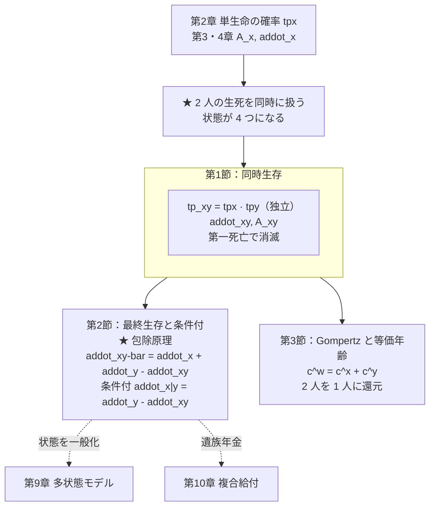
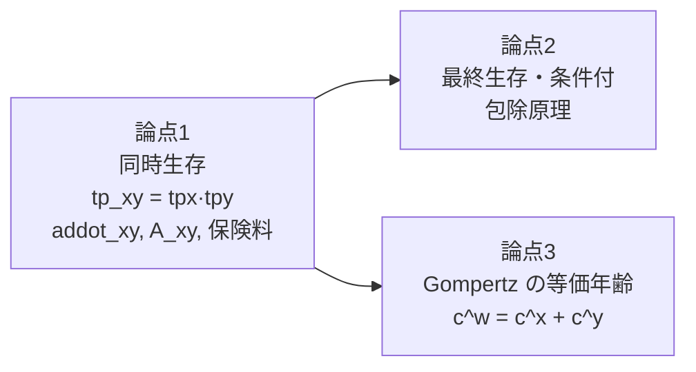
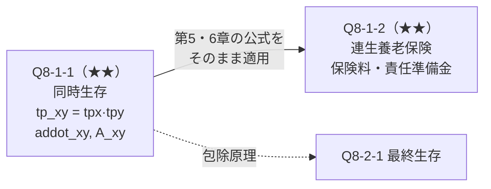
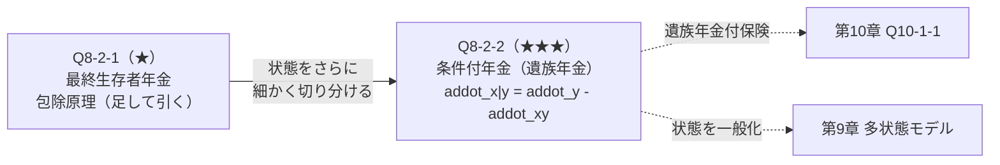
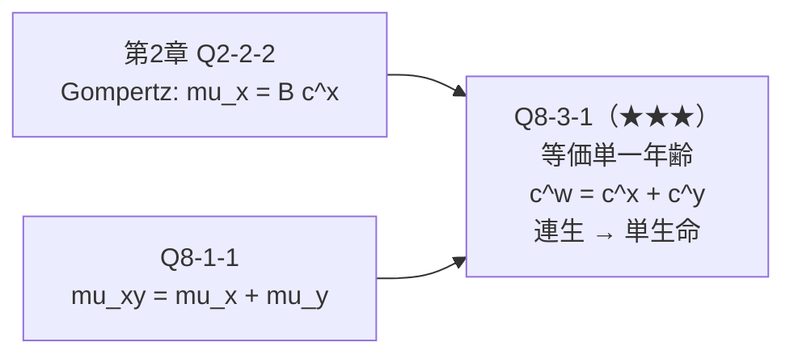
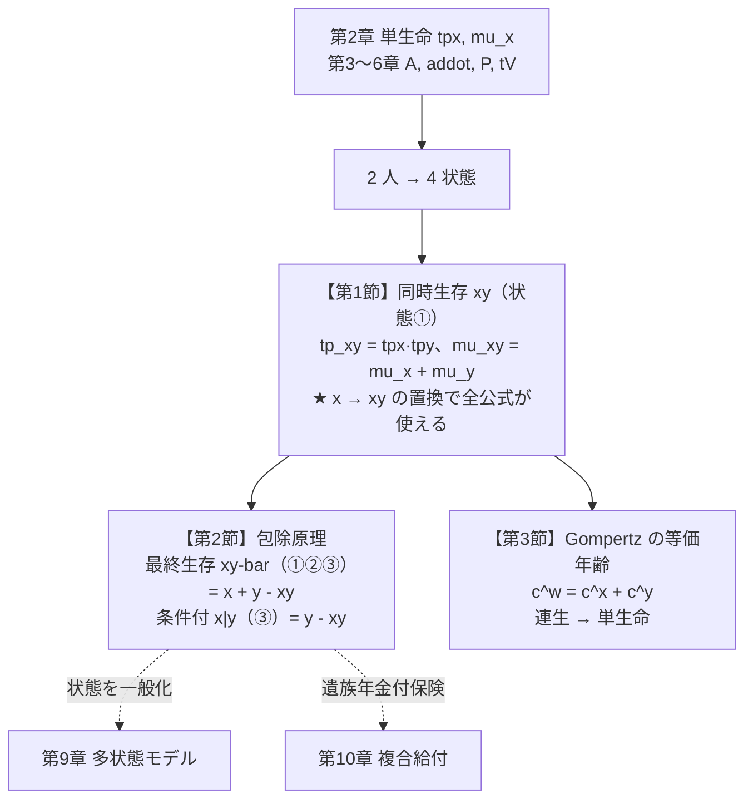
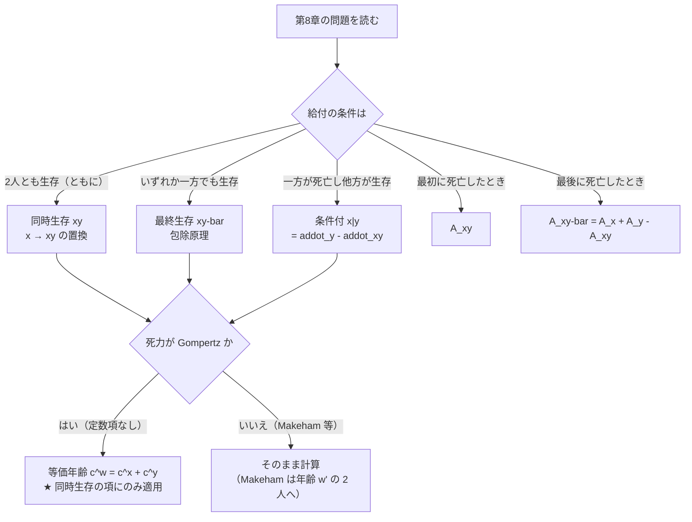

# 第8章　連生と最終生存

> [← 第7章 営業保険料と実務計算](第07章_営業保険料と実務計算.md) ｜ **第8章** ｜ [第9章 多重脱退と多状態モデル →](第09章_多重脱退と多状態モデル.md)

---

## 章の地図



**この図の読み方**：第8章は **第2章の確率モデルを2人に拡張し、
第3〜6章をやり直すだけ** です。
公式の見た目は複雑ですが、中身は **包除原理1つ** で大半が導けます。

---

## この章で学ぶこと

第2〜7章では被保険者が1人でした。第8章では2人（夫婦など）を扱います。

**状態が4つに増えます。**

```text
   状態    (x) 生存    (y) 生存
   ────────────────────────────
   ①        ○           ○        両方生存（同時生存状態 xy）
   ②        ○           ×        (x) のみ生存
   ③        ×           ○        (y) のみ生存
   ④        ×           ×        両方死亡

   同時生存 xy      : 状態①のみ
   最終生存 xy-bar  : 状態①②③（少なくとも一方が生存）
```

しかし **新しい計算技術は必要ありません**。
「同時生存」を扱えれば、「最終生存」は **包除原理（足して引く）** で出ます。

$$\ddot a_{\overline{xy}}=\ddot a_x+\ddot a_y-\ddot a_{xy}$$

---

## この章の全体像



```text
学習順序：
① 2 人の状態を 4 つに整理する
        ↓
② 同時生存確率を作る（独立なら積）
        ↓
③ 単生命の公式で x を xy に置き換える
        ↓
④ 包除原理で最終生存を作る
        ↓
⑤ 条件付年金（遺族年金）へ拡張
        ↓
⑥ Gompertz なら 2 人を 1 人に還元できることを知る
```

---

## 最初に頭に入れるべきポイント

### 同時生存は「単生命の $x$ を $xy$ に置き換えるだけ」

$$_tp_{xy}={}_tp_x\cdot{}_tp_y\qquad(\text{独立の場合})$$

これさえ作れば、**単生命の公式がそのまま使えます**。

| 単生命 | 連生（同時生存） |
|---|---|
| $\ddot a_x=\sum v^{t}{}_tp_x$ | $\ddot a_{xy}=\sum v^{t}{}_tp_{xy}$ |
| $A_x=1-d\,\ddot a_x$ | $A_{xy}=1-d\,\ddot a_{xy}$ |
| $P_x=\dfrac{A_x}{\ddot a_x}$ | $P_{xy}=\dfrac{A_{xy}}{\ddot a_{xy}}$ |
| ${}_tV_x=1-\dfrac{\ddot a_{x+t}}{\ddot a_x}$ | ${}_tV_{xy}=1-\dfrac{\ddot a_{x+t:y+t}}{\ddot a_{xy}}$ |

**$x$ を $xy$ と書き換えるだけ** です。第3〜6章の全公式が使えます。

**⚠ 独立の仮定**：$_tp_{xy}={}_tp_x{}_tp_y$ は
**2人の死亡が独立** であることを前提とします。
夫婦では「共通の事故」「配偶者死亡後の死亡率上昇（broken heart 効果）」が
知られており、厳密には独立ではありません。
**答案では「独立を仮定すると」と明記** してください。

### 包除原理がこの章の中核

```text
   「少なくとも一方が生存」＝ 全体 −「両方死亡」

   P(少なくとも一方生存)
     = P(x 生存) + P(y 生存) - P(両方生存)
                                  ↑
                          ★ 二重に数えた分を引く

   ⇒ tp_xy-bar = tpx + tpy - tp_xy
```

これを年金・保険に持ち上げると

$$\boxed{\ddot a_{\overline{xy}}=\ddot a_x+\ddot a_y-\ddot a_{xy}}$$

$$\boxed{A_{\overline{xy}}=A_x+A_y-A_{xy}}$$

```text
ベン図で見る：

     ┌───────────────┐
     │  (x) 生存      │
     │   ┌───────────┼───────────┐
     │   │  両方生存  │           │
     │   │    xy      │  (y) 生存 │
     │   └───────────┼───────────┘
     └───────────────┘

   最終生存 xy-bar = 全体の網掛け部分
                  = (x生存) + (y生存) - (両方生存)
                                          ↑ 重複を引く
```

**恒等式（検算に使える）**

$$\ddot a_{xy}+\ddot a_{\overline{xy}}=\ddot a_x+\ddot a_y$$

「同時生存」と「最終生存」を足すと、個々の年金の和になります。

### 条件付年金は「引き算で作る」

**条件付年金（遺族年金）$\ddot a_{x\vert y}$**：$(x)$ が死亡した後、$(y)$ が生存している間だけ支払う年金。

```text
   (y) が生存している期間
     = 「(y) 生存」の全体
     = 「両方生存」＋「(y) のみ生存」

   ⇒ 「(y) のみ生存」= 「(y) 生存」-「両方生存」

   ⇒ addot_(x|y) = addot_y - addot_xy
```

$$\boxed{\ddot a_{x\vert y}=\ddot a_y-\ddot a_{xy}}$$

**記号の読み方**：$\ddot a_{x\vert y}$ は
「$x$ **の死亡後**、$y$ **に対して**支払う」と読みます。
縦棒の **左が先に死ぬ人、右が受け取る人** です。

---

## 基本記号・基本公式

| 記号 | 意味 | 独立のとき |
|---|---|---|
| ${}_tp_{xy}$ | $(x),(y)$ が **ともに** $t$ 年生存 | ${}_tp_x\,{}_tp_y$ |
| ${}_tp_{\overline{xy}}$ | **少なくとも一方が** $t$ 年生存 | ${}_tp_x+{}_tp_y-{}_tp_x{}_tp_y$ |
| $\ddot a_{xy}$ | 同時生存年金（両者生存中のみ） | — |
| $\ddot a_{\overline{xy}}$ | 最終生存者年金 | $\ddot a_x+\ddot a_y-\ddot a_{xy}$ |
| $A_{xy}$ | 第一死亡時に支払う保険 | $1-d\,\ddot a_{xy}$ |
| $A_{\overline{xy}}$ | 最終死亡時に支払う保険 | $A_x+A_y-A_{xy}$ |
| $\ddot a_{x\vert y}$ | 条件付年金（$(x)$ 死亡後、$(y)$ 生存中） | $\ddot a_y-\ddot a_{xy}$ |
| $A^1_{xy}$ | $(x)$ が $(y)$ より先に死亡したとき支払う | — |

**中核となる恒等式**

$$\ddot a_{xy}+\ddot a_{\overline{xy}}=\ddot a_x+\ddot a_y,\qquad
A_{xy}+A_{\overline{xy}}=A_x+A_y$$

**単生命の公式がそのまま使える**

$$A_{xy}=1-d\,\ddot a_{xy},\qquad
\bar A_{xy}=1-\delta\,\bar a_{xy},\qquad
P_{xy}=\frac{A_{xy}}{\ddot a_{xy}}=\frac{1}{\ddot a_{xy}}-d$$

**⚠ 最終生存には $A_{\overline{xy}}=1-d\ddot a_{\overline{xy}}$ も成立** します
（「いつか必ず最終死亡が起きる」ため）。

### 死力

$$\mu_{xy}(t)=\mu_{x+t}+\mu_{y+t}\qquad(\text{独立})$$

「同時生存状態が消滅する力」は、2人の死力の和です。
これが第3節の Gompertz の等価年齢の出発点になります。

---

## 試験での主な問われ方

| 出題形態 | 典型的な問われ方 | 対応する問題 |
|---|---|---|
| 小問 | ${}_tp_{xy}$、$\ddot a_{xy}$ の計算 | Q8-1-1 |
| 小問 | 包除原理による $\ddot a_{\overline{xy}}$ | Q8-2-1 |
| 記述式 | 連生保険の保険料・責任準備金 | Q8-1-2 |
| 記述式 | 条件付年金（遺族年金）の導出 | Q8-2-2 |
| 記述式 | Gompertz の等価単一年齢 | Q8-3-1 |
| 他章との複合 | 遺族年金付保険（第10章） | Q8-2-2 |

---

## 問題を見分けるためのサイン

| 問題文中の表現 | 判断すること |
|---|---|
| 「2人とも生存している間」 | **同時生存** $\ddot a_{xy}$ |
| 「いずれか一方でも生存している間」 | **最終生存** $\ddot a_{\overline{xy}}$ |
| 「最初に死亡したとき」「第一死亡」 | $A_{xy}$ |
| 「最後に死亡したとき」「両方死亡したとき」 | $A_{\overline{xy}}$ |
| 「夫の死亡後、妻が生存している間」 | **条件付年金** $\ddot a_{x\vert y}$ |
| 「遺族年金」 | 同上 |
| 「$(x)$ が $(y)$ より先に死亡した場合」 | $A^1_{xy}$（上付き1の位置に注意） |
| 「独立と仮定する」 | ${}_tp_{xy}={}_tp_x{}_tp_y$ が使える |
| 「$\mu_x=Bc^{x}$」「Gompertz」 | **等価単一年齢** $c^{w}=c^{x}+c^{y}$ |
| 「同年齢の2人」 | $w=x+\dfrac{\ln2}{\ln c}$（Gompertz） |

**⚠ 特に注意すべき語**

* 「**いずれか**」＝最終生存（$\overline{xy}$）、「**ともに**」＝同時生存（$xy$）。
* 上線 $\overline{xy}$ の有無で意味が正反対になります。
* 条件付年金 $\ddot a_{x\vert y}$ の縦棒の左右（先に死ぬ人／受け取る人）。

---

## この章の問題一覧

| ID | 表題 | 難 | 段階 | この問題の役割 |
|---|---|---|---|---|
| **第1節　同時生存** | | | | |
| Q8-1-1 | 同時生存年金と第一死亡保険 | ★★ | ① | $x\to xy$ の置き換えで単生命の公式が使えること |
| Q8-1-2 | 連生養老保険の保険料 | ★★ | ② | 第5・6章の公式をそのまま適用 |
| **第2節　最終生存と条件付** | | | | |
| Q8-2-1 | 最終生存者年金（包除原理） | ★ | ① | 本章の中核。足して引くだけ |
| Q8-2-2 | 条件付年金（遺族年金） | ★★★ | ④ | 状態の切り分けと読み替え |
| **第3節　Gompertz と等価年齢** | | | | |
| Q8-3-1 | Gompertz 法則と等価単一年齢 | ★★★ | ⑤ | 2人を1人に還元する。第2章 Q2-2-2 の応用 |

---
---

# 第1節　同時生存

## この節のテーマ

**2人がともに生存している状態（同時生存状態）を扱う技術** です。
単生命の $x$ を $xy$ に置き換えるだけで、第3〜6章の公式がすべて使えます。

## この節でできるようになること

* 独立を仮定して ${}_tp_{xy}={}_tp_x{}_tp_y$ を作れる
* $\ddot a_{xy}$、$A_{xy}$ を計算し、$A_{xy}=1-d\ddot a_{xy}$ を確認できる
* 連生保険の保険料・責任準備金を求められる
* 「$x$ を $xy$ に置き換える」という発想を使いこなせる

## 頭に入れるべきポイント

### 置き換えの原理

```text
   単生命の世界              連生（同時生存）の世界
   ─────────────           ──────────────────────
   生存条件：(x) が生存      生存条件：(x) と (y) がともに生存
   確率：tpx                 確率：tp_xy = tpx · tpy
        ↓                          ↓
   ★ 「生存している状態」の中身が変わっただけ
     和の取り方も現価率も、すべて同じ
        ↓
   単生命の公式で x → xy と書き換えれば完成
```

**この置き換えが成り立つ理由**：年金・保険の公式は
「生存確率 ${}_tp$ と現価率 $v^{t}$ の積の和」という形しかもちません。
${}_tp$ の中身が何であっても、式の形は変わりません。

### 同時生存は「最も脆い」

$$_tp_{xy}={}_tp_x\cdot{}_tp_y\le\min\left({}_tp_x,\ {}_tp_y\right)$$

2人ともの生存を要求するので、**どちらか一方の生存より確率が低い** です。
したがって

$$\ddot a_{xy}<\min\left(\ddot a_x,\ \ddot a_y\right)$$

**検算に使えます。** $\ddot a_{xy}$ が $\ddot a_x$ や $\ddot a_y$ より大きくなったら計算ミスです。

## 使用する記号・公式

| 記号 | 定義 |
|---|---|
| ${}_tp_{xy}$ | ${}_tp_x\,{}_tp_y$（独立） |
| $\ddot a_{xy}$ | $\displaystyle\sum_{t=0}^{\infty}v^{t}\,{}_tp_{xy}$ |
| $\ddot a_{xy:\overline{n}\vert}$ | $\displaystyle\sum_{t=0}^{n-1}v^{t}\,{}_tp_{xy}$ |
| ${}_nE_{xy}$ | $v^{n}\,{}_np_{xy}$ |
| $A_{xy}$ | $1-d\,\ddot a_{xy}$ |
| $A_{xy:\overline{n}\vert}$ | $1-d\,\ddot a_{xy:\overline{n}\vert}$ |
| $P_{xy}$ | $\dfrac{A_{xy}}{\ddot a_{xy}}=\dfrac{1}{\ddot a_{xy}}-d$ |
| ${}_tV_{xy}$ | $1-\dfrac{\ddot a_{x+t:y+t}}{\ddot a_{xy}}$ |
| $\mu_{xy}(t)$ | $\mu_{x+t}+\mu_{y+t}$ |

## 基本的な解法パターン

```text
① 「2 人ともの生存」が条件か確認する
        ↓
② 独立を仮定して tp_xy = tpx · tpy
        ↓
③ 単生命の公式で x を xy に置き換える
   ├─ 年金 : addot_xy = Σ v^t tp_xy
   ├─ 保険 : A_xy = 1 - d·addot_xy
   ├─ 保険料 : P_xy = A_xy / addot_xy
   └─ 責準 : tV_xy = 1 - addot_{x+t:y+t}/addot_xy
        ↓
④ 検算：addot_xy < min(addot_x, addot_y)
```

## 間違えやすい点

| 誤り | 内容 | 防ぎ方 |
|---|---|---|
| 独立の仮定を書かない | — | 「独立を仮定すると」と明記 |
| 確率を足す | ${}_tp_{xy}={}_tp_x+{}_tp_y$ | ともに生存なので**積** |
| $\ddot a_{xy}$ の大小 | $\ddot a_x$ より大きくする | 必ず小さい |
| $t$ 年後の年齢 | $x+t$ と $y+t$ の両方を進める | 2人とも歳を取る |
| 上線を付ける | $\ddot a_{\overline{xy}}$ と混同 | 上線なしが同時生存 |

## この節の問題の流れ



---
---

## 問題 Q8-1-1　同時生存年金と第一死亡保険

| 項目 | 内容 |
|---|---|
| 出題年度 | `要照合`（記入欄：______年度） |
| 問題番号 | `要照合`（記入欄：問題___） |
| 分野・論点 | 連生 ／ 同時生存 |
| 難易度 | ★★ |
| この節での位置づけ | 段階①（定義を直接使う）。本章の基準となる問題 |
| 関連する問題 | 発展元：Q3-1-2、Q4-1-1、Q2-1-1 ／ 本問 ／ 後続：Q8-1-2、Q8-2-1 |

### ■ この問題で押さえるべきポイント

#### ① 何を問う問題か

**同時生存確率から連生年金・連生保険を計算させる問題** です。

問われているのは **「単生命の公式が $x\to xy$ の置き換えでそのまま使える」ことの理解** です。

#### ② 問題文から読み取るべき条件

| 条件 | 解法への影響 |
|---|---|
| 「2人とも生存している間」 | 同時生存 $\ddot a_{xy}$（上線なし） |
| 「最初に死亡したとき」 | 第一死亡保険 $A_{xy}$ |
| 「独立と仮定」 | ${}_tp_{xy}={}_tp_x{}_tp_y$ |
| 「$x=60$、$y=65$」 | 2人とも毎年歳を取る |

#### ③ 最初に注目する場所

**「ともに」か「いずれか」か**。
「ともに」なら同時生存（積）、「いずれか」なら最終生存（包除原理）です。

#### ④ 呼び出すべき知識

| 知識 | なぜこの問題で使うか |
|---|---|
| ${}_tp_{xy}={}_tp_x{}_tp_y$ | 独立の仮定 |
| $\ddot a_{xy}=\sum v^{t}{}_tp_{xy}$ | 定義 |
| $A_{xy}=1-d\,\ddot a_{xy}$ | 単生命の公式の転用（第3章 Q3-1-2） |
| $\ddot a_{xy}<\min(\ddot a_x,\ddot a_y)$ | 検算 |

#### ⑤ 解法の骨格

```text
1. 同時生存確率を積で作る
2. addot_xy を定義どおり計算（または与えられた値を使う）
3. A_xy = 1 - d·addot_xy
4. 検算：addot_xy < min(addot_x, addot_y)、恒等式
```

#### ⑥ 間違えやすい点

* 確率を足す
* $A_{xy}=A_x A_y$ とする（**まったく誤り**）
* 独立の仮定を書かない
* 上線の有無を取り違える

#### ⑦ この問題を一言で捉えると

> **「$x$ を $xy$ に置き換えるだけ」— 単生命の全公式がそのまま使える。**

### ■ 問題の構造図

```text
2 人の状態遷移図：

                    ┌──────────────┐
                    │   ① 両方生存  │  ← 同時生存状態 xy
                    │      (xy)     │
                    └───┬──────┬───┘
              mu_{x+t}  │      │  mu_{y+t}
              （x 死亡） │      │ （y 死亡）
                    ┌───▼──┐ ┌─▼────┐
                    │② y のみ│ │③ x のみ│
                    │  生存  │ │  生存  │
                    └───┬──┘ └─┬────┘
                        │       │
                        └───┬───┘
                       ┌────▼─────┐
                       │④ 両方死亡 │
                       └──────────┘

  同時生存 xy      : 状態①のみ           → addot_xy
  最終生存 xy-bar  : 状態①②③           → addot_xy-bar（第2節）
  第一死亡 A_xy    : ①から出る遷移で支払 → A_xy
  最終死亡 A_xy-bar: ④に入る遷移で支払   → A_xy-bar

  ★ 同時生存状態が消滅する力 = mu_{x+t} + mu_{y+t}（2 つの出口の和）


時間軸（x = 60, y = 65）：

時点     0     1     2    ...
         |-----|-----|---...
年齢 x  60    61    62   ...     ← ★ 両方が歳を取る
年齢 y  65    66    67   ...

支払    ^1    ^1    ^1   ...     ← 両方生存している間のみ
確率     1  1p_60·  2p_60·  ...
            1p_65   2p_65
```

### ■ 問題

年利率 $i=0.03$ とし、$(60)$ と $(65)$ の2人（独立と仮定）について
次の値が与えられている。

$$\ddot a_{60}=17.218902,\qquad \ddot a_{65}=15.136291,\qquad
\ddot a_{60:65}=13.117320$$

$$A_{60}=0.498479,\qquad A_{65}=0.559137$$

（$\ddot a_{60:65}$ は同時生存期始払終身年金 $\ddot a_{xy}$ を表す。）

**(1)** 独立の仮定のもとで ${}_{10}p_{60:65}$ を求めよ。
ただし ${}_{10}p_{60}=0.904504$、${}_{10}p_{65}=0.849042$ とする（小数第7位まで）。

**(2)** $\ddot a_{60:65}$ が $\ddot a_{60}$ および $\ddot a_{65}$ より小さいことを確認し、
その理由を述べよ。

**(3)** 第一死亡時に保険金1を支払う保険 $A_{60:65}$ を求めよ（小数第6位まで）。

**(4)** $A_{60:65}$ を $A_{60}\times A_{65}$ と計算するのは誤りである。
その理由を述べ、両者の値を比較せよ。

**(5)** 同時生存状態が消滅する死力 $\mu_{xy}(t)$ を $\mu_{60+t}$、$\mu_{65+t}$ で表せ。
また $\mu_{60}=0.0060406$、$\mu_{65}=0.0096307$ のとき $\mu_{xy}(0)$ を求めよ。

> 本問は再現題です。原文の出題年度・問題番号は未照合です。

### ■ 問題文を数理モデルへ変換

| 確認項目 | 問題文から読み取れる内容 | 数理的な表現 |
|---|---|---|
| 被保険者 | $(60)$ と $(65)$ | $x=60$、$y=65$ |
| 独立性 | 「独立と仮定」 | ${}_tp_{xy}={}_tp_x{}_tp_y$ |
| 年金 | 2人とも生存している間 | $\ddot a_{60:65}$（上線なし） |
| 保険 | 第一死亡時に1 | $A_{60:65}=1-d\,\ddot a_{60:65}$ |
| 死力 | 同時生存状態からの脱出 | $\mu_{x+t}+\mu_{y+t}$ |

### ■ 解法フロー

```text
STEP 1　(1) 独立の仮定で確率を積にする
STEP 2　(2) 大小関係を確認する
STEP 3　(3) A_xy = 1 - d·addot_xy
STEP 4　(4) A_x·A_y が誤りである理由
STEP 5　(5) 死力の和
```

### ■ 詳細解説

#### STEP 1　(1) 同時生存確率

*目的：独立の仮定を使う。*

2人の死亡が独立であれば、「2人とも $t$ 年生存する」確率は積になります。

$$_{10}p_{60:65}={}_{10}p_{60}\times{}_{10}p_{65}=0.904504\times0.849042$$

$$\boxed{{}_{10}p_{60:65}=0.7679614}$$

**確認**：$0.7679614<\min(0.904504,\,0.849042)=0.849042$ ✓

「2人ともの生存」は「一方の生存」より起こりにくいので、当然です。

**⚠ 独立の仮定について**：実際の夫婦では
* 共通の事故（交通事故、災害）
* 配偶者死亡後の死亡率上昇（broken heart 効果）
* 生活習慣の共通性

などにより、厳密には独立ではありません。
**答案では「独立を仮定すると」と必ず明記** してください。
（実務では copula などで従属性をモデル化することがあります。）

#### STEP 2　(2) 大小関係

*目的：同時生存年金が最も小さいことを確認する。*

$$\ddot a_{60:65}=13.117320\ <\ \ddot a_{65}=15.136291\ <\ \ddot a_{60}=17.218902$$

$$\boxed{\ddot a_{60:65}<\min\left(\ddot a_{60},\ \ddot a_{65}\right)}$$

**理由**：各時点で

$$_tp_{60:65}={}_tp_{60}\cdot{}_tp_{65}\le{}_tp_{65}\le1$$

（$_tp_{60}\le1$ だから）。すべての時点で確率が小さいので、和も小さくなります。

```text
   支払われる条件が厳しいほど年金現価は小さい：

   addot_60      : (60) が生存していれば支払う           17.219  ← 最も緩い
   addot_65      : (65) が生存していれば支払う           15.136
   addot_(60:65) : ★ 両方が生存していないと支払わない    13.117  ← 最も厳しい

  ★ 条件が厳しい ⇒ 支払回数が少ない ⇒ 現価が小さい
```

**$\ddot a_{60}>\ddot a_{65}$ の理由**：60歳の方が若く、余命が長いためです。

#### STEP 3　(3) 第一死亡保険

*目的：単生命の公式をそのまま使う。*

第3章 Q3-1-2 の $A_x=1-d\,\ddot a_x$ は、
**「生存している状態」が何であっても成立** します。
同時生存状態 $xy$ についても

$$A_{xy}=1-d\,\ddot a_{xy}$$

$d=\dfrac{0.03}{1.03}=0.0291262$ なので

$$A_{60:65}=1-0.0291262\times13.117320=1-0.3820577=0.6179423$$

$$\boxed{A_{60:65}=0.617942}$$

**この公式が成立する理由**：$A_{xy}$ は「同時生存状態がいつか必ず消滅する」ことに対して
$1$ を支払う保険です。$\ddot a_{xy}$ は「その状態が続く間」の年金です。
第3章の望遠鏡和の議論は、状態の中身に依存しません。

**検算**：$A_{60:65}=0.617942>A_{65}=0.559137>A_{60}=0.498479$ ✓

**保険の大小が年金と逆になる理由**：

```text
   同時生存状態は最も早く消滅する
        ↓
   第一死亡は最も早く起きる
        ↓
   保険金の支払が早い ⇒ 割引が弱い ⇒ 現価が大きい

   ★ 年金は「小さい」、保険は「大きい」（逆向き）
     A = 1 - d·addot なので当然
```

#### STEP 4　(4) $A_x A_y$ が誤りである理由

*目的：確率の積と期待値の積を区別する。*

**誤った計算**

$$A_{60}\times A_{65}=0.498479\times0.559137=0.278723$$

正解 $0.617942$ とはまったく異なります。

**なぜ誤りか**

```text
   独立性が使えるのは「確率」の積であって、「期待現価」の積ではない

   正しい：tp_xy = tpx · tpy          （確率の積）
   誤り  ：A_xy  = A_x · A_y          （期待値の積）

   ★ A_x は「(x) の死亡時に 1 を払う保険の期待現価」
     A_y は「(y) の死亡時に 1 を払う保険の期待現価」
        ↓
     この 2 つを掛けても、何の意味もない量になる
        （単位も「保険金の 2 乗」のようなものになってしまう）
```

**そもそも $A_{xy}$ が表すもの**：$A_{xy}$ は
「**第一死亡**（どちらか早い方）の時点で $1$ を支払う」保険です。
第一死亡は $(x)$ の死亡か $(y)$ の死亡のどちらかであり、
$A_x$ と $A_y$ の情報だけでは決まりません（**どちらが先か** の情報が必要）。

**正しい関係（包除原理、第2節）**

$$A_{xy}+A_{\overline{xy}}=A_x+A_y$$

すなわち

$$A_{\overline{xy}}=A_{60}+A_{65}-A_{60:65}=0.498479+0.559137-0.617942=0.439674$$

**足し引きの関係は成り立ちますが、掛け算の関係は成り立ちません。**

#### STEP 5　(5) 同時生存状態の死力

*目的：状態が消滅する力を求める。*

同時生存状態 $xy$ は、**$(x)$ が死亡するか $(y)$ が死亡するか** のどちらかで消滅します。

```text
                ┌──────────────┐
                │  両方生存 xy  │
                └───┬──────┬───┘
          mu_{x+t}  │      │  mu_{y+t}
                    ▼      ▼
              （x 死亡）（y 死亡）

  ★ 出口が 2 つあるので、脱出の力は和になる
```

独立を仮定すると

$$\mu_{xy}(t)=\mu_{x+t}+\mu_{y+t}$$

$$\boxed{\mu_{xy}(t)=\mu_{60+t}+\mu_{65+t}}$$

**導出**：$_tp_{xy}={}_tp_x{}_tp_y$ の対数を取って微分します。

$$\ln{}_tp_{xy}=\ln{}_tp_x+\ln{}_tp_y$$

$$-\frac{d}{dt}\ln{}_tp_{xy}=-\frac{d}{dt}\ln{}_tp_x-\frac{d}{dt}\ln{}_tp_y$$

第2章の $\mu_{x+t}=-\dfrac{d}{dt}\ln{}_tp_x$ より

$$\mu_{xy}(t)=\mu_{x+t}+\mu_{y+t}$$

**数値**

$$\mu_{xy}(0)=\mu_{60}+\mu_{65}=0.0060406+0.0096307=0.0156713$$

$$\boxed{\mu_{xy}(0)=0.0156713}$$

**この結果が第3節につながります**：$\mu_{xy}=\mu_x+\mu_y$ という
**死力の和** が、Gompertz 法則のもとで
「1人の死力 $\mu_w$」に還元できるのが Q8-3-1 の内容です。

### ■ 答え

| 設問 | 量 | 値 |
|---|---|---|
| (1) | ${}_{10}p_{60:65}$ | $0.7679614$ |
| (3) | $A_{60:65}$ | $0.617942$ |
| (5) | $\mu_{xy}(0)$ | $0.0156713$ |

**(2)** $\ddot a_{60:65}=13.117320<\ddot a_{65}=15.136291<\ddot a_{60}=17.218902$。
各時点で ${}_tp_{xy}={}_tp_x{}_tp_y\le\min({}_tp_x,{}_tp_y)$ であり、
支払条件が最も厳しいため現価が最も小さくなる。

**(4)** $A_{60}A_{65}=0.278723$ となり正解 $0.617942$ と一致しない。
独立性が使えるのは **確率の積** ${}_tp_{xy}={}_tp_x{}_tp_y$ であって、
期待現価の積ではない。
また $A_{xy}$ は「第一死亡時に支払う」保険であり、
どちらが先に死亡するかの情報を含むため $A_x$、$A_y$ 単独からは決まらない。
正しく成り立つのは包除原理 $A_{xy}+A_{\overline{xy}}=A_x+A_y$ である。

**(5)** $\mu_{xy}(t)=\mu_{60+t}+\mu_{65+t}$。
$\mu_{xy}(0)=0.0060406+0.0096307=0.0156713$。

### ■ 試験答案としての書き方

> 2人の死亡は独立と仮定する。
>
> **(1)** ${}_{10}p_{60:65}={}_{10}p_{60}\cdot{}_{10}p_{65}
> =0.904504\times0.849042=0.7679614$
>
> **(2)** 各時点で ${}_tp_{60:65}={}_tp_{60}\,{}_tp_{65}\le{}_tp_{65}$ かつ $\le{}_tp_{60}$
> であるから、$\ddot a_{60:65}\le\min(\ddot a_{60},\ddot a_{65})$。
> 実際 $13.117320<15.136291<17.218902$。
> 2人ともの生存を要する分、支払条件が厳しく現価が小さくなる。
>
> **(3)** $d=\dfrac{0.03}{1.03}=0.0291262$ より
> $A_{60:65}=1-d\,\ddot a_{60:65}=1-0.0291262\times13.117320=0.617942$
>
> **(4)** $A_{60}A_{65}=0.498479\times0.559137=0.278723\ne0.617942$。
> 独立性が使えるのは確率の積 ${}_tp_{xy}={}_tp_x{}_tp_y$ であり、
> 期待現価どうしの積には意味がない。
> また $A_{xy}$ は第一死亡時に支払う保険であって、
> どちらが先に死亡するかに依存するため $A_x,A_y$ だけでは定まらない。
> 正しい関係は包除原理 $A_{xy}+A_{\overline{xy}}=A_x+A_y$ である。
>
> **(5)** ${}_tp_{xy}={}_tp_x{}_tp_y$ の対数を微分して
> $\mu_{xy}(t)=-\dfrac{d}{dt}\ln{}_tp_{xy}=\mu_{x+t}+\mu_{y+t}$
> $\mu_{xy}(0)=\mu_{60}+\mu_{65}=0.0060406+0.0096307=0.0156713$

### ■ 解答後に確認すること

| 項目 | 内容 |
|---|---|
| **最も重要なポイント** | **$x\to xy$ の置き換え**で単生命の全公式が使える。独立なら ${}_tp_{xy}={}_tp_x{}_tp_y$、$\mu_{xy}=\mu_x+\mu_y$ |
| **最初に気づくべきだった条件** | 「2人とも生存している間」＝同時生存（上線なし）。「独立と仮定」の明記 |
| **他の問題にも使える考え方** | ① 確率は積、期待現価は積にならない。② 同時生存年金は最小、第一死亡保険は最大。③ 状態からの出口が複数なら死力は和 |
| **類似問題との違い** | Q8-2-1 は「いずれか一方でも生存」（最終生存）。上線の有無で意味が正反対 |
| **条件が変わった場合** | ① 3人なら ${}_tp_{xyz}={}_tp_x{}_tp_y{}_tp_z$、$\mu=\mu_x+\mu_y+\mu_z$。② 独立でなければ積にできない。③ 同年齢なら ${}_tp_{xx}=({}_tp_x)^{2}$ |
| **復習時に思い出すこと** | ${}_tp_{xy}={}_tp_x{}_tp_y$、$A_{xy}=1-d\ddot a_{xy}$、$\mu_{xy}=\mu_x+\mu_y$ |

---
---

## 問題 Q8-1-2　連生養老保険の保険料

| 項目 | 内容 |
|---|---|
| 出題年度 | `要照合`（記入欄：______年度） |
| 問題番号 | `要照合`（記入欄：問題___） |
| 分野・論点 | 連生 ／ 連生保険料 |
| 難易度 | ★★ |
| この節での位置づけ | 段階②（基本公式を変形して使う）。第5・6章の公式をそのまま適用 |
| 関連する問題 | 発展元：Q8-1-1、Q5-1-1、Q6-1-1 ／ 本問 ／ 後続：Q8-2-2 |

### ■ この問題で押さえるべきポイント

#### ① 何を問う問題か

**連生養老保険（2人とも生存している間だけ有効な保険）の保険料と
責任準備金を求めさせる問題** です。

第5章・第6章の公式が **そのまま使える** ことを確認するのが目的です。

#### ② 問題文から読み取るべき条件

| 条件 | 解法への影響 |
|---|---|
| 「2人とも生存している間、毎年初に保険料」 | 分母 $\ddot a_{xy:\overline{n}\vert}$ |
| 「いずれかが死亡した年度末に保険金」 | 第一死亡 $A^1_{xy:\overline{n}\vert}$ |
| 「$n$ 年後に2人とも生存していれば満期保険金」 | ${}_nE_{xy}$ |
| 「連生養老保険」 | $A_{xy:\overline{n}\vert}=A^1+{}_nE_{xy}$ |

#### ③ 最初に注目する場所

**「保険料の払込条件」と「給付条件」がともに同時生存か**。
両方とも $xy$ なら、単生命の公式で $x\to xy$ と置き換えるだけです。

#### ④ 呼び出すべき知識

| 知識 | なぜこの問題で使うか |
|---|---|
| $P_{xy:\overline{n}\vert}=\dfrac{A_{xy:\overline{n}\vert}}{\ddot a_{xy:\overline{n}\vert}}$ | 収支相等（第5章） |
| $A_{xy:\overline{n}\vert}=1-d\,\ddot a_{xy:\overline{n}\vert}$ | 単生命の公式の転用 |
| $P=\dfrac{1}{\ddot a}-d$ | 簡便形 |
| ${}_tV=1-\dfrac{\ddot a_{x+t:y+t:\overline{n-t}\vert}}{\ddot a_{xy:\overline{n}\vert}}$ | 年金比式（第6章） |

#### ⑤ 解法の骨格

```text
1. 給付と払込の条件がともに同時生存か確認
2. 単生命の公式で x → xy と置き換える
3. P_xy = A_xy / addot_xy = 1/addot_xy - d
4. 責準は年金比式で
5. 検算：単生命の保険料より大きいか
```

#### ⑥ 間違えやすい点

* 2人の年齢を両方進めない
* 保険料の払込条件と給付条件を取り違える
* 単生命の保険料と比較して大小を誤る

#### ⑦ この問題を一言で捉えると

> **「第5・6章の公式で $x$ を $xy$ に書き換えるだけ」の問題。**

### ■ 問題の構造図

```text
連生養老保険の時間軸（x = 60, y = 65, n = 20）：

時点     0     1     2    ...    19    20
         |-----|-----|---...----|-----|
年齢x   60    61    62   ...    79    80    ← ★ 両方が歳を取る
年齢y   65    66    67   ...    84    85

保険料  ^P    ^P    ^P   ...    ^P          ← 2 人とも生存中のみ
条件    [------- 同時生存 -------]

死亡給付      v1    v1   ...    v1    v1    ← ★ いずれか一方が死亡した年度末
満期給付                              v1    ← 20 年後に 2 人とも生存

  ★ 保険料も給付も「同時生存」が基準
    → 単生命の公式で x → xy と置き換えるだけ


単生命との比較（同じ 20 年養老）：

              addot_(x:20)    A_(x:20)      P
   (60)         13.887        0.5955      0.04289
   (65)         13.097        0.6185      0.04723
   (60:65)      12.023        0.6498      0.05405   ← ★ 最も高い

  ★ 同時生存は最も早く消滅する
    → 給付が早く発生 → 保険料が高い
```

### ■ 問題

年利率 $i=0.03$、$(60)$ と $(65)$ の2人（独立と仮定）について、
保険期間20年、保険金額1の **連生養老保険** を考える。

* 保険料は2人とも生存している間、毎年初に払い込む
* いずれか一方が死亡した年度末に保険金1を支払う
* 20年後に2人とも生存していれば満期保険金1を支払う

次の値が与えられている。

$$\ddot a_{60:65:\overline{20}\vert}=12.022701,\qquad
{}_{20}E_{60:65}=0.2069220,\qquad
A^1_{60:65:\overline{20}\vert}=0.442902$$

**(1)** $A_{60:65:\overline{20}\vert}$ を2通りの方法で求めよ（小数第6位まで）。

**(2)** 年払純保険料 $P_{60:65:\overline{20}\vert}$ を求めよ（小数第7位まで）。

**(3)** $P=\dfrac{1}{\ddot a}-d$ が使えることを確認せよ。

**(4)** 10年度末の責任準備金を年金比式で求めよ。
ただし $\ddot a_{70:75:\overline{10}\vert}=6.978507$ とする（小数第7位まで）。

**(5)** 単生命の $(60)$ 単独、$(65)$ 単独の20年養老保険の保険料が
それぞれ $0.042885$、$0.047227$ であるとき、
連生の保険料がこれらより高くなる理由を述べよ。

> 本問は再現題です。原文の出題年度・問題番号は未照合です。

### ■ 問題文を数理モデルへ変換

| 確認項目 | 問題文から読み取れる内容 | 数理的な表現 |
|---|---|---|
| 払込条件 | 2人とも生存中、毎年初 | $\ddot a_{60:65:\overline{20}\vert}$ |
| 死亡給付 | いずれか一方の死亡年度末 | $A^1_{60:65:\overline{20}\vert}$ |
| 満期給付 | 20年後に2人とも生存 | ${}_{20}E_{60:65}$ |
| 保険 | 連生養老 | $A_{xy:\overline{n}\vert}=A^1+{}_nE_{xy}$ |

### ■ 解法フロー

```text
STEP 1　(1) 2 通りで A_(xy:20) を求める
STEP 2　(2) 収支相等で保険料
STEP 3　(3) 簡便形の確認
STEP 4　(4) 年金比式で責任準備金
STEP 5　(5) 単生命との比較
```

### ■ 詳細解説

#### STEP 1　(1) 連生養老保険の期待現価

*目的：2通りの方法で求めて整合を確認する。*

**方法1：分解による**

養老保険は「死亡給付」と「満期給付」の和です（第3章 Q3-1-1）。

$$A_{60:65:\overline{20}\vert}=A^1_{60:65:\overline{20}\vert}+{}_{20}E_{60:65}$$

$$=0.442902+0.2069220=0.649824$$

**方法2：年金からの変換**

第3章 Q3-1-2 の $A_{x:\overline{n}\vert}=1-d\,\ddot a_{x:\overline{n}\vert}$ を
$x\to xy$ と置き換えます。

$$A_{xy:\overline{n}\vert}=1-d\,\ddot a_{xy:\overline{n}\vert}$$

$$=1-0.0291262\times12.022701=1-0.3501761=0.6498239$$

$$\boxed{A_{60:65:\overline{20}\vert}=0.649824}$$

**2通りが一致しました。** ✓

**なぜ $1-d\ddot a$ が連生でも成立するか**：この関係式は
「**その状態が続く限り年金を払い、状態が消滅したら $1$ を払う**」という
構造から導かれます（第3章の望遠鏡和）。
状態が「$(x)$ の生存」でも「$(xy)$ の同時生存」でも、論理は同じです。

#### STEP 2　(2) 年払純保険料

*目的：収支相等をそのまま適用する。*

**保険料の期待現価**：2人とも生存している間、毎年初に $P$ を払い込みます。

$$P\times\ddot a_{60:65:\overline{20}\vert}=P\times12.022701$$

**給付の期待現価**

$$A_{60:65:\overline{20}\vert}=0.649824$$

**収支相等**

$$P=\frac{0.649824}{12.022701}=0.0540498$$

$$\boxed{P_{60:65:\overline{20}\vert}=0.0540498}$$

#### STEP 3　(3) 簡便形の確認

*目的：$P=\frac{1}{\ddot a}-d$ が連生でも使えることを確認する。*

$$\frac{1}{\ddot a_{60:65:\overline{20}\vert}}-d=\frac{1}{12.022701}-0.0291262$$

$$=0.0831761-0.0291262=0.0540499$$

(2) の $0.0540498$ と一致します（末位は丸め）。✓

**成立条件**：$A_{xy:\overline{n}\vert}=1-d\ddot a_{xy:\overline{n}\vert}$ かつ
分母が同じ $\ddot a_{xy:\overline{n}\vert}$ であること。
本問は **全期払（払込期間＝保険期間）** なので成立します。

#### STEP 4　(4) 責任準備金

*目的：年金比式を $x\to xy$ で使う。*

第6章 Q6-1-1 (5) の年金比式を置き換えます。

$$_tV_{xy:\overline{n}\vert}=1-\frac{\ddot a_{x+t:y+t:\overline{n-t}\vert}}{\ddot a_{xy:\overline{n}\vert}}$$

$t=10$ のとき、年齢は $(70)$ と $(75)$、残期間は10年です。
**両方の年齢を進める** ことに注意してください。

$$_{10}V=1-\frac{\ddot a_{70:75:\overline{10}\vert}}{\ddot a_{60:65:\overline{20}\vert}}
=1-\frac{6.978507}{12.022701}$$

$$=1-0.5804442=0.4195558$$

$$\boxed{{}_{10}V_{60:65:\overline{20}\vert}=0.4195558}$$

**検算（将来法）**：$t=10$ における将来法
$A_{70:75:\overline{10}\vert}-P\,\ddot a_{70:75:\overline{10}\vert}$ を
直接計算しても $0.4195558$ となり一致します。✓

**検算**：$0<{}_{10}V<1$ ✓、また ${}_0V=0$、${}_{20}V=1$ となるはずです。✓

#### STEP 5　(5) 連生の保険料が高い理由

*目的：給付条件の違いから説明する。*

| 保険 | $\ddot a_{\cdot:\overline{20}\vert}$ | $A_{\cdot:\overline{20}\vert}$ | 保険料 |
|---|---|---|---|
| $(60)$ 単独の20年養老 | $13.886696$ | $0.595533$ | $0.042885$ |
| $(65)$ 単独の20年養老 | $13.096987$ | $0.618534$ | $0.047227$ |
| **連生（$60:65$）** | $\mathbf{12.022701}$ | $\mathbf{0.649824}$ | $\mathbf{0.054050}$ |

**年金は最小、保険は最大、したがって保険料は最大** になっています。

**理由：同時生存状態は最も早く消滅する**

```text
   給付が発生する条件：

   (60) 単独  : (60) が死亡         → 遅い
   (65) 単独  : (65) が死亡         → やや早い
   連生 60:65 : ★ どちらかが死亡    → 最も早い

  ⇒ 給付の発生が早い ⇒ 割引が弱い ⇒ 期待現価が大きい
  ⇒ 保険料が高い
```

**同時に、保険料の払込期間も短い**

```text
   保険料を払える条件：

   (60) 単独  : (60) が生存         → 長く払える
   連生 60:65 : ★ 2 人とも生存      → 早く払えなくなる

  ⇒ 払込の期待現価 addot_xy が小さい
  ⇒ 分母が小さい ⇒ 保険料が高い
```

**両方の効果が同じ向きに働きます。**

$$P_{xy}=\frac{\overbrace{A_{xy}}^{\text{大きい}}}{\underbrace{\ddot a_{xy}}_{\text{小さい}}}
\quad\Rightarrow\quad\text{保険料は高い}$$

**実務上の意味**：連生養老保険（夫婦保険）は
「どちらかが死亡したら保険金を支払う」商品であり、
**単独の保険2本より保障が手厚い**（早く支払われる）ため保険料が高くなります。
一方、最終生存者を対象とする保険（第2節）は
「両方が死亡してから支払う」ため保険料が安くなります。

### ■ 答え

| 設問 | 量 | 値 |
|---|---|---|
| (1) | $A_{60:65:\overline{20}\vert}$ | $0.649824$ |
| (2) | $P_{60:65:\overline{20}\vert}$ | $0.0540498$ |
| (4) | ${}_{10}V$ | $0.4195558$ |

**(1)** 方法1（分解）：$0.442902+0.2069220=0.649824$
方法2（年金から）：$1-0.0291262\times12.022701=0.649824$。両者は一致する。

**(3)** $\dfrac{1}{12.022701}-0.0291262=0.0831761-0.0291262=0.0540499$ となり
(2) と一致する。$A_{xy:\overline{n}\vert}=1-d\ddot a_{xy:\overline{n}\vert}$ が成立し、
かつ全期払で分母が同じ年金であるため使える。

**(5)** 連生では「いずれか一方の死亡」で給付が発生するため、
単独の場合より **給付の発生が早く** 期待現価が大きい。
同時に「2人とも生存」を条件とする保険料の払込は **早く終わる** ため、
分母の年金現価が小さい。分子が大きく分母が小さいので保険料は高くなる。

### ■ 試験答案としての書き方

> 2人の死亡は独立と仮定する。$d=\dfrac{0.03}{1.03}=0.0291262$
>
> **(1)** 分解による：$A_{60:65:\overline{20}\vert}
> =A^1_{60:65:\overline{20}\vert}+{}_{20}E_{60:65}=0.442902+0.206922=0.649824$
> 年金による：$A_{xy:\overline{n}\vert}=1-d\,\ddot a_{xy:\overline{n}\vert}
> =1-0.0291262\times12.022701=0.649824$
> 両者は一致する。
>
> **(2)** 収支相等より $P\,\ddot a_{60:65:\overline{20}\vert}=A_{60:65:\overline{20}\vert}$
> $\therefore P=\dfrac{0.649824}{12.022701}=0.0540498$
>
> **(3)** $\dfrac{1}{\ddot a_{60:65:\overline{20}\vert}}-d
> =\dfrac{1}{12.022701}-0.0291262=0.0540499$ で (2) に一致する。
>
> **(4)** 年金比式より（$t=10$ で年齢は $(70)$、$(75)$、残期間10年）
> ${}_{10}V=1-\dfrac{\ddot a_{70:75:\overline{10}\vert}}{\ddot a_{60:65:\overline{20}\vert}}
> =1-\dfrac{6.978507}{12.022701}=0.4195558$
>
> **(5)** 連生では「いずれか一方の死亡」で給付が発生するため給付の発生が早く、
> $A_{xy:\overline{n}\vert}$ は単独の場合より大きい。
> 一方、保険料は2人とも生存している間しか払えないため
> $\ddot a_{xy:\overline{n}\vert}$ は単独より小さい。
> 分子が大きく分母が小さいので、保険料は単独の場合より高くなる。

### ■ 解答後に確認すること

| 項目 | 内容 |
|---|---|
| **最も重要なポイント** | 第5・6章の全公式が $x\to xy$ の置き換えでそのまま使える。$t$ 年後は **両方の年齢を進める** |
| **最初に気づくべきだった条件** | 保険料も給付も「同時生存」が基準。両者の条件が同じなら置き換えだけで済む |
| **他の問題にも使える考え方** | ① 連生の保険料が高いのは「分子が大きく分母が小さい」の二重効果。② $1-d\ddot a$ は状態の中身によらず成立。③ 年金比式は連生でも使える |
| **類似問題との違い** | Q8-1-1 は年金・保険の計算まで。本問は保険料・責任準備金へ。Q8-2-2 は保険料と給付の条件が **違う** 場合（条件付年金） |
| **条件が変わった場合** | ① 最終生存者が対象なら $\overline{xy}$ に置き換え、保険料は**安く**なる。② 払込条件と給付条件が違えば置き換えだけでは済まない。③ 3人なら $xyz$ |
| **復習時に思い出すこと** | $P_{xy}=\dfrac{A_{xy}}{\ddot a_{xy}}=\dfrac{1}{\ddot a_{xy}}-d$、${}_tV=1-\dfrac{\ddot a_{x+t:y+t}}{\ddot a_{xy}}$ |

---

## 第1節　記憶用の一枚まとめ

```text
┌──────────────────────────────────────────────────────────────────────┐
│  第1節　同時生存                                                      │
└──────────────────────────────────────────────────────────────────────┘

【問題文のサイン】
   「2 人とも生存している間」    → ★ 同時生存 addot_xy（上線なし）
   「いずれか一方が死亡したとき」→ 第一死亡 A_xy
   「独立と仮定する」            → tp_xy = tpx · tpy
   「夫婦保険」「連生」          → 状態が 4 つになる
        ↓
【判断する論点】
   条件は「ともに」か「いずれか」か
   ├─ ともに（全員生存が必要）→ 同時生存 xy（本節）
   └─ いずれか（1 人でも可）  → 最終生存 xy-bar（第2節）
   ★ 保険料と給付の条件が同じなら、単生命の公式で x → xy と置換するだけ
        ↓
【描くべき図】
                ┌──────────┐
                │ ① 両方生存│ ← 同時生存 xy
                └─┬──────┬─┘
        mu_{x+t} │      │ mu_{y+t}
              ┌──▼─┐  ┌─▼──┐
              │②y のみ│  │③x のみ│
              └──┬─┘  └─┬──┘
                 └──┬───┘
                 ┌──▼──┐
                 │④両死亡│
                 └──────┘
   ★ 出口が 2 つ → mu_xy = mu_x + mu_y
        ↓
【使用する公式】
   ★ tp_xy = tpx · tpy            （独立の場合）
   ★ mu_xy(t) = mu_{x+t} + mu_{y+t}
   addot_xy = Σ v^t tp_xy
   ★ A_xy = 1 - d·addot_xy        （単生命の公式そのまま）
   P_xy = A_xy / addot_xy = 1/addot_xy - d
   tV_xy = 1 - addot_{x+t:y+t} / addot_xy    ★ 両方の年齢を進める
   ⚠ A_xy ≠ A_x · A_y            （確率は積、期待現価は積にならない）
        ↓
【解答の基本手順】
   ① 条件が「ともに」か確認
   ② 独立を仮定して確率を積にする（★ 明記する）
   ③ 単生命の公式で x → xy と置換
   ④ t 年後は両方の年齢を進める
   ⑤ 検算：addot_xy < min(addot_x, addot_y)、A_xy > max(A_x, A_y)
        ↓
【典型的なミス】
   ⚠ 確率を足す                    → ともに生存なので積
   ⚠ A_xy = A_x·A_y とする         → ★ 期待現価は積にならない
   ⚠ 独立の仮定を書かない          → 「独立を仮定すると」と明記
   ⚠ 片方の年齢だけ進める          → x+t と y+t の両方
   ⚠ 上線の有無を取り違える        → 上線なしが同時生存

【1行で】
   同時生存は「x を xy に置き換えるだけ」。確率は積、死力は和。
   単生命の全公式（A=1-d·addot、P、tV）がそのまま使える。
```

---
---

# 第2節　最終生存と条件付

## この節のテーマ

**包除原理により、最終生存・条件付の量を単生命と同時生存に還元する技術** を扱います。
本章で覚えるべき本質は、この節の **1つの原理** だけです。

## この節でできるようになること

* 包除原理により $\ddot a_{\overline{xy}}=\ddot a_x+\ddot a_y-\ddot a_{xy}$ を導ける
* 最終生存者保険 $A_{\overline{xy}}$ を求められる
* 条件付年金（遺族年金）$\ddot a_{x\vert y}=\ddot a_y-\ddot a_{xy}$ を導ける
* 状態を切り分けて任意の連生給付を表せる

## 頭に入れるべきポイント

### 4つの状態への分解がすべて

```text
   状態     (x)   (y)     年金が支払われるのはどの状態か？
   ────────────────────  ─────────────────────────────────
   ①       生存  生存     addot_xy      addot_x   addot_y   addot_xy-bar   addot_x|y
   ②       生存  死亡        ×            ○         ×           ○             ×
   ③       死亡  生存        ×            ×         ○           ○           ★ ○
   ④       死亡  死亡        ×            ×         ×           ×             ×
   ①                        ○            ○         ○           ○             ×

   ★ どの年金がどの状態をカバーするかを表にすれば、すべて足し引きで作れる
```

| 年金 | カバーする状態 | 式 |
|---|---|---|
| $\ddot a_x$ | ①＋② | — |
| $\ddot a_y$ | ①＋③ | — |
| $\ddot a_{xy}$ | ① | — |
| $\ddot a_{\overline{xy}}$ | ①＋②＋③ | $\ddot a_x+\ddot a_y-\ddot a_{xy}$ |
| $\ddot a_{x\vert y}$ | **③のみ** | $\ddot a_y-\ddot a_{xy}$ |
| $\ddot a_{y\vert x}$ | **②のみ** | $\ddot a_x-\ddot a_{xy}$ |

**確認**：$(①+②)+(①+③)-①=①+②+③$ ✓（最終生存）
$(①+③)-①=③$ ✓（条件付）

### 最終生存者は「最も長続きする」

$$\ddot a_{\overline{xy}}>\max\left(\ddot a_x,\ \ddot a_y\right)>\ddot a_{xy}$$

「いずれか一方でも生存していればよい」ので、支払期間が最も長くなります。

**保険は逆**：最終死亡は最も遅く起きるので

$$A_{\overline{xy}}<\min\left(A_x,\ A_y\right)<A_{xy}$$

```text
   年金（長く続くほど大きい）：
      addot_xy  <  addot_y  <  addot_x  <  addot_xy-bar
      13.117       15.136      17.219      19.238

   保険（早く支払うほど大きい）：
      A_xy-bar  <  A_60  <  A_65  <  A_xy
      0.439674    0.498479 0.559137 0.617942

  ★ 年金と保険は必ず逆順になる（A = 1 - d·addot だから）
```

## 使用する記号・公式

| 記号 | 意味 | 式 |
|---|---|---|
| $\ddot a_{\overline{xy}}$ | 最終生存者年金 | $\ddot a_x+\ddot a_y-\ddot a_{xy}$ |
| $A_{\overline{xy}}$ | 最終死亡時の保険 | $A_x+A_y-A_{xy}=1-d\,\ddot a_{\overline{xy}}$ |
| $\ddot a_{x\vert y}$ | 条件付年金（$(x)$ 死亡後、$(y)$ に支払う） | $\ddot a_y-\ddot a_{xy}$ |
| ${}_tp_{\overline{xy}}$ | 少なくとも一方が生存 | ${}_tp_x+{}_tp_y-{}_tp_x{}_tp_y$ |

**恒等式**

$$\ddot a_{xy}+\ddot a_{\overline{xy}}=\ddot a_x+\ddot a_y,\qquad
A_{xy}+A_{\overline{xy}}=A_x+A_y$$

$$\ddot a_{x\vert y}+\ddot a_{y\vert x}+2\ddot a_{xy}=\ddot a_x+\ddot a_y$$

## 基本的な解法パターン

```text
① 4 つの状態（両生存 / x のみ / y のみ / 両死亡）を書く
        ↓
② 給付が支払われる状態に印を付ける
        ↓
③ 既知の量（addot_x, addot_y, addot_xy）がカバーする状態を確認
        ↓
④ 足し引きで目的の状態を作る
        ↓
⑤ 検算：恒等式 addot_xy + addot_xy-bar = addot_x + addot_y
```

**④の「足し引き」が包除原理です。** 新しい計算は一切不要です。

## 間違えやすい点

| 誤り | 内容 | 防ぎ方 |
|---|---|---|
| 上線を忘れる | $\ddot a_{xy}$ と $\ddot a_{\overline{xy}}$ の混同 | 「ともに」か「いずれか」かで判定 |
| 引き算を忘れる | $\ddot a_{\overline{xy}}=\ddot a_x+\ddot a_y$ | 重複（両方生存）を引く |
| 条件付の左右 | $\ddot a_{x\vert y}=\ddot a_x-\ddot a_{xy}$ | 縦棒の**右**が受け取る人 |
| 保険で符号を誤る | $A_{\overline{xy}}=A_x+A_y+A_{xy}$ | 年金と同じく引く |
| 大小関係 | 最終生存年金が最小と思う | **最大** |

## この節の問題の流れ



---
---

## 問題 Q8-2-1　最終生存者年金（包除原理）

| 項目 | 内容 |
|---|---|
| 出題年度 | `要照合`（記入欄：______年度） |
| 問題番号 | `要照合`（記入欄：問題___） |
| 分野・論点 | 連生 ／ 最終生存 |
| 難易度 | ★ |
| この節での位置づけ | 段階①（定義を直接使う）。本章の中核となる原理 |
| 関連する問題 | 発展元：Q8-1-1 ／ 本問 ／ 後続：Q8-2-2（条件付へ細分化） |

### ■ この問題で押さえるべきポイント

#### ① 何を問う問題か

**包除原理により最終生存者年金・最終死亡保険を求めさせる問題** です。

計算は足し算と引き算だけですが、**この原理が第8章のすべてを支えます**。

#### ② 問題文から読み取るべき条件

| 条件 | 解法への影響 |
|---|---|
| 「いずれか一方でも生存している間」 | 最終生存 $\ddot a_{\overline{xy}}$ |
| 「2人とも死亡したとき」「最後に死亡したとき」 | $A_{\overline{xy}}$ |
| 「$\ddot a_x$、$\ddot a_y$、$\ddot a_{xy}$ が与えられる」 | 包除原理で計算できる |

#### ③ 最初に注目する場所

**「いずれか」か「ともに」か**。この1語で上線の有無が決まります。

#### ④ 呼び出すべき知識

| 知識 | なぜこの問題で使うか |
|---|---|
| 包除原理 | 本問の中心 |
| $\ddot a_{\overline{xy}}=\ddot a_x+\ddot a_y-\ddot a_{xy}$ | 最終生存年金 |
| $A_{\overline{xy}}=1-d\,\ddot a_{\overline{xy}}$ | 単生命の公式の転用 |
| $\ddot a_{xy}+\ddot a_{\overline{xy}}=\ddot a_x+\ddot a_y$ | 検算 |

#### ⑤ 解法の骨格

```text
1. 4 つの状態を書く
2. 給付が発生する状態に印を付ける
3. 包除原理で足し引きする
4. 恒等式で検算する
```

#### ⑥ 間違えやすい点

* 引き算を忘れる
* 大小関係を取り違える（最終生存年金は**最大**）
* 保険で符号を誤る

#### ⑦ この問題を一言で捉えると

> **「足して、重複を引く」だけ。第8章で最も重要かつ最も簡単な原理。**

### ■ 問題の構造図

```text
包除原理の可視化（時間軸）：

時点     0        t1        t2        →
         |--------|---------|----------
                  ↑         ↑
              (x) 死亡   (y) 死亡

【addot_x】     [========]                 (x) 生存中（① + ②）
【addot_y】     [==================]       (y) 生存中（① + ③）
【addot_xy】    [========]                 両方生存（①）
【addot_xy-bar】[==================]       いずれか生存（① + ② + ③）

   addot_x + addot_y = (①+②) + (①+③) = 2① + ② + ③
                                          ↑ ① を 2 回数えている
   - addot_xy        = -①
   ─────────────────────────────────
   = ① + ② + ③ = addot_xy-bar   ✓


数値で確認（x = 60, y = 65, i = 0.03）：

   addot_60      = 17.218902   （① + ②）
   addot_65      = 15.136291   （① + ③）
   addot_(60:65) = 13.117320   （①）
   ────────────────────────────
   addot_xy-bar  = 17.218902 + 15.136291 - 13.117320 = 19.237873

   ★ 最も大きい（支払条件が最も緩い）
```

### ■ 問題

年利率 $i=0.03$、$(60)$ と $(65)$（独立と仮定）について次の値が与えられている。

$$\ddot a_{60}=17.218902,\qquad\ddot a_{65}=15.136291,\qquad\ddot a_{60:65}=13.117320$$

$$A_{60}=0.498479,\qquad A_{65}=0.559137,\qquad A_{60:65}=0.617942$$

**(1)** 最終生存者年金 $\ddot a_{\overline{60:65}}$（いずれか一方でも生存している間、
毎年初に1を支払う）を求めよ（小数第6位まで）。

**(2)** 最終死亡時に保険金1を支払う保険 $A_{\overline{60:65}}$ を、
包除原理と $1-d\,\ddot a$ の2通りで求めよ（小数第6位まで）。

**(3)** 4つの年金 $\ddot a_{60}$、$\ddot a_{65}$、$\ddot a_{60:65}$、$\ddot a_{\overline{60:65}}$ を
大きい順に並べ、その理由を述べよ。

**(4)** 4つの保険 $A_{60}$、$A_{65}$、$A_{60:65}$、$A_{\overline{60:65}}$ を
大きい順に並べ、(3) と順序が逆になる理由を述べよ。

**(5)** ${}_{10}p_{\overline{60:65}}$（10年後に少なくとも一方が生存している確率）を求めよ。
ただし ${}_{10}p_{60}=0.904504$、${}_{10}p_{65}=0.849042$ とする（小数第7位まで）。

> 本問は再現題です。原文の出題年度・問題番号は未照合です。

### ■ 問題文を数理モデルへ変換

| 確認項目 | 問題文から読み取れる内容 | 数理的な表現 |
|---|---|---|
| 「いずれか一方でも生存」 | 最終生存 | $\overline{xy}$（上線あり） |
| 「最終死亡時」 | 両方死亡してから | $A_{\overline{xy}}$ |
| 既知量 | 単生命2つ＋同時生存 | 包除原理で計算可能 |

### ■ 解法フロー

```text
STEP 1　(1) 包除原理で最終生存者年金
STEP 2　(2) 2 通りで最終死亡保険
STEP 3　(3) 年金の大小と理由
STEP 4　(4) 保険の大小と理由
STEP 5　(5) 確率の包除原理
```

### ■ 詳細解説

#### STEP 1　(1) 最終生存者年金

*目的：包除原理を適用する。*

「いずれか一方でも生存している」状態は、
「$(x)$ 生存」と「$(y)$ 生存」の **和集合** です。

$$\ddot a_{\overline{60:65}}=\ddot a_{60}+\ddot a_{65}-\ddot a_{60:65}$$

$$=17.218902+15.136291-13.117320$$

$$\boxed{\ddot a_{\overline{60:65}}=19.237873}$$

**なぜ引くのか**：$\ddot a_{60}$ と $\ddot a_{65}$ を足すと、
**両方が生存している期間を2回数えて** しまいます。
その重複分 $\ddot a_{60:65}$ を1回分引きます。

**検算（恒等式）**

$$\ddot a_{60:65}+\ddot a_{\overline{60:65}}=13.117320+19.237873=32.355193$$

$$\ddot a_{60}+\ddot a_{65}=17.218902+15.136291=32.355193\quad\checkmark$$

#### STEP 2　(2) 最終死亡保険（2通り）

*目的：2つの経路で同じ値を得る。*

**方法1：包除原理**

$$A_{\overline{60:65}}=A_{60}+A_{65}-A_{60:65}$$

$$=0.498479+0.559137-0.617942=0.439674$$

**方法2：年金からの変換**

$$A_{\overline{xy}}=1-d\,\ddot a_{\overline{xy}}$$

$d=0.0291262$ なので

$$A_{\overline{60:65}}=1-0.0291262\times19.237873=1-0.5603252=0.4396748$$

$$\boxed{A_{\overline{60:65}}=0.439674}$$

**2通りが一致しました。** ✓

**方法2が成立する理由**：最終生存状態も
「いつか必ず消滅する（両方死亡する）」状態なので、
第3章の望遠鏡和の議論がそのまま適用できます。

#### STEP 3　(3) 年金の大小

*目的：支払条件の厳しさから順序を説明する。*

$$\ddot a_{\overline{60:65}}=19.237873>\ddot a_{60}=17.218902
>\ddot a_{65}=15.136291>\ddot a_{60:65}=13.117320$$

$$\boxed{\ddot a_{\overline{xy}}>\ddot a_{60}>\ddot a_{65}>\ddot a_{xy}}$$

**理由：支払条件が緩いほど年金現価は大きい**

```text
   支払条件の厳しさ：

   最終生存 xy-bar : いずれか 1 人でも生存していればよい  ← 最も緩い → 最大
   (60) 単独       : (60) が生存していればよい
   (65) 単独       : (65) が生存していればよい            ← (60) より年上なので短い
   同時生存 xy     : ★ 2 人とも生存が必要                ← 最も厳しい → 最小

  ★ 各時点の生存確率で比較すると
    tp_xy-bar ≥ max(tpx, tpy) ≥ min(tpx, tpy) ≥ tp_xy
```

**$\ddot a_{60}>\ddot a_{65}$ の理由**：60歳の方が若く余命が長いためです。

#### STEP 4　(4) 保険の大小

*目的：年金と逆順になる理由を説明する。*

$$A_{60:65}=0.617942>A_{65}=0.559137>A_{60}=0.498479>A_{\overline{60:65}}=0.439674$$

$$\boxed{A_{xy}>A_{65}>A_{60}>A_{\overline{xy}}}$$

**(3) と完全に逆順** です。

**理由1：数式から**

$$A=1-d\,\ddot a$$

$\ddot a$ が大きいほど $A$ は小さくなります。**線形かつ減少** の関係なので、
順序は必ず逆転します。

**理由2：意味から**

```text
   保険金が支払われる時点：

   第一死亡 A_xy     : どちらかが死んだ時点   ← 最も早い → 割引が弱い → 最大
   (65) の死亡       : (65) が死んだ時点
   (60) の死亡       : (60) が死んだ時点     ← 若いので遅い
   最終死亡 A_xy-bar : ★ 両方が死んだ時点    ← 最も遅い → 割引が強い → 最小

  ★ 支払が早いほど現価が大きい
```

**実務上の意味**：

| 保険 | 支払時点 | 保険料 | 用途 |
|---|---|---|---|
| 第一死亡（$A_{xy}$） | 最も早い | **高い** | どちらが死んでも困る場合（共働き夫婦の住宅ローンなど） |
| 最終死亡（$A_{\overline{xy}}$） | 最も遅い | **安い** | 両方が亡くなった後の相続税対策など |

#### STEP 5　(5) 最終生存確率

*目的：確率レベルで包除原理を使う。*

$$_{10}p_{\overline{60:65}}={}_{10}p_{60}+{}_{10}p_{65}-{}_{10}p_{60:65}$$

Q8-1-1 で ${}_{10}p_{60:65}=0.7679614$ を求めました。

$$=0.904504+0.849042-0.7679614=0.9855846$$

$$\boxed{{}_{10}p_{\overline{60:65}}=0.9855846}$$

**別解（余事象）**：「少なくとも一方が生存」の余事象は「両方死亡」です。

$$_{10}q_{60}\times{}_{10}q_{65}=(1-0.904504)\times(1-0.849042)$$

$$=0.095496\times0.150958=0.0144155$$

$$_{10}p_{\overline{60:65}}=1-0.0144155=0.9855845\quad\checkmark$$

**この別解の方が計算が速い** ことがあります。

```text
   最終生存確率の 2 つの求め方：

   ① 包除原理 : tpx + tpy - tpx·tpy
   ② 余事象   : 1 - tqx · tqy        ← ★ 両方死亡の余事象

   ★ ②の方が項が少なく計算が速い
     （ただし独立の仮定が必要なのは同じ）

   確認：tpx + tpy - tpx·tpy = 1 - (1-tpx)(1-tpy) = 1 - tqx·tqy  ✓
```

**妥当性**：10年後に少なくとも一方が生存している確率は $98.56\%$ です。
「2人とも死亡する」確率が $1.44\%$ と小さいので妥当です。✓

### ■ 答え

| 設問 | 量 | 値 |
|---|---|---|
| (1) | $\ddot a_{\overline{60:65}}$ | $19.237873$ |
| (2) | $A_{\overline{60:65}}$ | $0.439674$ |
| (5) | ${}_{10}p_{\overline{60:65}}$ | $0.9855846$ |

**(2)** 包除原理：$0.498479+0.559137-0.617942=0.439674$
年金から：$1-0.0291262\times19.237873=0.439674$。両者は一致する。

**(3)** $\ddot a_{\overline{60:65}}>\ddot a_{60}>\ddot a_{65}>\ddot a_{60:65}$。
支払条件が緩い（生存を要求する人数が少ない）ほど支払期間が長く、年金現価が大きい。

**(4)** $A_{60:65}>A_{65}>A_{60}>A_{\overline{60:65}}$。
$A=1-d\ddot a$ より $\ddot a$ の減少関数なので、(3) と必ず逆順になる。
意味としては、保険金の支払時点が早いほど割引が弱く現価が大きいためである。
第一死亡は最も早く、最終死亡は最も遅い。

### ■ 試験答案としての書き方

> 2人の死亡は独立と仮定する。$d=\dfrac{0.03}{1.03}=0.0291262$
>
> **(1)** 「いずれか一方でも生存」は「$(60)$ 生存」と「$(65)$ 生存」の和集合であり、
> 両方生存する期間を二重に数えた分を引くと
> $\ddot a_{\overline{60:65}}=\ddot a_{60}+\ddot a_{65}-\ddot a_{60:65}
> =17.218902+15.136291-13.117320=19.237873$
>
> **(2)** 包除原理：$A_{\overline{60:65}}=A_{60}+A_{65}-A_{60:65}
> =0.498479+0.559137-0.617942=0.439674$
> 年金から：$A_{\overline{xy}}=1-d\,\ddot a_{\overline{xy}}
> =1-0.0291262\times19.237873=0.439674$
> 両者は一致する。
>
> **(3)** $\ddot a_{\overline{60:65}}(19.238)>\ddot a_{60}(17.219)
> >\ddot a_{65}(15.136)>\ddot a_{60:65}(13.117)$
> 支払条件が緩いほど支払期間が長く、年金現価が大きくなる。
> 最終生存は「1人でも生存すればよい」ので最も緩く、
> 同時生存は「2人とも生存が必要」で最も厳しい。
>
> **(4)** $A_{60:65}(0.618)>A_{65}(0.559)>A_{60}(0.498)>A_{\overline{60:65}}(0.440)$
> $A=1-d\ddot a$ は $\ddot a$ の減少関数であるから (3) と逆順になる。
> 意味としては、第一死亡は最も早く、最終死亡は最も遅いため、
> 支払時点が早いほど割引が弱く現価が大きい。
>
> **(5)** ${}_{10}p_{\overline{60:65}}={}_{10}p_{60}+{}_{10}p_{65}-{}_{10}p_{60}{}_{10}p_{65}
> =0.904504+0.849042-0.767961=0.9855846$
> （余事象を用いて $1-{}_{10}q_{60}\cdot{}_{10}q_{65}
> =1-0.095496\times0.150958=0.9855845$ としてもよい。）

### ■ 解答後に確認すること

| 項目 | 内容 |
|---|---|
| **最も重要なポイント** | **包除原理**：足して、重複（両方生存）を引く。$\ddot a_{\overline{xy}}=\ddot a_x+\ddot a_y-\ddot a_{xy}$。第8章のすべてがこれで導ける |
| **最初に気づくべきだった条件** | 「いずれか」（最終生存・上線あり）か「ともに」（同時生存・上線なし）か |
| **他の問題にも使える考え方** | ① 恒等式 $\ddot a_{xy}+\ddot a_{\overline{xy}}=\ddot a_x+\ddot a_y$ で必ず検算。② 年金と保険は必ず逆順（$A=1-d\ddot a$）。③ 最終生存確率は余事象 $1-{}_tq_x{}_tq_y$ の方が速い |
| **類似問題との違い** | Q8-1-1 は同時生存（状態①のみ）。本問は最終生存（①②③）。Q8-2-2 は条件付（③のみ）でさらに細かい切り分け |
| **条件が変わった場合** | ① 3人なら $\ddot a_{\overline{xyz}}=\sum\ddot a_i-\sum\ddot a_{ij}+\ddot a_{xyz}$（符号が交互）。② 独立でなければ ${}_tp_{xy}$ を別途与える必要がある。③ 保険も同じ形の包除原理 |
| **復習時に思い出すこと** | $\ddot a_{\overline{xy}}=\ddot a_x+\ddot a_y-\ddot a_{xy}$。最終生存年金は**最大**、最終死亡保険は**最小** |

---
---

## 問題 Q8-2-2　条件付年金（遺族年金）

| 項目 | 内容 |
|---|---|
| 出題年度 | `要照合`（記入欄：______年度） |
| 問題番号 | `要照合`（記入欄：問題___） |
| 分野・論点 | 連生 ／ 条件付年金 |
| 難易度 | ★★★ |
| この節での位置づけ | 段階④（問題文の読み替えが必要）。状態をさらに細かく切り分ける |
| 関連する問題 | 発展元：Q8-2-1、Q8-1-2 ／ 本問 ／ 後続：Q10-1-1（遺族年金付保険） |

### ■ この問題で押さえるべきポイント

#### ① 何を問う問題か

**「夫の死亡後、妻が生存している間だけ支払う年金」（遺族年金）を求めさせる問題** です。

問われているのは **状態③（$(y)$ のみ生存）を切り出す** 技術です。

#### ② 問題文から読み取るべき条件

| 条件 | 解法への影響 |
|---|---|
| 「$(x)$ の死亡後」 | $(x)$ は死亡している |
| 「$(y)$ が生存している間」 | $(y)$ は生存している |
| 両方合わせて | **状態③のみ** |
| 「遺族年金」 | 同上 |
| 「$(x)$ が先に死亡した場合に限る」 | 同じ（状態③に到達するには $x$ が先に死ぬ必要がある） |

#### ③ 最初に注目する場所

**「誰が死んでいて、誰が生きているか」** を4状態のどれかに特定する。
$\ddot a_{x\vert y}$ は「$x$ 死亡・$y$ 生存」＝状態③です。

#### ④ 呼び出すべき知識

| 知識 | なぜこの問題で使うか |
|---|---|
| $\ddot a_y$ は状態①＋③ | $(y)$ が生存している全期間 |
| $\ddot a_{xy}$ は状態① | 両方生存 |
| 引き算で③を切り出す | $\ddot a_{x\vert y}=\ddot a_y-\ddot a_{xy}$ |
| 包除原理（Q8-2-1） | 同じ発想 |

#### ⑤ 解法の骨格

```text
1. 給付が発生する状態を特定する（③のみ）
2. 既知の量がカバーする状態を書き出す
   addot_y  = ① + ③
   addot_xy = ①
3. 引き算で③を作る
   addot_x|y = addot_y - addot_xy
4. 検算：正の値か、addot_y より小さいか
```

#### ⑥ 間違えやすい点

* 縦棒の左右を取り違える（$\ddot a_{x\vert y}$ と $\ddot a_{y\vert x}$）
* $\ddot a_x-\ddot a_{xy}$ とする（これは $\ddot a_{y\vert x}$）
* 据置年金の記号 ${}_{m\vert}\ddot a_x$ と混同する
* $(y)$ が先に死んだ場合を考慮していないと思う（自動的に除外される）

#### ⑦ この問題を一言で捉えると

> **「$(y)$ が生存している全期間から、両方生存の期間を引く」だけ。**

### ■ 問題の構造図

```text
条件付年金の期間（時間軸）：

ケースA：(x) が先に死亡

時点     0        t1                    →
         |--------|---------------------
              (x) 死亡

(x) 生存 [========]
(y) 生存 [============================]
状態       ①①①①    ③③③③③③③③③③
支払                 ^1 ^1 ^1 ^1 ^1     ← ★ ここだけ支払う


ケースB：(y) が先に死亡

時点     0        t1                    →
         |--------|---------------------
              (y) 死亡

(x) 生存 [============================]
(y) 生存 [========]
状態       ①①①①    ②②②②②②②②②②
支払      （支払なし）                   ← ★ 一度も支払わない

  ★ (y) が先に死ねば状態③に到達しないので、自動的に給付ゼロ
    「(x) が先に死亡した場合に限る」と書かなくても同じ


引き算で切り出す：

   addot_y  = ① + ③   （(y) が生存している全期間）
   addot_xy = ①        （両方生存している期間）
   ────────────────────
   差       = ③        ← ★ (y) のみ生存 = 条件付年金

   ⇒ addot_(x|y) = addot_y - addot_xy


数値（x = 60, y = 65）：

   addot_65      = 15.136291
   addot_(60:65) = 13.117320
   ────────────────────────
   addot_(60|65) =  2.018971

  ★ 小さい値になる（(60) が (65) より若く、先に死ぬ確率が低いため）
```

### ■ 問題

年利率 $i=0.03$、$(60)$（夫）と $(65)$（妻）（独立と仮定）について
次の値が与えられている。

$$\ddot a_{60}=17.218902,\qquad\ddot a_{65}=15.136291,\qquad\ddot a_{60:65}=13.117320$$

**(1)** 条件付年金 $\ddot a_{60\vert65}$
（$(60)$ が死亡した後、$(65)$ が生存している間、毎年初に1を支払う）を求めよ
（小数第6位まで）。

**(2)** 逆向きの条件付年金 $\ddot a_{65\vert60}$
（$(65)$ が死亡した後、$(60)$ が生存している間に支払う）を求めよ（小数第6位まで）。

**(3)** $\ddot a_{60\vert65}+\ddot a_{65\vert60}+2\,\ddot a_{60:65}
=\ddot a_{60}+\ddot a_{65}$ が成り立つことを、状態の分解により示し、
数値で確認せよ。

**(4)** $\ddot a_{60\vert65}$ と $\ddot a_{65\vert60}$ を比較し、
大小関係の理由を述べよ。

**(5)** 「$(60)$ が死亡した後、$(65)$ が生存している間、
年額120万円の遺族年金を支払う」契約について、
$(60)$ と $(65)$ がともに生存している間に毎年初に払い込む
年払純保険料を求めよ（小数第6位まで）。

> 本問は再現題です。原文の出題年度・問題番号は未照合です。

### ■ 問題文を数理モデルへ変換

| 確認項目 | 問題文から読み取れる内容 | 数理的な表現 |
|---|---|---|
| 給付の条件 | $(60)$ 死亡かつ $(65)$ 生存 | **状態③** |
| 記号 | $\ddot a_{60\vert65}$ | 縦棒の左が先に死ぬ人、右が受け取る人 |
| (5) 給付 | 年額120万円の遺族年金 | $120\times\ddot a_{60\vert65}$ |
| (5) 払込 | 2人とも生存中 | $\ddot a_{60:65}$ |

### ■ 解法フロー

```text
STEP 1　(1) 状態③を引き算で切り出す
STEP 2　(2) 逆向きも同様に
STEP 3　(3) 恒等式を状態の分解で示す
STEP 4　(4) 大小関係の理由
STEP 5　(5) 収支相等（給付と払込で条件が違う）
```

### ■ 詳細解説

#### STEP 1　(1) 条件付年金

*目的：状態③を切り出す。*

支払われるのは「$(60)$ が死亡し、かつ $(65)$ が生存している」状態（③）です。

**既知の量がカバーする状態**

| 量 | カバーする状態 |
|---|---|
| $\ddot a_{65}$ | ①（両方生存）＋③（$(65)$ のみ生存） |
| $\ddot a_{60:65}$ | ①（両方生存） |

差を取れば③だけが残ります。

$$\ddot a_{60\vert65}=\ddot a_{65}-\ddot a_{60:65}=15.136291-13.117320$$

$$\boxed{\ddot a_{60\vert65}=2.018971}$$

**⚠ $(65)$ が先に死亡した場合の扱い**：$(65)$ が先に死亡すると
状態③には到達せず、給付は一度も発生しません。
この場合は $\ddot a_{65}$ の側でも $\ddot a_{60:65}$ の側でも
「$(65)$ が生存していない」ので **自動的に除外** されています。
特別な処理は不要です。

#### STEP 2　(2) 逆向きの条件付年金

*目的：役割を入れ替える。*

$\ddot a_{65\vert60}$ は「$(65)$ が死亡した後、$(60)$ が生存している間」＝**状態②** です。

$$\ddot a_{65\vert60}=\ddot a_{60}-\ddot a_{60:65}=17.218902-13.117320$$

$$\boxed{\ddot a_{65\vert60}=4.101582}$$

**⚠ 記号の読み方（最頻出の誤り）**

```text
   addot_(x|y)
           ↑ ↑
           │ └─ ★ 受け取る人（この人が生存中に支払う）
           └─── ★ 先に死ぬ人（この人の死亡が条件）

   addot_(60|65) = 「(60) が死亡した後、(65) に支払う」= addot_65 - addot_xy
   addot_(65|60) = 「(65) が死亡した後、(60) に支払う」= addot_60 - addot_xy

  ★ 引く元は「受け取る人の年金」（縦棒の右側）
```

**⚠ 据置年金との混同に注意**：${}_{m\vert}\ddot a_x$（第4章 Q4-2-1）は
「$m$ 年据置」で、縦棒の左は **年数** です。
$\ddot a_{x\vert y}$ の縦棒の左は **人（年齢）** です。
文脈で判断してください。

#### STEP 3　(3) 恒等式の証明

*目的：状態の分解で示す。*

**状態ごとに整理します。**

| 量 | ① | ② | ③ | ④ |
|---|---|---|---|---|
| $\ddot a_{60}$ | ○ | ○ | × | × |
| $\ddot a_{65}$ | ○ | × | ○ | × |
| $\ddot a_{60:65}$ | ○ | × | × | × |
| $\ddot a_{60\vert65}$ | × | × | ○ | × |
| $\ddot a_{65\vert60}$ | × | ○ | × | × |

**左辺**

$$\ddot a_{60\vert65}+\ddot a_{65\vert60}+2\,\ddot a_{60:65}
=③+②+2×①$$

**右辺**

$$\ddot a_{60}+\ddot a_{65}=(①+②)+(①+③)=2×①+②+③$$

**両辺とも $2×①+②+③$ で一致** します。□

**数値による確認**

$$\text{左辺}=2.018971+4.101582+2\times13.117320=2.018971+4.101582+26.234640=32.355193$$

$$\text{右辺}=17.218902+15.136291=32.355193\quad\checkmark$$

**別の見方**：この恒等式は次のようにも書けます。

$$\underbrace{\ddot a_{60\vert65}+\ddot a_{65\vert60}+\ddot a_{60:65}}_{①+②+③=\ddot a_{\overline{60:65}}}
+\ddot a_{60:65}=\ddot a_{60}+\ddot a_{65}$$

第1項は最終生存者年金なので、これは Q8-2-1 の恒等式

$$\ddot a_{\overline{xy}}+\ddot a_{xy}=\ddot a_x+\ddot a_y$$

と同じものです。**すべて同じ包除原理の言い換え** です。

#### STEP 4　(4) 大小関係

*目的：どちらの遺族年金が大きいかを説明する。*

$$\ddot a_{65\vert60}=4.101582>\ddot a_{60\vert65}=2.018971$$

$$\boxed{\ddot a_{65\vert60}>\ddot a_{60\vert65}\quad(\text{約 }2.03\text{ 倍})}$$

**理由**

```text
   addot_(65|60) = 「(65) が先に死んで、(60) が生き残る」場合の年金
                  ↑ 年上の (65) が先に死ぬ  ← ★ 起こりやすい
                  ↑ 年下の (60) が長く生きる ← ★ 期間も長い

   addot_(60|65) = 「(60) が先に死んで、(65) が生き残る」場合の年金
                  ↑ 年下の (60) が先に死ぬ  ← 起こりにくい
                  ↑ 年上の (65) の余命は短い ← 期間も短い

  ★ 2 つの効果が同じ向きに働くため、差が大きくなる（約 2 倍）
```

**実務上の意味**：一般に夫が年上・妻が年下の夫婦では、
**「夫が先に死亡して妻が受け取る遺族年金」の方が大きく** なります。
本問では $(60)$ が夫、$(65)$ が妻という設定なので、
通常とは逆の年齢関係になっています。

**⚠ 記号の非対称性**：$\ddot a_{x\vert y}\ne\ddot a_{y\vert x}$ です。
**添字の順序に意味がある** ため、入れ替えてはいけません。
（$\ddot a_{xy}=\ddot a_{yx}$ や $\ddot a_{\overline{xy}}=\ddot a_{\overline{yx}}$ は
対称なので入れ替えても同じです。）

#### STEP 5　(5) 遺族年金の保険料

*目的：給付と払込の条件が違う場合の収支相等。*

**給付の期待現価**：年額120万円の遺族年金

$$120\times\ddot a_{60\vert65}=120\times2.018971=242.27652$$

**払込の期待現価**：2人とも生存している間、毎年初に $P$

$$P\times\ddot a_{60:65}=P\times13.117320$$

**収支相等**

$$P\times13.117320=242.27652$$

$$P=\frac{242.27652}{13.117320}=18.469971$$

$$\boxed{P=18.469971\ \text{万円}}$$

**⚠ 給付と払込で条件が違う点に注意**

```text
   給付 : ★ 状態③（(60) 死亡・(65) 生存）でのみ発生
   払込 : ★ 状態①（両方生存）でのみ発生

  ⇒ 分子と分母で「生存の条件」がまったく違う
  ⇒ Q8-1-2 のような単純な x → xy の置き換えでは済まない
     （Q8-1-2 は給付も払込も同時生存だった）
```

**妥当性の確認**：年額120万円の遺族年金に対し、
年払保険料が約18.47万円です。
$\dfrac{242.28}{13.12}$ という計算は
「給付現価を、払える年数（13.12年分）で割る」ことを意味します。

**実務的な設計**：この保険料は
**2人とも生存している間しか払えない** ため、
$(60)$ が早く死亡すると払込が止まります。
そのぶん保険料が高くなっています。

もし払込を「$(65)$ が生存している間」（$\ddot a_{65}=15.136291$）とすれば

$$P=\frac{242.27652}{15.136291}=16.006$$

と安くなります。**払込条件が緩いほど保険料は安くなります。**

### ■ 答え

| 設問 | 量 | 値 |
|---|---|---|
| (1) | $\ddot a_{60\vert65}$ | $2.018971$ |
| (2) | $\ddot a_{65\vert60}$ | $4.101582$ |
| (5) | 年払純保険料 | $18.469971$ 万円 |

**(3)** 状態①（両生存）②（$(60)$ のみ）③（$(65)$ のみ）に分けると
$\ddot a_{60}=①+②$、$\ddot a_{65}=①+③$、$\ddot a_{60:65}=①$、
$\ddot a_{60\vert65}=③$、$\ddot a_{65\vert60}=②$。
左辺 $=③+②+2①$、右辺 $=(①+②)+(①+③)=2①+②+③$ で一致する。
数値では両辺とも $32.355193$。

**(4)** $\ddot a_{65\vert60}=4.101582>\ddot a_{60\vert65}=2.018971$（約 $2.03$ 倍）。
年上の $(65)$ が先に死亡する確率が高く、
かつ残される $(60)$ の余命が長いため、2つの効果が同じ向きに働く。

### ■ 試験答案としての書き方

> 2人の死亡は独立と仮定する。
> 状態を ①両方生存、②$(60)$ のみ生存、③$(65)$ のみ生存、④両方死亡 とする。
>
> **(1)** 給付は状態③で発生する。
> $\ddot a_{65}$ は①＋③、$\ddot a_{60:65}$ は①をカバーするから
> $\ddot a_{60\vert65}=\ddot a_{65}-\ddot a_{60:65}=15.136291-13.117320=2.018971$
>
> **(2)** 同様に $\ddot a_{65\vert60}=\ddot a_{60}-\ddot a_{60:65}
> =17.218902-13.117320=4.101582$
>
> **(3)** $\ddot a_{60\vert65}=③$、$\ddot a_{65\vert60}=②$、$\ddot a_{60:65}=①$ より
> 左辺 $=③+②+2①$。
> 一方 $\ddot a_{60}=①+②$、$\ddot a_{65}=①+③$ より右辺 $=2①+②+③$。
> よって両辺は一致する。
> 数値：左辺 $=2.018971+4.101582+2\times13.117320=32.355193$、
> 右辺 $=17.218902+15.136291=32.355193$
>
> **(4)** $\ddot a_{65\vert60}>\ddot a_{60\vert65}$。
> 年上の $(65)$ が先に死亡する確率の方が高く、
> かつ残される $(60)$ の方が若く余命が長いため、両効果が同じ向きに働く。
>
> **(5)** 給付の期待現価は $120\,\ddot a_{60\vert65}=120\times2.018971=242.27652$。
> 払込は2人とも生存している間であるから、収支相等より
> $P\,\ddot a_{60:65}=242.27652$
> $\therefore P=\dfrac{242.27652}{13.117320}=18.469971$（万円）

### ■ 解答後に確認すること

| 項目 | 内容 |
|---|---|
| **最も重要なポイント** | 条件付年金は **状態を引き算で切り出す**。$\ddot a_{x\vert y}=\ddot a_y-\ddot a_{xy}$。引く元は **受け取る人（縦棒の右）の年金** |
| **最初に気づくべきだった条件** | 縦棒の左が先に死ぬ人、右が受け取る人。$\ddot a_{x\vert y}\ne\ddot a_{y\vert x}$（非対称） |
| **他の問題にも使える考え方** | ① 4状態の表を書けば任意の連生給付が作れる。② 給付と払込で条件が違う場合、分子と分母の年金が別物になる。③ 払込条件が緩いほど保険料は安い |
| **類似問題との違い** | Q8-1-2 は給付も払込も同時生存（単純な置き換え）。本問は **給付が③、払込が①** で条件が違う。難易度の差はここにある |
| **条件が変わった場合** | ① 「$(x)$ が先に死亡した場合に限る」と明記されても式は同じ（自動的に除外される）。② 有期なら $\ddot a_{y:\overline{n}\vert}-\ddot a_{xy:\overline{n}\vert}$。③ 据置記号 ${}_{m\vert}\ddot a_x$ と混同しない |
| **復習時に思い出すこと** | $\ddot a_{x\vert y}=\ddot a_y-\ddot a_{xy}$（状態③）、$\ddot a_{y\vert x}=\ddot a_x-\ddot a_{xy}$（状態②） |

---

## 第2節　記憶用の一枚まとめ

```text
┌──────────────────────────────────────────────────────────────────────┐
│  第2節　最終生存と条件付                                              │
└──────────────────────────────────────────────────────────────────────┘

【問題文のサイン】
   「いずれか一方でも生存している間」  → ★ 最終生存 addot_xy-bar（上線あり）
   「2 人とも死亡したとき」            → A_xy-bar
   「夫の死亡後、妻が生存している間」  → ★ 条件付 addot_(x|y)
   「遺族年金」                        → 同上
        ↓
【判断する論点】
   給付が発生するのはどの状態か（4 状態の表を書く）
   ① 両方生存  ② x のみ生存  ③ y のみ生存  ④ 両方死亡
   ├─ ①のみ       → 同時生存 addot_xy（第1節）
   ├─ ①+②+③     → 最終生存 addot_xy-bar
   ├─ ③のみ       → 条件付 addot_(x|y) ＝ addot_y - addot_xy
   └─ ②のみ       → 条件付 addot_(y|x) ＝ addot_x - addot_xy
        ↓
【描くべき図】
   状態表：
              ①    ②    ③    ④
   addot_x    ○    ○    ×    ×
   addot_y    ○    ×    ○    ×
   addot_xy   ○    ×    ×    ×
   ────────────────────────
   xy-bar     ○    ○    ○    ×   = x + y - xy
   x|y        ×    ×    ○    ×   = y - xy
   y|x        ×    ○    ×    ×   = x - xy
        ↓
【使用する公式】
   ★ 包除原理  addot_xy-bar = addot_x + addot_y - addot_xy
                A_xy-bar    = A_x + A_y - A_xy = 1 - d·addot_xy-bar
   ★ 条件付    addot_(x|y) = addot_y - addot_xy   （引く元は右側の人）
                addot_(y|x) = addot_x - addot_xy
   恒等式      addot_xy + addot_xy-bar = addot_x + addot_y
               tp_xy-bar = tpx + tpy - tpx·tpy = 1 - tqx·tqy
   大小        年金 : addot_xy < addot_y < addot_x < addot_xy-bar
               保険 : A_xy-bar < A_x < A_y < A_xy      ← ★ 必ず逆順
        ↓
【解答の基本手順】
   ① 4 状態の表を書く
   ② 給付が発生する状態に印を付ける
   ③ 既知量がカバーする状態を確認
   ④ 足し引きで目的の状態を作る
   ⑤ 検算：恒等式 addot_xy + addot_xy-bar = addot_x + addot_y
        ↓
【典型的なミス】
   ⚠ 引き算を忘れる                  → 重複（両方生存）を引く
   ⚠ 条件付の左右を逆にする          → ★ 引く元は「受け取る人」の年金
   ⚠ 据置記号 m|addot_x と混同        → 左が年数か人かで判断
   ⚠ 最終生存年金が最小と思う        → ★ 最大（条件が最も緩い）
   ⚠ 保険の大小を年金と同順にする    → A = 1-d·addot なので逆順
   ⚠ 給付と払込の条件を同一視する    → 条件付年金では別物

【1行で】
   4 状態の表を書けば、足し引きだけですべて作れる。
   最終生存＝足して重複を引く。条件付＝受け取る人の年金から同時生存を引く。
```

---
---

# 第3節　Gompertz と等価年齢

## この節のテーマ

**Gompertz 法則のもとで、2人の連生を1人の単生命に還元する技術** を扱います。
第2章 Q2-2-2 の結果を連生に応用します。

## この節でできるようになること

* $\mu_{xy}=\mu_x+\mu_y$ から等価単一年齢 $w$ を導ける
* $c^{w}=c^{x}+c^{y}$ を $w$ について解ける
* Gompertz でしか成立しない理由（Makeham との違い）を説明できる
* 同年齢2人の場合の簡便形を使える

## 頭に入れるべきポイント

### 出発点は「死力の和」

第1節で見たとおり

$$\mu_{xy}(t)=\mu_{x+t}+\mu_{y+t}$$

**Gompertz（$\mu_x=Bc^{x}$）なら**

$$\mu_{xy}(t)=Bc^{x+t}+Bc^{y+t}=Bc^{t}\left(c^{x}+c^{y}\right)$$

ここで $c^{w}=c^{x}+c^{y}$ となる $w$ を取ると

$$\mu_{xy}(t)=Bc^{t}c^{w}=Bc^{w+t}=\mu_{w+t}$$

$$\boxed{\mu_{xy}(t)=\mu_{w+t}\quad\text{（すべての }t\text{ について）}}$$

**2人の同時生存状態が、1人（年齢 $w$）の生存とまったく同じ死力をもつ** のです。

したがって

$$_tp_{xy}={}_tp_w,\qquad\ddot a_{xy}=\ddot a_{w},\qquad A_{xy}=A_{w},\qquad
P_{xy}=P_{w}$$

**連生の計算がすべて単生命の計算に還元されます。**

### なぜ Gompertz でしか成立しないか

```text
   Gompertz : mu_x = B c^x
        mu_x + mu_y = B(c^x + c^y) = B c^w      ← ★ 同じ形に書ける
        （c^w = c^x + c^y と定義すればよい）

   Makeham  : mu_x = A + B c^x
        mu_x + mu_y = 2A + B(c^x + c^y)
                       ↑
                ★ A が 2 個残る
        1 人の mu_w = A + B c^w では A が 1 個
        ⇒ 一致させられない

   ★ 対策：Makeham では「年齢 w' の 2 人」に置き換える
        c^x + c^y = 2 c^{w'}  とすれば
        mu_x + mu_y = 2A + 2B c^{w'} = 2( A + B c^{w'} ) = 2 mu_{w'}
```

**Gompertz は「1人に還元」、Makeham は「同年齢2人に還元」** です。

### 等価年齢の性質

$$w=\log_c\left(c^{x}+c^{y}\right)=\frac{\ln\left(c^{x}+c^{y}\right)}{\ln c}$$

| 性質 | 内容 |
|---|---|
| $w>\max(x,y)$ | 2人分の死力なので、年長者より「老いている」 |
| $w<x+y$ | 単純な和ではない（$c^x$ が急増関数のため） |
| 同年齢なら $w=x+\dfrac{\ln2}{\ln c}$ | 加算される年数は **年齢に依らず一定** |

## 使用する記号・公式

| 記号 | 意味 |
|---|---|
| $w$ | 等価単一年齢（Gompertz） |
| $w'$ | 同年齢等価年齢（Makeham） |

$$\text{Gompertz}:\quad c^{w}=c^{x}+c^{y}\quad\Longrightarrow\quad
w=\frac{\ln\left(c^{x}+c^{y}\right)}{\ln c}$$

$$\text{Makeham}:\quad c^{x}+c^{y}=2c^{w'}\quad\Longrightarrow\quad
w'=\frac{\ln\left(\frac{c^{x}+c^{y}}{2}\right)}{\ln c}$$

**同年齢の場合（Gompertz）**

$$c^{w}=2c^{x}\quad\Longrightarrow\quad w=x+\frac{\ln2}{\ln c}$$

## 基本的な解法パターン

```text
① 死力の形を確認する
   ├─ mu_x = B c^x（Gompertz）→ 1 人に還元できる
   └─ mu_x = A + B c^x（Makeham）→ 同年齢 2 人に還元
        ↓
② mu_xy = mu_x + mu_y を書く
        ↓
③ Gompertz なら c^w = c^x + c^y とおく
        ↓
④ 両辺の対数を取って w を求める
        ↓
⑤ 連生の量を単生命の量に置き換える
   addot_xy = addot_w、A_xy = A_w など
        ↓
⑥ 検算：w > max(x, y)、w < x + y
```

## 間違えやすい点

| 誤り | 内容 | 防ぎ方 |
|---|---|---|
| Makeham で使う | $A$ の項を無視 | Gompertz（$A=0$）のみ |
| $w=x+y$ とする | 単純な和ではない | $c^{w}=c^{x}+c^{y}$ |
| 対数の底 | 自然対数のまま | $\log_c$ すなわち $\dfrac{\ln(\cdot)}{\ln c}$ |
| $w<\max(x,y)$ とする | — | 必ず年長者より大きい |
| 最終生存に使う | $\ddot a_{\overline{xy}}$ を $\ddot a_w$ とする | 使えるのは **同時生存** のみ |

**⚠ 最終生存には使えません。** 等価年齢が使えるのは
「同時生存状態の死力が $\mu_x+\mu_y$ である」という性質によるもので、
最終生存状態には対応する単生命がありません。
最終生存は **包除原理で分解してから** 各項に等価年齢を使います。

$$\ddot a_{\overline{xy}}=\ddot a_x+\ddot a_y-\ddot a_{xy}=\ddot a_x+\ddot a_y-\ddot a_{w}$$

## この節の問題の流れ



---
---

## 問題 Q8-3-1　Gompertz 法則と等価単一年齢

| 項目 | 内容 |
|---|---|
| 出題年度 | `要照合`（記入欄：______年度） |
| 問題番号 | `要照合`（記入欄：問題___） |
| 分野・論点 | 連生 ／ 死亡法則と等価年齢 |
| 難易度 | ★★★ |
| この節での位置づけ | 段階⑤（計算量・論理構造が複雑な応用）。第2章と第8章の結合 |
| 関連する問題 | 発展元：Q2-2-2（Gompertz）、Q8-1-1（死力の和） ／ 本問 ／ 後続：— |

### ■ この問題で押さえるべきポイント

#### ① 何を問う問題か

**Gompertz 法則のもとで2人の連生を1人の単生命に還元させる問題** です。

本質は **「死力の和が1人の死力で書けるか」** という一点です。

#### ② 問題文から読み取るべき条件

| 条件 | 解法への影響 |
|---|---|
| 「$\mu_x=Bc^{x}$」 | **Gompertz**。等価単一年齢が使える |
| 「$\mu_x=A+Bc^{x}$」 | **Makeham**。1人には還元できない |
| 「2人とも生存している間」 | 同時生存。等価年齢が使える |
| 「いずれか一方でも」 | 最終生存。**先に包除原理で分解** |
| 「同年齢の2人」 | $w=x+\frac{\ln2}{\ln c}$ |

#### ③ 最初に注目する場所

**死力に定数項があるか**。なければ Gompertz で1人に還元できます。

#### ④ 呼び出すべき知識

| 知識 | なぜこの問題で使うか |
|---|---|
| $\mu_{xy}(t)=\mu_{x+t}+\mu_{y+t}$ | 出発点（Q8-1-1） |
| $\mu_x=Bc^{x}$ | Gompertz |
| $c^{x+t}=c^{x}c^{t}$ | 指数法則。$c^{t}$ を括り出す |
| $c^{w}=c^{x}+c^{y}$ | 等価年齢の定義 |
| 包除原理 | 最終生存への適用 |

#### ⑤ 解法の骨格

```text
1. mu_xy(t) = mu_{x+t} + mu_{y+t} を書く
2. Gompertz を代入： B c^{x+t} + B c^{y+t}
3. ★ c^t を括り出す： B c^t ( c^x + c^y )
4. c^w = c^x + c^y とおくと B c^t c^w = B c^{w+t} = mu_{w+t}
5. すべての t で成立 ⇒ tp_xy = tp_w
6. w = ln(c^x + c^y)/ln c を計算
7. 連生の量を単生命の量に置き換える
```

#### ⑥ 間違えやすい点

* $c^{t}$ を括り出す操作を見落とす
* Makeham に適用する
* 最終生存に直接適用する
* $\log_c$ を自然対数のままにする

#### ⑦ この問題を一言で捉えると

> **「$Bc^{x+t}+Bc^{y+t}=Bc^{t}(c^{x}+c^{y})$」— $c^{t}$ を括り出すだけ。**

### ■ 問題の構造図

```text
等価単一年齢の導出：

   mu_xy(t) = mu_{x+t} + mu_{y+t}
            = B c^{x+t} + B c^{y+t}
            = B c^t ( c^x + c^y )        ← ★ c^t を括り出す
                      ↑
              ここを c^w とおく
            = B c^t · c^w
            = B c^{w+t}
            = mu_{w+t}                    ← ★ 1 人の死力になった

   ⇒ 同時生存状態 (xy) ≡ 単生命 (w)


なぜ Makeham では不可か：

   mu_xy(t) = ( A + B c^{x+t} ) + ( A + B c^{y+t} )
            = 2A + B c^t ( c^x + c^y )
              ↑
        ★ ここが 2A（1 人なら A）
            ≠ A + B c^{w+t} = mu_{w+t}

   対策：同年齢 2 人に置き換える
        c^x + c^y = 2 c^{w'} とおくと
        mu_xy = 2A + 2B c^{w'+t} = 2( A + B c^{w'+t} ) = 2 mu_{w'+t}
        ⇒ 「年齢 w' の 2 人」と等価


数値（x = 60, y = 65, c = 1.11）：

   c^60 = 524.0572
   c^65 = 883.0669
   ────────────────
   和   = 1407.1241

   w = ln(1407.1241) / ln(1.11) = 7.24930 / 0.10436 = 69.46438

   ★ w = 69.46 > max(60, 65) = 65      （年長者より老いている）
     w = 69.46 < 60 + 65 = 125          （単純な和ではない）


直感的な理解：

   時点     0                                →
            |--------------------------------
   (60)     [========================]        余命が長い
   (65)     [==================]              余命がやや短い
   同時生存 [==================]              ← 短い方に近い
   (69.46)  [==================]              ← ★ これと同じ

  ★ 2 人分の死力を受けるので、年長者(65)よりさらに「老いた」1 人と同じ
```

### ■ 問題

死力が Gompertz の法則 $\mu_x=Bc^{x}$（$B>0$、$c>1$）に従うとする。
2人の死亡は独立とする。

**(1)** 同時生存状態の死力 $\mu_{xy}(t)$ が、
ある年齢 $w$ の単生命の死力 $\mu_{w+t}$ に等しくなることを示し、
$w$ の満たすべき条件を求めよ。

**(2)** $w$ を $x$、$y$、$c$ で表せ。

**(3)** $c=1.11$、$x=60$、$y=65$ のとき $w$ の値を求めよ（小数第5位まで）。
ただし $c^{60}=524.0572$、$c^{65}=883.0669$、$\ln1.11=0.1043600$ とする。

**(4)** $w>\max(x,y)$ であることを示せ。

**(5)** 同年齢の2人（$x=y$）の場合、$w$ を $x$ と $c$ で表せ。
また $c=1.11$ のときの加算年数を求めよ（小数第4位まで）。

**(6)** 最終生存者年金 $\ddot a_{\overline{xy}}$ を、等価単一年齢を用いて表せ。
$\ddot a_{\overline{xy}}=\ddot a_{w'}$ となる年齢 $w'$ は存在するか述べよ。

> 本問は再現題です。原文の出題年度・問題番号は未照合です。

### ■ 問題文を数理モデルへ変換

| 確認項目 | 問題文から読み取れる内容 | 数理的な表現 |
|---|---|---|
| 死力 | $\mu_x=Bc^{x}$（定数項なし） | **Gompertz** |
| 独立性 | 「独立とする」 | $\mu_{xy}=\mu_x+\mu_y$ |
| (1) 求める内容 | 1人への還元 | $\mu_{xy}(t)=\mu_{w+t}$ |
| (6) 最終生存 | 上線あり | 包除原理で分解が必要 |

### ■ 解法フロー

```text
STEP 1　(1) 死力の和に Gompertz を代入し、c^t を括り出す
STEP 2　(2) 対数を取って w を表す
STEP 3　(3) 数値を代入する
STEP 4　(4) w > max(x,y) の証明
STEP 5　(5) 同年齢の場合
STEP 6　(6) 最終生存には使えないことを示す
```

### ■ 詳細解説

#### STEP 1　(1) 1人への還元

*目的：$c^{t}$ を括り出す。*

独立の仮定より（Q8-1-1）

$$\mu_{xy}(t)=\mu_{x+t}+\mu_{y+t}$$

Gompertz $\mu_x=Bc^{x}$ を代入します。

$$=Bc^{x+t}+Bc^{y+t}$$

**指数法則 $c^{x+t}=c^{x}c^{t}$ を使い、$c^{t}$ を括り出します。**

$$=Bc^{t}\left(c^{x}+c^{y}\right)$$

ここで、$c^{w}=c^{x}+c^{y}$ を満たす $w$ を取ります
（$c>1$ より $c^{w}$ は $w$ の狭義単調増加関数なので、
そのような $w$ は **一意に存在** します）。

$$=Bc^{t}\cdot c^{w}=Bc^{w+t}=\mu_{w+t}$$

$$\boxed{\mu_{xy}(t)=\mu_{w+t}\quad\text{（}c^{w}=c^{x}+c^{y}\text{）}}$$

□

**$w$ が満たすべき条件**

$$\boxed{c^{w}=c^{x}+c^{y}}$$

**この条件が $t$ に依らないことが決定的です。**
$c^{t}$ を括り出せたおかげで、**すべての $t$ について同時に成立** します。

**帰結**：死力が一致すれば生存確率も一致します。

$$_tp_{xy}=\exp\left(-\int_0^{t}\mu_{xy}(s)\,ds\right)
=\exp\left(-\int_0^{t}\mu_{w+s}\,ds\right)={}_tp_{w}$$

したがって

$$\ddot a_{xy}=\ddot a_{w},\quad A_{xy}=A_{w},\quad
P_{xy}=P_{w},\quad{}_tV_{xy}={}_tV_{w}$$

**連生の計算がすべて単生命に還元されます。**

#### STEP 2　(2) $w$ の表示

*目的：対数を取る。*

$$c^{w}=c^{x}+c^{y}$$

両辺の自然対数を取ります。

$$w\ln c=\ln\left(c^{x}+c^{y}\right)$$

$$\boxed{w=\frac{\ln\left(c^{x}+c^{y}\right)}{\ln c}=\log_c\left(c^{x}+c^{y}\right)}$$

**⚠ 底の変換**：$\log_c$ を計算するには $\ln c$ で割ります。
自然対数のままにしないでください。

#### STEP 3　(3) 数値計算

*目的：代入する。*

$$c^{60}+c^{65}=524.0572+883.0669=1407.1241$$

$$\ln1407.1241=7.2493033$$

$$w=\frac{7.2493033}{0.1043600}=69.46438$$

$$\boxed{w=69.46438}$$

**検算**：$c^{69.46438}=e^{69.46438\times0.1043600}=e^{7.2492}=1407.12$ ✓

**意味**：60歳と65歳の2人がともに生存している状態は、
**69.46歳の1人が生存している状態と数理的に同一** です。

```text
   60 歳 ＋ 65 歳（同時生存）  ≡  69.46 歳（単生命）

   ★ 年長者 65 歳より 4.46 歳「老いている」
     2 人分の死亡リスクを背負っているため
```

#### STEP 4　(4) $w>\max(x,y)$ の証明

*目的：等価年齢が必ず年長者を超えることを示す。*

一般性を失わず $x\le y$ とします（$y$ が年長）。

$$c^{w}=c^{x}+c^{y}>c^{y}$$

（$c^{x}>0$ だから。）$c>1$ より $c^{u}$ は $u$ の **狭義単調増加関数** なので、

$$w>y=\max(x,y)$$

$$\boxed{w>\max(x,y)}$$

□

**上界も示せます**

$$c^{w}=c^{x}+c^{y}\le2c^{y}=c^{y}\cdot c^{\frac{\ln2}{\ln c}}=c^{\,y+\frac{\ln2}{\ln c}}$$

したがって

$$w\le y+\frac{\ln2}{\ln c}$$

**まとめ**

$$\max(x,y)<w\le\max(x,y)+\frac{\ln2}{\ln c}$$

$c=1.11$ なら $\dfrac{\ln2}{\ln c}=\dfrac{0.693147}{0.104360}=6.6419$ なので

$$65<w\le71.64$$

実際 $w=69.46$ はこの範囲にあります。✓

**等号が成立するのは $x=y$ のとき** です（STEP 5）。

#### STEP 5　(5) 同年齢の場合

*目的：簡便形を導く。*

$x=y$ のとき

$$c^{w}=c^{x}+c^{x}=2c^{x}$$

両辺の対数を取ります。

$$w\ln c=\ln2+x\ln c$$

$$\boxed{w=x+\frac{\ln2}{\ln c}}$$

**加算年数**

$$\frac{\ln2}{\ln c}=\frac{\ln2}{\ln1.11}=\frac{0.6931472}{0.1043600}=6.6419$$

$$\boxed{\text{加算年数}=6.6419\ \text{歳}}$$

**重要な性質：加算年数は年齢 $x$ に依らない**

```text
   同年齢 2 人の等価年齢：

   x = 40 の 2 人 → w = 46.64
   x = 60 の 2 人 → w = 66.64
   x = 80 の 2 人 → w = 86.64

  ★ どの年齢でも「+6.64 歳」で一定

  理由：Gompertz では死力が指数関数なので、
       「死力が 2 倍になる年齢差」が一定
       （c^{Δ} = 2 ⇒ Δ = ln2/ln c、x に依らない）
```

**この性質は Gompertz 特有** です。$\mu_x$ が指数関数だからこそ、
「死力2倍」に相当する年齢差が一定になります。

#### STEP 6　(6) 最終生存には使えない

*目的：等価年齢の適用範囲を明確にする。*

**結論：$\ddot a_{\overline{xy}}=\ddot a_{w'}$ となる年齢 $w'$ は一般に存在しません。**

**理由**

```text
   等価年齢が使えたのは「同時生存状態の死力が mu_x + mu_y」だったから
        ↓
   最終生存状態（少なくとも一方が生存）の「消滅の力」は？
        ↓
   状態が ①→② や ①→③ に移っても最終生存状態は続く
   ④（両方死亡）に入るときだけ消滅する
        ↓
   ★ その力は時刻 t における状態（②か③か①か）に依存する
     → 単一の年齢の死力では表せない
```

**正しい扱い：包除原理で分解してから適用する**

$$\ddot a_{\overline{xy}}=\ddot a_x+\ddot a_y-\ddot a_{xy}$$

第3項にだけ等価年齢を使えます。

$$\boxed{\ddot a_{\overline{xy}}=\ddot a_x+\ddot a_y-\ddot a_{w}}$$

**数値例**（$c=1.11$、$x=60$、$y=65$、$w=69.46$）

$$\ddot a_{\overline{60:65}}=\ddot a_{60}+\ddot a_{65}-\ddot a_{69.46}$$

$\ddot a_{69.46}$ は **単生命の年金表から補間** して求められます。
これが等価年齢の実用的な価値です（連生の表を別に作らなくてよい）。

**適用範囲のまとめ**

| 量 | 等価年齢が使えるか |
|---|---|
| $\ddot a_{xy}$、$A_{xy}$、$P_{xy}$、${}_tV_{xy}$ | **使える**（$\to w$） |
| $\ddot a_{\overline{xy}}$、$A_{\overline{xy}}$ | 直接は使えない。**包除原理で分解後** に $\ddot a_{xy}$ の項へ |
| $\ddot a_{x\vert y}$（条件付） | 同上（$\ddot a_y-\ddot a_{xy}$ に分解） |
| 3人以上の同時生存 | 使える（$c^{w}=c^{x}+c^{y}+c^{z}$） |

### ■ 答え

**(1)** $\mu_{xy}(t)=Bc^{x+t}+Bc^{y+t}=Bc^{t}\left(c^{x}+c^{y}\right)$。
$c^{w}=c^{x}+c^{y}$ を満たす $w$ を取れば $\mu_{xy}(t)=Bc^{w+t}=\mu_{w+t}$。
$w$ の条件は $c^{w}=c^{x}+c^{y}$。

**(2)** $w=\log_c\left(c^{x}+c^{y}\right)=\dfrac{\ln\left(c^{x}+c^{y}\right)}{\ln c}$

**(3)** $c^{60}+c^{65}=1407.1241$、$\ln1407.1241=7.2493033$ より

$$w=\frac{7.2493033}{0.1043600}=69.46438$$

**(4)** $x\le y$ とすると $c^{w}=c^{x}+c^{y}>c^{y}$。
$c>1$ より $c^{u}$ は狭義単調増加なので $w>y=\max(x,y)$。
（さらに $c^{w}\le2c^{y}$ より $w\le y+\frac{\ln2}{\ln c}$ で、等号は $x=y$ のとき。）

**(5)** $x=y$ のとき $c^{w}=2c^{x}$ より $w=x+\dfrac{\ln2}{\ln c}$。
$c=1.11$ では加算年数 $\dfrac{0.6931472}{0.1043600}=6.6419$ 歳。
**この加算年数は $x$ に依らず一定** である。

**(6)** 存在しない。等価年齢が使えるのは
「同時生存状態の消滅の力が $\mu_x+\mu_y$ である」ことによるが、
最終生存状態は状態②③を経由するため、
消滅の力が時点における状態に依存し単一年齢の死力では表せない。
正しくは包除原理で分解し

$$\ddot a_{\overline{xy}}=\ddot a_x+\ddot a_y-\ddot a_{w}$$

として、同時生存の項にのみ等価年齢を適用する。

### ■ 試験答案としての書き方

> 2人の死亡は独立と仮定する。
>
> **(1)** $\mu_{xy}(t)=\mu_{x+t}+\mu_{y+t}=Bc^{x+t}+Bc^{y+t}=Bc^{t}\left(c^{x}+c^{y}\right)$
> $c>1$ より $c^{u}$ は狭義単調増加であるから、$c^{w}=c^{x}+c^{y}$ を満たす $w$ が一意に存在する。
> このとき $\mu_{xy}(t)=Bc^{t}c^{w}=Bc^{w+t}=\mu_{w+t}$ が**すべての $t$ について**成立する。
> よって ${}_tp_{xy}={}_tp_{w}$ となり、$\ddot a_{xy}=\ddot a_{w}$ 等が従う。
> $w$ の条件は $c^{w}=c^{x}+c^{y}$。
>
> **(2)** 両辺の対数を取って $w\ln c=\ln(c^{x}+c^{y})$
> $\therefore w=\dfrac{\ln\left(c^{x}+c^{y}\right)}{\ln c}$
>
> **(3)** $c^{60}+c^{65}=524.0572+883.0669=1407.1241$
> $w=\dfrac{\ln1407.1241}{\ln1.11}=\dfrac{7.2493033}{0.1043600}=69.46438$
>
> **(4)** $x\le y$ としてよい。$c^{x}>0$ より $c^{w}=c^{x}+c^{y}>c^{y}$。
> $c>1$ より $c^{u}$ は狭義単調増加であるから $w>y=\max(x,y)$。
>
> **(5)** $x=y$ のとき $c^{w}=2c^{x}$ より $w\ln c=\ln2+x\ln c$、
> $\therefore w=x+\dfrac{\ln2}{\ln c}$。
> $c=1.11$ のとき $\dfrac{\ln2}{\ln1.11}=\dfrac{0.6931472}{0.1043600}=6.6419$（歳）。
> この加算年数は $x$ に依存しない。
>
> **(6)** $\ddot a_{\overline{xy}}=\ddot a_{w'}$ となる $w'$ は一般に存在しない。
> 等価年齢は同時生存状態の消滅の力が $\mu_x+\mu_y$ であることに基づくが、
> 最終生存状態は片方のみ生存する状態を経由するため、
> 消滅の力が時点の状態に依存し単一年齢の死力で表せないからである。
> 正しくは包除原理により
> $\ddot a_{\overline{xy}}=\ddot a_x+\ddot a_y-\ddot a_{xy}=\ddot a_x+\ddot a_y-\ddot a_{w}$
> と分解し、同時生存の項にのみ等価年齢を用いる。

### ■ 解答後に確認すること

| 項目 | 内容 |
|---|---|
| **最も重要なポイント** | $c^{t}$ を括り出すことで $\mu_{xy}(t)=\mu_{w+t}$ が **すべての $t$ で** 成立する。$c^{w}=c^{x}+c^{y}$ |
| **最初に気づくべきだった条件** | 死力に定数項がない（Gompertz）。Makeham では $A$ が2個残り1人に還元できない |
| **他の問題にも使える考え方** | ① 指数関数の和を1つの指数にまとめる技術。② 「すべての $t$ で成立する」ことが本質（$t$ に依らない条件が出るか確認）。③ 適用範囲を明示する（同時生存のみ） |
| **類似問題との違い** | 第2章 Q2-2-2 は単生命での Gompertz/Makeham の性質。本問はそれを連生に応用。Q8-2-1 の包除原理と組み合わせて使う |
| **条件が変わった場合** | ① 3人なら $c^{w}=c^{x}+c^{y}+c^{z}$。② Makeham なら $c^{x}+c^{y}=2c^{w'}$ として「年齢 $w'$ の2人」に還元。③ 最終生存・条件付は包除原理で分解してから適用 |
| **復習時に思い出すこと** | $c^{w}=c^{x}+c^{y}$、$w=\dfrac{\ln(c^{x}+c^{y})}{\ln c}$、同年齢なら $w=x+\dfrac{\ln2}{\ln c}$ |

---

## 第3節　記憶用の一枚まとめ

```text
┌──────────────────────────────────────────────────────────────────────┐
│  第3節　Gompertz と等価年齢                                           │
└──────────────────────────────────────────────────────────────────────┘

【問題文のサイン】
   「mu_x = B c^x」「Gompertz」    → ★ 等価単一年齢が使える
   「mu_x = A + B c^x」「Makeham」→ ★ 1 人には還元できない（A が 2 個残る）
   「同年齢の 2 人」               → w = x + ln2/ln c
   「2 人とも生存している間」      → 同時生存。等価年齢 OK
   「いずれか一方でも」            → 最終生存。★ 包除原理で分解してから
        ↓
【判断する論点】
   死力に定数項があるか
   ├─ ない（Gompertz）→ c^w = c^x + c^y で 1 人に還元
   └─ ある（Makeham） → c^x + c^y = 2c^{w'} で「年齢 w' の 2 人」に還元
   対象は同時生存か
   ├─ 同時生存 xy      → ★ そのまま addot_w に置き換え可
   └─ 最終生存・条件付 → ★ 包除原理で分解後、xy の項にだけ適用
        ↓
【描くべき図】
   mu_xy(t) = B c^{x+t} + B c^{y+t}
            = B c^t ( c^x + c^y )      ← ★ c^t を括り出す
                       ↑ = c^w
            = B c^{w+t} = mu_{w+t}     ← 1 人の死力になった

   ⇒ tp_xy = tp_w、addot_xy = addot_w、A_xy = A_w、P_xy = P_w
        ↓
【使用する公式】
   ★ Gompertz : c^w = c^x + c^y
                w = ln( c^x + c^y ) / ln c
     同年齢    : w = x + ln2 / ln c      （加算年数は x に依らず一定）
     範囲      : max(x,y) < w ≤ max(x,y) + ln2/ln c
   ★ Makeham  : c^x + c^y = 2 c^{w'} → 「年齢 w' の 2 人」と等価
   最終生存    : addot_xy-bar = addot_x + addot_y - addot_w
        ↓
【解答の基本手順】
   ① 死力の形を確認（定数項の有無）
   ② mu_xy = mu_x + mu_y に代入
   ③ ★ c^t を括り出す
   ④ c^w = c^x + c^y とおく
   ⑤ 対数を取って w を求める（★ ln c で割る）
   ⑥ 連生の量を単生命の量に置き換える
   ⑦ 検算：w > max(x,y)、w < x+y
        ↓
【典型的なミス】
   ⚠ Makeham に適用する            → A が 2 個残る。1 人には還元不可
   ⚠ w = x + y とする              → c^w = c^x + c^y（指数の和ではない）
   ⚠ ln c で割り忘れる              → log_c = ln(·)/ln c
   ⚠ 最終生存に直接適用する         → ★ 包除原理で分解してから
   ⚠ w < max(x,y) とする            → 必ず年長者より大きい

【1行で】
   Gompertz なら c^t を括り出せて mu_x + mu_y = mu_w。
   c^w = c^x + c^y。同時生存だけに使える（最終生存は分解してから）。
```

---
---

# 第8章　章末まとめ

## 概念マップ



## 公式の使い分け表

| 状況 | 使う公式 | 該当問題 |
|---|---|---|
| 2人とも生存が条件 | ${}_tp_{xy}={}_tp_x{}_tp_y$、$x\to xy$ の置換 | Q8-1-1 |
| 連生の保険料・準備金 | $P_{xy}=\frac{1}{\ddot a_{xy}}-d$、${}_tV=1-\frac{\ddot a_{x+t:y+t}}{\ddot a_{xy}}$ | Q8-1-2 |
| いずれか一方でも生存 | $\ddot a_{\overline{xy}}=\ddot a_x+\ddot a_y-\ddot a_{xy}$ | Q8-2-1 |
| 最終死亡時の保険 | $A_{\overline{xy}}=A_x+A_y-A_{xy}=1-d\ddot a_{\overline{xy}}$ | Q8-2-1 |
| 最終生存確率 | $1-{}_tq_x{}_tq_y$（余事象が速い） | Q8-2-1 |
| 遺族年金 | $\ddot a_{x\vert y}=\ddot a_y-\ddot a_{xy}$ | Q8-2-2 |
| Gompertz の連生 | $c^{w}=c^{x}+c^{y}$、$\ddot a_{xy}=\ddot a_{w}$ | Q8-3-1 |
| Makeham の連生 | $c^{x}+c^{y}=2c^{w'}$（年齢 $w'$ の2人） | Q8-3-1 |

## 問題判別フロー



## 第8章の内容を一枚で

```text
┌────────────────────────────────────────────────────────────────────────┐
│  第8章　連生と最終生存                                                  │
│                                                                        │
│  【この章の役割】第2章の確率モデルを 2 人に拡張し、第3〜6章をやり直す。 │
│                 新しい計算技術は不要。包除原理 1 つで大半が導ける。     │
└────────────────────────────────────────────────────────────────────────┘

【1】4 つの状態がすべての出発点
      ① 両方生存  ② x のみ  ③ y のみ  ④ 両方死亡

      addot_x      = ① + ②
      addot_y      = ① + ③
      addot_xy     = ①              ← 同時生存
      addot_xy-bar = ① + ② + ③     ← 最終生存
      addot_(x|y)  = ③              ← 条件付（遺族年金）
      addot_(y|x)  = ②

【2】同時生存は「x → xy の置換」
      ★ tp_xy = tpx · tpy（独立）    ★ mu_xy = mu_x + mu_y
      A_xy = 1 - d·addot_xy    P_xy = 1/addot_xy - d
      tV_xy = 1 - addot_{x+t:y+t}/addot_xy   ← 両方の年齢を進める
      ⚠ A_xy ≠ A_x · A_y（確率は積、期待現価は積にならない）

【3】包除原理（★ 本章の中核）
      ★ addot_xy-bar = addot_x + addot_y - addot_xy
      ★ A_xy-bar     = A_x + A_y - A_xy
      ★ addot_(x|y)  = addot_y - addot_xy     （引く元は受け取る人の年金）
      恒等式 : addot_xy + addot_xy-bar = addot_x + addot_y

【4】大小関係（★ 年金と保険は必ず逆順）
      年金 : addot_xy < addot_y < addot_x < addot_xy-bar
      保険 : A_xy-bar < A_x < A_y < A_xy
      理由 : 支払条件が緩いほど年金は大きく、支払時点が早いほど保険は大きい
      ⇒ 第一死亡保険は最も高く、最終死亡保険は最も安い

【5】Gompertz の等価単一年齢
      mu_x + mu_y = B c^t ( c^x + c^y ) = B c^{w+t} = mu_{w+t}
      ★ c^w = c^x + c^y      w = ln(c^x + c^y)/ln c
      同年齢 : w = x + ln2/ln c（加算年数は年齢に依らず一定）
      範囲   : max(x,y) < w ≤ max(x,y) + ln2/ln c
      ⚠ Makeham では A が 2 個残る → 「年齢 w' の 2 人」に還元
      ⚠ 最終生存には直接使えない → 包除原理で分解してから

【6】次章への接続
      4 状態のモデル        → 第9章 多状態モデル（状態を一般化）
      状態間の遷移力        → 第9章 遷移力 mu^{ij}
      条件付年金（遺族年金）→ 第10章 複合給付

【7】この章の典型的な失点
      ⚠ 上線の有無を取り違える（ともに / いずれか）
      ⚠ 包除原理の引き算を忘れる
      ⚠ 条件付の縦棒の左右を逆にする
      ⚠ A_xy = A_x · A_y とする
      ⚠ 片方の年齢だけ進める
      ⚠ 独立の仮定を明記しない
      ⚠ 等価年齢を Makeham や最終生存に使う
      ⚠ 最終生存年金を最小と思う（★ 最大）
```

---

> [← 第7章 営業保険料と実務計算](第07章_営業保険料と実務計算.md) ｜ **第8章** ｜ [第9章 多重脱退と多状態モデル →](第09章_多重脱退と多状態モデル.md)
