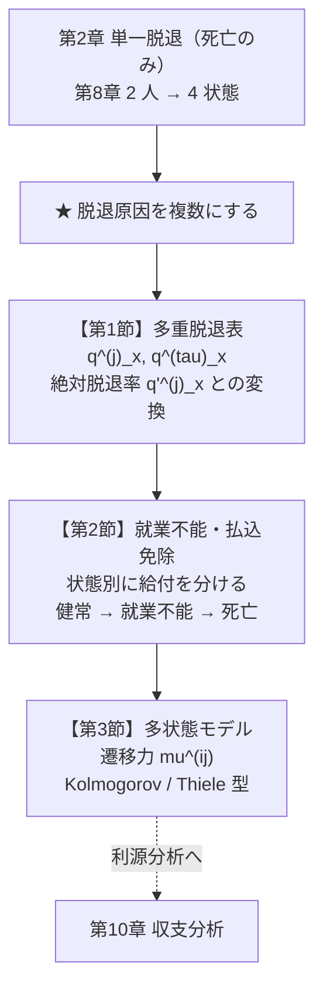
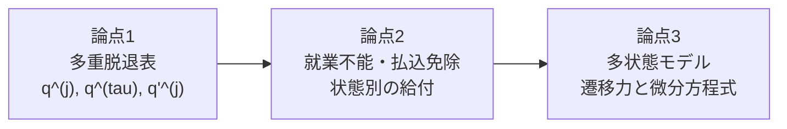
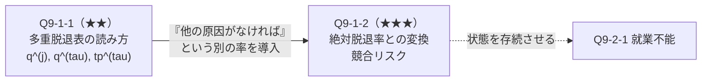
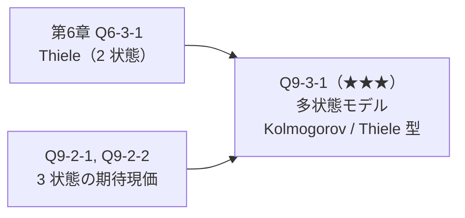
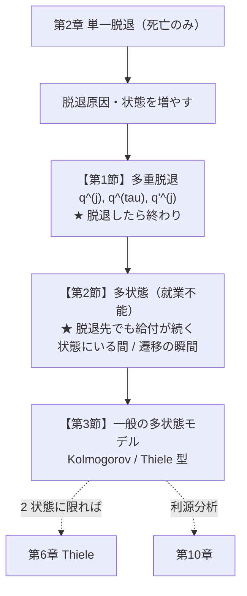
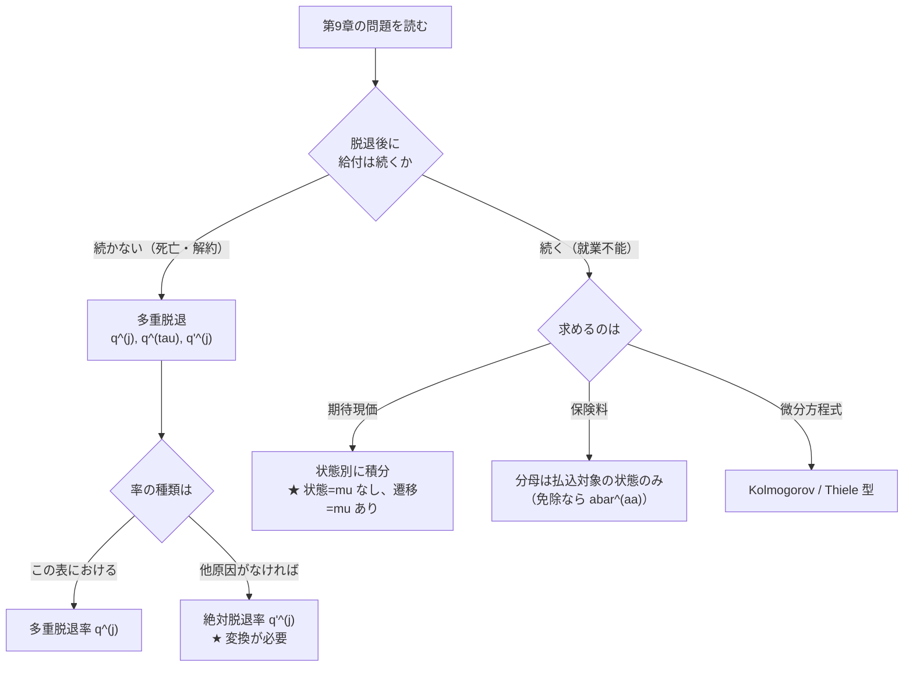

# 第9章　多重脱退と多状態モデル

> [← 第8章 連生と最終生存](第08章_連生と最終生存.md) ｜ **第9章** ｜ [第10章 総合応用と収支分析 →](第10章_総合応用と収支分析.md)

---

## 章の地図



**この図の読み方**：第9章は **第2章の「死亡だけ」を「複数の脱退原因」に一般化** する章です。
第8章が「人数を増やした」のに対し、第9章は **「状態の種類を増やした」** 拡張です。

---

## この章で学ぶこと

第2章では、被保険者は「生存」か「死亡」の2状態しかありませんでした。
実際には、契約は **死亡以外の理由でも消滅** します。

| 脱退原因 | 例 |
|---|---|
| 死亡 | 死亡保険金の支払 |
| 解約・失効 | 契約者の意思 |
| 就業不能 | 障害状態への移行 |
| 定年退職 | 企業年金 |

これらを同時に扱うのが **多重脱退（multiple decrement）** です。

さらに、就業不能のように **「脱退後も別の状態として存続する」** 場合は、
**多状態モデル（multi-state model）** が必要になります。

```text
   単一脱退（第2章）：  生存 ──→ 死亡

   多重脱退（第1節）：  在籍 ──┬─→ 死亡
                              └─→ 解約

   多状態（第2・3節）： 健常 ──┬─→ 就業不能 ──→ 死亡
                              └─→ 死亡
                       ★ 就業不能は「脱退先」でありながら給付が続く
```

---

## この章の全体像



```text
学習順序：
① 脱退原因が複数ある表を読む            …… l^(tau), d^(j), q^(j)
        ↓
② 「他の原因がなければ」の率と変換する    …… 絶対脱退率 q'^(j)
        ↓
③ 状態遷移図を描く
        ↓
④ 状態ごとに給付を分けて期待現価を作る
        ↓
⑤ 遷移力で微分方程式を立てる
```

---

## 最初に頭に入れるべきポイント

### 2種類の脱退率を区別する

これが第9章で最も重要な区別です。

| 記号 | 名称 | 意味 |
|---|---|---|
| $q^{(j)}_x$ | **多重脱退率** | この表において、原因 $j$ で脱退する確率（他の原因も存在する） |
| $q'^{(j)}_x$ | **絶対脱退率** | **他の原因が存在しなければ** 原因 $j$ で脱退する確率 |

```text
   絶対脱退率 q'^(d) = 0.004   （死亡だけを考えたときの死亡率）
   絶対脱退率 q'^(w) = 0.10    （解約だけを考えたときの解約率）
        ↓
   両方が同時に働くと…
        ↓
   多重脱退率 q^(d) = 0.0038   ← ★ 小さくなる
   多重脱退率 q^(w) = 0.0998   ← ★ 小さくなる

  ★ なぜ小さくなるか：
    「死亡する前に解約してしまう人」がいるため、
    死亡として計上される人が減る
```

**常に $q^{(j)}_x<q'^{(j)}_x$** です（他の原因に「取られる」ため）。

### 生存確率は積、脱退力は和

$$_tp^{(\tau)}_x=\prod_j{}_tp'^{(j)}_x,\qquad
\mu^{(\tau)}_x=\sum_j\mu^{(j)}_x$$

**これは第8章の連生とまったく同じ構造** です。

| | 第8章（連生） | 第9章（多重脱退） |
|---|---|---|
| 生存確率 | ${}_tp_{xy}={}_tp_x{}_tp_y$ | ${}_tp^{(\tau)}_x=\prod{}_tp'^{(j)}_x$ |
| 力 | $\mu_{xy}=\mu_x+\mu_y$ | $\mu^{(\tau)}=\sum\mu^{(j)}$ |
| 意味 | 「2人とも生存」 | 「どの原因でも脱退しない」 |

**「すべてを免れる確率は、個々を免れる確率の積」** という同じ論理です。

### 変換公式（UDD のもとで）

$$q^{(1)}_x=q'^{(1)}_x\left(1-\tfrac12 q'^{(2)}_x\right),\qquad
q^{(2)}_x=q'^{(2)}_x\left(1-\tfrac12 q'^{(1)}_x\right)$$

**この2式を足すと、厳密に $q^{(\tau)}_x$ になります**（Q9-1-2 で確認）。

$$q^{(1)}+q^{(2)}=q'^{(1)}+q'^{(2)}-q'^{(1)}q'^{(2)}
=1-\left(1-q'^{(1)}\right)\left(1-q'^{(2)}\right)=q^{(\tau)}$$

### 多状態モデルは「状態遷移図がすべて」

```text
   3 状態モデル（就業不能）：

              mu^(ai)
   ┌─────┐ ─────────→ ┌──────────┐
   │ a   │             │    i     │
   │健常 │             │ 就業不能 │
   └──┬──┘             └────┬─────┘
      │ mu^(ad)              │ mu^(id)
      │                      │
      └──────→ ┌───┐ ←──────┘
               │ d │
               │死亡│
               └───┘

  ★ 給付を「どの状態にいるとき」「どの遷移が起きたとき」で分けて考える
    ├─ 状態 i にいる間 → 就業不能年金
    ├─ 遷移 a→d, i→d  → 死亡保険金
    └─ 状態 a にいる間 → 保険料払込（★ i に移ると払込免除）
```

**状態遷移図を描かずに式を書こうとすると必ず混乱します。**

---

## 基本記号・基本公式

### 多重脱退

| 記号 | 意味 |
|---|---|
| $l^{(\tau)}_x$ | 全脱退原因を考慮した残存数 |
| $d^{(j)}_x$ | 原因 $j$ による脱退数 |
| $d^{(\tau)}_x$ | $\sum_j d^{(j)}_x=l^{(\tau)}_x-l^{(\tau)}_{x+1}$ |
| $q^{(j)}_x$ | $\dfrac{d^{(j)}_x}{l^{(\tau)}_x}$（多重脱退率） |
| $q^{(\tau)}_x$ | $\sum_j q^{(j)}_x$ |
| $q'^{(j)}_x$ | 絶対脱退率（他原因なしの場合） |
| ${}_tp^{(\tau)}_x$ | $\dfrac{l^{(\tau)}_{x+t}}{l^{(\tau)}_x}$ |
| $\mu^{(j)}_x$ | 原因 $j$ の脱退力 |

**関係式**

$$q^{(\tau)}_x=\sum_j q^{(j)}_x,\qquad
\mu^{(\tau)}_x=\sum_j\mu^{(j)}_x,\qquad
{}_tp^{(\tau)}_x=\exp\left(-\int_0^t\mu^{(\tau)}_{x+s}ds\right)=\prod_j{}_tp'^{(j)}_x$$

$$1-q^{(\tau)}_x=\prod_j\left(1-q'^{(j)}_x\right)$$

**変換（2原因、UDD）**

$$q^{(1)}_x=q'^{(1)}_x\left(1-\tfrac12 q'^{(2)}_x\right),\qquad
q'^{(1)}_x=1-\left(1-q^{(\tau)}_x\right)^{q^{(1)}_x/q^{(\tau)}_x}$$

### 多状態モデル

| 記号 | 意味 |
|---|---|
| ${}_tp^{ij}_x$ | 状態 $i$ から $t$ 年後に状態 $j$ にいる確率 |
| $\mu^{ij}_{x+t}$ | 状態 $i$ から $j$ への遷移力 |
| ${}_tp^{\overline{ii}}_x$ | $t$ 年間ずっと状態 $i$ に留まる確率 |

**留まる確率**

$$_tp^{\overline{ii}}_x=\exp\left(-\int_0^t\sum_{j\ne i}\mu^{ij}_{x+s}\,ds\right)$$

**Kolmogorov 前進方程式**

$$\frac{\partial}{\partial t}{}_tp^{ij}_x
=\sum_{k\ne j}\left({}_tp^{ik}_x\,\mu^{kj}_{x+t}-{}_tp^{ij}_x\,\mu^{jk}_{x+t}\right)$$

「状態 $j$ への流入 $-$ 状態 $j$ からの流出」です。

---

## 試験での主な問われ方

| 出題形態 | 典型的な問われ方 | 対応する問題 |
|---|---|---|
| 小問 | 多重脱退表から $q^{(j)}$、$q^{(\tau)}$ を計算 | Q9-1-1 |
| 記述式 | 絶対脱退率と多重脱退率の変換 | Q9-1-2 |
| 記述式 | 就業不能給付の期待現価 | Q9-2-1 |
| 記述式 | 保険料払込免除特約の評価 | Q9-2-2 |
| 記述式 | 多状態モデルの遷移確率と微分方程式 | Q9-3-1 |
| 他章との複合 | 利源分析（第10章） | 全問 |

---

## 問題を見分けるためのサイン

| 問題文中の表現 | 判断すること |
|---|---|
| 「脱退原因が複数」「死亡と解約」 | 多重脱退 |
| 「この表における死亡率」 | **多重脱退率** $q^{(j)}$ |
| 「他の原因が存在しないとした場合の」 | **絶対脱退率** $q'^{(j)}$ |
| 「残存数 $l^{(\tau)}$」 | 多重脱退表 |
| 「就業不能」「障害状態」 | **多状態モデル**（脱退後も存続） |
| 「回復可能」 | $i\to a$ の遷移力が必要 |
| 「回復不能」 | $i\to a$ の遷移なし（本章の標準） |
| 「保険料払込免除」 | 状態 $i$ では保険料を払わない |
| 「遷移力」「$\mu^{ij}$」 | 多状態モデル |
| 「一度移行したら戻れない」 | 不可逆モデル |

**⚠ 特に注意すべき語**

* 「**この表における**」＝多重脱退率、「**他の原因がなければ**」＝絶対脱退率。
* 「**回復可能か**」で状態遷移図が大きく変わります。
* 就業不能は「脱退」ですが **契約は消滅しません**（給付が続く）。

---

## この章の問題一覧

| ID | 表題 | 難 | 段階 | この問題の役割 |
|---|---|---|---|---|
| **第1節　多重脱退表** | | | | |
| Q9-1-1 | 多重脱退表の構成 | ★★ | ① | 表の読み方と $q^{(j)}$、$q^{(\tau)}$ |
| Q9-1-2 | 絶対脱退率と多重脱退率の変換 | ★★★ | ③ | 2種類の率の関係。競合リスク |
| **第2節　就業不能と払込免除** | | | | |
| Q9-2-1 | 就業不能給付の期待現価 | ★★★ | ③ | 状態別に給付を分ける |
| Q9-2-2 | 保険料払込免除特約 | ★★★ | ④ | 払込条件が状態に依存する |
| **第3節　多状態モデル** | | | | |
| Q9-3-1 | 多状態モデルの遷移確率と責任準備金 | ★★★ | ⑤ | 微分方程式による定式化 |

---
---

# 第1節　多重脱退表

## この節のテーマ

**脱退原因が複数ある場合の表の読み方と、2種類の脱退率の変換** を扱います。

## この節でできるようになること

* 多重脱退表から $q^{(j)}_x$、$q^{(\tau)}_x$、${}_tp^{(\tau)}_x$ を計算できる
* 多重脱退率と絶対脱退率の違いを説明できる
* 両者を相互に変換できる
* $q^{(j)}<q'^{(j)}$ となる理由を説明できる

## 頭に入れるべきポイント

### 表の構造

```text
   x     l^(tau)_x     d^(d)_x     d^(w)_x     d^(tau)_x
   ────────────────────────────────────────────────────
   50     100000         380         9980        10360
   51      89640         385          8049         8434
   52      81205         390          6480         6870

   ★ l^(tau)_{x+1} = l^(tau)_x - d^(tau)_x
     d^(tau)_x = d^(d)_x + d^(w)_x

   q^(j)_x = d^(j)_x / l^(tau)_x       ← ★ 分母は必ず l^(tau)_x
   q^(tau)_x = d^(tau)_x / l^(tau)_x = Σ_j q^(j)_x
```

**分母は常に $l^{(\tau)}_x$**（その年齢の残存者）です。
第2章の $q_x=d_x/l_x$ と同じ構造で、分子が原因別に分かれただけです。

### 2種類の率の関係を「競合」で理解する

```text
   死亡と解約が競合している：

   時点  x                              x+1
         |--------------------------------|

   解約がなければ  : 死亡する人が 0.004（= q'^(d)）
   実際には        : その一部が「死亡する前に解約」してしまう
                     ↓
                   死亡として計上されるのは 0.0038（= q^(d)）

  ★ q^(d) < q'^(d)   常に成立
    「他の原因に取られる」ため
```

### 変換公式の覚え方

$$q^{(1)}=q'^{(1)}\left(1-\tfrac12 q'^{(2)}\right)$$

```text
   q'^(1)         : 原因 1 だけなら、これだけ脱退する
   × (1 - q'^(2)/2) : ★ 原因 2 に「取られる」分を割り引く
                       平均して期中の半分の時点で取られるので 1/2
```

**$\frac12$ が付く理由**：UDD のもとで、原因2による脱退が
年度内に一様に起きると、原因1で脱退できたはずの人のうち
**平均して半分の期間だけ** 原因2にさらされるためです。

## 使用する記号・公式

| 関係 | 式 | 成立条件 |
|---|---|---|
| 脱退率の和 | $q^{(\tau)}_x=\sum_j q^{(j)}_x$ | 常に |
| 脱退力の和 | $\mu^{(\tau)}_x=\sum_j\mu^{(j)}_x$ | 常に |
| 生存確率の積 | ${}_tp^{(\tau)}_x=\prod_j{}_tp'^{(j)}_x$ | 常に |
| 年間の関係 | $1-q^{(\tau)}_x=\prod_j\left(1-q'^{(j)}_x\right)$ | 常に |
| 絶対 → 多重（2原因） | $q^{(1)}=q'^{(1)}\left(1-\frac12 q'^{(2)}\right)$ | UDD（各単一脱退表） |
| 多重 → 絶対 | $q'^{(j)}_x=1-\left(1-q^{(\tau)}_x\right)^{q^{(j)}_x/q^{(\tau)}_x}$ | UDD（多重脱退表） |

## 基本的な解法パターン

```text
① 与えられた率が「多重」か「絶対」かを判定する
   ├─ 「この表における」→ 多重 q^(j)
   └─ 「他の原因がなければ」→ 絶対 q'^(j)
        ↓
② 求めるものが「多重」か「絶対」かを判定する
        ↓
③ 同じ種類なら直接計算、違えば変換公式
        ↓
④ 検算：
   ・q^(j) < q'^(j)
   ・Σ q^(j) = q^(tau)
   ・1 - q^(tau) = Π(1 - q'^(j))
```

## 間違えやすい点

| 誤り | 内容 | 防ぎ方 |
|---|---|---|
| 分母 | $q^{(j)}=d^{(j)}/l^{(\tau)}_{x+1}$ | 分母は $l^{(\tau)}_x$ |
| 2種類の率の混同 | $q^{(j)}$ と $q'^{(j)}$ | 「この表における」か「他原因なし」か |
| 大小関係 | $q^{(j)}>q'^{(j)}$ とする | 常に $q^{(j)}<q'^{(j)}$ |
| 絶対脱退率の和 | $\sum q'^{(j)}=q^{(\tau)}$ とする | 積の関係（$1-q^{(\tau)}=\prod(1-q'^{(j)})$） |
| $\frac12$ の位置 | $\left(1-q'^{(2)}\right)$ とする | $\left(1-\frac12 q'^{(2)}\right)$ |

## この節の問題の流れ



---
---

## 問題 Q9-1-1　多重脱退表の構成

| 項目 | 内容 |
|---|---|
| 出題年度 | `要照合`（記入欄：______年度） |
| 問題番号 | `要照合`（記入欄：問題___） |
| 分野・論点 | 多重脱退 ／ 表の構成 |
| 難易度 | ★★ |
| この節での位置づけ | 段階①（定義を直接使う）。本章の基準となる問題 |
| 関連する問題 | 発展元：Q2-1-1（生命表） ／ 本問 ／ 後続：Q9-1-2、Q9-2-1 |

### ■ この問題で押さえるべきポイント

#### ① 何を問う問題か

**多重脱退表から各種の脱退率・残存確率を計算させる問題** です。

構造は第2章の生命表とまったく同じで、**分子が原因別に分かれただけ** です。

#### ② 問題文から読み取るべき条件

| 条件 | 解法への影響 |
|---|---|
| 「残存数 $l^{(\tau)}_x$」 | 全原因を考慮した残存者数 |
| 「死亡による脱退数 $d^{(d)}_x$」 | 原因別の脱退数 |
| 「この表における死亡率」 | **多重脱退率** $q^{(d)}_x$ |
| 「3年間残存する確率」 | ${}_3p^{(\tau)}_{50}=l^{(\tau)}_{53}/l^{(\tau)}_{50}$ |

#### ③ 最初に注目する場所

**分母が $l^{(\tau)}_x$（その年齢の残存者）であること**。
第2章の $q_x=d_x/l_x$ と同じで、分母を取り違えないことが第一です。

#### ④ 呼び出すべき知識

| 知識 | なぜこの問題で使うか |
|---|---|
| $q^{(j)}_x=d^{(j)}_x/l^{(\tau)}_x$ | 多重脱退率の定義 |
| $q^{(\tau)}_x=\sum_j q^{(j)}_x$ | 全原因の脱退率 |
| $l^{(\tau)}_{x+1}=l^{(\tau)}_x-d^{(\tau)}_x$ | 表の再帰構造 |
| ${}_tp^{(\tau)}_x=l^{(\tau)}_{x+t}/l^{(\tau)}_x$ | 残存確率（第2章と同形） |

#### ⑤ 解法の骨格

```text
1. 表の構造を確認（l^(tau)、原因別 d^(j)）
2. q^(j) = d^(j)/l^(tau)  ← 分母は必ず l^(tau)_x
3. q^(tau) = Σ q^(j)
4. l^(tau)_{x+1} = l^(tau)_x - d^(tau)_x で次の行へ
5. tp^(tau) は両端の l^(tau) の比
```

#### ⑥ 間違えやすい点

* 分母に $l^{(\tau)}_{x+1}$ を使う
* 原因別の脱退数を足し忘れる
* 多重脱退率を絶対脱退率と混同する
* ${}_tp^{(\tau)}$ を原因別の積で計算しようとする

#### ⑦ この問題を一言で捉えると

> **「第2章の生命表の $d_x$ が原因別に分かれただけ」の問題。**

### ■ 問題の構造図

```text
多重脱退表の構造：

   x = 50 : l^(tau) = 100000 人
              │
      ┌───────┼────────┐
      │       │        │
   死亡 380  解約 9980  残存 89640
      │       │        │
      └───┬───┘        │
    d^(tau) = 10360     │
                        ↓
   x = 51 : l^(tau) = 89640 人
              │
      ┌───────┼────────┐
   死亡 385  解約 8049  残存 81205
              ...


率の計算（分母は常に l^(tau)_x）：

   q^(d)_50   = 380 / 100000   = 0.003800
   q^(w)_50   = 9980 / 100000  = 0.099800
   q^(tau)_50 = 10360 / 100000 = 0.103600 = 0.003800 + 0.099800  ✓


第2章の生命表との対応：

   第2章 :  l_x  ──d_x──→  l_{x+1}          q_x = d_x / l_x
   第9章 :  l^(tau)_x ──d^(d)_x + d^(w)_x──→ l^(tau)_{x+1}
                        q^(j)_x = d^(j)_x / l^(tau)_x

  ★ 分子が原因別に分かれただけで、構造は完全に同じ
```

### ■ 問題

ある多重脱退表（脱退原因は死亡 $d$ と解約 $w$ の2つ）が次のとおり与えられている。

| $x$ | $l^{(\tau)}_x$ | $d^{(d)}_x$ | $d^{(w)}_x$ |
|---|---|---|---|
| 50 | $100000.0$ | $380.0$ | $9980.0$ |
| 51 | $89640.0$ | $385.2$ | $8049.4$ |
| 52 | $81205.3$ | $389.8$ | $6480.2$ |
| 53 | $74335.4$ | — | — |

**(1)** $q^{(d)}_{50}$、$q^{(w)}_{50}$、$q^{(\tau)}_{50}$ を求めよ（小数第6位まで）。

**(2)** $q^{(d)}_{51}$、$q^{(w)}_{51}$、$q^{(\tau)}_{51}$ を求めよ（小数第6位まで）。

**(3)** $l^{(\tau)}_{51}=l^{(\tau)}_{50}-d^{(d)}_{50}-d^{(w)}_{50}$ が成り立つことを確認せよ。

**(4)** ${}_3p^{(\tau)}_{50}$（50歳の在籍者が3年間いずれの原因でも脱退しない確率）を
求めよ（小数第6位まで）。

**(5)** 50歳の在籍者が3年以内に **死亡により** 脱退する確率を求めよ（小数第6位まで）。

> 本問は再現題です。原文の出題年度・問題番号は未照合です。

### ■ 問題文を数理モデルへ変換

| 確認項目 | 問題文から読み取れる内容 | 数理的な表現 |
|---|---|---|
| 脱退原因 | 死亡と解約の2つ | $j\in\{d,w\}$ |
| 残存数 | $l^{(\tau)}_x$ | 全原因考慮後 |
| 脱退数 | $d^{(d)}_x$、$d^{(w)}_x$ | 原因別 |
| 「この表における」 | — | **多重脱退率** $q^{(j)}$ |
| (5) 3年以内の死亡 | 累積 | $\sum_{t=0}^{2}{}_tp^{(\tau)}_{50}\,q^{(d)}_{50+t}$ |

### ■ 解法フロー

```text
STEP 1　(1) 50 歳の各率を求める
STEP 2　(2) 51 歳の各率を求める
STEP 3　(3) 表の再帰構造を確認する
STEP 4　(4) 残存確率を比で求める
STEP 5　(5) 原因別の累積脱退確率を求める
```

### ■ 詳細解説

#### STEP 1　(1) 50歳の脱退率

*目的：分母を $l^{(\tau)}_{50}$ に固定する。*

$$q^{(d)}_{50}=\frac{d^{(d)}_{50}}{l^{(\tau)}_{50}}=\frac{380.0}{100000.0}=0.003800$$

$$q^{(w)}_{50}=\frac{d^{(w)}_{50}}{l^{(\tau)}_{50}}=\frac{9980.0}{100000.0}=0.099800$$

$$q^{(\tau)}_{50}=q^{(d)}_{50}+q^{(w)}_{50}=0.003800+0.099800=0.103600$$

$$\boxed{q^{(d)}_{50}=0.003800,\quad q^{(w)}_{50}=0.099800,\quad q^{(\tau)}_{50}=0.103600}$$

**検算**：$d^{(\tau)}_{50}=380.0+9980.0=10360.0$ より

$$q^{(\tau)}_{50}=\frac{10360.0}{100000.0}=0.103600\quad\checkmark$$

**解約率が死亡率よりはるかに大きい** ことに注目してください（$0.0998$ vs $0.0038$）。
実務でも、若年〜中年層では解約が最大の脱退原因です。

#### STEP 2　(2) 51歳の脱退率

*目的：分母が変わることを確認する。*

**分母は $l^{(\tau)}_{51}=89640.0$** です（$100000$ ではありません）。

$$q^{(d)}_{51}=\frac{385.2}{89640.0}=0.004297$$

$$q^{(w)}_{51}=\frac{8049.4}{89640.0}=0.089798$$

$$q^{(\tau)}_{51}=0.004297+0.089798=0.094095$$

$$\boxed{q^{(d)}_{51}=0.004297,\quad q^{(w)}_{51}=0.089798,\quad q^{(\tau)}_{51}=0.094095}$$

**⚠ 分母の取り違えが最頻出の誤り** です。
$q^{(d)}_{51}$ を $385.2/100000=0.003852$ としてしまうと、
これは $q^{(d)}_{51}$ ではなく **${}_{1\vert}q^{(d)}_{50}$**（据置脱退確率）になります。

**傾向の確認**：
* $q^{(d)}$ は $0.003800\to0.004297$ と **増加**（加齢による死亡率上昇）
* $q^{(w)}$ は $0.099800\to0.089798$ と **減少**（契約継続年数が長いほど解約しにくい）

これは実務の傾向と一致します。

#### STEP 3　(3) 表の再帰構造

$$l^{(\tau)}_{50}-d^{(d)}_{50}-d^{(w)}_{50}=100000.0-380.0-9980.0=89640.0=l^{(\tau)}_{51}\quad\checkmark$$

$$l^{(\tau)}_{51}-d^{(d)}_{51}-d^{(w)}_{51}=89640.0-385.2-8049.4=81205.4\approx l^{(\tau)}_{52}=81205.3$$

（末位の差は表の丸めによるもの。）

$$l^{(\tau)}_{52}-d^{(d)}_{52}-d^{(w)}_{52}=81205.3-389.8-6480.2=74335.3\approx l^{(\tau)}_{53}=74335.4$$

**すべての原因による脱退数を引くと次の年齢の残存数になる** という、
第2章の $l_{x+1}=l_x-d_x$ と同じ構造です。

#### STEP 4　(4) 3年間の残存確率

*目的：両端の比を取る。*

$$_3p^{(\tau)}_{50}=\frac{l^{(\tau)}_{53}}{l^{(\tau)}_{50}}=\frac{74335.4}{100000.0}=0.743354$$

$$\boxed{{}_3p^{(\tau)}_{50}=0.743354}$$

**意味**：50歳の在籍者のうち、3年後も在籍している（死亡も解約もしていない）のは
**約 $74.3\%$** です。

**別解（乗法）**

$$_3p^{(\tau)}_{50}=p^{(\tau)}_{50}\,p^{(\tau)}_{51}\,p^{(\tau)}_{52}$$

$$=(1-0.103600)(1-0.094095)(1-0.084600)$$

（$q^{(\tau)}_{52}=\dfrac{389.8+6480.2}{81205.3}=\dfrac{6870.0}{81205.3}=0.084600$）

$$=0.896400\times0.905905\times0.915400=0.743354\quad\checkmark$$

**第2章 Q2-1-1 と同じく、比を取る方が速く丸め誤差も少ない** です。

#### STEP 5　(5) 3年以内の死亡による脱退

*目的：原因別の累積確率を作る。*

**「3年以内に死亡により脱退する」** とは、
1年目・2年目・3年目のいずれかで **死亡** することです。
（解約で脱退した人は、その後死亡しても表には現れません。）

$$\text{求める確率}=\sum_{t=0}^{2}{}_tp^{(\tau)}_{50}\times q^{(d)}_{50+t}$$

**より簡単には、死亡による脱退数を直接足します。**

$$=\frac{d^{(d)}_{50}+d^{(d)}_{51}+d^{(d)}_{52}}{l^{(\tau)}_{50}}
=\frac{380.0+385.2+389.8}{100000.0}=\frac{1155.0}{100000.0}$$

$$\boxed{0.011550}$$

**確認（積和による計算）**

| $t$ | ${}_tp^{(\tau)}_{50}$ | $q^{(d)}_{50+t}$ | 積 |
|---|---|---|---|
| 0 | $1.000000$ | $0.003800$ | $0.003800$ |
| 1 | $0.896400$ | $0.004297$ | $0.003852$ |
| 2 | $0.812053$ | $0.004800$ | $0.003898$ |
| | | **合計** | **0.011550** |

（$q^{(d)}_{52}=389.8/81205.3=0.004800$、${}_2p^{(\tau)}_{50}=81205.3/100000=0.812053$）

一致します。✓

**⚠ 重要な注意**：この $0.011550$ は
**「死亡と解約が両方存在する世界での、死亡による脱退確率」** です。

「解約がなければ3年以内に死亡する確率」は **これより大きく** なります。
その計算には絶対脱退率が必要です（Q9-1-2）。

### ■ 答え

| 設問 | 量 | 値 |
|---|---|---|
| (1) | $q^{(d)}_{50}$ | $0.003800$ |
| | $q^{(w)}_{50}$ | $0.099800$ |
| | $q^{(\tau)}_{50}$ | $0.103600$ |
| (2) | $q^{(d)}_{51}$ | $0.004297$ |
| | $q^{(w)}_{51}$ | $0.089798$ |
| | $q^{(\tau)}_{51}$ | $0.094095$ |
| (4) | ${}_3p^{(\tau)}_{50}$ | $0.743354$ |
| (5) | 3年以内の死亡脱退確率 | $0.011550$ |

**(3)** $100000.0-380.0-9980.0=89640.0=l^{(\tau)}_{51}$ で成立する
（$51\to52$、$52\to53$ も同様、末位の差は表の丸めによる）。

### ■ 試験答案としての書き方

> **(1)** $q^{(j)}_x=\dfrac{d^{(j)}_x}{l^{(\tau)}_x}$ より
> $q^{(d)}_{50}=\dfrac{380.0}{100000.0}=0.003800$、
> $q^{(w)}_{50}=\dfrac{9980.0}{100000.0}=0.099800$
> $q^{(\tau)}_{50}=0.003800+0.099800=0.103600$
>
> **(2)** 分母は $l^{(\tau)}_{51}=89640.0$ であるから
> $q^{(d)}_{51}=\dfrac{385.2}{89640.0}=0.004297$、
> $q^{(w)}_{51}=\dfrac{8049.4}{89640.0}=0.089798$
> $q^{(\tau)}_{51}=0.094095$
>
> **(3)** $l^{(\tau)}_{50}-d^{(d)}_{50}-d^{(w)}_{50}=100000.0-380.0-9980.0=89640.0=l^{(\tau)}_{51}$
>
> **(4)** ${}_3p^{(\tau)}_{50}=\dfrac{l^{(\tau)}_{53}}{l^{(\tau)}_{50}}
> =\dfrac{74335.4}{100000.0}=0.743354$
>
> **(5)** 3年以内に死亡により脱退する確率は
> $\dfrac{d^{(d)}_{50}+d^{(d)}_{51}+d^{(d)}_{52}}{l^{(\tau)}_{50}}
> =\dfrac{380.0+385.2+389.8}{100000.0}=\dfrac{1155.0}{100000.0}=0.011550$
> （$\sum_{t=0}^{2}{}_tp^{(\tau)}_{50}\,q^{(d)}_{50+t}$ としても同じ。）

### ■ 解答後に確認すること

| 項目 | 内容 |
|---|---|
| **最も重要なポイント** | $q^{(j)}_x=\dfrac{d^{(j)}_x}{l^{(\tau)}_x}$。**分母は常にその年齢の残存数 $l^{(\tau)}_x$**。第2章の生命表と同じ構造 |
| **最初に気づくべきだった条件** | 「この表における」＝多重脱退率。他原因が存在する世界の率である |
| **他の問題にも使える考え方** | ① 残存確率は両端の $l^{(\tau)}$ の比（乗法より速く正確）。② 原因別の累積確率は脱退数を足すのが最速。③ 解約率は死亡率よりはるかに大きい |
| **類似問題との違い** | Q2-1-1 は原因が死亡のみ。本問は原因が複数。分子が分かれただけで構造は同じ。Q9-1-2 は「他原因がなければ」という別の世界の率を扱う |
| **条件が変わった場合** | ① 原因が3つ以上でも同じ（$q^{(\tau)}=\sum q^{(j)}$）。② 就業不能を原因に含めると、脱退後も給付が続くため多状態モデルが必要（第2節）。③ 絶対脱退率が問われたら変換が必要 |
| **復習時に思い出すこと** | $q^{(j)}_x=d^{(j)}_x/l^{(\tau)}_x$、$q^{(\tau)}_x=\sum_j q^{(j)}_x$、${}_tp^{(\tau)}_x=l^{(\tau)}_{x+t}/l^{(\tau)}_x$ |

---
---

## 問題 Q9-1-2　絶対脱退率と多重脱退率の変換

| 項目 | 内容 |
|---|---|
| 出題年度 | `要照合`（記入欄：______年度） |
| 問題番号 | `要照合`（記入欄：問題___） |
| 分野・論点 | 多重脱退 ／ 競合リスク |
| 難易度 | ★★★ |
| この節での位置づけ | 段階③（複数の論点を組み合わせる）。2つの「世界」の率を結ぶ |
| 関連する問題 | 発展元：Q9-1-1、Q2-3-2（UDD） ／ 本問 ／ 後続：Q9-2-1 |

### ■ この問題で押さえるべきポイント

#### ① 何を問う問題か

**「他の原因が存在しなければ」の脱退率（絶対脱退率）と、
実際の表の脱退率（多重脱退率）を相互変換させる問題** です。

実務では、死亡率は生命表（死亡のみの世界）から、
解約率は経験データから得られるため、
**この変換なしには多重脱退表が作れません**。

#### ② 問題文から読み取るべき条件

| 条件 | 解法への影響 |
|---|---|
| 「他の原因が存在しないとした場合」 | **絶対脱退率** $q'^{(j)}$ |
| 「この表における」 | **多重脱退率** $q^{(j)}$ |
| 「各単一脱退表において UDD」 | 変換公式 $q^{(1)}=q'^{(1)}(1-\frac12 q'^{(2)})$ |
| 「多重脱退表において UDD」 | 逆変換 $q'^{(j)}=1-(1-q^{(\tau)})^{q^{(j)}/q^{(\tau)}}$ |

#### ③ 最初に注目する場所

**どちらの率が与えられ、どちらを求めるのか**。
プライム（$'$）の有無が世界の違いを表します。

#### ④ 呼び出すべき知識

| 知識 | なぜこの問題で使うか |
|---|---|
| $1-q^{(\tau)}=\prod_j\left(1-q'^{(j)}\right)$ | **常に成立する厳密な関係** |
| $q^{(1)}=q'^{(1)}\left(1-\frac12 q'^{(2)}\right)$ | UDD のもとでの変換 |
| $\mu^{(\tau)}=\sum\mu^{(j)}$ | 上式の根拠 |
| ${}_tp^{(\tau)}=\prod{}_tp'^{(j)}$ | 同上 |

#### ⑤ 解法の骨格

```text
1. 与えられた率の種類を判定（プライムの有無）
2. 厳密な関係 1 - q^(tau) = Π(1 - q'^(j)) を書く
3. UDD のもとでの変換公式を適用
   q^(1) = q'^(1)(1 - q'^(2)/2)
4. 検算：Σ q^(j) = q^(tau) が厳密に成立するか
5. q^(j) < q'^(j) を確認
```

#### ⑥ 間違えやすい点

* $\sum q'^{(j)}=q^{(\tau)}$ とする（積の関係が正しい）
* $\frac12$ を落とす
* 大小関係を逆にする
* 3原因の場合に2原因の公式をそのまま使う

#### ⑦ この問題を一言で捉えると

> **「他の原因に取られる分だけ、実際の脱退率は小さくなる」を式にする問題。**

### ■ 問題の構造図

```text
2 つの「世界」：

【世界A】死亡だけが存在する（絶対脱退率の世界）
   時点  x                              x+1
         |--------------------------------|
   1000 人中 4 人が死亡              q'^(d) = 0.004

【世界B】解約だけが存在する
   1000 人中 100 人が解約            q'^(w) = 0.10

【世界C】★ 両方が存在する（実際の多重脱退表）
   時点  x                              x+1
         |--------------------------------|
   死亡しかけた 4 人のうち、
   一部は「その前に解約」してしまう
        ↓
   死亡として計上されるのは 3.8 人   q^(d) = 0.0038  ← ★ 減る

   解約しかけた 100 人のうち、
   一部は「その前に死亡」してしまう
        ↓
   解約として計上されるのは 99.8 人  q^(w) = 0.0998  ← ★ 減る


変換の構造：

   q^(d) = q'^(d) × ( 1 - q'^(w)/2 )
            ↑            ↑
        絶対脱退率   解約に「取られる」割合
                     （平均して期中の半分だけさらされる）

  = 0.004 × ( 1 - 0.05 ) = 0.004 × 0.95 = 0.0038


★ 美しい性質：2 つを足すと厳密に q^(tau) になる

   q^(d) + q^(w) = q'd(1 - q'w/2) + q'w(1 - q'd/2)
                 = q'd + q'w - q'd·q'w
                 = 1 - (1 - q'd)(1 - q'w)
                 = 1 - p^(tau)
                 = q^(tau)              ← ★ 厳密に一致（近似ではない）
```

### ■ 問題

ある年齢 $x$ において、脱退原因は死亡 $d$ と解約 $w$ の2つとする。
**他の原因が存在しないとした場合の脱退率（絶対脱退率）** が

$$q'^{(d)}_x=0.004,\qquad q'^{(w)}_x=0.10$$

で与えられている。各単一脱退表において脱退が一様に分布する（UDD）と仮定する。

**(1)** $p^{(\tau)}_x$ および $q^{(\tau)}_x$ を求めよ（小数第6位まで）。

**(2)** 変換公式
$q^{(d)}_x=q'^{(d)}_x\left(1-\tfrac12 q'^{(w)}_x\right)$、
$q^{(w)}_x=q'^{(w)}_x\left(1-\tfrac12 q'^{(d)}_x\right)$
により多重脱退率を求めよ（小数第6位まで）。

**(3)** (2) で求めた $q^{(d)}_x+q^{(w)}_x$ が (1) の $q^{(\tau)}_x$ に
**厳密に** 一致することを、式の上で示せ。

**(4)** $q^{(j)}_x<q'^{(j)}_x$ となる理由を述べよ。
また、それぞれの減少率（$1-q^{(j)}/q'^{(j)}$）を求めよ。

**(5)** 解約がまったくない（$q'^{(w)}_x=0$）場合、$q^{(d)}_x$ はいくらになるか。
また解約率が非常に高い（$q'^{(w)}_x=0.5$）場合はどうか。
この結果から何が言えるか述べよ。

> 本問は再現題です。原文の出題年度・問題番号は未照合です。

### ■ 問題文を数理モデルへ変換

| 確認項目 | 問題文から読み取れる内容 | 数理的な表現 |
|---|---|---|
| 与えられた率 | 「他の原因が存在しないとした場合」 | **絶対脱退率** $q'^{(j)}$ |
| 求める率 | 表における脱退率 | **多重脱退率** $q^{(j)}$ |
| 仮定 | 各単一脱退表で UDD | 変換公式が使える |
| (1) | 全原因を免れる確率 | $p^{(\tau)}=\prod(1-q'^{(j)})$ |

### ■ 解法フロー

```text
STEP 1　(1) 積の関係で p^(tau) を求める
STEP 2　(2) 変換公式で多重脱退率を求める
STEP 3　(3) 和が厳密に q^(tau) になることを示す
STEP 4　(4) 大小関係の理由と減少率
STEP 5　(5) 極端な場合の考察
```

### ■ 詳細解説

#### STEP 1　(1) 全原因の残存確率

*目的：積の関係を使う。*

「どの原因でも脱退しない」ことは、「各原因を個別に免れる」ことの積です。

$$p^{(\tau)}_x=\left(1-q'^{(d)}_x\right)\left(1-q'^{(w)}_x\right)
=(1-0.004)(1-0.10)$$

$$=0.996\times0.90=0.896400$$

$$q^{(\tau)}_x=1-0.896400=0.103600$$

$$\boxed{p^{(\tau)}_x=0.896400,\qquad q^{(\tau)}_x=0.103600}$$

**この関係が厳密である理由**

$$_1p^{(\tau)}_x=\exp\left(-\int_0^1\mu^{(\tau)}_{x+s}ds\right)
=\exp\left(-\int_0^1\sum_j\mu^{(j)}_{x+s}ds\right)
=\prod_j\exp\left(-\int_0^1\mu^{(j)}_{x+s}ds\right)=\prod_j p'^{(j)}_x$$

**脱退力が和になることから、確率が積になります。**
これは第8章の連生（$_tp_{xy}={}_tp_x{}_tp_y$）とまったく同じ論理です。

**⚠ よくある誤り**：$q^{(\tau)}=q'^{(d)}+q'^{(w)}=0.104$ とすること。
正解 $0.103600$ とわずかに違います（差 $0.0004=q'^{(d)}q'^{(w)}$）。
**絶対脱退率は足せません。**

#### STEP 2　(2) 多重脱退率

*目的：変換公式を適用する。*

$$q^{(d)}_x=q'^{(d)}_x\left(1-\tfrac12 q'^{(w)}_x\right)
=0.004\times\left(1-\tfrac12\times0.10\right)$$

$$=0.004\times(1-0.05)=0.004\times0.95=0.003800$$

$$q^{(w)}_x=q'^{(w)}_x\left(1-\tfrac12 q'^{(d)}_x\right)
=0.10\times\left(1-\tfrac12\times0.004\right)$$

$$=0.10\times(1-0.002)=0.10\times0.998=0.099800$$

$$\boxed{q^{(d)}_x=0.003800,\qquad q^{(w)}_x=0.099800}$$

**Q9-1-1 の表の50歳の値と一致** します（$0.003800$、$0.099800$）。
つまり Q9-1-1 の表は、この絶対脱退率から作られていたことになります。

#### STEP 3　(3) 和が厳密に一致することの証明

*目的：近似ではなく恒等式であることを示す。*

$$q^{(d)}_x+q^{(w)}_x
=q'^{(d)}\left(1-\tfrac12 q'^{(w)}\right)+q'^{(w)}\left(1-\tfrac12 q'^{(d)}\right)$$

展開します。

$$=q'^{(d)}-\tfrac12 q'^{(d)}q'^{(w)}+q'^{(w)}-\tfrac12 q'^{(d)}q'^{(w)}$$

$-\frac12 q'^{(d)}q'^{(w)}$ が2つあるので、まとめると $-q'^{(d)}q'^{(w)}$ です。

$$=q'^{(d)}+q'^{(w)}-q'^{(d)}q'^{(w)}$$

因数分解します。

$$=1-\left(1-q'^{(d)}\right)\left(1-q'^{(w)}\right)$$

（展開すると $1-1+q'^{(d)}+q'^{(w)}-q'^{(d)}q'^{(w)}$ で一致。）

$$=1-p^{(\tau)}_x=q^{(\tau)}_x$$

$$\boxed{q^{(d)}_x+q^{(w)}_x=q^{(\tau)}_x\quad\text{（厳密に成立）}}$$

□

**数値確認**

$$0.003800+0.099800=0.103600=q^{(\tau)}_x\quad\checkmark$$

```text
式変形の流れ：

   q'd(1 - q'w/2) + q'w(1 - q'd/2)
     ↓ 展開
   q'd - (1/2)q'd·q'w + q'w - (1/2)q'd·q'w
     ↓ ★ -1/2 が 2 つで -1 になる
   q'd + q'w - q'd·q'w
     ↓ 因数分解
   1 - (1 - q'd)(1 - q'w)
     ↓ = 1 - p^(tau)
   q^(tau)                    ← ★ 厳密に一致
```

**この一致は偶然ではありません。** 変換公式の $\frac12$ という係数が、
ちょうど和が保存されるように選ばれているのです。
（3原因以上では変換公式がより複雑になり、
$\frac12$ に加えて $\frac13$ の項が現れます。）

#### STEP 4　(4) 大小関係と減少率

*目的：競合の効果を定量化する。*

**大小関係**

$$q^{(d)}_x=0.003800<q'^{(d)}_x=0.004$$

$$q^{(w)}_x=0.099800<q'^{(w)}_x=0.10$$

**理由**

```text
   絶対脱退率 q'^(d) = 0.004 は
   「死亡しか存在しない世界で、1000 人中 4 人が死亡する」という意味。

   しかし実際には解約も存在する。
        ↓
   その 4 人のうち、一部は「死亡する前に解約してしまう」
        ↓
   死亡として計上される人数が減る
        ↓
   q^(d) < q'^(d)

  ★ これを「競合リスク（competing risks）」という
```

**減少率**

$$1-\frac{q^{(d)}}{q'^{(d)}}=1-\frac{0.003800}{0.004}=1-0.95=0.05\quad(5\%)$$

$$1-\frac{q^{(w)}}{q'^{(w)}}=1-\frac{0.099800}{0.10}=1-0.998=0.002\quad(0.2\%)$$

$$\boxed{\text{死亡：}5\%\text{ 減}\quad\text{解約：}0.2\%\text{ 減}}$$

**減少率が非対称である理由**

```text
   死亡率が受ける影響 : 解約率 0.10 の半分 = 5%      ← ★ 大きい
   解約率が受ける影響 : 死亡率 0.004 の半分 = 0.2%   ← 小さい

  ★ 「相手の率が大きいほど、自分は大きく削られる」
    解約率が高いので、死亡率が大きく削られる
```

実務的には、**解約率が高い契約では死亡による脱退が過小に見える** ことを意味します。
死亡率を推定する際に解約を無視すると、死亡率を過小評価してしまいます。

#### STEP 5　(5) 極端な場合の考察

*目的：公式の挙動を確認する。*

**ケース1：解約がまったくない（$q'^{(w)}=0$）**

$$q^{(d)}_x=0.004\times\left(1-\tfrac12\times0\right)=0.004\times1=0.004=q'^{(d)}_x$$

$$\boxed{q^{(d)}_x=q'^{(d)}_x=0.004}$$

**多重脱退率と絶対脱退率が一致** します。
競合する原因がなければ、両者は同じものになります（当然）。

**ケース2：解約率が非常に高い（$q'^{(w)}=0.5$）**

$$q^{(d)}_x=0.004\times\left(1-\tfrac12\times0.5\right)=0.004\times0.75=0.003$$

$$\boxed{q^{(d)}_x=0.003}$$

絶対脱退率 $0.004$ の **$75\%$** にまで減ります。

**この結果から言えること**

| 観点 | 内容 |
|---|---|
| **① 競合の強さ** | 他原因の率が大きいほど、自分の多重脱退率は大きく削られる |
| **② 死亡率推定への含意** | 解約率の高い集団で死亡率を推定する際、解約を無視すると死亡率を **過小評価** する |
| **③ 実務上の注意** | 経験死亡率は必ず「解約等を考慮した絶対死亡率」に直してから生命表と比較する |
| **④ 商品設計への含意** | 解約率の想定が変わると、死亡給付の期待現価も変わる |

```text
   q'^(w) の値と q^(d) の関係：

   q'^(w)    0     0.1     0.2     0.5     0.9
   q^(d)   0.0040 0.0038  0.0036  0.0030  0.0022
            ↑                              ↑
        競合なし                    大きく削られる

  ★ q^(d) = q'^(d) × (1 - q'^(w)/2) は q'^(w) の一次減少関数
```

### ■ 答え

| 設問 | 量 | 値 |
|---|---|---|
| (1) | $p^{(\tau)}_x$ | $0.896400$ |
| | $q^{(\tau)}_x$ | $0.103600$ |
| (2) | $q^{(d)}_x$ | $0.003800$ |
| | $q^{(w)}_x$ | $0.099800$ |
| (4) | 死亡の減少率 | $5\%$ |
| | 解約の減少率 | $0.2\%$ |
| (5) | $q'^{(w)}=0$ のとき $q^{(d)}$ | $0.004$（$=q'^{(d)}$） |
| | $q'^{(w)}=0.5$ のとき $q^{(d)}$ | $0.003$ |

**(3)**

$$q^{(d)}+q^{(w)}=q'^{(d)}+q'^{(w)}-q'^{(d)}q'^{(w)}
=1-\left(1-q'^{(d)}\right)\left(1-q'^{(w)}\right)=1-p^{(\tau)}=q^{(\tau)}$$

$-\frac12 q'^{(d)}q'^{(w)}$ が2回現れて $-q'^{(d)}q'^{(w)}$ となることにより、
**厳密に**（近似ではなく）一致する。

**(4)** 絶対脱退率は「その原因だけが存在する世界」の率であるのに対し、
実際には他の原因により先に脱退する者がいるため、
当該原因で脱退する者が減る（競合リスク）。よって $q^{(j)}<q'^{(j)}$。
減少率は相手の絶対脱退率の半分に等しく、死亡は $5\%$、解約は $0.2\%$。

**(5)** $q'^{(w)}=0$ なら $q^{(d)}=q'^{(d)}=0.004$（競合がないので一致）。
$q'^{(w)}=0.5$ なら $q^{(d)}=0.003$（$75\%$ に減少）。
他原因の脱退率が高いほど当該原因の多重脱退率は大きく削られるため、
解約率の高い集団で死亡率を推定する際に解約を無視すると
死亡率を過小評価することになる。

### ■ 試験答案としての書き方

> 各単一脱退表において脱退が一様に分布すると仮定する。
>
> **(1)** 脱退力が和になることから残存確率は積になる。
> $p^{(\tau)}_x=\left(1-q'^{(d)}_x\right)\left(1-q'^{(w)}_x\right)
> =0.996\times0.90=0.896400$
> $q^{(\tau)}_x=1-0.896400=0.103600$
>
> **(2)** $q^{(d)}_x=0.004\left(1-\dfrac{0.10}{2}\right)=0.004\times0.95=0.003800$
> $q^{(w)}_x=0.10\left(1-\dfrac{0.004}{2}\right)=0.10\times0.998=0.099800$
>
> **(3)** $q^{(d)}_x+q^{(w)}_x
> =q'^{(d)}\left(1-\frac12 q'^{(w)}\right)+q'^{(w)}\left(1-\frac12 q'^{(d)}\right)$
> $=q'^{(d)}+q'^{(w)}-q'^{(d)}q'^{(w)}
> =1-\left(1-q'^{(d)}\right)\left(1-q'^{(w)}\right)=1-p^{(\tau)}_x=q^{(\tau)}_x$
> よって厳密に一致する。数値でも $0.003800+0.099800=0.103600$。
>
> **(4)** 絶対脱退率は当該原因のみが存在する場合の率であるが、
> 実際には他原因により先に脱退する者がいるため当該原因での脱退が減る。
> よって $q^{(j)}<q'^{(j)}$。
> 減少率は $1-\dfrac{q^{(d)}}{q'^{(d)}}=0.05$（$5\%$）、
> $1-\dfrac{q^{(w)}}{q'^{(w)}}=0.002$（$0.2\%$）。
>
> **(5)** $q'^{(w)}=0$：$q^{(d)}=0.004\times1=0.004=q'^{(d)}$
> $q'^{(w)}=0.5$：$q^{(d)}=0.004\times0.75=0.003$
> 他原因の脱退率が高いほど当該原因の多重脱退率は小さくなる。
> したがって解約率の高い集団では、解約を無視して死亡率を推定すると過小評価となる。

### ■ 解答後に確認すること

| 項目 | 内容 |
|---|---|
| **最も重要なポイント** | 絶対脱退率は **積** で結ばれ（$1-q^{(\tau)}=\prod(1-q'^{(j)})$）、足せない。変換は $q^{(1)}=q'^{(1)}(1-\frac12 q'^{(2)})$ |
| **最初に気づくべきだった条件** | プライムの有無（絶対か多重か）。「他の原因が存在しないとした場合」の一語 |
| **他の問題にも使える考え方** | ① 「力は和、確率は積」は第8章の連生と同じ論理。② 変換公式の和が厳密に $q^{(\tau)}$ になるのは係数 $\frac12$ の必然。③ 競合リスクは死亡率推定の実務問題に直結 |
| **類似問題との違い** | Q9-1-1 は表を読むだけ（多重脱退率のみ）。本問は2つの世界を行き来する。第8章 Q8-1-1 は「2人」、本問は「2原因」で構造が同じ |
| **条件が変わった場合** | ① 3原因なら $q^{(1)}=q'^{(1)}\left(1-\frac12(q'^{(2)}+q'^{(3)})+\frac13 q'^{(2)}q'^{(3)}\right)$。② 多重脱退表で UDD なら逆変換 $q'^{(j)}=1-(1-q^{(\tau)})^{q^{(j)}/q^{(\tau)}}$。③ 力が与えられれば近似不要で厳密計算できる |
| **復習時に思い出すこと** | $1-q^{(\tau)}=\prod\left(1-q'^{(j)}\right)$、$q^{(1)}=q'^{(1)}\left(1-\frac12 q'^{(2)}\right)$、$q^{(j)}<q'^{(j)}$ |

---

## 第1節　記憶用の一枚まとめ

```text
┌──────────────────────────────────────────────────────────────────────┐
│  第1節　多重脱退表                                                    │
└──────────────────────────────────────────────────────────────────────┘

【問題文のサイン】
   「脱退原因が複数」「死亡と解約」    → 多重脱退
   「この表における死亡率」            → ★ 多重脱退率 q^(j)
   「他の原因が存在しないとした場合」  → ★ 絶対脱退率 q'^(j)
   「残存数 l^(tau)」                  → 多重脱退表
        ↓
【判断する論点】
   与えられた率・求める率はどちらの世界か（プライムの有無）
   ├─ 同じ世界 → 直接計算
   └─ 違う世界 → ★ 変換公式
        ↓
【描くべき図】
   l^(tau)_x = 100000
        │
   ┌────┼─────┐
  死亡  解約   残存
  380  9980   89640
        ↓
   l^(tau)_{x+1} = 89640

   q^(j)_x = d^(j)_x / l^(tau)_x   ← ★ 分母は常に l^(tau)_x
        ↓
【使用する公式】
   q^(j)_x   = d^(j)_x / l^(tau)_x
   q^(tau)_x = Σ_j q^(j)_x = d^(tau)_x / l^(tau)_x
   tp^(tau)_x = l^(tau)_{x+t} / l^(tau)_x
   mu^(tau)  = Σ_j mu^(j)                    ← 力は和
   ★ 1 - q^(tau) = Π_j ( 1 - q'^(j) )        ← 確率は積（★ 絶対脱退率は足せない）
   ★ 変換（2原因・UDD）：
       q^(1) = q'^(1) ( 1 - q'^(2)/2 )
       q^(2) = q'^(2) ( 1 - q'^(1)/2 )
       ⇒ 和は厳密に q^(tau) になる
   逆変換： q'^(j) = 1 - ( 1 - q^(tau) )^{ q^(j)/q^(tau) }
   ★ 常に q^(j) < q'^(j)（競合リスク）
        ↓
【解答の基本手順】
   ① 率の種類を判定（プライムの有無）
   ② 表なら分母 l^(tau)_x に注意して割る
   ③ 世界が違えば変換公式
   ④ 検算：Σ q^(j) = q^(tau)、1-q^(tau) = Π(1-q'^(j))、q^(j) < q'^(j)
        ↓
【典型的なミス】
   ⚠ 分母に l^(tau)_{x+1} を使う      → l^(tau)_x
   ⚠ Σ q'^(j) = q^(tau) とする        → ★ 積の関係が正しい
   ⚠ 1/2 を落とす                     → q'^(1)(1 - q'^(2)/2)
   ⚠ q^(j) > q'^(j) とする            → 常に小さい
   ⚠ 多重と絶対を混同する             → 問題文の「この表における」を確認

【1行で】
   力は和、確率は積（第8章の連生と同じ論理）。
   絶対脱退率は「その原因だけの世界」の率。他原因に取られる分だけ多重は小さい。
```

---
---

# 第2節　就業不能と払込免除

## この節のテーマ

**脱退後も別の状態として存続する場合（就業不能）** を扱います。
多重脱退との決定的な違いは、**脱退先で給付が続く** ことです。

## この節でできるようになること

* 3状態モデル（健常・就業不能・死亡）の遷移確率を求められる
* 状態別に給付を分けて期待現価を作れる
* 保険料払込免除特約を評価できる
* 「どの状態にいるとき何が起きるか」を式に翻訳できる

## 頭に入れるべきポイント

### 多重脱退との違い

```text
【多重脱退（第1節）】脱退したら終わり
   在籍 ──┬─→ 死亡（給付して終了）
          └─→ 解約（給付なしで終了）

【多状態（本節）】脱退先でも給付が続く
   健常 a ──┬─→ 就業不能 i ──→ 死亡 d
            │      ↑
            │      └─ ★ ここにいる間ずっと年金を支払う
            └─→ 死亡 d

  ★ 就業不能は「脱退」だが契約は消滅しない
    → 単なる多重脱退では扱えない
```

### 3状態モデルの遷移確率

**回復不能（$i\to a$ がない）** を仮定します。

| 確率 | 意味 | 式 |
|---|---|---|
| ${}_tp^{aa}$ | $t$ 年後も健常 | $\exp\left(-\left(\mu^{ai}+\mu^{ad}\right)t\right)$ |
| ${}_tp^{ii}$ | 就業不能から $t$ 年生存 | $\exp\left(-\mu^{id}t\right)$ |
| ${}_tp^{ai}$ | 健常から出発し $t$ 年後に就業不能 | $\displaystyle\int_0^t{}_sp^{aa}\,\mu^{ai}\,{}_{t-s}p^{ii}\,ds$ |

**${}_tp^{ai}$ の意味**

```text
   時点 0        時点 s          時点 t
        |------------|--------------|
   健常 [====健常====]
                     ↓ mu^(ai) ds で就業不能へ
   就不                [===就業不能===]

   ⇒ 「s まで健常」×「s で就業不能になる」×「t まで就業不能のまま生存」
     を s について積分する
```

**一定の力の場合の閉形式**

$$_tp^{ai}=\frac{\mu^{ai}}{\mu^{id}-\mu^{a\cdot}}
\left(e^{-\mu^{a\cdot}t}-e^{-\mu^{id}t}\right)\qquad
\left(\mu^{a\cdot}=\mu^{ai}+\mu^{ad}\right)$$

### 給付は「状態」と「遷移」で分ける

```text
   給付の種類          対応するもの
   ─────────────────  ────────────────────────────
   就業不能年金        ★ 状態 i にいる「間」        → ∫ v^t · tp^(ai) dt
   死亡保険金          ★ 遷移 a→d と i→d が起きた「瞬間」
                          → ∫ v^t ( tp^(aa)·mu^(ad) + tp^(ai)·mu^(id) ) dt
   保険料              ★ 状態 a にいる「間」        → ∫ v^t · tp^(aa) dt
   満期保険金          ★ 時点 n に状態 a（または a∪i）にいる

  ★ 「状態にいる間」か「遷移した瞬間」かを必ず区別する
```

## 使用する記号・公式

| 記号 | 意味 |
|---|---|
| $\mu^{ai}$ | 健常 → 就業不能の遷移力（就業不能発生率） |
| $\mu^{ad}$ | 健常 → 死亡の遷移力 |
| $\mu^{id}$ | 就業不能 → 死亡の遷移力 |
| $\mu^{a\cdot}$ | $\mu^{ai}+\mu^{ad}$（健常状態からの脱出力） |
| ${}_tp^{aa},\ {}_tp^{ai},\ {}_tp^{ii}$ | 遷移確率 |

**期待現価**

$$\bar a^{aa}_{x:\overline{n}\vert}=\int_0^{n}v^{t}\,{}_tp^{aa}\,dt
\qquad(\text{健常中の年金・保険料})$$

$$\bar a^{ai}_{x:\overline{n}\vert}=\int_0^{n}v^{t}\,{}_tp^{ai}\,dt
\qquad(\text{就業不能中の年金})$$

$$\bar A^{ad}=\int_0^{n}v^{t}\,{}_tp^{aa}\,\mu^{ad}\,dt,\qquad
\bar A^{id}=\int_0^{n}v^{t}\,{}_tp^{ai}\,\mu^{id}\,dt$$

**力が一定なら**

$$\bar A^{ad}=\mu^{ad}\,\bar a^{aa},\qquad\bar A^{id}=\mu^{id}\,\bar a^{ai}$$

（力が定数なので積分の外に出せます。**検算に使えます**。）

## 基本的な解法パターン

```text
① 状態遷移図を描く（★ 必ず最初に）
        ↓
② 各遷移力に記号を付ける
        ↓
③ 給付を「状態にいる間」と「遷移した瞬間」に分類する
        ↓
④ 遷移確率を求める
   ├─ 留まる確率 : exp(-（脱出力の和）t)
   └─ 移った確率 : 積分（一定の力なら閉形式）
        ↓
⑤ 各給付の期待現価を積分で作る
        ↓
⑥ 収支相等（保険料は「状態 a にいる間」のみ）
        ↓
⑦ 検算：Abar^(ad) = mu^(ad)·abar^(aa) など
```

## 間違えやすい点

| 誤り | 内容 | 防ぎ方 |
|---|---|---|
| 状態と遷移の混同 | 年金に $\mu$ を掛ける | 「間」なら $\mu$ なし、「瞬間」なら $\mu$ あり |
| 脱出力 | ${}_tp^{aa}=e^{-\mu^{ai}t}$ | $\mu^{ai}+\mu^{ad}$ の両方 |
| 保険料の払込条件 | 就業不能中も払うとする | 払込免除なら状態 $a$ のみ |
| 回復の扱い | 回復可能なのに $i\to a$ を無視 | 問題文で確認 |
| ${}_tp^{ai}$ の積分 | 単純な積で済ませる | 移行時点で積分が必要 |

## この節の問題の流れ


---
---

## 問題 Q9-2-1　就業不能給付の期待現価

| 項目 | 内容 |
|---|---|
| 出題年度 | `要照合`（記入欄：______年度） |
| 問題番号 | `要照合`（記入欄：問題___） |
| 分野・論点 | 多状態 ／ 就業不能 |
| 難易度 | ★★★ |
| この節での位置づけ | 段階③（複数の論点を組み合わせる）。状態別に給付を分ける |
| 関連する問題 | 発展元：Q9-1-1、Q2-2-1（死力）、Q6-3-1（連続型） ／ 本問 ／ 後続：Q9-2-2、Q9-3-1 |

### ■ この問題で押さえるべきポイント

#### ① 何を問う問題か

**3状態モデル（健常・就業不能・死亡）のもとで、
就業不能年金と死亡保険金の期待現価を求めさせる問題** です。

本質は **「状態にいる間」と「遷移した瞬間」を区別する** ことです。

#### ② 問題文から読み取るべき条件

| 条件 | 解法への影響 |
|---|---|
| 「就業不能状態にある間、年額1を連続的に」 | **状態 $i$ にいる間** → ${}_tp^{ai}$（$\mu$ なし） |
| 「死亡した瞬間に保険金1」 | **遷移した瞬間** → $\mu$ を掛ける |
| 「回復はしないものとする」 | $i\to a$ の遷移力なし |
| 「遷移力は一定」 | 閉形式で計算できる |

#### ③ 最初に注目する場所

**状態遷移図を描き、各遷移力に記号を付ける**。
これを飛ばすと、どの確率を使うべきか判断できません。

#### ④ 呼び出すべき知識

| 知識 | なぜこの問題で使うか |
|---|---|
| ${}_tp^{aa}=e^{-\mu^{a\cdot}t}$ | 健常に留まる確率（脱出力は和） |
| ${}_tp^{ai}$ の積分表示 | 就業不能状態にいる確率 |
| $\bar a=\int v^{t}{}_tp\,dt$ | 状態にいる間の年金 |
| $\bar A=\int v^{t}{}_tp\,\mu\,dt$ | 遷移した瞬間の保険 |
| 一定の力なら $\bar A^{ad}=\mu^{ad}\bar a^{aa}$ | 検算 |

#### ⑤ 解法の骨格

```text
1. 状態遷移図を描く
2. 健常に留まる確率 tp^(aa) = exp(-(mu^ai + mu^ad) t)
3. 就業不能にいる確率 tp^(ai) を積分で求める（一定の力なら閉形式）
4. 就業不能年金 = ∫ v^t · tp^(ai) dt     ← ★ mu を掛けない
5. 死亡保険 = ∫ v^t ( tp^(aa) mu^(ad) + tp^(ai) mu^(id) ) dt  ← ★ mu を掛ける
6. 検算：Abar^(ad) = mu^(ad) × abar^(aa)
```

#### ⑥ 間違えやすい点

* 年金に $\mu$ を掛ける
* ${}_tp^{aa}$ の指数に $\mu^{ai}$ だけを使う
* ${}_tp^{ai}$ を単純な積で済ませる
* 就業不能者の死亡を忘れる

#### ⑦ この問題を一言で捉えると

> **「状態にいる間は $\mu$ なし、遷移した瞬間は $\mu$ あり」を守るだけの問題。**

### ■ 問題の構造図

```text
3 状態モデル（回復不能）：

                  mu^(ai) = 0.02
      ┌─────────┐ ──────────────→ ┌───────────────┐
      │    a    │                  │       i       │
      │  健常   │                  │   就業不能    │
      └────┬────┘                  └───────┬───────┘
           │                                │
           │ mu^(ad) = 0.01                 │ mu^(id) = 0.05
           │                                │
           └──────────→ ┌───────┐ ←────────┘
                        │   d   │
                        │  死亡 │
                        └───────┘

  ★ 健常からの脱出力 = mu^(ai) + mu^(ad) = 0.03
  ★ 就業不能からの脱出力 = mu^(id) = 0.05（回復不能）
  ★ 就業不能者の死亡率が高い（0.05 > 0.01）


給付の対応：

   給付             発生条件            式
   ──────────────  ─────────────────  ────────────────────────
   就業不能年金     ★ 状態 i にいる間  ∫ v^t · tp^(ai) dt      （mu なし）
   死亡保険金（a→d）★ 遷移の瞬間       ∫ v^t · tp^(aa)·mu^(ad) dt（mu あり）
   死亡保険金（i→d）★ 遷移の瞬間       ∫ v^t · tp^(ai)·mu^(id) dt（mu あり）
   保険料           ★ 状態 a にいる間  ∫ v^t · tp^(aa) dt      （mu なし）


tp^(ai) の構造（時点 s で就業不能になる経路をすべて足す）：

   時点 0        s              t
        |--------|--------------|
   健常 [==aa===]
                 ↓ mu^(ai) ds
   就不           [====ii======]

   tp^(ai) = ∫_0^t  sp^(aa) · mu^(ai) · (t-s)p^(ii)  ds
                ↑        ↑            ↑
            s まで健常  移行     残りを就業不能で生存
```

### ■ 問題

利力 $\delta=\ln1.03=0.0295588$ とする。3状態モデル（$a$：健常、$i$：就業不能、$d$：死亡）
において、遷移力は次のとおり一定とする。

$$\mu^{ai}=0.02,\qquad\mu^{ad}=0.01,\qquad\mu^{id}=0.05$$

就業不能からの回復はないものとする（$\mu^{ia}=0$）。
契約時点で被保険者は健常状態にあるとする。

**(1)** 健常状態からの脱出力 $\mu^{a\cdot}$ を求め、${}_tp^{aa}$ を $t$ の式で表せ。
また ${}_{10}p^{aa}$ を求めよ（小数第7位まで）。

**(2)** ${}_tp^{ai}$（健常から出発し $t$ 年後に就業不能状態にある確率）を
積分で表し、遷移力が一定であることを用いて閉形式を求めよ。
また ${}_{10}p^{ai}$ を求めよ（小数第7位まで）。

**(3)** 保険期間20年、就業不能状態にある間、年額1を連続的に支払う
就業不能年金の期待現価 $\bar a^{ai}_{\overline{20}\vert}$ を求めよ（小数第6位まで）。
数値積分によること。

**(4)** 健常状態にある間の年金現価 $\bar a^{aa}_{\overline{20}\vert}=11.688219$ が
与えられているとき、20年以内に死亡した瞬間に保険金1を支払う保険の期待現価を求めよ
（小数第6位まで）。健常からの死亡と就業不能からの死亡に分けて示すこと。

**(5)** (4) の2つの期待現価がそれぞれ
$\mu^{ad}\,\bar a^{aa}$、$\mu^{id}\,\bar a^{ai}$ に等しくなる理由を述べよ。

> 本問は再現題です。原文の出題年度・問題番号は未照合です。

### ■ 問題文を数理モデルへ変換

| 確認項目 | 問題文から読み取れる内容 | 数理的な表現 |
|---|---|---|
| 状態 | 健常・就業不能・死亡 | $a,i,d$ |
| 遷移力 | 一定 | 閉形式で計算可能 |
| 回復 | 「回復はない」 | $\mu^{ia}=0$（不可逆） |
| 初期状態 | 健常 | すべて $a$ から出発 |
| (3) 給付 | 「就業不能状態にある間」 | ${}_tp^{ai}$、$\mu$ なし |
| (4) 給付 | 「死亡した瞬間」 | $\mu$ あり |

### ■ 解法フロー

```text
STEP 1　(1) 脱出力の和と留まる確率
STEP 2　(2) tp^(ai) の積分と閉形式
STEP 3　(3) 就業不能年金の期待現価
STEP 4　(4) 死亡保険を 2 経路に分ける
STEP 5　(5) 一定の力による簡約の理由
```

### ■ 詳細解説

#### STEP 1　(1) 健常に留まる確率

*目的：脱出力が和になることを確認する。*

健常状態 $a$ からは、**就業不能へ移る** か **死亡する** の2つの出口があります。

$$\mu^{a\cdot}=\mu^{ai}+\mu^{ad}=0.02+0.01=0.03$$

$$\boxed{\mu^{a\cdot}=0.03}$$

**$t$ 年間ずっと健常に留まる確率**

$$_tp^{aa}=\exp\left(-\int_0^t\mu^{a\cdot}\,ds\right)=e^{-0.03t}$$

$$\boxed{{}_tp^{aa}=e^{-0.03t}}$$

$$_{10}p^{aa}=e^{-0.03\times10}=e^{-0.3}=0.7408182$$

$$\boxed{{}_{10}p^{aa}=0.7408182}$$

**⚠ よくある誤り**：${}_tp^{aa}=e^{-\mu^{ai}t}=e^{-0.02t}$ とすること。
健常状態から出る道は **2本ある** ので、両方の力を足さなければなりません。
（第9章第1節の $\mu^{(\tau)}=\sum\mu^{(j)}$ と同じ論理です。）

#### STEP 2　(2) 就業不能状態にいる確率

*目的：移行時点で積分する。*

$t$ 年後に就業不能状態にいるには、次の3つを順に満たす必要があります。

| 段階 | 内容 | 確率 |
|---|---|---|
| ① | ある時点 $s$（$0<s<t$）まで健常でいる | ${}_sp^{aa}$ |
| ② | 時点 $s$ で就業不能に移行する | $\mu^{ai}\,ds$ |
| ③ | 時点 $s$ から $t$ まで就業不能のまま生存 | ${}_{t-s}p^{ii}$ |

移行時点 $s$ はどこでもよいので、$s$ について積分します。

$$\boxed{{}_tp^{ai}=\int_0^{t}{}_sp^{aa}\cdot\mu^{ai}\cdot{}_{t-s}p^{ii}\,ds}$$

**閉形式の導出**

$_sp^{aa}=e^{-0.03s}$、$_{t-s}p^{ii}=e^{-0.05(t-s)}$ を代入します。

$$_tp^{ai}=\int_0^{t}e^{-0.03s}\times0.02\times e^{-0.05(t-s)}\,ds$$

$$=0.02\,e^{-0.05t}\int_0^{t}e^{-0.03s}e^{0.05s}\,ds
=0.02\,e^{-0.05t}\int_0^{t}e^{0.02s}\,ds$$

$$=0.02\,e^{-0.05t}\left[\frac{e^{0.02s}}{0.02}\right]_0^{t}
=0.02\,e^{-0.05t}\cdot\frac{e^{0.02t}-1}{0.02}$$

$$=e^{-0.05t}\left(e^{0.02t}-1\right)=e^{-0.03t}-e^{-0.05t}$$

$$\boxed{{}_tp^{ai}=e^{-0.03t}-e^{-0.05t}}$$

**きれいな形になった理由**：一般には

$$_tp^{ai}=\frac{\mu^{ai}}{\mu^{id}-\mu^{a\cdot}}\left(e^{-\mu^{a\cdot}t}-e^{-\mu^{id}t}\right)$$

ですが、本問では $\mu^{id}-\mu^{a\cdot}=0.05-0.03=0.02=\mu^{ai}$ なので
**係数がちょうど $1$** になります。

**数値**

$$_{10}p^{ai}=e^{-0.3}-e^{-0.5}=0.7408182-0.6065307=0.1342875$$

$$\boxed{{}_{10}p^{ai}=0.1342875}$$

**確認**

| 状態 | 確率 |
|---|---|
| 健常 $a$ | $0.7408182$ |
| 就業不能 $i$ | $0.1342875$ |
| 死亡 $d$ | $1-0.7408182-0.1342875=0.1248943$ |
| **合計** | $1.0000000$ ✓ |

**3状態の確率の和が $1$** になることは必ず検算してください。

#### STEP 3　(3) 就業不能年金

*目的：状態にいる間の年金なので $\mu$ を掛けない。*

$$\bar a^{ai}_{\overline{20}\vert}=\int_0^{20}v^{t}\,{}_tp^{ai}\,dt
=\int_0^{20}e^{-0.0295588t}\left(e^{-0.03t}-e^{-0.05t}\right)dt$$

**⚠ $\mu$ を掛けません。** 「就業不能状態にある間」ずっと支払われるので、
状態にいる確率をそのまま使います。

**閉形式でも計算できます**

$$=\int_0^{20}\left(e^{-0.0595588t}-e^{-0.0795588t}\right)dt$$

$$=\left[\frac{e^{-0.0595588t}}{-0.0595588}-\frac{e^{-0.0795588t}}{-0.0795588}\right]_0^{20}$$

$$=\frac{1-e^{-1.191176}}{0.0595588}-\frac{1-e^{-1.591176}}{0.0795588}$$

$$e^{-1.191176}=0.30386371,\qquad e^{-1.591176}=0.20368594$$

$$=\frac{0.69613629}{0.0595588}-\frac{0.79631406}{0.0795588}
=11.68821887-10.00912613=1.67909274$$

$$\boxed{\bar a^{ai}_{\overline{20}\vert}=1.679093}$$

（**差を取る計算では、有効数字を余分に持っておく**のが鉄則です。
$11.69$ と $10.01$ という同じくらいの大きさの数の差が $1.68$ ですから、
上位 $1$ 桁が消えます。途中を $6$ 桁で丸めると最終桁が信用できなくなるので、
本問のように **大きな数どうしの差** が答えになる型では $8$ 桁程度持ってください。）

（数値積分（Simpson 法）でも同じ値が得られます。）

**妥当性**：20年間の連続年金として最大 $\bar a_{\overline{20}\vert}=15.0$ 程度ですが、
**就業不能状態にいる確率が低い**（最大でも $0.13$ 程度）ため、
$1.68$ という小さな値になります。

#### STEP 4　(4) 死亡保険

*目的：遷移した瞬間なので $\mu$ を掛ける。*

死亡には2つの経路があります。

```text
   経路1 : 健常のまま死亡      a ──mu^(ad)──→ d
   経路2 : 就業不能を経て死亡  a ──→ i ──mu^(id)──→ d
```

**経路1（健常からの死亡）**

$$\bar A^{ad}=\int_0^{20}v^{t}\,{}_tp^{aa}\,\mu^{ad}\,dt
=0.01\int_0^{20}v^{t}\,{}_tp^{aa}\,dt=0.01\times\bar a^{aa}_{\overline{20}\vert}$$

$$=0.01\times11.688219=0.116882$$

**経路2（就業不能からの死亡）**

$$\bar A^{id}=\int_0^{20}v^{t}\,{}_tp^{ai}\,\mu^{id}\,dt
=0.05\times\bar a^{ai}_{\overline{20}\vert}=0.05\times1.679093=0.083955$$

**合計**

$$\bar A^{ad}+\bar A^{id}=0.116882+0.083955=0.200837$$

$$\boxed{\bar A^{ad}=0.116882,\quad\bar A^{id}=0.083955,\quad\text{合計}=0.200837}$$

**構成比**

```text
   死亡保険の期待現価 0.200837
        ├─ 健常からの死亡     0.116882（58.2%）
        └─ 就業不能からの死亡 0.083955（41.8%）

  ★ 就業不能状態にいる確率は低いが、
    その状態の死亡率が高い（0.05 vs 0.01）ため、
    死亡給付の 4 割超を占める
```

#### STEP 5　(5) 簡約が成り立つ理由

*目的：一定の力の場合の性質を説明する。*

$$\bar A^{ad}=\int_0^{n}v^{t}\,{}_tp^{aa}\,\mu^{ad}\,dt$$

**$\mu^{ad}$ が定数** なので、積分の外に出せます。

$$=\mu^{ad}\int_0^{n}v^{t}\,{}_tp^{aa}\,dt=\mu^{ad}\,\bar a^{aa}_{\overline{n}\vert}$$

同様に $\mu^{id}$ が定数なので

$$\bar A^{id}=\mu^{id}\,\bar a^{ai}_{\overline{n}\vert}$$

$$\boxed{\bar A^{ad}=\mu^{ad}\,\bar a^{aa},\qquad\bar A^{id}=\mu^{id}\,\bar a^{ai}}$$

**⚠ 成立条件**：遷移力が **一定** であることが必須です。
$\mu^{ad}$ が年齢の関数なら積分の外に出せません。

**この性質の使い道**

| 用途 | 内容 |
|---|---|
| **検算** | 年金の期待現価から保険の期待現価が即座に出る |
| **計算の節約** | $\bar a^{aa}$ と $\bar a^{ai}$ だけ計算すればよい |
| **構造の理解** | 「死亡保険＝年金 × 死力」という関係が見える |

**単生命との対応**：第3章では
$\bar A_x=\int v^{t}{}_tp_x\mu_{x+t}dt$ でした。
死力が一定 $\mu$ なら $\bar A_x=\mu\,\bar a_x$ となり、同じ構造です。

（実際、$\bar A_x=1-\delta\bar a_x$ と $\bar A_x=\mu\bar a_x$ から
$\bar a_x=\frac{1}{\mu+\delta}$、$\bar A_x=\frac{\mu}{\mu+\delta}$ が出ます。
一定死力の有名な結果です。）

### ■ 答え

| 設問 | 量 | 値 |
|---|---|---|
| (1) | $\mu^{a\cdot}$ | $0.03$ |
| | ${}_tp^{aa}$ | $e^{-0.03t}$ |
| | ${}_{10}p^{aa}$ | $0.7408182$ |
| (2) | ${}_tp^{ai}$ | $e^{-0.03t}-e^{-0.05t}$ |
| | ${}_{10}p^{ai}$ | $0.1342875$ |
| (3) | $\bar a^{ai}_{\overline{20}\vert}$ | $1.679093$ |
| (4) | $\bar A^{ad}$ | $0.116882$ |
| | $\bar A^{id}$ | $0.083955$ |
| | 合計 | $0.200837$ |

**(2)** ${}_tp^{ai}=\displaystyle\int_0^{t}{}_sp^{aa}\,\mu^{ai}\,{}_{t-s}p^{ii}\,ds$。
遷移力が一定なので
$\displaystyle\int_0^{t}e^{-0.03s}\times0.02\times e^{-0.05(t-s)}ds
=e^{-0.03t}-e^{-0.05t}$。

**(5)** $\mu^{ad}$、$\mu^{id}$ が定数であるため積分の外に出すことができ、
$\bar A^{ad}=\mu^{ad}\int v^{t}{}_tp^{aa}dt=\mu^{ad}\bar a^{aa}$、
$\bar A^{id}=\mu^{id}\bar a^{ai}$ となる。
遷移力が年齢の関数である場合には成立しない。

### ■ 試験答案としての書き方

> 状態を $a$（健常）、$i$（就業不能）、$d$（死亡）とし、回復はないものとする。
>
> **(1)** 健常からの脱出は就業不能への移行と死亡の2つであるから
> $\mu^{a\cdot}=\mu^{ai}+\mu^{ad}=0.02+0.01=0.03$
> ${}_tp^{aa}=\exp\left(-\mu^{a\cdot}t\right)=e^{-0.03t}$
> ${}_{10}p^{aa}=e^{-0.3}=0.7408182$
>
> **(2)** 時点 $s$ で就業不能に移行し、$t$ まで就業不能のまま生存する経路を
> $s$ について積分すると
> ${}_tp^{ai}=\displaystyle\int_0^{t}{}_sp^{aa}\,\mu^{ai}\,{}_{t-s}p^{ii}\,ds
> =\int_0^{t}e^{-0.03s}\cdot0.02\cdot e^{-0.05(t-s)}ds$
> $=0.02\,e^{-0.05t}\displaystyle\int_0^{t}e^{0.02s}ds
> =0.02\,e^{-0.05t}\cdot\frac{e^{0.02t}-1}{0.02}=e^{-0.03t}-e^{-0.05t}$
> ${}_{10}p^{ai}=e^{-0.3}-e^{-0.5}=0.7408182-0.6065307=0.1342875$
>
> **(3)** 就業不能状態にある間の年金であるから遷移力は掛けない。
> $\bar a^{ai}_{\overline{20}\vert}=\displaystyle\int_0^{20}e^{-\delta t}
> \left(e^{-0.03t}-e^{-0.05t}\right)dt
> =\frac{1-e^{-1.191176}}{0.0595588}-\frac{1-e^{-1.591176}}{0.0795588}$
> $=11.688219-10.009126=1.679093$
>
> **(4)** 死亡は健常からと就業不能からの2経路がある。
> $\bar A^{ad}=\mu^{ad}\,\bar a^{aa}_{\overline{20}\vert}=0.01\times11.688219=0.116882$
> $\bar A^{id}=\mu^{id}\,\bar a^{ai}_{\overline{20}\vert}=0.05\times1.679093=0.083955$
> 合計 $0.200837$
>
> **(5)** 遷移力 $\mu^{ad}$、$\mu^{id}$ が一定であるため積分の外に出すことができ、
> 死亡保険の期待現価が「対応する状態の年金現価 × 遷移力」となる。
> 遷移力が年齢に依存する場合には成立しない。

### ■ 解答後に確認すること

| 項目 | 内容 |
|---|---|
| **最も重要なポイント** | **「状態にいる間」は $\mu$ なし、「遷移した瞬間」は $\mu$ あり**。この区別がすべて |
| **最初に気づくべきだった条件** | 健常からの脱出力は $\mu^{ai}+\mu^{ad}$（出口が2つ）。就業不能者の死亡率が高い |
| **他の問題にも使える考え方** | ① 状態遷移図を必ず最初に描く。② ${}_tp^{ai}$ は移行時点で積分（畳み込み）。③ 力が一定なら $\bar A=\mu\bar a$（検算に有効）。④ 3状態の確率の和が1 |
| **類似問題との違い** | Q9-1-2 は脱退したら終わり（多重脱退）。本問は脱退先でも給付が続く（多状態）。Q9-2-2 は保険料の払込条件も状態に依存する |
| **条件が変わった場合** | ① 回復可能なら $\mu^{ia}$ が加わり、${}_tp^{aa}$ の式が変わる（連立微分方程式が必要）。② 遷移力が年齢の関数なら $\bar A=\mu\bar a$ は使えない。③ 就業不能給付に待機期間があれば据置が入る |
| **復習時に思い出すこと** | ${}_tp^{aa}=e^{-(\mu^{ai}+\mu^{ad})t}$、${}_tp^{ai}=\int{}_sp^{aa}\mu^{ai}{}_{t-s}p^{ii}ds$、$\bar A^{ad}=\mu^{ad}\bar a^{aa}$ |

---
---

## 問題 Q9-2-2　保険料払込免除特約

| 項目 | 内容 |
|---|---|
| 出題年度 | `要照合`（記入欄：______年度） |
| 問題番号 | `要照合`（記入欄：問題___） |
| 分野・論点 | 多状態 ／ 払込免除 |
| 難易度 | ★★★ |
| この節での位置づけ | 段階④（問題文の読み替えが必要）。払込条件が状態に依存する |
| 関連する問題 | 発展元：Q9-2-1、Q5-1-1（収支相等） ／ 本問 ／ 後続：Q10-1-1（複合給付） |

### ■ この問題で押さえるべきポイント

#### ① 何を問う問題か

**就業不能になったら保険料の払込を免除する特約付き契約の
保険料を求めさせる問題** です。

本質は **「保険料が払い込まれるのは健常状態にいる間だけ」** という
分母の設定です。

#### ② 問題文から読み取るべき条件

| 条件 | 解法への影響 |
|---|---|
| 「就業不能になったら以後の保険料を免除」 | 分母は $\bar a^{aa}$（健常中のみ） |
| 「就業不能中も保障は継続」 | 給付は状態 $i$ でも発生 |
| 「就業不能年金と死亡保険金」 | 分子に両方 |
| 「払込免除がない場合」 | 分母が変わる |

#### ③ 最初に注目する場所

**「保険料はどの状態にいるとき払い込まれるか」**。
払込免除があれば $\bar a^{aa}$、なければ $\bar a^{aa}+\bar a^{ai}$（生存中すべて）です。

#### ④ 呼び出すべき知識

| 知識 | なぜこの問題で使うか |
|---|---|
| 収支相等（第5章） | 分子＝給付、分母＝払込 |
| $\bar a^{aa}$ | 健常中の払込 |
| $\bar a^{ai}$ | 就業不能中（払込免除の対象） |
| Q9-2-1 の結果 | 給付の期待現価 |

#### ⑤ 解法の骨格

```text
1. 給付を列挙して期待現価（分子）を作る
2. ★ 保険料が払い込まれる状態を特定して分母を作る
   ├─ 払込免除あり → abar^(aa) のみ
   └─ 払込免除なし → abar^(aa) + abar^(ai)
3. 収支相等で割る
4. 免除の有無で比較し、免除の「価値」を求める
```

#### ⑥ 間違えやすい点

* 分母に就業不能中を含めてしまう（免除があるのに）
* 給付から就業不能中の保障を落とす
* 免除の価値を「就業不能年金の増加分」と誤解する

#### ⑦ この問題を一言で捉えると

> **「分子は全状態の給付、分母は健常状態だけ」— 払込免除は分母を小さくする。**

### ■ 問題の構造図

```text
払込免除の効果：

【免除なし】
   状態  a（健常）        i（就業不能）      d（死亡）
   保険料  ^^^^^^^^^^^^   ^^^^^^^^^^^^      （終了）
           払い込む       ★ 払い込む
   給付                   年金を受け取る

   分母 = abar^(aa) + abar^(ai) = 11.688219 + 1.679093 = 13.367312


【免除あり】★ 本問
   状態  a（健常）        i（就業不能）      d（死亡）
   保険料  ^^^^^^^^^^^^   （免除）           （終了）
           払い込む       ★ 払わない
   給付                   年金を受け取る

   分母 = abar^(aa) = 11.688219        ← ★ 小さくなる
        ↓
   保険料は高くなる


収支相等の構造：

   P × abar^(aa)  =  就業不能年金 + 死亡保険金
        ↑                    ↑
   ★ 健常中のみ        ★ 全状態で発生
   （分母が小さい）      （分子は変わらない）

   ⇒ 分母だけが小さくなる ⇒ 保険料が上がる
     その差が「払込免除特約の保険料」
```

### ■ 問題

Q9-2-1 と同じ3状態モデル（$\mu^{ai}=0.02$、$\mu^{ad}=0.01$、$\mu^{id}=0.05$、
回復なし、$\delta=0.0295588$）を用いる。次の値が与えられている。

$$\bar a^{aa}_{\overline{20}\vert}=11.688219,\qquad
\bar a^{ai}_{\overline{20}\vert}=1.679093,\qquad
\bar A^{ad}+\bar A^{id}=0.200837$$

保険期間20年、健常状態の被保険者が加入する次の契約を考える。

* 就業不能状態にある間、年額1を連続的に支払う（就業不能年金）
* 死亡した瞬間に保険金1を支払う
* 保険料は連続的に払い込む
* **就業不能になった以後の保険料は免除される**

**(1)** 給付の期待現価（分子）を求めよ（小数第6位まで）。

**(2)** 保険料が払い込まれる期間の期待現価（分母）を求めよ。

**(3)** 連続払込の年額保険料 $\bar P$ を求めよ（小数第6位まで）。

**(4)** 払込免除がない場合（就業不能中も保険料を払い込む場合）の
年額保険料を求め、(3) と比較せよ（小数第6位まで）。

**(5)** (3) と (4) の差が「払込免除特約の保険料」に相当する。
その値を求め、免除特約の価値がどのように決まるかを述べよ。

> 本問は再現題です。原文の出題年度・問題番号は未照合です。

### ■ 問題文を数理モデルへ変換

| 確認項目 | 問題文から読み取れる内容 | 数理的な表現 |
|---|---|---|
| 給付1 | 就業不能中の年金 | $\bar a^{ai}_{\overline{20}\vert}=1.679093$ |
| 給付2 | 死亡保険金 | $\bar A^{ad}+\bar A^{id}=0.200837$ |
| 払込条件（免除あり） | 健常状態のみ | $\bar a^{aa}_{\overline{20}\vert}=11.688219$ |
| 払込条件（免除なし） | 生存中すべて | $\bar a^{aa}+\bar a^{ai}=13.367312$ |

### ■ 解法フロー

```text
STEP 1　(1) 給付を合計する
STEP 2　(2) 払込の期待現価（免除あり）
STEP 3　(3) 収支相等
STEP 4　(4) 免除なしの場合
STEP 5　(5) 差＝免除特約の価値
```

### ■ 詳細解説

#### STEP 1　(1) 給付の期待現価

*目的：すべての給付を足す。*

| 給付 | 期待現価 |
|---|---|
| 就業不能年金（状態 $i$ にいる間） | $\bar a^{ai}_{\overline{20}\vert}=1.679093$ |
| 死亡保険金（$a\to d$ と $i\to d$） | $0.200837$ |
| **合計** | $1.879930$ |

$$\boxed{\text{給付の期待現価}=1.879930}$$

**⚠ 就業不能中の死亡保障も含まれている** ことに注意してください。
「就業不能になったら保障が終わる」わけではありません。

#### STEP 2　(2) 払込の期待現価

*目的：払込免除により分母が健常中だけになる。*

保険料は **健常状態にある間だけ** 払い込まれます。

$$\bar a^{aa}_{\overline{20}\vert}=11.688219$$

$$\boxed{\text{払込の期待現価（1単位あたり）}=11.688219}$$

**就業不能中は払い込まれない** ので、$\bar a^{ai}$ は分母に入りません。

#### STEP 3　(3) 保険料

*目的：収支相等で割る。*

$$\bar P\times\bar a^{aa}_{\overline{20}\vert}=1.879930$$

$$\bar P=\frac{1.879930}{11.688219}=0.160840$$

$$\boxed{\bar P=0.160840}$$

**内訳の確認**

$$\bar P=\underbrace{\frac{1.679093}{11.688219}}_{\text{就業不能年金分}}
+\underbrace{\frac{0.200837}{11.688219}}_{\text{死亡保障分}}
=0.143657+0.017183=0.160840\quad\checkmark$$

**就業不能年金分が保険料の $89.3\%$** を占めます。

#### STEP 4　(4) 払込免除なしの場合

*目的：分母が広がることを確認する。*

就業不能中も保険料を払い込むなら、分母は **生存している全期間** になります。

$$\bar a^{aa}+\bar a^{ai}=11.688219+1.679093=13.367312$$

$$\bar P^{\text{免除なし}}=\frac{1.879930}{13.367312}=0.140636$$

$$\boxed{\bar P^{\text{免除なし}}=0.140636}$$

**比較**

| | 分母 | 保険料 |
|---|---|---|
| 免除あり | $11.688219$ | $0.160840$ |
| 免除なし | $13.367312$ | $0.140636$ |
| 比 | $0.8744$ | $1.1436$ |

**免除ありの方が $14.4\%$ 高い** です。

**⚠ 分子は同じ** であることに注意してください。
給付内容は変わらず、**払込の条件だけが変わった** のです。

```text
   同じ給付 1.879930 を買うのに…

   免除なし : 13.367312 年分の払込で割る → 保険料 0.140636（安い）
   免除あり : 11.688219 年分の払込で割る → 保険料 0.160840（高い）
                    ↑
        ★ 就業不能中の 1.679093 年分を払わなくてよい
          → その分を健常中に上乗せして払う
```

#### STEP 5　(5) 払込免除特約の価値

*目的：差の意味を解釈する。*

$$\bar P^{\text{免除あり}}-\bar P^{\text{免除なし}}=0.160840-0.140636=0.020204$$

$$\boxed{\text{払込免除特約の保険料}=0.020204}$$

これは主契約保険料（免除なし）の $\dfrac{0.020204}{0.140636}=14.4\%$ に相当します。

**免除特約の価値がどのように決まるか**

この $0.020204$ は「特約単独の保険料」として直接組み立てることもできます。
そのとき **免除される保険料の額をいくらと置くか** が要点です。

特約を「主契約とは別売りの保険」とみなすと、

- **主契約**：免除なしの保険料 $\bar P^{\text{免除なし}}=0.140636$ を、生存中ずっと払う
- **特約**：就業不能中に、主契約保険料 $\bar P^{\text{免除なし}}$ を肩代わりして払ってくれる

つまり **特約の給付は「年額 $\bar P^{\text{免除なし}}$ の就業不能年金」** です。
特約保険料 $\Delta$ は健常中に払い込むので、収支相等は

$$\Delta\times\bar a^{aa}_{\overline{20}\vert}
=\bar P^{\text{免除なし}}\times\bar a^{ai}_{\overline{20}\vert}$$

$$\Delta=\bar P^{\text{免除なし}}\times\frac{\bar a^{ai}}{\bar a^{aa}}
=0.140636\times\frac{1.679093}{11.688219}
=0.140636\times0.143657=0.020204\quad\checkmark$$

**⚠ ここで肩代わりされる額を $\bar P^{\text{免除あり}}=0.160840$ と置くのは誤り** です。
それでやると

$$0.160840\times0.143657=0.023106\ (\ne 0.020204)$$

となって合いません。免除されるのは **「特約込みで払っている額」ではなく
「主契約として本来払うべき額」** だからです。
$\bar P^{\text{免除あり}}=\bar P^{\text{免除なし}}+\Delta$ の $\Delta$ の部分まで
「免除される」と数えると、$\Delta$ が $\Delta$ 自身を含む循環になり二重計上になります。

同じ結論は、収支相等の式から直接導くこともできます。

$$\bar P^{\text{免除あり}}\,\bar a^{aa}=\text{給付}
\quad\text{かつ}\quad
\bar P^{\text{免除なし}}\left(\bar a^{aa}+\bar a^{ai}\right)=\text{給付}$$

したがって

$$\bar P^{\text{免除あり}}\,\bar a^{aa}=\bar P^{\text{免除なし}}\left(\bar a^{aa}+\bar a^{ai}\right)$$

$$\bar P^{\text{免除あり}}=\bar P^{\text{免除なし}}\times
\frac{\bar a^{aa}+\bar a^{ai}}{\bar a^{aa}}
=\bar P^{\text{免除なし}}\left(1+\frac{\bar a^{ai}}{\bar a^{aa}}\right)$$

$$\boxed{\frac{\bar P^{\text{免除あり}}}{\bar P^{\text{免除なし}}}
=1+\frac{\bar a^{ai}}{\bar a^{aa}}}$$

**数値確認**

$$1+\frac{1.679093}{11.688219}=1+0.143657=1.143657$$

$$0.140636\times1.143657=0.160840\quad\checkmark$$

**この式が示すこと**

```text
   免除特約による保険料の増加率 = abar^(ai) / abar^(aa)
                                   ↑           ↑
                            就業不能中の期間  健常中の期間
                            （免除される分）  （払い込む分）

  ★ 免除特約の価値は
    「就業不能状態にいる期待期間」÷「健常状態にいる期待期間」
    で決まる

  本問では 1.679093 / 11.688219 = 0.143657 → 14.37% 増
```

**価値を左右する要因**

| 要因 | 影響 |
|---|---|
| 就業不能発生率 $\mu^{ai}$ が高い | $\bar a^{ai}$ が増え、免除の価値が **上がる** |
| 就業不能者の死亡率 $\mu^{id}$ が高い | 就業不能期間が短くなり、価値が **下がる** |
| 回復可能なら | 就業不能期間が短くなり、価値が **下がる** |
| 保険期間が長い | 就業不能になる機会が増え、価値が **上がる** |

### ■ 答え

| 設問 | 量 | 値 |
|---|---|---|
| (1) | 給付の期待現価 | $1.879930$ |
| (2) | 払込の期待現価 | $11.688219$ |
| (3) | $\bar P$（免除あり） | $0.160840$ |
| (4) | $\bar P$（免除なし） | $0.140636$ |
| (5) | 免除特約の保険料 | $0.020204$ |

**(4)** 免除ありの方が $14.4\%$ 高い。分子（給付）は同一で、
分母（払込の期待現価）が $13.367312\to11.688219$ と小さくなるためである。

**(5)** 免除特約の価値は

$$\frac{\bar P^{\text{免除あり}}}{\bar P^{\text{免除なし}}}
=1+\frac{\bar a^{ai}}{\bar a^{aa}}=1+\frac{1.679093}{11.688219}=1.143657$$

すなわち **「就業不能状態にいる期待期間 ÷ 健常状態にいる期待期間」** で決まる。
就業不能発生率が高いほど、また保険期間が長いほど価値は上がり、
就業不能者の死亡率が高いほど（就業不能期間が短くなるため）価値は下がる。

### ■ 試験答案としての書き方

> **(1)** 給付は就業不能年金と死亡保険金であるから
> $\bar a^{ai}_{\overline{20}\vert}+\left(\bar A^{ad}+\bar A^{id}\right)
> =1.679093+0.200837=1.879930$
>
> **(2)** 払込免除があるため保険料は健常状態にある間のみ払い込まれる。
> よって払込の期待現価（1単位あたり）は $\bar a^{aa}_{\overline{20}\vert}=11.688219$
>
> **(3)** 収支相等より $\bar P\,\bar a^{aa}_{\overline{20}\vert}=1.879930$
> $\therefore\bar P=\dfrac{1.879930}{11.688219}=0.160840$
>
> **(4)** 免除がなければ生存中すべての期間に払い込むから分母は
> $\bar a^{aa}+\bar a^{ai}=11.688219+1.679093=13.367312$
> $\bar P^{\text{免除なし}}=\dfrac{1.879930}{13.367312}=0.140636$
> 免除ありの方が $\dfrac{0.160840}{0.140636}=1.1437$ 倍、すなわち $14.4\%$ 高い。
>
> **(5)** 差は $0.160840-0.140636=0.020204$。
> 両者の収支相等式より
> $\bar P^{\text{免除あり}}\bar a^{aa}=\bar P^{\text{免除なし}}\left(\bar a^{aa}+\bar a^{ai}\right)$
> であるから
> $\dfrac{\bar P^{\text{免除あり}}}{\bar P^{\text{免除なし}}}
> =1+\dfrac{\bar a^{ai}}{\bar a^{aa}}=1.143657$
> すなわち免除特約の価値は「就業不能状態にいる期待期間と
> 健常状態にいる期待期間の比」で決まる。

### ■ 解答後に確認すること

| 項目 | 内容 |
|---|---|
| **最も重要なポイント** | 払込免除は **分母だけを小さくする**（分子は変わらない）。増加率は $\dfrac{\bar a^{ai}}{\bar a^{aa}}$ |
| **最初に気づくべきだった条件** | 「就業不能になった以後の保険料は免除」＝分母は $\bar a^{aa}$ のみ。給付は全状態で発生する |
| **他の問題にも使える考え方** | ① 給付と払込で「対象となる状態」が違う場合、分子と分母を別々に作る。② 特約の価値は「元の契約との比」で表すと構造が見える。③ 就業不能中の死亡保障を落とさない |
| **類似問題との違い** | Q9-2-1 は給付の期待現価まで。本問は収支相等まで進む。第8章 Q8-2-2 も「給付と払込で条件が違う」構造で同型 |
| **条件が変わった場合** | ① 回復可能なら $\bar a^{ai}$ が小さくなり免除の価値が下がる。② 免除に待機期間（$90$ 日など）があれば据置が入る。③ 就業不能給付がなく免除だけの特約なら、分子は死亡保険のみ |
| **復習時に思い出すこと** | $\bar P=\dfrac{\text{全状態の給付}}{\bar a^{aa}}$、$\dfrac{\bar P^{\text{免除あり}}}{\bar P^{\text{免除なし}}}=1+\dfrac{\bar a^{ai}}{\bar a^{aa}}$ |

---

## 第2節　記憶用の一枚まとめ

```text
┌──────────────────────────────────────────────────────────────────────┐
│  第2節　就業不能と払込免除                                            │
└──────────────────────────────────────────────────────────────────────┘

【問題文のサイン】
   「就業不能」「障害状態」        → ★ 多状態モデル（脱退後も給付が続く）
   「回復はしない」                → 不可逆（mu^(ia) = 0）
   「回復可能」                    → mu^(ia) が必要。連立微分方程式
   「就業不能中の保険料を免除」    → ★ 分母は abar^(aa) のみ
   「〜にある間、年額 1 を」        → 状態にいる間（mu を掛けない）
   「〜した瞬間に保険金」          → 遷移の瞬間（mu を掛ける）
        ↓
【判断する論点】
   給付は「状態にいる間」か「遷移した瞬間」か
   ├─ 状態にいる間 → ∫ v^t · tp^(ij) dt        （★ mu なし）
   └─ 遷移の瞬間   → ∫ v^t · tp^(ik) · mu^(kj) dt（★ mu あり）
   保険料はどの状態で払い込まれるか
   ├─ 免除あり → abar^(aa)
   └─ 免除なし → abar^(aa) + abar^(ai)
        ↓
【描くべき図】
              mu^(ai)
      ┌───┐ ──────→ ┌────┐
      │ a │           │ i  │
      └─┬─┘           └─┬──┘
        │ mu^(ad)       │ mu^(id)
        └───→ ┌───┐ ←──┘
               │ d │
               └───┘
   ★ 健常からの脱出力 = mu^(ai) + mu^(ad)
        ↓
【使用する公式】
   ★ tp^(aa) = exp( -( mu^(ai) + mu^(ad) ) t )     ← 出口は 2 つ
     tp^(ii) = exp( -mu^(id) t )
   ★ tp^(ai) = ∫_0^t sp^(aa) · mu^(ai) · (t-s)p^(ii) ds
             = ( mu^(ai)/(mu^(id) - mu^(a·)) )( e^{-mu^(a·)t} - e^{-mu^(id)t} )
   abar^(aa) = ∫ v^t tp^(aa) dt      abar^(ai) = ∫ v^t tp^(ai) dt
   ★ 力が一定なら Abar^(ad) = mu^(ad)·abar^(aa)、Abar^(id) = mu^(id)·abar^(ai)
   ★ 払込免除： Pbar = 全状態の給付 / abar^(aa)
                Pbar(免除あり)/Pbar(免除なし) = 1 + abar^(ai)/abar^(aa)
        ↓
【解答の基本手順】
   ① ★ 状態遷移図を描く（必ず最初に）
   ② 給付を「状態」「遷移」に分類
   ③ 遷移確率を求める（留まる＝指数、移る＝積分）
   ④ 期待現価を積分で作る
   ⑤ 収支相等（分母は払込対象の状態のみ）
   ⑥ 検算：確率の和 = 1、Abar = mu × abar
        ↓
【典型的なミス】
   ⚠ 年金に mu を掛ける                → 「間」なら mu なし
   ⚠ tp^(aa) の指数に mu^(ai) だけ      → ★ 両方の力を足す
   ⚠ tp^(ai) を単純な積にする           → 移行時点で積分
   ⚠ 免除ありなのに分母に abar^(ai)      → 健常中のみ
   ⚠ 就業不能中の死亡保障を落とす       → 給付は全状態で発生

【1行で】
   状態遷移図を描き、「状態にいる間」は mu なし、「遷移の瞬間」は mu あり。
   払込免除は分母を abar^(aa) だけにする（分子は変わらない）。
```

---
---

# 第3節　多状態モデル

## この節のテーマ

**多状態モデルを微分方程式で定式化する技術** を扱います。
第6章の Thiele を状態が複数ある場合に一般化したものです。

## この節でできるようになること

* Kolmogorov 前進方程式を状態遷移図から書ける
* 状態別の責任準備金に対する Thiele 型の連立微分方程式を立てられる
* 回復可能な場合のモデルを扱える
* 第6章・第8章・第9章の関係を体系的に位置づけられる

## 頭に入れるべきポイント

### Kolmogorov 前進方程式は「流入 $-$ 流出」

$$\frac{\partial}{\partial t}{}_tp^{ij}
=\underbrace{\sum_{k\ne j}{}_tp^{ik}\,\mu^{kj}}_{\text{状態 }j\text{ への流入}}
-\underbrace{{}_tp^{ij}\sum_{k\ne j}\mu^{jk}}_{\text{状態 }j\text{ からの流出}}$$

```text
   状態 j の「人口」の変化率
     = 他の状態から入ってくる人 - 出ていく人

           ┌───┐          ┌───┐
           │ k │ ──mu^(kj)→│ j │ ──mu^(jl)→ ┌───┐
           └───┘          └───┘           │ l │
                                            └───┘
             流入                流出

  ★ 貯水池の水位変化と同じ。入る量 - 出る量。
```

### 状態別の責任準備金

多状態モデルでは、**責任準備金も状態ごとに定義** します。

| 記号 | 意味 |
|---|---|
| ${}_tV^{(a)}$ | 時点 $t$ に **健常状態にいる** 契約の責任準備金 |
| ${}_tV^{(i)}$ | 時点 $t$ に **就業不能状態にいる** 契約の責任準備金 |

**まったく別の値** になります（将来の給付も保険料も違うため）。

### Thiele 型の連立微分方程式

$$\frac{d}{dt}{}_tV^{(a)}=\delta\,{}_tV^{(a)}+\bar P
-\mu^{ai}\left({}_tV^{(i)}-{}_tV^{(a)}\right)-\mu^{ad}\left(S-{}_tV^{(a)}\right)$$

$$\frac{d}{dt}{}_tV^{(i)}=\delta\,{}_tV^{(i)}-B
-\mu^{id}\left(S-{}_tV^{(i)}\right)$$

```text
   各項の意味（健常状態 a）：

   delta·V^(a)                     利息収入
   + Pbar                          保険料収入（★ 健常中のみ）
   - mu^(ai)( V^(i) - V^(a) )      ★ 就業不能へ移ると準備金が V^(a) → V^(i) に跳ぶ
   - mu^(ad)( S - V^(a) )          死亡による流出（危険保険金額）

   各項の意味（就業不能状態 i）：

   delta·V^(i)                     利息収入
   - B                             ★ 就業不能年金の支払（マイナス）
   - mu^(id)( S - V^(i) )          死亡による流出
   （★ 保険料収入がない ＝ 払込免除）


  ★ 第6章 Thiele との違いは「状態間の移動」の項だけ
       - mu^(ai)( V^(i) - V^(a) )
    死亡の項 -mu(S - V) と同じ形（「移った先の価値 - 今の価値」× 遷移力）
```

**統一的な見方**

$$\frac{d}{dt}{}_tV^{(j)}=\delta\,{}_tV^{(j)}+(\text{保険料})-(\text{給付})
-\sum_{k\ne j}\mu^{jk}\left(\underbrace{S^{jk}+{}_tV^{(k)}-{}_tV^{(j)}}_{\text{遷移による純支出}}\right)$$

$S^{jk}$ は遷移 $j\to k$ の際の一時金給付です。
死亡では ${}_tV^{(d)}=0$、$S^{jd}=S$ なので第6章の形に戻ります。

## 使用する記号・公式

| 記号 | 意味 |
|---|---|
| ${}_tp^{ij}$ | 状態 $i$ から $t$ 年後に状態 $j$ にいる確率 |
| $\mu^{jk}$ | 状態 $j$ から $k$ への遷移力 |
| ${}_tV^{(j)}$ | 状態 $j$ にいる契約の責任準備金 |
| $S^{jk}$ | 遷移 $j\to k$ の一時金給付 |
| $B^{(j)}$ | 状態 $j$ にいる間の年金給付（年額） |

**Kolmogorov 前進方程式**

$$\frac{\partial}{\partial t}{}_tp^{ij}=\sum_{k\ne j}{}_tp^{ik}\mu^{kj}
-{}_tp^{ij}\sum_{k\ne j}\mu^{jk}$$

**Thiele 型**

$$\frac{d}{dt}{}_tV^{(j)}=\delta\,{}_tV^{(j)}+\bar P^{(j)}-B^{(j)}
-\sum_{k\ne j}\mu^{jk}\left(S^{jk}+{}_tV^{(k)}-{}_tV^{(j)}\right)$$

## 基本的な解法パターン

```text
① 状態遷移図を描き、すべての遷移力に記号を付ける
        ↓
② 各状態について「流入」と「流出」を列挙する
        ↓
③ Kolmogorov 前進方程式を書く
        ↓
④ 責任準備金を状態別に定義する
        ↓
⑤ 各状態について収支（利息・保険料・給付・遷移）を書く
        ↓
⑥ 境界条件を設定する（満期での値）
        ↓
⑦ 検算：Σ_j tp^(ij) = 1、死亡状態では V = 0
```

## 間違えやすい点

| 誤り | 内容 | 防ぎ方 |
|---|---|---|
| 流入と流出の混同 | 符号を逆にする | 「入る $-$ 出る」 |
| 遷移の項の形 | $-\mu^{ai}\,{}_tV^{(i)}$ とする | 差 ${}_tV^{(i)}-{}_tV^{(a)}$ |
| 保険料の状態 | 全状態で計上 | 払込免除なら健常のみ |
| 年金の符号 | 足してしまう | 給付は **マイナス** |
| 境界条件 | 設定しない | 微分方程式には必須 |

## この節の問題の流れ



---
---

## 問題 Q9-3-1　多状態モデルの遷移確率と責任準備金

| 項目 | 内容 |
|---|---|
| 出題年度 | `要照合`（記入欄：______年度） |
| 問題番号 | `要照合`（記入欄：問題___） |
| 分野・論点 | 多状態 ／ 微分方程式による定式化 |
| 難易度 | ★★★ |
| この節での位置づけ | 段階⑤（計算量・論理構造が複雑な応用）。本書の最も一般的な枠組み |
| 関連する問題 | 発展元：Q6-3-1（Thiele）、Q9-2-1、Q9-2-2 ／ 本問 ／ 後続：— |

### ■ この問題で押さえるべきポイント

#### ① 何を問う問題か

**多状態モデルにおける遷移確率の微分方程式（Kolmogorov）と、
状態別責任準備金の微分方程式（Thiele 型）を導出させる問題** です。

記述式で問われる論点で、**導出過程と各項の意味の説明が答案の本体** です。

#### ② 問題文から読み取るべき条件

| 条件 | 解法への影響 |
|---|---|
| 「微分方程式を導け」 | 微小時間 $dt$ の収支から立式 |
| 「回復可能」 | $\mu^{ia}$ が加わる |
| 「状態別の責任準備金」 | ${}_tV^{(a)}$ と ${}_tV^{(i)}$ を別々に |
| 「払込免除」 | 状態 $i$ では $\bar P$ の項がない |

#### ③ 最初に注目する場所

**状態遷移図と、各状態での「収入」「支出」「遷移」の3種類**。
これを列挙すれば微分方程式は機械的に書けます。

#### ④ 呼び出すべき知識

| 知識 | なぜこの問題で使うか |
|---|---|
| 第6章 Thiele | 2状態版。これを一般化する |
| 危険保険金額 $S-{}_tV$ | 遷移の項の形 |
| 微小時間の収支 | 導出の方法 |
| Q9-2-1 の遷移確率 | 具体例 |

#### ⑤ 解法の骨格

```text
1. 状態遷移図を描く
2. Kolmogorov：状態 j の確率について「流入 - 流出」
3. 責任準備金：各状態について微小時間 dt の収支
   ├─ 利息      + delta·V^(j) dt
   ├─ 保険料    + Pbar^(j) dt   （状態依存）
   ├─ 年金給付  - B^(j) dt      （状態依存）
   └─ 遷移      - mu^(jk)( S^(jk) + V^(k) - V^(j) ) dt
4. 境界条件を設定
```

#### ⑥ 間違えやすい点

* 遷移の項を「移った先の価値」だけにする（差を取る）
* 保険料を全状態で計上する
* 境界条件を忘れる
* Kolmogorov の流出項で $\sum_{k\ne j}$ を落とす

#### ⑦ この問題を一言で捉えると

> **「第6章 Thiele の死亡の項が、状態遷移の項に一般化されただけ」。**

### ■ 問題の構造図

```text
モデル（回復可能な場合）：

              mu^(ai)
      ┌─────┐ ────────→ ┌─────┐
      │  a  │            │  i  │
      │健常 │ ←────────  │就不 │
      └──┬──┘  mu^(ia)   └──┬──┘
         │ mu^(ad)           │ mu^(id)
         └────→ ┌───┐ ←─────┘
                │ d │
                └───┘

  ★ 回復可能だと a ⇄ i の双方向になり、
    tp^(aa) が単純な指数関数でなくなる
    → 連立微分方程式を解く必要がある


Kolmogorov 前進方程式（状態 i について）：

   d/dt tp^(ai) = ★ 流入 - 流出
                = tp^(aa)·mu^(ai)  -  tp^(ai)( mu^(ia) + mu^(id) )
                    ↑                    ↑
              a から i へ入る      i から出ていく（a へ回復 or 死亡）


責任準備金の微分方程式（Thiele 型）：

【状態 a】
   d/dt V^(a) = delta·V^(a)              利息
              + Pbar                      保険料（★ 健常中のみ）
              - mu^(ai)( V^(i) - V^(a) )  ★ 就業不能へ移る
              - mu^(ad)( S - V^(a) )      死亡

【状態 i】
   d/dt V^(i) = delta·V^(i)              利息
              - B                         ★ 就業不能年金（支出）
              - mu^(ia)( V^(a) - V^(i) )  ★ 回復して健常へ戻る
              - mu^(id)( S - V^(i) )      死亡


★ 遷移の項の統一形：
     - mu^(jk) × ( 遷移先の価値 - 現在の価値 )
       死亡なら 遷移先の価値 = S（保険金）、現在の価値 = V^(j)
       → - mu^(jd)( S - V^(j) )   ← 第6章と同じ（危険保険金額）
```

### ■ 問題

利力 $\delta$、3状態モデル（$a$：健常、$i$：就業不能、$d$：死亡）とし、
遷移力を $\mu^{ai}$、$\mu^{ad}$、$\mu^{ia}$（回復）、$\mu^{id}$ とする。

保険期間 $n$ 年、次の契約を考える。

* 就業不能状態にある間、年額 $B$ を連続的に支払う
* 死亡した瞬間に保険金 $S$ を支払う
* 保険料 $\bar P$ を健常状態にある間のみ連続的に払い込む（就業不能中は免除）

状態 $j$ にいる契約の時点 $t$ における責任準備金を ${}_tV^{(j)}$（$j=a,i$）とする。

**(1)** 状態 $i$ にいる確率 ${}_tp^{ai}$ について、
Kolmogorov 前進方程式を導け。各項の意味も述べよ。

**(2)** 同様に ${}_tp^{aa}$ についての方程式を導け。

**(3)** 微小時間 $[t,t+dt]$ の収支を考えることにより、
${}_tV^{(a)}$ が満たす微分方程式を導け。

**(4)** 同様に ${}_tV^{(i)}$ が満たす微分方程式を導け。

**(5)** 満期（時点 $n$）における境界条件を述べよ。
また、回復がない（$\mu^{ia}=0$）場合に (3)(4) がどう簡単になるか述べよ。

**(6)** 第6章の Thiele の微分方程式が、本問の特別な場合であることを説明せよ。

> 本問は再現題です。原文の出題年度・問題番号は未照合です。

### ■ 問題文を数理モデルへ変換

| 確認項目 | 問題文から読み取れる内容 | 数理的な表現 |
|---|---|---|
| 状態 | 健常・就業不能・死亡 | $a,i,d$ |
| 回復 | $\mu^{ia}$ がある | 双方向モデル |
| 給付1 | 就業不能中の年金 | 状態 $i$ で $-B$ |
| 給付2 | 死亡保険金 | 遷移 $\to d$ で $S$ |
| 保険料 | 健常中のみ | 状態 $a$ で $+\bar P$ |

### ■ 解法フロー

```text
STEP 1　(1) 状態 i への流入・流出
STEP 2　(2) 状態 a への流入・流出
STEP 3　(3) 状態 a の責任準備金の収支
STEP 4　(4) 状態 i の責任準備金の収支
STEP 5　(5) 境界条件と回復なしの場合
STEP 6　(6) 第6章との関係
```

### ■ 詳細解説

#### STEP 1　(1) ${}_tp^{ai}$ の Kolmogorov 方程式

*目的：状態 $i$ の「人口」の変化を流入と流出で書く。*

時点 $t$ に状態 $i$ にいる確率を ${}_tp^{ai}$ とします。
微小時間 $dt$ の間に、この確率は次のように変化します。

**流入**：状態 $a$ にいる者が $i$ へ移る。

$$_tp^{aa}\times\mu^{ai}\,dt$$

**流出**：状態 $i$ にいる者が $a$（回復）または $d$（死亡）へ出る。

$$_tp^{ai}\times\left(\mu^{ia}+\mu^{id}\right)dt$$

したがって

$$_{t+dt}p^{ai}-{}_tp^{ai}
={}_tp^{aa}\,\mu^{ai}\,dt-{}_tp^{ai}\left(\mu^{ia}+\mu^{id}\right)dt$$

$dt$ で割って $dt\to0$ とします。

$$\boxed{\frac{d}{dt}{}_tp^{ai}={}_tp^{aa}\,\mu^{ai}
-{}_tp^{ai}\left(\mu^{ia}+\mu^{id}\right)}$$

**各項の意味**

| 項 | 意味 |
|---|---|
| ${}_tp^{aa}\,\mu^{ai}$ | 健常状態にいる者が就業不能になる **流入** |
| $-{}_tp^{ai}\mu^{ia}$ | 就業不能者が回復して健常に戻る **流出** |
| $-{}_tp^{ai}\mu^{id}$ | 就業不能者が死亡する **流出** |

```text
   貯水池のモデル：

        流入 tp^(aa)·mu^(ai)
              ↓
        ┌───────────┐
        │  状態 i    │
        │ tp^(ai)    │
        └─────┬─────┘
        ↓            ↓
   mu^(ia)（回復）  mu^(id)（死亡）
        流出           流出

   ★ 水位の変化率 = 流入 - 流出
```

#### STEP 2　(2) ${}_tp^{aa}$ の方程式

*目的：状態 $a$ についても同様に書く。*

**流入**：就業不能者が回復して健常に戻る。

$$_tp^{ai}\times\mu^{ia}\,dt$$

**流出**：健常者が就業不能になるか死亡する。

$$_tp^{aa}\times\left(\mu^{ai}+\mu^{ad}\right)dt$$

$$\boxed{\frac{d}{dt}{}_tp^{aa}={}_tp^{ai}\,\mu^{ia}
-{}_tp^{aa}\left(\mu^{ai}+\mu^{ad}\right)}$$

**(1) と (2) は連立微分方程式** です。
回復がある場合、これを解かないと ${}_tp^{aa}$ も ${}_tp^{ai}$ も求まりません。

**⚠ 回復がない場合（Q9-2-1）との違い**：$\mu^{ia}=0$ なら
(2) の流入項が消えて

$$\frac{d}{dt}{}_tp^{aa}=-{}_tp^{aa}\left(\mu^{ai}+\mu^{ad}\right)$$

となり、**単独で解けます**（$_tp^{aa}=e^{-(\mu^{ai}+\mu^{ad})t}$）。
これが Q9-2-1 で使った式です。

**検算**：3状態の確率の和は $1$ なので

$$\frac{d}{dt}\left({}_tp^{aa}+{}_tp^{ai}+{}_tp^{ad}\right)=0$$

(1)+(2) を計算すると

$$\frac{d}{dt}\left({}_tp^{aa}+{}_tp^{ai}\right)
=-{}_tp^{aa}\mu^{ad}-{}_tp^{ai}\mu^{id}=-\frac{d}{dt}{}_tp^{ad}$$

（右辺は死亡への流入の符号違い。）確かに和が保存されます。✓

#### STEP 3　(3) ${}_tV^{(a)}$ の微分方程式

*目的：健常状態の責任準備金の収支を書く。*

微小時間 $[t,t+dt]$ において、**健常状態にいる契約1件** について
次のことが起きます。

| 項目 | 額 |
|---|---|
| ① 利息 | $+\delta\,{}_tV^{(a)}\,dt$ |
| ② 保険料収入 | $+\bar P\,dt$（健常中なので払い込む） |
| ③ 就業不能への移行 | 確率 $\mu^{ai}dt$ で、準備金が ${}_tV^{(a)}\to{}_tV^{(i)}$ に変わる |
| ④ 死亡 | 確率 $\mu^{ad}dt$ で、$S$ を支払い契約消滅 |

**③の扱い**：就業不能に移行すると、その契約に必要な準備金は
${}_tV^{(i)}$ になります。現在 ${}_tV^{(a)}$ を保有しているので、
**追加で必要な額** は

$$_tV^{(i)}-{}_tV^{(a)}$$

**④の扱い**（第6章と同じ）：死亡すると $S$ を支払いますが、
${}_tV^{(a)}$ は保有しているので、追加で必要なのは危険保険金額

$$S-{}_tV^{(a)}$$

**収支をまとめます。**

$$_{t+dt}V^{(a)}-{}_tV^{(a)}
=\Big[\delta\,{}_tV^{(a)}+\bar P
-\mu^{ai}\left({}_tV^{(i)}-{}_tV^{(a)}\right)
-\mu^{ad}\left(S-{}_tV^{(a)}\right)\Big]dt$$

$$\boxed{\frac{d}{dt}{}_tV^{(a)}=\delta\,{}_tV^{(a)}+\bar P
-\mu^{ai}\left({}_tV^{(i)}-{}_tV^{(a)}\right)
-\mu^{ad}\left(S-{}_tV^{(a)}\right)}$$

□

**遷移の項が統一されている点に注目**してください。

```text
   遷移 a → i : - mu^(ai) × ( V^(i) - V^(a) )
   遷移 a → d : - mu^(ad) × (  S   - V^(a) )
                              ↑       ↑
                        遷移先の価値  現在の価値

  ★ 死亡は「遷移先の価値が S（保険金）で、そこで契約が終わる」
    就業不能は「遷移先の価値が V^(i) で、契約は続く」
    形はまったく同じ
```

#### STEP 4　(4) ${}_tV^{(i)}$ の微分方程式

*目的：就業不能状態の収支を書く。*

| 項目 | 額 |
|---|---|
| ① 利息 | $+\delta\,{}_tV^{(i)}\,dt$ |
| ② 保険料 | **なし**（払込免除） |
| ③ 年金給付 | $-B\,dt$（就業不能年金を支払う） |
| ④ 回復 | 確率 $\mu^{ia}dt$ で準備金が ${}_tV^{(i)}\to{}_tV^{(a)}$ |
| ⑤ 死亡 | 確率 $\mu^{id}dt$ で $S$ を支払い消滅 |

$$\boxed{\frac{d}{dt}{}_tV^{(i)}=\delta\,{}_tV^{(i)}-B
-\mu^{ia}\left({}_tV^{(a)}-{}_tV^{(i)}\right)
-\mu^{id}\left(S-{}_tV^{(i)}\right)}$$

□

**(3) との違い**

| | 状態 $a$ | 状態 $i$ |
|---|---|---|
| 保険料 | $+\bar P$ | **なし**（免除） |
| 年金給付 | なし | $-B$ |
| 遷移先 | $i$（$\mu^{ai}$）、$d$（$\mu^{ad}$） | $a$（$\mu^{ia}$）、$d$（$\mu^{id}$） |

**⚠ 保険料の有無が払込免除を表しています。**
免除がなければ状態 $i$ にも $+\bar P$ が入ります。

#### STEP 5　(5) 境界条件と回復なしの場合

*目的：微分方程式を確定させる。*

**境界条件**

契約は時点 $n$ で終了します。満期給付がない契約なら

$$\boxed{{}_nV^{(a)}=0,\qquad{}_nV^{(i)}=0}$$

満期保険金 $S_n$ がある場合は

$$_nV^{(a)}=S_n,\qquad{}_nV^{(i)}=S_n$$

（就業不能者にも満期保険金を支払う契約なら。契約内容による。）

**⚠ 微分方程式には境界条件が必須** です。書き忘れると減点されます。

**回復がない場合（$\mu^{ia}=0$）**

$$\frac{d}{dt}{}_tV^{(i)}=\delta\,{}_tV^{(i)}-B-\mu^{id}\left(S-{}_tV^{(i)}\right)$$

**${}_tV^{(a)}$ を含まなくなる** ので、この式は **単独で解けます**。

```text
   回復あり : V^(a) と V^(i) が互いに依存 → ★ 連立微分方程式
   回復なし : V^(i) が単独で解ける
              ↓
              その結果を V^(a) の式に代入して解く
              ↓
   ★ 逐次的に解ける（連立を解く必要がない）
```

これが「回復不能モデル」が扱いやすい理由です。

#### STEP 6　(6) 第6章 Thiele との関係

*目的：一般化の構造を示す。*

第6章 Q6-3-1 の Thiele は

$$\frac{d}{dt}{}_t\bar V=\delta\,{}_t\bar V+\bar P-\left(S-{}_t\bar V\right)\mu_{x+t}$$

でした。

**本問で状態を2つ（生存 $a$ と死亡 $d$）だけにする** と、
$\mu^{ai}=0$（就業不能状態がない）、$B=0$ なので (3) は

$$\frac{d}{dt}{}_tV^{(a)}=\delta\,{}_tV^{(a)}+\bar P-\mu^{ad}\left(S-{}_tV^{(a)}\right)$$

$\mu^{ad}=\mu_{x+t}$、${}_tV^{(a)}={}_t\bar V$ と読み替えれば、
**第6章の Thiele と完全に一致** します。

$$\boxed{\text{第6章 Thiele}=\text{本問の2状態版}}$$

**一般形での統一**

$$\frac{d}{dt}{}_tV^{(j)}=\delta\,{}_tV^{(j)}+\bar P^{(j)}-B^{(j)}
-\sum_{k\ne j}\mu^{jk}\left(S^{jk}+{}_tV^{(k)}-{}_tV^{(j)}\right)$$

| 章 | 状態数 | 対応 |
|---|---|---|
| 第6章 | 2（生存・死亡） | ${}_tV^{(d)}=0$、$S^{ad}=S$ |
| 第8章 | 4（連生） | 各状態の準備金を定義すれば同形 |
| 第9章 | 3以上 | 本問 |

**本書全体の構造**

```text
   第2章  : 状態 2 つ（生存・死亡）、確率のみ
        ↓ お金を掛ける
   第3〜6章: 状態 2 つ、期待現価・準備金
        ↓ 状態を増やす（人数）
   第8章  : 状態 4 つ（連生）
        ↓ 状態を増やす（種類）
   第9章  : 状態 3 つ以上（多状態）
        ↓
   ★ Thiele 型の微分方程式が最も一般的な枠組み
     第6章の式はその特別な場合
```

### ■ 答え

**(1)** $\dfrac{d}{dt}{}_tp^{ai}={}_tp^{aa}\mu^{ai}-{}_tp^{ai}\left(\mu^{ia}+\mu^{id}\right)$
第1項は健常者が就業不能になる流入、
第2項は就業不能者が回復（$\mu^{ia}$）または死亡（$\mu^{id}$）する流出。

**(2)** $\dfrac{d}{dt}{}_tp^{aa}={}_tp^{ai}\mu^{ia}-{}_tp^{aa}\left(\mu^{ai}+\mu^{ad}\right)$

**(3)** $\dfrac{d}{dt}{}_tV^{(a)}=\delta\,{}_tV^{(a)}+\bar P
-\mu^{ai}\left({}_tV^{(i)}-{}_tV^{(a)}\right)-\mu^{ad}\left(S-{}_tV^{(a)}\right)$

**(4)** $\dfrac{d}{dt}{}_tV^{(i)}=\delta\,{}_tV^{(i)}-B
-\mu^{ia}\left({}_tV^{(a)}-{}_tV^{(i)}\right)-\mu^{id}\left(S-{}_tV^{(i)}\right)$

**(5)** 境界条件は満期給付がなければ ${}_nV^{(a)}={}_nV^{(i)}=0$
（満期保険金 $S_n$ があれば $S_n$）。
$\mu^{ia}=0$ の場合、(4) から ${}_tV^{(a)}$ が消えるため
${}_tV^{(i)}$ が単独で解け、その結果を (3) に代入して逐次的に解ける。

**(6)** 状態を生存 $a$ と死亡 $d$ の2つに限り、$\mu^{ai}=0$、$B=0$ とすると
(3) は $\dfrac{d}{dt}{}_tV^{(a)}=\delta\,{}_tV^{(a)}+\bar P-\mu^{ad}\left(S-{}_tV^{(a)}\right)$
となり、第6章の Thiele の微分方程式に一致する。
すなわち第6章の式は多状態モデルの2状態版である。

### ■ 試験答案としての書き方

> **(1)** 微小時間 $dt$ における状態 $i$ の確率の変化は、
> 状態 $a$ からの流入 ${}_tp^{aa}\mu^{ai}dt$ と
> 状態 $i$ からの流出 ${}_tp^{ai}(\mu^{ia}+\mu^{id})dt$ の差である。
> $\therefore\dfrac{d}{dt}{}_tp^{ai}={}_tp^{aa}\mu^{ai}-{}_tp^{ai}\left(\mu^{ia}+\mu^{id}\right)$
>
> **(2)** 同様に
> $\dfrac{d}{dt}{}_tp^{aa}={}_tp^{ai}\mu^{ia}-{}_tp^{aa}\left(\mu^{ai}+\mu^{ad}\right)$
>
> **(3)** 健常状態にある契約について微小時間 $dt$ を考えると、
> 利息 $\delta\,{}_tV^{(a)}dt$、保険料 $\bar P\,dt$ が加わり、
> 確率 $\mu^{ai}dt$ で就業不能に移行して準備金が ${}_tV^{(i)}$ となるため
> 差 ${}_tV^{(i)}-{}_tV^{(a)}$ を要し、
> 確率 $\mu^{ad}dt$ で死亡して危険保険金額 $S-{}_tV^{(a)}$ を要する。
> $\therefore\dfrac{d}{dt}{}_tV^{(a)}=\delta\,{}_tV^{(a)}+\bar P
> -\mu^{ai}\left({}_tV^{(i)}-{}_tV^{(a)}\right)-\mu^{ad}\left(S-{}_tV^{(a)}\right)$
>
> **(4)** 就業不能状態では保険料の払込が免除され、年金 $B$ を支払うから
> $\dfrac{d}{dt}{}_tV^{(i)}=\delta\,{}_tV^{(i)}-B
> -\mu^{ia}\left({}_tV^{(a)}-{}_tV^{(i)}\right)-\mu^{id}\left(S-{}_tV^{(i)}\right)$
>
> **(5)** 境界条件：満期給付がなければ ${}_nV^{(a)}={}_nV^{(i)}=0$。
> $\mu^{ia}=0$ のとき (4) は ${}_tV^{(a)}$ を含まず単独で解けるため、
> 先に ${}_tV^{(i)}$ を求めてから (3) を解けばよい（連立を解く必要がない）。
>
> **(6)** 状態を $a$ と $d$ のみとし $\mu^{ai}=0$、$B=0$ とおくと (3) は
> $\dfrac{d}{dt}{}_tV^{(a)}=\delta\,{}_tV^{(a)}+\bar P-\mu^{ad}\left(S-{}_tV^{(a)}\right)$
> となり、$\mu^{ad}=\mu_{x+t}$ と読み替えれば第6章の Thiele に一致する。

### ■ 解答後に確認すること

| 項目 | 内容 |
|---|---|
| **最も重要なポイント** | 遷移の項は **$-\mu^{jk}\left(\text{遷移先の価値}-\text{現在の価値}\right)$** で統一される。死亡は遷移先が $S$、状態遷移は遷移先が ${}_tV^{(k)}$ |
| **最初に気づくべきだった条件** | 保険料は状態 $a$ のみ（払込免除）、年金は状態 $i$ のみ。回復の有無で連立か単独かが決まる |
| **他の問題にも使える考え方** | ① Kolmogorov は「流入 $-$ 流出」（貯水池モデル）。② 微分方程式は境界条件とセット。③ 回復不能なら逐次的に解ける |
| **類似問題との違い** | 第6章 Q6-3-1 は2状態版。本問はその一般化。第8章の連生も4状態として同じ枠組みで書ける |
| **条件が変わった場合** | ① 払込免除がなければ状態 $i$ にも $+\bar P$。② 満期保険金があれば境界条件が $S_n$。③ 状態が4つ以上でも同じ形（和の項が増えるだけ） |
| **復習時に思い出すこと** | Kolmogorov＝流入$-$流出。Thiele 型＝$\delta V+\bar P-B-\sum\mu^{jk}\left(S^{jk}+V^{(k)}-V^{(j)}\right)$ |

---

## 第3節　記憶用の一枚まとめ

```text
┌──────────────────────────────────────────────────────────────────────┐
│  第3節　多状態モデル                                                  │
└──────────────────────────────────────────────────────────────────────┘

【問題文のサイン】
   「微分方程式を導け」        → Kolmogorov / Thiele 型
   「状態別の責任準備金」      → V^(a) と V^(i) は別物
   「回復可能」                → mu^(ia) あり。★ 連立微分方程式
   「回復不能」                → 逐次的に解ける
   「遷移力」「mu^(ij)」        → 多状態モデル
        ↓
【判断する論点】
   何の微分方程式か
   ├─ 確率 tp^(ij)  → Kolmogorov（流入 - 流出）
   └─ 準備金 V^(j)  → Thiele 型（利息 + 保険料 - 給付 - 遷移）
   回復可能か
   ├─ 可能 → V^(a) と V^(i) が相互依存。連立
   └─ 不能 → V^(i) が単独で解ける → V^(a) へ代入
        ↓
【描くべき図】
                mu^(ai)
        ┌───┐ ───────→ ┌───┐
        │ a │           │ i │
        └─┬─┘ ←─────── └─┬─┘
          │  mu^(ia)      │
   mu^(ad)│               │mu^(id)
          └──→ ┌───┐ ←──┘
                │ d │
                └───┘
        ↓
【使用する公式】
   ★ Kolmogorov（状態 j について）
       d/dt tp^(ij) = Σ_{k≠j} tp^(ik) mu^(kj)  -  tp^(ij) Σ_{k≠j} mu^(jk)
                        └─ 流入 ─┘              └─ 流出 ─┘

   ★ Thiele 型（統一形）
       d/dt V^(j) = delta·V^(j) + Pbar^(j) - B^(j)
                    - Σ_{k≠j} mu^(jk) ( S^(jk) + V^(k) - V^(j) )
                                          └─ 遷移先の価値 - 現在の価値 ─┘

   具体例（3 状態・払込免除あり）：
     d/dt V^(a) = delta V^(a) + Pbar - mu^(ai)(V^(i)-V^(a)) - mu^(ad)(S-V^(a))
     d/dt V^(i) = delta V^(i) - B    - mu^(ia)(V^(a)-V^(i)) - mu^(id)(S-V^(i))

   境界条件 : nV^(a) = nV^(i) = 0（満期給付なし）または S_n
        ↓
【解答の基本手順】
   ① ★ 状態遷移図を描き、全遷移力に記号を付ける
   ② 各状態の「流入」「流出」を列挙
   ③ Kolmogorov を書く
   ④ 準備金は状態別に定義
   ⑤ 各状態で「利息 + 保険料 - 給付 - 遷移」を書く
   ⑥ ★ 境界条件を明記
   ⑦ 検算：Σ_j tp^(ij) = 1、死亡状態では V = 0
        ↓
【典型的なミス】
   ⚠ 流入と流出の符号を逆にする        → 入る - 出る
   ⚠ 遷移の項を V^(k) だけにする       → ★ 差（V^(k) - V^(j)）
   ⚠ 保険料を全状態で計上する          → 払込免除なら状態 a のみ
   ⚠ 年金給付を足す                    → 支出なのでマイナス
   ⚠ 境界条件を書かない                → 微分方程式には必須
   ⚠ 回復ありでも単独で解けると思う    → 連立が必要

【1行で】
   Kolmogorov は「流入 - 流出」。Thiele 型は「利息 + 保険料 - 給付 - 遷移」。
   遷移の項は「遷移先の価値 - 現在の価値」× 遷移力。第6章はその 2 状態版。
```

---
---

# 第9章　章末まとめ

## 概念マップ



## 公式の使い分け表

| 状況 | 使う公式 | 該当問題 |
|---|---|---|
| 多重脱退表の読み取り | $q^{(j)}_x=d^{(j)}_x/l^{(\tau)}_x$ | Q9-1-1 |
| 全原因の残存 | ${}_tp^{(\tau)}_x=l^{(\tau)}_{x+t}/l^{(\tau)}_x=\prod{}_tp'^{(j)}_x$ | Q9-1-1 |
| 絶対 → 多重（2原因） | $q^{(1)}=q'^{(1)}\left(1-\frac12 q'^{(2)}\right)$ | Q9-1-2 |
| 多重 → 絶対 | $q'^{(j)}=1-\left(1-q^{(\tau)}\right)^{q^{(j)}/q^{(\tau)}}$ | Q9-1-2 |
| 状態に留まる確率 | $\exp\left(-\left(\text{脱出力の和}\right)t\right)$ | Q9-2-1 |
| 別状態にいる確率 | $\int{}_sp^{aa}\mu^{ai}{}_{t-s}p^{ii}ds$ | Q9-2-1 |
| 状態にいる間の年金 | $\int v^{t}{}_tp^{ij}dt$（$\mu$ なし） | Q9-2-1 |
| 遷移の瞬間の保険 | $\int v^{t}{}_tp^{ik}\mu^{kj}dt$（$\mu$ あり） | Q9-2-1 |
| 力が一定のとき | $\bar A^{ad}=\mu^{ad}\bar a^{aa}$ | Q9-2-1 |
| 払込免除の保険料 | 分母を $\bar a^{aa}$ のみに | Q9-2-2 |
| 遷移確率の微分方程式 | Kolmogorov（流入$-$流出） | Q9-3-1 |
| 状態別準備金 | Thiele 型 | Q9-3-1 |

## 問題判別フロー



## 第9章の内容を一枚で

```text
┌────────────────────────────────────────────────────────────────────────┐
│  第9章　多重脱退と多状態モデル                                          │
│                                                                        │
│  【この章の役割】第2章の「死亡だけ」を複数の脱退原因・状態に一般化。   │
│                 第8章が「人数を増やした」のに対し「状態を増やす」拡張。│
└────────────────────────────────────────────────────────────────────────┘

【1】多重脱退（第1節）：脱退したら終わり
      q^(j)_x = d^(j)_x / l^(tau)_x     ★ 分母は l^(tau)_x
      q^(tau)_x = Σ_j q^(j)_x
      ★ 2 種類の率を区別する
        q^(j)  多重脱退率（この表における）
        q'^(j) 絶対脱退率（他原因がなければ）  ★ 常に q^(j) < q'^(j)
      ★ 力は和、確率は積（第8章の連生と同じ論理）
        mu^(tau) = Σ mu^(j)      1 - q^(tau) = Π(1 - q'^(j))
      変換 : q^(1) = q'^(1)(1 - q'^(2)/2)   ← 和が厳密に q^(tau) になる

【2】多状態（第2節）：脱退先でも給付が続く
      ★ 状態遷移図を必ず最初に描く
      tp^(aa) = exp( -( mu^(ai) + mu^(ad) ) t )     ← 出口の力を全部足す
      tp^(ai) = ∫ sp^(aa) mu^(ai) (t-s)p^(ii) ds    ← 移行時点で積分
      ★ 「状態にいる間」は mu なし、「遷移の瞬間」は mu あり
      力が一定なら Abar^(ad) = mu^(ad) × abar^(aa)（検算に有効）
      ★ 払込免除 : 分母を abar^(aa) だけにする（分子は変わらない）
        Pbar(免除あり)/Pbar(免除なし) = 1 + abar^(ai)/abar^(aa)

【3】一般の多状態モデル（第3節）
      ★ Kolmogorov : d/dt tp^(ij) = 流入 - 流出
      ★ Thiele 型  : d/dt V^(j) = delta V^(j) + Pbar^(j) - B^(j)
                                  - Σ mu^(jk)( S^(jk) + V^(k) - V^(j) )
                                                └ 遷移先の価値 - 現在の価値 ┘
      境界条件が必須
      回復不能なら逐次的に解ける／回復可能なら連立

【4】本書全体の中での位置
      第2章  状態 2（生存・死亡）、確率のみ
        ↓ お金を掛ける
      第3〜6章 状態 2、期待現価・準備金 → ★ 第6章 Thiele
        ↓ 人数を増やす
      第8章  状態 4（連生）
        ↓ 種類を増やす
      第9章  状態 3 以上 → ★ Thiele 型が最も一般的な枠組み
             （第6章の式はその 2 状態版）

【5】この章の典型的な失点
      ⚠ q^(j) の分母を l^(tau)_{x+1} にする
      ⚠ 絶対脱退率を足して q^(tau) とする（★ 積の関係）
      ⚠ 変換公式の 1/2 を落とす
      ⚠ tp^(aa) の指数に片方の力しか入れない
      ⚠ 年金に mu を掛ける／保険に mu を掛け忘れる
      ⚠ 払込免除なのに分母に abar^(ai) を含める
      ⚠ 遷移の項を差にしない（V^(k) - V^(j)）
      ⚠ 境界条件を書かない
```

---

> [← 第8章 連生と最終生存](第08章_連生と最終生存.md) ｜ **第9章** ｜ [第10章 総合応用と収支分析 →](第10章_総合応用と収支分析.md)
