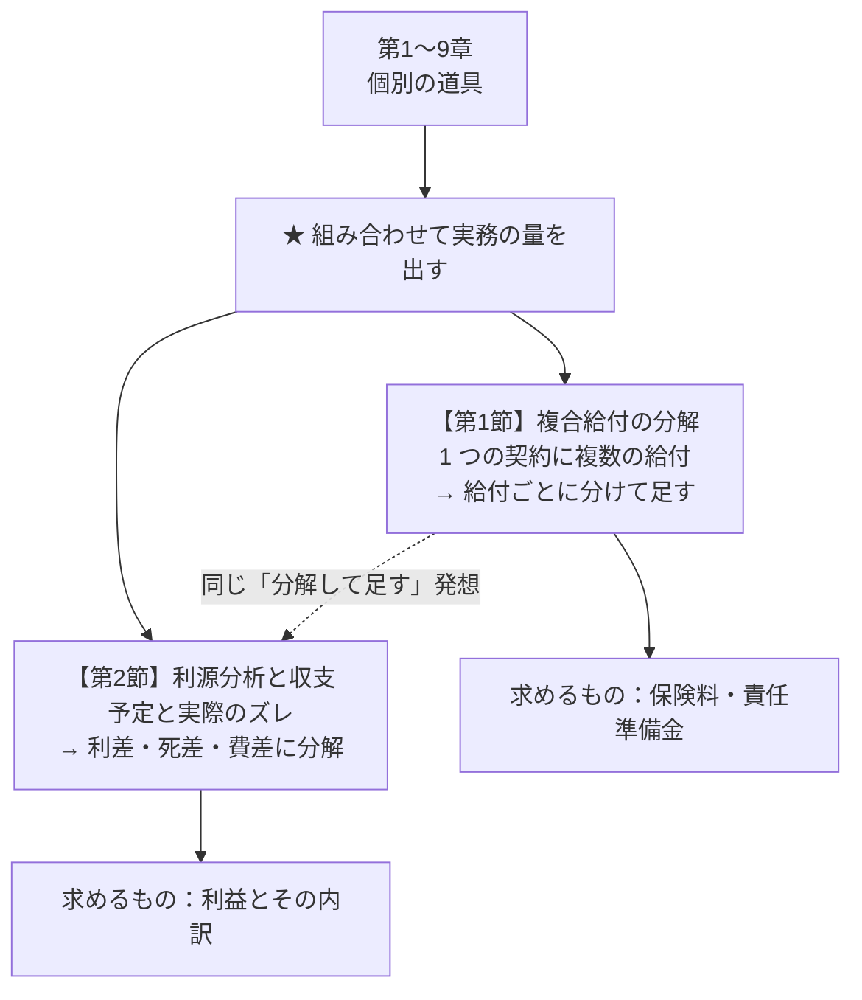
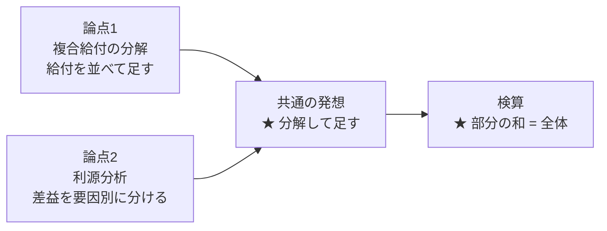
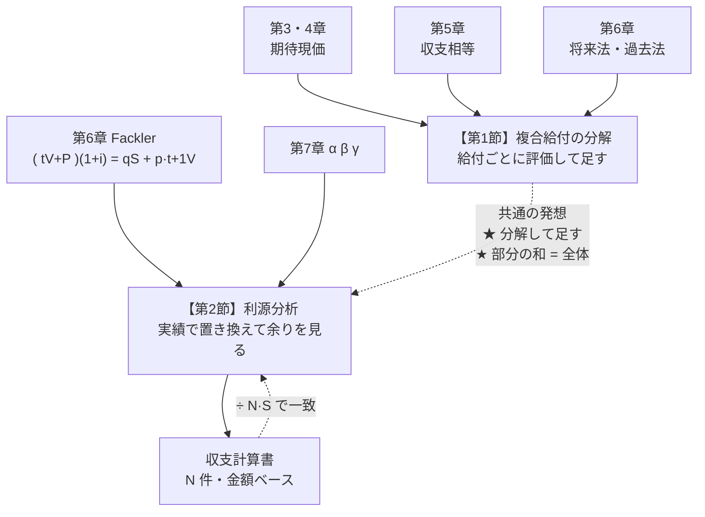
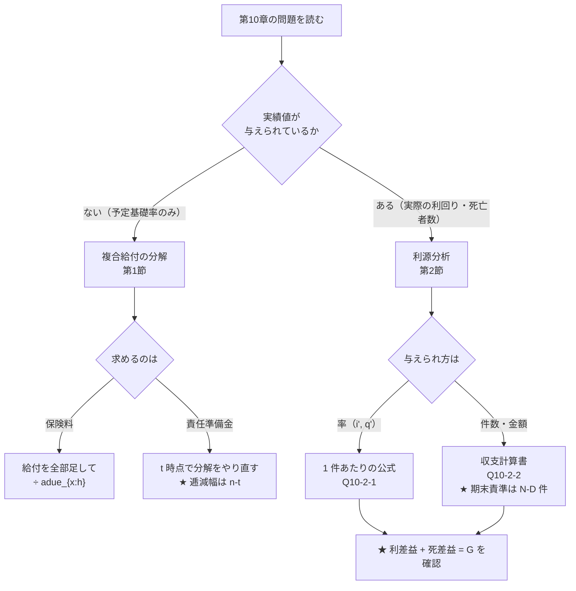

# 第10章　総合応用と収支分析

> [← 第9章 多重脱退と多状態モデル](第09章_多重脱退と多状態モデル.md) ｜ **第10章** ｜ [記号一覧 →](../03_巻末/記号一覧.md)

---

## 章の地図



**この図の読み方**：第10章には **新しい公式がほとんどありません**。
第1節は「第3・4章の期待現価を足し合わせる」だけ、
第2節は「第6章の再帰式を実績値で書き直す」だけです。
新しいのは **問題文が長く、条件を自分で整理しなければならない** という点です。

---

## この章で学ぶこと

第1〜9章では、論点ごとに道具を1つずつ作ってきました。
本章では、それらを **同時に使う** 問題を扱います。

実際の試験では、最後の大問がこの型になることが多く、次の2つが問われます。

| 型 | 何が問われるか | 使う道具 |
|---|---|---|
| **複合給付型** | 給付が複数ある契約の保険料・責任準備金 | 第3・4・5・6章の期待現価 |
| **収支分析型** | 予定と実際がズレたときの損益とその原因 | 第6章の再帰式＋第7章の事業費 |

この2つは一見別物ですが、**どちらも「全体をいくつかの部分に分解して、部分ごとに計算し、最後に足す」**
という同じ発想でできています。

```text
   【複合給付型】

      1 つの契約
        ├─ 死亡給付      → 期待現価 A ...(第3章)
        ├─ 生存給付      → 期待現価 E ...(第3章)
        ├─ 年金給付      → 期待現価 a ...(第4章)
        └─ 保険料        → 期待現価 P·adue ...(第5章)
                              ↓ 収支相等
                            保険料が出る

   【収支分析型】

      1 年間の実際の利益
        ├─ 利差益  → 利率のズレ  ...(第1章の i)
        ├─ 死差益  → 死亡率のズレ ...(第2章の q)
        └─ 費差益  → 事業費のズレ ...(第7章の α β γ)
                              ↓ 足すと
                            実際の利益に一致する
```

---

## この章の全体像



第1節と第2節は扱う量が違いますが、**検算の方法が同じ** です。

- 第1節：給付ごとの期待現価を足すと、全体の期待現価に一致する
- 第2節：利源ごとの差益を足すと、実際の利益に一致する

この **「部分の和＝全体」が成り立つかどうかが、答案の正しさを自分で確認する唯一の手段** です。
必ず確認してください。

---

## 最初に頭に入れるべきポイント

### 給付は「1つずつ独立に」評価してよい

複数の給付がある契約でも、期待現価は **給付ごとにばらばらに計算して足せます**。
理由は期待値の線形性です。

$$Z=Z_1+Z_2+\cdots+Z_k
\quad\Longrightarrow\quad
E[Z]=E[Z_1]+E[Z_2]+\cdots+E[Z_k]$$

各 $Z_j$ は同じ被保険者の同じ生存・死亡に依存しているので **互いに独立ではありません**。
それでも期待値は足せます。

> **⚠ ただし分散は足せません。**
> $\mathrm{Var}(Z_1+Z_2)=\mathrm{Var}(Z_1)+\mathrm{Var}(Z_2)+2\,\mathrm{Cov}(Z_1,Z_2)$ であり、
> 死亡給付と生存給付は **負の相関** を持ちます（死んだら満期金は出ない）。
> 分散を問われたら分解できません。Q3-2-2 の方法で $Z$ 全体を作り直してください。

```text
   期待現価  →  ★ 分解して足せる（線形性）
   分散      →  ✗ 分解して足せない（共分散が出る）
```

### 責任準備金も同じように分解できる

将来法の責任準備金は「将来給付の期待現価 $-$ 将来保険料の期待現価」なので、
給付が複数なら **給付ごとの将来分を足して、保険料分を引く** だけです。

$${}_tV=\underbrace{\sum_j\left(\text{給付 }j\text{ の }t\text{ 時点での期待現価}\right)}_{\text{足す}}
-\underbrace{P\times\left(\text{残りの払込期間の年金現価}\right)}_{\text{引く}}$$

**注意すべきは「$t$ 時点から見た残りの給付」を正しく書けるか** です。
逓減保険なら残りの逓減幅、据置年金なら残りの据置期間が変わります。

### 予定と実際の差は「予定を基準に」測る

利源分析は、次の形で統一されています。

$$\text{差益}=\left(\text{予定}-\text{実際}\right)\times\left(\text{その要素にかかる金額}\right)$$

ただし **利息だけは向きが逆** です。

| 利源 | 差益の式 | 益が出る向き |
|---|---|---|
| 利差益 | $\left(\text{責準}+P\right)\left(i'-i\right)$ | 実際の利回りが **高い** ほど益 |
| 死差益 | $\left(q-q'\right)\left(S-{}_{t+1}V\right)$ | 実際の死亡率が **低い** ほど益 |
| 費差益 | $\left(\text{予定事業費}-\text{実際事業費}\right)$ | 実際の事業費が **低い** ほど益 |

**利息は「収入」なので実際が予定を上回れば益、
死亡と事業費は「支出」なので実際が予定を下回れば益** です。
向きを間違えると符号が反転するので、必ず
「**これは収入か支出か**」を確認してから式を立ててください。

```text
   収入項（利息）      : 実際 > 予定  →  益     ( i' - i )
   支出項（死亡・費用） : 実際 < 予定  →  益     ( 予定 - 実際 )
```

### 死差益の金額は「危険保険金額」

死差益を $\left(q-q'\right)\times S$ と書くのは **誤り** です。
死亡が1件発生したとき保険会社が実際に失うのは、保険金 $S$ の全額ではありません。
その契約について積んでいた責任準備金 ${}_{t+1}V$ が **不要になって戻ってくる** からです。

$$\text{死亡1件あたりの正味の負担}=S-{}_{t+1}V\quad(\text{危険保険金額})$$

これは Q6-2-2 でみた **危険保険金額（net amount at risk）** そのものです。

```text
   死亡が 1 件起きたとき

   支払う : S               ←─┐
   浮く   : t+1V                │ 差し引き S - t+1V が正味の負担
                             ←─┘
   ★ 死差益 = (予定死亡数 - 実際死亡数) × (S - t+1V)
```

---

## 基本記号・基本公式

### 複合給付の分解

| 記号・式 | 意味 | 使う場面 | 条件・注意 |
|---|---|---|---|
| $E[Z_1+Z_2]=E[Z_1]+E[Z_2]$ | 期待値の線形性 | 給付が複数ある契約 | **分散には使えない** |
| $(DA)^1_{x:\overline{n}\vert}+(IA)^1_{x:\overline{n}\vert}=(n+1)A^1_{x:\overline{n}\vert}$ | 逓増と逓減の和 | 逓減保険の変換・検算 | 係数は $n+1$。$n$ ではない |
| ${}_nE_x$ | 生存給付（満期金）の現価 | 満期給付の評価 | 満期金 $S_n$ なら $S_n\cdot{}_nE_x$ |
| ${}_{m\vert}\ddot a_x={}_mE_x\,\ddot a_{x+m}$ | 据置年金 | 年金給付が後から始まる契約 | 据置期間中は無給付 |
| $\sum_j(\text{給付 }j\text{ の期待現価})=P\,\ddot a_{x:\overline{h}\vert}$ | 収支相等 | 保険料の決定 | 払込期間 $h$ と保険期間 $n$ を混同しない |

### 利源分析（第 $t+1$ 保険年度、保険金額 $S$）

| 記号 | 意味 |
|---|---|
| $i$ | 予定利率 |
| $i'$ | 実際の運用利回り |
| $q_{x+t}$ | 予定死亡率 |
| $q'_{x+t}$ | 実際の死亡率 |
| ${}_tV,\ {}_{t+1}V$ | 期首・期末の責任準備金 |
| $P$ | 純保険料（利源分析では純保険料式で考える） |

**予定どおりなら利益ゼロ**（Fackler の再帰式）

$$\left({}_tV+P\right)(1+i)=q_{x+t}S+p_{x+t}\,{}_{t+1}V$$

**実際の1年間の利益**

$$G=\left({}_tV+P\right)(1+i')-\left[q'_{x+t}S+\left(1-q'_{x+t}\right){}_{t+1}V\right]$$

**要因分解**

$$\boxed{
\underbrace{\left({}_tV+P\right)\left(i'-i\right)}_{\text{利差益}}
+\underbrace{\left(q_{x+t}-q'_{x+t}\right)\left(S-{}_{t+1}V\right)}_{\text{死差益}}
=G}$$

**費差益（営業保険料ベースで考えるとき）**

$$\text{費差益}=\left(\text{予定事業費}-\text{実際事業費}\right)\times\left(1+i'\right)$$

期首に発生する事業費は1年分の利息がつくので $(1+i')$ を掛けます。

---

## 試験での主な問われ方

| 問われ方 | 内容 |
|---|---|
| 複合給付の保険料 | 死亡給付・満期給付・年金給付が混在する契約の営業保険料または純保険料 |
| 複合給付の責任準備金 | 上記契約の $t$ 年度末責任準備金（将来法・過去法の両方） |
| 給付の言い換え | 「保険金が毎年 $1$ ずつ減る」→ 逓減定期保険と読み替える |
| 利源分析 | 利差益・死差益・費差益を求め、合計が実際の利益に一致することを示す |
| 収支計算書 | 契約群団の1年間の収入・支出・責任準備金の増減から利益を求める |
| 利源の解釈 | どの利源が支配的か、条件が変わるとどう変わるか |

---

## 問題を見分けるためのサイン

| 問題文の表現 | 判断 |
|---|---|
| 「保険金は毎年 $1$ ずつ減少し」 | 逓減定期保険 $(DA)^1$。$(n+1)A^1-(IA)^1$ も検討 |
| 「満期時には…を支払う」 | 生存給付。${}_nE_x$ を掛ける |
| 「これらの給付に対する保険料」 | **給付を全部足してから** 収支相等 |
| 「実際の運用利回りは」 | 利差益。$i'-i$ |
| 「実際の死亡者数は」 | 死差益。$q-q'$ と危険保険金額 |
| 「実際の事業費は」 | 費差益 |
| 「利益を利源別に分解せよ」 | 3利源。**合計が一致することを必ず示す** |
| 「$N$ 件の契約からなる団体」 | 契約群団。1件あたりの量を $N$ 倍する |
| 「責任準備金の増加額」 | 収支計算。期末責準 $-$ 期首責準 |

---

## この章の問題一覧

| 節 | 問題 | 表題 | この問題の役割 | 難易度 |
|---|---|---|---|---|
| 第1節 | Q10-1-1 | 複合給付保険の分解と保険料 | 複数給付を分解して足し、保険料と責任準備金を出す | ★★★ |
| 第2節 | Q10-2-1 | 利源分析（利差・死差・費差） | 予定と実際の差を3利源に分解し、合計の一致を確認する | ★★★ |
| 第2節 | Q10-2-2 | 一年間の収支と責任準備金の変動 | 契約群団の収支計算書を作り、Q10-2-1 と同じ利益に到達する | ★★★ |

**この章の問題の系統**

```text
   第3章 (DA)^1        第4章 nEx        第5章 収支相等
        └────────────────┴────────────────┘
                         ↓
              Q10-1-1  複合給付の分解と保険料
                         ↓ 「予定どおり」の世界から
                           「実際はズレる」世界へ
                         ↓
   第6章 Fackler ──→ Q10-2-1  利源分析（1 件あたり）
                         ↓ 1 件 → N 件
                         ↓
                       Q10-2-2  収支計算書（群団）
                         ↑
                    ★ 同じ利益に 2 通りの道で到達する
```

---
---

# 第1節　複合給付の分解

## この節のテーマ

**1つの契約に複数の給付が付いているとき、それをどう分解して評価するか。**

過去の章では「死亡保険だけ」「年金だけ」という単一給付を扱ってきました。
実際の商品は、死亡給付・満期給付・年金給付・保険料払込免除などが組み合わさっています。
本節では、それを **給付ごとに分けて評価し、最後に足す** 手順を確立します。

---

## この節でできるようになること

- 複数の給付をもつ契約の給付の期待現価を、給付ごとに分解して求められる
- 「毎年減っていく保険金」を逓減定期保険 $(DA)^1$ と読み替えられる
- 収支相等の原理から複合給付契約の保険料を求められる
- 途中時点の責任準備金を、将来法・過去法の両方で求められる
- 「どの給付が保険料の何割を占めるか」を答えられる

---

## 頭に入れるべきポイント

### 分解の3ステップ

複合給付の問題は、必ず次の順で処理します。

```text
   ① 給付を種類ごとにばらす
        「いつ」「どんな条件で」「いくら」支払われるか
              ↓
   ② 種類ごとに標準的な保険数理記号に当てはめる
        死亡年度末 → A、生存 → nEx、継続的 → adue
              ↓
   ③ 足す
        ★ 期待値の線形性。ここで初めて 1 つの数になる
```

**②の段階で標準記号に載らない給付が出てきたら、①の分解が足りません。**
もう一段細かく分けてください。

### 逓減定期保険の3つの顔

「保険金が毎年 $1$ ずつ減る」給付は、**3通りに書けます**。
問題文の条件によって、どれが計算しやすいかが変わります。

| 表現 | 式 | 使いやすい場面 |
|---|---|---|
| 定義どおり | $(DA)^1_{x:\overline{n}\vert}=\sum_{t=0}^{n-1}(n-t)v^{t+1}{}_{t\vert}q_x$ | 生命表が与えられ、直接足せるとき |
| 逓増との関係 | $(DA)^1=(n+1)A^1_{x:\overline{n}\vert}-(IA)^1_{x:\overline{n}\vert}$ | $(IA)^1$ と $A^1$ が与えられているとき |
| 定期保険の重ね合わせ | $(DA)^1=\sum_{k=1}^{n}A^1_{x:\overline{k}\vert}$ | 期間別の定期保険が表になっているとき |

> **⚠ 係数は $n+1$ です。** $(DA)^1+(IA)^1$ の第 $t+1$ 年度の給付は
> $(n-t)+(t+1)=n+1$ で、$t$ によらず一定です。だから $(n+1)A^1$ になります。
> $n$ と書いてしまう誤りが非常に多い箇所です。

```text
   第 t+1 年度の給付額

   (DA)^1 :  n  n-1  n-2  ...  2   1
   (IA)^1 :  1   2    3   ... n-1  n
   ─────────────────────────────────
   合計   : n+1 n+1  n+1  ... n+1 n+1   ← ★ 一定
                    ↓
            (n+1) × A^1（一様な定期保険）
```

### 途中時点の責任準備金では「残りの給付」を書き直す

$t$ 年度末の責任準備金を将来法で求めるとき、**逓減保険の逓減幅も変わる** ことに注意してください。

契約時に「$n$ から $1$ まで減る」保険は、$t$ 年後には「$n-t$ から $1$ まで減る」保険です。
つまり **年齢 $x+t$、期間 $n-t$ の逓減定期保険 $(DA)^1_{x+t:\overline{n-t}\vert}$ にそのまま化けます**。

```text
   契約時 (x)         給付  n, n-1, ..., 2, 1      → (DA)^1_{x:n}

   t 年後 (x+t)       給付  n-t, n-t-1, ..., 2, 1  → (DA)^1_{x+t:n-t}
                            ↑
                    ★ 「先頭が n-t に下がった逓減保険」に
                      そっくり読み替えられる（形が保存される）
```

これは逓減定期保険の便利な性質です。逓増定期保険 $(IA)^1$ ではこうはいかず、
$(IA)^1_{x+t:\overline{n-t}\vert}+t\,A^1_{x+t:\overline{n-t}\vert}$ という形になります
（$t$ 年経過時点では給付が $t+1$ から始まるため、下駄 $t$ を履かせる必要がある）。

---

## 使用する記号・公式

| 記号 | 定義 | 備考 |
|---|---|---|
| $A^1_{x:\overline{n}\vert}$ | 定期保険（死亡年度末払、保険金 $1$） | 第3章 |
| $(DA)^1_{x:\overline{n}\vert}$ | 逓減定期保険（$n,n-1,\dots,1$） | 第3章 Q3-3-2 |
| $(IA)^1_{x:\overline{n}\vert}$ | 逓増定期保険（$1,2,\dots,n$） | 第3章 Q3-3-1 |
| ${}_nE_x=v^n{}_np_x$ | 生存保険（純粋生存保険） | 第3章 |
| $\ddot a_{x:\overline{n}\vert}$ | 期始払有期生命年金 | 第4章 |
| ${}_tV$ | $t$ 年度末の純保険料式責任準備金 | 第6章 |

**収支相等**

$$P\,\ddot a_{x:\overline{h}\vert}=\sum_j\left(\text{給付 }j\text{ の期待現価}\right)$$

**将来法の責任準備金**

$${}_tV=\sum_j\left(\text{給付 }j\text{ の }t\text{ 時点期待現価}\right)-P\,\ddot a_{x+t:\overline{h-t}\vert}$$

**過去法の責任準備金**

$${}_tV=\frac{P\,\ddot a_{x:\overline{t}\vert}-\left(\text{最初の }t\text{ 年間の給付の期待現価}\right)}{{}_tE_x}$$

---

## 基本的な解法パターン

```text
問題文を読む
    ↓
【S1】給付を表に書き出す
      ┌─────────┬──────────┬────────┐
      │ 給付の種類 │ 支払条件  │ 金額   │
      ├─────────┼──────────┼────────┤
      │ 死亡給付   │ 死亡年度末 │ n-t    │
      │ 満期給付   │ n 年生存  │ S_n    │
      └─────────┴──────────┴────────┘
    ↓
【S2】給付ごとに時間軸へ配置する
    ↓
【S3】給付ごとに保険数理記号へ置き換える
      死亡年度末払 → A 系
      一時点の生存 → nEx
      継続的な支払 → adue 系
    ↓
【S4】足す（★ 期待値の線形性）
    ↓
【S5】収支相等：給付合計 = P × 払込期間の年金現価
    ↓
【S6】保険料を求める
    ↓
【S7】必要なら責任準備金へ
      将来法：t 時点から見て S1〜S4 をやり直し、P·adue を引く
      過去法：既収保険料の終価 - 既払給付の終価
    ↓
【S8】検算
      ★ 将来法 = 過去法
      ★ 各給付の内訳の和 = 全体
```

---

## 間違えやすい点

| 誤り | 正しくは |
|---|---|
| 逓減定期の変換で $nA^1-(IA)^1$ とする | $(n+1)A^1-(IA)^1$ |
| 満期給付に $v^n$ だけ掛ける | ${}_nE_x=v^n{}_np_x$。**生存確率を忘れない** |
| 保険期間と払込期間を同一視する | 短期払なら分母は $\ddot a_{x:\overline{h}\vert}$ |
| 責任準備金で逓減幅をそのままにする | $t$ 年後は $(DA)^1_{x+t:\overline{n-t}\vert}$（先頭が $n-t$） |
| 給付の分散を足し算で出す | 分散は分解できない（共分散が出る） |
| 満期金の金額を $1$ と思い込む | 問題文の金額（本問なら $5$）をそのまま掛ける |

---

## この節の問題の流れ

```text
   Q10-1-1  複合給付保険の分解と保険料
      ├─ (1) 給付を分解する          ← 第3章 (DA)^1、nEx の復習
      ├─ (2) 保険料を求める          ← 第5章 収支相等
      ├─ (3) 内訳の割合を答える      ← 「何にいくら払っているか」の感覚
      ├─ (4) 中間時点の責任準備金    ← 第6章 将来法
      └─ (5) 過去法で検算            ← ★ 一致を確認する
```

本節は1問だけですが、**第3・4・5・6章の内容を1問で通しで使う** 総合問題です。
どこかで詰まったら、対応する章の問題に戻って確認してください。

---

## 問題 Q10-1-1　複合給付保険の分解と保険料

| 項目 | 内容 |
|---|---|
| **出題年度** | 要照合（＿＿＿＿年度） |
| **問題番号** | 要照合（問＿＿） |
| **分野・論点** | 総合応用／給付の分解・収支相等・責任準備金 |
| **難易度** | ★★★ |
| **この節での位置づけ** | 本節唯一の問題。第3・4・5・6章の道具を1問で通しで使う |
| **関連する問題** | 発展元：Q3-3-2（逓減定期）、Q4-2-2（複合年金）、Q5-1-1（収支相等）、Q6-1-1（将来法）／後続：Q10-2-1 |

### ■ この問題で押さえるべきポイント

#### 何を問う問題か

**死亡給付が毎年逓減し、満期給付が別途つく契約について、
年払平準純保険料と中間時点の責任準備金を求める問題** です。

新しい公式は1つも出てきません。問われているのは
**「複数の給付を正しく分解し、正しい記号に載せられるか」** という一点です。

#### 問題文から読み取るべき条件

| 条件 | 解法への影響 |
|---|---|
| $(40)$ 歳、保険期間 $20$ 年 | $x=40$、$n=20$。生命表と利率の基礎を固定 |
| **死亡保険金は第1年度 $20$、以後毎年 $1$ ずつ減少** | 逓減定期保険 $(DA)^1_{40:\overline{20}\vert}$。先頭が $n=20$ なので標準形にぴったり乗る |
| 死亡年度末払 | **離散型**。$A$ 系（$\bar A$ ではない） |
| $20$ 年生存で満期保険金 $5$ | 生存給付 $5\times{}_{20}E_{40}$。**生存確率を落とさない** |
| 保険料は $20$ 年間、毎年初に払込 | 払込期間＝保険期間。分母は $\ddot a_{40:\overline{20}\vert}$ |
| 予定利率 $3\%$ | $v=1/1.03$ |

#### 最初に注目する場所

**「第1年度 $20$、以後毎年 $1$ ずつ減少」の部分** です。
ここを読んだ瞬間に「先頭が $n=20$、期間が $n=20$ の逓減定期保険」だと判断できれば、
残りは機械的な計算になります。

逆にここを「$20$ 年間の定期保険」と読み違えると、以降すべてが崩れます。
**保険金額が一定か変動かを、必ず最初に確認してください。**

#### 呼び出すべき知識

| 知識 | なぜこの問題で使うか |
|---|---|
| $(DA)^1_{x:\overline{n}\vert}=\sum_{t=0}^{n-1}(n-t)v^{t+1}{}_{t\vert}q_x$ | 逓減する死亡給付の期待現価そのもの |
| $(DA)^1+(IA)^1=(n+1)A^1$ | 検算に使える。$(IA)^1$ が与えられた場合の別ルートでもある |
| ${}_nE_x=v^n{}_np_x$ | 満期給付の期待現価 |
| 期待値の線形性 | 2種類の給付を足してよい根拠 |
| 収支相等 $P\ddot a=\text{給付合計}$ | 保険料の決定 |
| 将来法 ${}_tV=\text{将来給付}-\text{将来保険料}$ | (4) |
| 過去法 ${}_tV=\left(P\ddot a_{x:\overline{t}\vert}-\text{既払給付}\right)/{}_tE_x$ | (5) の検算 |

#### 解法の骨格

```text
   1. 給付を 2 つに分解する（逓減死亡給付 ／ 満期給付）
   2. それぞれの期待現価を求める
   3. 足す → 給付の期待現価合計
   4. 収支相等で P を出す
   5. 内訳の割合を出す
   6. t=10 時点から見て 1〜3 をやり直す（★ 逓減幅が n-t に変わる）
   7. P × 残りの年金現価を引く → 将来法の責任準備金
   8. 過去法でも計算して一致を確認する
```

#### 間違えやすい点

- **⚠ 逓減幅を読み違える。** 「第1年度 $20$」なので先頭は $n=20$。
  もし「第1年度 $19$」なら $(DA)^1_{40:\overline{19}\vert}$ に $v\,q_{40}$ の調整が要ります。
- **⚠ 満期給付の金額を $1$ にしてしまう。** 本問は $5$ です。$5\times{}_{20}E_{40}$。
- **⚠ ${}_{20}E_{40}$ を $v^{20}$ で済ませる。** 生存確率 ${}_{20}p_{40}$ が必要です。
- **⚠ $t=10$ の責任準備金で $(DA)^1_{50:\overline{20}\vert}$ と書く。**
  残り期間は $10$ 年です。$(DA)^1_{50:\overline{10}\vert}$。
- **⚠ $(n+1)A^1-(IA)^1$ の係数を $n$ にする。**

#### この問題を一言で捉えると

> **「保険金が減っていく死亡保障」と「満期金」を別々に値付けして足すだけ。
> 難しいのは計算ではなく、給付を正しく2つに切り分けること。**

---

### ■ 問題の構造図

```text
   時点     0     1     2     3    ...   10   ...   19    20
            │─────│─────│─────│──── … ──│──── … ──│─────│
   保険料   ↑P    ↑P    ↑P    ↑P         ↑P         ↑P
            （20 回、期始払、20 年間）

   死亡給付       ↓20   ↓19   ↓18   ...  ↓11  ...  ↓2    ↓1
            （死亡年度末払。第 t+1 年度に死亡なら 20-t）

   満期給付                                                ↓5
            （20 年生存したときのみ）

   評価時点                              ●(4)(5) で t=10
```

**この図が示すこと**：矢印が **上向き（$\uparrow$）＝会社への収入**、
**下向き（$\downarrow$）＝会社からの支出** です。
死亡給付の矢印が右へ行くほど短くなっているのが逓減を表します。

```text
   給付の分解

   全体の給付
     ├─ 死亡給付（逓減）  →  (DA)^1_{40:20}
     └─ 満期給付（一時金） →  5 × 20E40
                              ↓ 足す
                         給付の期待現価
                              ↓ ÷ adue_{40:20}
                              P
```

---

### ■ 問題

> **【問題】**（再現題。出題年度・問題番号は要照合）
>
> 予定利率 $3\%$、後掲の生命表にもとづき、次の保険を考える。
>
> $40$ 歳の被保険者が加入する保険期間 $20$ 年の保険で、給付は次のとおりである。
>
> - **死亡給付**：第 $1$ 保険年度中に死亡したときは $20$、第 $2$ 保険年度中に死亡したときは $19$、
>   以下毎年 $1$ ずつ減少し、第 $20$ 保険年度中に死亡したときは $1$ を、**死亡した年度の末に** 支払う。
> - **満期給付**：$20$ 年間生存したときは $5$ を満期時に支払う。
>
> 保険料は $20$ 年間、毎年初に平準額 $P$ を払い込むものとする。
>
> 以下の問いに答えよ。数値は小数第 $7$ 位を四捨五入して答えよ。
>
> 1. 給付の期待現価を、死亡給付と満期給付に分けて求め、その合計を求めよ。
> 2. 年払平準純保険料 $P$ を求めよ。
> 3. 保険料のうち、死亡給付に対応する部分と満期給付に対応する部分の割合を求めよ。
> 4. 第 $10$ 保険年度末の純保険料式責任準備金 ${}_{10}V$ を **将来法** により求めよ。
> 5. (4) の結果を **過去法** により検算せよ。
>
> なお、次の値を用いてよい。
>
> $$(DA)^1_{40:\overline{20}\vert}=0.3708571,\qquad
> {}_{20}E_{40}=0.5214386,\qquad
> \ddot a_{40:\overline{20}\vert}=15.0414615$$
>
> $$(DA)^1_{50:\overline{10}\vert}=0.1693198,\qquad
> {}_{10}E_{50}=0.7145381,\qquad
> \ddot a_{50:\overline{10}\vert}=8.6596387$$
>
> $$A^1_{40:\overline{10}\vert}=0.0162040,\qquad
> (DA)^1_{40:\overline{10}\vert}=0.0852553,\qquad$$
> $$
> {}_{10}E_{40}=0.7297561,\qquad
> \ddot a_{40:\overline{10}\vert}=8.7220372$$

> **【原題からの変更について】**
> 本書に収録した問題文は、実際の出題例に基づく **再現題** です。
> 数値・記号・支払時点・求めるものの構成は本書の標準基礎率（Makeham、$i=3\%$）で
> 再計算しており、原題そのままの数値ではありません。
> 出題年度・問題番号は原典との照合が必要です（README「出典について」参照）。

---

### ■ 問題文を数理モデルへ変換

| 確認項目 | 問題文から読み取れる内容 | 数理的な表現 |
|---|---|---|
| 被保険者 | $40$ 歳 | $x=40$ |
| 保険期間 | $20$ 年 | $n=20$、$0\le t\le 20$ |
| 死亡給付の金額 | 第 $1$ 年度 $20$、毎年 $1$ 減、第 $20$ 年度 $1$ | 第 $t+1$ 年度の給付 $=20-t$ |
| 死亡給付の支払時点 | **死亡した年度の末** | 離散型。$v^{t+1}$ |
| 満期給付 | $20$ 年生存で $5$ | $5\times{}_{20}E_{40}$ |
| 保険料 | $20$ 年間、毎年初 | 期始払、$P\,\ddot a_{40:\overline{20}\vert}$ |
| 予定利率 | $3\%$ | $v=1/1.03$ |
| 評価時点 (4)(5) | 第 $10$ 保険年度末 | $t=10$、年齢 $50$、残存 $10$ 年 |

**日本語と記号の対応**

| 問題文の表現 | 記号 |
|---|---|
| 「死亡した年度の末に支払う」 | $A$ 系（$\bar A$ ではない） |
| 「毎年 $1$ ずつ減少し」 | $(DA)^1$ |
| 「$20$ 年間生存したとき」 | ${}_{20}E_{40}$ |
| 「毎年初に」 | $\ddot a$（$a$ ではない） |
| 「$20$ 年間、平準額を払い込む」 | 払込期間 $=$ 保険期間 $=20$ |

---

### ■ 解法フロー

```text
【S1】給付を 2 つに分解
        死亡給付 : 20, 19, ..., 1（死亡年度末）
        満期給付 : 5（20 年生存）
              ↓
【S2】死亡給付の期待現価 = (DA)^1_{40:20} = 0.3708571
              ↓
【S3】満期給付の期待現価 = 5 × 20E40 = 5 × 0.5214386
              ↓
【S4】合計（★ 期待値の線形性）
              ↓
【S5】収支相等 : P × adue_{40:20} = 給付合計
              ↓  P を求める
【S6】内訳の割合
              ↓
【S7】t = 10 の将来法
        将来給付 : (DA)^1_{50:10} + 5 × 10E50
        将来保険料 : P × adue_{50:10}
              ↓  差を取る
【S8】過去法で検算
        既収保険料 : P × adue_{40:10}
        既払給付   : (DA)^1_{40:10} + 10 × A^1_{40:10}
              ↓  差を 10E40 で割る
        ★ 一致すれば正しい
```

---

### ■ 詳細解説

#### STEP 1　(1) 給付を分解する

*目的：1つの契約を、標準記号に載る2つの給付に切り分ける。*

給付は次の2つだけです。

**① 死亡給付**

第 $t+1$ 保険年度中（$t=0,1,\dots,19$）に死亡すると、その年度末に $20-t$ が支払われます。
期待現価は定義どおり

$$\sum_{t=0}^{19}(20-t)\,v^{t+1}\,{}_{t\vert}q_{40}
=(DA)^1_{40:\overline{20}\vert}$$

ここで ${}_{t\vert}q_{40}={}_tp_{40}\,q_{40+t}$ は「$t$ 年生存して次の1年で死亡する確率」です。
給付額 $20-t$ が $t$ とともに $1$ ずつ減るので、これは
**先頭が $n=20$、期間 $n=20$ の標準的な逓減定期保険** そのものです。

$$\boxed{\text{死亡給付の期待現価}=(DA)^1_{40:\overline{20}\vert}=0.3708571}$$

**② 満期給付**

$20$ 年間生存したときのみ $5$ を支払うので、

$$5\times v^{20}\,{}_{20}p_{40}=5\times{}_{20}E_{40}
=5\times0.5214386=2.6071930$$

$$\boxed{\text{満期給付の期待現価}=2.6071930}$$

> **⚠ ${}_{20}E_{40}$ は $v^{20}$ ではありません。**
> $v^{20}=1.03^{-20}=0.5536758$ ですが、${}_{20}E_{40}=0.5214386$ です。
> 差の $0.032$ が **$20$ 年間に死亡してしまう分** です。
> 生存確率を落とすと満期給付を過大評価します。

#### STEP 2　(1) 合計する

*目的：期待値の線形性により、2つの給付を足す。*

契約全体の給付を表す現価確率変数を $Z$ とすると、

$$Z=\underbrace{Z_{\text{死亡}}}_{(20-K)v^{K+1}\ \text{など}}+\underbrace{Z_{\text{満期}}}_{5v^{20}\ \text{または}\ 0}$$

$Z_{\text{死亡}}$ と $Z_{\text{満期}}$ は **同じ死亡時点に依存する** ので独立ではありませんが、
期待値は無条件に足せます。

$$E[Z]=E[Z_{\text{死亡}}]+E[Z_{\text{満期}}]$$

$$=0.3708571+2.6071930=2.9780501$$

$$\boxed{\text{給付の期待現価合計}=2.9780501}$$

**妥当性の確認**：死亡給付の最大額は $20$ ですが、$40$ 歳の $20$ 年間の死亡率が低いため
期待現価は $0.37$ にとどまります。一方 **満期給付は $5$ をほぼ確実に支払う** ので
$5\times0.52=2.61$ と大きくなります。**満期給付が支配的** です。

#### STEP 3　(2) 保険料

*目的：収支相等の原理を適用する。*

保険料は $20$ 年間、毎年初に $P$ ずつ払い込むので、その期待現価は

$$P\,\ddot a_{40:\overline{20}\vert}=15.0414615\,P$$

収支相等（保険料の期待現価 $=$ 給付の期待現価）より

$$15.0414615\,P=2.9780501$$

$$P=\frac{2.9780501}{15.0414615}=0.1979894$$

$$\boxed{P=0.1979894}$$

**単位の確認**：満期給付が $5$ なので、給付水準に対して保険料 $0.198$ は妥当な大きさです。
仮に満期給付だけの契約（純粋生存保険）なら
$5\times0.5214386/15.0414615=0.1733288$ ですから、
**死亡保障の上乗せ分が $0.1979894-0.1733288=0.0246606$** ということになります。

#### STEP 4　(3) 内訳の割合

*目的：保険料が「何にいくら」使われているかを把握する。*

給付の期待現価の内訳がそのまま保険料の内訳になります
（分母 $\ddot a_{40:\overline{20}\vert}$ は共通なので、比は保たれます）。

$$\frac{\text{死亡給付}}{\text{合計}}=\frac{0.3708571}{2.9780501}=0.124531$$

$$\frac{\text{満期給付}}{\text{合計}}=\frac{2.6071930}{2.9780501}=0.875469$$

$$\boxed{\text{死亡給付分 }12.45\%,\quad\text{満期給付分 }87.55\%}$$

**保険料の実額での内訳**

$$P_{\text{死亡}}=\frac{0.3708571}{15.0414615}=0.0246557,\qquad
P_{\text{満期}}=\frac{2.6071930}{15.0414615}=0.1733337$$

$$0.0246557+0.1733337=0.1979894\quad\checkmark$$

```text
   保険料 P = 0.1979894 の中身

   ├──────────────────────────────────────────────┤
   │  死亡保障  │        満期給付（貯蓄）           │
   │  12.45%    │            87.55%                 │
   ├────────────┴──────────────────────────────────┤
   0.0246557                              0.1733337

   ★ 「保険」というより「積立」に近い商品である
```

**この結果の意味**：一見すると死亡保険金 $20$ は満期金 $5$ の $4$ 倍で
「死亡保障が主」に見えますが、**$40$ 歳の $20$ 年間の死亡確率が低い** ため、
実際に保険料の大半を占めるのは満期給付です。
**保険金額の大小ではなく、金額 $\times$ 発生確率 $\times$ 現価率で判断する**
という第3章の原則がそのまま効いています。

#### STEP 5　(4) 第10保険年度末の責任準備金（将来法）

*目的：$t=10$ 時点に立って、給付の分解をやり直す。*

$t=10$ 時点で被保険者は生存しており、年齢は $50$ 歳、残存期間は $10$ 年です。

**① 将来の死亡給付**

残り $10$ 年間の死亡給付は、第 $11$ 年度に死亡なら $10$、第 $12$ 年度なら $9$、…、
第 $20$ 年度なら $1$ です。

```text
   契約時から見た給付 : 20 19 18 ... 11 | 10  9  8 ... 1
                        └── 経過済み ──┘  └─ 将来 ─┘
                                             ↑
                        ★ 先頭が 10 の逓減定期保険（10 年）
                          = (DA)^1_{50:10}
```

これは **年齢 $50$、期間 $10$ の標準的な逓減定期保険** に一致します。

$$\text{将来の死亡給付}=(DA)^1_{50:\overline{10}\vert}=0.1693198$$

> **⚠ ここが最大の落とし穴です。** 逓減幅が $20$ から $10$ に変わっています。
> $(DA)^1_{50:\overline{20}\vert}$ でも $(DA)^1_{40:\overline{10}\vert}$ でもありません。
> **年齢は $x+t=50$、期間は $n-t=10$、先頭の金額も $n-t=10$** です。
> 逓減定期保険は、経過しても **同じ形の逓減定期保険に化ける** のが特徴です。

**② 将来の満期給付**

$$5\times{}_{10}E_{50}=5\times0.7145381=3.5726905$$

**③ 将来給付の合計**

$$0.1693198+3.5726905=3.7420103$$

**④ 将来の保険料**

残り $10$ 年間、毎年初に $P$ を払い込むので

$$P\,\ddot a_{50:\overline{10}\vert}=0.1979894\times8.6596387=1.7145166$$

**⑤ 責任準備金**

$$\boxed{{}_{10}V=3.7420103-1.7145166=2.0274937}$$

**妥当性**：満期給付 $5$ に対して $t=10$ で $2.03$、つまり約 $41\%$ が積み上がっています。
残り $10$ 年でこれが $5$ に向かって増えていく形なので、水準として妥当です。

#### STEP 6　(5) 過去法による検算

*目的：まったく別の経路で同じ値に到達することを確認する。*

過去法は「これまでに受け取った保険料の終価 $-$ これまでに支払った給付の終価」を
生存者で分け合う形です。

$${}_{10}V=\frac{P\,\ddot a_{40:\overline{10}\vert}-\left(\text{最初の }10\text{ 年間の死亡給付の期待現価}\right)}{{}_{10}E_{40}}$$

**① 既収保険料の期待現価**

$$P\,\ddot a_{40:\overline{10}\vert}=0.1979894\times8.7220372=1.7268709$$

**② 最初の10年間の死亡給付の期待現価**

第 $1$ 年度から第 $10$ 年度までの給付額は $20,19,\dots,11$ です。
これは **「$10,9,\dots,1$」に「$10$」を一律に足したもの** なので、

$$20,19,\dots,11
=\underbrace{(10,9,\dots,1)}_{(DA)^1_{40:\overline{10}\vert}}
+\underbrace{(10,10,\dots,10)}_{10\,A^1_{40:\overline{10}\vert}}$$

```text
   第 t+1 年度の給付（t = 0..9）

   実際     : 20 19 18 17 16 15 14 13 12 11
   逓減部分 : 10  9  8  7  6  5  4  3  2  1   → (DA)^1_{40:10}
   一定部分 : 10 10 10 10 10 10 10 10 10 10   → 10 × A^1_{40:10}
              ─────────────────────────────
   和       : 20 19 18 17 16 15 14 13 12 11   ✓
```

したがって

$$(DA)^1_{40:\overline{10}\vert}+10\,A^1_{40:\overline{10}\vert}
=0.0852553+10\times0.0162040$$

$$=0.0852553+0.1620400=0.2472953$$

**③ 割り戻す**

$$\frac{1.7268709-0.2472953}{0.7297561}
=\frac{1.4795756}{0.7297561}=2.0274933$$

$$\boxed{{}_{10}V=2.0274933\quad(\text{将来法 }2.0274937\ \text{と一致})}$$

**差は $4\times10^{-7}$** で、これは与えられた値を小数第7位で丸めてから
$0.7297561$ で割っていることによる丸め誤差です（分母が $1$ より小さいので誤差が拡大します）。**将来法と過去法が一致したので、計算が正しいと確認できました。**

> **なぜ一致するのか**（第6章 Q6-1-2 の再確認）
> 収支相等が契約時に成立していることから、
> 「契約時の収支相等」$-$「最初の $10$ 年分の収支」$=$「将来の収支」
> という恒等式が成り立ちます。両辺を ${}_{10}E_{40}$ で割ったものが過去法、
> そのまま書いたものが将来法です。**別々の公式ではなく、同じ式の移項** です。

#### 解法フローのまとめ

```text
   STEP 1  給付を 2 つに分解        死亡（逓減）／満期
   STEP 2  合計                      0.3708571 + 2.6071930 = 2.9780501
   STEP 3  収支相等 → P              2.9780501 / 15.0414615 = 0.1979894
   STEP 4  内訳の割合                12.45% / 87.55%
   STEP 5  t=10 将来法               ★ 逓減幅が 10 に変わる
                                     3.7420103 - 1.7145166 = 2.0274937
   STEP 6  過去法で検算              (1.7397973 - 0.2472950)/0.7297561
                                     = 2.0274939  ✓
```

---

### ■ 答え

| 設問 | 量 | 値 |
|---|---|---|
| (1) | 死亡給付の期待現価 | $0.3708571$ |
| (1) | 満期給付の期待現価 | $2.6071930$ |
| (1) | 合計 | $2.9780501$ |
| (2) | 年払平準純保険料 $P$ | $0.1979894$ |
| (3) | 死亡給付分 | $12.45\%$（$0.0246557$） |
| (3) | 満期給付分 | $87.55\%$（$0.1733337$） |
| (4) | ${}_{10}V$（将来法） | $2.0274937$ |
| (5) | ${}_{10}V$（過去法） | $2.0274933$（一致） |

**(3) の解釈**：死亡保険金 $20$ は満期金 $5$ の $4$ 倍だが、
$40$ 歳から $20$ 年間に死亡する確率が低いため、保険料の $87.55\%$ は満期給付に充てられる。
**給付額の大小ではなく「金額 $\times$ 確率 $\times$ 現価率」で判断する** ことが重要である。

### ■ 試験答案としての書き方

> **(1)** 給付は死亡給付と満期給付に分解できる。
> 死亡給付は第 $t+1$ 年度に $20-t$ を死亡年度末に支払うから
> $\sum_{t=0}^{19}(20-t)v^{t+1}{}_{t\vert}q_{40}=(DA)^1_{40:\overline{20}\vert}=0.3708571$
> 満期給付は $5\times{}_{20}E_{40}=5\times0.5214386=2.6071930$
> 期待値の線形性より合計は $0.3708571+2.6071930=2.9780501$
>
> **(2)** 収支相等より $P\,\ddot a_{40:\overline{20}\vert}=2.9780501$
> $\therefore P=\dfrac{2.9780501}{15.0414615}=0.1979894$
>
> **(3)** 分母 $\ddot a_{40:\overline{20}\vert}$ は共通であるから、給付の期待現価の比がそのまま保険料の比となる。
> 死亡給付分 $\dfrac{0.3708571}{2.9780501}=12.45\%$、満期給付分 $87.55\%$
>
> **(4)** $t=10$ において年齢 $50$、残存期間 $10$ 年であり、
> 将来の死亡給付は $10,9,\dots,1$ であるから $(DA)^1_{50:\overline{10}\vert}$ に等しい。
> 将来給付 $=(DA)^1_{50:\overline{10}\vert}+5\,{}_{10}E_{50}=0.1693198+3.5726905=3.7420103$
> 将来保険料 $=P\,\ddot a_{50:\overline{10}\vert}=0.1979894\times8.6596387=1.7145166$
> $\therefore{}_{10}V=3.7420103-1.7145166=2.0274937$
>
> **(5)** 最初の $10$ 年間の死亡給付は $20,19,\dots,11$ であり、
> $(DA)^1_{40:\overline{10}\vert}+10\,A^1_{40:\overline{10}\vert}
> =0.0852553+0.1620400=0.2472953$
> 過去法により
> ${}_{10}V=\dfrac{P\,\ddot a_{40:\overline{10}\vert}-0.2472953}{{}_{10}E_{40}}
> =\dfrac{1.7268709-0.2472953}{0.7297561}=2.0274933$
> となり (4) と一致する。

### ■ 解答後に確認すること

| 項目 | 内容 |
|---|---|
| **最も重要なポイント** | 複合給付は **給付ごとに分解して期待現価を足す**。期待値の線形性が根拠。分散は足せない |
| **最初に気づくべきだった条件** | 「毎年 $1$ ずつ減少」→ $(DA)^1$。「$20$ 年生存したとき $5$」→ $5\,{}_nE_x$（$v^n$ ではない） |
| **他の問題にも使える考え方** | ① 逓減定期保険は経過しても **同じ形の逓減定期保険** に化ける（$(DA)^1_{x+t:\overline{n-t}\vert}$）。② 「$20,19,\dots,11$」は「逓減 $+$ 一定」に分解できる。③ 保険料の内訳比 $=$ 給付の期待現価の内訳比 |
| **類似問題との違い** | Q3-3-2 は $(DA)^1$ 単独。Q5-1-1 は単一給付の収支相等。Q6-1-1 は単一給付の責任準備金。本問はそれらを1問で通す |
| **条件が変わった場合** | ① 死亡即時払なら $(\overline{DA})^1$（$i/\delta$ 補正）。② 短期払なら分母だけ $\ddot a_{40:\overline{h}\vert}$ に変わる（分子は不変）。③ 満期金を $0$ にすると純粋な逓減定期保険、$(DA)^1$ を $0$ にすると純粋生存保険 |
| **復習時に思い出すこと** | 分解して足す。$t$ 年後の逓減幅は $n-t$。過去法で必ず検算する |

---

## 第1節　記憶用の一枚まとめ

```text
┌──────────────────────────────────────────────────────────────────────┐
│  第1節　複合給付の分解                                                │
└──────────────────────────────────────────────────────────────────────┘

【問題文のサイン】
   「毎年 1 ずつ減少し」            → (DA)^1
   「毎年 1 ずつ増加し」            → (IA)^1
   「n 年間生存したときは S_n を」   → S_n × nEx   ★ v^n ではない
   「死亡した年度の末に」           → A 系（離散）
   「死亡した直後に」               → Abar 系（連続）
   「毎年初に平準額を h 年間」      → 分母 adue_{x:h}
        ↓
【判断する論点】
   給付はいくつあるか
   ├─ 1 つ  → 第 3〜6 章の単一給付問題
   └─ 2 つ以上 → ★ 分解して足す（期待値の線形性）

   何を求めるか
   ├─ 保険料   → 収支相等（給付合計 ÷ 払込年金現価）
   ├─ 責任準備金 → 将来法（★ t 時点で分解をやり直す）
   └─ 分散     → ✗ 分解できない。Z を作り直す
        ↓
【描くべき図】
   時点   0    1    2   ...  t   ...  n
          │────│────│─── … ─│─── … ─│
   保険料 ↑P   ↑P   ↑P       ↑P
   死亡           ↓n   ↓n-1 ... ↓n-t ...  ↓1
   満期                                    ↓S_n
   評価                       ●
        ↓
【使用する公式】
   給付の期待現価 = Σ_j (給付 j の期待現価)         ★ 線形性

   (DA)^1_{x:n} = Σ_{t=0}^{n-1} (n-t) v^{t+1} t|q_x
   (DA)^1 + (IA)^1 = (n+1) A^1        ★ 係数は n+1

   nEx = v^n npx

   収支相等 : P · adue_{x:h} = 給付合計

   将来法 : tV = Σ_j (将来給付 j) - P · adue_{x+t:h-t}
   過去法 : tV = ( P·adue_{x:t} - 既払給付 ) / tEx
        ↓
【解答の基本手順】
   ① 給付を種類ごとに表へ書き出す（いつ・条件・金額）
   ② 種類ごとに保険数理記号へ載せる
   ③ 足す
   ④ 収支相等で P
   ⑤ t 時点で ①〜③ をやり直す  ★ 逓減幅は n-t
   ⑥ P × 残りの年金現価を引く
   ⑦ ★ 過去法で検算
        ↓
【典型的なミス】
   ⚠ (n+1)A^1 を nA^1 と書く
   ⚠ nEx を v^n で済ませる（生存確率を落とす）
   ⚠ 満期金の金額（本問は 5）を 1 と思い込む
   ⚠ t 年後の逓減保険を (DA)^1_{x+t:n} と書く（正しくは n-t）
   ⚠ 保険期間と払込期間を混同する
   ⚠ 分散を給付ごとに足す（共分散が出る）

【1行で】
   給付を分けて、それぞれ値段をつけて、足す。
   t 年後に評価するときは「t 時点から見た給付」で分解をやり直す。
```

---
---

# 第2節　利源分析と収支

## この節のテーマ

**予定どおりにいかなかった1年間の損益を、原因別に分解する。**

第1〜9章では、すべて **「予定利率どおりに運用でき、予定死亡率どおりに人が亡くなる」**
という前提で計算してきました。当然、実際にはズレます。

本節では、そのズレが **いくらの損益を生み、どの要因が何割を占めるか** を計算します。
これを **利源分析（source-of-profit analysis）** といいます。

---

## この節でできるようになること

- 予定どおりなら利益がゼロになること（Fackler の再帰式の意味）を説明できる
- 1年間の実際の損益を、期首資金と期末必要額から計算できる
- 損益を利差益・死差益・費差益に分解できる
- 3つの差益の合計が実際の損益に一致することを示せる
- 契約群団の収支計算書を作り、1件あたりの損益と突き合わせられる
- どの利源が支配的か、条件が変わるとどう変わるかを説明できる

---

## 頭に入れるべきポイント

### 出発点は「予定どおりなら利益ゼロ」

利源分析のすべての式は、Fackler の再帰式（Q6-2-1）から出てきます。

$$\left({}_tV+P\right)(1+i)=q_{x+t}S+p_{x+t}\,{}_{t+1}V$$

この式が意味しているのは、

```text
   期首に持っていた資金          ( tV + P )
        ↓ 予定利率 i で 1 年運用
   期末に持っている資金          ( tV + P )(1+i)
                                      ‖   ★ ぴったり等しい
   期末に必要な資金              q·S + p·(t+1)V
        ├─ 死亡した人への保険金   q·S
        └─ 生存者のために積む額   p·(t+1)V
```

**責任準備金とは、この等式がちょうど成り立つように決めた金額** です。
だから「予定どおり」なら余りも不足も出ません。

利源分析は、この式の $i$ を $i'$ に、$q$ を $q'$ に置き換えたときに
**どれだけ余るか** を計算するだけの話です。

### 実際の損益は「期首資金の終価 $-$ 期末必要額」

$$\boxed{G=\underbrace{\left({}_tV+P\right)\left(1+i'\right)}_{\text{実際に期末に持っている資金}}
-\underbrace{\left[q'_{x+t}S+\left(1-q'_{x+t}\right){}_{t+1}V\right]}_{\text{実際に期末に必要な資金}}}$$

**期末必要額の第2項の責任準備金 ${}_{t+1}V$ は、予定の値のまま** です。
実際の死亡率がどうであれ、生き残った契約に積むべき責任準備金は
**予定基礎率で計算した ${}_{t+1}V$** だからです。ここを実績で置き換えてはいけません。

```text
   実績に置き換える : i → i'（運用）、q → q'（実際の死亡者数）
   予定のまま       : t+1V（積むべき責任準備金の水準）、S（保険金額）
                       ↑
        ★ 責任準備金は「予定基礎率で計算する」と決められた法定の量
```

### 分解の恒等式

$G$ の式から Fackler の式を引くと、機械的に次が出ます。

$$G=\underbrace{\left({}_tV+P\right)\left(i'-i\right)}_{\text{利差益}}
+\underbrace{\left(q_{x+t}-q'_{x+t}\right)\left(S-{}_{t+1}V\right)}_{\text{死差益}}$$

**これは近似ではなく恒等式** です。丸めを除けば必ずぴったり一致します。
一致しなかったら、どこかに計算ミスがあります。
**利源分析の問題では、この一致確認を必ず答案に書いてください。**

### 3つの利源の意味

| 利源 | 何のズレか | かかる金額 | 覚え方 |
|---|---|---|---|
| **利差益** | 運用利回り $i'$ と予定利率 $i$ | 期首の運用資産 ${}_tV+P$ | 「**いくら運用したか** × 何%多く稼げたか」 |
| **死差益** | 実際死亡率 $q'$ と予定死亡率 $q$ | 危険保険金額 $S-{}_{t+1}V$ | 「**何人少なく死んだか** × 1人あたりの持ち出し」 |
| **費差益** | 実際事業費と予定事業費 | そのまま金額 | 「**節約できた額**」（期首発生なら $(1+i')$ 倍） |

```text
   利差益 =  ( tV + P )   ×   ( i' - i )
             └ 資産の量 ┘     └ 利回りの差 ┘

   死差益 =  ( q - q' )    ×   ( S - t+1V )
             └ 死亡率の差 ┘   └ 危険保険金額 ┘
                                  ★ S ではない

   費差益 =  ( 予定事業費 - 実際事業費 ) × (1 + i')
             └ 節約額 ┘                   └ 期首発生なら利息がつく ┘
```

### 費差益は営業保険料ベースでしか出ない

利差益・死差益は **純保険料式** の枠組みで完結します。
費差益は事業費の話なので、**営業保険料 $P'$ と予定事業費（$\alpha,\beta,\gamma$）が
与えられている場合にのみ** 計算できます（第7章）。

問題文に事業費が出てこなければ、利源は2つ（利差・死差）です。

---

## 使用する記号・公式

| 記号 | 意味 |
|---|---|
| $i$ / $i'$ | 予定利率 / 実際の運用利回り |
| $q_{x+t}$ / $q'_{x+t}$ | 予定死亡率 / 実際の死亡率 |
| ${}_tV$ / ${}_{t+1}V$ | 期首 / 期末の純保険料式責任準備金 |
| $P$ / $P'$ | 純保険料 / 営業保険料 |
| $\alpha,\beta,\gamma$ | 新契約費 / 集金費率 / 維持費（第7章） |
| $S$ | 保険金額 |
| $S-{}_{t+1}V$ | 危険保険金額 |
| $N$ | 契約件数（群団の問題） |

**Fackler（予定どおり）**

$$\left({}_tV+P\right)(1+i)=q_{x+t}S+p_{x+t}\,{}_{t+1}V$$

**実際の損益**

$$G=\left({}_tV+P\right)(1+i')-\left[q'S+(1-q'){}_{t+1}V\right]$$

**3利源**

$$\text{利差益}=\left({}_tV+P\right)\left(i'-i\right)$$
$$\text{死差益}=\left(q-q'\right)\left(S-{}_{t+1}V\right)$$
$$\text{費差益}=\left(E^{\text{予定}}-E^{\text{実際}}\right)\left(1+i'\right)$$

**群団の収支（$N$ 件、実際の死亡件数 $D$）**

$$\text{利益}=\underbrace{N\,{}_tV\,S+N\,P\,S}_{\text{期首資金}}
+\underbrace{\left(N\,{}_tV+N\,P\right)S\,i'}_{\text{運用収益}}
-\underbrace{D\,S}_{\text{死亡保険金}}
-\underbrace{(N-D)\,{}_{t+1}V\,S}_{\text{期末責任準備金}}$$

---

## 基本的な解法パターン

```text
問題文を読む
    ↓
【S1】予定基礎率と実績を対応表に整理する
      ┌──────────┬──────────┬──────────┐
      │          │  予定     │  実際     │
      ├──────────┼──────────┼──────────┤
      │ 利率      │   i      │   i'     │
      │ 死亡率    │   q      │   q'     │
      │ 事業費    │  βP'+γ   │  実績値   │
      └──────────┴──────────┴──────────┘
    ↓
【S2】期首資金を出す      tV + P
    ↓
【S3】実際の利回りで転がす ( tV + P )(1 + i')
    ↓
【S4】期末必要額を出す     q'S + (1-q') t+1V
      ★ t+1V は予定のまま
    ↓
【S5】差を取る → 実際の損益 G
    ↓
【S6】要因別に分解する
      利差益 = ( tV + P )( i' - i )
      死差益 = ( q - q' )( S - t+1V )
      費差益 = ( 予定事業費 - 実際事業費 )(1 + i')
    ↓
【S7】★ 検算：利差益 + 死差益 = G
    ↓
【S8】割合を出し、どの利源が支配的かを述べる
```

**群団の問題（Q10-2-2）はこの流れの $N$ 倍版です。**

```text
収支計算書の形
    収入 : 期首責任準備金 + 保険料収入 + 運用収益
    支出 : 死亡保険金 + 期末責任準備金
    差額 : 利益
        ↓
   ★ 1 件あたりに割り戻すと Q10-2-1 の G に一致する
```

---

## 間違えやすい点

| 誤り | 正しくは |
|---|---|
| 死差益を $\left(q-q'\right)S$ とする | 危険保険金額 $S-{}_{t+1}V$ を掛ける |
| 利差益を $\left(i-i'\right)$ とする | $\left(i'-i\right)$。利息は収入なので実際が大きいほど益 |
| 利差益の元本を ${}_tV$ だけにする | 期首に保険料も入るので ${}_tV+P$ |
| 期末必要額の ${}_{t+1}V$ を実績で置き換える | 責任準備金は **予定基礎率** で計算する |
| 費差益に $(1+i')$ を掛け忘れる | 期首発生の事業費には1年分の利息がつく |
| 事業費がないのに費差益を書く | 純保険料の問題なら利源は2つ |
| 群団の問題で期末責準を $N\,{}_{t+1}V$ とする | 生存者は $N-D$ 件 |
| 予定死亡者数を四捨五入して整数にする | 予定は $N q$ のまま（小数でよい）。実際だけが整数 |

---

## この節の問題の流れ

```text
   Q10-2-1  利源分析（1 件あたり）
      ├─ (1) 予定どおりなら利益ゼロ       ← Fackler の確認
      ├─ (2) 実際の 1 年間の損益          ← 期首資金 - 期末必要額
      ├─ (3) 利差益・死差益              ← 要因分解
      ├─ (4) ★ 合計が (2) に一致することを示す
      └─ (5) 費差益                      ← 第7章の事業費を接続
                 ↓  1 件 → N 件へスケールする
   Q10-2-2  一年間の収支（群団 10000 件）
      ├─ (1) 収支計算書を作る
      ├─ (2) 利益を求める
      ├─ (3) ★ 1 件あたりに割り戻して Q10-2-1 と一致することを確認
      └─ (4) 利源別の内訳（総額ベース）
```

**2問はまったく同じ契約・同じ年度を扱っています。**
Q10-2-1 が「1件あたりの理論式」、Q10-2-2 が「群団の実務的な収支計算書」で、
**別々の道を通って同じ利益に到達する** 構成です。
一致することを自分で確認すると、両方の理解が確かめられます。

---

## 問題 Q10-2-1　利源分析（利差・死差・費差）

| 項目 | 内容 |
|---|---|
| **出題年度** | 要照合（＿＿＿＿年度） |
| **問題番号** | 要照合（問＿＿） |
| **分野・論点** | 総合応用／利源分析 |
| **難易度** | ★★★ |
| **この節での位置づけ** | 本節の基本問題。1件あたりの理論式を確立する |
| **関連する問題** | 発展元：Q6-2-1（Fackler）、Q6-2-2（危険保険金額）、Q7-1-1（営業保険料と事業費）／後続：Q10-2-2 |

### ■ この問題で押さえるべきポイント

#### 何を問う問題か

**予定基礎率と実績がズレたときの1年間の損益を求め、
それを利差益・死差益・費差益に分解する問題** です。

分解が正しければ **3つ（事業費を除けば2つ）の合計が損益にぴったり一致** します。
その一致を示すところまでが答案です。

#### 問題文から読み取るべき条件

| 条件 | 解法への影響 |
|---|---|
| $40$ 歳加入、$20$ 年満期養老保険 | 第5・6章で使ってきたのと同じ契約。$P=0.0373567$ |
| 保険金額 $S=1$ | 1件あたり保険金額 $1$ で考える。群団は Q10-2-2 |
| 予定利率 $3\%$ | $i=0.03$ |
| **第 $11$ 保険年度の1年間** | $t=10$。期首 ${}_{10}V$、期末 ${}_{11}V$、死亡率は $q_{50}$ |
| 実際の運用利回り $3.5\%$ | $i'=0.035$。$i'>i$ なので **利差益** |
| 実際の死亡率 $0.0025$ | $q'<q_{50}=0.0027416$ なので **死差益** |
| 営業保険料 $P'=0.0435276$、$\beta=5\%$、$\gamma=0.002$ | 予定事業費 $=\beta P'+\gamma$ |
| 実際の事業費 $0.0038$ | 予定より小さいので **費差益** |

#### 最初に注目する場所

**「第 $11$ 保険年度」という記述** です。
ここから $t=10$ が決まり、使う責任準備金が ${}_{10}V$ と ${}_{11}V$、
使う死亡率が $q_{50}$（$=q_{40+10}$）だと確定します。

**保険年度の番号と $t$ は1つズレます。**
第 $t+1$ 保険年度が「$t$ 年度末から $t+1$ 年度末まで」です。
ここを間違えると全部の数値が1年分ずれます。

```text
   第 1 年度   第 2 年度  ...  第 11 年度
   ├────────┼────────┼── … ──┼─────────┤
   0        1        2        10       11   ← t
                              ↑        ↑
                            期首      期末
                            10V       11V
                            死亡率は q_{40+10} = q_50
```

#### 呼び出すべき知識

| 知識 | なぜこの問題で使うか |
|---|---|
| Fackler $\left({}_tV+P\right)(1+i)=qS+p\,{}_{t+1}V$ | 「予定どおりなら利益ゼロ」の基準線 |
| 危険保険金額 $S-{}_{t+1}V$（Q6-2-2） | 死差益に掛ける金額。$S$ ではない |
| 営業保険料の事業費構造 $\alpha,\beta,\gamma$（Q7-1-1） | 予定事業費の算出 |
| 期首発生の費用には $(1+i')$ | 費差益の利息調整 |

#### 解法の骨格

```text
   1. 予定と実際を対応表にする
   2. Fackler で「予定どおりなら利益ゼロ」を確認する
   3. 期首資金 ( 10V + P ) を実際の利回りで転がす
   4. 期末必要額（実際の死亡率 × S ＋ 生存者 × 11V）を出す
   5. 差を取って実際の損益 G
   6. 利差益・死差益を公式で計算
   7. ★ 合計が G に一致することを示す
   8. 事業費の予定と実際から費差益
```

#### 間違えやすい点

- **⚠ 死差益に $S$ を掛ける。** 危険保険金額 $S-{}_{11}V=1-0.4740460=0.5259540$ です。
  $S$ を掛けると死差益が約2倍になります。
- **⚠ 利差益の符号。** 実際の利回りが高いと **益** です。$\left(i'-i\right)$。
- **⚠ 期末必要額の ${}_{11}V$ を実績ベースにする。** 責任準備金は予定基礎率で決まります。
- **⚠ 保険年度と $t$ のズレ。** 第 $11$ 年度 $\Rightarrow$ $t=10$、$q_{50}$。
- **⚠ 費差益に利息をつけ忘れる。** 期首発生なので $(1+i')$ 倍。

#### この問題を一言で捉えると

> **Fackler の等式に実績値を代入して、余った分がいくらか、
> その余りは「利回りが良かったから」か「人が死ななかったから」かを切り分ける問題。**

---

### ■ 問題の構造図

```text
   第 11 保険年度（t = 10 → 11）の 1 年間

   時点        10                                    11
               │─────────────────────────────────────│

   期首        10V = 0.4242821   ← 前年度末までに積んだ額
        ＋      P  = 0.0373567   ← この年度の保険料
              ─────────────────
              資金 0.4616388
                    │
                    │ ★ 実際の利回り i' = 3.5% で運用
                    ↓
   期末        0.4616388 × 1.035 = 0.4777961
                    │
                    │ ここから支払う
                    ├─ 死亡した契約へ保険金   q' × S     = 0.0025000
                    └─ 生存契約の責任準備金   (1-q') × 11V = 0.4728609
                                              ────────────
                                              必要額 0.4753609
                    ↓
   利益        0.4777961 - 0.4753609 = 0.0024353
                    │
                    ├─ 利差益 : 利回りが 0.5% 高かった
                    └─ 死差益 : 死亡率が 0.00024 低かった
```

**この図が示すこと**：利源分析は「期首資金を実績で転がし、期末に必要な額を引く」
という **1本の縦の流れ** です。分解はそのあとの解釈にすぎません。

---

### ■ 問題

> **【問題】**（再現題。出題年度・問題番号は要照合）
>
> $40$ 歳加入・保険期間 $20$ 年・保険金額 $1$ の養老保険について、
> 予定利率 $3\%$、予定死亡率を後掲の生命表とする。
> このとき、年払平準純保険料および純保険料式責任準備金は次のとおりである。
>
> $$P=0.0373567,\qquad{}_{10}V=0.4242821,\qquad{}_{11}V=0.4740460,\qquad q_{50}=0.0027416$$
>
> また、この契約の営業保険料は $P'=0.0435276$ であり、
> 予定事業費は新契約費 $\alpha=0.03$（第 $1$ 年度のみ）、
> 集金費 $\beta=5\%$（営業保険料に対する割合）、維持費 $\gamma=0.002$（毎年）である。
>
> いま、**第 $11$ 保険年度の1年間** について、実績が次のとおりであったとする。
>
> - 実際の運用利回り $i'=3.5\%$
> - 実際の死亡率 $q'_{50}=0.0025$
> - 実際の事業費 $0.0038$（期首に発生）
>
> 以下の問いに答えよ。数値は小数第 $8$ 位を四捨五入して答えよ。
>
> 1. 予定基礎率どおりに推移した場合、この1年間の損益が $0$ となることを式で示せ。
> 2. 実績にもとづく、この1年間の損益（純保険料ベース）を求めよ。
> 3. (2) の損益を利差益と死差益に分解せよ。
> 4. (3) で求めた利差益と死差益の合計が (2) に一致することを確認し、
>    それぞれが損益に占める割合を求めよ。
> 5. 費差益を求め、3利源の合計を求めよ。

> **【原題からの変更について】**
> 本書に収録した問題文は、実際の出題例に基づく **再現題** です。
> 契約設定・基礎率は本書の標準基礎率（Makeham、$i=3\%$）で再計算しており、
> 原題そのままの数値ではありません。
> 出題年度・問題番号は原典との照合が必要です（README「出典について」参照）。

---

### ■ 問題文を数理モデルへ変換

| 確認項目 | 問題文から読み取れる内容 | 数理的な表現 |
|---|---|---|
| 契約 | $40$ 歳、$20$ 年、養老、$S=1$ | $x=40$、$n=20$、$S=1$ |
| 対象年度 | 第 $11$ 保険年度 | $t=10$（$t=10\to11$） |
| 期首の責任準備金 | ${}_{10}V$ | $0.4242821$ |
| 期末の責任準備金 | ${}_{11}V$ | $0.4740460$ |
| 期首に入る保険料 | 純保険料 $P$ | $0.0373567$ |
| 予定死亡率 | $q_{40+10}$ | $q_{50}=0.0027416$ |
| 予定利率 | $i$ | $0.03$ |
| 実際の利回り | $i'$ | $0.035$ |
| 実際の死亡率 | $q'$ | $0.0025$ |
| 予定事業費（第11年度） | $\beta P'+\gamma$（$\alpha$ は第1年度のみ） | $0.05\times0.0435276+0.002$ |
| 実際の事業費 | 期首発生 | $0.0038$ |

**日本語と記号の対応**

| 問題文の表現 | 記号 |
|---|---|
| 「第 $11$ 保険年度」 | $t=10$、期首 ${}_{10}V$、期末 ${}_{11}V$、死亡率 $q_{50}$ |
| 「実際の運用利回り」 | $i'$ |
| 「実際の死亡率」 | $q'$ |
| 「期首に発生」 | $(1+i')$ 倍する |
| 「新契約費 $\alpha$（第 $1$ 年度のみ）」 | 第 $11$ 年度には **かからない** |

---

### ■ 解法フロー

```text
【S1】予定 vs 実際 の対応表を作る
              ↓
【S2】(1) Fackler で「予定どおりなら 0」を確認
        ( 10V + P )(1.03) - [ q·S + p·11V ] = 0
              ↓
【S3】(2) 期首資金 = 10V + P = 0.4616388
              ↓
【S4】     実績で転がす 0.4616388 × 1.035 = 0.4777961
              ↓
【S5】     期末必要額 = q'·S + (1-q')·11V = 0.4753609
              ↓
【S6】     G = 0.4777961 - 0.4753609 = 0.0024353
              ↓
【S7】(3) 利差益 = 0.4616388 × ( 0.035 - 0.03 )
          死差益 = ( 0.0027416 - 0.0025 ) × ( 1 - 0.4740460 )
              ↓
【S8】(4) ★ 合計が G に一致することを示す。割合を出す
              ↓
【S9】(5) 費差益 = ( 予定事業費 - 実際事業費 ) × 1.035
          3 利源の合計
```

---

### ■ 詳細解説

#### STEP 1　予定と実際を並べる

*目的：どの数字を差し替えるのかを最初に確定する。*

| | 予定 | 実際 | 差 | 益・損 |
|---|---|---|---|---|
| 利回り | $i=0.03$ | $i'=0.035$ | $+0.005$ | **利差益** |
| 死亡率 | $q_{50}=0.0027416$ | $q'=0.0025$ | $-0.0002416$ | **死差益** |
| 事業費 | $0.0041764$ | $0.0038$ | $-0.0003764$ | **費差益** |

**3つとも会社に有利な方向** にズレています。したがって3利源すべてが益になります。

> **⚠ 差し替えないもの**：${}_{10}V$、${}_{11}V$、$S$、$P$。
> 責任準備金と保険料は **予定基礎率で決められた契約上の量** であり、
> 実績によって変わりません。

#### STEP 2　(1) 予定どおりなら損益はゼロ

*目的：利源分析の「基準線」を確認する。*

Fackler の再帰式（Q6-2-1）は

$$\left({}_{10}V+P\right)\left(1+i\right)=q_{50}\,S+p_{50}\,{}_{11}V$$

左辺（期首資金を予定利率で1年運用した額）

$$\left(0.4242821+0.0373567\right)\times1.03
=0.4616388\times1.03=0.4754880$$

右辺（期末に必要な額）

$$0.0027416\times1+\left(1-0.0027416\right)\times0.4740460$$

$$=0.0027416+0.9972584\times0.4740460
=0.0027416+0.4727464=0.4754880$$

$$\boxed{\text{左辺}=\text{右辺}=0.4754880\quad\therefore\text{損益}=0}$$

**この一致は偶然ではありません。** 責任準備金 ${}_{11}V$ は、
そもそもこの等式が成り立つように定義されています（Q6-2-1）。
**「予定どおりなら過不足ゼロ」が責任準備金の存在理由** です。

```text
   期首資金 0.4616388
        ↓ ×1.03（予定利率）
   0.4754880
        ‖  ★ ぴったり
   0.4754880
        ↑ q·S + p·11V（予定死亡率）
   期末必要額
```

#### STEP 3　(2) 実際の損益

*目的：$i$ を $i'$ に、$q$ を $q'$ に置き換えて差を取る。*

**期首資金**（ここは予定も実際も同じ）

$${}_{10}V+P=0.4242821+0.0373567=0.4616388$$

**実際の利回りで1年運用**

$$0.4616388\times\left(1+0.035\right)=0.4616388\times1.035=0.4777961$$

**期末に必要な額**（実際の死亡率で計算）

$$q'S+\left(1-q'\right){}_{11}V
=0.0025\times1+0.9975\times0.4740460$$

$$=0.0025000+0.4728609=0.4753609$$

> **⚠ ${}_{11}V$ は予定の値 $0.4740460$ のまま** です。
> 生き残った契約に積むべき責任準備金の水準は、実際の死亡率が
> 何であっても変わりません。

**損益**

$$G=0.4777961-0.4753609=0.0024352$$

より正確に（丸め前の値で）計算すると

$$G=0.4777961-0.4753609=0.00243528$$

$$\boxed{G=0.0024353}$$

**大きさの感覚**：保険金額 $1$ に対して $0.0024$、すなわち **保険金額の $0.24\%$** です。
純保険料 $P=0.0373567$ と比べると **保険料の約 $6.5\%$** に相当します。

#### STEP 4　(3) 利差益

*目的：「いくら運用したか」×「何%多く稼げたか」。*

運用されている資産は、期首に会社が持っている資金 ${}_{10}V+P$ です。

$$\text{利差益}=\left({}_{10}V+P\right)\left(i'-i\right)
=0.4616388\times\left(0.035-0.03\right)$$

$$=0.4616388\times0.005=0.0023082$$

$$\boxed{\text{利差益}=0.0023082}$$

> **⚠ 元本を ${}_{10}V$ だけにしない。**
> 保険料 $P$ は **期首に払い込まれる**（期始払）ので、1年間まるまる運用されます。
> $P$ を落とすと $0.0373567\times0.005=0.0001868$ だけ過小になります。

#### STEP 5　(3) 死差益

*目的：「何人少なく死んだか」×「1人あたりの持ち出し」。*

まず **1件の死亡が会社にもたらす正味の負担** を確認します。

$$S-{}_{11}V=1-0.4740460=0.5259540$$

これが **危険保険金額**（Q6-2-2）です。
保険金 $1$ を払う代わりに、その契約のために積んでいた $0.4740460$ が
**不要になって浮く** ので、正味の持ち出しは差額だけです。

```text
   死亡 1 件

   支出  : 保険金 S = 1.0000000
   戻り  : 責準   11V = 0.4740460  ← この契約はもう続かないので取り崩せる
   ──────────────────────────────
   正味  : 0.5259540   ★ 危険保険金額
```

死亡率の差は

$$q_{50}-q'=0.0027416-0.0025=0.0002416$$

したがって

$$\text{死差益}=\left(q_{50}-q'\right)\left(S-{}_{11}V\right)
=0.0002416\times0.5259540=0.0001271$$

$$\boxed{\text{死差益}=0.0001271}$$

> **⚠ $S$ を掛けると $0.0002416\times1=0.0002416$** となり、
> 正しい値の約 $1.9$ 倍になります。**必ず危険保険金額を使ってください。**

#### STEP 6　(4) 合計の一致と割合

*目的：分解が正しいことを自分で確認する。*

$$\text{利差益}+\text{死差益}=0.0023082+0.0001271=0.0024353$$

$$G=0.0024353$$

$$\boxed{\text{一致}\quad\checkmark}$$

丸め前の値で計算すると
$0.00230819+0.00012709=0.00243528$、$G=0.00243528$ で
**小数第 $12$ 位以下まで一致** します。これは恒等式だからです。

**なぜ恒等式になるのか**（証明）

$$G=\left({}_tV+P\right)(1+i')-\left[q'S+(1-q'){}_{t+1}V\right]$$

Fackler の式（値は $0$）

$$0=\left({}_tV+P\right)(1+i)-\left[qS+(1-q){}_{t+1}V\right]$$

辺々引くと

$$G=\left({}_tV+P\right)\left[(1+i')-(1+i)\right]
-\left[q'S+(1-q'){}_{t+1}V-qS-(1-q){}_{t+1}V\right]$$

第1項は $\left({}_tV+P\right)\left(i'-i\right)$ です。第2項の括弧の中は

$$\left(q'-q\right)S+\left[(1-q')-(1-q)\right]{}_{t+1}V
=\left(q'-q\right)S-\left(q'-q\right){}_{t+1}V
=\left(q'-q\right)\left(S-{}_{t+1}V\right)$$

これを引くので符号が反転し

$$G=\left({}_tV+P\right)\left(i'-i\right)+\left(q-q'\right)\left(S-{}_{t+1}V\right)$$

$$\boxed{\text{分解は近似ではなく恒等式}}$$

**割合**

$$\frac{0.0023082}{0.0024353}=0.9478,\qquad
\frac{0.0001271}{0.0024353}=0.0522$$

$$\boxed{\text{利差益 }94.78\%,\quad\text{死差益 }5.22\%}$$

```text
   損益 0.0024353 の内訳

   ├────────────────────────────────────────────────┬──┤
   │              利差益 94.78%                      │死│
   ├────────────────────────────────────────────────┴──┤
   0.0023082                                     0.0001271

   ★ 圧倒的に利差益。理由は掛かる金額の大きさの違い
      利差益 : 0.46 という大きな資産に 0.005 を掛ける
      死差益 : 0.53 という金額に 0.00024 という小さな確率差を掛ける
```

**この結果の解釈**：死亡率のズレ（$8.8\%$ の改善）は利回りのズレ（$16.7\%$ の改善）より
相対的には小さくありませんが、**掛かる金額の桁が違います**。
責任準備金が積み上がった契約では **利差益が支配的** になります。
逆に **契約初期（責任準備金が小さく危険保険金額が大きい）では死差益の比重が上がります**。

#### STEP 7　(5) 費差益

*目的：営業保険料の枠組みに移り、事業費のズレを評価する。*

**予定事業費**（第 $11$ 保険年度）

第 $11$ 年度なので **新契約費 $\alpha$ はかかりません**（第 $1$ 年度のみ）。

$$\beta P'+\gamma=0.05\times0.0435276+0.002$$

$$=0.0021764+0.0020000=0.0041764$$

**実際の事業費**：$0.0038$

**差**

$$0.0041764-0.0038=0.0003764$$

事業費は **期首に発生する** ので、この節約分は1年間運用されます。

$$\text{費差益}=0.0003764\times\left(1+0.035\right)=0.0003764\times1.035=0.0003896$$

$$\boxed{\text{費差益}=0.0003896}$$

**3利源の合計**

$$0.0023082+0.0001271+0.0003896=0.0028249$$

$$\boxed{\text{3利源合計}=0.0028249}$$

（丸め前の値で計算すると $0.0028248$ です。
各利源を小数第 $7$ 位で丸めてから足したため、$1\times10^{-7}$ の差が出ています。）

```text
   3 利源の内訳（合計 0.0028249）

   利差益  0.0023082   ██████████████████████████████████  81.7%
   費差益  0.0003896   ██████                              13.8%
   死差益  0.0001271   ██                                   4.5%
```

**費差益が死差益より大きい** ことに注意してください。
事業費のズレ（$9.0\%$ の節約）は金額としては小さいものの、
**死差益に掛かる確率差 $0.00024$ があまりに小さい** ため、
順位が逆転しています。

#### 解法フローのまとめ

```text
   STEP 1  予定 vs 実際の対応表      利率 +0.005、死亡率 -0.0002416、事業費 -0.0003764
   STEP 2  (1) Fackler 確認          両辺 0.4754880 → 損益 0
   STEP 3  (2) 実績の損益            0.4777961 - 0.4753609 = 0.0024353
   STEP 4  (3) 利差益                0.4616388 × 0.005 = 0.0023082
   STEP 5  (3) 死差益                0.0002416 × 0.5259540 = 0.0001271
   STEP 6  (4) ★ 合計 = G を確認     94.78% : 5.22%
   STEP 7  (5) 費差益                0.0003764 × 1.035 = 0.0003896
                3 利源合計           0.0028249
```

---

### ■ 答え

| 設問 | 量 | 値 |
|---|---|---|
| (1) | Fackler 両辺 | $0.4754880$（損益 $0$） |
| (2) | 実際の損益 $G$ | $0.0024353$ |
| (3) | 利差益 | $0.0023082$ |
| (3) | 死差益 | $0.0001271$ |
| (4) | 合計 | $0.0024353$（$G$ に一致） |
| (4) | 割合 | 利差益 $94.78\%$、死差益 $5.22\%$ |
| (5) | 費差益 | $0.0003896$ |
| (5) | 3利源合計 | $0.0028249$ |

**(4) の解釈**：利差益が圧倒的に大きい。
これは掛かる金額が「期首資産 $0.4616388$」と「危険保険金額 $0.5259540$」で
同程度であるのに対し、**掛かる率が $0.005$ と $0.0002416$ で $20$ 倍以上違う** ためである。
責任準備金が積み上がった契約年度では利差益が支配的になり、
契約初期には危険保険金額が大きく責任準備金が小さいため死差益の比重が上がる。

### ■ 試験答案としての書き方

> **(1)** Fackler の再帰式より
> $\left({}_{10}V+P\right)(1+i)=q_{50}S+p_{50}\,{}_{11}V$
> 左辺 $=(0.4242821+0.0373567)\times1.03=0.4754880$
> 右辺 $=0.0027416+0.9972584\times0.4740460=0.4754880$
> よって両辺は一致し、予定どおりに推移すれば損益は $0$ である。
>
> **(2)** 期首資金 ${}_{10}V+P=0.4616388$ を実際の利回りで運用すると
> $0.4616388\times1.035=0.4777961$
> 期末に必要な額は（責任準備金は予定基礎率によるから）
> $q'S+(1-q'){}_{11}V=0.0025+0.9975\times0.4740460=0.4753609$
> $\therefore G=0.4777961-0.4753609=0.0024353$
>
> **(3)** 利差益 $=\left({}_{10}V+P\right)(i'-i)=0.4616388\times0.005=0.0023082$
> 死差益 $=\left(q_{50}-q'\right)\left(S-{}_{11}V\right)=0.0002416\times0.5259540=0.0001271$
>
> **(4)** $0.0023082+0.0001271=0.0024353=G$ となり一致する。
> これは (2) の式から (1) の式を辺々引けば
> $G=\left({}_{10}V+P\right)(i'-i)+\left(q_{50}-q'\right)\left(S-{}_{11}V\right)$
> が恒等式として導かれることによる。
> 割合は利差益 $94.78\%$、死差益 $5.22\%$。
>
> **(5)** 第 $11$ 年度の予定事業費は（$\alpha$ は第 $1$ 年度のみであるから）
> $\beta P'+\gamma=0.05\times0.0435276+0.002=0.0041764$
> 事業費は期首に発生するから
> 費差益 $=(0.0041764-0.0038)\times1.035=0.0003896$
> 3利源合計 $=0.0023082+0.0001271+0.0003896=0.0028249$

### ■ 解答後に確認すること

| 項目 | 内容 |
|---|---|
| **最も重要なポイント** | 利源分解は **恒等式**。$G$ の式から Fackler の式を辺々引くだけで出る。合計の一致を必ず確認する |
| **最初に気づくべきだった条件** | 「第 $11$ 保険年度」$\Rightarrow t=10$、${}_{10}V\to{}_{11}V$、$q_{50}$。責任準備金は実績で置き換えない |
| **他の問題にも使える考え方** | ① 死差益に掛けるのは **危険保険金額** $S-{}_{t+1}V$。② 利差益の元本は ${}_tV+P$（保険料も1年運用される）。③ 期首発生の費用差には $(1+i')$ |
| **類似問題との違い** | Q6-2-1 は Fackler そのもの、Q6-2-2 は危険保険金額そのもの。本問はその2つを「実績とのズレ」に応用したもの。Q10-2-2 は同じ内容を群団の収支計算書で見る |
| **条件が変わった場合** | ① 契約初期（$t$ が小さい）なら ${}_tV$ が小さく $S-{}_{t+1}V$ が大きいので **死差益の比重が上がる**。② $i'<i$ なら利差損。③ 期末発生の事業費なら $(1+i')$ を掛けない。④ 一時払なら期首の $P$ がないので利差益の元本は ${}_tV$ のみ |
| **復習時に思い出すこと** | 利差益 $=({}_tV+P)(i'-i)$、死差益 $=(q-q')(S-{}_{t+1}V)$、費差益 $=(\text{予定}-\text{実際})(1+i')$。合計 $=G$ |

---

## 問題 Q10-2-2　一年間の収支と責任準備金の変動

| 項目 | 内容 |
|---|---|
| **出題年度** | 要照合（＿＿＿＿年度） |
| **問題番号** | 要照合（問＿＿） |
| **分野・論点** | 総合応用／収支分析 |
| **難易度** | ★★★ |
| **この節での位置づけ** | 本節の到達点。Q10-2-1 の1件あたりの理論式を群団の収支計算書で再現する |
| **関連する問題** | 発展元：Q10-2-1、Q6-2-1（Fackler）／後続：なし（本書の最終問題） |

### ■ この問題で押さえるべきポイント

#### 何を問う問題か

**$10{,}000$ 件の契約からなる群団について、1年間の収入・支出・責任準備金の増減を
収支計算書の形にまとめ、利益を求める問題** です。

そして求めた利益を1件あたりに割り戻すと、**Q10-2-1 で求めた $G$ にぴったり一致します**。
この一致を確認するところまでが本問の目的です。

```text
   Q10-2-1        1 件あたり、理論式（利差益 + 死差益）
        ↕  ★ 同じ利益に到達する
   Q10-2-2        N 件、収支計算書（収入 - 支出 - 責準増）
```

#### 問題文から読み取るべき条件

| 条件 | 解法への影響 |
|---|---|
| $10{,}000$ 件、すべて $40$ 歳加入の同一契約 | Q10-2-1 と同じ契約。1件あたりの値を $10{,}000$ 倍する |
| 保険金額 $1{,}000$ 万円 | 保険金額 $1$ あたりの値に $1{,}000$ 万円を掛ける |
| 第 $11$ 保険年度 | $t=10$。${}_{10}V\to{}_{11}V$ |
| **実際の死亡が $25$ 件** | 実際の死亡率 $q'=25/10000=0.0025$。Q10-2-1 と整合 |
| 実際の運用利回り $3.5\%$ | $i'=0.035$ |
| 純保険料ベース | 事業費は考えない。利源は利差・死差の2つ |

> **★ 実際の死亡率 $0.0025$ は、$10{,}000$ 件中 $25$ 件という形で与えられます。**
> 群団の問題では死亡率ではなく **件数** で与えられるのが普通です。
> $q'=D/N$ に直してから Q10-2-1 の公式に載せます。

#### 最初に注目する場所

**「$10{,}000$ 件」と「$1{,}000$ 万円」という2つのスケール** です。
1件あたり保険金額 $1$ の量に対して、

$$\text{群団の量}=10{,}000\times1{,}000\ \text{万円}\times\left(\text{保険金額 }1\text{ あたりの量}\right)$$

$=10{,}000{,}000$ 万円 $\times$（保険金額 $1$ あたりの量）となります。
**このスケール係数を最初に決めておくと、以降の計算はすべて掛け算になります。**

#### 呼び出すべき知識

| 知識 | なぜこの問題で使うか |
|---|---|
| Q10-2-1 の $G$ とその分解 | 突き合わせの相手 |
| 期首責準・期末責準の件数 | 期首は $N$ 件、期末は $N-D$ 件 |
| 予定死亡者数 $Nq$ | 死差益の計算。**整数に丸めない** |
| 危険保険金額 $S-{}_{11}V$ | 死差益の金額 |

#### 解法の骨格

```text
   1. 収入の部を並べる
        期首責任準備金（前期からの繰越）
        保険料収入
        運用収益
   2. 支出の部を並べる
        死亡保険金
        期末責任準備金（次期への繰越）
   3. 差額 = 利益
   4. 1 件あたり・保険金額 1 あたりに割り戻す
   5. ★ Q10-2-1 の G と一致することを確認
   6. 総額ベースで利差益・死差益に分解し、合計を確認
```

#### 間違えやすい点

- **⚠ 期末責任準備金を $N\,{}_{11}V$ とする。** 生存しているのは $N-D=9{,}975$ 件です。
- **⚠ 運用収益の元本を期首責準だけにする。** 保険料も期首に入るので
  $\left(N\,{}_{10}V+N\,P\right)S$ 全体が運用されます。
- **⚠ 予定死亡者数を四捨五入する。** $10{,}000\times0.0027416=27.416$ 件です。
  「$27$ 件」にすると死差益が狂います。**予定は小数のままでよい** です。
- **⚠ 単位を混ぜる。** 万円で通すか円で通すかを最初に決めてください。
- **⚠ 責任準備金を「支出」と呼ぶことへの違和感。** 期末責準は外部への支払ではなく
  **次期への繰越** ですが、当期の損益計算上は「積み増すべき額」として控除します。

#### この問題を一言で捉えると

> **「入ってきたお金 $-$ 出ていったお金 $-$ 積み増した責任準備金 $=$ 利益」
> を素直に並べるだけ。答えは Q10-2-1 の $G$ の $N$ 倍になる。**

---

### ■ 問題の構造図

```text
   第 11 保険年度の 1 年間（10,000 件、保険金額 1,000 万円、単位：万円）

   ┌───────────────────────────────────────────────────────────┐
   │  収入の部                                                  │
   │    期首責任準備金（繰越）  10,000 × 1,000 × 0.4242821       │
   │                          = 4,242,821.0                    │
   │    純保険料収入            10,000 × 1,000 × 0.0373567       │
   │                          =   373,567.0                    │
   │                            ─────────────                  │
   │    期首資金                = 4,616,388.0                  │
   │    運用収益（3.5%）        =   161,573.6                  │
   │                            ─────────────                  │
   │    収入合計                = 4,777,961.6                  │
   └───────────────────────────────────────────────────────────┘
                                    ↓
   ┌───────────────────────────────────────────────────────────┐
   │  支出の部                                                  │
   │    死亡保険金（25 件）      25 × 1000  =    25,000.0      │
   │    期末責任準備金（繰越）  9975 × 1000 × 0.4740460       │
   │                                        = 4,728,608.9      │
   │                            ─────────────                  │
   │    支出合計                = 4,753,608.9                  │
   └───────────────────────────────────────────────────────────┘
                                    ↓
              利益 = 4,777,961.6 - 4,753,608.9 = 24,352.7 万円
                                    ↓
              1 件あたり 2.43527 万円 ／ 保険金額 1 あたり 0.0024353
                                    ‖
                          ★ Q10-2-1 の G と一致
```

**この図が示すこと**：収支計算書は Q10-2-1 の
「期首資金の終価 $-$ 期末必要額」を **金額の表に書き直しただけ** です。
構造はまったく同じで、$N\times S$ 倍されているだけです。

---

### ■ 問題

> **【問題】**（再現題。出題年度・問題番号は要照合）
>
> ある生命保険会社は、$40$ 歳加入・保険期間 $20$ 年・保険金額 $1{,}000$ 万円の
> 養老保険を $10{,}000$ 件保有している。すべての契約は同一年度に加入したものとする。
> 予定利率は $3\%$、予定死亡率は後掲の生命表によるものとし、
> 年払平準純保険料および純保険料式責任準備金（保険金額 $1$ あたり）は次のとおりである。
>
> $$P=0.0373567,\qquad{}_{10}V=0.4242821,\qquad{}_{11}V=0.4740460,\qquad q_{50}=0.0027416$$
>
> **第 $11$ 保険年度の1年間** において、実績は次のとおりであった。
>
> - 実際の死亡者数：$25$ 件
> - 実際の運用利回り：$3.5\%$
> - 保険料は期首に全件から払い込まれた
> - 死亡保険金は期末に支払われたものとする
> - 事業費は考慮しない（純保険料ベース）
>
> 以下の問いに答えよ。金額は万円単位、小数第 $2$ 位を四捨五入して答えよ。
>
> 1. 期首責任準備金、純保険料収入、運用収益を求めよ。
> 2. 死亡保険金および期末責任準備金を求めよ。
> 3. この1年間の利益を求めよ。
> 4. (3) の利益を1件あたり、および保険金額 $1$ あたりに換算し、
>    Q10-2-1 で求めた損益と一致することを確認せよ。
> 5. 利益を利差益と死差益に分解し（総額ベース）、合計が (3) に一致することを確認せよ。

> **【原題からの変更について】**
> 本書に収録した問題文は、実際の出題例に基づく **再現題** です。
> 契約設定・基礎率は本書の標準基礎率（Makeham、$i=3\%$）で再計算しており、
> 原題そのままの数値ではありません。
> 出題年度・問題番号は原典との照合が必要です（README「出典について」参照）。

---

### ■ 問題文を数理モデルへ変換

| 確認項目 | 問題文から読み取れる内容 | 数理的な表現 |
|---|---|---|
| 契約件数 | $10{,}000$ 件 | $N=10000$ |
| 保険金額 | $1{,}000$ 万円 | $S=1000$（万円） |
| スケール係数 | $N\times S$ | $10{,}000\times1{,}000=10{,}000{,}000$（万円） |
| 対象年度 | 第 $11$ 保険年度 | $t=10$ |
| 期首責準 | $N\,{}_{10}V\,S$ | $10{,}000{,}000\times0.4242821$ |
| 保険料収入 | $N\,P\,S$（期首、全件） | $10{,}000{,}000\times0.0373567$ |
| 運用収益 | 期首資金 $\times i'$ | （期首責準 $+$ 保険料）$\times0.035$ |
| 死亡保険金 | $D\,S$（期末払） | $25\times1000$ |
| 期末責準 | $\left(N-D\right){}_{11}V\,S$ | $9{,}975\times1000\times0.4740460$ |
| 実際の死亡率 | $D/N$ | $25/10000=0.0025$ |
| 予定死亡者数 | $N\,q_{50}$ | $10000\times0.0027416=27.416$ 件 |

**日本語と記号の対応**

| 問題文の表現 | 記号 |
|---|---|
| 「保険料は期首に全件から」 | $N\,P\,S$ が期首に入り、1年間運用される |
| 「死亡保険金は期末に支払われた」 | 死亡保険金には利息をつけない |
| 「事業費は考慮しない」 | 費差益はなし。利源は2つ |
| 「実際の死亡者数 $25$ 件」 | $q'=0.0025$ |

---

### ■ 解法フロー

```text
【S1】スケール係数を決める   N × S = 10,000,000 万円
              ↓
【S2】収入の部
        期首責準 = 10,000,000 × 0.4242821
        保険料   = 10,000,000 × 0.0373567
        期首資金 = 上の 2 つの和
        運用収益 = 期首資金 × 0.035
              ↓
【S3】支出の部
        死亡保険金 = 25 × 1,000
        期末責準   = 9,975 × 1,000 × 0.4740460
                      ★ 9,975 件（生存者）
              ↓
【S4】利益 = 収入合計 - 支出合計
              ↓
【S5】1 件あたり ÷ 10,000、保険金額 1 あたり ÷ 10,000,000
      ★ Q10-2-1 の G = 0.0024353 と一致するか
              ↓
【S6】総額ベースで利源分解
        利差益 = 期首資金 × ( 0.035 - 0.03 )
        死差益 = ( 予定死亡数 27.416 - 実際 25 ) × 危険保険金額
              ↓
        ★ 合計 = 利益
```

---

### ■ 詳細解説

#### STEP 1　(1) 収入の部

*目的：期首に会社が手にしている金額を確定する。*

**スケール係数**

$$N\times S=10{,}000\times1{,}000\ \text{万円}=10{,}000{,}000\ \text{万円}$$

以下、保険金額 $1$ あたりの量にこれを掛ければ総額になります。

**① 期首責任準備金**

前期末（第 $10$ 保険年度末）に積んでいた責任準備金が、そのまま繰り越されます。

$$10{,}000{,}000\times0.4242821=4{,}242{,}821.0\ \text{万円}$$

$$\boxed{\text{期首責任準備金}=4{,}242{,}821.0\ \text{万円}}$$

**② 純保険料収入**

期首に全 $10{,}000$ 件から払い込まれます。

$$10{,}000{,}000\times0.0373567=373{,}567.0\ \text{万円}$$

$$\boxed{\text{純保険料収入}=373{,}567.0\ \text{万円}}$$

> **⚠ 期首時点では死亡者はまだ発生していません。**
> 期始払なので $10{,}000$ 件全部から徴収します。$9{,}975$ 件ではありません。

**③ 期首資金**

$$4{,}242{,}821.0+373{,}567.0=4{,}616{,}388.0\ \text{万円}$$

（保険金額 $1$ あたりでは $0.4242821+0.0373567=0.4616388$ で、Q10-2-1 の期首資金と一致します。）

**④ 運用収益**

この期首資金が1年間、実際の利回り $3.5\%$ で運用されます。

$$4{,}616{,}388.0\times0.035=161{,}573.6\ \text{万円}$$

$$\boxed{\text{運用収益}=161{,}573.6\ \text{万円}}$$

**収入合計**

$$4{,}616{,}388.0+161{,}573.6=4{,}777{,}961.6\ \text{万円}$$

#### STEP 2　(2) 支出の部

*目的：期末に出ていく金額と、次期へ繰り越す金額を確定する。*

**① 死亡保険金**

実際に死亡したのは $25$ 件です。期末に支払われるので利息はつきません。

$$25\times1{,}000=25{,}000.0\ \text{万円}$$

$$\boxed{\text{死亡保険金}=25{,}000.0\ \text{万円}}$$

**② 期末責任準備金**

期末に生存している契約は

$$10{,}000-25=9{,}975\ \text{件}$$

この $9{,}975$ 件について、保険金額 $1$ あたり ${}_{11}V=0.4740460$ を積みます。

$$9{,}975\times1{,}000\times0.4740460=9{,}975{,}000\times0.4740460=4{,}728{,}608.9\ \text{万円}$$

$$\boxed{\text{期末責任準備金}=4{,}728{,}608.9\ \text{万円}}$$

> **⚠ ここが最大の落とし穴です。** 件数は $9{,}975$ です。
> $10{,}000$ 件で計算すると $4{,}740{,}460.0$ 万円となり、
> $11{,}851.1$ 万円も過大になります。利益 $24{,}352.7$ 万円の約半分に相当する誤差です。

**支出合計**

$$25{,}000.0+4{,}728{,}608.9=4{,}753{,}608.9\ \text{万円}$$

（保険金額 $1$ あたりでは $0.4753609$ で、Q10-2-1 の期末必要額と一致します。）

#### STEP 3　(3) 利益

*目的：収入と支出の差を取る。*

$$\text{利益}=4{,}777{,}961.6-4{,}753{,}608.9=24{,}352.7\ \text{万円}$$

$$\boxed{\text{利益}=24{,}352.7\ \text{万円}}$$

**収支計算書の形にまとめると**

| 区分 | 項目 | 金額（万円） |
|---|---|---:|
| **収入** | 期首責任準備金（繰越） | $4{,}242{,}821.0$ |
| | 純保険料収入 | $373{,}567.0$ |
| | 運用収益（$3.5\%$） | $161{,}573.6$ |
| | **収入合計** | $\mathbf{4{,}777{,}961.6}$ |
| **支出** | 死亡保険金（$25$ 件） | $25{,}000.0$ |
| | 期末責任準備金（繰越、$9{,}975$ 件） | $4{,}728{,}608.9$ |
| | **支出合計** | $\mathbf{4{,}753{,}608.9}$ |
| | **利益** | $\mathbf{24{,}352.7}$ |

**責任準備金の増加額という見方**

$$4{,}728{,}608.9-4{,}242{,}821.0=485{,}787.9\ \text{万円}$$

すなわち、この1年間で責任準備金は $485{,}787.9$ 万円 **増えました**。
別の書き方をすると

$$\text{利益}=\underbrace{373{,}567.0+161{,}573.6}_{\text{当期の収入}=535{,}140.6}
-\underbrace{25{,}000.0}_{\text{保険金}}-\underbrace{485{,}787.9}_{\text{責準の増加}}=24{,}352.7$$

$$535{,}140.6-25{,}000.0-485{,}787.9=24{,}352.7\quad\checkmark$$

```text
   当期の収入 535,140.6
        │
        ├─→ 死亡保険金として出ていく      25,000.0   ( 4.7%)
        ├─→ 責任準備金の積み増しに回る   485,787.9   (90.8%)
        └─→ 利益として残る                24,352.7   ( 4.6%)

   ★ 収入の 9 割が「将来の給付のための積立」に回る
```

#### STEP 4　(4) 1件あたりへの換算

*目的：Q10-2-1 の結果と突き合わせる。*

**1件あたり**

$$\frac{24{,}352.7}{10{,}000}=2.43527\ \text{万円}$$

**保険金額 $1$ あたり**

$$\frac{2.43527}{1{,}000}=0.00243527\;\approx\;0.0024353$$

$$\boxed{\text{保険金額 }1\text{ あたりの利益}=0.0024353}$$

Q10-2-1 で求めた $G=0.0024353$ と **一致しました**。

```text
   Q10-2-1（1 件あたりの理論式）
      期首資金 0.4616388 × 1.035 = 0.4777961
      期末必要額                 = 0.4753609
      G                          = 0.0024353
                    ‖  ★ 完全に一致
   Q10-2-2（群団の収支計算書）
      収入合計 4,777,961.6 万円  ÷ 10,000,000 = 0.4777961
      支出合計 4,753,608.9 万円  ÷ 10,000,000 = 0.4753609
      利益     24,352.7 万円     ÷ 10,000,000 = 0.0024353
```

**なぜ一致するのか**：Q10-2-1 の式の各項を $N\times S$ 倍したものが、
そのまま収支計算書の各行になっているからです。

| Q10-2-1 の項 | $\times10{,}000{,}000$ | 収支計算書の行 |
|---|---|---|
| ${}_{10}V=0.4242821$ | $\to$ | 期首責任準備金 $4{,}242{,}821.0$ |
| $P=0.0373567$ | $\to$ | 純保険料収入 $373{,}567.0$ |
| $\left({}_{10}V+P\right)i'=0.0161574$ | $\to$ | 運用収益 $161{,}573.6$ |
| $q'S=0.0025$ | $\to$ | 死亡保険金 $25{,}000.0$ |
| $\left(1-q'\right){}_{11}V=0.4728609$ | $\to$ | 期末責任準備金 $4{,}728{,}608.9$ |
| $G=0.0024353$ | $\to$ | 利益 $24{,}352.7$ |

**$q'=25/10000=0.0025$ が Q10-2-1 の実際の死亡率と一致している** ことが
両者を結びつける鍵です。

#### STEP 5　(5) 総額ベースの利源分解

*目的：群団の利益も同じ2つの要因に分解できることを示す。*

**① 利差益**

期首資金全体に、利回りの差 $0.005$ が掛かります。

$$4{,}616{,}388.0\times\left(0.035-0.03\right)=4{,}616{,}388.0\times0.005=23{,}081.9\ \text{万円}$$

$$\boxed{\text{利差益}=23{,}081.9\ \text{万円}}$$

**② 死差益**

**予定死亡者数**

$$N\,q_{50}=10{,}000\times0.0027416=27.416\ \text{件}$$

> **⚠ $27$ 件に丸めないでください。** 予定死亡者数は「期待値」なので
> 小数のままが正しい値です。$27$ 件にすると死差益が
> $(27-25)\times525.954=1{,}051.9$ 万円となり、$219$ 万円ずれます。

**実際の死亡者数**：$25$ 件

**1件あたりの危険保険金額**

$$S-{}_{11}V\,S=1{,}000-1{,}000\times0.4740460=1{,}000\times0.5259540=525.954\ \text{万円}$$

したがって

$$\left(27.416-25\right)\times525.954=2.416\times525.954=1{,}270.7\ \text{万円}$$

$$\boxed{\text{死差益}=1{,}270.7\ \text{万円}}$$

**③ 合計の確認**

$$23{,}081.9+1{,}270.7=24{,}352.6\ \text{万円}$$

(3) で求めた利益 $24{,}352.7$ 万円との差は $0.1$ 万円で、これは **丸め誤差** です。
与えられた ${}_{10}V,\ P,\ {}_{11}V,\ q_{50}$ が小数第 $7$ 位までしかないため、
それを $10{,}000{,}000$ 倍した段階で最大 $\pm0.5$ 万円程度の誤差が生じます。

中間で丸めずに計算すると

$$23{,}081.94+1{,}270.85=24{,}352.79=\text{利益}$$

となり、**厳密に一致** します。
（丸めない値は $q_{50}=0.0027416279$、予定死亡者数 $27.416279$ 件、
危険保険金額 $525.95403$ 万円で、死差益は
$2.416279\times525.95403=1{,}270.85$ 万円となります。）

$$\boxed{\text{利差益}+\text{死差益}=\text{利益}\quad(\text{丸めを除いて厳密に一致})\quad\checkmark}$$

**1件あたりに割り戻すと**

$$\frac{23{,}081.9}{10{,}000{,}000}=0.0023082,\qquad
\frac{1{,}270.7}{10{,}000{,}000}=0.0001271$$

これも Q10-2-1 の利差益 $0.0023082$、死差益 $0.0001271$ と一致します。

```text
   利益 24,352.7 万円の内訳

   利差益  23,081.9 万円  ████████████████████████████████████  94.8%
   死差益   1,270.7 万円  ██                                     5.2%

   ★ 1 件あたりの割合（94.78% : 5.22%）とまったく同じ
     → 利源の構成比はスケールによらない
```

#### 解法フローのまとめ

```text
   STEP 1  (1) 収入の部     期首責準 4,242,821.0 ＋ 保険料 373,567.0
                            ＝ 期首資金 4,616,388.0、運用収益 161,573.6
   STEP 2  (2) 支出の部     死亡保険金 25,000.0（25 件）
                            期末責準 4,728,608.9（★ 9,975 件）
   STEP 3  (3) 利益         4,777,961.6 - 4,753,608.9 = 24,352.7 万円
   STEP 4  (4) 換算         ÷10,000,000 = 0.0024353 → ★ Q10-2-1 と一致
   STEP 5  (5) 利源分解     利差益 23,081.9 ＋ 死差益 1,270.7 = 24,352.6
                            （丸め前は 23,081.94 + 1,270.85 = 24,352.79 で厳密一致）✓
```

---

### ■ 答え

| 設問 | 項目 | 値（万円） |
|---|---|---|
| (1) | 期首責任準備金 | $4{,}242{,}821.0$ |
| (1) | 純保険料収入 | $373{,}567.0$ |
| (1) | 運用収益 | $161{,}573.6$ |
| (2) | 死亡保険金 | $25{,}000.0$ |
| (2) | 期末責任準備金 | $4{,}728{,}608.9$ |
| (3) | 利益 | $24{,}352.7$ |
| (4) | 1件あたり | $2.43527$ 万円 |
| (4) | 保険金額 $1$ あたり | $0.0024353$（Q10-2-1 の $G$ と一致） |
| (5) | 利差益 | $23{,}081.9$ |
| (5) | 死差益 | $1{,}270.7$ |
| (5) | 合計 | $24{,}352.6$（丸め前は $24{,}352.79$ で (3) と厳密に一致） |

**(4)(5) の意味**：群団の収支計算書と1件あたりの利源分析は、
**同じ内容を別の形式で書いたもの** である。
収支計算書は「実務で作る帳票」、利源分析は「その帳票を要因別に読み解く道具」であり、
両者が一致することが計算の正しさの証明になる。

### ■ 試験答案としての書き方

> **(1)** $N\times S=10{,}000\times1{,}000=10{,}000{,}000$（万円）である。
> 期首責任準備金 $=10{,}000{,}000\times0.4242821=4{,}242{,}821.0$
> 純保険料収入 $=10{,}000{,}000\times0.0373567=373{,}567.0$
> 期首資金 $=4{,}616{,}388.0$ であるから
> 運用収益 $=4{,}616{,}388.0\times0.035=161{,}573.6$
>
> **(2)** 死亡保険金 $=25\times1{,}000=25{,}000.0$
> 期末の生存件数は $10{,}000-25=9{,}975$ 件であるから
> 期末責任準備金 $=9{,}975\times1{,}000\times0.4740460=4{,}728{,}608.9$
>
> **(3)** 利益 $=\left(4{,}616{,}388.0+161{,}573.6\right)-\left(25{,}000.0+4{,}728{,}608.9\right)$
> $=4{,}777{,}961.6-4{,}753{,}608.9=24{,}352.7$（万円）
>
> **(4)** 1件あたり $24{,}352.7/10{,}000=2.43527$ 万円、
> 保険金額 $1$ あたり $2.43527/1{,}000=0.0024353$ であり、
> Q10-2-1 で求めた $G=0.0024353$ と一致する。
> これは収支計算書の各行が Q10-2-1 の各項の $N\times S$ 倍だからである。
>
> **(5)** 利差益 $=4{,}616{,}388.0\times(0.035-0.03)=23{,}081.9$
> 予定死亡者数 $=10{,}000\times0.0027416=27.416$ 件、
> 危険保険金額 $=1{,}000\times(1-0.4740460)=525.954$ 万円であるから
> 死差益 $=(27.416-25)\times525.954=1{,}270.7$
> 合計 $23{,}081.9+1{,}270.7=24{,}352.6$ となり、(3) の $24{,}352.7$ と
> $0.1$ 万円の差があるが、これは与えられた値を小数第 $7$ 位で丸めていることによる。
> 丸めずに計算すれば $23{,}081.94+1{,}270.85=24{,}352.79$ で厳密に一致する。

### ■ 解答後に確認すること

| 項目 | 内容 |
|---|---|
| **最も重要なポイント** | 収支計算書と利源分析は **同じ内容の別表現**。両者の一致が検算になる |
| **最初に気づくべきだった条件** | 期末責準の件数は $N-D=9{,}975$ 件。保険料は期首なので $N=10{,}000$ 件全部から |
| **他の問題にも使える考え方** | ① 予定死亡者数 $Nq$ は **小数のまま** 使う。② スケール係数 $N\times S$ を最初に決めると以降は掛け算だけ。③ 利源の構成比はスケールによらない |
| **類似問題との違い** | Q10-2-1 は1件あたりの理論式（率で考える）。本問は群団の帳票（金額と件数で考える）。**中身は同一** |
| **条件が変わった場合** | ① 死亡保険金が期央払なら $(1+i')^{1/2}$ の調整。② 解約があれば解約返戻金と解約控除の行が増え、**解約差益** という第4の利源が出る。③ 事業費を入れれば費差益（Q10-2-1 (5)）が加わる。④ 新契約があれば新契約費と初年度責準の行が増える |
| **復習時に思い出すこと** | 収入（期首責準＋保険料＋運用収益）$-$ 支出（保険金＋期末責準）$=$ 利益。期末責準は生存件数で |

---

## 第2節　記憶用の一枚まとめ

```text
┌──────────────────────────────────────────────────────────────────────┐
│  第2節　利源分析と収支                                                │
└──────────────────────────────────────────────────────────────────────┘

【問題文のサイン】
   「実際の運用利回りは」        → 利差益
   「実際の死亡者数は N 件」      → 死差益（q' = D/N）
   「実際の事業費は」            → 費差益（★ 営業保険料が必要）
   「第 t+1 保険年度」           → ★ 期首 tV、期末 t+1V、死亡率 q_{x+t}
   「10,000 件の契約群団」        → スケール係数 N × S を先に決める
   「利源別に分解せよ」          → ★ 合計 = 損益 を必ず示す
        ↓
【判断する論点】
   何が実績で置き換わるか
   ├─ i → i'      利差益
   ├─ q → q'      死差益
   └─ 事業費      費差益
   置き換わらないもの : tV, t+1V, S, P   ★ 予定基礎率のまま
        ↓
【描くべき図】
   時点       t                                  t+1
             │──────────────────────────────────│
   期首資金   tV + P
             │ ×(1 + i')
             ↓
   期末       ( tV + P )(1 + i')
             ├─ 死亡者へ    q'·S
             └─ 生存者の積立 (1-q')·t+1V
             ────────────────────
             差額 = 損益 G
        ↓
【使用する公式】
   ★ 基準線（Fackler）
       ( tV + P )(1 + i) = q·S + p·(t+1)V      → 予定どおりなら G = 0

   ★ 実際の損益
       G = ( tV + P )(1 + i') - [ q'·S + (1-q')·(t+1)V ]

   ★ 分解（恒等式。近似ではない）
       利差益 = ( tV + P ) ( i' - i )
                └ 資産 ┘  └ 利回りの差 ┘
       死差益 = ( q - q' ) ( S - t+1V )
                └ 率の差 ┘ └ 危険保険金額 ┘   ★ S ではない
       費差益 = ( 予定事業費 - 実際事業費 )( 1 + i' )
                                            └ 期首発生なら ┘
       ★ 利差益 + 死差益 = G

   ★ 群団（N 件、実際の死亡 D 件、保険金額 S）
       収入 = N·tV·S + N·P·S + 期首資金 × i'
       支出 = D·S + (N-D)·(t+1)V·S        ★ 生存は N-D 件
       利益 = 収入 - 支出 = N·S·G
       予定死亡者数 = N·q                  ★ 小数のまま使う
        ↓
【解答の基本手順】
   ① 予定 vs 実際 の対応表を作る
   ② 期首資金 tV + P
   ③ 実績で転がす ×(1 + i')
   ④ 期末必要額 q'S + (1-q')(t+1)V     ★ t+1V は予定のまま
   ⑤ 差を取る → G
   ⑥ 利差益・死差益を公式で計算
   ⑦ ★ 合計 = G を確認して答案に書く
   ⑧ 割合を出し、どの利源が支配的かを述べる
        ↓
【典型的なミス】
   ⚠ 死差益に S を掛ける              → 危険保険金額 S - t+1V
   ⚠ 利差益を ( i - i' ) とする        → 利息は収入。( i' - i )
   ⚠ 利差益の元本を tV だけにする      → 保険料も期首に入る
   ⚠ 期末の t+1V を実績で置き換える    → 責準は予定基礎率
   ⚠ 費差益の (1 + i') を忘れる        → 期首発生なら利息がつく
   ⚠ 期末責準を N 件で計算する         → N - D 件
   ⚠ 予定死亡者数を整数に丸める        → 期待値なので小数のまま
   ⚠ 保険年度と t を 1 ずらす          → 第 t+1 年度 ⇔ tV → t+1V

【1行で】
   Fackler の等式に実績を入れて余りを見る。
   余りは「資産 × 利回りの差」と「率の差 × 危険保険金額」に厳密に分かれる。
```

---
---

# 第10章　章末まとめ

## 概念マップ



## 公式の使い分け表

| 状況 | 使う公式 | 該当問題 |
|---|---|---|
| 給付が複数ある契約の期待現価 | $\sum_j E[Z_j]$（線形性） | Q10-1-1 |
| 「毎年 $1$ ずつ減る保険金」 | $(DA)^1_{x:\overline{n}\vert}$ | Q10-1-1 |
| 逓減保険の変換・検算 | $(DA)^1+(IA)^1=(n+1)A^1$ | Q10-1-1 |
| 「$n$ 年生存で $S_n$」 | $S_n\,{}_nE_x$ | Q10-1-1 |
| 複合給付の保険料 | 給付合計 $\div\ \ddot a_{x:\overline{h}\vert}$ | Q10-1-1 |
| $t$ 年後の逓減保険 | $(DA)^1_{x+t:\overline{n-t}\vert}$ | Q10-1-1 |
| 「予定どおりなら損益ゼロ」 | Fackler | Q10-2-1 |
| 実際の損益 | $({}_tV+P)(1+i')-[q'S+(1-q'){}_{t+1}V]$ | Q10-2-1 |
| 利差益 | $({}_tV+P)(i'-i)$ | Q10-2-1, Q10-2-2 |
| 死差益 | $(q-q')(S-{}_{t+1}V)$ | Q10-2-1, Q10-2-2 |
| 費差益 | $(\text{予定}-\text{実際})(1+i')$ | Q10-2-1 |
| 群団の期末責準 | $(N-D)\,{}_{t+1}V\,S$ | Q10-2-2 |
| 予定死亡者数 | $N\,q_{x+t}$（小数のまま） | Q10-2-2 |

## 問題判別フロー



## 第10章の内容を一枚で

```text
┌────────────────────────────────────────────────────────────────────────┐
│  第10章　総合応用と収支分析                                             │
│                                                                        │
│  【この章の役割】新しい公式はほぼない。第1〜9章の道具を同時に使う。    │
│                 共通する発想は「分解して足す」「部分の和 = 全体」。    │
└────────────────────────────────────────────────────────────────────────┘

【1】複合給付の分解（第1節）
      ★ 期待現価は給付ごとに分けて足せる（期待値の線形性）
        ただし ✗ 分散は足せない（共分散が出る）

      給付を表に書き出す → 記号に載せる → 足す → 収支相等

      (DA)^1 + (IA)^1 = (n+1) A^1        ★ 係数は n+1
      nEx = v^n · npx                     ★ v^n だけにしない

      責任準備金は t 時点で分解をやり直す
        ★ 逓減定期は (DA)^1_{x+t:n-t} に化ける（形が保存される）
        ★ 将来法 = 過去法 で必ず検算

【2】利源分析（第2節）
      基準線 : ( tV + P )(1 + i) = q·S + p·(t+1)V     → 損益ゼロ
      実績   : G = ( tV + P )(1 + i') - [ q'S + (1-q')(t+1)V ]

      ★ 差し引きは恒等式
        G = ( tV + P )( i' - i )  +  ( q - q' )( S - t+1V )
            └── 利差益 ──┘          └──── 死差益 ────┘
                                          ↑
                                    ★ 危険保険金額（S ではない）

        費差益 = ( 予定事業費 - 実際事業費 )( 1 + i' )

      置き換えるもの : i → i'、q → q'、事業費
      置き換えないもの : tV, t+1V, S, P（★ 予定基礎率で決まる契約上の量）

【3】群団の収支（第2節）
      収入 = 期首責準 + 保険料 + 運用収益
      支出 = 死亡保険金 + 期末責準          ★ 期末責準は (N-D) 件
      利益 = 収入 - 支出 = N·S·G           ★ 1 件あたりの G と一致

      予定死亡者数 N·q は小数のまま使う

【4】どの利源が支配的か
      利差益 : 資産（tV + P）が大きいほど大きい  → 契約後期に支配的
      死差益 : 危険保険金額（S - t+1V）が大きいほど大きい → 契約初期に比重が上がる
      ★ 責任準備金が積み上がるほど「保険」から「貯蓄」へ性格が移る

【5】本書全体の到達点
      第1章 割引  第2章 確率
        └───┬───┘
            ↓ 掛け合わせる
      第3・4章 期待現価
            ↓ 時間軸に配分
      第5・6・7章 保険料・責任準備金
            ↓ 確率モデルを拡張
      第8・9章 連生・多状態
            ↓ ★ 全部を同時に使い、実績とのズレを測る
      第10章 総合応用と収支分析

【6】この章の典型的な失点
      ⚠ (n+1)A^1 を nA^1 と書く
      ⚠ nEx を v^n で済ませる
      ⚠ t 年後の逓減保険の期間を n のままにする
      ⚠ 死差益に S を掛ける（危険保険金額を使わない）
      ⚠ 期末責任準備金を N 件で計算する
      ⚠ 予定死亡者数を整数に丸める
      ⚠ 利源の合計が損益に一致することを答案に書かない
```

---

> [← 第9章 多重脱退と多状態モデル](第09章_多重脱退と多状態モデル.md) ｜ **第10章** ｜ [記号一覧 →](../03_巻末/記号一覧.md)
