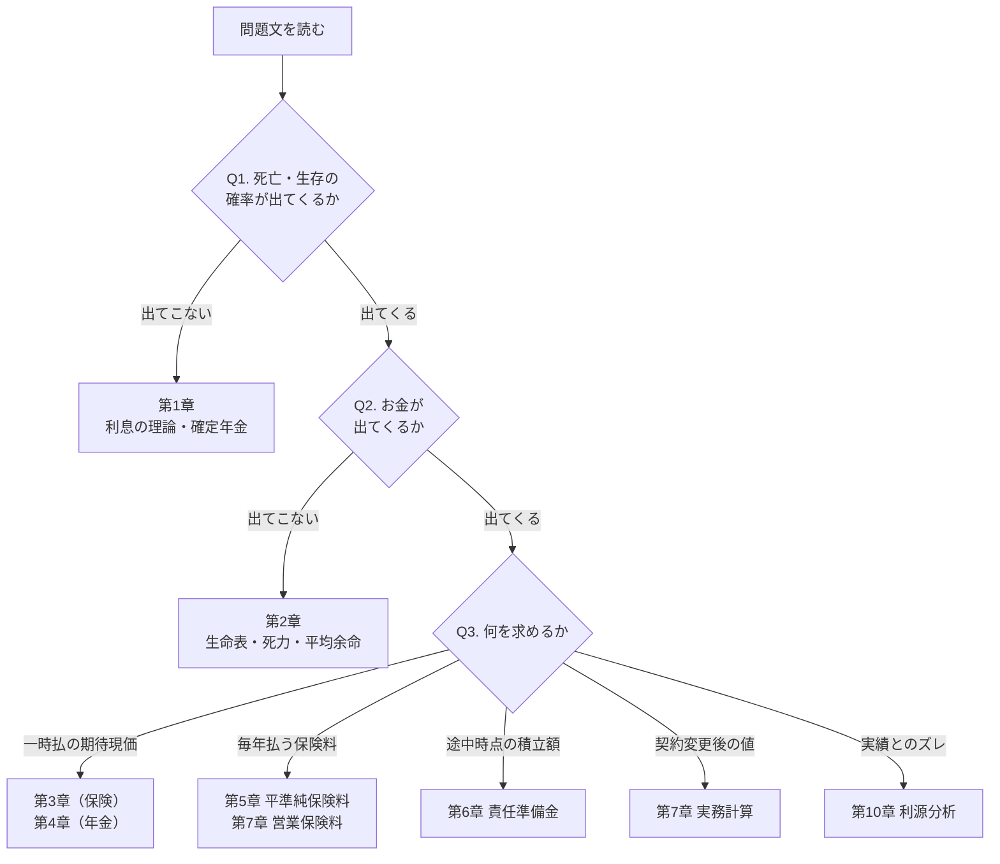
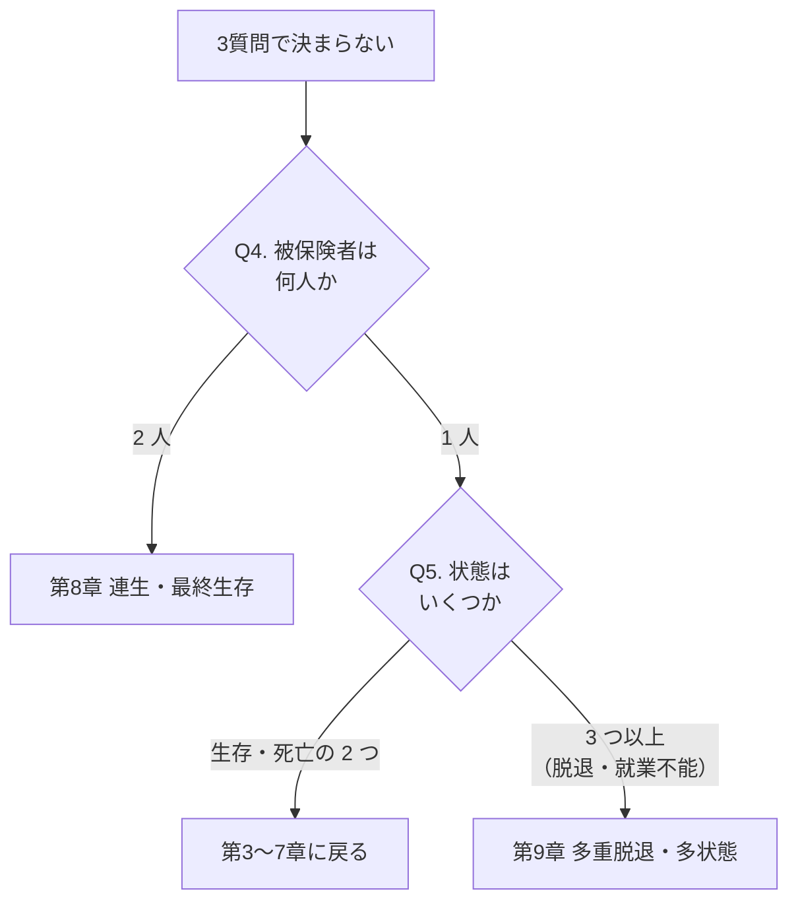
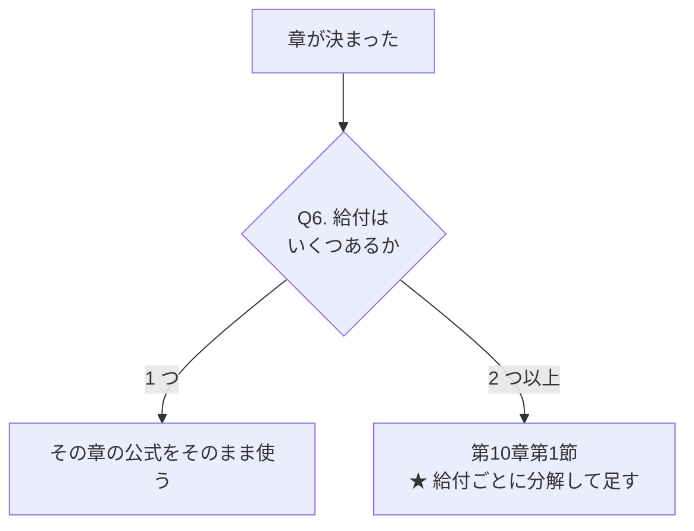

# 問題判別フロー集

**問題文を読んだ瞬間に「どの章の、どの節の、どの公式か」を決めるためのフローチャート集** です。

本テキストの各章末にも判別フローがありますが、ここには **章をまたいだ最上位の判別**
と、**混同しやすい組の切り分け** をまとめています。

**使い方**

- 演習中に手が止まったら §1 の最上位フローに戻る
- 「どちらの公式か」で迷ったら §3 の切り分け表を引く
- 直前期は §5 のチェックリストだけを繰り返す

---

## 目次

| 節 | 内容 |
|---|---|
| [1](#1-最上位の判別フロー) | 最上位の判別フロー（どの章か） |
| [2](#2-キーワード逆引き表) | キーワード逆引き表 |
| [3](#3-混同しやすい組の切り分け) | 混同しやすい組の切り分け |
| [4](#4-章別の判別フロー) | 章別の判別フロー |
| [5](#5-解き始める前の5秒チェック) | 解き始める前の5秒チェック |

---

## 1. 最上位の判別フロー

問題文を読んだら、**次の3つの質問を順に** 自分に投げてください。



**この3質問で決まらない場合**、それは「被保険者が2人以上」または「状態が3つ以上」の問題です。



**最後に、給付が複数あるか**を確認します。



---

## 2. キーワード逆引き表

問題文中の表現から、扱う論点を引くための表です。

### 時点に関する表現

| 表現 | 意味 | 記号 |
|---|---|---|
| 「死亡した年度の末に」「死亡年度末」 | 離散型死亡保険 | $A$ 系 |
| 「死亡した直後に」「死亡と同時に」 | 連続型死亡保険 | $\bar A$ 系 |
| 「毎年初に」「年初に」「期始に」 | 期始払 | $\ddot a$ |
| 「毎年末に」「年末に」「期末に」 | 期末払 | $a$ |
| 「連続的に」「連続払で」 | 連続年金 | $\bar a$ |
| 「年 $m$ 回に分けて」 | 分割払 | $\ddot a^{(m)}$ |
| 「$n$ 年間生存したときは」「満期時に」 | 生存給付 | ${}_nE_x$ |
| 「$m$ 年据置」「$m$ 年後から」 | 据置 | ${}_{m\vert}$ |
| 「第 $t+1$ 保険年度」 | $t$ 年度末 $\to$ $t+1$ 年度末 | ${}_tV\to{}_{t+1}V$ |

### 給付の形に関する表現

| 表現 | 意味 | 記号 |
|---|---|---|
| 「毎年 $1$ ずつ増加し」 | 逓増 | $(IA)$ |
| 「毎年 $1$ ずつ減少し」 | 逓減 | $(DA)$ |
| 「生存している限り」 | 生命年金 | $\ddot a_x$ 等 |
| 「最長 $n$ 年間」 | 有期 | $\ddot a_{x:\overline{n}\vert}$ |
| 「$n$ 年間は死亡しても支払う」 | 保証期間付 | $\ddot a_{\overline{n}\vert}+{}_{n\vert}\ddot a_x$ |
| 「一時金として」 | 一時払 | 期待現価そのもの |

### 複数人・複数状態に関する表現

| 表現 | 意味 | 記号 |
|---|---|---|
| 「2人とも生存している間」「同時生存」 | 連生 | $xy$ |
| 「いずれかが生存している間」「最終生存」 | 最終生存 | $\overline{xy}$ |
| 「$(x)$ が死亡した後、$(y)$ が生存する間」 | 条件付（遺族）年金 | $\ddot a_{x\vert y}$ |
| 「脱退」「解約」「退職」 | 多重脱退 | $q^{(j)}$ |
| 「他の脱退原因がないとすれば」 | 絶対脱退率 | $q'^{(j)}$ |
| 「就業不能」「障害状態」 | 多状態モデル | ${}_tp^{ai}$ |
| 「回復可能」 | $\mu^{ia}>0$。**連立**微分方程式 | — |
| 「回復不能」「回復しない」 | $\mu^{ia}=0$。**逐次的に**解ける | — |
| 「保険料の払込を免除する」 | 払込免除 | 分母が $\bar a^{aa}$ に |

### 実績・実務に関する表現

| 表現 | 意味 | 記号 |
|---|---|---|
| 「実際の運用利回りは」 | 利差益 | $i'-i$ |
| 「実際の死亡者数は」「実際の死亡率は」 | 死差益 | $q-q'$ |
| 「実際の事業費は」 | 費差益 | 予定 $-$ 実際 |
| 「新契約費」「集金費」「維持費」 | 予定事業費 | $\alpha,\beta,\gamma$ |
| 「チルメル」「初年度定期式」 | チルメル責任準備金 | ${}_tV^{Z}$ |
| 「払済保険に変更」 | 保険金額を下げる | $S'$ |
| 「延長定期保険に変更」 | 保険期間を短くする | $s$ |
| 「$N$ 件の契約からなる」 | 契約群団 | $N\times S$ 倍 |

---

## 3. 混同しやすい組の切り分け

### 3.1 $A^1_{x:\overline{n}\vert}$ と $A_{x:\overline{n}\vert}^{\ \ 1}$

```text
   上付き 1 が「どちら側」に付いているか

   A^1_{x : n|}       ← 1 が x の側      → (x) の死亡が先  → 定期保険（死亡給付）
   A_{x : n|}^{  1}   ← 1 が n| の側     → n 年経過が先    → 生存保険（生存給付）

   ★ 「1 が付いている方の事象が先に起きたら支払う」
```

| | 定期保険 $A^1_{x:\overline{n}\vert}$ | 生存保険 ${}_nE_x=A_{x:\overline{n}\vert}^{\ \ 1}$ |
|---|---|---|
| 給付条件 | $n$ 年内に死亡 | $n$ 年後に生存 |
| 支払時点 | 死亡年度末 | $n$ 年後 |
| 基本式 | $\sum_{t=0}^{n-1}v^{t+1}{}_{t\vert}q_x$ | $v^{n}{}_np_x$ |
| 識別語 | 「$n$ 年以内に死亡したとき」 | 「$n$ 年間生存したとき」 |
| 誤りやすい点 | 期末払なので $v^{t+1}$ | $v^n$ だけにしない |

### 3.2 死亡年度末払と死亡直後払

| | 死亡年度末払 $A$ | 死亡直後払 $\bar A$ |
|---|---|---|
| 給付条件 | 死亡 | 死亡 |
| 支払時点 | 死亡した保険年度の末 | 死亡と同時 |
| 基本式 | $\sum v^{t+1}{}_{t\vert}q_x$ | $\int v^{t}{}_tp_x\mu_{x+t}dt$ |
| 識別語 | 「死亡した年度の末に」 | 「死亡した直後に」 |
| 換算 | — | $\bar A^1=\frac{i}{\delta}A^1$（**UDD、死亡給付のみ**） |
| 誤りやすい点 | — | **生存給付に $i/\delta$ を掛けない** |

### 3.3 期始払と期末払

| | 期始払 $\ddot a_x$ | 期末払 $a_x$ |
|---|---|---|
| 支払時点 | 時点 $0,1,2,\dots$ | 時点 $1,2,3,\dots$ |
| 基本式 | $\sum_{t\ge0}v^{t}{}_tp_x$ | $\sum_{t\ge1}v^{t}{}_tp_x$ |
| 関係 | $\ddot a_x=a_x+1$ | $a_x=\ddot a_x-1$ |
| 識別語 | 「毎年初に」「期始に」 | 「毎年末に」「期末に」 |
| 誤りやすい点 | 保険料は原則 $\ddot a$ | 有期では $+1-{}_nE_x$ |

### 3.4 将来法と過去法

| | 将来法 | 過去法 |
|---|---|---|
| 見る方向 | 将来（$t$ 以降） | 過去（$0$ から $t$） |
| 式 | 将来給付 $-$ 将来保険料 | （既収保険料 $-$ 既払給付）$\div\ {}_tE_x$ |
| 使う場面 | 標準。まずこれ | 検算。既収保険料が問われたとき |
| 識別語 | 「$t$ 年度末の責任準備金」 | 「これまでに払い込んだ保険料から」 |
| 誤りやすい点 | 残存期間 $n-t$、年齢 $x+t$ | ${}_tE_x$ で **割る**（掛けない） |

> **両者は同値です。** 契約時の収支相等式を $t$ 時点で切り分けて移項しただけです。
> 数値が一致するかどうかは、最良の検算になります。

### 3.5 単生命・連生・最終生存

| | 単生命 $x$ | 連生 $xy$ | 最終生存 $\overline{xy}$ |
|---|---|---|---|
| 給付条件 | $(x)$ が生存 | **2人とも**生存 | **少なくとも1人**生存 |
| 生存確率 | ${}_tp_x$ | ${}_tp_x{}_tp_y$ | ${}_tp_x+{}_tp_y-{}_tp_x{}_tp_y$ |
| 大小 | — | 最小 | 最大 |
| 識別語 | — | 「2人とも生存している間」 | 「いずれかが生存している間」 |
| 求め方 | 直接 | 直接（等価年齢も可） | **包除原理で分解** |
| 誤りやすい点 | — | 死力は和、確率は積 | 等価年齢を直接使わない |

### 3.6 多重脱退率と絶対脱退率

| | 多重脱退率 $q^{(j)}$ | 絶対脱退率 $q'^{(j)}$ |
|---|---|---|
| 意味 | **この表における** 原因 $j$ の脱退率 | **他原因がなければ** の脱退率 |
| 大小 | 小さい | 大きい（常に $q^{(j)}<q'^{(j)}$） |
| 足せるか | **足せる**（$\sum_j q^{(j)}=q^{(\tau)}$） | **足せない**（$\prod(1-q')=1-q^{(\tau)}$） |
| 識別語 | 「脱退残存表による」 | 「他の脱退原因がないとすれば」 |
| 変換 | $q^{(1)}=q'^{(1)}(1-\tfrac12 q'^{(2)})$ | $q'^{(j)}=1-(1-q^{(\tau)})^{q^{(j)}/q^{(\tau)}}$ |

### 3.7 「状態にいる間」と「遷移の瞬間」

```text
   多状態モデルで最も重要な区別

   状態にいる間（年金型）     ∫ v^t · tp^(ij) dt          ← ★ mu を掛けない
        例：就業不能年金（就業不能状態にある間ずっと）

   遷移の瞬間（保険型）       ∫ v^t · tp^(ik) · mu^(kj) dt ← ★ mu を掛ける
        例：死亡保険金（死亡という遷移が起きた瞬間）
```

| | 状態にいる間 | 遷移の瞬間 |
|---|---|---|
| 給付の型 | 年金 | 保険 |
| 被積分関数 | ${}_tp^{ij}$ | ${}_tp^{ik}\mu^{kj}$ |
| 識別語 | 「〜である間」「〜の状態にある限り」 | 「〜になったとき」「死亡したとき」 |
| 誤りやすい点 | $\mu$ を掛けてしまう | $\mu$ を落としてしまう |

### 3.8 期待現価による直接計算と再帰式

| | 直接計算 | 再帰式 |
|---|---|---|
| 立てる式 | 和・積分（代数式） | 漸化式 |
| 使う場面 | 記号の値が与えられている | 1年ごとの表が与えられている／連続する複数年度 |
| 識別語 | 「$A_x=\cdots$ のとき」 | 「${}_{10}V$ から ${}_{11}V$ を求めよ」 |
| 代表式 | 将来法 ${}_tV=A-P\ddot a$ | Fackler $({}_tV+P)(1+i)=qS+p\,{}_{t+1}V$ |
| 誤りやすい点 | 残存期間の書き換え | 期首に $P$ が入ることを忘れる |

---

## 4. 章別の判別フロー

各章末の判別フローの見出しだけを集めたものです。詳細は各章を参照してください。

| 章 | 判別の第一問 | 分岐 |
|---|---|---|
| 第1章 | 利率は一定か | 一定 → 標準公式／変動 → 区間分割・$\int\delta_s ds$ |
| 第2章 | 与えられたのは何か | 生命表 → 比／死力 → 積分／死亡法則 → 閉形式 |
| 第3章 | 給付はいつ支払われるか | 死亡年度末 → $A$／死亡直後 → $\bar A$／$n$ 年生存 → ${}_nE_x$ |
| 第4章 | 支払の起点と終点は | 期始／期末、有期／終身、据置の有無 |
| 第5章 | 払込期間と保険期間は一致するか | 一致 → 全期払／不一致 → 短期払（分母だけ変わる） |
| 第6章 | 立てる式の型は | 代数式 → 将来法・過去法／漸化式 → Fackler／微分方程式 → Thiele |
| 第7章 | 事業費が出てくるか | 出る → 営業保険料／チルメル／契約変更 |
| 第8章 | 給付条件は「2人とも」か「いずれか」か | 2人とも → $xy$／いずれか → $\overline{xy}$（包除原理） |
| 第9章 | 脱退後に給付は続くか | 続かない → 多重脱退／続く → 多状態モデル |
| 第10章 | 実績値が与えられているか | ない → 複合給付の分解／ある → 利源分析 |

---

## 5. 解き始める前の5秒チェック

**どの問題でも、書き始める前に次の5つを確認してください。**

```text
┌────────────────────────────────────────────────────────────┐
│  ① 誰の契約か                                              │
│       年齢 x、人数（1 人 / 2 人）、状態の数                 │
│                                                            │
│  ② いつ何が起きるか                                        │
│       保険料の払込時点   期始 / 期末、期間 h                │
│       給付の発生時点     死亡年度末 / 直後 / n 年後         │
│       評価時点           t                                 │
│                                                            │
│  ③ 給付はいくつあるか                                      │
│       1 つ  → その章の公式                                 │
│       2 つ以上 → ★ 分解して足す                            │
│                                                            │
│  ④ 何を未知数として求めるか                                │
│       期待現価 / 保険料 / 責任準備金 / 損益 / 年齢・期間    │
│                                                            │
│  ⑤ 使う公式の条件を満たしているか                          │
│       UDD か / 独立か / Gompertz か / 力は一定か            │
└────────────────────────────────────────────────────────────┘
```

**解き終わったら、必ず1つ検算する**（[公式総覧 §18](公式総覧.md#18-横断的に効く恒等式)）。

```text
   保険料を出した      → A = 1 - d ä で逆算
   責任準備金を出した  → 将来法と過去法の両方で
   複合給付を出した    → 内訳の和が全体か
   利源を出した        → 3 利源の和が損益か
   連生を出した        → 包除原理が成り立つか
   多重脱退を出した    → Σ q^(j) = q^(tau) か
   多状態を出した      → Σ tp^(ij) = 1 か
```

---

## 6. 典型的な誤答パターン一覧

**「公式を忘れた」ではなく「条件を確認しなかった」型の失点をまとめたものです。**

| 誤答 | 原因 | 正しくは |
|---|---|---|
| ${}_nE_x$ を $v^n$ で計算 | 生存確率を落とした | $v^{n}{}_np_x$ |
| $A^1_{x:\overline{n}\vert}=1-d\ddot a_{x:\overline{n}\vert}$ | 養老と定期の混同 | 左辺は養老 $A_{x:\overline{n}\vert}$ |
| $\bar A_{x:\overline{n}\vert}=\frac{i}{\delta}A_{x:\overline{n}\vert}$ | 生存給付にも掛けた | 死亡給付部分にのみ |
| ${}^{2}A$ を利率 $2i$ で計算 | 2乗の利率を誤った | $j=2i+i^{2}$ |
| $(DA)^1=nA^1-(IA)^1$ | 係数の誤り | $(n+1)A^1-(IA)^1$ |
| 短期払で分子も変えた | 給付は変わらない | 分母だけ $\ddot a_{x:\overline{h}\vert}$ |
| 危険保険金額を $S$ とした | 責任準備金の戻りを無視 | $S-{}_{t+1}V$ |
| Fackler で $P$ を落とした | 期首の保険料 | $({}_tV+P)(1+i)$ |
| $t$ 年後の逓減保険を $(DA)^1_{x+t:\overline{n}\vert}$ | 期間を直さなかった | $(DA)^1_{x+t:\overline{n-t}\vert}$ |
| 絶対脱退率を足して $q^{(\tau)}$ | 積の関係 | $1-q^{(\tau)}=\prod(1-q'^{(j)})$ |
| 変換公式の $\frac12$ を落とした | UDD の効果 | $q'^{(1)}(1-\frac12 q'^{(2)})$ |
| 就業不能年金に $\mu$ を掛けた | 状態と遷移の混同 | 状態は $\mu$ なし |
| 最終生存に等価年齢を直接使った | 適用範囲 | 包除原理で分解してから |
| Makeham で $c^w=c^x+c^y$ | 定数項 $A$ が $2A$ になる | 同年齢等価年齢 $w'$ |
| 群団の期末責準を $N$ 件で計算 | 死亡者を引き忘れた | $(N-D)$ 件 |
| 予定死亡者数を整数に丸めた | 期待値である | $Nq$ のまま |
| 給付の分散を足した | 共分散を無視 | $Z$ を作り直す |

---

> [← 公式総覧](公式総覧.md) ｜ [記号一覧](記号一覧.md) ｜ [トップへ](../../README.md)
